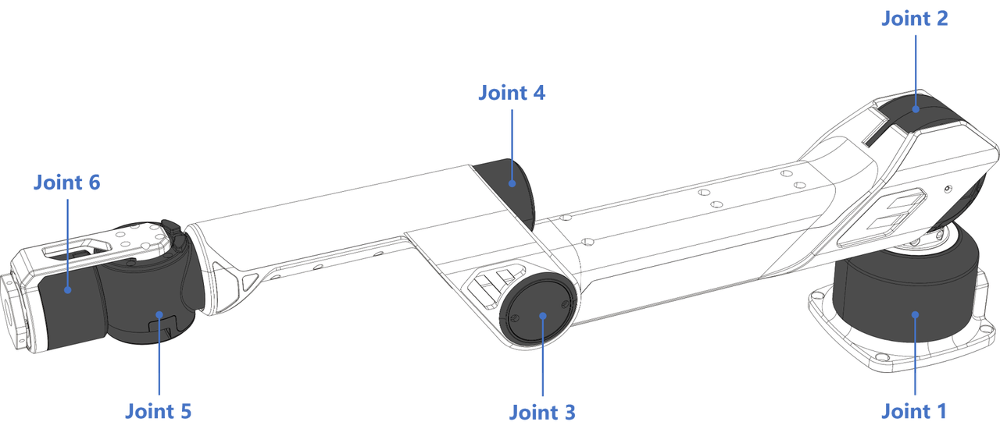
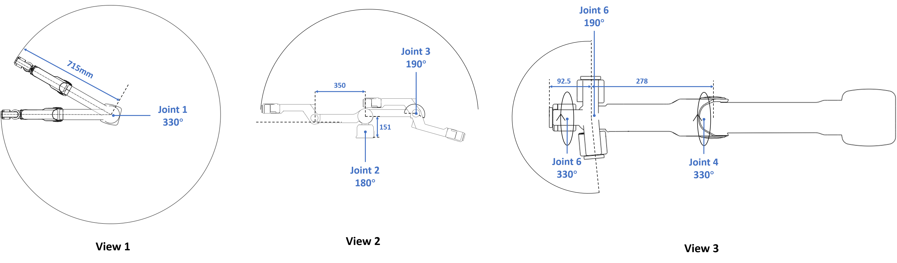
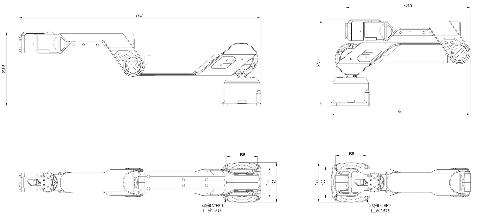
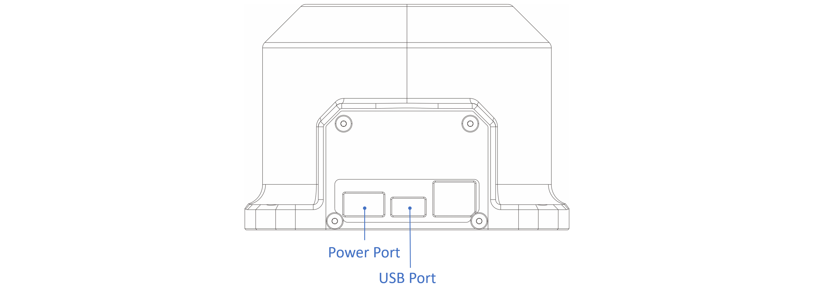
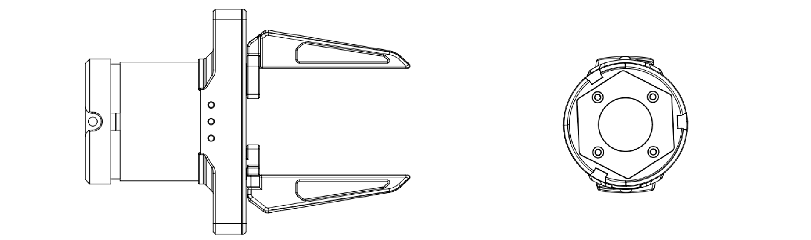
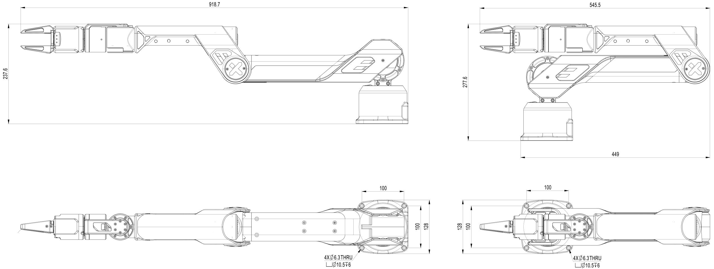

# A1 Hardware Guide

This manual provides engineering data and user guidance for working with the Galaxea Robot A1 hardware.

## Disclaimer

<u>Galaxea A1 is intended for research applications by users experienced in operating and programming research robots. This product is not designed for general consumer use in the home and does not have the necessary certifications for such purposes.</u>

## Technical Specification

<table style="border-collapse: collapse;">
    <thead>
        <tr style="background-color: black; color: white; text-align: left;">
            <th style="width: 200px; padding: 8px; border: 1px solid #ddd;">Mechanical</th>
            <th style="width: 400px; padding: 8px; border: 1px solid #ddd;">Values</th>
        </tr>
    </thead>
    <tbody>
        <tr style="background-color: white; text-align: left;">
            <td style="vertical-align: middle; padding: 8px; border: 1px solid #ddd;">Dimensions</td>
            <td style="vertical-align: middle; padding: 8px; border: 1px solid #ddd;">Deployed: 775L x 128W x 237H mm Folded: 449L x 128W x 277H mm</td>
        </tr>
        <tr style="background-color: white; text-align: left;">
            <td style="vertical-align: middle; padding: 8px; border: 1px solid #ddd;">Weight</td>
            <td style="vertical-align: middle; padding: 8px; border: 1px solid #ddd;">6 kg</td>
        </tr>
        <tr style="background-color: white; text-align: left;">
            <td style="vertical-align: middle; padding: 8px; border: 1px solid #ddd;">Nominal Voltage</td>
            <td style="vertical-align: middle; padding: 8px; border: 1px solid #ddd;">48 V</td>
        </tr>
        <tr style="background-color: white; text-align: left;">
            <td style="vertical-align: middle; padding: 8px; border: 1px solid #ddd;">Rated Current</td>
            <td style="vertical-align: middle; padding: 8px; border: 1px solid #ddd;">30 A</td>
        </tr>
        <tr style="background-color: white; text-align: left;">
            <td style="vertical-align: middle; padding: 8px; border: 1px solid #ddd;">Maximum Current</td>
            <td style="vertical-align: middle; padding: 8px; border: 1px solid #ddd;">50 A</td>
        </tr>
        <tr style="background-color: white; text-align: left;">
            <td style="vertical-align: middle; padding: 8px; border: 1px solid #ddd;">Communication Interface</td>
            <td style="vertical-align: middle; padding: 8px; border: 1px solid #ddd;">USB 2.0 port</td>
        </tr>
    </tbody>
</table>

<table style="width: 100%; border-collapse: collapse;">
    <thead>
        <tr style="background-color: black; color: white; text-align: left;">
            <th style="width: 200px; padding: 8px; border: 1px solid #ddd;">Performance</th>
            <th style="width: 400px; padding: 8px; border: 1px solid #ddd;">Values</th>
        </tr>
    </thead>
    <tbody>
        <tr style="background-color: white; text-align: left;">
            <td style="vertical-align: middle; padding: 8px; border: 1px solid #ddd;">Rated Payload</td>
            <td style="vertical-align: middle; padding: 8px; border: 1px solid #ddd;">2 kg</td>
        </tr>
        <tr style="background-color: white; text-align: left;">
            <td style="vertical-align: middle; padding: 8px; border: 1px solid #ddd;">Maximum Payload</td>
            <td style="vertical-align: middle; padding: 8px; border: 1px solid #ddd;">5 kg</td>
        </tr>
        <tr style="background-color: white; text-align: left;">
            <td style="vertical-align: middle; padding: 8px; border: 1px solid #ddd;">Arm Reach</td>
            <td style="vertical-align: middle; padding: 8px; border: 1px solid #ddd;">700 mm</td>
        </tr>
        <tr style="background-color: white; text-align: left;">
            <td style="vertical-align: middle; padding: 8px; border: 1px solid #ddd;">Maximum End Linear Velocity</td>
            <td style="vertical-align: middle; padding: 8px; border: 1px solid #ddd;">10 m/s</td>
        </tr>
        <tr style="background-color: white; text-align: left;">
            <td style="vertical-align: middle; padding: 8px; border: 1px solid #ddd;">Maximum End Acceleration</td>
            <td style="vertical-align: middle; padding: 8px; border: 1px solid #ddd;">40 m/s²</td>
        </tr>
        <tr style="background-color: white; text-align: left;">
            <td style="vertical-align: middle; padding: 8px; border: 1px solid #ddd;">Degree of Freedom</td>
            <td style="vertical-align: middle; padding: 8px; border: 1px solid #ddd;">6</td>
        </tr>
        <tr style="background-color: white; text-align: left;">
            <td style="vertical-align: middle; padding: 8px; border: 1px solid #ddd;">Repeatability</td>
            <td style="vertical-align: middle; padding: 8px; border: 1px solid #ddd;">1 mm</td>
        </tr>
    </tbody>
</table>

## Hardware Structure

## Robot Structure

### Joint

The joint performance parameters detail the operating range, rated torque, and peak torque of the six joints, showcasing the robot's flexibility and power across a variety of operations.

<table style="width: 100%; border-collapse: collapse;">
    <thead>
        <tr style="background-color: black; color: white; text-align: left;">
            <th style="width: 200px; padding: 8px; border: 1px solid #ddd;">Joint</th>
            <th style="width: 200px; padding: 8px; border: 1px solid #ddd;">Range</th>
            <th style="width: 200px; padding: 8px; border: 1px solid #ddd;">Rated Torque</th>
        </tr>
    </thead>
    <tbody>
        <tr style="background-color: white; text-align: left;">
            <td style="padding: 8px; border: 1px solid #ddd;">Joint 1</td>
            <td style="padding: 8px; border: 1px solid #ddd;">[-165°, 165°]</td>
            <td style="padding: 8px; border: 1px solid #ddd;">20 Nm</td>
        </tr>
        <tr style="background-color: white; text-align: left;">
            <td style="padding: 8px; border: 1px solid #ddd;">Joint 2</td>
            <td style="padding: 8px; border: 1px solid #ddd;">[0°, 180°]</td>
            <td style="padding: 8px; border: 1px solid #ddd;">20 Nm</td>
        </tr>
        <tr style="background-color: white; text-align: left;">
            <td style="padding: 8px; border: 1px solid #ddd;">Joint 3</td>
            <td style="padding: 8px; border: 1px solid #ddd;">[0°, 190°]</td>
            <td style="padding: 8px; border: 1px solid #ddd;">9 Nm</td>
        </tr>
        <tr style="background-color: white; text-align: left;">
            <td style="padding: 8px; border: 1px solid #ddd;">Joint 4</td>
            <td style="padding: 8px; border: 1px solid #ddd;">[-165°, 165°]</td>
            <td style="padding: 8px; border: 1px solid #ddd;">3 Nm</td>
        </tr>
        <tr style="background-color: white; text-align: left;">
            <td style="padding: 8px; border: 1px solid #ddd;">Joint 5</td>
            <td style="padding: 8px; border: 1px solid #ddd;">[-95°, 95°]</td>
            <td style="padding: 8px; border: 1px solid #ddd;">3 Nm</td>
        </tr>
        <tr style="background-color: white; text-align: left;">
            <td style="padding: 8px; border: 1px solid #ddd;">Joint 6</td>
            <td style="padding: 8px; border: 1px solid #ddd;">[-105°, 105°]</td>
            <td style="padding: 8px; border: 1px solid #ddd;">3 Nm</td>
        </tr>
    </tbody>
</table>

- View 1: Shows the working radius and rotation angle of Joint 1, with a rotation radius of 715 mm and a maximum rotation angle of 330 degrees.
- View 2: Displays the rotation ranges for Joint 2 and Joint 3, with a maximum rotation angle of 180 degrees for Joint 2 and 190 degrees for Joint 3.
- View 3: Illustrates the rotation angles of Joints 4, 5, and 6, as well as the end position of the robot arm. The maximum rotation angle for Joint 4 and 6 is 330 degrees, while Joint 5 has a maximum rotation angle of 190 degrees.

### Link

Galaxea A1 consists of two main links made from Acrylonitrile Butadiene Styrene (ABS), which is lightweight, rigid and durable. Each joint is equipped with planetary gear motors, enabling independent variable-speed operation with high precision and torque. This design allows the arm to maneuver in any direction commanded by the controller.

In the current version, the motor does not have a brake, so cutting off the power may cause the robot arm to drop suddenly. We will continue to improve the product to address this issue.

### Base

Galaxea A1 features two ports on the rear of the base for development and charging.

<table style="width: 100%; border-collapse: collapse;">
    <thead>
        <tr style="background-color: black; color: white; text-align: left;">
            <th style="width: 200px; padding: 8px; border: 1px solid #ddd;">Item</th>
            <th style="width: 300px; padding: 8px; border: 1px solid #ddd;">Notes</th>
        </tr>
    </thead>
    <tbody>
        <tr style="background-color: white; text-align: left;">
            <td style="padding: 8px; border: 1px solid #ddd;">Charging Port</td>
            <td style="padding: 8px; border: 1px solid #ddd;">Rated voltage 48 V</td>
        </tr>
        <tr style="background-color: white; text-align: left;">
            <td style="padding: 8px; border: 1px solid #ddd;">USB Port</td>
            <td style="padding: 8px; border: 1px solid #ddd;">USB 2.0</td>
        </tr>
        <tr style="background-color: white; text-align: left;">
            <td style="padding: 8px; border: 1px solid #ddd;">Mounting Holes</td>
            <td style="padding: 8px; border: 1px solid #ddd;">Four M6 threads with a diameter of 6.3 mm</td>
        </tr>
        <tr style="background-color: white; text-align: left;">
            <td style="padding: 8px; border: 1px solid #ddd;">Size</td>
            <td style="padding: 8px; border: 1px solid #ddd;">100 mm x 100 mm</td>
        </tr>
    </tbody>
</table>

### End-Effector

#### Galaxea G1

Galaxea G1 is composed of one motor, two clips, and one specially designed joint module.

*Note: No gripper is included with the product. You can contact us and purchase end-effectors or customized tools if needed.*

<table style="width: 60%; border-collapse: collapse;">
    <thead>
        <tr style="background-color: black; color: white; text-align: left;">
            <th style="width: 300px; padding: 8px; border: 1px solid #ddd;">Feature</th>
            <th style="width: 400px; padding: 8px; border: 1px solid #ddd;">Value</th>
        </tr>
    </thead>
    <tbody>
        <tr style="background-color: white; text-align: left;">
            <td style="padding: 8px; border: 1px solid #ddd;">Length</td>
            <td style="padding: 8px; border: 1px solid #ddd;">149 mm</td>
        </tr>
        <tr style="background-color: white; text-align: left;">
            <td style="padding: 8px; border: 1px solid #ddd;">Length of Fingers</td>
            <td style="padding: 8px; border: 1px solid #ddd;">77 mm</td>
        </tr>
        <tr style="background-color: white; text-align: left;">
            <td style="padding: 8px; border: 1px solid #ddd;">Diameter of Motor</td>
            <td style="padding: 8px; border: 1px solid #ddd;">60 mm</td>
        </tr>
        <tr style="background-color: white; text-align: left;">
            <td style="padding: 8px; border: 1px solid #ddd;">Gripper Operating Range</td>
            <td style="padding: 8px; border: 1px solid #ddd;">0~60 mm</td>
        </tr>
        <tr style="background-color: white; text-align: left;">
            <td style="padding: 8px; border: 1px solid #ddd;">Gripper Force</td>
            <td style="padding: 8px; border: 1px solid #ddd;">100 N</td>
        </tr>
    </tbody>
</table>

Equipped with the end-effector, [Galaxea G1](../../Introducing_Galaxea_Robot/product_info/A1_accessory_G1.md), should have:

<table style="width: 100%; border-collapse: collapse;">
    <thead>
        <tr style="background-color: black; color: white; text-align: left;">
            <th style="width: 200px; padding: 8px; border: 1px solid #ddd;">Item</th>
            <th style="width: 300px; padding: 8px; border: 1px solid #ddd;">Notes</th>
        </tr>
    </thead>
    <tbody>
        <tr style="background-color: white; text-align: left;">
            <td style="padding: 8px; border: 1px solid #ddd;">Dimensions</td>
            <td style="padding: 8px; border: 1px solid #ddd;">Deployed: 918L x 128W x 237H mm Folded: 545L x 128W x 277H mm</td>
        </tr>
        <tr style="background-color: white; text-align: left;">
            <td style="padding: 8px; border: 1px solid #ddd;">Degree of Freedom</td>
            <td style="padding: 8px; border: 1px solid #ddd;">7</td>
        </tr>
    </tbody>
</table>

##### Attaching

Here it shows how to attach gripper to A1. To remove them, simply reverse these steps.

    

    

1. **Alignment Check**: Ensure that the four protruding points on the gripper align perfectly with the corresponding recessed points on the robot arm's end effector mount. Proper alignment ensures the gripper is correctly positioned and centered.
2. **Initial Placement**: Carefully place the gripper onto the robot arm's end effector mount, ensuring that the protrusions fit snugly into the recesses. This step is crucial for achieving the correct orientation and balance.
3. **Screw Fixation**: Once aligned, secure the gripper to the robot arm using the three screws provided. These screws should be placed around the outer circle of the mounting area, as shown in the figure. Tighten the screws evenly to prevent any skewing or misalignment.
4. **Final Check**: After tightening the screws, double-check the alignment and stability of the gripper. It should be firmly attached and not wobble or move independently of the robot arm.
5. **Testing**: Before using the robot arm, perform a test run to ensure that the gripper moves smoothly and holds objects securely without any slippage or unexpected movement.

#### [Inspire-Robots RH56 Series Dexterous Hand](https://en.inspire-robots.com/product/rh56dfx)

The dexterous hand boasts significant gripping strength and moderate speed, making it suitable for grasping and manipulating tasks in robotics or prosthetic applications. Its combination of power and control allows for effective handling of various objects, similar to the versatility of a human hand, thereby enhancing the functionality of robots or prostheses in performing complex tasks.

<table style="width: 100%; border-collapse: collapse;">
    <thead>
        <tr style="background-color: black; color: white; text-align: left;">
            <th style="width: 30%; padding: 8px; border: 1px solid #ddd;">Feature</th>
            <th style="width: 30%; padding: 8px; border: 1px solid #ddd;">Value</th>
        </tr>
    </thead>
    <tbody>
        <tr style="background-color: white; text-align: left;">
            <td style="padding: 8px; border: 1px solid #ddd;">Degrees of Freedom</td>
            <td style="padding: 8px; border: 1px solid #ddd;">6</td>
        </tr>
        <tr style="background-color: white; text-align: left;">
            <td style="padding: 8px; border: 1px solid #ddd;">Number of Joints</td>
            <td style="padding: 8px; border: 1px solid #ddd;">12</td>
        </tr>
        <tr style="background-color: white; text-align: left;">
            <td style="padding: 8px; border: 1px solid #ddd;">Weight</td>
            <td style="padding: 8px; border: 1px solid #ddd;">540 g</td>
        </tr>
        <tr style="background-color: white; text-align: left;">
            <td style="padding: 8px; border: 1px solid #ddd;">Repeatability</td>
            <td style="padding: 8px; border: 1px solid #ddd;">±0.20 mm</td>
        </tr>
        <tr style="background-color: white; text-align: left;">
            <td style="padding: 8px; border: 1px solid #ddd;">Max. Finger Grip Force</td>
            <td style="padding: 8px; border: 1px solid #ddd;">10 N</td>
        </tr>
    </tbody>
</table>

## Next Step

This concludes the hardware guide for Galaxea A1. For further details, please refer to [Galaxea A1 Software Guide](Software_Guide.md).

