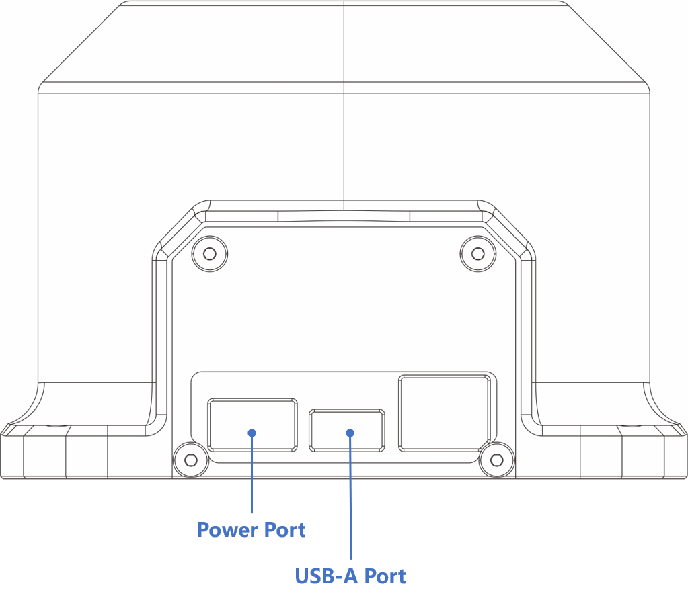

# A1 Hardware Guide
This manual provides the engineering data and user guidance for working with the Galaxea Robot A1 hardware.

## Safety Guide

Galaxea robots are potentially dangerous machines with safety hazards. 
**If improperly used they can cause injury or death.**

- **All users must carefully read the following safety information before using the robot.**
- Anyone near the robot who has not read this safety information must be closely supervised at all times and made aware that the robot could be dangerous.
- Only use the robot after inspecting the surrounding environment for potential hazards.

### Intended use
**The Galaxea robot is explicitly designed for use by researchers in highly controlled indoor scientific environments.**
As it has not undergone the certification process required for other uses (e.g., consumer use in a home environment), 
this product is not recommended or suitable for such unspecified uses.

### Safety Hazards
As we described later in this document, our design of A1 is safer than previous commercial robotic arms, 
so researchers can explore more different use scenarios.

Still, A1 is a potentially dangerous research robot. 
Researchers must use it carefully to avoid damage, injury, or death. 
Here, we list several safety concerns that researchers must consider before and when using A1.

#### Operation Guide for Electrical Safety
A1 is one highly electrified device that integrates motors, precision electronics, 
intricate wires, and other important electrical components. 
To provide power connections, A1 is also equipped with exposed connectors. 
Although A1 is designed with fuses to reduce potential electrical risks, 
users still need to be extremely vigilant when using it. 
Make sure the arm is dry and away from any form of liquid to prevent electric shock. 
At the same time, regularly check the integrity of the power cord and wire, 
carefully operate the connector of the robot, 
and maintain continuous attention to electrical safety throughout the use process.

#### Safety Tips for Loose Clothing and Hair
A1 has several twisting joints providing great flexibility and the potential to accidentally pull in and pinch the users' loose clothing or hair. 
To avoid this situation, it is recommended that when using the A1 robot arm, 
users wear clothes that fit and are not easy to be hooked, 
and try to tie up long hair or wear hair nets and other protective measures. 
Remain vigilant to ensure the personal safety of yourself or others while moving in the working area of the robotic arm.

### Additional Risks
The key to safe use of A1 arm is indeed good judgment and common sense, 
while following a strict set of operating guidelines. 

#### Stop using with any damage
Once find any signs of damage to the robot arm, 
such as abnormal noise, poor movement, loose parts, etc., users should stop using it immediately. 
The damaged arm may be a safety hazard, and its continued use may lead to accidents.

#### Maintain the ability to stop/shut down at any time
When operating the robot arm, users shall at all times maintain a distance from which the movement of the robot arm can be quickly and safely stopped. 
Make sure the emergency stop button on PC or charging cable is easy to reach and can respond immediately in an emergency.

#### Limit the operation by non-specialists
The complexity and potential hazards of A1 robotic arm require users to have specialized knowledge and experience. 
Non-professionals should be avoided from approaching or operating the arm unless an experienced user is present and fully engaged to direct or operate it.

#### Ensure wire safety
When the robot arm is working, its wires and cables may be pulled or worn due to movement. 
Users should regularly check whether the wire connection is firm, 
whether the wire surface is damaged, and ensure that the wire will not be tripped or stepped on during the movement of the mechanical arm.

#### Avoid outdoor operation
A1 is designed for indoor environments, 
and their construction and materials may not be suitable for outdoor use. 
Factors such as wind, rain, dust and temperature changes in the outdoor environment can cause damage to the robot arm, 
affecting its performance and safety.

## Disclaimer
<u>The Galaxea robots are explicitly designed for use by researchers in highly controlled indoor scientific environments. 
As it has not undergone the certification process required for other uses (e.g., consumer use in a home environment), 
this product is not recommended or suitable for such unspecified uses.</u>

## Technical Specification
### Electric Parameters
The electrical parameters of A1 robotic arm cover its voltage, 
current and communication interface. 
Its design ensures stable and reliable performance in high payload and dynamic applications.

### Performance Parameters
The performance parameters show A1's key parameters, 
such as weight, payload capacity, arm span and speed, 
which reflect its superior performance in highly dynamic operation.

| Performance                          | Parameter  |
|--------------------------------------|------------|
| Weight                               | $6kg$      |
| Rated Payload                        | $2kg@0.5m$ |
| Maximum Payload                      | $5kg@0.5m$ |
| Reach                                | $700mm$    |
| Maximum End-Effector Linear Velocity | $10m/s$    |
| Maximum End-Effector Acceleration    | $40m/s^2$  |
| Maximum Gripping Force               | $200N$     |
| Repeatability Accuracy               | $1mm$      |

## Hardware Architecture

### Base
A1 has only two ports on the rear of the base for development and charging.

| Item           | Notes                                  |
|----------------|----------------------------------------|
| Charging port  | Rated voltage 48V                      |
| USB port       | USB2.0                                 |
| Mounting holes | Four M6 threads in a diameter of 6.3mm |
| Size           | 100mm x 100mm                          |

### Link
Each arm comprises two Acrylonitrile Butadiene Styrenelinks set on base. 
These two links are connected by six joints, 
each of which is a planetary gear motor that enables high precision and high torque.

A1 robotic arm is an integrated unit, 
which means it comes fully assembled and ready to use once the base is fixed in a platform by users.

  
  

The arm is designed to have:

| Item                | Notes                                     |
|---------------------|-------------------------------------------|
| Length              | Deployed $775.1mm$   Folded $449mm$   |
| Height              | Deployed $237.6mm$   Folded $277.6mm$ |
| Width               | $128mm$                                   |
| Reach               | $0.7m$                                    |
| Degree of Freedom   | $6$                                       |
| Maximum Payload     | $5kg$                                     |
| Weight              | $6kg$                                     |

### Joint
The joint performance parameters detail the operating range, 
rated torque and peak torque of six joints, 
demonstrating its flexibility and power in a variety of operations.

| Joint   | Range           | Rated Torque |
|---------|-----------------|--------------|
| Joint 1 | $[-165°, 165°]$ | $20 Nm$      |
| Joint 2 | $[0°, 180°]$    | $20 Nm$      |
| Joint 3 | $[0°, 190°]$    | $9 Nm$       |
| Joint 4 | $[-165°, 165°]$ | $3 Nm$       |
| Joint 5 | $[-95°, 95°]$   | $3 Nm$       |
| Joint 6 | $[-105°, 105°]$ | $3 Nm$       |

View 1 shows the working radius and rotation angle of **Joint 1**, 
with a rotation radius of 780mm and a maximum rotation angle of 330 degrees.

View 2 shows the rotation ranges for **Joint 2 and Joint 3**. 
The maximum rotation angle of Joint 2 is 180 degrees, and the maximum rotation angle of Joint 3 is 190 degrees.

View 3 shows the rotation angle of **Joint 4,5,6** and the end position of the robotic arm. 
The maximum rotation angle of Joint 4 and Joint 6 is 330 degrees, 
and the maximum rotation angle of Joint 5 is 190 degrees. 
The distance between two fingertips is 60mm.

### Gripper
The gripper is composed of one motor, two clips, and one specially designed joint module.

No gripper comes with the probduct. You can purchase end-effectors or customized tools from the Galaxea AI website, if needed.

  
  

| Feature                 | Value       |
|-------------------------|-------------|
| Length                  | 149.63mm    |
| Length of Fingers       | 77.45mm     |
| Diameter of Motor       | 60.4mm      |
| Gripper Operating Range | [0mm, 60mm] |
| Gripper Rated Force     | 100 N       |

A1 arm with gripper should have:

  
  

| Item              | Notes                            |
|-------------------|----------------------------------|
| Length            | Deployed 918.6mm, Folded 545.4mm |
| Height            | Deployed 237.6mm, Folded 277.6mm |
| Width             | 128mm                            |
| Degree of Freedom | 7                                |
| Maximum Payload   | 5kg                              |
| Weight            | 6kg                              |

#### Gripper Attaching

1. **Alignment Check**: Ensure that the four protruding points on the gripper side align perfectly with the corresponding recessed points on the robotic arm's end effector mount. This alignment ensures that the gripper is properly positioned and centered.
2. **Initial Placement**: Carefully place the gripper onto the robotic arm's end effector mount, making sure that the protrusions fit snugly into the recesses. This step is crucial for achieving the correct orientation and balance.
3. **Screw Fixation**: Once aligned, secure the gripper to the robotic arm using three screws provided. These screws go around the outer circle of the mounting area, as shown in the figure. Tighten the screws evenly to prevent any skewing or misalignment.
4. **Final Check**: After tightening the screws, double-check the alignment and stability of the gripper. It should be firmly attached and not wobble or move independently of the robotic arm.
5. **Testing**: Before using the robotic arm, perform a test run to ens

## Robot Care
1. **Keet it clean**: In order to maintain the good operating condition of the robotic arm and extend its service life, 
regular cleaning work should be carried out. 
Alcohol wipes or wet and clean rags can be used to gently wipe the surface of the robot arm, 
including the shell, base and other components, to effectively remove debris, oil and other impurities attached to it.
