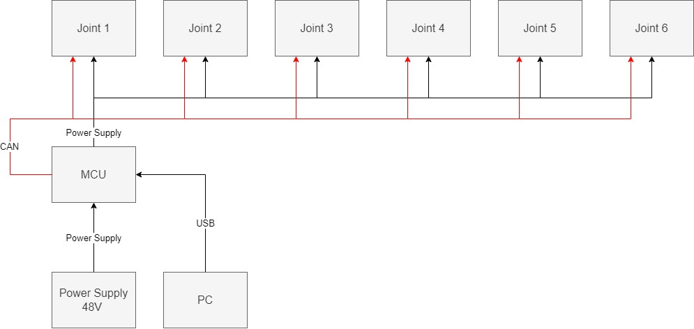
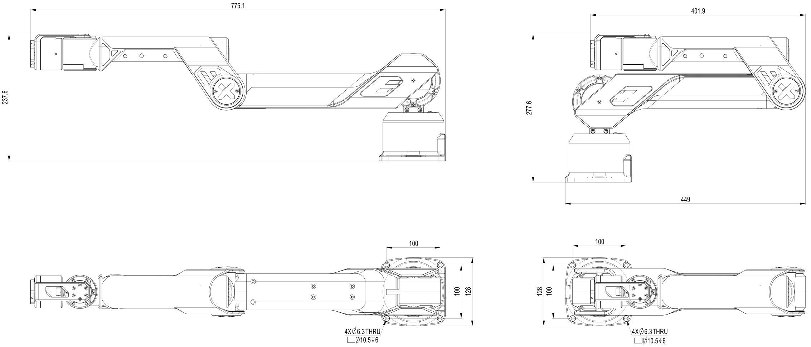

# Hardware Guide
This manual provides engineering data and user guidance for working with the Galaxea Robot A1 hardware.

## Safety Guide

Galaxea robots are potentially dangerous machines with safety hazards. If improperly used, they can cause injury.

- All users must carefully read the following safety information before using the robot.
- Anyone near the robot who has not read this safety information must be closely supervised at all times and made aware that the robot could be dangerous.
- Only use the robot after inspecting the surrounding environment for potential hazards.

### Intended use
The Galaxea robot is explicitly designed for use by researchers in highly controlled indoor scientific environments.Since it has not undergone the certification process required for other uses (e.g., consumer use in a home environment), this product is not recommended or suitable for such unspecified uses.

### Safety Hazards
As described later in this document, the design of A1 is safer than previous commercial robot arms, allowing researchers to explore a broader range of use scenarios. However, A1 is still a potentially dangerous research robot. Researchers must use it with caution to avoid damage, injury, or death. Here, we outline several safety concerns that researchers must consider before and during the use of A1.

#### Operation Guide for Electrical Safety: 
A1 is a highly electrified device that integrates motors, precision electronics, intricate wires, and other critical electrical components. It is equipped with exposed connectors for power connections. While A1 is designed with fuses to mitigate potential electrical risks, users must remain extremely vigilant. Ensure the arm is dry and away from any form of liquid to prevent electric shock. Additionally, regularly inspect the power cord and wires, handle the robot's connectors carefully, and maintain continuous attention to electrical safety throughout use.

#### Safety Tips for Loose Clothing and Hair
A1 has several twisting joints that provide great flexibility and pose a risk of accidentally pulling in and pinching loose clothing or hair. To avoid this, it is recommended that users wear well-fitting clothes that are less likely to get caught and tie up long hair or use hair nets and other protective measures. Always remain vigilant to ensure your safety and that of others while moving in the working area of the robot arm.

### Additional Risks
The key to safe use of the A1 arm is indeed good judgment and common sense, while following a strict set of operating guidelines.

- **Stop Using if Damaged**: If any signs of damage are detected, such as abnormal noise, erratic movement, or loose parts, stop using the robot arm immediately. A damaged arm can pose a safety hazard, and continued use may lead to accidents.
- **Maintain Immediate Stop Capability**: While operating the robot arm, ensure you are always within reach to quickly and safely stop its movement. Make sure the emergency stop button on the PC or charging cable is easily accessible and responds promptly in an emergency.
- **Limit Operation to Specialists**: Due to the complexity and potential hazards of the A1 robot arm, only users with specialized knowledge and experience should operate it. Non-professionals should avoid approaching or operating the arm unless under the supervision of an experienced user.
- **Ensure Wire Safety**: During operation, the robot arm’s wires and cables may be pulled or worn. Regularly check the integrity of the wire connections and the condition of the wire surfaces. Ensure that wires are not tripped over or stepped on during the arm’s movement.
- **Avoid Outdoor Operation**: The A1 is designed for indoor environments. Its construction and materials may not be suitable for outdoor use. Outdoor factors such as wind, rain, dust, and temperature changes can damage the robot arm, impacting its performance and safety.

## Disclaimer
<u> Galaxea Robots are explicitly designed for use by researchers in highly controlled indoor scientific environments. Since they have not undergone the certification process required for other uses (e.g., consumer use at home), these products are not recommended or suitable for such unspecified applications. </u>

## Technical Specification
### Electric Parameters
The electrical parameters of A1 robot arm include its voltage, current, and communication interface. Its design ensures stable and reliable performance, even in high payload and dynamic applications.
<table style="border-collapse: collapse;">
    <thead>
        <tr style="background-color: black; color: white;text-align: left;">
            <th>Parameters</th>
            <th>Value</th>
        </tr>
    </thead>
    <tbody>
        <tr style="background-color: white;text-align: left;">
            <td>Nominal Voltage</td>
            <td>48 V</td>
        </tr>
        <tr style="background-color: white;text-align: left;">
            <td>Rated Current</td>
            <td>30 A</td>
        </tr>
        <tr style="background-color: white;text-align: left;">
            <td>Maximum Current</td>
            <td>50 A</td>
        </tr>
        <tr style="background-color: white;text-align: left;">
            <td>Communication Interface</td>
            <td>USB Serial Port</td>
        </tr>
    </tbody>
</table>

### Performance Parameters
The performance parameters highlight A1's key specifications, such as weight, payload capacity, arm reach, and speed, reflecting its superior performance in highly dynamic operations.
<table style="border-collapse: collapse;">
    <thead>
        <tr style="background-color: black; color: white;text-align: left;">
            <th>Performance</th>
            <th>Value</th>
        </tr>
    </thead>
    <tbody>
        <tr style="background-color: white;text-align: left;">
            <td>Weight</td>
            <td>6 kg</td>
        </tr>
        <tr style="background-color: white;text-align: left;">
            <td>Rated Payload</td>
            <td>2 kg</td>
        </tr>
        <tr style="background-color: white;text-align: left;">
            <td>Maximum Payload</td>
            <td>5 kg</td>
        </tr>
        <tr style="background-color: white;text-align: left;">
            <td>Reach</td>
            <td>700 mm</td>
        </tr>
		<tr style="background-color: white;text-align: left;">
            <td>Maximum End-Effector Linear Velocity</td>
            <td>10 m/s</td>
        </tr>
		<tr style="background-color: white;text-align: left;">
            <td>Maximum End-Effector Acceleration</td>
            <td>10 m/s²</td>
        </tr>
		<tr style="background-color: white;text-align: left;">
            <td>Maximum Gripping Force</td>
            <td>200 N</td>
        </tr>
		<tr style="background-color: white;text-align: left;">
            <td>Repeatability</td>
            <td>1 mm</td>
    </tbody>
</table>

## Hardware Structure

## Robot Structure 
### Joint
The joint performance parameters detail the operating range, rated torque, and peak torque of the six joints, showcasing the robot's flexibility and power across a variety of operations.

<table style="border-collapse: collapse;">
    <thead>
        <tr style="background-color: black; color: white;text-align: left;">
            <th>Joint</th>
            <th>Range</th>
	    <th>Rated Torque</th>
        </tr>
    </thead>
    <tbody>
        <tr style="background-color: white;text-align: left;">
            <td>Joint 1</td>
            <td>[-165°, 165°]</td>
			<td>20 Nm</td>
        </tr>
        <tr style="background-color: white;text-align: left;">
            <td>Joint 2</td>
            <td>[0°, 180°]</td>
			<td>20 Nm</td>
        </tr>
        <tr style="background-color: white;text-align: left;">
            <td>Joint 3</td>
            <td>[0°, 190°]</td>
			<td>9 Nm</td>
        </tr>
        <tr style="background-color: white;text-align: left;">
            <td>Joint 4</td>
            <td>[-165°, 165°]</td>
			<td>3 Nm</td>
        </tr>
		<tr style="background-color: white;text-align: left;">
            <td>Joint 5</td>
            <td>[-95°, 95°]</td>
			<td>3 Nm</td>
        </tr>
		<tr style="background-color: white;text-align: left;">
            <td>Joint 6</td>
            <td>[-105°, 105°]</td>
			<td>3 Nm</td>
        </tr>
    </tbody>
</table>

- View 1: Shows the working radius and rotation angle of Joint 1, with a rotation radius of 780 mm and a maximum rotation angle of 330 degrees.
- View 2: Displays the rotation ranges for Joint 2 and Joint 3, with a maximum rotation angle of 180 degrees for Joint 2 and 190 degrees for Joint 3.
- View 3: Illustrates the rotation angles of Joints 4, 5, and 6, as well as the end position of the robot arm. The maximum rotation angle for Joint 4 and 6 is 330 degrees, while Joint 5 has a maximum rotation angle of 190 degrees. 

### Link
A1 robot arm consists of two Acrylonitrile Butadiene Styrene (ABS) main links mounted on a base, interconnected by six joints. Each joint is equipped with planetary gear motors that provide independent variable-speed operation, delivering high precision and torque. This design allows the arm to maneuver in any direction commanded by the controller.

The arm is designed to have:

<table style="border-collapse: collapse;">
    <thead>
        <tr style="background-color: black; color: white;text-align: left;">
            <th>Item</th>
            <th>Notes</th>
        </tr>
    </thead>
    <tbody>
        <tr style="background-color: white;text-align: left;">
            <td>Length</td>
            <td>Deployed 775 mm; Folded 449 mm </td>
        </tr>
        <tr style="background-color: white;text-align: left;">
            <td>Height</td>
            <td>Deployed 237 mm; Folded 277 mm </td>
        </tr>
        <tr style="background-color: white;text-align: left;">
            <td>Width</td>
            <td>128 mm</td>
        </tr>
    </tbody>
</table>

### Base
A1 features two ports on the rear of the base for development and charging.

    

<table style="border-collapse: collapse;">
    <thead>
        <tr style="background-color: black; color: white;text-align: left;">
            <th>Item</th>
            <th>Notes</th>
        </tr>
    </thead>
    <tbody>
        <tr style="background-color: white;text-align: left;">
            <td>Charging Port</td>
            <td>Rated voltage 48 V</td>
        </tr>
        <tr style="background-color: white;text-align: left;">
            <td>USB Port</td>
            <td>USB 2.0</td>
        </tr>
        <tr style="background-color: white;text-align: left;">
            <td>Mounting Holes</td>
            <td>Four M6 threads with a diameter of 6.3 mm</td>
        </tr>
        <tr style="background-color: white;text-align: left;">
            <td>Size</td>
            <td>100 mm x 100 mm</td>
        </tr>
		<tr style="background-color: white;text-align: left;">
            <td>Maximum End-Effector Linear Velocity</td>
            <td>10 m/s</td>
        </tr>
    </tbody>
</table> 

### End-Effector
#### Galaxea Gripper One

The gripper is composed of one motor, two clips, and one specially designed joint module.
*Note: No gripper is included with the product. You can purchase end-effectors or customized tools from Galaxea AI if needed.*

<table style="border-collapse: collapse;">
    <thead>
        <tr style="background-color: black; color: white;text-align: left;">
            <th>Feature</th>
            <th>Value</th>
        </tr>
    </thead>
    <tbody>
        <tr style="background-color: white;text-align: left;">
            <td>Length</td>
            <td>149 mm</td>
        </tr>
        <tr style="background-color: white;text-align: left;">
            <td>Length of Fingers</td>
            <td>77 mm </td>
        </tr>
        <tr style="background-color: white;text-align: left;">
            <td>Diameter of Motor</td>
            <td>60 mm</td>
        </tr>
        <tr style="background-color: white;text-align: left;">
            <td>Gripper Operating Range</td>
            <td>0~60 mm</td>
        </tr>
		<tr style="background-color: white;text-align: left;">
            <td>Gripper Operating Range</td>
            <td>100 N</td>
        </tr>
    </tbody>
</table>

A1 with end-effector G1 should have:

<table style="border-collapse: collapse;">
    <thead>
        <tr style="background-color: black; color: white;text-align: left;">
            <th>Item</th>
            <th>Notes</th>
        </tr>
    </thead>
    <tbody>
        <tr style="background-color: white;text-align: left;">
            <td>Length</td>
            <td>Deployed 918 mm   Folded 545 mm </td>
        </tr>
        <tr style="background-color: white;text-align: left;">
            <td>Height</td>
            <td>Deployed 237 mm   Folded 277 mm </td>
        </tr>
        <tr style="background-color: white;text-align: left;">
            <td>Width</td>
            <td>128 mm</td>
        </tr>
		<tr style="background-color: white;text-align: left;">
            <td>Degree of Freedom</td>
            <td>7</td>
        </tr>
		<tr style="background-color: white;text-align: left;">
            <td>Maximum Payload</td>
            <td>5 kg</td>
        </tr>
		<tr style="background-color: white;text-align: left;">
            <td>Weight</td>
            <td>6 kg</td>
        </tr>
    </tbody>
</table>

#### Attaching
Here we describe how to attach grippers to A1. To remove them, simply reverse these steps.

    

    

1. **Alignment Check**: Ensure that the four protruding points on the gripper align perfectly with the corresponding recessed points on the robot arm's end effector mount. Proper alignment ensures the gripper is correctly positioned and centered.
2. **Initial Placement**: Carefully place the gripper onto the robot arm's end effector mount, ensuring that the protrusions fit snugly into the recesses. This step is crucial for achieving the correct orientation and balance.
3. **Screw Fixation**: Once aligned, secure the gripper to the robot arm using the three screws provided. These screws should be placed around the outer circle of the mounting area, as shown in the figure. Tighten the screws evenly to prevent any skewing or misalignment.
4. **Final Check**: After tightening the screws, double-check the alignment and stability of the gripper. It should be firmly attached and not wobble or move independently of the robot arm.
5. **Testing**: Before using the robot arm, perform a test run to ensure that the gripper moves smoothly and holds objects securely without any slippage or unexpected movement.

### Inspire-Robots RH56 Series Dexterous Hand
The dexterous hand boasts significant gripping strength and moderate speed, making it suitable for grasping and manipulating tasks in robotics or prosthetic applications. Its combination of power and control allows for effective handling of various objects, similar to the versatility of a human hand, thereby enhancing the functionality of robots or prostheses in performing complex tasks.
<table style="border-collapse: collapse;">
    <thead>
        <tr style="background-color: black; color: white;text-align: left;">
            <th>Feature</th>
            <th>Value</th>
        </tr>
    </thead>
    <tbody>
        <tr style="background-color: white;text-align: left;">
            <td>Degrees of Freedom</td>
            <td>6</td>
        </tr>
        <tr style="background-color: white;text-align: left;">
            <td>Number of Joints</td>
            <td>12</td>
        </tr>
        <tr style="background-color: white;text-align: left;">
            <td>Weight</td>
            <td>540 g</td>
        </tr>
        <tr style="background-color: white;text-align: left;">
            <td>Repeatability</td>
            <td>±0.20 mm</td>
        </tr>
		<tr style="background-color: white;text-align: left;">
            <td>Max. Finger Grip Force</td>
            <td>10 N</td>
        </tr>
    </tbody>
</table>

## Robot Care
- **Keep It Clean**: To maintain the robot arm's optimal operating condition and extend its service life, regular cleaning is essential. Use alcohol wipes or clean, damp rags to gently wipe the surface of the robot arm, including the shell, base, and other components. This will effectively remove debris, oil, and other impurities.

## Next Step
This concludes the hardware guide for the A1 robot arm. For further details, please refer to [A1 Robot Arm Software Guide](../../Guide/A1/Software_Guide.md).

