# R1 Step-By-Step Startup Guide
In this step-by-step guide, we will provide detailed instructions on how to unpack Galaxea R1 correctly, connecting cables, install the robot arm, and how to remotely control R1 to achieve better communication and explore more functions.

**At the end of the page, there will be an unboxing instruction video.**


## 1. Preparation
Please ensure that the following items/environments are prepared before powering on：

| Item                       | Quantity |
|:---------------------------|:---------|
| R1 base                    | 1        |
| A1                         | 2        |
| Hardware Set               | 1        |
| HDMI Cable - 1.5 m         | 1        |
| Display & Keyboard & Mouse | 1        |
| Computer                   | 1        |
| WiFi Network               | 1        |

<u>Note: To ensure the normal operation of the product, place R1 in a dry and well-ventilated environment, and ensure that there are no obstacles or dangerous items around</u>


## 2. Unboxing


### 2.1 Unlock the Box

Locate two locks on the left side of the box, flip the lock tabs and rotate counterclockwise to open the front door. <u>You will see a folded R1 with head, chest cavity, torso, chassis and no arms installed, a sealed box containing a full set of screwdrivers and a joystick controller, and replacement wiring harnesses.</u>

### 2.2 Remove Box Fixings
Lower the board. Remove six fixing screws inside the box, as shown in the figure. 

### 2.3 Pull It Out 
It might require at least two people to pull the robot out of the box to avoid collision. 

### 2.4 Remove Chassis Fixings
There are fixings on both sides of the front and at the rear of the chassis. Rotate each wheel to expose the fixed screws, remove them and then turn the wheels back to their original positions.

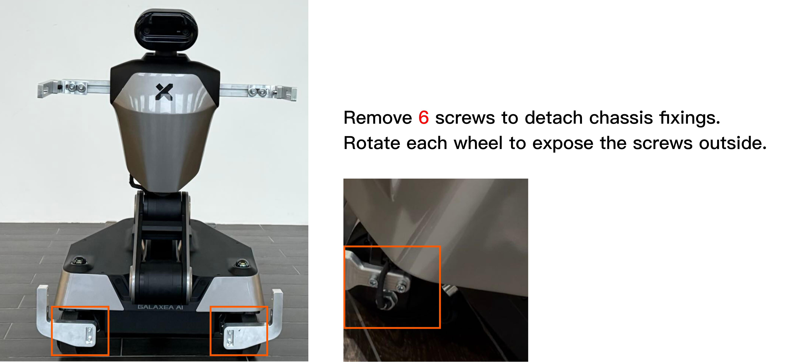

### 2.5 Detach Rear Shell
Open the peripheral interface cover on the rear shell and remove two M4 screws on the side. 
Next, remove two M5 screws on each side of the chest, then you can detach the rear shell. 

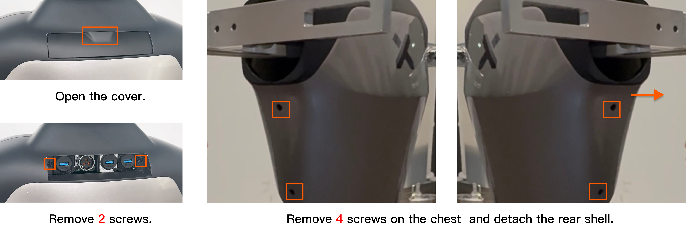

### 2.6 Detach Front Shell
Remove six M5 screws on two sides of the chest, as boxed in the figure, then you can detach the front shell.


### 2.7 Remove Arm Fixings
Use the largest L-hex key to remove two screws inside the chest, as boxed in the figure, then you can detach the fixing stick.


## 3. Turn On R1

### 3.1 Connect the Display, Keyboard and Mouse
<span style="color:red;">**Important: For your safety, please power off R1 before connecting any cables.**</span>

Remove two M3 screws on the peripheral interface cover on the chassis. Connect HDMI cable to the chassis and the display. 

<u>Note: Please ensure a firm connection to avoid cable looseness.</u>

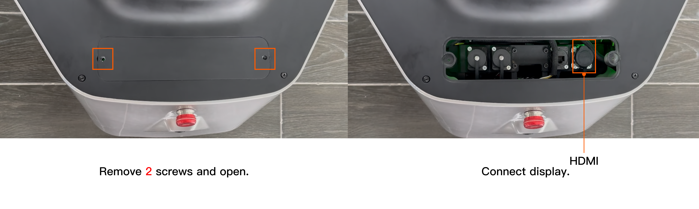

Connect the mouse and keyboard to the USB ports. 
<u>Note: Please ensure a firm connection to avoid cable looseness.</u>

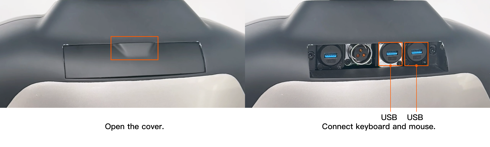

### 3.2 Power On

The battery is located at the bottom of the right side of the chassis. Remove four screws and slide the cover right to detach it. Then, put the battery into the chassis, connect the battery cable, and close the cover. 
To remove and change the battery, reverse those steps.

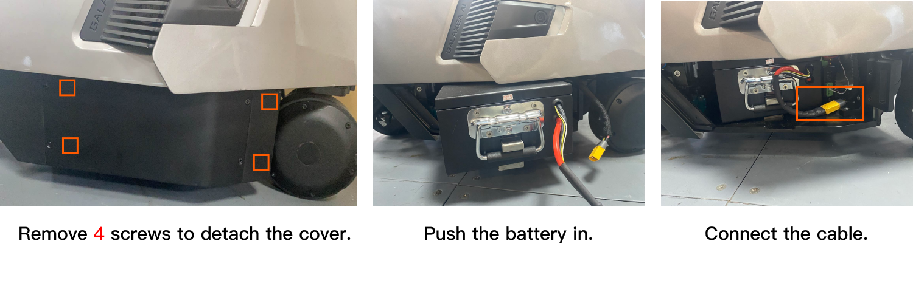

The power supply port is located at the bottom of the rear of the chassis. Unscrew the plug case, and insert the power cord into the port. When the red light on the charger is on, it indicates that R1 is charging.

<u>Note: Please keep the emergency stop button raised and turn on the boat-shaped power button located at the bottom of the left rear of the chassis. If the power was previously on, you need to turn it off and then turn it on again; otherwise, the display may not be able to work.</u>


### 3.3 Obtain IP Address
After R1 is powered on, wait for the display to show the desktop. Then click "Settings" and connect to WiFi.


Open the command terminal and enter the following command:

```bash
ifconfig
```

Find`mlan0`. The IP address of R1 Orin is: `192.168.xxx.xxx`.

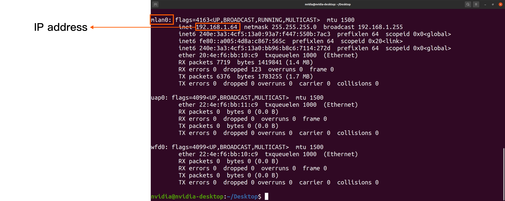


### 3.4 Remotely Connect to R1

Use the other computer, and enter the following command in the terminal, connecting to Orin. 

```bash
ssh nvidia@IP address
# Enter the account name and password
```

- Account name and password are `nvidia`；

After completing the above steps, if the connection is successful, disconnect the HDMI and USB cable, and close the interface cover plates on the chassis and chest, to avoid affecting the activity range. **<u>If the connection fails, please contact us in time for technical support.</u>**

### 3.5 The First Remote Self-Check
<span style="color:red;">**Important: Before you do any actions on R1, you must complete R1 remote self-checks to ensure the safety.**</span>

Perform the first remote self-check based on the following steps. Please make sure:

- R1 has pulled out of the box and all fixings are removed, **and**
- R1 remains folded and does not have the robot arms installed.

```bash
source work/ci_pipeline/workspace/body/install/setup.bash
rosrun HDAS check_node
0 
```

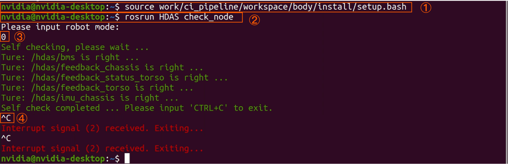


### 3.6 Stand Up

<u>Note: Please ensure that R1 is out of the box and there is no interference or fixings. Otherwise, R1's torso may enter the locked-rotor protection state.</u>

Once the self-check is completed, you can make R1 standing up based on the following steps, by using the joystick controller. 

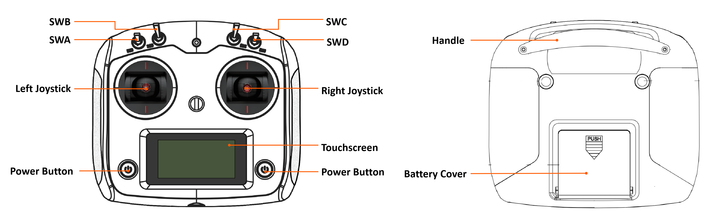

<u>Note: Please ensure all switches (SWA/SWB/SWC/SWD) are at top before you do any actions. This will place the machine in a stop state, preventing the robot from operating.</u> 

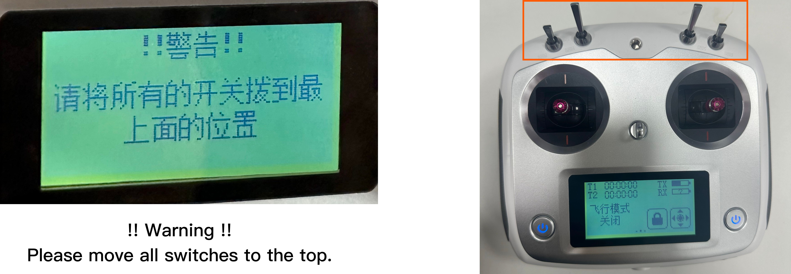

**Step 1:**  Run the following commands in the upper computer. If it has been done before, there is no need to do it again.

```Bash
# Start FDCAN communication
sudo ip link set dev can0 type can bitrate 1000000 dbitrate 5000000 fd on
sudo ip link set up can0

# Add enviroment variables
source ~/work/ci_pipeline/workspace/body/install/setup.bash

# Start the following launch files in different terminals in sequence.
roslaunch HDAS hdas.launch
roslaunch r1_jointTrackerdemo.launch
```

**Step 2:** Switch SWA, SWD to the bottom, and switch SWB,SWC to the middle. 

**Step 3:** Move the left joystick to the upper left, and move the right joystick to the upper right simultaneously. Waiting for 3 seconds,  **R1 will stand up.**

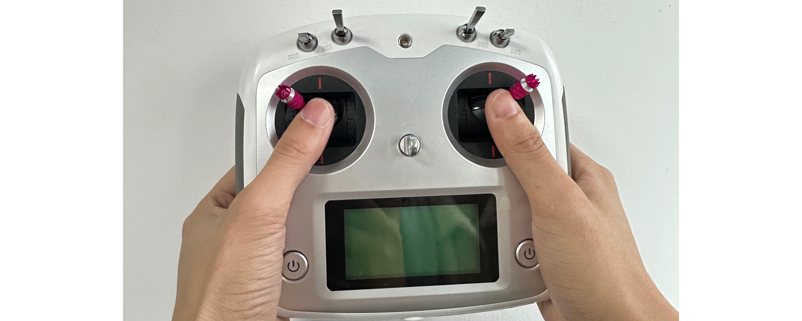


### 3.7 Install Arms 

<span style="color:red;">**Important: For your safety, please power off R1 before installing arms.**</span>

**Step 1:** Attach gripper to arm. To remove them, simply reverse these steps.


- **Alignment Check:** Ensure that three mounting holes around the gripper are aligned with three mounting holes at the end of A1.
- **Screw Fixation:** Once aligned, secure and tighten the gripper to the arm using the three screws provided.
- **Final Check:** After tightening the screws, double-check the alignment and stability of the gripper. It should be firmly attached and not wobble or move independently of the robot arm.

**Step 2:** Use the hex L-key (5 mm) and four M6 screws to secure the arm.


<u>Note: When installing the robot arm, you must ensure that arm base ports are facing backward, like showing in the figure below.</u>

**Step 3:** Connect the power and CAN cables provided with arms to the ports on the arm base.


**Step 4:** After confirming that the communication connection with the robot arms is successful, reattach the covers by reversing the steps in **2.5** and **2.6** above.

### 3.8 The Second Remote Self-Check
Power on R1 and perform the second remote self-check based on the following steps. Please make sure:
- R1 has stood up, **and**
- R1 has arms installed correctly.

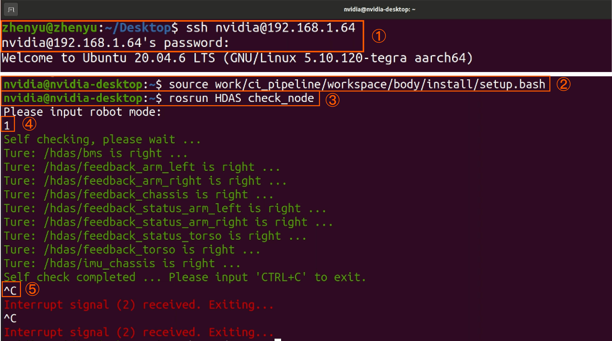

```bash
ssh nvidia@IP address
# account name and password
source work/ci_pipeline/workspace/body/install/setup.bash
rosrun HDAS check_node
```

## Instruction Video
**Coming soon**
