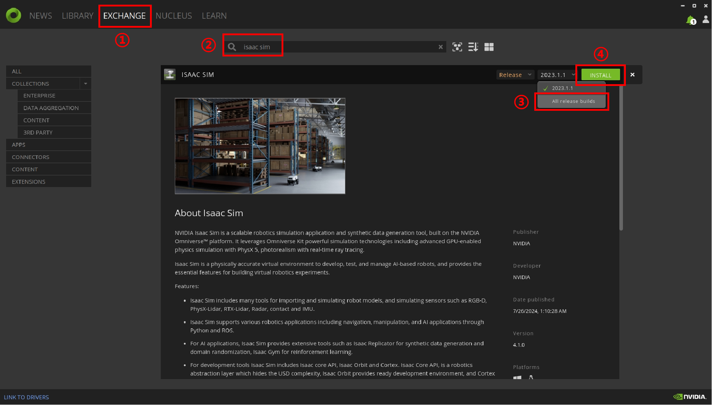
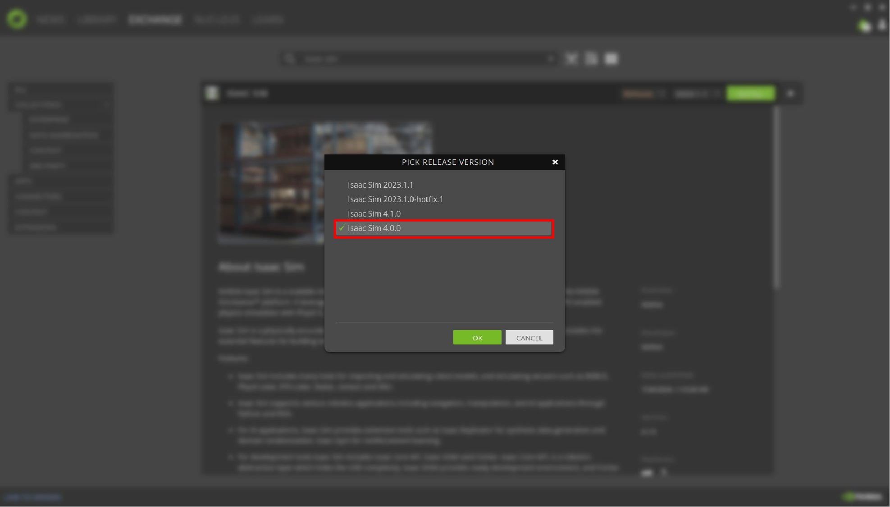
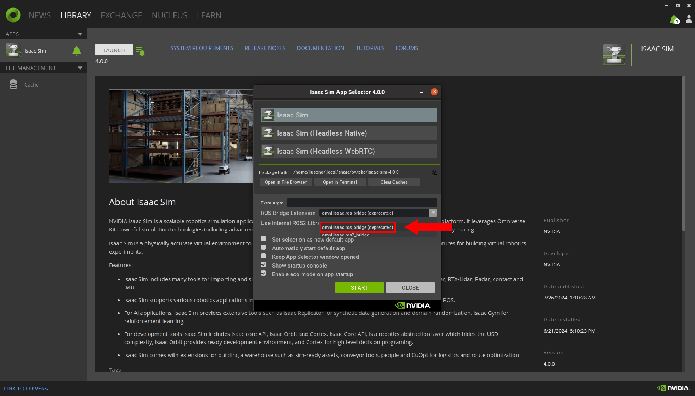
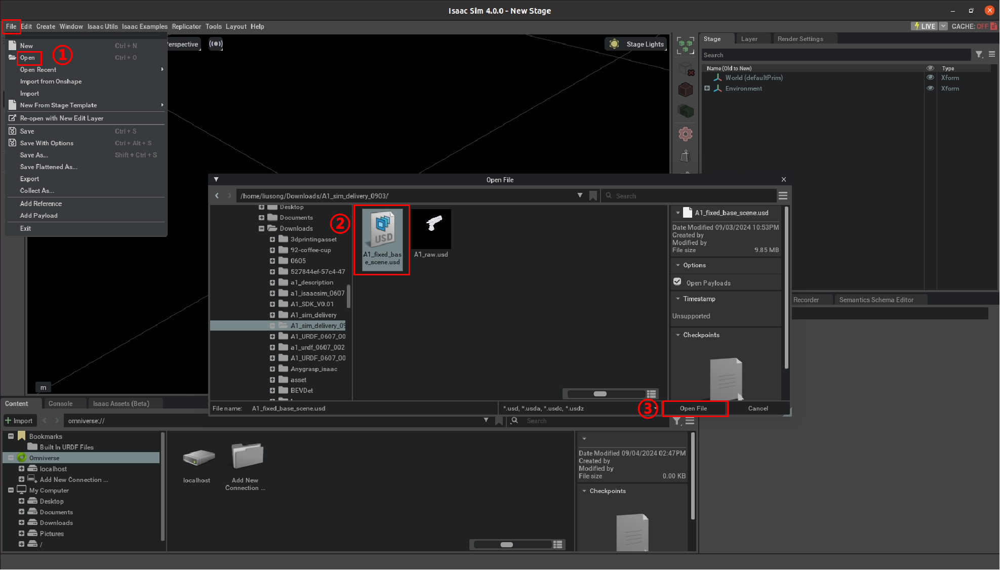
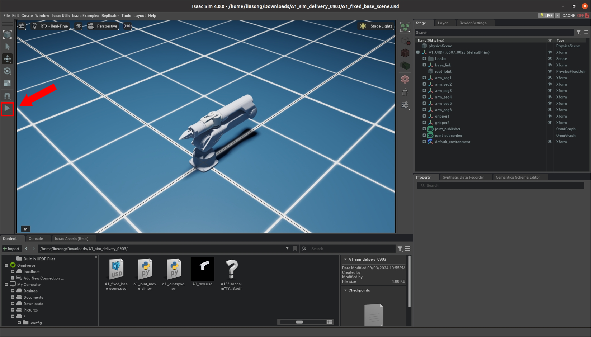
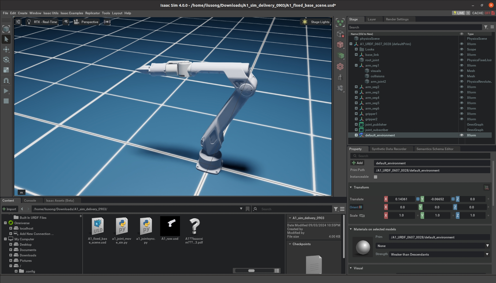

# A1 Simulation Isaac Sim Usage Tutorial

## Install Isaac Sim 4.0.0

Isaac Sim has specific requirements for GPU versions and drivers. Arbitrary changes may cause issues. Therefore, it is recommended to directly download and install the necessary files.

The download size is approximately 8 GB, so please plan your time accordingly.

### Download Omniverse Launcher

1. **Visit the page:** Go to NVIDIA's official website at https://docs.omniverse.nvidia.com/isaacsim/latest/installation/install_workstation.html and download the Omniverse Launcher.
2. **Register an account:** During the download process, you may be prompted to log in. If you don't have an NVIDIA account, follow the instructions to register. Once registered, continue with the download.
3. **Install** **Omniverse Launcher:** After the download is complete, launch the installer and follow the prompts to complete the installation.
4. **Launch Omniverse Launcher:** Once the installation is complete, open the Omniverse Launcher. For the first time use, you will need to log in with your registered NVIDIA account.
5. **Set up paths:** After logging in, the system will prompt you to configure some related file paths. Set them up according to your needs.
6. **Install** **Cache:** Follow the system prompts to install Cache. It is recommended to choose the default installation option to enhance your experience.
7. **Access the main interface:** Once these settings are completed, you will enter the Omniverse Launcher main interface.

### Install Isaac Sim

1. **Open "Exchange" :** In the Omniverse Launcher main interface, click on the "Exchange" tab.
2. **Find Isaac Sim:** Search the "Isaac Sim" application within the "Exchange".
3. **Select version:** Ensure you install **<u>version 4.0.0</u>** of Isaac Sim to avoid potential issues with the ROS bridge. Please note that the version number might be hidden in a dropdown menu, so carefully check and select the correct version.
4. **Install** **Isaac Sim:** After selecting the version, click the "Install" button to begin the installation of Isaac Sim.





<u>**Important:** The installed applications can be found in the "Library" tab. Simply locate the desired application and launch it from there.</u>

### Isaac Sim Basic Operations

The following is the official tutorial to help you understand the basic Isaac Sim interface.

- **UI** **Interface**
    - https://docs.omniverse.nvidia.com/isaacsim/latest/introductory_tutorials/tutorial_intro_interface.html
    - https://docs.omniverse.nvidia.com/isaacsim/latest/introductory_tutorials/tutorial_intro_workflows.html
- **Add Objects and** **Set** **Physical Properties**
    - https://docs.omniverse.nvidia.com/isaacsim/latest/gui_tutorials/tutorial_intro_simple_objects.html#isaac-sim-app-tutorial-intro-simple-objects
- **Assemble Robots and Import**
    - https://docs.omniverse.nvidia.com/isaacsim/latest/gui_tutorials/tutorial_gui_simple_robot.html
    - https://docs.omniverse.nvidia.com/isaacsim/latest/features/environment_setup/ext_omni_isaac_urdf.html


## Importing A1 USD File
Visit [A1 Simulation Isaac Sim Usage Tutorial](https://github.com/userguide-galaxea/A1_Simulation_Isaac_Sim_Usage_Tutorial) in our GitHub to get coding files.

1. **Open Isaac Sim:** Start Isaac Sim 4.0.0 from Omniverse Launcher. Ensure you select `omni.isaac.ros_bridge(deprecated)` at startup to enable communication between Isaac Sim and ROS nodes.
   

2. **Open the USD File:** After starting Isaac Sim, select **"File -> Open"**. In the file dialog that appears, choose the `A1_fixed_base_scene.usd` file from the folder. Do not select the A1 simulation raw file `A1_raw.usd`.
   

3. **Run the Synchronization Script:** After opening the file, you will see the corresponding scene. Click the "**Play"** button on the left sidebar.
   

   Run the `a1_jointsync.py` script from the folder to synchronize the RViz simulation with the Isaac Sim simulation.
    ```shell
    python a1_jointsync.py
    ```

   <u>**Important:** The Isaac Sim ROS Bridge can only publish/subscribe to `rostopic` when `roscore` is running.</u>


## Demonstration Example

After clicking the Play button, start the `python a1_joint_move_sin.py` script. A1 robot arm will begin executing a sinusoidal trajectory in joint space, as shown in the image below.



With this, the Isaac Sim A1 robot arm simulation process is complete. You may play the demo in the system with the code provided, like shown below.

<div style="display: flex; justify-content: center; align-items: center;">
<video width="1920" height="1080" controls>
  <source src="../assets/a1_asaacsim_demo.mp4" type="video/mp4">
  Your browser does not support the video tag.
</video>
</div>