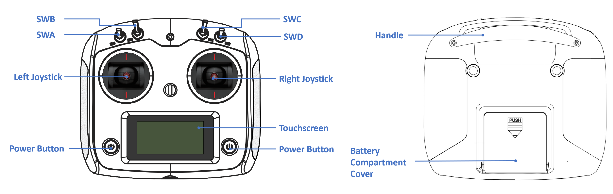
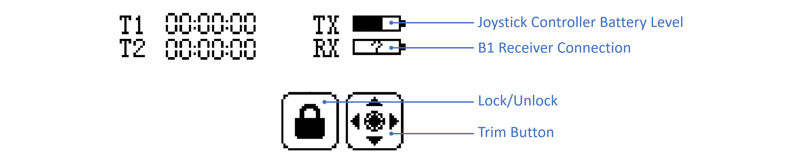

> Congratulations on becoming the proud owner of Galaxea B1! We are thrilled to extend a warm welcome to the Galaxea Developer Community. This specially curated guide is designed to introduce beginners to the unique appeal and impressive functionalities of Galaxea B1. Our goal is to help you quickly get started with it and empower you to explore the full range of possibilities that await you.

# Getting Started

In this series of step-by-step Galaxea B1 Getting Started tutorials, we will not only lay a solid foundation for using Galaxea B1 but also guide you through the mechanics and performance of each component. Together, we will explore and perform a series of exciting demonstrations to unlock Galaxea B1's amazing advanced features.

## Before You Begin

### Safety

When operating Galaxea B1, please observe the following safety precautions:

- After stopping control commands, the device will not stop immediately but will decelerate over a distance. Please ensure that there are no obstacles or interferences in the path.
- For joystick controller teleoperation, please choose an open area for operation, as the vehicle has no automatic obstacle avoidance sensors.

To ensure safe use, it is important to remember that Galaxea B1 can cause potential injury if operated improperly. Therefore, we strongly recommend that every user carefully read and follow the instructions in the Safety Guide before operating the robot for the first time to ensure a safe and efficient operation process.

### Turning On

To turn on Galaxea B1, press the boat-shaped button on the left side of the chassis.

### Charging

To charge Galaxea B1, please use the provided power cable and insert it into the 48V power supply port located at the bottom of the back of the chassis.

### Shutting Down

To shut down Galaxea B1, please press off the button on the back of the chassis.

#### Emergency Stop

The emergency stop button is located at the back of the chassis. It can be used to halt all operations in case of an emergency immediately or if you encounter any dangerous situations.

### Joystick Controller

- The joystick controller requires four AA batteries.
- To turn on/off the controller, please press and hold both power buttons until the touchscreen lights up/off.

- The TX box shows the battery level of the controller.
- The RX box shows whether the remote control is successfully connected to Galaxea B1. If the connection is successful, it will display a half-filled bar. If the connection is unsuccessful, a question mark will appear in the box.

### Motion Mode

Galaxea B1 is a 6 DoF omni-directional vector chassis, featuring advanced capabilities with Ackerman steering, Translation movement, and Spinning functions.

### Next Step

Our quickstart journey has come to an end. To deepen your mastery of Galaxea B1, we strongly recommend exploring the following chapters in [Galaxea B1 Hardware Guide](B1_Hardware_Guide.md) and [Galaxea B1 Software Guide](B1_Hardware_Guide.md).  These resources offer a wealth of additional information and practical examples, guiding you through the intricacies of programming with confidence and ease.

