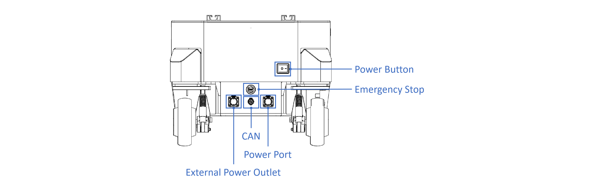
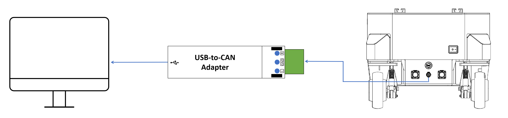

## Galaxea B1 Hardware Guide

This manual provides engineering data and user guidance for working with the Galaxea B1 hardware.

### Disclaimer

<u>Galaxea B1 is intended for research applications by users experienced in operating and programming research robots. This product is not designed for general consumer use in the home and does not have the necessary certifications for such purposes.</u>

### Technical Specification

<table style="border-collapse: collapse; width: 100%;">
    <thead>
        <tr style="background-color: black; color: white; text-align: left;">
            <th style="vertical-align: middle; padding: 8px; border: 1px solid #ddd; width: 230px;">Mechanical</th>
            <th style="vertical-align: middle; padding: 8px; border: 1px solid #ddd;">Values</th>
        </tr>
    </thead>
    <tbody>
        <tr style="background-color: white;">
            <td style="vertical-align: middle; padding: 8px; border: 1px solid #ddd;">Dimensions</td>
            <td style="vertical-align: middle; padding: 8px; border: 1px solid #ddd;">477L * 520W * 363H mm</td>
        </tr>
        <tr style="background-color: white;">
            <td style="vertical-align: middle; padding: 8px; border: 1px solid #ddd;">Weight</td>
            <td style="vertical-align: middle; padding: 8px; border: 1px solid #ddd;">51 kg</td>
        </tr>
        <tr style="background-color: white;">
            <td style="vertical-align: middle; padding: 8px; border: 1px solid #ddd;">Wheelbase</td>
            <td style="vertical-align: middle; padding: 8px; border: 1px solid #ddd;">381 mm</td>
        </tr>
        <tr style="background-color: white;">
            <td style="vertical-align: middle; padding: 8px; border: 1px solid #ddd;">Wheel Track</td>
            <td style="vertical-align: middle; padding: 8px; border: 1px solid #ddd;">384 mm</td>
        </tr>
        <tr style="background-color: white;">
            <td style="vertical-align: middle; padding: 8px; border: 1px solid #ddd;">Battery</td>
            <td style="vertical-align: middle; padding: 8px; border: 1px solid #ddd;">Lithium-ion</td>
        </tr>
        <tr style="background-color: white;">
            <td style="vertical-align: middle; padding: 8px; border: 1px solid #ddd;">Nominal Voltage</td>
            <td style="vertical-align: middle; padding: 8px; border: 1px solid #ddd;">48 V</td>
        </tr>
        <tr style="background-color: white;">
            <td style="vertical-align: middle; padding: 8px; border: 1px solid #ddd;">Rated Capacity</td>
            <td style="vertical-align: middle; padding: 8px; border: 1px solid #ddd;">30 Ah</td>
        </tr>
        <tr style="background-color: white;">
            <td style="vertical-align: middle; padding: 8px; border: 1px solid #ddd;">Power Adapter</td>
            <td style="vertical-align: middle; padding: 8px; border: 1px solid #ddd;">273 W</td>
        </tr>
        <tr style="background-color: white;">
            <td style="vertical-align: middle; padding: 8px; border: 1px solid #ddd;">Steering Type</td>
            <td style="vertical-align: middle; padding: 8px; border: 1px solid #ddd;">Four-wheel driving and steering</td>
        </tr>
    </tbody>
</table>

<table style="border-collapse: collapse; width: 100%;">
    <thead>
        <tr style="background-color: black; color: white; text-align: left;">
            <th style="vertical-align: middle; padding: 8px; border: 1px solid #ddd; width: 230px;">Performance</th>
            <th style="vertical-align: middle; padding: 8px; border: 1px solid #ddd;">Values</th>
        </tr>
    </thead>
    <tbody>
        <tr style="background-color: white;">
            <td style="vertical-align: middle; padding: 8px; border: 1px solid #ddd;">Maximum Speed</td>
            <td style="vertical-align: middle; padding: 8px; border: 1px solid #ddd;">1 m/s</td>
        </tr>
        <tr style="background-color: white;">
            <td style="vertical-align: middle; padding: 8px; border: 1px solid #ddd;">Ground Clearance</td>
            <td style="vertical-align: middle; padding: 8px; border: 1px solid #ddd;">N/A</td>
        </tr>
        <tr style="background-color: white;">
            <td style="vertical-align: middle; padding: 8px; border: 1px solid #ddd;">Maximum Payload</td>
            <td style="vertical-align: middle; padding: 8px; border: 1px solid #ddd;">70 kg</td>
        </tr>
    </tbody>
</table>

<table style="border-collapse: collapse; width: 100%;">
    <thead>
        <tr style="background-color: black; color: white; text-align: left;">
            <th style="vertical-align: middle; padding: 8px; border: 1px solid #ddd; width: 230px;">Control</th>
            <th style="vertical-align: middle; padding: 8px; border: 1px solid #ddd;">Values</th>
        </tr>
    </thead>
    <tbody>
        <tr style="background-color: white;">
            <td style="vertical-align: middle; padding: 8px; border: 1px solid #ddd;">Control Mode</td>
            <td style="vertical-align: middle; padding: 8px; border: 1px solid #ddd;">Teleoperation</td>
        </tr>
        <tr style="background-color: white;">
            <td style="vertical-align: middle; padding: 8px; border: 1px solid #ddd;">Computing Unit Command</td>
            <td style="vertical-align: middle; padding: 8px; border: 1px solid #ddd;">Joystick Controller (2.4G/Maximum Range 1.5km)</td>
        </tr>
        <tr style="background-color: white;">
            <td style="vertical-align: middle; padding: 8px; border: 1px solid #ddd;">Communication Interface</td>
            <td style="vertical-align: middle; padding: 8px; border: 1px solid #ddd;">CAN</td>
        </tr>
    </tbody>
</table>

### Chassis Operation

Galaxea B1 features four steering wheels, each equipped with two steering motors, totaling 8 motors.

<table style="border-collapse: collapse; width: 100%;">
    <thead>
        <tr style="background-color: black; color: white; text-align: left;">
            <th style="vertical-align: middle; padding: 8px; border: 1px solid #ddd; width: 230px;">Item</th>
            <th style="vertical-align: middle; padding: 8px; border: 1px solid #ddd;">Notes</th>
        </tr>
    </thead>
    <tbody>
        <tr style="background-color: white; text-align: left;">
            <td style="vertical-align: middle; padding: 8px; border: 1px solid #ddd;">Power Button</td>
            <td style="vertical-align: middle; padding: 8px; border: 1px solid #ddd;">Used to turn on/off the chassis</td>
        </tr>
        <tr style="background-color: white; text-align: left;">
            <td style="vertical-align: middle; padding: 8px; border: 1px solid #ddd;">Emergency Stop Button</td>
            <td style="vertical-align: middle; padding: 8px; border: 1px solid #ddd;">Used for immediate power interruption during emergencies</td>
        </tr>
        <tr style="background-color: white; text-align: left;">
            <td style="vertical-align: middle; padding: 8px; border: 1px solid #ddd;">Power Port</td>
            <td style="vertical-align: middle; padding: 8px; border: 1px solid #ddd;">2-pin aviation connector with 48 V rated voltage</td>
        </tr>
        <tr style="background-color: white; text-align: left;">
            <td style="vertical-align: middle; padding: 8px; border: 1px solid #ddd;">CAN Interface</td>
            <td style="vertical-align: middle; padding: 8px; border: 1px solid #ddd;">2-pin aviation connector</td>
        </tr>
        <tr style="background-color: white; text-align: left;">
            <td style="vertical-align: middle; padding: 8px; border: 1px solid #ddd;">External Power Outlet</td>
            <td style="vertical-align: middle; padding: 8px; border: 1px solid #ddd;">3-pin aviation connector with 48 V rated voltage</td>
        </tr>
    </tbody>
</table>

#### Teleoperation

The chassis can be controlled and operated using either the Joystick Controller or the Computing Unit.

Please ensure all switches (SWA/SWB/SWC/SWD) are in the top position before you do any actions. This will place the machine in a stop state, preventing the chassis from operating.

<table style="border-collapse: collapse; width: 100%;">
    <thead>
        <tr style="background-color: black; color: white; text-align: left;">
            <th style="vertical-align: middle; padding: 8px; border: 1px solid #ddd; width: 150px;">Item</th>
            <th style="vertical-align: middle; padding: 8px; border: 1px solid #ddd; width: 200px;">Chassis Control Mode</th>
            <th style="vertical-align: middle; padding: 8px; border: 1px solid #ddd;">Dual Ackermann Mode</th>
            <th style="vertical-align: middle; padding: 8px; border: 1px solid #ddd;">Spinning Mode</th>
            <th style="vertical-align: middle; padding: 8px; border: 1px solid #ddd;">Translation Mode</th>
        </tr>
        <tr style="background-color: grey; color: white; text-align: left;">
            <th style="vertical-align: middle; padding: 8px; border: 1px solid #ddd;" colspan="5">Joystick Controller</th>
        </tr>
    </thead>
    <tbody>
        <tr style="background-color: white;">
            <td style="vertical-align: middle; padding: 8px; border: 1px solid #ddd;">Switches</td>
            <td style="vertical-align: middle; padding: 8px; border: 1px solid #ddd;">Switch SWB to middle</td>
            <td style="vertical-align: middle; padding: 8px; border: 1px solid #ddd;">Switch SWC to top</td>
            <td style="vertical-align: middle; padding: 8px; border: 1px solid #ddd;">Switch SWC to middle</td>
            <td style="vertical-align: middle; padding: 8px; border: 1px solid #ddd;">Switch SWC to bottom</td>
        </tr>
        <tr style="background-color: white;">
            <td style="vertical-align: middle; padding: 8px; border: 1px solid #ddd;">Left Joystick</td>
            <td style="vertical-align: middle; padding: 8px; border: 1px solid #ddd;text-align: center;">\</td>
            <td style="vertical-align: middle; padding: 8px; border: 1px solid #ddd;">Move up/down to control forward/backward movement</td>
            <td style="vertical-align: middle; padding: 8px; border: 1px solid #ddd;">Move up/down to control counter-clockwise/clockwise rotation</td>
            <td style="vertical-align: middle; padding: 8px; border: 1px solid #ddd;">Move up/down to control forward/backward movement</td>
        </tr>
        <tr style="background-color: white;">
            <td style="vertical-align: middle; padding: 8px; border: 1px solid #ddd;">Right Joystick</td>
            <td style="vertical-align: middle; padding: 8px; border: 1px solid #ddd;text-align: center;">\</td>
            <td style="vertical-align: middle; padding: 8px; border: 1px solid #ddd;">Move left/right to control steering angle</td>
            <td style="vertical-align: middle; padding: 8px; border: 1px solid #ddd;text-align: center;">\</td>
            <td style="vertical-align: middle; padding: 8px; border: 1px solid #ddd;">Move left/right to control left/right turning</td>
        </tr>
    </tbody>
    <thead>
        <tr style="background-color: grey; color: white; text-align: left;width: 150px;">
            <th style="vertical-align: middle; padding: 8px; border: 1px solid #ddd;" colspan="5">Computing Unit</th>
        </tr>
    </thead>
    <tbody>
        <tr style="background-color: white;">
            <td style="vertical-align: middle; padding: 8px; border: 1px solid #ddd;">Switches</td>
            <td style="vertical-align: middle; padding: 8px; border: 1px solid #ddd;">Switch SWB to bottom and switch SWC to middle</td>
            <td style="vertical-align: middle; padding: 8px; border: 1px solid #ddd;" colspan="3">Follow the steps in the Development and Operation Tutorials to start the action.</td>
        </tr>
    <tbody>        
</table>

#### PC Connection

To achieve efficient data communication and control within the system, we provided a USB-to-CAN Adapter for users to connect the chassis to PC.

<table style="border-collapse: collapse; width: 100%;">
    <thead>
        <tr style="background-color: black; color: white; text-align: left;">
            <th style="vertical-align: middle; padding: 8px; border: 1px solid #ddd; width: 230px;">Item</th>
            <th style="vertical-align: middle; padding: 8px; border: 1px solid #ddd;">Value</th>
        </tr>
    </thead>
    <tbody>
        <tr style="background-color: white; text-align: left;">
            <td style="vertical-align: middle; padding: 8px; border: 1px solid #ddd;">Dimensions</td>
            <td style="vertical-align: middle; padding: 8px; border: 1px solid #ddd;">7.9L * 2.4W * 1.5H cm</td>
        </tr>
        <tr style="background-color: white; text-align: left;">
            <td style="vertical-align: middle; padding: 8px; border: 1px solid #ddd;">USB Speed</td>
            <td style="vertical-align: middle; padding: 8px; border: 1px solid #ddd;">2.0 Full Speed 12m/s</td>
        </tr>
        <tr style="background-color: white; text-align: left;">
            <td style="vertical-align: middle; padding: 8px; border: 1px solid #ddd;">Receiving Capacity</td>
            <td style="vertical-align: middle; padding: 8px; border: 1px solid #ddd;">8500 frames/sec at 1M</td>
        </tr>
        <tr style="background-color: white; text-align: left;">
            <td style="vertical-align: middle; padding: 8px; border: 1px solid #ddd;">Baud Rate Detection</td>
            <td style="vertical-align: middle; padding: 8px; border: 1px solid #ddd;">Yes</td>
        </tr>
        <tr style="background-color: white; text-align: left;">
            <td style="vertical-align: middle; padding: 8px; border: 1px solid #ddd;">CAN Interface</td>
            <td style="vertical-align: middle; padding: 8px; border: 1px solid #ddd;">Screw Terminal Block (CANH+GND+CANL)</td>
        </tr>
        <tr style="background-color: white; text-align: left;">
            <td style="vertical-align: middle; padding: 8px; border: 1px solid #ddd;">CAN Baud Rate</td>
            <td style="vertical-align: middle; padding: 8px; border: 1px solid #ddd;">5K - 1Mbps</td>
        </tr>
        <tr style="background-color: white; text-align: left;">
            <td style="vertical-align: middle; padding: 8px; border: 1px solid #ddd;">PC Interface</td>
            <td style="vertical-align: middle; padding: 8px; border: 1px solid #ddd;">USB 1.1/2.0/3.0</td>
        </tr>
    </tbody>
</table>

**Please follow the steps:**

1. Use the provided 2-pin aviation connector and cable and connect the USB-to-CAN Adapter to the CAN interface located on the rear of the chassis.
2. Press the boat-shaped power button to turn on the chassis and rotate the emergency stop button clockwise to release it.
3. Verify the wiring of the USB-to-CAN Adapter: red wire to the H port and the black wire to the L port.
4. Use the USB cable and connect the USB-to-CAN Adapter to PC.

To check if the CAN connection is functioning correctly, please refer to the CAN Connection in the Galaxea B1 Software Guide.

### Next Step

This concludes the hardware information of Galaxea B1. For further coding and interface details, please refer to Galaxea B1 Software Guide.

