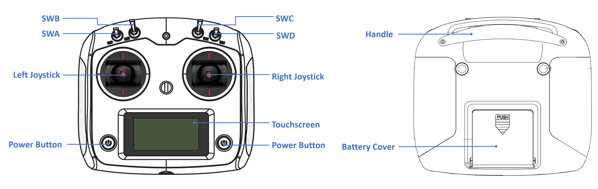
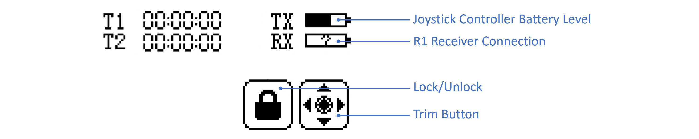

> Congratulations on becoming the proud owner of a Galaxea Robot! We are thrilled to extend a warm welcome to the Galaxea Developer Community. This specially curated guide is designed to introduce beginners to the unique appeal and impressive functionalities of Galaxea Robot. Our goal is to help you quickly get started with us and empower you to explore the full range of possibilities that await you.

# Before You Begin

In this first tutorial, you will learn how to power on and operate this new product, beginning your journey of interacting with Galaxea R1.

## Safety 

Galaxea R1 has the potential to cause harm if not properly used. We recommend that all users review the Safety Guide before operating the robot.

## Installing

For detailed instructions on how to install each component of Galaxea R1, please refer to the [Connecting and Installing](GettingStarted_Connecting.md) section. These tutorials provide step-by-step guidance to ensure proper assembly and setup.

## Turning On

To turn on Galaxea R1, please press the boat-shaped button on the side of the chassis. 

## Charging

To charge Galaxea R1, please use the provided power cable and insert it into the 48V power supply port located at the bottom of the rear of the chassis. 

## Shutting Down 

Galaxea R1 can be turned off by simply switching off the button on the left side of the chassis. 

### Emergency Stop

The emergency stop switch is located at the rear of the chassis. It can be used to immediately halt all operations in case of an emergency or if you encounter any dangerous situations.

## Joystick Controller Instruction
Use the provided joystick controller to operate the robot and quickly test Galaxea R1's various functions.




| **Item**        | **Notes**                                                    |
| --------------- | ------------------------------------------------------------ |
| SWA/SWB/SWC/SWD | Used to set Chassis/Torso Control Mode.<br />Each has three positions: up/middle/down. |
| Left Joystick   | Used to control the movement of the chassis and the torso.   |
| Right Joystick  | Used to control the rotation of the chassis and the pitch/yaw of the torso. |
| Power Button    | Used to turn on/off the joystick controller.                 |

### Battery Installation

1. Open the battery compartment cover.
2. Insert four fully charged AA batteries into the compartment, ensuring that the metal terminals on the batteries make contact with the metal terminals inside the compartment.
3. Close the battery compartment cover.

### Turning On the Controller

Please follow these steps to power on:

1. Check the system status to ensure:
   * The batteries are fully charged and correctly installed.
   * Galaxea R1 is powered on and turned on, which will also power on the built-in receiver.

2. Press and hold both power buttons on the controller simultaneously until the screen lights up.

### Touchscreen Operation



The icon in the top left corner of the screen shows the following:

| **Item** | **Notes**                                                    |
| -------- | ------------------------------------------------------------ |
| **TX**   | Shows the battery level of the controller.                   |
| **RX**   | Shows whether the remote control is successfully connected to Galaxea R1. If the connection is successful, it will display a half-filled bar. If the connection is unsuccessful, a question mark will appear in the box. |


### Turning Off the Controller

Press and hold both power buttons on the controller simultaneously until the screen turns off and the controller shuts down.

### Teleoperation Guide

#### Galaxea R1 Chassis Control

There are two ways to control and operate the chassis, using Joystick Controller or Computing Unit.

1. **Joystick Controller:**
   
   * **Enter Chassis Control Mode:** Switch SWB to the middle position.
   * **Left joystick:** Move up/down to control the forward/backward movement of the chassis. Move left/right to control the left/right translations of the chassis.
   * **Right joystick:** Move left/right to control the rotational speed of the chassis in the yaw direction.
     
2. **Computing Unit**:
   * **Enter Chassis Control Mode:** Switch SWB to the bottom position and switch SWC to the middle position.
   * Then follow the steps in the Development and Operation Tutorials to start the action.

#### Galaxea R1 Torso Control 

<u>Important: Before you start, please check if there has been any zero-point drift in torso after long distance transportation.</u> 

* Connect to the Main Control Board as described in the [Connecting and Installing](GettingStarted_Connecting.md) tutorials.
* Then use the ROS interface below to check whether the current motor position is near `[-2.2, 2.6, 0.4, 0]` within +/-5%, as the pose shown in the image below. 
```shell
 rostopic echo /torso_feedback
 ```


If the position is wrong, it means that zero-point drift is observed, and please refer to the [Torso Zero-Point Calibration](Software_Guide_Interface.md) tutorial.

Please make sure the torso SDK is enabled first. Then we shall use the joystick controller to operate the torso of Galaxea R1. 
* **Enter Torso Control Mode:** Switch SWB and SWC down to the bottom position.
* **Left joystick:** Move up/down to control the raising/lowering of the torso.
* **Right joystick:** Move up/down to control the positive/negative angular velocity of the torso's pitch angle. Move left/right to control the positive/negative angular velocity of the yaw angle.

## Next Step

The next guide, [Connecting and Installing](GettingStarted_Connecting.md), will explain how to connect Galaxea R1 to a computing unit and explore its functions in more detail.
