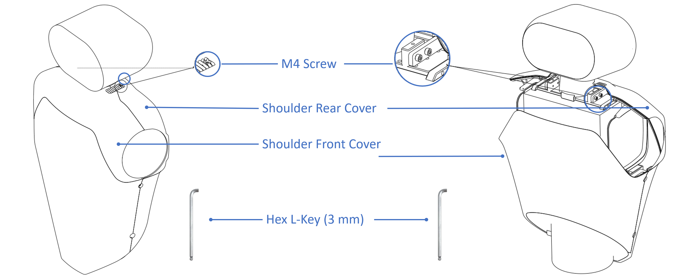
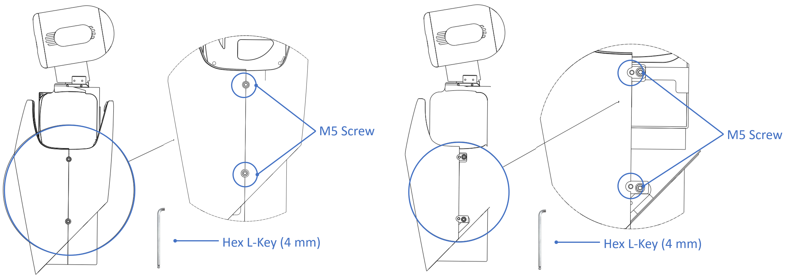
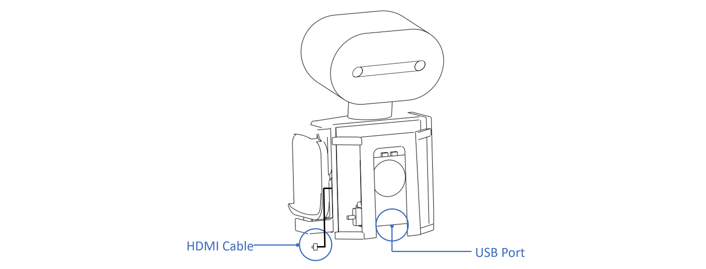
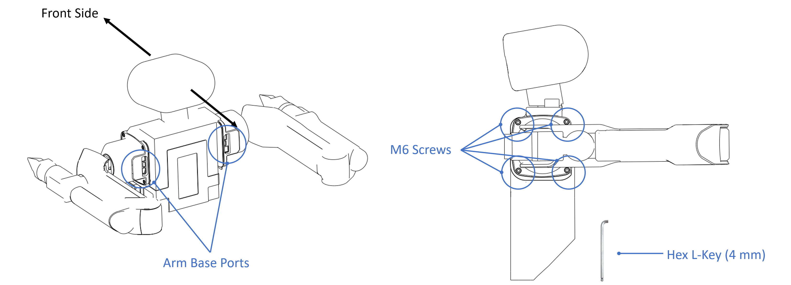
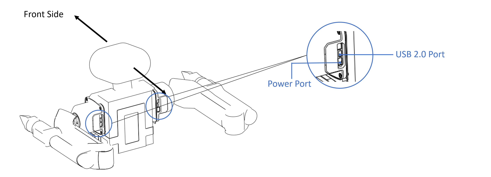

# Connecting and Installing 

## Step 1: Disassembling the Covers

- Use the hex L-key (3 mm) provided in the package to remove the M4 screws located on the robot's shoulders, with one screw on each side. Then, the rear shoulder cover can be detached.
- After removing the front cover, you will see two M4 screws on each side of the neck. Use the hex L-key (3 mm) to remove these screws, and then you can detach the rear shoulder cover.



- Use the provided hex L-key (4 mm) provided to remove the M5 screws from both sides of the chest covers, two screws on each side. Then, you can detach the rear chest cover.
- After removing the rear cover, you will see two M5 screws on each side of the robot's waist. Use the hex L-key (4 mm) to remove these screws to detach the front chest cover.



## Step 2: Logging and Connecting Main Control Board

After removing the shoulder and chest covers:

- On the right side of the chest, there is a reserved HDMI cable for connecting your display device.
- Below the chest, there is a reserved USB port for connecting a keyboard and mouse.



- The current main control board* of R1 is industrial computer running Linux Ubuntu, with the username `r1` and the default password `1`.

- After connecting to Wi-Fi, you can remotely connect to the R1 via SSH using the command, with `192.168.xxx.xxx` as its IP address.

  - ```Bash
    ssh r1@192.168.xxx.xxx
    ```

- After logging into and configuring the main unit, **disconnect the** **HDMI** **cable and the** **USB** **keyboard and mouse cables.**

It is configurable: Industrial Computer/ECU/etc.

## Step 3: Installing Arms

- **When installing the robot arm, ensure that the arm and the base ports are facing backward.**
- Use the hex L-key (5 mm) and four M6 screws to secure the arm.



- Use the power and USB cables provide with Galaxea A1 arms and insert them into the ports on the base.



## Step 4: Reattaching the Covers

After confirming that the communication connection with the robot arms is successful, reattach the covers by reversing the steps in Disassembling the Covers above to complete the installation.

## Next Step

Our quickstart journey has come to an end. To deepen your mastery of Galaxea R1, we strongly recommend exploring the following chapters in [Galaxea R1 Hardware User Guide](Hardware_Guide.md) and [Software User Guide](Software_Guide_firstmove.md). These resources offer a wealth of additional information and practical examples, guiding you through the intricacies of programming for Galaxea R1 with confidence and ease.