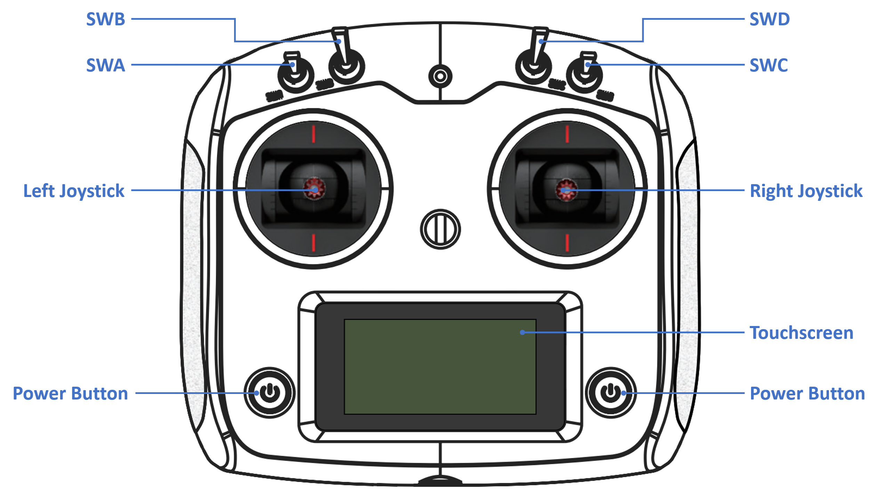
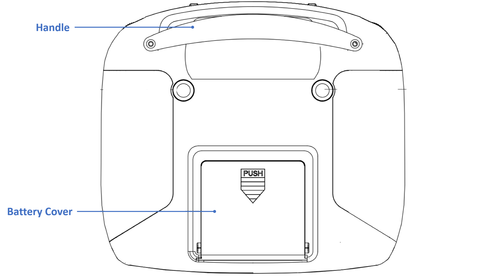
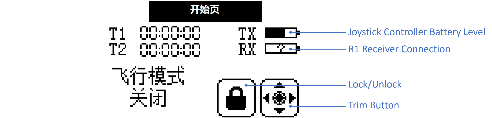
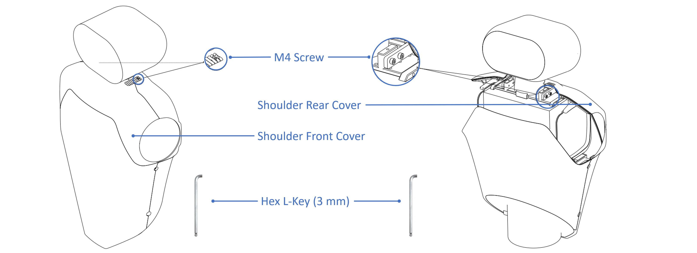
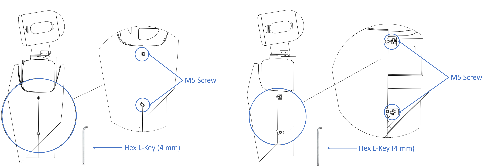
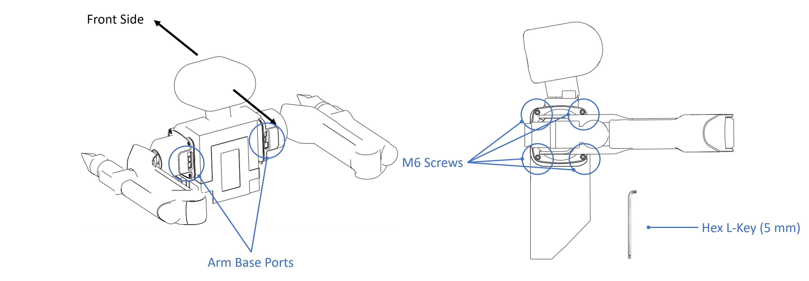
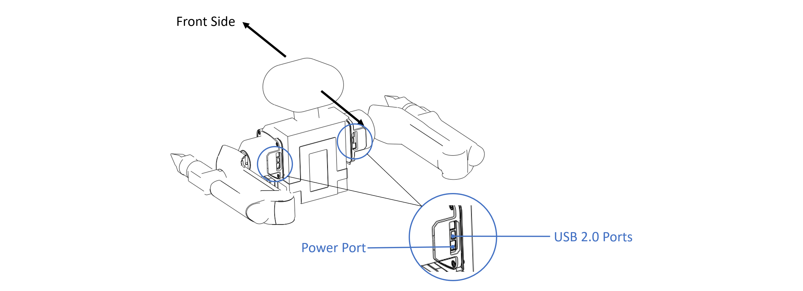

# Getting Started

In this first tutorial, you will learn how to power on and operate this new product, beginning your journey of interacting with Galaxea R1.

## Before You Begin

### Safety

In this tutorial, <u>you will learn how to power on and operate this new product</u>, beginning your journey of interacting with Galaxea R1.

### Installing

For detailed instructions on how to install each component of the Galaxea R1, please refer to the Connecting and Installing section. These tutorials provide step-by-step guidance to ensure proper assembly and setup.

### Turning On

To turn on the Galaxea R1, please press the boat-shaped button on the side of the chassis.

### Shutting Down

The Galaxea R1 can be turned off by simply switching off the button on the left side of the chassis.

#### Emergency Stop

The emergency stop switch is located at the rear of the chassis. It can be used to immediately halt all operations in case of an emergency or if you encounter any dangerous situations.

### Joystick Controller

#### Instruction




| **Item**        | **Notes**                                                    |
| --------------- | ------------------------------------------------------------ |
| SWA/SWB/SWC/SWD | Used to set Chassis/Torso Control Mode.<br />Each has three positions: up/middle/down. |
| Left Joystick   | Used to control the movement of the chassis and the torso.   |
| Right Joystick  | Used to control the rotation of the chassis and the pitch/yaw of the torso. |
| Power Button    | Used to turn on/off the joystick controller.                 |

##### Battery Installation

1. Open the battery compartment cover.
2. Insert four fully charged AA batteries into the compartment, ensuring that the metal terminals on the batteries make contact with the metal terminals inside the compartment.

3. Close the battery compartment cover.



##### **Turning On the** **Controller**

Please follow these steps to power on:

1. Check the system status to ensure:
    * The batteries are fully charged and correctly installed.
    * The Galaxea R1 is powered on and turned on, which will also power on the built-in receiver.

2. Press and hold both power buttons on the controller simultaneously until the screen lights up.

##### **Touchscreen**

The icon in the top left corner of the screen shows the following:

| **Item** | **Notes**                                                    |
| -------- | ------------------------------------------------------------ |
| **TX**   | Shows the battery level of the controller.                   |
| **RX**   | Shows whether the remote control is successfully connected to the Galaxea R1. If the connection is successful, it will display a half-filled bar. If the connection is unsuccessful, a question mark will appear in the box. |



Use the provided joystick controller to operate the robot and quickly test the Galaxea R1's various functions.

##### **Turning Off the** **Controller**

Press and hold both power buttons on the controller simultaneously until the screen turns off and the controller shuts down.

#### **Teleoperation Guide**

##### Galaxea R1 Chassis Control

There are two ways to control and operate the chassis, using Joystick Controller or Computing Unit.

1. **Joystick** **Controller**：

   First, Switch SWB to the middle position to enter Chassis Control Mode.

    * Left joystick: Move up and down to control the forward and backward movement of the chassis. Move left and right to control the left and right translations of the chassis.

    * Right joystick: Move left and right to control the rotational speed of the chassis in the yaw direction.

2. **Computing Unit:**

    * Switch SWB to the bottom position and switch SWC to the middle position to enter upper computer chassis control mode. Then follow the steps in the Development and Operation Tutorials to start the action.

##### Galaxea R1 Torso Control

<u>Important: Before you start, please check if there has been any zero-point drift in torso after long distance transportation.</u>

- First, connect to the Main Control Board as described in the Connecting and Installing tutorials..

- Then, use the ROS interface below to check whether the current motor position is near [-2.2, 2.6, 0.4, 0] within +/-5%, as the pose shown in the image below.

    - ```Bash
        rostopic echo /torso_feedback
        ```


If the position is wrong, it means that zero-point drift is observed, and please refer to the Torso Zero-Point Calibration tutorial.


Please make sure the torso SDK is enabled first. We shall use the joystick controller to operate the torso of the Galaxea R1. Switch the SWB and SWC down to enter Torso Control Mode. Use the joystick controller to control and operate the robot's torso.

1. **Left joystick:** Move up and down to control the raising and lowering of the torso.
2. **Right joystick:** Move up (positive) and down (negative) to control the angular velocity of the torso's pitch angle. Move left (positive) and right (negative) to control the angular velocity of the yaw angle of R1.

### Next Step

The next guide, Connecting and Installing, will explain how to connect the Galaxea R1 to computing unit to explore its functions in more detail. We recommend all new users complete the Getting Started series before beginning to develop with the robot.

## Connecting

### Step 1: Disassembling the Covers

#### **Remove the Shoulder Covers**

- Use the hex L-key (3 mm) provided in the package to remove the M4 screws located on the robot's shoulders, with one screw on each side. Then, the rear shoulder cover can be detached.
- After removing the front cover, you will see two M4 screws on each side of the neck. Use the hex L-key (3 mm) to remove these screws, and then you can detach the rear shoulder cover.



#### **Remove the Chest Covers**

- Use the provided hex L-key (4 mm) provided to remove the M5 screws from both sides of the chest covers, two screws on each side. Then, you can detach the rear chest cover.
- After removing the rear cover, you will see two M5 screws on each side of the robot's waist. Use the hex key (4 mm) to remove these screws, and then you can detach the front chest cover.



### Step 2: Logging and Connecting Main Control Board

After removing the robot's shoulder and chest covers:

- On the right side of the chest, there is a reserved HDMI cable connector for connecting your display device.
- Below the chest, there is a reserved USB port for connecting a keyboard and mouse.


#### **Connecting**

- The current main control board* of R1 is industrial computer running Linux Ubuntu, with the username `r1` and the default password `1`.

- After connecting to Wi-Fi, you can remotely connect to the R1 via SSH using the command, with `192.168.xxx.xxx` as its IP address.

    - ```Bash
        ssh r1@192.168.xxx.xxx
        ```

- After logging into and configuring the main unit, **disconnect the** **HDMI** **cable and the** **USB** **keyboard and mouse cables.**

*It is configurable: Industrial Computer/ECU/etc.

#### **Post-Configuration**

- After logging into and configuring the main unit, **disconnect the** **HDMI** **cable and the** **USB** **keyboard and mouse cables.**
- Reinstall the robot arms on both sides and reattach the covers.

### Step 3: Installing Arms

#### **Install** **the left and right arms**

- When installing the robot arm, ensure that the arm and the base ports are facing backward.
- Use the hex L-key (5 mm) and four M6 screws to secure the arm.



#### **Connect the cables**

- Connect the power and USB 2.0 cables for both robot arms. The connectors are pre-reserved; simply plug them in.



### Step 4: Reattaching the Covers

After verifying connection with the robot is , reattach the covers to complete the installation.

After confirming that the communication connection with the robot arms is successful, reattach the covers by reversing the disassembly steps above to complete the installation.

## Next Step

Our quickstart journey has come to an end. To deepen your mastery of the Galaxea R1, we strongly recommend exploring the following chapters, particularly the Development and Operation Tutorials. These resources offer a wealth of additional information and practical examples, guiding you through the intricacies of programming for the Galaxea R1 with confidence and ease.