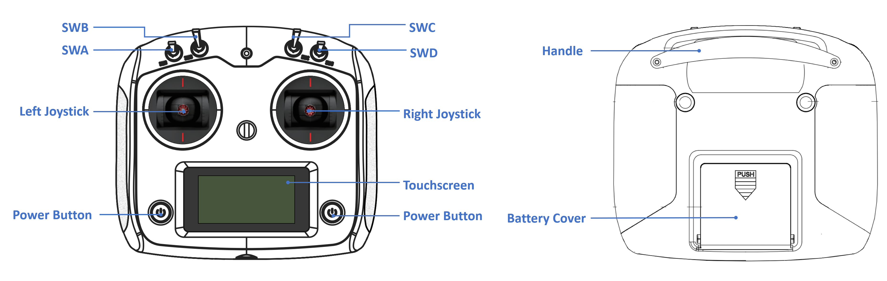

# Getting Started

In this tutorial, you will learn how to power on and operate this new product, beginning your journey of interacting with Galaxea R1.

## Before You Begin

### Safety

Galaxea R1 has the potential to cause harm if not properly used. We recommend that all users review the Safety Guide before operating the robot.

### Installing

For detailed instructions on how to install each component of Galaxea R1, please refer to the Connecting and Installing section. These tutorials provide step-by-step guidance to ensure proper assembly and setup.

### Turning On

To turn on Galaxea R1, please press the boat-shaped button on the left side of the chassis.

### Charging

To charge Galaxea R1, please use the provided power cable and insert it into the 48V power supply port located at the bottom of the rear of the chassis.

### Shutting Down

Galaxea R1 can be turned off by simply switching off the button on the left side of the chassis.

#### Emergency Stop

The emergency stop button is located at the rear of the chassis. It can be used to immediately halt all operations in case of an emergency or if you encounter any dangerous situations.

## Joystick Controller

- The joystick controller requires four AA batteries.
- To turn on/off the controller, please press and hold both power buttons until the touchscreen lights up/off.

- The TX box shows the battery level of the controller.
- The RX box shows whether the remote control is successfully connected to Galaxea B1. If the connection is successful, it will display a half-filled bar. If the connection is unsuccessful, a question mark will appear in the box.

## Next Step

Our quickstart journey has come to an end. To deepen your mastery of Galaxea R1, we strongly recommend exploring the following chapters in [Galaxea R1 Hardware User Guide](Hardware_Guide.md) and [Galaxea R1 Software User Guide](Software_Guide.md). These resources offer a wealth of additional information and practical examples, guiding you through the intricacies of programming with confidence and ease.