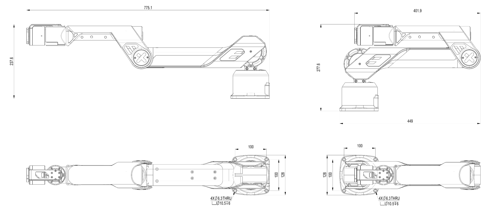

# Galaxea R1 Hardware Guide

## Disclaimer

<u>Galaxea R1 is intended for research applications by users experienced in operating and programming research robots. This product is not designed for general consumer use in the home and does not have the necessary certifications for such purposes. </u>

## Galaxea R1 Technical Specifications

### Electrical Parameters

<table style="width: 100%; border-collapse: collapse;">
  <tr>
    <th style="background-color: black; color: white; vertical-align: middle; padding: 10px; border: 1px solid #ddd;">Electrical Index</th>
    <th style="background-color: black; color: white; vertical-align: middle; padding: 10px; border: 1px solid #ddd;">Parameters</th>
  </tr>
  <tr>
    <td style="vertical-align: middle; padding: 10px; border: 1px solid #ddd;">Nominal Voltage</td>
    <td style="vertical-align: middle; padding: 10px; border: 1px solid #ddd;">48 V</td>
  </tr>
  <tr>
    <td style="vertical-align: middle; padding: 10px; border: 1px solid #ddd;">Rated Capacity</td>
    <td style="vertical-align: middle; padding: 10px; border: 1px solid #ddd;">30 Ah</td>
  </tr>
  <tr>
    <td style="vertical-align: middle; padding: 10px; border: 1px solid #ddd;">Power Supply</td>
    <td style="vertical-align: middle; padding: 10px; border: 1px solid #ddd;">Lithium-ion Battery</td>
  </tr>
  <tr>
    <td style="vertical-align: middle; padding: 10px; border: 1px solid #ddd;">Cooling System</td>
    <td style="vertical-align: middle; padding: 10px; border: 1px solid #ddd;">Low-noise Local Air Cooling</td>
  </tr>
  <tr>
    <td style="vertical-align: middle; padding: 10px; border: 1px solid #ddd;">Charger</td>
    <td style="vertical-align: middle; padding: 10px; border: 1px solid #ddd;">600 W (Fully charged in 1.5 hours)</td>
  </tr>
</table>

## Performance Parameters

<table style="width: 100%; border-collapse: collapse;">
  <tr>
    <th style="background-color: black; color: white; vertical-align: middle; padding: 10px; border: 1px solid #ddd;">Machine Features</th>
    <th style="background-color: black; color: white; vertical-align: middle; padding: 10px; border: 1px solid #ddd;">Values</th>
  </tr>
  <tr>
    <td style="vertical-align: middle; padding: 10px; border: 1px solid #ddd;">Height</td>
    <td style="vertical-align: middle; padding: 10px; border: 1px solid #ddd;">1685 mm when standing  1020 mm when folded</td>
  </tr>
  <tr>
    <td style="vertical-align: middle; padding: 10px; border: 1px solid #ddd;">Depth</td>
    <td style="vertical-align: middle; padding: 10px; border: 1px solid #ddd;">220 mm for chest  445 mm for chassis</td>
  </tr>
  <tr>
    <td style="vertical-align: middle; padding: 10px; border: 1px solid #ddd;">Width</td>
    <td style="vertical-align: middle; padding: 10px; border: 1px solid #ddd;">530 mm</td>
  </tr>
  <tr>
    <td style="vertical-align: middle; padding: 10px; border: 1px solid #ddd;">Weight</td>
    <td style="vertical-align: middle; padding: 10px; border: 1px solid #ddd;">70 kg with battery</td>
  </tr>
  <tr>
    <td style="vertical-align: middle; padding: 10px; border: 1px solid #ddd;">Degree of Freedom</td>
    <td style="vertical-align: middle; padding: 10px; border: 1px solid #ddd;">24 DOF in Total:  6 DOF for chassis, 4 DOF for torso, 14 DOF for two arms with grippers</td>
  </tr>
  <tr>
    <td style="vertical-align: middle; padding: 10px; border: 1px solid #ddd;">Arm Payload</td>
    <td style="vertical-align: middle; padding: 10px; border: 1px solid #ddd;">Rated 2 kg Maximum 5 kg</td>
  </tr>
  <tr>
    <td style="vertical-align: middle; padding: 10px; border: 1px solid #ddd;">Arm Reach</td>
    <td style="vertical-align: middle; padding: 10px; border: 1px solid #ddd;">700 mm  The arm touches the ground when folded and reaches up to 2 m when standing.</td>
  </tr>
  <tr>
    <td style="vertical-align: middle; padding: 10px; border: 1px solid #ddd;">Torso Movement Space</td>
    <td style="vertical-align: middle; padding: 10px; border: 1px solid #ddd;">Waist: Yaw ±170°  Hip: Pitch ±70°  Knee: W1 (0°~125°), W2 (-170°~90°)  (600 mm in height adjustment range)</td>
  </tr>
  <tr>
    <td style="vertical-align: middle; padding: 10px; border: 1px solid #ddd;">Torso Motor Torque</td>
    <td style="vertical-align: middle; padding: 10px; border: 1px solid #ddd;">Rated 100 NM Maximum 200 NM</td>
  </tr>
</table>

## Robot Structure

### Head

The ZED2 3D + DEPTH Camera is attached to the robot head. It provides high-definition 3D video and neural depth perception of the environment, with a wide field of view and an electronically synchronized rolling shutter, making it an ideal choice for applications requiring precise spatial awareness and real-time 3D mapping.

### Arm

Galaxea R1 features two Galaxea A1 robotic arms. Each arm consists of two main links made from Acrylonitrile Butadiene Styrene (ABS), which is lightweight, rigid and durable. These links are mounted on a base inserted inside the body, and interconnected by six joints. Each joint is equipped with planetary gear motors, enabling independent variable-speed operation with high precision and torque.

In the current version of Galaxea A1 Robot Arm, the motor does not have a brake, so cutting off the power may cause the robotic arm to drop suddenly. We will continue to improve the product to address this issue.

The arm is designed to have:

<table style="width: 100%; border-collapse: collapse;">
  <tr>
    <th style="background-color: black; color: white; vertical-align: middle; padding: 10px; border: 1px solid #ddd;">Item</th>
    <th style="background-color: black; color: white; vertical-align: middle; padding: 10px; border: 1px solid #ddd;">Notes</th>
  </tr>
  <tr>
    <td style="vertical-align: middle; padding: 10px; border: 1px solid #ddd;">Length</td>
    <td style="vertical-align: middle; padding: 10px; border: 1px solid #ddd;">Deployed 775 mm Folded 449 mm</td>
  </tr>
  <tr>
    <td style="vertical-align: middle; padding: 10px; border: 1px solid #ddd;">Height</td>
    <td style="vertical-align: middle; padding: 10px; border: 1px solid #ddd;">Deployed 237 mm Folded 277 mm</td>
  </tr>
  <tr>
    <td style="vertical-align: middle; padding: 10px; border: 1px solid #ddd;">Width</td>
    <td style="vertical-align: middle; padding: 10px; border: 1px solid #ddd;">128 mm</td>
  </tr>
</table>

See [Galaxea A1 User Guide](../A1/Getting_Started.md) if you want to explore more.

### Base

The chassis is triangular in shape and equipped with three steering wheels. The power button is on the left side of the chassis and the emergency stop button is at the rear of the chassis.

To charge the robot, please use the provided power cable and insert it into the 48V power supply port located at the bottom of the rear of the chassis.

<table style="width: 100%; border-collapse: collapse;">
  <tr>
    <th style="background-color: black; color: white; vertical-align: middle; padding: 10px; border: 1px solid #ddd;">Item</th>
    <th style="background-color: black; color: white; vertical-align: middle; padding: 10px; border: 1px solid #ddd;">Notes</th>
  </tr>
  <tr>
    <td style="vertical-align: middle; padding: 10px; border: 1px solid #ddd;">Length</td>
    <td style="vertical-align: middle; padding: 10px; border: 1px solid #ddd;">555 mm</td>
  </tr>
  <tr>
    <td style="vertical-align: middle; padding: 10px; border: 1px solid #ddd;">Height</td>
    <td style="vertical-align: middle; padding: 10px; border: 1px solid #ddd;">313 mm</td>
  </tr>
  <tr>
    <td style="vertical-align: middle; padding: 10px; border: 1px solid #ddd;">Width</td>
    <td style="vertical-align: middle; padding: 10px; border: 1px solid #ddd;">572 mm</td>
  </tr>
  <tr>
    <td style="vertical-align: middle; padding: 10px; border: 1px solid #ddd;">Emergency Stop Button</td>
    <td style="vertical-align: middle; padding: 10px; border: 1px solid #ddd;">Used for immediate power interruption during emergencies.</td>
  </tr>
  <tr>
    <td style="vertical-align: middle; padding: 10px; border: 1px solid #ddd;">Power Button</td>
    <td style="vertical-align: middle; padding: 10px; border: 1px solid #ddd;">Used to turn on/off the robot</td>
  </tr>
  <tr>
    <td style="vertical-align: middle; padding: 10px; border: 1px solid #ddd;">Power Supply Port</td>
    <td style="vertical-align: middle; padding: 10px; border: 1px solid #ddd;">Rated voltage 48 V</td>
  </tr>
</table>

### Sensors

Galaxea R1 includes a number of sensors that allow it to perceive the environment.

[//]: # (Galaxea R1 includes a number of sensors that allow it to perceive the environment:)

[//]: # ()
[//]: # (<table style="width: 100%; border-collapse: collapse;">)

[//]: # (  <tr>)

[//]: # (    <th style="background-color: black; color: white; vertical-align: middle; padding: 10px; border: 1px solid #ddd;">Units & Sensors</th>)

[//]: # (    <th style="background-color: black; color: white; vertical-align: middle; padding: 10px; border: 1px solid #ddd;">Notes</th>)

[//]: # (  </tr>)

[//]: # (  <tr>)

[//]: # (    <td style="vertical-align: middle; padding: 10px; border: 1px solid #ddd;">Basic Computing Capability</td>)

[//]: # (    <td style="vertical-align: middle; padding: 10px; border: 1px solid #ddd;">14 Core 3.8 GHz CPU</td>)

[//]: # (  </tr>)

[//]: # (  <tr>)

[//]: # (    <td style="vertical-align: middle; padding: 10px; border: 1px solid #ddd;">Deep Learning Computing Capability</td>)

[//]: # (    <td style="vertical-align: middle; padding: 10px; border: 1px solid #ddd;">3070 16 GB Video Memory</td>)

[//]: # (  </tr>)

[//]: # (  <tr>)

[//]: # (    <td style="vertical-align: middle; padding: 10px; border: 1px solid #ddd;">Memory</td>)

[//]: # (    <td style="vertical-align: middle; padding: 10px; border: 1px solid #ddd;">64 G</td>)

[//]: # (  </tr>)

[//]: # (  <tr>)

[//]: # (    <td style="vertical-align: middle; padding: 10px; border: 1px solid #ddd;">Hard Disk</td>)

[//]: # (    <td style="vertical-align: middle; padding: 10px; border: 1px solid #ddd;">1T SSD</td>)

[//]: # (  </tr>)

[//]: # (  <tr>)

[//]: # (    <td style="vertical-align: middle; padding: 10px; border: 1px solid #ddd;">Camera</td>)

[//]: # (    <td style="vertical-align: middle; padding: 10px; border: 1px solid #ddd;">Dual RGB &#40;optional dual RGBD&#41;</td>)

[//]: # (  </tr>)

[//]: # (  <tr>)

[//]: # (    <td style="vertical-align: middle; padding: 10px; border: 1px solid #ddd;">Joint Encoder</td>)

[//]: # (    <td style="vertical-align: middle; padding: 10px; border: 1px solid #ddd;">Dual Encoder</td>)

[//]: # (  </tr>)

[//]: # (  <tr>)

[//]: # (    <td style="vertical-align: middle; padding: 10px; border: 1px solid #ddd;">Others</td>)

[//]: # (    <td style="vertical-align: middle; padding: 10px; border: 1px solid #ddd;">WiFi, Bluetooth, HDMI</td>)

[//]: # (  </tr>)

[//]: # (</table>)

#### Camera

The [ZED2](https://www.stereolabs.com/products/zed-2) 3D + DEPTH Camera is attached to the robot head. By combining AI and 3D techniques, this camera can detect and track objects with spactial context. An all-aluminum enclosure with thermal control makes it robust and compensates for focal length and motion sensors biases.

<table>
  <tr>
    <th style="background-color: black; color: white; vertical-align: middle;">Specification</th>
    <th style="background-color: black; color: white; vertical-align: middle;">Parameters</th>
  </tr>
  <tr>
    <td style="vertical-align: middle;">Output Resolution</td>
    <td>2 x (2208 x 1242) @15 fps  2 x (1920 x 1080) @30 fps  2 x (1280 x 720) @60 fps  2 x (672 x 376) @100 fps</td>
  </tr>
  <tr>
    <td style="vertical-align: middle;">Field of View</td>
    <td>Max. 110°(H) x 70°(V) x 120°(D)</td>
  </tr>
  <tr>
    <td style="vertical-align: middle;">Depth Range</td>
    <td>0.3 m to 20 m</td>
  </tr>
  <tr>
    <td style="vertical-align: middle;">Depth Accuracy</td>
    <td>&lt; 1% up to 3 m (9.84 ft) &lt; 5% up to 15 m</td>
  </tr>
  <tr>
    <td style="vertical-align: middle;">Dimension</td>
    <td>174.9 x 29.8 x 31.9 mm</td>
  </tr>
  <tr>
    <td style="vertical-align: middle;">Weight</td>
    <td>164 g</td>
  </tr>
</table>

### Computing Unit
<table style="width: 100%; border-collapse: collapse;">
  <tr>
    <th style="background-color: black; color: white; vertical-align: middle; padding: 10px; border: 1px solid #ddd;">Units & Sensors</th>
    <th style="background-color: black; color: white; vertical-align: middle; padding: 10px; border: 1px solid #ddd;">Notes</th>
  </tr>
  <tr>
    <td style="vertical-align: middle; padding: 10px; border: 1px solid #ddd;">Basic Computating Capability</td>
    <td style="vertical-align: middle; padding: 10px; border: 1px solid #ddd;">14 Core 3.8GHz CPU</td>
  </tr>
  <tr>
    <td style="vertical-align: middle; padding: 10px; border: 1px solid #ddd;">Deep Learning Computing Capability</td>
    <td style="vertical-align: middle; padding: 10px; border: 1px solid #ddd;">3070 16GB Video Memory</td>
  </tr>
  <tr>
    <td style="vertical-align: middle; padding: 10px; border: 1px solid #ddd;">Memory</td>
    <td style="vertical-align: middle; padding: 10px; border: 1px solid #ddd;">64GB</td>
  </tr>
  <tr>
    <td style="vertical-align: middle; padding: 10px; border: 1px solid #ddd;">Hard Disk</td>
    <td style="vertical-align: middle; padding: 10px; border: 1px solid #ddd;">1TB SSD</td>
  </tr>
  <tr>
    <td style="vertical-align: middle; padding: 10px; border: 1px solid #ddd;">Camera</td>
    <td style="vertical-align: middle; padding: 10px; border: 1px solid #ddd;">Dual RGB (optional dual RGBD)</td>
  </tr>
  <tr>
    <td style="vertical-align: middle; padding: 10px; border: 1px solid #ddd;">Joint Encoder</td>
    <td style="vertical-align: middle; padding: 10px; border: 1px solid #ddd;">Dual Encoder</td>
  </tr>
  <tr>
    <td style="vertical-align: middle; padding: 10px; border: 1px solid #ddd;">Others</td>
    <td style="vertical-align: middle; padding: 10px; border: 1px solid #ddd;">WiFi, Bluetooth, HDMI </td>
  </tr>
</table>

## Next Step
This concludes the hardware guide for Galaxea R1. For further details, please refer to [Galaxea R1 Software Guide](Software_Guide_firstmove.md).