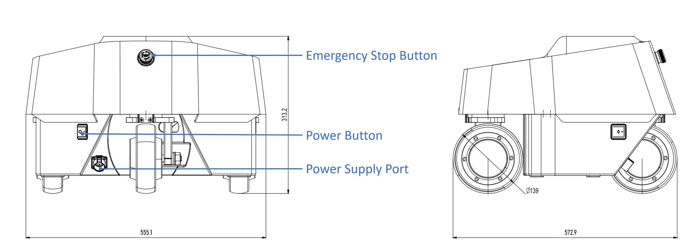

# Galaxea R1 Hardware Guide

## Disclaimer

Galaxea R1 is intended for research applications by users experienced in operating and programming research robots. This product is not designed for general consumer use in the home and does not have the necessary certifications for such purposes.

## Technical Specifications

<table style="width: 100%; border-collapse: collapse;">
    <thead>
        <tr style="background-color: black; color: white; text-align: left;">
            <th style="width: 300px; padding: 8px; border: 1px solid #ddd;">Mechanical</th>
            <th style="width: 400px; padding: 8px; border: 1px solid #ddd;">Values</th>
        </tr>
    </thead>
    <tbody>
        <tr style="background-color: white; text-align: left;">
            <td style="padding: 8px; border: 1px solid #ddd;">Height</td>
            <td style="padding: 8px; border: 1px solid #ddd;">1695 mm when standing 878 mm when folded</td>
        </tr>
        <tr style="background-color: white; text-align: left;">
            <td style="padding: 8px; border: 1px solid #ddd;">Depth</td>
            <td style="padding: 8px; border: 1px solid #ddd;">220 mm for chest 625 mm for chassis</td>
        </tr>
        <tr style="background-color: white; text-align: left;">
            <td style="padding: 8px; border: 1px solid #ddd;">Width</td>
            <td style="padding: 8px; border: 1px solid #ddd;">676 mm</td>
        </tr>
        <tr style="background-color: white; text-align: left;">
            <td style="padding: 8px; border: 1px solid #ddd;">Weight</td>
            <td style="padding: 8px; border: 1px solid #ddd;">96 kg with battery</td>
        </tr>
        <tr style="background-color: white; text-align: left;">
            <td style="padding: 8px; border: 1px solid #ddd;">Nominal Voltage</td>
            <td style="padding: 8px; border: 1px solid #ddd;">48 V</td>
        </tr>
        <tr style="background-color: white; text-align: left;">
            <td style="padding: 8px; border: 1px solid #ddd;">Rated Capacity</td>
            <td style="padding: 8px; border: 1px solid #ddd;">35 Ah</td>
        </tr>
        <tr style="background-color: white; text-align: left;">
            <td style="padding: 8px; border: 1px solid #ddd;">Power Supply</td>
            <td style="padding: 8px; border: 1px solid #ddd;">Lithium-ion Battery</td>
        </tr>
        <tr style="background-color: white; text-align: left;">
            <td style="padding: 8px; border: 1px solid #ddd;">Battery Energy</td>
            <td style="padding: 8px; border: 1px solid #ddd;">1680 Wh</td>
        </tr>
        <tr style="background-color: white; text-align: left;">
            <td style="padding: 8px; border: 1px solid #ddd;">Battery Management System (BMS)</td>
            <td style="padding: 8px; border: 1px solid #ddd;">Supported</td>
        </tr>        
        <tr style="background-color: white; text-align: left;">
            <td style="padding: 8px; border: 1px solid #ddd;">Cooling System</td>
            <td style="padding: 8px; border: 1px solid #ddd;">Low-noise Local Air Cooling</td>
        </tr>
    </tbody>
</table>

<table style="width: 100%; border-collapse: collapse;">
    <thead>
        <tr style="background-color: black; color: white; text-align: left;">
            <th style="width: 300px; padding: 8px; border: 1px solid #ddd;">Performance</th>
            <th style="width: 400px; padding: 8px; border: 1px solid #ddd;">Values</th>
        </tr>
    </thead>
    <tbody>
        <tr style="background-color: white; text-align: left;">
            <td style="padding: 8px; border: 1px solid #ddd;">Degree of Freedom</td>
            <td style="padding: 8px; border: 1px solid #ddd;">24 DOF in total 6 DOF for chassis 4 DOF for torso 14 DOF for dual arms with grippers</td>
        </tr>
        <tr style="background-color: white; text-align: left;">
            <td style="padding: 8px; border: 1px solid #ddd;">Arm Payload</td>
            <td style="padding: 8px; border: 1px solid #ddd;">Rated: 2 kg@0.5 m Max.: 5 kg@0.5m</td>
        </tr>
        <tr style="background-color: white; text-align: left;">
            <td style="padding: 8px; border: 1px solid #ddd;">Operating Range</td>
            <td style="padding: 8px; border: 1px solid #ddd;">Vertical: 0 ~ 2000 mm   Horizontal: 700 mm</td>
        </tr>
        <tr style="background-color: white; text-align: left;">
            <td style="padding: 8px; border: 1px solid #ddd;">Torso Functions</td>
            <td style="padding: 8px; border: 1px solid #ddd;">Lift/Tilt/Swivel</td>
        </tr>
        <tr style="background-color: white; text-align: left;">
            <td style="padding: 8px; border: 1px solid #ddd;">Function</td>
            <td style="padding: 8px; border: 1px solid #ddd;">Torso: Lift/Tilt/Swivel Chassis: Ackerman/Translation/Spinning</td>
        </tr>
    </tbody>
</table>

<table style="width: 100%; border-collapse: collapse;">
    <thead>
        <tr style="background-color: black; color: white; text-align: left;">
            <th style="width: 300px; padding: 8px; border: 1px solid #ddd;">Control</th>
            <th style="width: 400px; padding: 8px; border: 1px solid #ddd;">Values</th>
        </tr>
    </thead>
    <tbody>
        <tr style="background-color: white; text-align: left;">
            <td style="padding: 8px; border: 1px solid #ddd;">Control Mode</td>
            <td style="padding: 8px; border: 1px solid #ddd;">Joystick Controller Teleoperation Upper Computer Command</td>
        </tr>
        <tr style="background-color: white; text-align: left;">
            <td style="padding: 8px; border: 1px solid #ddd;">Joystick Controller</td>
            <td style="padding: 8px; border: 1px solid #ddd;">Radio Frequency: 2.4G Max. Remote Range: 1.5 km</td>
        </tr>
        <tr style="background-color: white; text-align: left;">
            <td style="padding: 8px; border: 1px solid #ddd;">Communication Interface</td>
            <td style="padding: 8px; border: 1px solid #ddd;">CAN</td>
        </tr>
    </tbody>
</table>

## Robot Structure

### Head

The ZED2 3D + DEPTH Camera is attached to the robot head. It provides high-definition 3D video and neural depth perception of the environment, with a wide field of view and an electronically synchronized rolling shutter, making it an ideal choice for applications requiring precise spatial awareness and real-time 3D mapping.

### Arm

Galaxea R1 features two [Galaxea A1](https://github.com/userguide-galaxea/Product_User_Guide/blob/galaxea/main/docs/Guide/R1/docs/Introducing_Galaxea_Robot/product_info/A1.md) robot arms. Each arm consists of two main links made from Acrylonitrile Butadiene Styrene (ABS), which is lightweight, rigid and durable. These links are mounted on a base inserted inside the body, and interconnected by six joints. Each joint is equipped with planetary gear motors, enabling independent variable-speed operation with high precision and torque.

In the current version of Galaxea A1, the motor does not have a brake, so cutting off the power may cause the robotic arm to drop suddenly. We will continue to improve the product to address this issue.

<table style="width: 100%; border-collapse: collapse;">
    <thead>
        <tr style="background-color: black; color: white; text-align: left;">
            <th style="width: 300px; padding: 8px; border: 1px solid #ddd;">Item</th>
            <th style="width: 400px; padding: 8px; border: 1px solid #ddd;">Notes</th>
        </tr>
    </thead>
    <tbody>
        <tr style="background-color: white; text-align: left;">
            <td style="padding: 8px; border: 1px solid #ddd;">Dimensions</td>
            <td style="padding: 8px; border: 1px solid #ddd;">Deployed: 918L x 128W x 237H mm Folded: 545L x 128W x 277H mm</td>
        </tr>
        <tr style="background-color: white; text-align: left;">
            <td style="padding: 8px; border: 1px solid #ddd;">Degree of Freedom</td>
            <td style="padding: 8px; border: 1px solid #ddd;">7</td>
        </tr>
        <tr style="background-color: white; text-align: left;">
            <td style="padding: 8px; border: 1px solid #ddd;">Maximum Payload</td>
            <td style="padding: 8px; border: 1px solid #ddd;">5 kg</td>
        </tr>
        <tr style="background-color: white; text-align: left;">
            <td style="padding: 8px; border: 1px solid #ddd;">Gripper Rated Force</td>
            <td style="padding: 8px; border: 1px solid #ddd;">100 N</td>
        </tr>
        <tr style="background-color: white; text-align: left;">
            <td style="padding: 8px; border: 1px solid #ddd;">Weight</td>
            <td style="padding: 8px; border: 1px solid #ddd;">6 kg</td>
        </tr>
    </tbody>
</table>

See [Galaxea A1 User Guide](../A1/Hardware_Guide.md) if you want to explore more.

### Torso

<table style="width: 60%; border-collapse: collapse;">
    <thead>
        <tr style="background-color: black; color: white; text-align: left;">
            <th style="width: 300px; padding: 8px; border: 1px solid #ddd;">Item</th>
            <th style="width: 400px; padding: 8px; border: 1px solid #ddd;">Notes</th>
        </tr>
    </thead>
    <tbody>
        <tr style="background-color: white; text-align: left;">       
        <tr style="background-color: white; text-align: left;">
            <td style="padding: 8px; border: 1px solid #ddd;">Operating Range (Height)</td>
            <td style="padding: 8px; border: 1px solid #ddd;">0 ~ 600 mm</td>
        </tr>
         </tr>
        <tr style="background-color: white; text-align: left;">
            <td style="padding: 8px; border: 1px solid #ddd;">Waist Movement Space (Yaw)</td>
            <td style="padding: 8px; border: 1px solid #ddd;">±170°</td>
        </tr>   
        <tr style="background-color: white; text-align: left;">
            <td style="padding: 8px; border: 1px solid #ddd;">Hip Movement Space (Pitch)</td>
            <td style="padding: 8px; border: 1px solid #ddd;">±100°</td>
        </tr> 
        <tr style="background-color: white; text-align: left;">
            <td style="padding: 8px; border: 1px solid #ddd;">Knee Movement Space</td>
            <td style="padding: 8px; border: 1px solid #ddd;">W1: 0°~100° W2: -154°~145°</td>
        </tr> 
        <tr style="background-color: white; text-align: left;">
            <td style="padding: 8px; border: 1px solid #ddd;">Torso Motor Torque</td>
            <td style="padding: 8px; border: 1px solid #ddd;">Rated: 100 NM Max.: 200 NM</td>
        </tr>  
    </tbody>
</table>

### Base

The chassis is triangular in shape and equipped with three steering wheels. The power button is on the left side of the chassis and the emergency stop button is at the rear of the chassis.

To charge the robot, please use the provided power cable and insert it into the 48 V power supply port located at the bottom of the rear of the chassis.

<table style="width: 100%; border-collapse: collapse;">
    <thead>
        <tr style="background-color: black; color: white; text-align: left;">
            <th style="width: 300px; padding: 8px; border: 1px solid #ddd;">Item</th>
            <th style="width: 400px; padding: 8px; border: 1px solid #ddd;">Notes</th>
        </tr>
    </thead>
    <tbody>
        <tr style="background-color: white; text-align: left;">
            <td style="padding: 8px; border: 1px solid #ddd;">Dimensions</td>
            <td style="padding: 8px; border: 1px solid #ddd;">445L x 476W x 313H mm</td>
        </tr>
        <tr style="background-color: white; text-align: left;">
            <td style="padding: 8px; border: 1px solid #ddd;">Power Button</td>
            <td style="padding: 8px; border: 1px solid #ddd;">Used to turn on/off the robot</td>
        </tr>
        <tr style="background-color: white; text-align: left;">
            <td style="padding: 8px; border: 1px solid #ddd;">Emergency Stop Button</td>
            <td style="padding: 8px; border: 1px solid #ddd;">Used for immediate power interruption during emergencies</td>
        </tr>
        <tr style="background-color: white; text-align: left;">
            <td style="padding: 8px; border: 1px solid #ddd;">Power Supply Port</td>
            <td style="padding: 8px; border: 1px solid #ddd;">Rated voltage 48 V</td>
        </tr>
    </tbody>
</table>

### Sensors

Galaxea R1 includes a number of sensors that allow it to perceive the environment.

<table style="width: 100%; border-collapse: collapse;">
    <thead>
        <tr style="background-color: black; color: white; text-align: left;">
            <th style="width: 300px; padding: 8px; border: 1px solid #ddd;">Sensor</th>
            <th style="width: 400px; padding: 8px; border: 1px solid #ddd;">Values</th>
        </tr>
    </thead>
    <tbody>
        <tr style="background-color: white; text-align: left;">
            <td style="padding: 8px; border: 1px solid #ddd;">Camera</td>
            <td style="padding: 8px; border: 1px solid #ddd;">Head: 1 * Dual Camera Wrist: 2 * RGBD Camera Chassis: 5 * RGB Camera</td>
        </tr>
        <tr style="background-color: white; text-align: left;">
            <td style="padding: 8px; border: 1px solid #ddd;">LiDar</td>
            <td style="padding: 8px; border: 1px solid #ddd;">1 * 360°</td>
        </tr>
    </tbody>
</table>

#### Camera

<table style="width: 100%; border-collapse: collapse;">
    <thead>
        <tr style="background-color: black; color: white; text-align: left;">
            <th style="width: 300px; padding: 8px; border: 1px solid #ddd;">Specification</th>
            <th style="width: 400px; padding: 8px; border: 1px solid #ddd;"><a href="https://www.stereolabs.com/en-sg/products/zed-2"> ZED 2</a></th>
            <th style="width: 400px; padding: 8px; border: 1px solid #ddd;"><a href="https://www.intelrealsense.com/depth-camera-d435i/"> RealSense D435i</a></th>          
            <th style="width: 400px; padding: 8px; border: 1px solid #ddd;"><a href="https://www.sensing-world.com/en/pd.jsp?recommendFromPid=0&id=156&fromMid=1544">SENSING SG2-IMX390C-GMSL2-H120H</a></th>              
        </tr>
    </thead>
    <tbody>
        <tr style="background-color: white; text-align: left;">
            <td style="padding: 8px; border: 1px solid #ddd;">Output Resolution</td>
            <td style="padding: 8px; border: 1px solid #ddd;">Depth: 1920 x 1080 @30fps</td>
            <td style="padding: 8px; border: 1px solid #ddd;">Depth: 1280 x 720 @30FPS RGB: 1920*1080</td>
            <td style="padding: 8px; border: 1px solid #ddd;">Depth: 1920 x 1080 @30fps</td>            
        </tr>
        <tr style="background-color: white; text-align: left;">
            <td style="padding: 8px; border: 1px solid #ddd;">Field of View</td>
            <td style="padding: 8px; border: 1px solid #ddd;">110°H x 70°V x 120°D</td>
            <td style="padding: 8px; border: 1px solid #ddd;">87°H x 58°V x 95°D</td>
            <td style="padding: 8px; border: 1px solid #ddd;">118°H x 62°V</td>           
        </tr>
        <tr style="background-color: white; text-align: left;">
            <td style="padding: 8px; border: 1px solid #ddd;">Depth Range</td>
            <td style="padding: 8px; border: 1px solid #ddd;">0.3 m ~ 20 m</td>
            <td style="padding: 8px; border: 1px solid #ddd;">0.2 m ~ 3 m</td>      
            <td style="padding: 8px; border: 1px solid #ddd;">\</td>                      
        </tr>
        <tr style="background-color: white; text-align: left;">
            <td style="padding: 8px; border: 1px solid #ddd;">Dimensions</td>
            <td style="padding: 8px; border: 1px solid #ddd;">174.9L x 29.8W x 31.9H mm</td>
            <td style="padding: 8px; border: 1px solid #ddd;">90L x 25W x 25H mm</td> 
            <td style="padding: 8px; border: 1px solid #ddd;">30L x 30W x 22.5H mm</td>            
        </tr>
        <tr style="background-color: white; text-align: left;">
            <td style="padding: 8px; border: 1px solid #ddd;">Weight</td>
            <td style="padding: 8px; border: 1px solid #ddd;">164 g</td>
            <td style="padding: 8px; border: 1px solid #ddd;">75 g</td>
            <td style="padding: 8px; border: 1px solid #ddd;">＜50 g</td>            
        </tr>
        <tr style="background-color: white; text-align: left;">
            <td style="padding: 8px; border: 1px solid #ddd;">Operating Temp. Range</td>
            <td style="padding: 8px; border: 1px solid #ddd;">-10 °C ~ +45°C</td>
            <td style="padding: 8px; border: 1px solid #ddd;">0 ~ +85°C </td>
            <td style="padding: 8px; border: 1px solid #ddd;">-40 ~ +85°C </td>            
        </tr>        
    </tbody>
</table>

#### LiDAR

[LIVOX MID-360](https://www.livoxtech.com/mid-360) delivers 3D perception in 360 degrees for robots, featuring active anti-interference capabilities and resilience in both bright and low-light environments.

<table style="width: 100%; border-collapse: collapse;">
    <thead>
        <tr style="background-color: black; color: white; text-align: left;">
            <th style="width: 300px; padding: 8px; border: 1px solid #ddd;">Specification</th>
            <th style="width: 400px; padding: 8px; border: 1px solid #ddd;">Values</th>
        </tr>
    </thead>
    <tbody>
        <tr style="background-color: white; text-align: left;">
            <td style="padding: 8px; border: 1px solid #ddd;">Basic Computating Capability</td>
            <td style="padding: 8px; border: 1px solid #ddd;">14 Core 3.8 GHz CPU</td>
        </tr>
        <tr style="background-color: white; text-align: left;">
            <td style="padding: 8px; border: 1px solid #ddd;">Laser Wavelength</td>
            <td style="padding: 8px; border: 1px solid #ddd;">905 nm</td>
        </tr>
        <tr style="background-color: white; text-align: left;">
            <td style="padding: 8px; border: 1px solid #ddd;">FOV</td>
            <td style="padding: 8px; border: 1px solid #ddd;">360°H x 59°V</td>
        </tr>
        <tr style="background-color: white; text-align: left;">
            <td style="padding: 8px; border: 1px solid #ddd;">Detection Range</td>
            <td style="padding: 8px; border: 1px solid #ddd;">40 m @10% Reflectivity 70 m @80% Reflectivity</td>
        </tr>
        <tr style="background-color: white; text-align: left;">
            <td style="padding: 8px; border: 1px solid #ddd;">Close Proximity Blind Zone</td>
            <td style="padding: 8px; border: 1px solid #ddd;">0.1 m</td>
        </tr>
        <tr style="background-color: white; text-align: left;">
            <td style="padding: 8px; border: 1px solid #ddd;">Data Port</td>
            <td style="padding: 8px; border: 1px solid #ddd;">100 BASE-TX Ethernet</td>
        </tr>
        <tr style="background-color: white; text-align: left;">
            <td style="padding: 8px; border: 1px solid #ddd;">IMU</td>
            <td style="padding: 8px; border: 1px solid #ddd;">Built-in IMU Model</td>
        </tr>
        <tr style="background-color: white; text-align: left;">
            <td style="padding: 8px; border: 1px solid #ddd;">Operating Temp. Range</td>
            <td style="padding: 8px; border: 1px solid #ddd;">-20℃ ~ +55℃</td>
        </tr>
        <tr style="background-color: white; text-align: left;">
            <td style="padding: 8px; border: 1px solid #ddd;">Dimensions</td>
            <td style="padding: 8px; border: 1px solid #ddd;">L65 x W65 x H60 mm</td>
        </tr>
        <tr style="background-color: white; text-align: left;">
            <td style="padding: 8px; border: 1px solid #ddd;">Weight</td>
            <td style="padding: 8px; border: 1px solid #ddd;">265 g</td>
        </tr>
    </tbody>
</table>

### Computing Unit

<table style="width: 100%; border-collapse: collapse;">
    <thead>
        <tr style="background-color: black; color: white; text-align: left;">
            <th style="width: 300px; padding: 8px; border: 1px solid #ddd;">Units</th>
            <th style="width: 400px; padding: 8px; border: 1px solid #ddd;">Single SOC</th>
            <th style="width: 400px; padding: 8px; border: 1px solid #ddd;">Dual SOC</th>
        </tr>
    </thead>
    <tbody>
        <tr style="background-color: white; text-align: left;">
            <td style="padding: 8px; border: 1px solid #ddd;">Basic Computating Capability</td>
            <td style="padding: 8px; border: 1px solid #ddd;">8 Core 2.2GHz CPU</td>
            <td style="padding: 8px; border: 1px solid #ddd;">2 * 12 Core 2.2GHz CPU</td>
        </tr>
        <tr style="background-color: white; text-align: left;">
            <td style="padding: 8px; border: 1px solid #ddd;">Deep Learning Computing Capability</td>
            <td style="padding: 8px; border: 1px solid #ddd;">200 Tops</td>
            <td style="padding: 8px; border: 1px solid #ddd;">550 Tops</td>
        </tr>
        <tr style="background-color: white; text-align: left;">
            <td style="padding: 8px; border: 1px solid #ddd;">Memory</td>
            <td style="padding: 8px; border: 1px solid #ddd;">1 x LPDDR5@32G </td>
            <td style="padding: 8px; border: 1px solid #ddd;">2 x LPDDR5@64G </td>
        </tr>
        <tr style="background-color: white; text-align: left;">
            <td style="padding: 8px; border: 1px solid #ddd;">Hard Disk</td>
            <td style="padding: 8px; border: 1px solid #ddd;">1 x SSD@1T</td>
            <td style="padding: 8px; border: 1px solid #ddd;">2 x SSD@512G</td>
        </tr>
        <tr style="background-color: white; text-align: left;">
            <td style="padding: 8px; border: 1px solid #ddd;">WiFi Module</td>
            <td style="padding: 8px; border: 1px solid #ddd;">M.2 Wifi with AP mode</td>
            <td style="padding: 8px; border: 1px solid #ddd;">M.2 Wifi with AP mode</td>
        </tr>
    </tbody>
</table>

## Next Step

This concludes the hardware guide for Galaxea R1. For further details, please refer to [Galaxea R1 Software Guide](Software_Guide_firstmove.md).