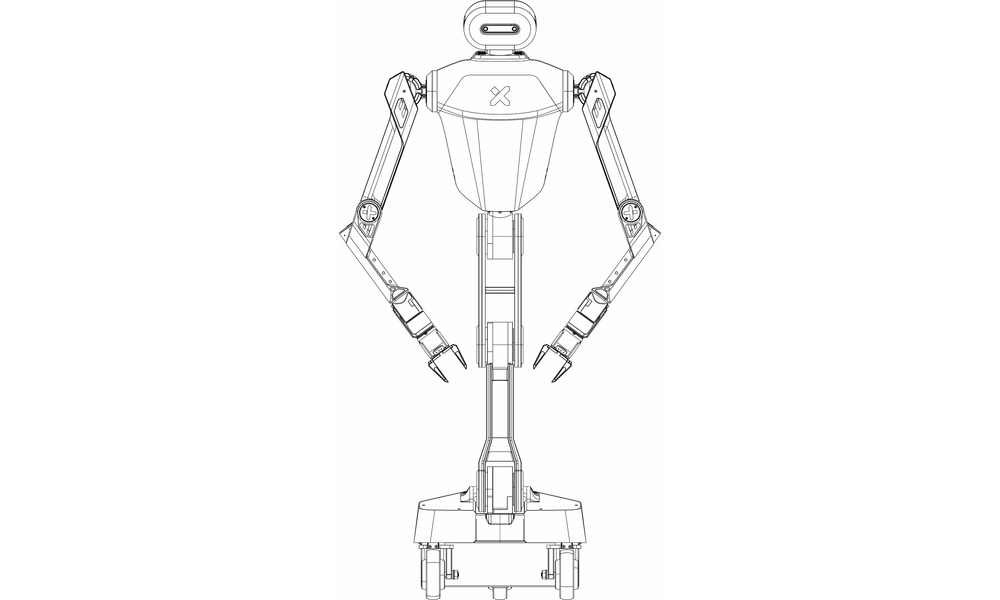
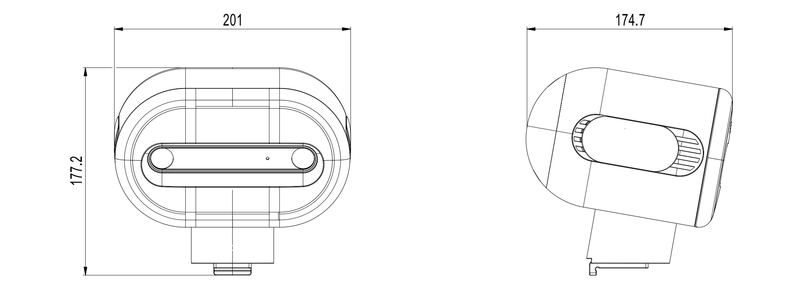
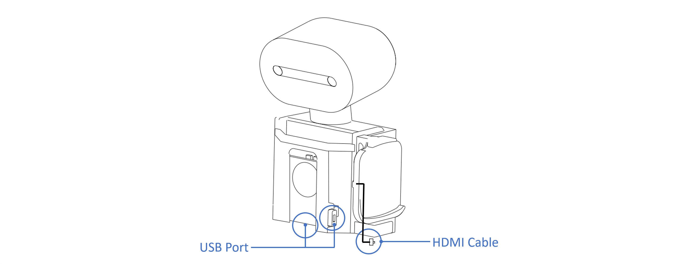

# Galaxea R1 Hardware Guide

## Disclaimer

Galaxea R1 is intended for research applications by users experienced in operating and programming research robots. This product is not designed for general consumer use in the home and does not have the necessary certifications for such purposes.

## Technical Specifications

<table style="width: 100%; border-collapse: collapse;">
    <thead>
        <tr style="background-color: black; color: white; text-align: left;">
            <th style="width: 300px; padding: 8px; border: 1px solid #ddd;">Mechanical</th>
            <th style="width: 400px; padding: 8px; border: 1px solid #ddd;">Values</th>
        </tr>
    </thead>
    <tbody>
        <tr style="background-color: white; text-align: left;">
            <td style="padding: 8px; border: 1px solid #ddd;">Height</td>
            <td style="padding: 8px; border: 1px solid #ddd;">1685mm when standing<br />1020mm when folded</td>
        </tr>
        <tr style="background-color: white; text-align: left;">
            <td style="padding: 8px; border: 1px solid #ddd;">Depth</td>
            <td style="padding: 8px; border: 1px solid #ddd;">220mm for chest<br />445mm for chassis</td>
        </tr>
        <tr style="background-color: white; text-align: left;">
            <td style="padding: 8px; border: 1px solid #ddd;">Width</td>
            <td style="padding: 8px; border: 1px solid #ddd;">530 mm</td>
        </tr>
        <tr style="background-color: white; text-align: left;">
            <td style="padding: 8px; border: 1px solid #ddd;">Weight</td>
            <td style="padding: 8px; border: 1px solid #ddd;">70 kg with battery</td>
        </tr>
        <tr style="background-color: white; text-align: left;">
            <td style="padding: 8px; border: 1px solid #ddd;">Nominal Voltage</td>
            <td style="padding: 8px; border: 1px solid #ddd;">48 V</td>
        </tr>
        <tr style="background-color: white; text-align: left;">
            <td style="padding: 8px; border: 1px solid #ddd;">Rated Capacity</td>
            <td style="padding: 8px; border: 1px solid #ddd;">30 Ah</td>
        </tr>
        <tr style="background-color: white; text-align: left;">
            <td style="padding: 8px; border: 1px solid #ddd;">Power Supply</td>
            <td style="padding: 8px; border: 1px solid #ddd;">Lithium-ion Battery</td>
        </tr>
        <tr style="background-color: white; text-align: left;">
            <td style="padding: 8px; border: 1px solid #ddd;">Cooling System</td>
            <td style="padding: 8px; border: 1px solid #ddd;">Low-noise Local Air Cooling</td>
        </tr>
        <tr style="background-color: white; text-align: left;">
            <td style="padding: 8px; border: 1px solid #ddd;">Charger</td>
            <td style="padding: 8px; border: 1px solid #ddd;">600 W (Fully charged in 1.5 hours)</td>
        </tr>
        <tr style="background-color: white; text-align: left;">
            <td style="padding: 8px; border: 1px solid #ddd;">Chassis Steering Type</td>
            <td style="padding: 8px; border: 1px solid #ddd;">Four-wheel driving and steering</td>
        </tr>
    </tbody>
</table>
<table style="width: 100%; border-collapse: collapse;">
    <thead>
        <tr style="background-color: black; color: white; text-align: left;">
            <th style="width: 300px; padding: 8px; border: 1px solid #ddd;">Performance</th>
            <th style="width: 400px; padding: 8px; border: 1px solid #ddd;">Values</th>
        </tr>
    </thead>
    <tbody>
        <tr style="background-color: white; text-align: left;">
            <td style="padding: 8px; border: 1px solid #ddd;">Degree of Freedom</td>
            <td style="padding: 8px; border: 1px solid #ddd;">24 DOF in total<br />6 DOF for chassis<br />4 DOF for torso<br />14 DOF for dual arms with gripper G1</td>
        </tr>
        <tr style="background-color: white; text-align: left;">
            <td style="padding: 8px; border: 1px solid #ddd;">Maximum Arm Payload</td>
            <td style="padding: 8px; border: 1px solid #ddd;">5 kg</td>
        </tr>
        <tr style="background-color: white; text-align: left;">
            <td style="padding: 8px; border: 1px solid #ddd;">Operating Range (Height)</td>
            <td style="padding: 8px; border: 1px solid #ddd;">0 ~ 200 cm</td>
        </tr>
        <tr style="background-color: white; text-align: left;">
            <td style="padding: 8px; border: 1px solid #ddd;">Operating Radius</td>
            <td style="padding: 8px; border: 1px solid #ddd;">80 cm</td>
        </tr>
        <tr style="background-color: white; text-align: left;">
            <td style="padding: 8px; border: 1px solid #ddd;">Torso Functions</td>
            <td style="padding: 8px; border: 1px solid #ddd;">Lift/Tilt/Swivel</td>
        </tr>
        <tr style="background-color: white; text-align: left;">
            <td style="padding: 8px; border: 1px solid #ddd;">Chassis Functions</td>
            <td style="padding: 8px; border: 1px solid #ddd;">Ackerman/Translation/Spinning</td>
        </tr>
    </tbody>
</table>


<table style="width: 100%; border-collapse: collapse;">
    <thead>
        <tr style="background-color: black; color: white; text-align: left;">
            <th style="width: 300px; padding: 8px; border: 1px solid #ddd;">Control</th>
            <th style="width: 400px; padding: 8px; border: 1px solid #ddd;">Values</th>
        </tr>
    </thead>
    <tbody>
        <tr style="background-color: white; text-align: left;">
            <td style="padding: 8px; border: 1px solid #ddd;">Control Mode</td>
            <td style="padding: 8px; border: 1px solid #ddd;">Joystick Controller Teleoperation<br />Upper Computer Command</td>
        </tr>
        <tr style="background-color: white; text-align: left;">
            <td style="padding: 8px; border: 1px solid #ddd;">Joystick Controller</td>
            <td style="padding: 8px; border: 1px solid #ddd;">2.4G/Maximum Range 1.5 km</td>
        </tr>
        <tr style="background-color: white; text-align: left;">
            <td style="padding: 8px; border: 1px solid #ddd;">Communication Interface</td>
            <td style="padding: 8px; border: 1px solid #ddd;">CAN</td>
        </tr>
    </tbody>
</table>


## Robot Structure




### Head

The ZED2 3D + DEPTH Camera is attached to the robot head. It provides high-definition 3D video and neural depth perception of the environment, with a wide field of view and an electronically synchronized rolling shutter, making it an ideal choice for applications requiring precise spatial awareness and real-time 3D mapping.



### Arm

Galaxea R1 features two Galaxea A1 robotic arms and two Galaxea G1 grippers. Each arm consists of two main links which are lightweight, rigid and durable. Arm joints are equipped with planetary gear motors, enabling independent variable-speed operation with high precision and torque.


<table style="width: 100%; border-collapse: collapse;">
    <thead>
        <tr style="background-color: black; color: white; text-align: left;">
            <th style="width: 300px; padding: 8px; border: 1px solid #ddd;">Item</th>
            <th style="width: 400px; padding: 8px; border: 1px solid #ddd;">Notes</th>
        </tr>
    </thead>
    <tbody>
        <tr style="background-color: white; text-align: left;">
            <td style="padding: 8px; border: 1px solid #ddd;">Dimensions</td>
            <td style="padding: 8px; border: 1px solid #ddd;">Deployed: 918L x 128W x 237H mm<br>Folded: 545L x 128W x 277H mm</td>
        </tr>
        <tr style="background-color: white; text-align: left;">
            <td style="padding: 8px; border: 1px solid #ddd;">Degree of Freedom</td>
            <td style="padding: 8px; border: 1px solid #ddd;">7</td>
        </tr>
        <tr style="background-color: white; text-align: left;">
            <td style="padding: 8px; border: 1px solid #ddd;">Maximum Payload</td>
            <td style="padding: 8px; border: 1px solid #ddd;">5 kg</td>
        </tr>
        <tr style="background-color: white; text-align: left;">
            <td style="padding: 8px; border: 1px solid #ddd;">Gripper Rated Force</td>
            <td style="padding: 8px; border: 1px solid #ddd;">100 N</td>
        </tr>
        <tr style="background-color: white; text-align: left;">
            <td style="padding: 8px; border: 1px solid #ddd;">Weight</td>
            <td style="padding: 8px; border: 1px solid #ddd;">6 kg</td>
        </tr>
    </tbody>
</table>


See Galaxea A1 User Guide if you want to explore more.


### Base

The chassis is triangular in shape and equipped with three steering wheels. The power button is on the left side of the chassis and the emergency stop button is at the rear of the chassis.

To charge the robot, please use the provided power cable and insert it into the 48 V power supply port located at the bottom of the rear of the chassis.


<table style="width: 100%; border-collapse: collapse;">
    <thead>
        <tr style="background-color: black; color: white; text-align: left;">
            <th style="width: 300px; padding: 8px; border: 1px solid #ddd;">Item</th>
            <th style="width: 400px; padding: 8px; border: 1px solid #ddd;">Notes</th>
        </tr>
    </thead>
    <tbody>
        <tr style="background-color: white; text-align: left;">
            <td style="padding: 8px; border: 1px solid #ddd;">Dimensions</td>
            <td style="padding: 8px; border: 1px solid #ddd;">445L x 476W x 313H mm</td>
        </tr>
        <tr style="background-color: white; text-align: left;">
            <td style="padding: 8px; border: 1px solid #ddd;">Power Button</td>
            <td style="padding: 8px; border: 1px solid #ddd;">Used to turn on/off the robot</td>
        </tr>
        <tr style="background-color: white; text-align: left;">
            <td style="padding: 8px; border: 1px solid #ddd;">Emergency Stop Button</td>
            <td style="padding: 8px; border: 1px solid #ddd;">Used for immediate power interruption during emergencies</td>
        </tr>
        <tr style="background-color: white; text-align: left;">
            <td style="padding: 8px; border: 1px solid #ddd;">Power Supply Port</td>
            <td style="padding: 8px; border: 1px solid #ddd;">Rated voltage 48 V</td>
        </tr>
    </tbody>
</table>


### Sensors

Galaxea R1 includes a number of sensors that allow it to perceive the environment.

#### Camera

The ZED2 3D + DEPTH Camera is attached to the robot head. By combining AI and 3D techniques, this camera can detect and track objects with spactial context. An all-aluminium enclosure with thermal control makes it robust and compensates for focal length and motion sensors biases.


<table style="width: 100%; border-collapse: collapse;">
    <thead>
        <tr style="background-color: black; color: white; text-align: left;">
            <th style="width: 300px; padding: 8px; border: 1px solid #ddd;">Specification</th>
            <th style="width: 400px; padding: 8px; border: 1px solid #ddd;">Parameters</th>
        </tr>
    </thead>
    <tbody>
        <tr style="background-color: white; text-align: left;">
            <td style="padding: 8px; border: 1px solid #ddd;">Output Resolution</td>
            <td style="padding: 8px; border: 1px solid #ddd;">2 x (2208 x 1242) @15fps<br>2 x (1920 x 1080) @30fps<br>2 x (1280 x 720) @60fps<br>2 x (672 x 376) @100fps</td>
        </tr>
        <tr style="background-color: white; text-align: left;">
            <td style="padding: 8px; border: 1px solid #ddd;">Field of View</td>
            <td style="padding: 8px; border: 1px solid #ddd;">Max. 110°H x 70°V x 120°D</td>
        </tr>
        <tr style="background-color: white; text-align: left;">
            <td style="padding: 8px; border: 1px solid #ddd;">Depth Range</td>
            <td style="padding: 8px; border: 1px solid #ddd;">0.3 m to 20 m</td>
        </tr>
        <tr style="background-color: white; text-align: left;">
            <td style="padding: 8px; border: 1px solid #ddd;">Depth Accuracy</td>
            <td style="padding: 8px; border: 1px solid #ddd;">&lt; 1% up to 3 m<br>&lt; 5% up to 15 m</td>
        </tr>
        <tr style="background-color: white; text-align: left;">
            <td style="padding: 8px; border: 1px solid #ddd;">Motion</td>
            <td style="padding: 8px; border: 1px solid #ddd;">Gyroscope, Accelerometer, Magnetometer</td>
        </tr>
        <tr style="background-color: white; text-align: left;">
            <td style="padding: 8px; border: 1px solid #ddd;">Dimensions</td>
            <td style="padding: 8px; border: 1px solid #ddd;">174.9L x 29.8W x 31.9H mm</td>
        </tr>
        <tr style="background-color: white; text-align: left;">
            <td style="padding: 8px; border: 1px solid #ddd;">Weight</td>
            <td style="padding: 8px; border: 1px solid #ddd;">164 g</td>
        </tr>
    </tbody>
</table>


### Computing Unit

<table style="width: 100%; border-collapse: collapse;">
    <thead>
        <tr style="background-color: black; color: white; text-align: left;">
            <th style="width: 300px; padding: 8px; border: 1px solid #ddd;">Units</th>
            <th style="width: 400px; padding: 8px; border: 1px solid #ddd;">Notes</th>
        </tr>
    </thead>
    <tbody>
        <tr style="background-color: white; text-align: left;">
            <td style="padding: 8px; border: 1px solid #ddd;">Basic Computating Capability</td>
            <td style="padding: 8px; border: 1px solid #ddd;">14 Core 3.8 GHz CPU</td>
        </tr>
        <tr style="background-color: white; text-align: left;">
            <td style="padding: 8px; border: 1px solid #ddd;">Deep Learning Computing Capability</td>
            <td style="padding: 8px; border: 1px solid #ddd;">3070 16 GB Video Memory</td>
        </tr>
        <tr style="background-color: white; text-align: left;">
            <td style="padding: 8px; border: 1px solid #ddd;">Memory</td>
            <td style="padding: 8px; border: 1px solid #ddd;">64 GB</td>
        </tr>
        <tr style="background-color: white; text-align: left;">
            <td style="padding: 8px; border: 1px solid #ddd;">Hard Disk</td>
            <td style="padding: 8px; border: 1px solid #ddd;">1TB SSD</td>
        </tr>
        <tr style="background-color: white; text-align: left;">
            <td style="padding: 8px; border: 1px solid #ddd;">Camera</td>
            <td style="padding: 8px; border: 1px solid #ddd;">Dual RGB (optional dual RGBD)</td>
        </tr>
        <tr style="background-color: white; text-align: left;">
            <td style="padding: 8px; border: 1px solid #ddd;">Joint Encoder</td>
            <td style="padding: 8px; border: 1px solid #ddd;">Dual Encoder</td>
        </tr>
        <tr style="background-color: white; text-align: left;">
            <td style="padding: 8px; border: 1px solid #ddd;">Others</td>
            <td style="padding: 8px; border: 1px solid #ddd;">WiFi, Bluetooth, HDMI</td>
        </tr>
    </tbody>
</table>


## Installing and Connecting

This part will explain how to install robot arms in a correct way and connect Galaxea R1 to the main control board for better communicating and exploring more functions in details.

**1. Remove the Shoulder Covers**
Use the hex L-key (3 mm) provided in the package to remove the M4 screws located on the robot's shoulders, with one screw on each side.
After removing the front cover, you will see two M4 screws on each side of the neck. Use the hex L-key (3 mm) to remove them.


**2. Remove the Chest Covers**
Use the provided hex L-key (4 mm) provided to remove the M5 screws from both sides of the chest covers, two screws on each side.

After removing the rear cover, you will see two M5 screws on each side of the robot's waist. Use the hex L-key (4 mm) to remove them.


**3. Connect HDMI and USB cables**
After removing the shoulder and chest covers, connect the HDMI and USB cables.



**4. Logging and Connecting Main Control Board**
The current main control board* of R1 is the industrial computer running Linux Ubuntu, with the username `r1` and the default password `1`.<br>
After connecting to Wi-Fi, you can remotely connect to R1 via SSH using the command, with `192.168.xxx.xxx` as its IP address.

    ```Bash
    ssh r1@192.168.xxx.xxx
    ```

When you finished the above procedures, **disconnect the HDMI and USB cables.**<br>
*It is configurable: Industrial Computer/ECU/etc.

**5. Install the left and right arms**
When installing the robot arm, you must ensure that the ports on the arm base are facing backward.<br>
Use the hex L-key (5 mm) and four M6 screws to secure the arm.


Plug the power and USB cables provide with Galaxea A1 arms to the ports on the arm base.


**6. Reattaching the Covers**

After confirming that the communication connection with the robot arms is successful, reattach the covers by reversing the steps in Disassembling the Covers above.

## Teleoperation Guide

### Chassis Control

The chassis can be controlled and operated using either the Joystick Controller or the Upper Computer.<br>

Please ensure all switches (SWA/SWB/SWC/SWD) are in the top position before you do any actions. This will place the machine in a stop state, preventing the robot from operating.

<table style="width: 100%; border-collapse: collapse;">
    <thead>
        <tr style="background-color: black; color: white; text-align: left;">
            <th style="width: 200px; padding: 8px; border: 1px solid #ddd;"colspan="2">Using the Joystick Controller</th>
        </tr>
    </thead>
    <tbody>
        <tr style="background-color: white; text-align: left;">
            <td style="padding: 8px; border: 1px solid #ddd;">Switches</td>
            <td style="padding: 8px; border: 1px solid #ddd;">Switch SWB to the middle to enter the Chassis Controller Mode.</td>
        </tr>
        <tr style="background-color: white; text-align: left;">
            <td style="padding: 8px; border: 1px solid #ddd;">Left Joystick</td>
            <td style="padding: 8px; border: 1px solid #ddd;">Move up/down to control the forward/backward movement of the chassis.<br>Move left/right to control the left/right translations of the chassis.</td>
        </tr>
        <tr style="background-color: white; text-align: left;">
            <td style="padding: 8px; border: 1px solid #ddd;">Right Joystick</td>
            <td style="padding: 8px; border: 1px solid #ddd;">Move left/right to control the rotational speed of the chassis in the yaw direction.</td>
        </tr>
        <tr style="background-color: black; color: white; text-align: left;">
            <th style="width: 50%; padding: 8px; border: 1px solid #ddd;"colspan="2">Using the Upper Computer</th>
        </tr>
        <tr style="background-color: white; text-align: left;">
            <td style="padding: 8px; border: 1px solid #ddd;">Switches</td>
            <td style="padding: 8px; border: 1px solid #ddd;">Switch SWB to the bottom and SWC to the middle to enter the Chassis Upper Computer Mode.</td>
        </tr>
    </tbody>
</table>


### Torso Control

<u>Important: Before the first use, conduct a zero-point calibration of the torso, as shown in the Torso Zero-Point Calibration in the Galaxea R1 Software Guide.</u>

- Connect to the Main Control Board.

- Use the ROS interface below to check whether the current motor position is near`[-2.2, 2.6, 0.4, 0]` within +/-5%, as R1's pose shown in the image below.

    ```Bash
    rostopic echo /torso_feedback
    ```


<u>Important: If the position is wrong, it means that zero-point drift is observed. Please complete the torso re-calibration before you start any operation.</u>

The torso can be controlled and operated using the Joystick Controller or the Upper Computer.<br>

Please ensure all switches (SWA/SWB/SWC/SWD) are in the top position before you do any actions. This will place the machine in a stop state, preventing the robot from operating.

<table style="width: 100%; border-collapse: collapse;">
    <thead>
        <tr style="background-color: black; color: white; text-align: left;">
            <th style="width: 200px; padding: 8px; border: 1px solid #ddd;"colspan="2">Using the Joystick Controller</th>
        </tr>
    </thead>
    <tbody>
        <tr style="background-color: white; text-align: left;">
            <td style="padding: 8px; border: 1px solid #ddd;">Switches</td>
            <td style="padding: 8px; border: 1px solid #ddd;">Switch SWB and SWC to the bottom to enter the Torso Controller Mode.</td>
        </tr>
        <tr style="background-color: white; text-align: left;">
            <td style="padding: 8px; border: 1px solid #ddd;">Left Joystick</td>
            <td style="padding: 8px; border: 1px solid #ddd;">Move up/down to control the raising/lowering of the torso.</td>
        </tr>
        <tr style="background-color: white; text-align: left;">
            <td style="padding: 8px; border: 1px solid #ddd;">Right Joystick</td>
            <td style="padding: 8px; border: 1px solid #ddd;">Move up/down to control the positive/negative angular velocity of the torso's pitch angle.<br>Move left/right to control the positive/negative angular velocity of the yaw angle.</td>
        </tr>        
        <tr style="background-color: black; color: white; text-align: left;">
            <th style="width: 50%; padding: 8px; border: 1px solid #ddd;"colspan="2">Using the Upper Computer</th>
        </tr>
        <tr style="background-color: white; text-align: left;">
            <td style="padding: 8px; border: 1px solid #ddd;" colspan="2">Please refer to the Galaxea R1 Software Guide.</td>
        </tr>
    </tbody>
</table>


## Next Step
This concludes the hardware guide for Galaxea R1. For further details, please refer to Galaxea R1 Software Guide.

