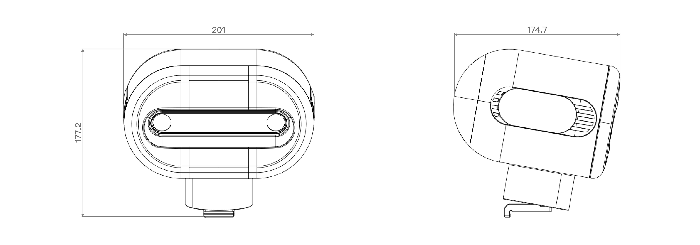
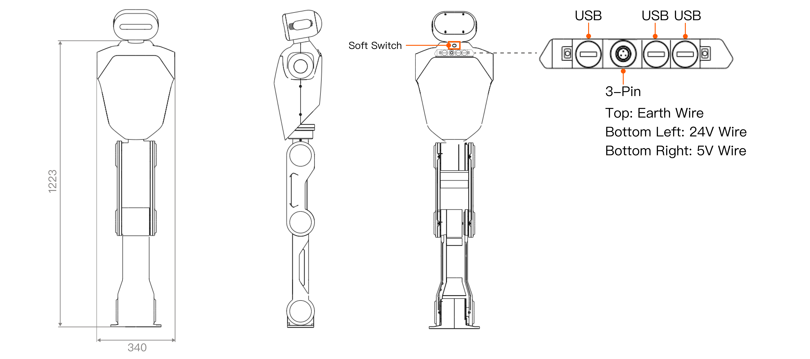
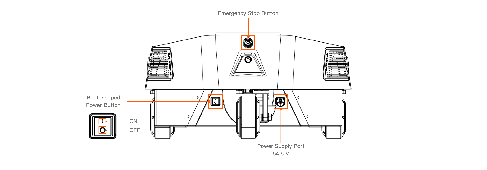
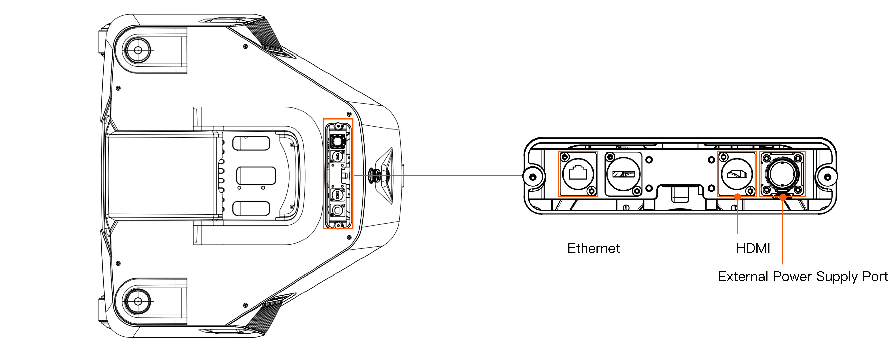
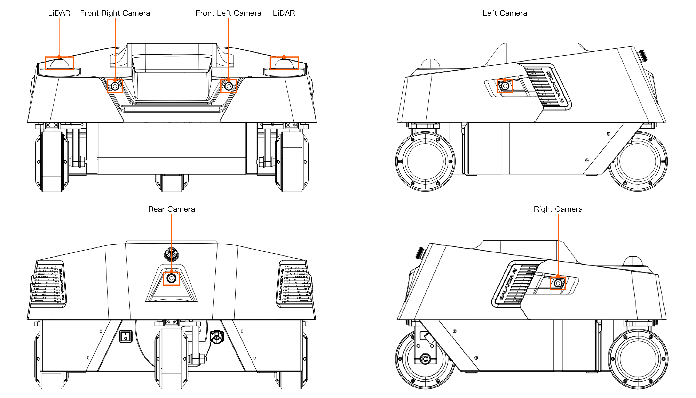

# Galaxea R1 Hardware Guide

## Disclaimer

<u>Galaxea R1 is intended for research applications by users experienced in operating and programming research robots. This product is not designed for general consumer use in the home and does not have the necessary certifications for such purposes.</u> 

## Technical Specifications

<table style="width: 100%; border-collapse: collapse;">
    <thead>
        <tr style="background-color: black; color: white; text-align: left;">
            <th style="width: 300px; padding: 8px; border: 1px solid #ddd;">Mechanical</th>
            <th style="width: 400px; padding: 8px; border: 1px solid #ddd;">Values</th>
        </tr>
    </thead>
    <tbody>
        <tr style="background-color: white; text-align: left;">
            <td style="padding: 8px; border: 1px solid #ddd;">Height</td>
            <td style="padding: 8px; border: 1px solid #ddd;">1700 mm when standing</td>
        </tr>
        <tr style="background-color: white; text-align: left;">
            <td style="padding: 8px; border: 1px solid #ddd;">Depth</td>
            <td style="padding: 8px; border: 1px solid #ddd;">215 mm for chest 625 mm for chassis</td>
        </tr>
        <tr style="background-color: white; text-align: left;">
            <td style="padding: 8px; border: 1px solid #ddd;">Width</td>
            <td style="padding: 8px; border: 1px solid #ddd;">675 mm</td>
        </tr>
        <tr style="background-color: white; text-align: left;">
            <td style="padding: 8px; border: 1px solid #ddd;">Weight</td>
            <td style="padding: 8px; border: 1px solid #ddd;">96 kg with battery</td>
        </tr>
        <tr style="background-color: white; text-align: left;">
            <td style="padding: 8px; border: 1px solid #ddd;">Nominal Voltage</td>
            <td style="padding: 8px; border: 1px solid #ddd;">54.6 V</td>
        </tr>
        <tr style="background-color: white; text-align: left;">
            <td style="padding: 8px; border: 1px solid #ddd;">Rated Capacity</td>
            <td style="padding: 8px; border: 1px solid #ddd;">35 Ah</td>
        </tr>
        <tr style="background-color: white; text-align: left;">
            <td style="padding: 8px; border: 1px solid #ddd;">Power Supply</td>
            <td style="padding: 8px; border: 1px solid #ddd;">Lithium-ion Battery</td>
        </tr>
        <tr style="background-color: white; text-align: left;">
            <td style="padding: 8px; border: 1px solid #ddd;">Battery Energy</td>
            <td style="padding: 8px; border: 1px solid #ddd;">1680 Wh</td>
        </tr>
        <tr style="background-color: white; text-align: left;">
            <td style="padding: 8px; border: 1px solid #ddd;">Battery Management System (BMS)</td>
            <td style="padding: 8px; border: 1px solid #ddd;">Supported</td>
        </tr>        
        <tr style="background-color: white; text-align: left;">
            <td style="padding: 8px; border: 1px solid #ddd;">Cooling System</td>
            <td style="padding: 8px; border: 1px solid #ddd;">Low-noise Local Air Cooling</td>
        </tr>
        <tr style="background-color: white; text-align: left;">
            <td style="padding: 8px; border: 1px solid #ddd;">Quantity of Air Duct</td>
            <td style="padding: 8px; border: 1px solid #ddd;">2</td>
        </tr>        
    </tbody>
</table>
<table style="width: 100%; border-collapse: collapse;">
    <thead>
        <tr style="background-color: black; color: white; text-align: left;">
            <th style="width: 300px; padding: 8px; border: 1px solid #ddd;">Performance</th>
            <th style="width: 400px; padding: 8px; border: 1px solid #ddd;">Values</th>
        </tr>
    </thead>
    <tbody>
        <tr style="background-color: white; text-align: left;">
            <td style="padding: 8px; border: 1px solid #ddd;">Degree of Freedom</td>
            <td style="padding: 8px; border: 1px solid #ddd;">24 DOF in total 6 DOF for chassis 4 DOF for torso 7 DOF for single arm with gripper</td>
        </tr>
        <tr style="background-color: white; text-align: left;">
            <td style="padding: 8px; border: 1px solid #ddd;">Arm Payload</td>
            <td style="padding: 8px; border: 1px solid #ddd;">Rated: 2 kg@0.5 m Max.: 5 kg@0.5m</td>
        </tr>
        <tr style="background-color: white; text-align: left;">
            <td style="padding: 8px; border: 1px solid #ddd;">Operating Range</td>
            <td style="padding: 8px; border: 1px solid #ddd;">Vertical: 0 ~ 2000 mm   Horizontal: 700 mm (86 mm with gripper)</td>
        </tr>
        <tr style="background-color: white; text-align: left;">
            <td style="padding: 8px; border: 1px solid #ddd;">Function</td>
            <td style="padding: 8px; border: 1px solid #ddd;">Torso: Lift/Tilt/Swivel Chassis: Ackerman/Translation/Spinning</td>
        </tr>
    </tbody>
</table>

<table style="width: 100%; border-collapse: collapse;">
    <thead>
        <tr style="background-color: black; color: white; text-align: left;">
            <th style="width: 300px; padding: 8px; border: 1px solid #ddd;">Control</th>
            <th style="width: 400px; padding: 8px; border: 1px solid #ddd;">Values</th>
        </tr>
    </thead>
    <tbody>
        <tr style="background-color: white; text-align: left;">
            <td style="padding: 8px; border: 1px solid #ddd;">Joystick Controller</td>
            <td style="padding: 8px; border: 1px solid #ddd;">Radio Frequency: 2.4 G Max. Remote Range: 1.5 km</td>
        </tr>
        <tr style="background-color: white; text-align: left;">
            <td style="padding: 8px; border: 1px solid #ddd;">Communication Interface</td>
            <td style="padding: 8px; border: 1px solid #ddd;">CAN</td>
        </tr>
    </tbody>
</table>

## Robot Structure

### Head

The head is equipped with a binocular stereo camera.

### Arm

Galaxea R1 features two [Galaxea A1](../../Introducing_Galaxea_Robot/product_info/A1.md) robot arms and two [Galaxea G1](../../Introducing_Galaxea_Robot/product_info/A1_accessory_G1.md) grippers. Each arm consists of two main links which are lightweight, rigid and durable. Arm joints are equipped with planetary gear motors, enabling independent variable-speed operation with high precision and torque. 

**Important: In the current version of Galaxea A1, motors do not have brakes, so cutting off power may cause the robot arms to drop suddenly. We will continue to improve the product to address this issue.**

<table style="width: 100%; border-collapse: collapse;">
    <thead>
        <tr style="background-color: black; color: white; text-align: left;">
            <th style="width: 300px; padding: 8px; border: 1px solid #ddd;">Item</th>
            <th style="width: 400px; padding: 8px; border: 1px solid #ddd;">Notes</th>
        </tr>
    </thead>
    <tbody>
        <tr style="background-color: white; text-align: left;">
            <td style="padding: 8px; border: 1px solid #ddd;">Dimensions</td>
            <td style="padding: 8px; border: 1px solid #ddd;">Deployed: 863L x 128W mm Folded: 550L x 128W mm</td>
        </tr>
        <tr style="background-color: white; text-align: left;">
            <td style="padding: 8px; border: 1px solid #ddd;">Degree of Freedom</td>
            <td style="padding: 8px; border: 1px solid #ddd;">6 DOF for single arm with one gripper</td>
        </tr>
        <tr style="background-color: white; text-align: left;">
            <td style="padding: 8px; border: 1px solid #ddd;">Maximum Payload</td>
            <td style="padding: 8px; border: 1px solid #ddd;">5 kg for single arm</td>
        </tr>
        <tr style="background-color: white; text-align: left;">
            <td style="padding: 8px; border: 1px solid #ddd;">Weight</td>
            <td style="padding: 8px; border: 1px solid #ddd;">6.2 KG</td>
        </tr>        
        <tr style="background-color: white; text-align: left;">
            <td style="padding: 8px; border: 1px solid #ddd;">Gripper Rated Force</td>
            <td style="padding: 8px; border: 1px solid #ddd;">100 N</td>
        </tr>
        <tr style="background-color: white; text-align: left;">
            <td style="padding: 8px; border: 1px solid #ddd;">Gripper Stroke</td>
            <td style="padding: 8px; border: 1px solid #ddd;">0 ~ 100 mm</td>
        </tr>
    </tbody>
</table>

See [Galaxea A1 User Guide](../A1/Getting_Started.md) if you want to explore more.

### Torso

<table style="width: 100%; border-collapse: collapse;">
    <thead>
        <tr style="background-color: black; color: white; text-align: left;">
            <th style="width: 300px; padding: 8px; border: 1px solid #ddd;">Item</th>
            <th style="width: 400px; padding: 8px; border: 1px solid #ddd;">Notes</th>
        </tr>
    </thead>
    <tbody>
        <tr style="background-color: white; text-align: left;">       
            <td style="padding: 8px; border: 1px solid #ddd;">Dimension</td>
            <td style="padding: 8px; border: 1px solid #ddd;">1400H x 340W x mm </td>
        </tr>        
        <tr style="background-color: white; text-align: left;">       
            <td style="padding: 8px; border: 1px solid #ddd;">Function</td>
            <td style="padding: 8px; border: 1px solid #ddd;">Lift/Tilt/Swivel</td>
        </tr>        
         </tr>
        <tr style="background-color: white; text-align: left;">
            <td style="padding: 8px; border: 1px solid #ddd;">Waist Movement Space (Yaw)</td>
            <td style="padding: 8px; border: 1px solid #ddd;">± 170°</td>
        </tr>   
        <tr style="background-color: white; text-align: left;">
            <td style="padding: 8px; border: 1px solid #ddd;">Hip Movement Space (Pitch)</td>
            <td style="padding: 8px; border: 1px solid #ddd;">± 100°</td>
        </tr> 
        <tr style="background-color: white; text-align: left;">
            <td style="padding: 8px; border: 1px solid #ddd;">Knee Movement Space</td>
            <td style="padding: 8px; border: 1px solid #ddd;">W1: 0° ~ 100° W2: -154° ~ 145°</td>
        </tr> 
        <tr style="background-color: white; text-align: left;">
            <td style="padding: 8px; border: 1px solid #ddd;">Torso Motor Torque</td>
            <td style="padding: 8px; border: 1px solid #ddd;">Rated: 108 NM Max.: 304 NM</td>
        </tr>  
        <tr style="background-color: white; text-align: left;">
            <td style="padding: 8px; border: 1px solid #ddd;">USB</td>
            <td style="padding: 8px; border: 1px solid #ddd;">Used to connect the mouse and keyboard.</td>
        </tr>  
        <tr style="background-color: white; text-align: left;">
            <td style="padding: 8px; border: 1px solid #ddd;">3-Pin Aviation Plug</td>
            <td style="padding: 8px; border: 1px solid #ddd;">Used to power external devices. One thick red wire of 24V, one thin red wire of 5V, and one black earth wire.</td>
        </tr>  
    </tbody>
</table>

### Base 

<table style="width: 100%; border-collapse: collapse;">
    <thead>
        <tr style="background-color: black; color: white; text-align: left;">
            <th style="width: 300px; padding: 8px; border: 1px solid #ddd;">Item</th>
            <th style="width: 400px; padding: 8px; border: 1px solid #ddd;">Notes</th>
        </tr>
    </thead>
    <tbody>
        <tr style="background-color: white; text-align: left;">
            <td style="padding: 8px; border: 1px solid #ddd;">Dimensions</td>
            <td style="padding: 8px; border: 1px solid #ddd;">675L x 636W x 346H mm</td>
        </tr>
        <tr style="background-color: white; text-align: left;">
            <td style="padding: 8px; border: 1px solid #ddd;">Power Button</td>
            <td style="padding: 8px; border: 1px solid #ddd;">Used to turn on/off the robot</td>
        </tr>
        <tr style="background-color: white; text-align: left;">
            <td style="padding: 8px; border: 1px solid #ddd;">Power Supply Port</td>
            <td style="padding: 8px; border: 1px solid #ddd;">Rated voltage 54.6 V</td>
        </tr>        
        <tr style="background-color: white; text-align: left;">
            <td style="padding: 8px; border: 1px solid #ddd;">Emergency Stop Button</td>
            <td style="padding: 8px; border: 1px solid #ddd;">Used for immediate power interruption during emergencies</td>
        </tr>
        <tr style="background-color: white; text-align: left;">
            <td style="padding: 8px; border: 1px solid #ddd;">Air Duct</td>
            <td style="padding: 8px; border: 1px solid #ddd;">Used to dissipate the heat generated inside the machine and prevent performance degradation or instability caused by overheating.</td>
        </tr>        
        <tr style="background-color: white; text-align: left;">
            <td style="padding: 8px; border: 1px solid #ddd;">Battery Indicator</td>
            <td style="padding: 8px; border: 1px solid #ddd;">Tri-color breathing light shows the power usage status.  🟩 Green: above 70% 🟨 Yellow: 30% ~ 70%  🟥 Red: below 30% Flashing Green: charging</td>
        </tr>
    </tbody>
</table>

The peripheral interfaces are located on the top of the rear of the chassis. 

<table style="width: 100%; border-collapse: collapse;">
    <thead>
        <tr style="background-color: black; color: white; text-align: left;">
            <th style="width: 300px; padding: 8px; border: 1px solid #ddd;">Peripheral Interface</th>
            <th style="width: 400px; padding: 8px; border: 1px solid #ddd;">Notes</th>
        </tr>
    </thead>
    <tbody>
        <tr style="background-color: white; text-align: left;">
            <td style="padding: 8px; border: 1px solid #ddd;">Ethernet</td>
            <td style="padding: 8px; border: 1px solid #ddd;">Used to connect the ethernet.</td>
        </tr>
        <tr style="background-color: white; text-align: left;">
            <td style="padding: 8px; border: 1px solid #ddd;">HDMI</td>
            <td style="padding: 8px; border: 1px solid #ddd;">Used to connect display screen.</td>
        </tr>
        <tr style="background-color: white; text-align: left;">
            <td style="padding: 8px; border: 1px solid #ddd;">3-pin Aviation Plug</td>
            <td style="padding: 8px; border: 1px solid #ddd;">Used to power external devices. One thick red wire of 24V, one thin red wire of 5V, and one black earth wire.</td>
        </tr>
    </tbody>
</table>

### Sensors

Galaxea R1 is equipped with a multitude of sensors, among which are eight HD cameras and two LiDARs that enable it to sense the surroundings in all directions and not only perceive but also operate with precision.

<table style="width: 100%; border-collapse: collapse;">
    <thead>
        <tr style="background-color: black; color: white; text-align: left;">
            <th style="width: 300px; padding: 8px; border: 1px solid #ddd;">Sensor</th>
            <th style="width: 400px; padding: 8px; border: 1px solid #ddd;">Values</th>
        </tr>
    </thead>
    <tbody>
        <tr style="background-color: white; text-align: left;">
            <td style="padding: 8px; border: 1px solid #ddd;">Camera</td>
            <td style="padding: 8px; border: 1px solid #ddd;">Head: 1 x Binocular Depth Camera Wrist: 2 x Monocular Depth Camera Chassis: 5 x Monocular Camera</td>
        </tr>
        <tr style="background-color: white; text-align: left;">
            <td style="padding: 8px; border: 1px solid #ddd;">LiDar</td>
            <td style="padding: 8px; border: 1px solid #ddd;">1 x 360° (Two LiDARs are optional) </td>
        </tr>
    </tbody>
</table>

#### Camera

<table style="width: 100%; border-collapse: collapse;">
    <thead>
        <tr style="background-color: black; color: white; text-align: left;">
            <th style="width: 300px; padding: 8px; border: 1px solid #ddd;">Specification</th>
            <th style="width: 400px; padding: 8px; border: 1px solid #ddd;">Head</th>
            <th style="width: 400px; padding: 8px; border: 1px solid #ddd;">Wrist</th>          
            <th style="width: 400px; padding: 8px; border: 1px solid #ddd;">Chassis</th>              
        </tr>
    </thead>
    <tbody>
        <tr style="background-color: white; text-align: left;">
            <td style="padding: 8px; border: 1px solid #ddd;">Type</td>
            <td style="padding: 8px; border: 1px solid #ddd;">Binocular Depth Camera</td>
            <td style="padding: 8px; border: 1px solid #ddd;">Monocular Depth Camera</td>
            <td style="padding: 8px; border: 1px solid #ddd;">Monocular Camera</td>            
        </tr>
        <tr style="background-color: white; text-align: left;">
            <td style="padding: 8px; border: 1px solid #ddd;">Quantity</td>
            <td style="padding: 8px; border: 1px solid #ddd;">1</td>
            <td style="padding: 8px; border: 1px solid #ddd;">2</td>
            <td style="padding: 8px; border: 1px solid #ddd;">5</td>            
        </tr>
        <tr style="background-color: white; text-align: left;">
            <td style="padding: 8px; border: 1px solid #ddd;">Output Resolution</td>
            <td style="padding: 8px; border: 1px solid #ddd;">1920 x 1080 @30fps</td>
            <td style="padding: 8px; border: 1px solid #ddd;">1280 x 720 @30FPS (RGB 1920 x 1080)</td>
            <td style="padding: 8px; border: 1px solid #ddd;">1920 x 1080 @30fps</td>            
        </tr>        
        <tr style="background-color: white; text-align: left;">
            <td style="padding: 8px; border: 1px solid #ddd;">Field of View</td>
            <td style="padding: 8px; border: 1px solid #ddd;">110°H x 70°V x 120°D</td>
            <td style="padding: 8px; border: 1px solid #ddd;">87°H x 58°V x 95°D</td>
            <td style="padding: 8px; border: 1px solid #ddd;">118°H x 62°V</td>           
        </tr>
        <tr style="background-color: white; text-align: left;">
            <td style="padding: 8px; border: 1px solid #ddd;">Depth Range</td>
            <td style="padding: 8px; border: 1px solid #ddd;">0.3 m ~ 20 m</td>
            <td style="padding: 8px; border: 1px solid #ddd;">0.2 m ~ 3 m</td>      
            <td style="padding: 8px; border: 1px solid #ddd;">\</td>                      
        </tr>
        <tr style="background-color: white; text-align: left;">
            <td style="padding: 8px; border: 1px solid #ddd;">Operating Temp. Range</td>
            <td style="padding: 8px; border: 1px solid #ddd;">-10 °C ~ +45°C</td>
            <td style="padding: 8px; border: 1px solid #ddd;">0 ~ +85°C </td>
            <td style="padding: 8px; border: 1px solid #ddd;">-40 ~ +85°C </td>            
        </tr>    
        <tr style="background-color: white; text-align: left;">
            <td style="padding: 8px; border: 1px solid #ddd;">Dimensions</td>
            <td style="padding: 8px; border: 1px solid #ddd;">175L x 30W x 32H mm</td>
            <td style="padding: 8px; border: 1px solid #ddd;">90L x 25W x 25H mm</td> 
            <td style="padding: 8px; border: 1px solid #ddd;">30L x 30W x 23H mm</td>            
        </tr>
        <tr style="background-color: white; text-align: left;">
            <td style="padding: 8px; border: 1px solid #ddd;">Weight</td>
            <td style="padding: 8px; border: 1px solid #ddd;">164 g</td>
            <td style="padding: 8px; border: 1px solid #ddd;">75 g</td>
            <td style="padding: 8px; border: 1px solid #ddd;">＜50 g</td>            
        </tr>
        <tr style="background-color: white; text-align: left;">
            <td style="padding: 8px; border: 1px solid #ddd;">Brand & Type</td>
            <td style="padding: 8px; border: 1px solid #ddd;">Zed 2</td>
            <td style="padding: 8px; border: 1px solid #ddd;">RealSense D435i</td>
            <td style="padding: 8px; border: 1px solid #ddd;">SENSING H120H</td>            
        </tr>        
    </tbody>
</table>

#### LiDAR

The chassis is equipped with up to two 360-degree LiDARs*, which are of high precision and resistant to interference.

<table style="width: 100%; border-collapse: collapse;">
    <thead>
        <tr style="background-color: black; color: white; text-align: left;">
            <th style="width: 400px; padding: 8px; border: 1px solid #ddd;">Specification</th>
            <th style="width: 600px; padding: 8px; border: 1px solid #ddd;">Values</th>
        </tr>
    </thead>
    <tbody>
        <tr style="background-color: white; text-align: left;">
            <td style="padding: 8px; border: 1px solid #ddd;">Quantity</td>
            <td style="padding: 8px; border: 1px solid #ddd;">1 ~ 2</td>
        </tr>        
        <tr style="background-color: white; text-align: left;">
            <td style="padding: 8px; border: 1px solid #ddd;">FOV</td>
            <td style="padding: 8px; border: 1px solid #ddd;">360°H x 59°V</td>
        </tr>
        <tr style="background-color: white; text-align: left;">
            <td style="padding: 8px; border: 1px solid #ddd;">Laser Wavelength</td>
            <td style="padding: 8px; border: 1px solid #ddd;">905 nm</td>
        </tr>
        <tr style="background-color: white; text-align: left;">
            <td style="padding: 8px; border: 1px solid #ddd;">Close Proximity Blind Zone</td>
            <td style="padding: 8px; border: 1px solid #ddd;">0.1 m</td>
         <tr style="background-color: white; text-align: left;">
            <td style="padding: 8px; border: 1px solid #ddd;">Data Port</td>
            <td style="padding: 8px; border: 1px solid #ddd;">100 BASE-TX Ethernet</td>
        </tr>               
        <tr style="background-color: white; text-align: left;">
            <td style="padding: 8px; border: 1px solid #ddd;">IMU</td>
            <td style="padding: 8px; border: 1px solid #ddd;">Built-in IMU Model</td>
        </tr>               
        </tr>
        <tr style="background-color: white; text-align: left;">
            <td style="padding: 8px; border: 1px solid #ddd;">Operating Temp. Range</td>
            <td style="padding: 8px; border: 1px solid #ddd;">-20 ~ +55℃</td>
        </tr>
        <tr style="background-color: white; text-align: left;">
            <td style="padding: 8px; border: 1px solid #ddd;">Dimensions</td>
            <td style="padding: 8px; border: 1px solid #ddd;">65L x 65W x 60H mm</td>
        </tr>
        <tr style="background-color: white; text-align: left;">
            <td style="padding: 8px; border: 1px solid #ddd;">Weight</td>
            <td style="padding: 8px; border: 1px solid #ddd;">265 g</td>
        </tr>
        <tr style="background-color: white; text-align: left;">
            <td style="padding: 8px; border: 1px solid #ddd;">Brand & Type</td>
            <td style="padding: 8px; border: 1px solid #ddd;">LIVOX MID-360</td>
        </tr>        
    </tbody>
</table>

<u>Note: One LiDAR is standard, the number of LiDAR configurations can be selected according to user needs.</u>

### Computing Unit

<table style="width: 100%; border-collapse: collapse;">
    <thead>
        <tr style="background-color: black; color: white; text-align: left;">
            <th style="width: 300px; padding: 8px; border: 1px solid #ddd;">Units</th>
            <th style="width: 400px; padding: 8px; border: 1px solid #ddd;">Single SOC</th>
            <th style="width: 400px; padding: 8px; border: 1px solid #ddd;">Dual SOC</th>
        </tr>
    </thead>
    <tbody>
        <tr style="background-color: white; text-align: left;">
            <td style="padding: 8px; border: 1px solid #ddd;">Basic Computating Capability</td>
            <td style="padding: 8px; border: 1px solid #ddd;">8 Core 2.2GHz CPU</td>
            <td style="padding: 8px; border: 1px solid #ddd;">2 * 8 Core 2.2GHz CPU</td>
        </tr>
        <tr style="background-color: white; text-align: left;">
            <td style="padding: 8px; border: 1px solid #ddd;">Deep Learning Computing Capability</td>
            <td style="padding: 8px; border: 1px solid #ddd;">200 TOPS</td>
            <td style="padding: 8px; border: 1px solid #ddd;">550 TOPS</td>
        </tr>
        <tr style="background-color: white; text-align: left;">
            <td style="padding: 8px; border: 1px solid #ddd;">Memory</td>
            <td style="padding: 8px; border: 1px solid #ddd;">1 x LPDDR5@32G </td>
            <td style="padding: 8px; border: 1px solid #ddd;">2 x LPDDR5@32G </td>
        </tr>
        <tr style="background-color: white; text-align: left;">
            <td style="padding: 8px; border: 1px solid #ddd;">Hard Disk</td>
            <td style="padding: 8px; border: 1px solid #ddd;">1 x SSD@1T</td>
            <td style="padding: 8px; border: 1px solid #ddd;">2 x SSD@512G</td>
        </tr>
        <tr style="background-color: white; text-align: left;">
            <td style="padding: 8px; border: 1px solid #ddd;">Camera</td>
            <td style="padding: 8px; border: 1px solid #ddd;">8 x GMSL</td>
            <td style="padding: 8px; border: 1px solid #ddd;">8 x GMSL (SoC-1) + 8 x GMSL (SoC-2) </td>
        </tr>
        <tr style="background-color: white; text-align: left;">
            <td style="padding: 8px; border: 1px solid #ddd;">Ethernet</td>
            <td style="padding: 8px; border: 1px solid #ddd;">4 x Gigabit Ethernet (M12 cable)</td>
            <td style="padding: 8px; border: 1px solid #ddd;">3 x SoC-1 Gigabit Ethernet (M12 cable) + 3 x SoC-2 Gigabit Ethernet (M12 cable)</td>
        </tr>
        <tr style="background-color: white; text-align: left;">
            <td style="padding: 8px; border: 1px solid #ddd;">WiFi Module</td>
            <td style="padding: 8px; border: 1px solid #ddd;">M.2 Wifi with AP mode</td>
            <td style="padding: 8px; border: 1px solid #ddd;">M.2 Wifi with AP mode</td>
        </tr>
    </tbody>
</table>

<u>For different configurations, please contact us.</u>

## Next Step

This concludes the hardware guide for Galaxea R1. For further details, please refer to [Galaxea R1 Software Guide](Software_Guide_firstmove.md).
