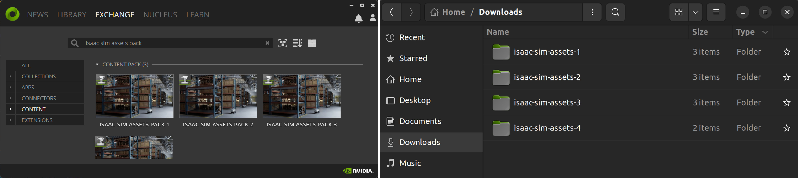
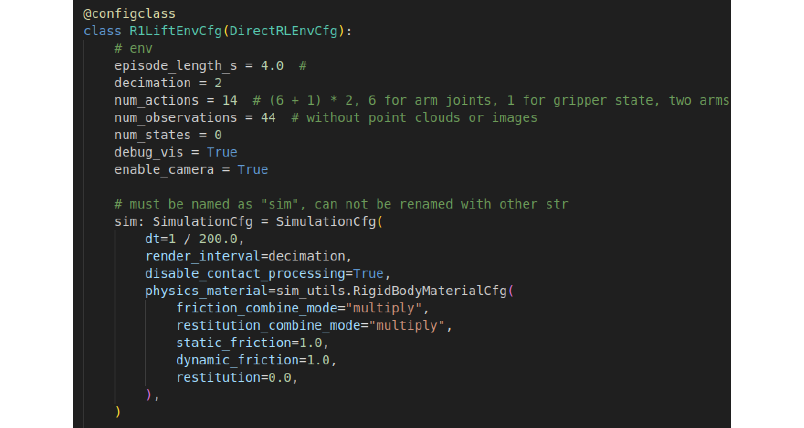

# R1 Isaac Lab User Guide

## Get Started

Galaxea Lab is a repository that originates from [Isaac Lab](https://isaac-sim.github.io/IsaacLab/main/index.html). Based on the settings of Isaac Lab, we have developed our own standalone version where you can configure your own operational environment. Along with Galaxea Lab, our Real-to-Sim asset is also provided, which mainly consists of a 3D-reconstructed kitchen scene and a table-fruit-basket pick-up scene. By going through this user guide, you will get access to the following knowledge:

- How to install our Galaxea Lab environment.
- How to run our pick-fruit example.
- How to access the Galaxea Lab interface and set up your own tasks.
- Different 3D reconstructed assets (continuous updating...)

Can't wait to see the Galaxea robot？Let's start now!


## Installation

To install our Galaxea Lab, follow these steps. Firsly, install the latest Isaac Sim. You can do this either through the [official Ominivese launcher](../A1/Simulation_Isaac_Sim_Usage_Tutorial.md) or use the [pip test version](https://isaac-sim.github.io/IsaacLab/main/source/setup/installation/binaries_installation.html#installing-isaac-sim) (though it hasn't been tested in our case). We recommend the former option. Ensure that the latest version of Isaac Sim is installed. 

Once Isaac Sim is successfully installed, proceed to install our Galaxea Lab. Start by cloning the repository.

```Bash
git clone https://github.com/userguide-galaxea/Galaxea_Lab.git
```


From now on, you can refer to the tutorial of [Isaac Lab binary installation guide](https://isaac-sim.github.io/IsaacLab/main/source/setup/installation/binaries_installation.html#installing-isaac-lab). Note that you do not need to git clone the original Isaac Lab repo again as we are derived from that repo.

One important aspect to note is that all default 3D assets are defined in the variable **`NUCLEUS_ASSET_ROOT_DIR`** in the following script: <u>*source/extensions/omni.isaac.lab/omni/isaac/lab/utils/assets.py.*</u> 

By default, these assets are stored on the AWS cloud, and loading them might be very slow, sometimes even infeasible. 


In the given repository, we have already made a minimal folder containing related assets under this path: *<u>isaac-sim-assets-1-4.0.0/Assets/Isaac/4.0/Isaac</u>.* If you need further development, you can download all the 3D models by following the instructions :https://docs.omniverse.nvidia.com/IsaacSim/latest/installation/install_faq.html#assets-pack

**Latest Note: The link above might not be able to open due to Nvidia maintenance. Nevertheless, you can still run our tutorial scripts since we have already copied all the necessary assets to the path *<u>isaac-sim-assets-1-4.0.0/Assets/Isaac/4.0/Isaac</u>* above.**



After downloading the assets, set the **`NUCLEUS_ASSET_ROOT_DIR`** to your local path.

You can run the following command to verify the installation.

```Bash
./isaaclab.sh -p source/standalone/galaxea/basic/spawn_robot.py
```

If everything goes fine, you should be able to see your Galaxea R1 robot.


## Examples

We have provided several basic examples under the directory *<u>source/standalone/galaxea/basic</u>.* Here are some simple commands:

```Bash
# spawn the R1 robot and set random joint positions
./isaaclab.sh -p source/standalone/galaxea/basic/spawn_robot.py

# create a scene consisting of object, table, robot and so on
./isaaclab.sh -p source/standalone/galaxea/basic/creat_scene.py

#start to collected pick and place fruit data via Galaxea R1-DVT robot
./isaaclab.sh -p source/standalone/galaxea/rule_based_policy/collect_demos.py
```

By running the last line of code, you will see the demo as shown below. R1 will start to collect the fruit inside the basket. Trajectory data will be saved in the hdf5 format.

<div style="display: flex; justify-content: center; align-items: center;">
<video width="1920" height="1080" controls>
  <source src="../assets/R1_isaaclab_pickcarrot.mp4" type="video/mp4">
  Your browser does not support the video tag.
</video>
</div>
## Real-to-Sim Asset 

Here we provide our reconstructed asset under the following path. All the R1 robot USD asset and the fruits model are listed there. 

<u>*source/extensions/omni.isaac.lab_assets/data*</u>


### R1 URDF
To download the R1 URDF file, please go to [R1_URDF](https://github.com/userguide-galaxea/URDF/tree/galaxea/main/R1) on our GitHub website.

## The Task Env Interface

Here, we use the OpenAI Gym as our basic environment. For customizing your own task, you need to pay attention to the following key interfaces. We also provide minimal executable code snippets for you to understand the logic.

### Initiallization

```Bash
from omni.isaac.lab_tasks.utils.parse_cfg import parse_env_cfg 

env_cfg = parse_env_cfg(
    task_name = "Isaac-R1-Multi-Fruit-IK-Abs-Direct-v0",
    use_gpu = True,
    num_envs = 1,
    use_fabric = True,
)
```

- **task_name**: Defines the specific env interface and can be viewed via this path: <u>*source/extensions/omni.isaac.lab_tasks/omni/isaac/lab_tasks/galaxea/direct/lift/\_\_init\_\_.py*</u>

- **use_gpu**: Indicates whether to use the GPU for the simulation.
- **num_envs**: Defines the number of parallel environments. When the value is greater than 1, it will start to collect the data parallelly.
- **use_fabric**: Defines whether to use the current USD for I/O. The default value is True.

### Take the Action

```python
obs, reward, terminated, truncated, info = env.step(actions)
```

- **obs**: Represents the observation data in the observation space, which is defined in the _get_observations() function shown as below:

    ```Bash
    obs = {
        "joint_pos": 
        "joint_vel": 
        "left_ee_pose":
        "right_ee_pose": 
        "object_pose": 
        "goal_pose": 
        "last_joints":
        "front_rgb": 
        "front_depth": 
        "left_rgb": 
        "left_depth": 
        "right_rgb": 
        "right_depth"：
    }
    ```

- **actions**: A 16 dimensional torch tensor.
  	1. dim0 - dim6: Represent the pose of the left arm end-effector, specifically position_x, position_y, position_z , quaternion_z,  quaternion_w,  quaternion_x,  and quaternion_y.
  	2. dim7: Represents the state of the left arm gripper, with a value of 0 and 1.
 	3. dim8 - dim14: Represent the pose of the right arm end effector, specifically position_x, position_y, position_z, quaternion_z,  quaternion_w,  quaternion_x,  and quaternion_y.
  	4. dim15: Represents the state of the right arm gripper, with a value of 0 and 1.
  
    ```Bash
    actions = torch.tensor([left_ee_pose, left_gripper_state, right_ee_pose, right_gripper_state])##7+1+7+1=16 dim
    ```
  
- **terminated**: Represents whether a task is finished or not. It is a boolean value. The definition cretiera is the carrot falling into the basket. This is defined in the `_get_dones()` function below.

    ```Bash
    def _get_dones(self) -> tuple[torch.Tensor, torch.Tensor]:
         reached = self._object_reached_goal()
         time_out = self.episode_length_buf >= self.max_episode_length - 1
         return reached, time_out
    ```

- **truncated:** Represents whether the task ends exceeding the time threshold. The current value is 4 seconds, (400 steps with dt = 0.01s) 
- **info**: Saves any extra information that users want to save. Currently, it is set as an empty dictionary.

### Minimal Executable Code Unit

Here, we provide a minimal unit of executable code that contains all the information introduced above. The code is located at *<u>source/standalone/galaxea/basic/simple_env.py</u>*

```Bash
"""Script to run an environment with zero action agent."""

"""Launch Isaac Sim Simulator first."""

import argparse

from omni.isaac.lab.app import AppLauncher

# add argparse arguments
parser = argparse.ArgumentParser(description="Zero agent for Isaac Lab environments.")
AppLauncher.add_app_launcher_args(parser)
args_cli = parser.parse_args()

# launch omniverse app
app_launcher = AppLauncher(args_cli)

simulation_app = app_launcher.app

"""Rest everything follows."""

import gymnasium as gym
import torch

import omni.isaac.lab_tasks  # noqa: F401
from omni.isaac.lab_tasks.utils import parse_env_cfg

def main():
    """Zero actions agent with Isaac Lab environment."""
    env_cfg = parse_env_cfg(
        "Isaac-R1-Lift-Bin-IK-Rel-Direct-v0",
        use_gpu= True,
        num_envs= 1,
        use_fabric= True,
    )
    # create environment
    env = gym.make("Isaac-R1-Lift-Bin-IK-Rel-Direct-v0", cfg=env_cfg)

    # print info (this is vectorized environment)
    print(f"[INFO]: Gym observation space: {env.observation_space}")
    print(f"[INFO]: Gym action space: {env.action_space}")
    # reset environment
    env.reset()
    # simulate environment
    while simulation_app.is_running():
        # run everything in inference mode
        with torch.inference_mode():
            # compute zero actions
            actions = torch.zeros(env.action_space.shape, device=env.unwrapped.device)
            if True:
                # sample actions from -1 to 1
                actions = (
                    0.05 * torch.rand(env.action_space.shape, device=env.unwrapped.device)
                )
            # apply actions
            env.step(actions)

    # close the simulator
    env.close()

if __name__ == "__main__":
    # run the main function
    main()
    # close sim app
    simulation_app.close()
```

After running the following code, ideally, you will see the demo as shown below, where we send random joint commands to our R1 robot. 

```Bash
./isaaclab.sh -p source/standalone/galaxea/basic/simple_env.py
```

<div style="display: flex; justify-content: center; align-items: center;">
<video width="1920" height="1080" controls>
  <source src="../assets/R1_isaaclab_spawn_env_randomactionv2.mp4" type="video/mp4">
  Your browser does not support the video tag.
</video>
</div>


## Define Your Own Task

### Define A Robot

The robot is set as an **Articulation** class in our Galaxea Lab. You can refer to the following path to see how to modify related parameters, e.g. the kp, kd parameters.

<u>*source/extensions/omni.isaac.lab_assets/omni/isaac/lab_assets/galaxea_robots.py*</u> 


The task environment can be set by referring to the following script:

<u>*source/extensions/omni.isaac.lab_tasks/omni/isaac/lab_tasks/galaxea/direct/lift/lift_env_cfg.py*</u>




### Define Your Task

You can define new tasks and your new entry points via referring to the following scripts:

 <u>*source/extensions/omni.isaac.lab_tasks/omni/isaac/lab_tasks/galaxea/direct/lift/\_\_init\_\_.py*</u>

 <u>*source/extensions/omni.isaac.lab_tasks/omni/isaac/lab_tasks/galaxea/direct/lift/pick_fruit_env.py*</u>

```Bash
gym.register(
    id="Isaac-R1-Multi-Fruit-IK-Abs-Direct-v0",
    entry_point="omni.isaac.lab_tasks.galaxea.direct.lift:R1MultiFruitEnv",
    disable_env_checker=True,
    kwargs={
        "env_cfg_entry_point": R1MultiFruitAbsEnvCfg,
    },
)
```


### Define Observation, Action, Reward, etc. 

Under the path *<u>source/extensions/omni.isaac.lab_tasks/omni/isaac/lab_tasks/galaxea/direct/lift/pick_fruit_env.py</u>*, you can see how we define our environment's observation, action, rewards, etc. The following are the related code snippets.

- **obs:**

```Bash
def _get_observations(self) -> dict:
    obs = {
            # robot joint position: dim=(6+2)*2
            "joint_pos": joint_pos,
            "joint_vel": joint_vel,
            # robot ee pose: dim=7*2
            "left_ee_pose": left_ee_pose,
            "right_ee_pose": right_ee_pose,
            # object pose: dim=7
            "object_pose": object_pose,
            # goal pose: dim=7
            "goal_pose": torch.cat([self.goal_pos, self.goal_rot], dim=-1),
            "last_joints": joint_pos,
            #...
            }
return {"policy": obs}
```

- **action:**

```Bash
def _apply_action(self):
    # set left/right arm/gripper joint position targets
    self._robot.set_joint_position_target(
        self.left_arm_joint_pos_target, self.left_arm_joint_ids
    )
    self._robot.set_joint_position_target(
        self.left_gripper_joint_pos_target, self.left_gripper_joint_ids
    )
    self._robot.set_joint_position_target(
        self.right_arm_joint_pos_target, self.right_arm_joint_ids
    )
    self._robot.set_joint_position_target(
        self.right_gripper_joint_pos_target, self.right_gripper_joint_ids
    )
```

- **reward:**

```Bash
def _get_rewards(self) -> torch.Tensor:
    reward = self._compute_reward()
    return reward
```

- **terminated:**

```Bash
def _get_dones(self) -> tuple[torch.Tensor, torch.Tensor]:
    reached = self._object_reached_goal()
    time_out = self.episode_length_buf >= self.max_episode_length - 1
    return reached, time_out
def _object_reached_goal(self):
    object_curr_pos = self._object[self.object_id].data.root_pos_w[:, :3]
    basket_pos = self._object[3].data.root_pos_w[:, :3]
    reached = self._within_basket(object_curr_pos, basket_pos)
    return reached
```
