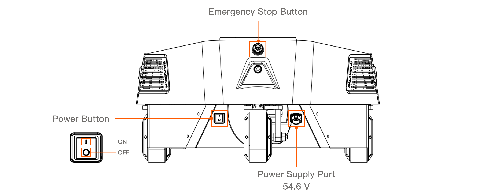
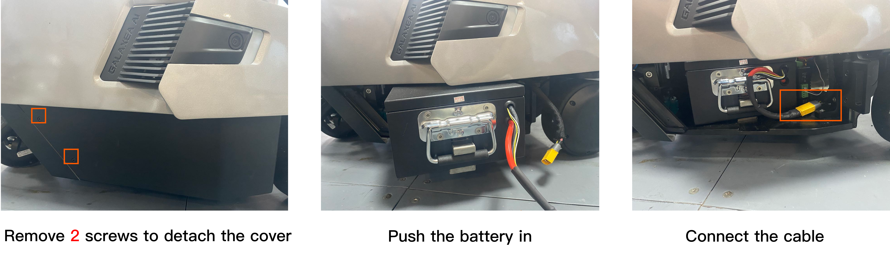
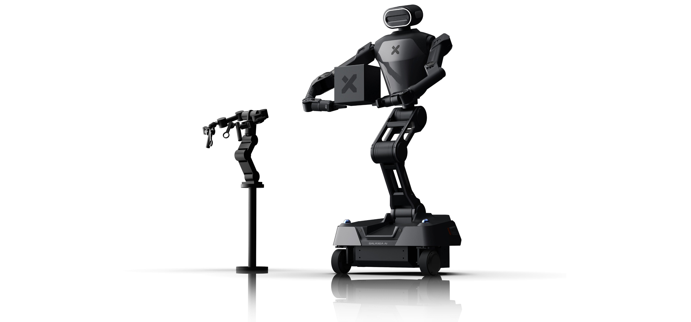
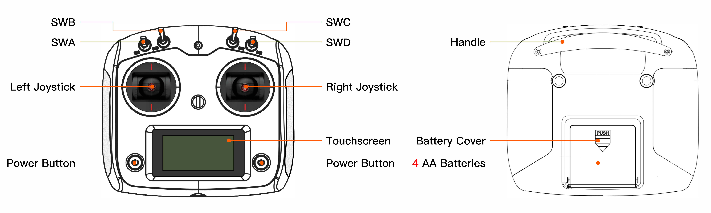
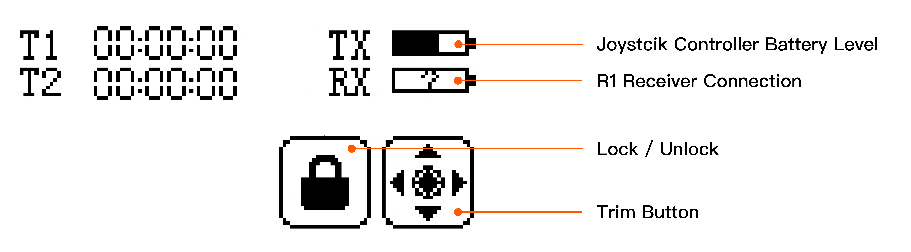
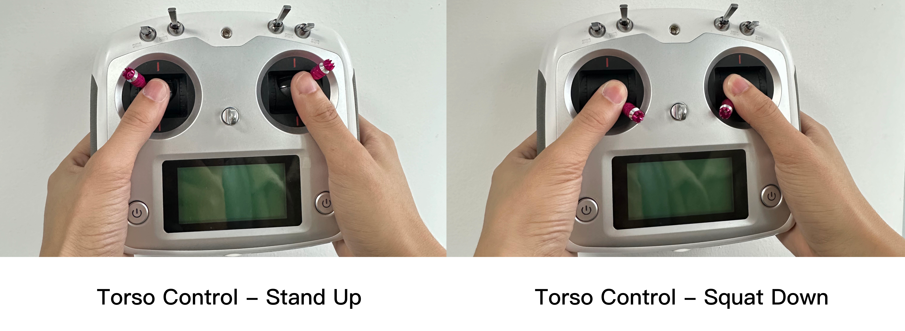

# Galaxea R1 Overview

In this tutorial, <u>you will learn how to power on and operate this new product,</u> beginning your journey of interacting with Galaxea R1.

## Before You Begin

### Safety

Galaxea R1 has the potential to cause harm if not properly used. We recommend that all users review the Safety Guide before operating the robot.

### Power On/Off

#### Hard Switch

One black and boat-shaped power button is located on the bottom of the rear of the chassis.
Press the button to power R1 on and off.

#### Soft Switch

One silver and circular power button is located on the back of the neck.

- Press down the button and release it. The blue light will turn on, indicating that R1 is powered on.
- Press down and hold the button for more than 3 seconds, then release it. The blue light will turn off, indicating that R1 is powered off.

### Battery Charge

The power supply port is located at the bottom of the rear of the chassis. To charge the robot, unscrew the plug case, and insert the power cord into the port. When the red light on the charger is on and the battery indicator on the chassis is flashing in green, it indicates that R1 is charging.

The battery is located at the bottom of the right side of the chassis. To change the battery, remove two screws and slide the cover right to detach it. Then, put the battery into the chassis, connect the battery cable to the chassis, and close the cover. To remove and change the battery, reverse the above steps.

### Emergency Stop

The emergency stop button is located at the bottom of the rear of the chassis. It can be used to immediately halt all operations in case of an emergency or if you encounter any dangerous situations.

<u>Note: Please keep the emergency stop button released when powered on.</u>

## **Teleoperation**

### R1-Teleoperation

**Coming Soon**

### Joystick Controller Teleoperation

#### Instruction

- To turn on/off the controller, please press and hold both power buttons until the touchscreen lights up/off.
  
- The TX box shows the controller's battery level.
- The RX box shows whether the remote control is successfully connected to the chassis. If the connection is successful, a half-filled bar will appear in the box. If it is unsuccessful, a question mark will appear in the box.
- SWA/SWD are short-stick switches that have two positions: Top/Bottom
- SWB/SWC are long-stick switches that have three positions: Top/Middle/Bottom

#### Robot Control

Note: Ensure that all switches (SWA/SWB/SWC/SWD) are in the top position before you do any actions. This will place the machine in a stop state, preventing the robot from operating. 

The following table shows how to switch SWA/SWB/SWC/SWD to different positions in different functions.

<u>Before you use the joystick controller to control the robot, you must start CAN driver and other programs. For detailed instructions, please refer to the **[3.4](R1_Step_by_Step_Guide.md/#34-start-can-driver), [3.5](R1_Step_by_Step_Guide.md/#35-the-first-self-check), [3.6](R1_Step_by_Step_Guide.md/#36-stand-up) and [3.7](R1_Step_by_Step_Guide.md/#37-install-arms)**  in Step-By-Step Startup Guide.</u> After that, you can move each switch to a specified position and control the robot by the following steps.

**Torso Control**

1. Move the left joystick to the upper left, and move the right joystick to the upper right simultaneously, as shown below. Waiting for 3 seconds, **R1 will stand up.**
2. Move the left joystick to the upper left, and move the right joystick to the upper right simultaneously, as shown below. Waiting for 3 seconds, **R1 will squat down.**

**Chassis Control**

<table style="width: 100%; border-collapse: collapse;">
    <thead>
        <tr style="background-color: black; color: white; text-align: left;">
            <th style="width: 100px; padding: 8px; border: 1px solid #ddd;">Item</th>
            <th style="width: 600px; padding: 8px; border: 1px solid #ddd;">Notes</th>
        </tr>
    </thead>
    <tbody>
        <tr style="background-color: white; text-align: left;">
            <td style="padding: 8px; border: 1px solid #ddd;">Left Joystick</td>
            <td style="padding: 8px; border: 1px solid #ddd;">Move up/down to control the forward/backward movement of the chassis in the X-direction.   Move left/right to control the rotational speed of the chassis in the Z-direction.  * The angle away from the center of the joystick is mapped to the moving spped.</td>
        </tr>
        <tr style="background-color: white; text-align: left;">
            <td style="padding: 8px; border: 1px solid #ddd;">Right Joystick</td>
            <td style="padding: 8px; border: 1px solid #ddd;">Move left/right to rotate clockwise/counter-clockwise. * The angle away from the center of the joystick is mapped to the rotational speed of the chassis in the Z-direction.</td>
        </tr>
    </tbody>
</table>

## Next Step

Our quickstart journey has come to an end. To deepen your mastery of Galaxea R1, we strongly recommend exploring the following chapters in [Galaxea R1 Hardware Guide](Hardware_Guide.md) and [Software Guide](Software_Guide.md). These resources offer a wealth of additional information and practical examples, guiding you through the intricacies of programming with confidence and ease.
