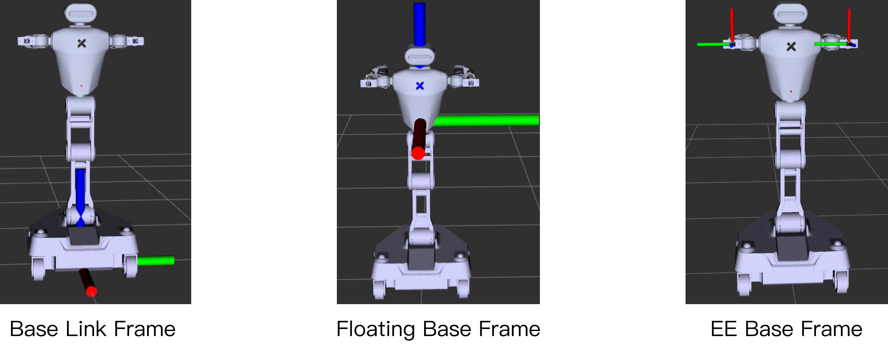

# Galaxea R1 Software Guide
## Software Dependency

1. Ubuntu 20.04 LTS
2. ROS Noetic

## Installation

The [SDK](https://github.com/userguide-galaxea/R1_SDK) does not require recompilation. Please refer to the contents below.

## First Move

Visit the page [R1_Demo](R1_demo_test.md) and get started to operate R1 following the instructions.

## Software Interface

In this chapter, we describe the various control and status feedback interfaces for Galaxea R1, to help users better understand how to communicate and control the arm through the ROS package.

### Driver Interface

The current Galaxea R1 driver is mainly composed of three parts, including four independent ROS nodes: the drivers of the chassis, the left and right arms, and the torso. The interfaces provided by these drivers are in the form of ROS topics, as described below.

Please type the following command to launch the corresponding driver:

1. Chassis, Arms, Torso, IMU, BMS, Remote Controller

    ```Bash
    roslaunch HDAS hdas.launch
    ```

2. Chassis Camera

    ```Bash
    sudo chmod 777 /dev/ttyTHS1
    roslaunch signal_camera signal_camera.launch
    ```

3. Wrist Camera

    ```Bash
    roslaunch realsense_camera rs_multiple_devices.launch
    ```

4. LiDAR

    ```Bash
    roslaunch livox_ros_driver2 msg_MID360.launch
    ```

#### Chassis Driver Interface

This interface is used for the chassis status feedback ROS package. The package defines multiple topics for posting the status of multiple motors in the chassis. The following are detailed descriptions of each topic and its related message types:

<table style="width: 100%; border-collapse: collapse;">
  <thead>
    <tr style="background-color: black; color: white; text-align: left;">
      <th style="padding: 8px; border: 1px solid #ddd; width: 200px;">Topic Name</th>
      <th style="padding: 8px; border: 1px solid #ddd; width: 300px;">Description</th>
      <th style="padding: 8px; border: 1px solid #ddd;">Message Type</th>
    </tr>
  </thead>
  <tbody>
    <tr style="background-color: white; text-align: left;">
      <td style="padding: 8px; border: 1px solid #ddd; width: 200px;">/hdas/feedback_chassis</td>
      <td style="padding: 8px; border: 1px solid #ddd; width: 300px;">Feedback of chassis</td>
      <td style="padding: 8px; border: 1px solid #ddd;">sensor_msgs::JointState</td>
    </tr>
     <tr style="background-color: white; text-align: left;">
      <td style="padding: 8px; border: 1px solid #ddd; width: 200px;">/hdas/feedback_status_chassis</td>
      <td style="padding: 8px; border: 1px solid #ddd; width: 300px;">Status of chassis</td>
      <td style="padding: 8px; border: 1px solid #ddd;">hdas_msg::feedback_status</td>
    </tr>
      <tr style="background-color: white; text-align: left;">
      <td style="padding: 8px; border: 1px solid #ddd; width: 200px;">/motion_control/control_chassis</td>
      <td style="padding: 8px; border: 1px solid #ddd; width: 300px;">Motor control of chassis</td>
      <td style="padding: 8px; border: 1px solid #ddd;">hdas_msg::motor_control</td>
    </tr>
  </tbody>
</table>
<table style="width: 100%; border-collapse: collapse;">
  </thead>
    <th style="background-color: black; color: white; vertical-align: middle; padding: 8px; border: 1px solid #ddd; width: 200px;">Topic Name</th>
    <th style="background-color: black; color: white; vertical-align: middle; padding: 8px; border: 1px solid #ddd; width: 300px;">Field</th>
    <th style="background-color: black; color: white; vertical-align: middle; padding: 8px; border: 1px solid #ddd;">Description</th>
    </tr>
  </thead>
  <tbody>
  <tr style="background-color: white;">
    <td style="vertical-align: middle; padding: 8px; border: 1px solid #ddd; width: 200px;" rowspan="4">/hdas/feedback_chassis</td>
    <td style="vertical-align: middle; padding: 8px; border: 1px solid #ddd;">header</td>
    <td style="vertical-align: middle; padding: 8px; border: 1px solid #ddd;">Standard header</td>
  </tr>
  <tr style="background-color: white;">
    <td style="vertical-align: middle; padding: 8px; border: 1px solid #ddd;">position</td>
    <td style="vertical-align: middle; padding: 8px; border: 1px solid #ddd;">[angle_front_left, angle_front_right, angle_rear]</td>
  </tr>
  <tr style="background-color: white;">
    <td style="vertical-align: middle; padding: 8px; border: 1px solid #ddd;">velocity</td>
    <td style="vertical-align: middle; padding: 8px; border: 1px solid #ddd;">[linear_velocity_front_left, linear_velocity_front_right, linear_velocity_rear
0.0, 0.0, 0.0]</td>
  </tr>
  <tr style="background-color: white;">
    <td style="vertical-align: middle; padding: 8px; border: 1px solid #ddd;">effort</td>
    <td style="vertical-align: middle; padding: 8px; border: 1px solid #ddd;">[0.0, 0.0, 0.0, 0.0, 0.0, 0.0]</td>
  </tr>
  <tr style="background-color: white;">
    <td style="vertical-align: middle; padding: 8px; border: 1px solid #ddd; width: 200px;" rowspan="3">hdas/feedback_status_arm_right</td>
    <td style="vertical-align: middle; padding: 8px; border: 1px solid #ddd;">header</td>
    <td style="vertical-align: middle; padding: 8px; border: 1px solid #ddd;">Standard header</td>
  </tr>
  <tr style="background-color: white;">
    <td style="vertical-align: middle; padding: 8px; border: 1px solid #ddd;">name_id</td>
    <td style="vertical-align: middle; padding: 8px; border: 1px solid #ddd;">Joint name</td>
  </tr>
  <tr style="background-color: white;">
    <td style="vertical-align: middle; padding: 8px; border: 1px solid #ddd;">errors</td>
    <td style="vertical-align: middle; padding: 8px; border: 1px solid #ddd;">Contains error code and error description</td>
  </tr>
<tr style="background-color: white;">
    <td style="vertical-align: middle; padding: 8px; border: 1px solid #ddd; width: 200px;" rowspan="8">/motion_control/control_chassis</td>
    <td style="vertical-align: middle; padding: 8px; border: 1px solid #ddd;">header</td>
    <td style="vertical-align: middle; padding: 8px; border: 1px solid #ddd;">Standard header</td>
  </tr>
  <tr style="background-color: white;">
    <td style="vertical-align: middle; padding: 8px; border: 1px solid #ddd;">name</td>
    <td style="vertical-align: middle; padding: 8px; border: 1px solid #ddd;">-</td>
  </tr>
  <tr style="background-color: white;">
    <td style="vertical-align: middle; padding: 8px; border: 1px solid #ddd;">p_des</td>
    <td style="vertical-align: middle; padding: 8px; border: 1px solid #ddd;">[angle_front_left, angle_front_right, angle_rear]</td>
  </tr>
  <tr style="background-color: white;">
    <td style="vertical-align: middle; padding: 8px; border: 1px solid #ddd;">v_des</td>
    <td style="vertical-align: middle; padding: 8px; border: 1px solid #ddd;">[linear_velocity_front_left, linear_velocity_front_right, linear_velocity_rear]</td>
  </tr>
  <tr style="background-color: white;">
    <td style="vertical-align: middle; padding: 8px; border: 1px solid #ddd;">kp</td>
    <td style="vertical-align: middle; padding: 8px; border: 1px solid #ddd;">-</td>
  </tr>
  <tr style="background-color: white;">
    <td style="vertical-align: middle; padding: 8px; border: 1px solid #ddd;">kd</td>
    <td style="vertical-align: middle; padding: 8px; border: 1px solid #ddd;">-</td>
  </tr>    
  <tr style="background-color: white;">
    <td style="vertical-align: middle; padding: 8px; border: 1px solid #ddd;">t_ff</td>
    <td style="vertical-align: middle; padding: 8px; border: 1px solid #ddd;">-</td>
  </tr> 
  <tr style="background-color: white;">
    <td style="vertical-align: middle; padding: 8px; border: 1px solid #ddd;">mode</td>
    <td style="vertical-align: middle; padding: 8px; border: 1px solid #ddd;">-</td>
  	</tr>  
   </tbody>
</table>


#### Arms Driver Interface

This interface is used for robot arm control and status feedback ROS package. The package defines multiple  topics for publishing and subscribing to the status of the robot arm, control commands, and associated error code information. The following are detailed descriptions of each topic and its related message types:

<table style="width: 100%; border-collapse: collapse;">
    <thead>
        <tr style="background-color: black; color: white; text-align: left;">
            <th style="width: 200px; vertical-align: middle; padding: 8px; border: 1px solid #ddd;">Topic Name</th>
            <th style="width: 300px; vertical-align: middle; padding: 8px; border: 1px solid #ddd;">Description</th>
            <th style="width: 300px; vertical-align: middle; padding: 8px; border: 1px solid #ddd;">Message Type</th>
        </tr>
    </thead>
    <tbody>
        <tr style="background-color: white; text-align: left;">
            <td style="vertical-align: middle; padding: 8px; border: 1px solid #ddd;">/hdas/feedback_arm_left</td>
            <td style="vertical-align: middle; padding: 8px; border: 1px solid #ddd;">Joint feedback of left arm</td>
            <td style="vertical-align: middle; padding: 8px; border: 1px solid #ddd;">sensor_msgs::JointState</td>
        </tr>
        <tr style="background-color: white; text-align: left;">
            <td style="vertical-align: middle; padding: 8px; border: 1px solid #ddd;">/hdas/feedback_arm_right</td>
            <td style="vertical-align: middle; padding: 8px; border: 1px solid #ddd;">Joint feedback of right arm</td>
            <td style="vertical-align: middle; padding: 8px; border: 1px solid #ddd;">sensor_msgs::JointState</td>
        </tr>
        <tr style="background-color: white; text-align: left;">
            <td style="vertical-align: middle; padding: 8px; border: 1px solid #ddd;">/hdas/feedback_gripper_left</td>
            <td style="vertical-align: middle; padding: 8px; border: 1px solid #ddd;">Gripper stroke of left gripper</td>
            <td style="vertical-align: middle; padding: 8px; border: 1px solid #ddd;">sensor_msgs::JointState</td>
        </tr>
        <tr style="background-color: white; text-align: left;">
            <td style="vertical-align: middle; padding: 8px; border: 1px solid #ddd;">/hdas/feedback_gripper_right</td>
            <td style="vertical-align: middle; padding: 8px; border: 1px solid #ddd;">Gripper stroke of right gripper</td>
            <td style="vertical-align: middle; padding: 8px; border: 1px solid #ddd;">sensor_msgs::JointState</td>
        </tr>
        <tr style="background-color: white; text-align: left;">
            <td style="vertical-align: middle; padding: 8px; border: 1px solid #ddd;">/hdas/feedback_status_arm_left</td>
            <td style="vertical-align: middle; padding: 8px; border: 1px solid #ddd;">Status of left arm</td>
            <td style="vertical-align: middle; padding: 8px; border: 1px solid #ddd;">hdas_msg::feedback_status</td>
        </tr>
        <tr style="background-color: white; text-align: left;">
            <td style="vertical-align: middle; padding: 8px; border: 1px solid #ddd;">/hdas/feedback_status_arm_right</td>
            <td style="vertical-align: middle; padding: 8px; border: 1px solid #ddd;">Status of right arm</td>
            <td style="vertical-align: middle; padding: 8px; border: 1px solid #ddd;">hdas_msg::feedback_status</td>
        </tr>
        <tr style="background-color: white; text-align: left;">
            <td style="vertical-align: middle; padding: 8px; border: 1px solid #ddd;">/hdas/feedback_status_gripper_left</td>
            <td style="vertical-align: middle; padding: 8px; border: 1px solid #ddd;">Status of left gripper</td>
            <td style="vertical-align: middle; padding: 8px; border: 1px solid #ddd;">hdas_msg::feedback_status</td>
        </tr>
        <tr style="background-color: white; text-align: left;">
            <td style="vertical-align: middle; padding: 8px; border: 1px solid #ddd;">/hdas/feedback_status_gripper_right</td>
            <td style="vertical-align: middle; padding: 8px; border: 1px solid #ddd;">Status of right gripper</td>
            <td style="vertical-align: middle; padding: 8px; border: 1px solid #ddd;">hdas_msg::feedback_status</td>
        </tr>
        <tr style="background-color: white; text-align: left;">
            <td style="vertical-align: middle; padding: 8px; border: 1px solid #ddd;">/motion_control/control_arm_left</td>
            <td style="vertical-align: middle; padding: 8px; border: 1px solid #ddd;">Motor control of left arm</td>
            <td style="vertical-align: middle; padding: 8px; border: 1px solid #ddd;">hdas_msg::motor_control</td>
        </tr>
        <tr style="background-color: white; text-align: left;">
            <td style="vertical-align: middle; padding: 8px; border: 1px solid #ddd;">/motion_control/control_arm_right</td>
            <td style="vertical-align: middle; padding: 8px; border: 1px solid #ddd;">Motor control of right arm</td>
            <td style="vertical-align: middle; padding: 8px; border: 1px solid #ddd;">hdas_msg::motor_control</td>
        </tr>
        <tr style="background-color: white; text-align: left;">
            <td style="vertical-align: middle; padding: 8px; border: 1px solid #ddd;">/motion_control/control_gripper_left</td>
            <td style="vertical-align: middle; padding: 8px; border: 1px solid #ddd;">Motor control of left gripper</td>
            <td style="vertical-align: middle; padding: 8px; border: 1px solid #ddd;">hdas_msg::motor_control</td>
        </tr>
        <tr style="background-color: white; text-align: left;">
            <td style="vertical-align: middle; padding: 8px; border: 1px solid #ddd;">/motion_control/control_gripper_right</td>
            <td style="vertical-align: middle; padding: 8px; border: 1px solid #ddd;">Motor control of right gripper</td>
            <td style="vertical-align: middle; padding: 8px; border: 1px solid #ddd;">hdas_msg::motor_control</td>
        </tr>
        <tr style="background-color: white; text-align: left;">
            <td style="vertical-align: middle; padding: 8px; border: 1px solid #ddd;">/motion_control/position_control_gripper_left</td>
            <td style="vertical-align: middle; padding: 8px; border: 1px solid #ddd;">Position control of left gripper</td>
            <td style="vertical-align: middle; padding: 8px; border: 1px solid #ddd;">std_msgs::Float32</td>
        </tr>
        <tr style="background-color: white; text-align: left;">
            <td style="vertical-align: middle; padding: 8px; border: 1px solid #ddd;">/motion_control/position_control_gripper_right</td>
            <td style="vertical-align: middle; padding: 8px; border: 1px solid #ddd;">Position control of right gripper</td>
            <td style="vertical-align: middle; padding: 8px; border: 1px solid #ddd;">std_msgs::Float32</td>
        </tr>
    </tbody>
</table>
<table style="width: 100%; border-collapse: collapse;">
  <thead>
    <tr>
      <th style="background-color: black; color: white; vertical-align: middle; padding: 8px; border: 1px solid #ddd; width: 200px;">Topic Name</th>
      <th style="background-color: black; color: white; vertical-align: middle; padding: 8px; border: 1px solid #ddd; width: 200px;">Field</th>
      <th style="background-color: black; color: white; vertical-align: middle; padding: 8px; border: 1px solid #ddd;width: 600px;">Description</th>
    </tr>
  </thead>
  <tbody>
    <tr style="background-color: white;">
      <td style="vertical-align: middle; padding: 8px; border: 1px solid #ddd; width: 200px;" rowspan="4">/hdas/feedback_arm_left</td>
      <td style="vertical-align: middle; padding: 8px; border: 1px solid #ddd;">header</td>
      <td style="vertical-align: middle; padding: 8px; border: 1px solid #ddd;">Standard header</td>
    </tr>
    <tr style="background-color: white;">
      <td style="vertical-align: middle; padding: 8px; border: 1px solid #ddd;">position</td>
      <td style="vertical-align: middle; padding: 8px; border: 1px solid #ddd;">[Joint1_position, Joint2_position, Joint3_position, Joint4_position, Joint5_position, Joint6_position, gripper_position]</td>
    </tr>
    <tr style="background-color: white;">
      <td style="vertical-align: middle; padding: 8px; border: 1px solid #ddd;">velocity</td>
      <td style="vertical-align: middle; padding: 8px; border: 1px solid #ddd;">[Joint1_velocity, Joint2_velocity, Joint3_velocity, Joint4_velocity, Joint5_velocity, Joint6_velocity, gripper_velocity]</td>
    </tr>
    <tr style="background-color: white;">
      <td style="vertical-align: middle; padding: 8px; border: 1px solid #ddd;">effort</td>
      <td style="vertical-align: middle; padding: 8px; border: 1px solid #ddd;">[Joint1_effort, Joint2_effort, Joint3_effort, Joint4_effort, Joint5_effort, Joint6_effort, gripper_effort]</td>
<tr style="background-color: white;">
      <td style="vertical-align: middle; padding: 8px; border: 1px solid #ddd; width: 200px;" rowspan="4">/hdas/feedback_arm_right</td>
      <td style="vertical-align: middle; padding: 8px; border: 1px solid #ddd;">header</td>
      <td style="vertical-align: middle; padding: 8px; border: 1px solid #ddd;">Standard header</td>
    </tr>
    <tr style="background-color: white;">
      <td style="vertical-align: middle; padding: 8px; border: 1px solid #ddd;">position</td>
      <td style="vertical-align: middle; padding: 8px; border: 1px solid #ddd;">[Joint1_position, Joint2_position, Joint3_position, Joint4_position, Joint5_position, Joint6_position, gripper_position]</td>
    </tr>
    <tr style="background-color: white;">
      <td style="vertical-align: middle; padding: 8px; border: 1px solid #ddd;">velocity</td>
      <td style="vertical-align: middle; padding: 8px; border: 1px solid #ddd;">[Joint1_velocity, Joint2_velocity, Joint3_velocity, Joint4_velocity, Joint5_velocity, Joint6_velocity, gripper_velocity]</td>
    </tr>
    <tr style="background-color: white;">
      <td style="vertical-align: middle; padding: 8px; border: 1px solid #ddd;">effort</td>
      <td style="vertical-align: middle; padding: 8px; border: 1px solid #ddd;">[Joint1_effort, Joint2_effort, Joint3_effort, Joint4_effort, Joint5_effort, Joint6_effort, gripper_effort]</td>
    <tr style="background-color: white;">
      <td style="vertical-align: middle; padding: 8px; border: 1px solid #ddd; width: 200px;" rowspan="4">/hdas/feedback_gripper_left</td>
      <td style="vertical-align: middle; padding: 8px; border: 1px solid #ddd;">header</td>
      <td style="vertical-align: middle; padding: 8px; border: 1px solid #ddd;">Standard header</td>
    </tr>
    <tr style="background-color: white;">
      <td style="vertical-align: middle; padding: 8px; border: 1px solid #ddd;">position</td>
      <td style="vertical-align: middle; padding: 8px; border: 1px solid #ddd;">[gripper_stroke]</td>
    </tr>
    <tr style="background-color: white;">
      <td style="vertical-align: middle; padding: 8px; border: 1px solid #ddd;">velocity</td>
      <td style="vertical-align: middle; padding: 8px; border: 1px solid #ddd;">Not used</td>
    </tr>
    <tr style="background-color: white;">
      <td style="vertical-align: middle; padding: 8px; border: 1px solid #ddd;">effort</td>
      <td style="vertical-align: middle; padding: 8px; border: 1px solid #ddd;">Not used</td>
    </tr>
    <tr style="background-color: white;">
      <td style="vertical-align: middle; padding: 8px; border: 1px solid #ddd; width: 200px;" rowspan="4">/hdas/feedback_gripper_right</td>
      <td style="vertical-align: middle; padding: 8px; border: 1px solid #ddd;">header</td>
      <td style="vertical-align: middle; padding: 8px; border: 1px solid #ddd;">Standard header</td>
    </tr>
    <tr style="background-color: white;">
      <td style="vertical-align: middle; padding: 8px; border: 1px solid #ddd;">position</td>
      <td style="vertical-align: middle; padding: 8px; border: 1px solid #ddd;">[gripper_stroke]</td>
    </tr>
    <tr style="background-color: white;">
      <td style="vertical-align: middle; padding: 8px; border: 1px solid #ddd;">velocity</td>
      <td style="vertical-align: middle; padding: 8px; border: 1px solid #ddd;">Not used</td>
    </tr>
    <tr style="background-color: white;">
      <td style="vertical-align: middle; padding: 8px; border: 1px solid #ddd;">effort</td>
      <td style="vertical-align: middle; padding: 8px; border: 1px solid #ddd;">Not used</td>
    </tr>        
    <tr style="background-color: white;">
      <td style="vertical-align: middle; padding: 8px; border: 1px solid #ddd; width: 200px;" rowspan="3">/hdas/feedback_status_arm_left</td>
      <td style="vertical-align: middle; padding: 8px; border: 1px solid #ddd;">header</td>
      <td style="vertical-align: middle; padding: 8px; border: 1px solid #ddd;">Standard header</td>
    </tr>
    <tr style="background-color: white;">
      <td style="vertical-align: middle; padding: 8px; border: 1px solid #ddd;">name_id</td>
      <td style="vertical-align: middle; padding: 8px; border: 1px solid #ddd;">Joint name</td>
    </tr>
    <tr style="background-color: white;">
      <td style="vertical-align: middle; padding: 8px; border: 1px solid #ddd;">errors</td>
      <td style="vertical-align: middle; padding: 8px; border: 1px solid #ddd;">Contains error code and error description</td>
    </tr>
    <tr style="background-color: white;">
      <td style="vertical-align: middle; padding: 8px; border: 1px solid #ddd; width: 200px;" rowspan="3">/hdas/feedback_status_arm_right</td>
      <td style="vertical-align: middle; padding: 8px; border: 1px solid #ddd;">header</td>
      <td style="vertical-align: middle; padding: 8px; border: 1px solid #ddd;">Standard header</td>
    </tr>
    <tr style="background-color: white;">
      <td style="vertical-align: middle; padding: 8px; border: 1px solid #ddd;">name_id</td>
      <td style="vertical-align: middle; padding: 8px; border: 1px solid #ddd;">Joint name</td>
    </tr>
    <tr style="background-color: white;">
      <td style="vertical-align: middle; padding: 8px; border: 1px solid #ddd;">errors</td>
      <td style="vertical-align: middle; padding: 8px; border: 1px solid #ddd;">Contains error code and error description</td>
    </tr>
    <tr style="background-color: white;">
      <td style="vertical-align: middle; padding: 8px; border: 1px solid #ddd; width: 200px;" rowspan="3">/hdas/feedback_status_gripper_left</td>
      <td style="vertical-align: middle; padding: 8px; border: 1px solid #ddd;">header</td>
      <td style="vertical-align: middle; padding: 8px; border: 1px solid #ddd;">Standard header</td>
    </tr>
    <tr style="background-color: white;">
      <td style="vertical-align: middle; padding: 8px; border: 1px solid #ddd;">name_id</td>
      <td style="vertical-align: middle; padding: 8px; border: 1px solid #ddd;">Joint name</td>
    </tr>
    <tr style="background-color: white;">
      <td style="vertical-align: middle; padding: 8px; border: 1px solid #ddd;">errors</td>
      <td style="vertical-align: middle; padding: 8px; border: 1px solid #ddd;">Contains error code and error description</td>
    </tr>
    <tr style="background-color: white;">
      <td style="vertical-align: middle; padding: 8px; border: 1px solid #ddd; width: 200px;" rowspan="3">/hdas/feedback_status_gripper_right</td>
      <td style="vertical-align: middle; padding: 8px; border: 1px solid #ddd;">header</td>
      <td style="vertical-align: middle; padding: 8px; border: 1px solid #ddd;">Standard header</td>
    </tr>
    <tr style="background-color: white;">
      <td style="vertical-align: middle; padding: 8px; border: 1px solid #ddd;">name_id</td>
      <td style="vertical-align: middle; padding: 8px; border: 1px solid #ddd;">Joint name</td>
    </tr>
    <tr style="background-color: white;">
      <td style="vertical-align: middle; padding: 8px; border: 1px solid #ddd;">errors</td>
      <td style="vertical-align: middle; padding: 8px; border: 1px solid #ddd;">Contains error code and error description</td>
    </tr>
    <tr style="background-color: white;">
      <td style="vertical-align: middle; padding: 8px; border: 1px solid #ddd; width: 200px;" rowspan="8">/motion_control/control_arm_left</td>
      <td style="vertical-align: middle; padding: 8px; border: 1px solid #ddd;">header</td>
      <td style="vertical-align: middle; padding: 8px; border: 1px solid #ddd;">Standard header</td>
    </tr>
    <tr style="background-color: white;">
      <td style="vertical-align: middle; padding: 8px; border: 1px solid #ddd;">name</td>
      <td style="vertical-align: middle; padding: 8px; border: 1px solid #ddd;">-</td>
    </tr>
    <tr style="background-color: white;">
      <td style="vertical-align: middle; padding: 8px; border: 1px solid #ddd;">p_des</td>
      <td style="vertical-align: middle; padding: 8px; border: 1px solid #ddd;">[Joint1_position, Joint2_position, Joint3_position, Joint4_position, Joint5_position, Joint6_position]</td>
    </tr>
    <tr style="background-color: white;">
      <td style="vertical-align: middle; padding: 8px; border: 1px solid #ddd;">v_des</td>
      <td style="vertical-align: middle; padding: 8px; border: 1px solid #ddd;">[Joint1_velocity, Joint2_velocity, Joint3_velocity, Joint4_velocity, Joint5_velocity, Joint6_velocity]</td>
    </tr>
    <tr style="background-color: white;">
      <td style="vertical-align: middle; padding: 8px; border: 1px solid #ddd;">kp</td>
      <td style="vertical-align: middle; padding: 8px; border: 1px solid #ddd;">[Joint1_kp, Joint2_kp, Joint3_kp, Joint4_kp, Joint5_kp, Joint6_kp]</td>
    </tr>
    <tr style="background-color: white;">
      <td style="vertical-align: middle; padding: 8px; border: 1px solid #ddd;">kd</td>
      <td style="vertical-align: middle; padding: 8px; border: 1px solid #ddd;">[Joint1_kd, Joint2_kd, Joint3_kd, Joint4_kd, Joint5_kd, Joint6_kd]</td>
    </tr>
    <tr style="background-color: white;">
      <td style="vertical-align: middle; padding: 8px; border: 1px solid #ddd;">t_ff</td>
      <td style="vertical-align: middle; padding: 8px; border: 1px solid #ddd;">[Joint1_effort, Joint2_effort, Joint3_effort, Joint4_effort, Joint5_effort, Joint6_effort]</td>
    </tr>
    <tr style="background-color: white;">
      <td style="vertical-align: middle; padding: 8px; border: 1px solid #ddd;">mode</td>
      <td style="vertical-align: middle; padding: 8px; border: 1px solid #ddd;">-</td>
    </tr>
    <tr style="background-color: white;">
      <td style="vertical-align: middle; padding: 8px; border: 1px solid #ddd; width: 200px;" rowspan="8">/motion_control/control_arm_right</td>
      <td style="vertical-align: middle; padding: 8px; border: 1px solid #ddd;">header</td>
      <td style="vertical-align: middle; padding: 8px; border: 1px solid #ddd;">Standard header</td>
    </tr>
    <tr style="background-color: white;">
      <td style="vertical-align: middle; padding: 8px; border: 1px solid #ddd;">name</td>
      <td style="vertical-align: middle; padding: 8px; border: 1px solid #ddd;">-</td>
    </tr>
    <tr style="background-color: white;">
      <td style="vertical-align: middle; padding: 8px; border: 1px solid #ddd;">p_des</td>
      <td style="vertical-align: middle; padding: 8px; border: 1px solid #ddd;">[Joint1_position, Joint2_position, Joint3_position, Joint4_position, Joint5_position, Joint6_position]</td>
    </tr>
    <tr style="background-color: white;">
      <td style="vertical-align: middle; padding: 8px; border: 1px solid #ddd;">v_des</td>
      <td style="vertical-align: middle; padding: 8px; border: 1px solid #ddd;">[Joint1_velocity, Joint2_velocity, Joint3_velocity, Joint4_velocity, Joint5_velocity, Joint6_velocity]</td>
    </tr>
    <tr style="background-color: white;">
      <td style="vertical-align: middle; padding: 8px; border: 1px solid #ddd;">kp</td>
      <td style="vertical-align: middle; padding: 8px; border: 1px solid #ddd;">[Joint1_kp, Joint2_kp, Joint3_kp, Joint4_kp, Joint5_kp, Joint6_kp]</td>
    </tr>
    <tr style="background-color: white;">
      <td style="vertical-align: middle; padding: 8px; border: 1px solid #ddd;">kd</td>
      <td style="vertical-align: middle; padding: 8px; border: 1px solid #ddd;">[Joint1_kd, Joint2_kd, Joint3_kd, Joint4_kd, Joint5_kd, Joint6_kd]</td>
    </tr>
    <tr style="background-color: white;">
      <td style="vertical-align: middle; padding: 8px; border: 1px solid #ddd;">t_ff</td>
      <td style="vertical-align: middle; padding: 8px; border: 1px solid #ddd;">[Joint1_effort, Joint2_effort, Joint3_effort, Joint4_effort, Joint5_effort, Joint6_effort]</td>
    </tr>
    <tr style="background-color: white;">
      <td style="vertical-align: middle; padding: 8px; border: 1px solid #ddd;">mode</td>
      <td style="vertical-align: middle; padding: 8px; border: 1px solid #ddd;">-</td>
    </tr>
    <tr style="background-color: white;">
      <td style="vertical-align: middle; padding: 8px; border: 1px solid #ddd; width: 200px;" rowspan="8">/motion_control/control_gripper_left</td>
      <td style="vertical-align: middle; padding: 8px; border: 1px solid #ddd;">header</td>
      <td style="vertical-align: middle; padding: 8px; border: 1px solid #ddd;">Standard header</td>
    </tr>
    <tr style="background-color: white;">
      <td style="vertical-align: middle; padding: 8px; border: 1px solid #ddd;">name</td>
      <td style="vertical-align: middle; padding: 8px; border: 1px solid #ddd;">-</td>
    </tr>
    <tr style="background-color: white;">
      <td style="vertical-align: middle; padding: 8px; border: 1px solid #ddd;">p_des</td>
      <td style="vertical-align: middle; padding: 8px; border: 1px solid #ddd;">[gripper_position]</td>
    </tr>
    <tr style="background-color: white;">
      <td style="vertical-align: middle; padding: 8px; border: 1px solid #ddd;">v_des</td>
      <td style="vertical-align: middle; padding: 8px; border: 1px solid #ddd;">[gripper_velocity]</td>
    </tr>
    <tr style="background-color: white;">
      <td style="vertical-align: middle; padding: 8px; border: 1px solid #ddd;">kp</td>
      <td style="vertical-align: middle; padding: 8px; border: 1px solid #ddd;">[gripper_kp]</td>
    </tr>
    <tr style="background-color: white;">
      <td style="vertical-align: middle; padding: 8px; border: 1px solid #ddd;">kd</td>
      <td style="vertical-align: middle; padding: 8px; border: 1px solid #ddd;">[gripper_kd]</td>
    </tr>
    <tr style="background-color: white;">
      <td style="vertical-align: middle; padding: 8px; border: 1px solid #ddd;">t_ff</td>
      <td style="vertical-align: middle; padding: 8px; border: 1px solid #ddd;">[gripper_effort]</td>
    </tr>
    <tr style="background-color: white;">
      <td style="vertical-align: middle; padding: 8px; border: 1px solid #ddd;">mode</td>
      <td style="vertical-align: middle; padding: 8px; border: 1px solid #ddd;">-</td>
    </tr>
    <tr style="background-color: white;">
      <td style="vertical-align: middle; padding: 8px; border: 1px solid #ddd; width: 200px;" rowspan="8">/motion_control/control_gripper_right</td>
      <td style="vertical-align: middle; padding: 8px; border: 1px solid #ddd;">header</td>
      <td style="vertical-align: middle; padding: 8px; border: 1px solid #ddd;">Standard header</td>
    </tr>
    <tr style="background-color: white;">
      <td style="vertical-align: middle; padding: 8px; border: 1px solid #ddd;">name</td>
      <td style="vertical-align: middle; padding: 8px; border: 1px solid #ddd;">-</td>
    </tr>
    <tr style="background-color: white;">
      <td style="vertical-align: middle; padding: 8px; border: 1px solid #ddd;">p_des</td>
      <td style="vertical-align: middle; padding: 8px; border: 1px solid #ddd;">[gripper_position]</td>
    </tr>
    <tr style="background-color: white;">
      <td style="vertical-align: middle; padding: 8px; border: 1px solid #ddd;">v_des</td>
      <td style="vertical-align: middle; padding: 8px; border: 1px solid #ddd;">[gripper_velocity]</td>
    </tr>
    <tr style="background-color: white;">
      <td style="vertical-align: middle; padding: 8px; border: 1px solid #ddd;">kp</td>
      <td style="vertical-align: middle; padding: 8px; border: 1px solid #ddd;">[gripper_kp]</td>
    </tr>
    <tr style="background-color: white;">
      <td style="vertical-align: middle; padding: 8px; border: 1px solid #ddd;">kd</td>
      <td style="vertical-align: middle; padding: 8px; border: 1px solid #ddd;">[gripper_kd]</td>
    </tr>
    <tr style="background-color: white;">
      <td style="vertical-align: middle; padding: 8px; border: 1px solid #ddd;">t_ff</td>
      <td style="vertical-align: middle; padding: 8px; border: 1px solid #ddd;">[gripper_effort]</td>
    </tr>
    <tr style="background-color: white;">
      <td style="vertical-align: middle; padding: 8px; border: 1px solid #ddd;">mode</td>
      <td style="vertical-align: middle; padding: 8px; border: 1px solid #ddd;">-</td>
    </tr>
    <tr style="background-color: white;">
      <td style="vertical-align: middle; padding: 8px; border: 1px solid #ddd; width: 200px;" rowspan="2">/motion_control/position_control_gripper_left</td>
      <td style="vertical-align: middle; padding: 8px; border: 1px solid #ddd;">header</td>
      <td style="vertical-align: middle; padding: 8px; border: 1px solid #ddd;">Standard header</td>
    </tr>
    <tr style="background-color: white;">
      <td style="vertical-align: middle; padding: 8px; border: 1px solid #ddd;">data</td>
      <td style="vertical-align: middle; padding: 8px; border: 1px solid #ddd;">desired_gripper_stroke, range (0 to 100) mm</td>
    </tr>
    <tr style="background-color: white;">
      <td style="vertical-align: middle; padding: 8px; border: 1px solid #ddd; width: 200px;" rowspan="2">/motion_control/position_control_gripper_right</td>
      <td style="vertical-align: middle; padding: 8px; border: 1px solid #ddd;">header</td>
      <td style="vertical-align: middle; padding: 8px; border: 1px solid #ddd;">Standard header</td>
    </tr>
    <tr style="background-color: white;">
      <td style="vertical-align: middle; padding: 8px; border: 1px solid #ddd;">data</td>
      <td style="vertical-align: middle; padding: 8px; border: 1px solid #ddd;">desired_gripper_stroke, range (0 to 100) mm</td>
    </tr>
  </tbody>
</table>


#### Torso Driver Interface

This interface is used for torso control and status feedback ROS package. The package defines multiple  topics for publishing and subscribing to the status of torso motors and control commands. The following are detailed descriptions of each topic and its related message types:

<table style="width: 100%; border-collapse: collapse;">
  <thead>
    <tr>
      <th style="background-color: black; color: white; vertical-align: middle; padding: 8px; border: 1px solid #ddd; width: 300px;">Topic Name</th>
      <th style="background-color: black; color: white; vertical-align: middle; padding: 8px; border: 1px solid #ddd;width: 400px;">">Description</th>
      <th style="background-color: black; color: white; vertical-align: middle; padding: 8px; border: 1px solid #ddd;width: 400px;">">Message Type</th>
    </tr>
  </thead>
  <tbody>
    <tr style="background-color: white;">
      <td style="vertical-align: middle; padding: 8px; border: 1px solid #ddd;">/hdas/feedback_torso</td>
      <td style="vertical-align: middle; padding: 8px; border: 1px solid #ddd;">Joint feedback of torso</td>
      <td style="vertical-align: middle; padding: 8px; border: 1px solid #ddd;">sensor_msgs/JointState</td>
    </tr>
    <tr style="background-color: white;">
      <td style="vertical-align: middle; padding: 8px; border: 1px solid #ddd;">/hdas/feedback_status_torso</td>
      <td style="vertical-align: middle; padding: 8px; border: 1px solid #ddd;">Torso motor status feedback</td>
      <td style="vertical-align: middle; padding: 8px; border: 1px solid #ddd;">hdas_msg::feedback_status</td>
    </tr>
    <tr style="background-color: white;">
      <td style="vertical-align: middle; padding: 8px; border: 1px solid #ddd;">/motion_control/control_torso</td>
      <td style="vertical-align: middle; padding: 8px; border: 1px solid #ddd;">Motor control of torso</td>
      <td style="vertical-align: middle; padding: 8px; border: 1px solid #ddd;">hdas_msg::motor_control</td>
    </tr>
  </tbody>
</table>

<table style="width: 100%; border-collapse: collapse;">
  <thead>
    <tr>
      <th style="background-color: black; color: white; vertical-align: middle; padding: 8px; border: 1px solid #ddd; width: 200px;">Topic Name</th>
      <th style="background-color: black; color: white; vertical-align: middle; padding: 8px; border: 1px solid #ddd;width: 200;">">Field</th>
      <th style="background-color: black; color: white; vertical-align: middle; padding: 8px; border: 1px solid #ddd;width: 500px;">">Description</th>
    </tr>
  </thead>
  <tbody>
    <tr style="background-color: white;">
      <td style="vertical-align: middle; padding: 8px; border: 1px solid #ddd;" rowspan="4">/hdas/feedback_torso</td>
      <td style="vertical-align: middle; padding: 8px; border: 1px solid #ddd;">header</td>
      <td style="vertical-align: middle; padding: 8px; border: 1px solid #ddd;">Standard header</td>
    </tr>
    <tr style="background-color: white;">
      <td style="vertical-align: middle; padding: 8px; border: 1px solid #ddd;">position</td>
      <td style="vertical-align: middle; padding: 8px; border: 1px solid #ddd;">[joint1_position, joint2_position, joint3_position, joint4_position]</td>
    </tr>
    <tr style="background-color: white;">
      <td style="vertical-align: middle; padding: 8px; border: 1px solid #ddd;">velocity</td>
      <td style="vertical-align: middle; padding: 8px; border: 1px solid #ddd;">[joint1_velocity, joint2_velocity, joint3_velocity, joint4_velocity]</td>
    </tr>
    <tr style="background-color: white;">
      <td style="vertical-align: middle; padding: 8px; border: 1px solid #ddd;">effort</td>
      <td style="vertical-align: middle; padding: 8px; border: 1px solid #ddd;">Not used</td>
    </tr>
    <tr style="background-color: white;">
      <td style="vertical-align: middle; padding: 8px; border: 1px solid #ddd;" rowspan="3">/hdas/feedback_status_arm_left</td>
      <td style="vertical-align: middle; padding: 8px; border: 1px solid #ddd;">header</td>
      <td style="vertical-align: middle; padding: 8px; border: 1px solid #ddd;">Standard header</td>
    </tr>
    <tr style="background-color: white;">
      <td style="vertical-align: middle; padding: 8px; border: 1px solid #ddd;">name_id</td>
      <td style="vertical-align: middle; padding: 8px; border: 1px solid #ddd;">Joint name</td>
    </tr>
    <tr style="background-color: white;">
      <td style="vertical-align: middle; padding: 8px; border: 1px solid #ddd;">errors</td>
      <td style="vertical-align: middle; padding: 8px; border: 1px solid #ddd;">Contains error code and error description</td>
    </tr>
    <tr style="background-color: white;">
      <td style="vertical-align: middle; padding: 8px; border: 1px solid #ddd;" rowspan="8">/motion_control/control_arm_left</td>
      <td style="vertical-align: middle; padding: 8px; border: 1px solid #ddd;">header</td>
      <td style="vertical-align: middle; padding: 8px; border: 1px solid #ddd;">Standard header</td>
    </tr>
    <tr style="background-color: white;">
      <td style="vertical-align: middle; padding: 8px; border: 1px solid #ddd;">name</td>
      <td style="vertical-align: middle; padding: 8px; border: 1px solid #ddd;">-</td>
    </tr>
    <tr style="background-color: white;">
      <td style="vertical-align: middle; padding: 8px; border: 1px solid #ddd;">p_des</td>
      <td style="vertical-align: middle; padding: 8px; border: 1px solid #ddd;">[Joint1_position, Joint2_position, Joint3_position, Joint4_position]</td>
    </tr>
    <tr style="background-color: white;">
      <td style="vertical-align: middle; padding: 8px; border: 1px solid #ddd;">v_des</td>
      <td style="vertical-align: middle; padding: 8px; border: 1px solid #ddd;">[Joint1_velocity, Joint2_velocity, Joint3_velocity, Joint4_velocity]</td>
    </tr>
    <tr style="background-color: white;">
      <td style="vertical-align: middle; padding: 8px; border: 1px solid #ddd;">kp</td>
      <td style="vertical-align: middle; padding: 8px; border: 1px solid #ddd;">[Joint1_kp, Joint2_kp, Joint3_kp, Joint4_kp]</td>
    </tr>
    <tr style="background-color: white;">
      <td style="vertical-align: middle; padding: 8px; border: 1px solid #ddd;">kd</td>
      <td style="vertical-align: middle; padding: 8px; border: 1px solid #ddd;">[Joint1_kd, Joint2_kd, Joint3_kd, Joint4_kd]</td>
    </tr>
    <tr style="background-color: white;">
      <td style="vertical-align: middle; padding: 8px; border: 1px solid #ddd;">t_ff</td>
      <td style="vertical-align: middle; padding: 8px; border: 1px solid #ddd;">[Joint1_effort, Joint2_effort, Joint3_effort, Joint4_effort]</td>
    </tr>
    <tr style="background-color: white;">
      <td style="vertical-align: middle; padding: 8px; border: 1px solid #ddd;">mode</td>
      <td style="vertical-align: middle; padding: 8px; border: 1px solid #ddd;">-</td>
    </tr>
  </tbody>
</table>


#### Camera Interface

<table style="width: 100%; border-collapse: collapse;">
  <thead>
    <tr>
      <th style="background-color: black; color: white; vertical-align: middle; padding: 8px; border: 1px solid #ddd; width: 200px;">Topic Name</th>
      <th style="background-color: black; color: white; vertical-align: middle; padding: 8px; border: 1px solid #ddd;200px;">Description</th>
      <th style="background-color: black; color: white; vertical-align: middle; padding: 8px; border: 1px solid #ddd;200px;">Message Type</th>
    </tr>
  </thead>
  <tbody>
    <tr style="background-color: white;">
      <td style="vertical-align: middle; padding: 8px; border: 1px solid #ddd;">/hdas/camera_chassis_front_left/rgb/compressed</td>
      <td style="vertical-align: middle; padding: 8px; border: 1px solid #ddd;">Compressed Image from front_left chassis camera</td>
      <td style="vertical-align: middle; padding: 8px; border: 1px solid #ddd;">sensor_msgs::CompressedImage</td>
    </tr>
    <tr style="background-color: white;">
      <td style="vertical-align: middle; padding: 8px; border: 1px solid #ddd;">/hdas/camera_chassis_front_right/rgb/compressed</td>
      <td style="vertical-align: middle; padding: 8px; border: 1px solid #ddd;">Compressed Image from front_right chassis camera</td>
      <td style="vertical-align: middle; padding: 8px; border: 1px solid #ddd;">sensor_msgs::CompressedImage</td>
    </tr>
    <tr style="background-color: white;">
      <td style="vertical-align: middle; padding: 8px; border: 1px solid #ddd;">/hdas/camera_chassis_left/rgb/compressed</td>
      <td style="vertical-align: middle; padding: 8px; border: 1px solid #ddd;">Compressed Image from left chassis camera</td>
      <td style="vertical-align: middle; padding: 8px; border: 1px solid #ddd;">sensor_msgs::CompressedImage</td>
    </tr>
    <tr style="background-color: white;">
      <td style="vertical-align: middle; padding: 8px; border: 1px solid #ddd;">/hdas/camera_chassis_right/rgb/compressed</td>
      <td style="vertical-align: middle; padding: 8px; border: 1px solid #ddd;">Compressed Image from right chassis camera</td>
      <td style="vertical-align: middle; padding: 8px; border: 1px solid #ddd;">sensor_msgs::CompressedImage</td>
    </tr>
    <tr style="background-color: white;">
      <td style="vertical-align: middle; padding: 8px; border: 1px solid #ddd;">/hdas/camera_chassis_rear/rgb/compressed</td>
      <td style="vertical-align: middle; padding: 8px; border: 1px solid #ddd;">Compressed Image from rear chassis camera</td>
      <td style="vertical-align: middle; padding: 8px; border: 1px solid #ddd;">sensor_msgs::CompressedImage</td>
    </tr>
    <tr style="background-color: white;">
      <td style="vertical-align: middle; padding: 8px; border: 1px solid #ddd;">/hdas/camera_wrist_left/color/image_raw/compressed</td>
      <td style="vertical-align: middle; padding: 8px; border: 1px solid #ddd;">Compressed Image from left wrist camera</td>
      <td style="vertical-align: middle; padding: 8px; border: 1px solid #ddd;">sensor_msgs::CompressedImage</td>
    </tr>
    <tr style="background-color: white;">
      <td style="vertical-align: middle; padding: 8px; border: 1px solid #ddd;">/hdas/camera_wrist_right/color/image_raw/compressed</td>
      <td style="vertical-align: middle; padding: 8px; border: 1px solid #ddd;">Compressed Image from right wrist camera</td>
      <td style="vertical-align: middle; padding: 8px; border: 1px solid #ddd;">sensor_msgs::CompressedImage</td>
    </tr>
    <tr style="background-color: white;">
      <td style="vertical-align: middle; padding: 8px; border: 1px solid #ddd;">/hdas/camera_head/left_raw/image_raw_color/compressed</td>
      <td style="vertical-align: middle; padding: 8px; border: 1px solid #ddd;">Compressed Image from head camera</td>
      <td style="vertical-align: middle; padding: 8px; border: 1px solid #ddd;">sensor_msgs::CompressedImage</td>
    </tr>
    <tr style="background-color: white;">
      <td style="vertical-align: middle; padding: 8px; border: 1px solid #ddd;">/hdas/camera_wrist_left/aligned_depth_to_color/image_raw</td>
      <td style="vertical-align: middle; padding: 8px; border: 1px solid #ddd;">Depth Image from left wrist camera</td>
      <td style="vertical-align: middle; padding: 8px; border: 1px solid #ddd;">sensor_msgs::Image</td>
    </tr>
    <tr style="background-color: white;">
      <td style="vertical-align: middle; padding: 8px; border: 1px solid #ddd;">/hdas/camera_wrist_right/aligned_depth_to_color/image_raw</td>
      <td style="vertical-align: middle; padding: 8px; border: 1px solid #ddd;">Depth Image from right wrist camera</td>
      <td style="vertical-align: middle; padding: 8px; border: 1px solid #ddd;">sensor_msgs::Image</td>
    </tr>
    <tr style="background-color: white;">
      <td style="vertical-align: middle; padding: 8px; border: 1px solid #ddd;">/hdas/camera_head/depth/depth_registered</td>
      <td style="vertical-align: middle; padding: 8px; border: 1px solid #ddd;">Depth Image from head camera</td>
      <td style="vertical-align: middle; padding: 8px; border: 1px solid #ddd;">sensor_msgs::Image</td>
    </tr>
  </tbody>
</table>

<table style="width: 100%; border-collapse: collapse;">
  <thead>
    <tr>
      <th style="background-color: black; color: white; vertical-align: middle; padding: 8px; border: 1px solid #ddd; width: 200px;">Topic Name</th>
      <th style="background-color: black; color: white; vertical-align: middle; padding: 8px; border: 1px solid #ddd; width: 300px;">Field</th>
      <th style="background-color: black; color: white; vertical-align: middle; padding: 8px; border: 1px solid #ddd;">Description</th>
    </tr>
  </thead>
  <tbody>
    <tr style="background-color: white;">
      <td style="vertical-align: middle; padding: 8px; border: 1px solid #ddd; width: 200px;" rowspan="3">/hdas/camera_chassis_front_left/rgb/compressed</td>
      <td style="vertical-align: middle; padding: 8px; border: 1px solid #ddd;">header</td>
      <td style="vertical-align: middle; padding: 8px; border: 1px solid #ddd;">Standard header</td>
    </tr>
    <tr style="background-color: white;">
      <td style="vertical-align: middle; padding: 8px; border: 1px solid #ddd;">format</td>
      <td style="vertical-align: middle; padding: 8px; border: 1px solid #ddd;">JPEG</td>
    </tr>
    <tr style="background-color: white;">
      <td style="vertical-align: middle; padding: 8px; border: 1px solid #ddd;">data</td>
      <td style="vertical-align: middle; padding: 8px; border: 1px solid #ddd;">Image data</td>
    </tr>
<tr style="background-color: white;">
      <td style="vertical-align: middle; padding: 8px; border: 1px solid #ddd; width: 200px;" rowspan="3">/hdas/camera_chassis_front_right/rgb/compressed</td>
      <td style="vertical-align: middle; padding: 8px; border: 1px solid #ddd;">header</td>
      <td style="vertical-align: middle; padding: 8px; border: 1px solid #ddd;">Standard header</td>
    </tr>
      <tr style="background-color: white;">
      <td style="vertical-align: middle; padding: 8px; border: 1px solid #ddd;">format</td>
      <td style="vertical-align: middle; padding: 8px; border: 1px solid #ddd;">JPEG</td>
    </tr>
    <tr style="background-color: white;">
      <td style="vertical-align: middle; padding: 8px; border: 1px solid #ddd;">data</td>
      <td style="vertical-align: middle; padding: 8px; border: 1px solid #ddd;">Image data</td>
    </tr>
    <tr style="background-color: white;">
      <td style="vertical-align: middle; padding: 8px; border: 1px solid #ddd; width: 200px;" rowspan="3">/hdas/camera_chassis_left/rgb/compressed</td>
      <td style="vertical-align: middle; padding: 8px; border: 1px solid #ddd;">header</td>
      <td style="vertical-align: middle; padding: 8px; border: 1px solid #ddd;">Standard header</td>
    </tr>
      <tr style="background-color: white;">
      <td style="vertical-align: middle; padding: 8px; border: 1px solid #ddd;">format</td>
      <td style="vertical-align: middle; padding: 8px; border: 1px solid #ddd;">JPEG</td>
    </tr>
    <tr style="background-color: white;">
      <td style="vertical-align: middle; padding: 8px; border: 1px solid #ddd;">data</td>
      <td style="vertical-align: middle; padding: 8px; border: 1px solid #ddd;">Image data</td>
    </tr>
    <tr style="background-color: white;">
      <td style="vertical-align: middle; padding: 8px; border: 1px solid #ddd; width: 200px;" rowspan="3">/hdas/camera_chassis_right/rgb/compressed</td>
       <td style="vertical-align: middle; padding: 8px; border: 1px solid #ddd;">header</td>
      <td style="vertical-align: middle; padding: 8px; border: 1px solid #ddd;">Standard header</td>
    </tr>
      <tr style="background-color: white;">
      <td style="vertical-align: middle; padding: 8px; border: 1px solid #ddd;">format</td>
      <td style="vertical-align: middle; padding: 8px; border: 1px solid #ddd;">JPEG</td>
    </tr>
    <tr style="background-color: white;">
      <td style="vertical-align: middle; padding: 8px; border: 1px solid #ddd;">data</td>
      <td style="vertical-align: middle; padding: 8px; border: 1px solid #ddd;">Image data</td>
    </tr>
    <tr style="background-color: white;">
      <td style="vertical-align: middle; padding: 8px; border: 1px solid #ddd; width: 200px;" rowspan="3">/hdas/camera_chassis_rear/rgb/compressed</td>
       <td style="vertical-align: middle; padding: 8px; border: 1px solid #ddd;">header</td>
      <td style="vertical-align: middle; padding: 8px; border: 1px solid #ddd;">Standard header</td>
    </tr>
      <tr style="background-color: white;">
      <td style="vertical-align: middle; padding: 8px; border: 1px solid #ddd;">format</td>
      <td style="vertical-align: middle; padding: 8px; border: 1px solid #ddd;">JPEG</td>
    </tr>
    <tr style="background-color: white;">
      <td style="vertical-align: middle; padding: 8px; border: 1px solid #ddd;">data</td>
      <td style="vertical-align: middle; padding: 8px; border: 1px solid #ddd;">Image data</td>
    </tr>
    <tr style="background-color: white;">
      <td style="vertical-align: middle; padding: 8px; border: 1px solid #ddd; width: 200px;" rowspan="3">/hdas/camera_wrist_left/color/image_raw/compressed</td>
      <td style="vertical-align: middle; padding: 8px; border: 1px solid #ddd;">header</td>
      <td style="vertical-align: middle; padding: 8px; border: 1px solid #ddd;">Standard header</td>
    </tr>
      <tr style="background-color: white;">
      <td style="vertical-align: middle; padding: 8px; border: 1px solid #ddd;">format</td>
      <td style="vertical-align: middle; padding: 8px; border: 1px solid #ddd;">JPEG</td>
    </tr>
    <tr style="background-color: white;">
      <td style="vertical-align: middle; padding: 8px; border: 1px solid #ddd;">data</td>
      <td style="vertical-align: middle; padding: 8px; border: 1px solid #ddd;">Image data</td>
    </tr>
    <tr style="background-color: white;">
      <td style="vertical-align: middle; padding: 8px; border: 1px solid #ddd; width: 200px;" rowspan="3">/hdas/camera_wrist_right/color/image_raw/compressed</td>
        <td style="vertical-align: middle; padding: 8px; border: 1px solid #ddd;">header</td>
      <td style="vertical-align: middle; padding: 8px; border: 1px solid #ddd;">Standard header</td>
    </tr>
      <tr style="background-color: white;">
      <td style="vertical-align: middle; padding: 8px; border: 1px solid #ddd;">format</td>
      <td style="vertical-align: middle; padding: 8px; border: 1px solid #ddd;">JPEG</td>
    </tr>
    <tr style="background-color: white;">
      <td style="vertical-align: middle; padding: 8px; border: 1px solid #ddd;">data</td>
      <td style="vertical-align: middle; padding: 8px; border: 1px solid #ddd;">Image data</td>
    </tr>
    <tr style="background-color: white;">
      <td style="vertical-align: middle; padding: 8px; border: 1px solid #ddd; width: 200px;" rowspan="3">/hdas/camera_head/left_raw/image_raw_color/compressed</td>
       <td style="vertical-align: middle; padding: 8px; border: 1px solid #ddd;">header</td>
      <td style="vertical-align: middle; padding: 8px; border: 1px solid #ddd;">Standard header</td>
    </tr>
      <tr style="background-color: white;">
      <td style="vertical-align: middle; padding: 8px; border: 1px solid #ddd;">format</td>
      <td style="vertical-align: middle; padding: 8px; border: 1px solid #ddd;">JPEG</td>
    </tr>
    <tr style="background-color: white;">
      <td style="vertical-align: middle; padding: 8px; border: 1px solid #ddd;">data</td>
      <td style="vertical-align: middle; padding: 8px; border: 1px solid #ddd;">Image data</td>
    </tr>
    <tr style="background-color: white;">
      <td style="vertical-align: middle; padding: 8px; border: 1px solid #ddd; width: 200px;" rowspan="7">/hdas/camera_wrist_left/aligned_depth_to_color/image_raw</td>
      <td style="vertical-align: middle; padding: 8px; border: 1px solid #ddd;">header</td>
      <td style="vertical-align: middle; padding: 8px; border: 1px solid #ddd;">Standard header</td>
    </tr>
    <tr style="background-color: white;">
      <td style="vertical-align: middle; padding: 8px; border: 1px solid #ddd;">height</td>
      <td style="vertical-align: middle; padding: 8px; border: 1px solid #ddd;">Depend on settings</td>
    </tr>
    <tr style="background-color: white;">
      <td style="vertical-align: middle; padding: 8px; border: 1px solid #ddd;">width</td>
      <td style="vertical-align: middle; padding: 8px; border: 1px solid #ddd;">Depend on settings</td>
    </tr>
    <tr style="background-color: white;">
      <td style="vertical-align: middle; padding: 8px; border: 1px solid #ddd;">encoding</td>
      <td style="vertical-align: middle; padding: 8px; border: 1px solid #ddd;">16UC1</td>
    </tr>
    <tr style="background-color: white;">
      <td style="vertical-align: middle; padding: 8px; border: 1px solid #ddd;">is_bigendian</td>
      <td style="vertical-align: middle; padding: 8px; border: 1px solid #ddd;">0</td>
    </tr>
    <tr style="background-color: white;">
      <td style="vertical-align: middle; padding: 8px; border: 1px solid #ddd;">step</td>
      <td style="vertical-align: middle; padding: 8px; border: 1px solid #ddd;">Depend on setttings</td>
    </tr>
    <tr style="background-color: white;">
      <td style="vertical-align: middle; padding: 8px; border: 1px solid #ddd;">data</td>
      <td style="vertical-align: middle; padding: 8px; border: 1px solid #ddd;">Image data</td>
    </tr>
    <tr style="background-color: white;">
      <td style="vertical-align: middle; padding: 8px; border: 1px solid #ddd; width: 200px;" rowspan="7">/hdas/camera_wrist_right/aligned_depth_to_color/image_raw</td>
    <td style="vertical-align: middle; padding: 8px; border: 1px solid #ddd;">header</td>
      <td style="vertical-align: middle; padding: 8px; border: 1px solid #ddd;">Standard header</td>
    </tr>
    <tr style="background-color: white;">
      <td style="vertical-align: middle; padding: 8px; border: 1px solid #ddd;">height</td>
      <td style="vertical-align: middle; padding: 8px; border: 1px solid #ddd;">Depend on settings</td>
    </tr>
    <tr style="background-color: white;">
      <td style="vertical-align: middle; padding: 8px; border: 1px solid #ddd;">width</td>
      <td style="vertical-align: middle; padding: 8px; border: 1px solid #ddd;">Depend on settings</td>
    </tr>
    <tr style="background-color: white;">
      <td style="vertical-align: middle; padding: 8px; border: 1px solid #ddd;">encoding</td>
      <td style="vertical-align: middle; padding: 8px; border: 1px solid #ddd;">16UC1</td>
    </tr>
    <tr style="background-color: white;">
      <td style="vertical-align: middle; padding: 8px; border: 1px solid #ddd;">is_bigendian</td>
      <td style="vertical-align: middle; padding: 8px; border: 1px solid #ddd;">0</td>
    </tr>
    <tr style="background-color: white;">
      <td style="vertical-align: middle; padding: 8px; border: 1px solid #ddd;">step</td>
      <td style="vertical-align: middle; padding: 8px; border: 1px solid #ddd;">Depend on setttings</td>
    </tr>
    <tr style="background-color: white;">
      <td style="vertical-align: middle; padding: 8px; border: 1px solid #ddd;">data</td>
      <td style="vertical-align: middle; padding: 8px; border: 1px solid #ddd;">Image data</td>
    </tr>
    <tr style="background-color: white;">
      <td style="vertical-align: middle; padding: 8px; border: 1px solid #ddd; width: 200px;" rowspan="7">/hdas/camera_head/depth/depth_registered</td>
    <td style="vertical-align: middle; padding: 8px; border: 1px solid #ddd;">header</td>
      <td style="vertical-align: middle; padding: 8px; border: 1px solid #ddd;">Standard header</td>
    </tr>
    <tr style="background-color: white;">
      <td style="vertical-align: middle; padding: 8px; border: 1px solid #ddd;">height</td>
      <td style="vertical-align: middle; padding: 8px; border: 1px solid #ddd;">Depend on settings</td>
    </tr>
    <tr style="background-color: white;">
      <td style="vertical-align: middle; padding: 8px; border: 1px solid #ddd;">width</td>
      <td style="vertical-align: middle; padding: 8px; border: 1px solid #ddd;">Depend on settings</td>
    </tr>
    <tr style="background-color: white;">
      <td style="vertical-align: middle; padding: 8px; border: 1px solid #ddd;">encoding</td>
      <td style="vertical-align: middle; padding: 8px; border: 1px solid #ddd;">32FC1</td>
    </tr>
    <tr style="background-color: white;">
      <td style="vertical-align: middle; padding: 8px; border: 1px solid #ddd;">is_bigendian</td>
      <td style="vertical-align: middle; padding: 8px; border: 1px solid #ddd;">0</td>
    </tr>
    <tr style="background-color: white;">
      <td style="vertical-align: middle; padding: 8px; border: 1px solid #ddd;">step</td>
      <td style="vertical-align: middle; padding: 8px; border: 1px solid #ddd;">Depend on setttings</td>
    </tr>
    <tr style="background-color: white;">
      <td style="vertical-align: middle; padding: 8px; border: 1px solid #ddd;">data</td>
      <td style="vertical-align: middle; padding: 8px; border: 1px solid #ddd;">Image data</td>
    </tr>
  </tbody>
</table>


#### LiDAR Interface

<table style="width: 100%; border-collapse: collapse;">
  <thead>
    <tr>
      <th style="background-color: black; color: white; vertical-align: middle; padding: 8px; border: 1px solid #ddd; width: 300px;">Topic Name</th>
      <th style="background-color: black; color: white; vertical-align: middle; padding: 8px; border: 1px solid #ddd;">Description</th>
      <th style="background-color: black; color: white; vertical-align: middle; padding: 8px; border: 1px solid #ddd;">Message Type</th>
    </tr>
  </thead>
  <tbody>
    <tr style="background-color: white;">
      <td style="vertical-align: middle; padding: 8px; border: 1px solid #ddd;">/hdas/lidar_chassis_left</td>
      <td style="vertical-align: middle; padding: 8px; border: 1px solid #ddd;">Lidar pointcloud</td>
      <td style="vertical-align: middle; padding: 8px; border: 1px solid #ddd;">sensor_msgs::PointCloud2</td>
    </tr>
  </tbody>
</table>

<table style="width: 100%; border-collapse: collapse;">
  <thead>
    <tr>
      <th style="background-color: black; color: white; vertical-align: middle; padding: 8px; border: 1px solid #ddd; width: 300px;">Topic Name</th>
      <th style="background-color: black; color: white; vertical-align: middle; padding: 8px; border: 1px solid #ddd; width: 300px;">Field</th>
      <th style="background-color: black; color: white; vertical-align: middle; padding: 8px; border: 1px solid #ddd; width: 400px;">Description</th>
    </tr>
  </thead>
  <tbody>
    <tr style="background-color: white;">
      <td style="vertical-align: middle; padding: 8px; border: 1px solid #ddd;" rowspan="2">/hdas/lidar_chassis_left</td>
      <td style="vertical-align: middle; padding: 8px; border: 1px solid #ddd;">header</td>
      <td style="vertical-align: middle; padding: 8px; border: 1px solid #ddd;">Standard header</td>
    </tr>
    <tr style="background-color: white;">
      <td style="vertical-align: middle; padding: 8px; border: 1px solid #ddd;">fields</td>
      <td style="vertical-align: middle; padding: 8px; border: 1px solid #ddd;">LiDAR data</td>
    </tr>
  </tbody>
</table>


#### IMU Interface

<table style="width: 100%; border-collapse: collapse;">
  <thead>
    <tr>
      <th style="background-color: black; color: white; vertical-align: middle; padding: 8px; border: 1px solid #ddd; width: 300px;">Topic Name</th>
      <th style="background-color: black; color: white; vertical-align: middle; padding: 8px; border: 1px solid #ddd;width: 300px;">Description</th>
      <th style="background-color: black; color: white; vertical-align: middle; padding: 8px; border: 1px solid #ddd;width: 400px;">Message Type</th>
    </tr>
  </thead>
  <tbody>
    <tr style="background-color: white;">
      <td style="vertical-align: middle; padding: 8px; border: 1px solid #ddd;">/hdas/imu_chassis</td>
      <td style="vertical-align: middle; padding: 8px; border: 1px solid #ddd;">Imu information</td>
      <td style="vertical-align: middle; padding: 8px; border: 1px solid #ddd;">sensor_msgs::Imu</td>
    </tr>
    <tr style="background-color: white;">
      <td style="vertical-align: middle; padding: 8px; border: 1px solid #ddd;">/hdas/imu_torso</td>
      <td style="vertical-align: middle; padding: 8px; border: 1px solid #ddd;">Imu information</td>
      <td style="vertical-align: middle; padding: 8px; border: 1px solid #ddd;">sensor_msgs::Imu</td>
    </tr>
  </tbody>
</table>

<table style="width: 100%; border-collapse: collapse;">
  <thead>
    <tr>
      <th style="background-color: black; color: white; vertical-align: middle; padding: 8px; border: 1px solid #ddd; width: 300px;">Topic Name</th>
      <th style="background-color: black; color: white; vertical-align: middle; padding: 8px; border: 1px solid #ddd; width: 400px;">Field</th>
      <th style="background-color: black; color: white; vertical-align: middle; padding: 8px; border: 1px solid #ddd; width: 400px;">Description</th>
    </tr>
  </thead>
  <tbody>
    <tr style="background-color: white;">
      <td style="vertical-align: middle; padding: 8px; border: 1px solid #ddd;" rowspan="11">/hdas/imu_chassis</td>
      <td style="vertical-align: middle; padding: 8px; border: 1px solid #ddd;">header</td>
      <td style="vertical-align: middle; padding: 8px; border: 1px solid #ddd;">Standard header</td>
    </tr>
    <tr style="background-color: white;">
      <td style="vertical-align: middle; padding: 8px; border: 1px solid #ddd;">orientation.x</td>
      <td style="vertical-align: middle; padding: 8px; border: 1px solid #ddd;">quaternion x</td>
    </tr>
    <tr style="background-color: white;">
      <td style="vertical-align: middle; padding: 8px; border: 1px solid #ddd;">orientation.y</td>
      <td style="vertical-align: middle; padding: 8px; border: 1px solid #ddd;">quaternion y</td>
    </tr>
    <tr style="background-color: white;">
      <td style="vertical-align: middle; padding: 8px; border: 1px solid #ddd;">orientation.z</td>
      <td style="vertical-align: middle; padding: 8px; border: 1px solid #ddd;">quaternion z</td>
    </tr>
    <tr style="background-color: white;">
      <td style="vertical-align: middle; padding: 8px; border: 1px solid #ddd;">orientation.w</td>
      <td style="vertical-align: middle; padding: 8px; border: 1px solid #ddd;">quaternion w</td>
    </tr>
    <tr style="background-color: white;">
      <td style="vertical-align: middle; padding: 8px; border: 1px solid #ddd;">angular_velocity.x</td>
      <td style="vertical-align: middle; padding: 8px; border: 1px solid #ddd;">Groyscope angular velocity x</td>
    </tr>
    <tr style="background-color: white;">
      <td style="vertical-align: middle; padding: 8px; border: 1px solid #ddd;">angular_velocity.y</td>
      <td style="vertical-align: middle; padding: 8px; border: 1px solid #ddd;">Groyscope angular velocity y</td>
    </tr>
    <tr style="background-color: white;">
      <td style="vertical-align: middle; padding: 8px; border: 1px solid #ddd;">angular_velocity.z</td>
      <td style="vertical-align: middle; padding: 8px; border: 1px solid #ddd;">Groyscope angular velocity z</td>
    </tr>
    <tr style="background-color: white;">
      <td style="vertical-align: middle; padding: 8px; border: 1px solid #ddd;">linear_acceleration.x</td>
      <td style="vertical-align: middle; padding: 8px; border: 1px solid #ddd;">Linear acceleration x</td>
    </tr>
    <tr style="background-color: white;">
      <td style="vertical-align: middle; padding: 8px; border: 1px solid #ddd;">linear_acceleration.y</td>
      <td style="vertical-align: middle; padding: 8px; border: 1px solid #ddd;">Linear acceleration y</td>
    </tr>
    <tr style="background-color: white;">
      <td style="vertical-align: middle; padding: 8px; border: 1px solid #ddd;">linear_acceleration.z</td>
      <td style="vertical-align: middle; padding: 8px; border: 1px solid #ddd;">Linear acceleration z</td>
    </tr>
    <tr style="background-color: white;">
      <td style="vertical-align: middle; padding: 8px; border: 1px solid #ddd;" rowspan="12">/hdas/imu_torso</td>
      <td style="vertical-align: middle; padding: 8px; border: 1px solid #ddd;">header</td>
      <td style="vertical-align: middle; padding: 8px; border: 1px solid #ddd;">Standard header</td>
    </tr>
    <tr style="background-color: white;">
      <td style="vertical-align: middle; padding: 8px; border: 1px solid #ddd;">orientation.x</td>
      <td style="vertical-align: middle; padding: 8px; border: 1px solid #ddd;">quaternion x</td>
    </tr>
    <tr style="background-color: white;">
      <td style="vertical-align: middle; padding: 8px; border: 1px solid #ddd;">orientation.y</td>
      <td style="vertical-align: middle; padding: 8px; border: 1px solid #ddd;">quaternion y</td>
    </tr>
    <tr style="background-color: white;">
      <td style="vertical-align: middle; padding: 8px; border: 1px solid #ddd;">orientation.z</td>
      <td style="vertical-align: middle; padding: 8px; border: 1px solid #ddd;">quaternion z</td>
    </tr>
    <tr style="background-color: white;">
      <td style="vertical-align: middle; padding: 8px; border: 1px solid #ddd;">orientation.w</td>
      <td style="vertical-align: middle; padding: 8px; border: 1px solid #ddd;">quaternion w</td>
    </tr>
    <tr style="background-color: white;">
      <td style="vertical-align: middle; padding: 8px; border: 1px solid #ddd;">angular_velocity.x</td>
      <td style="vertical-align: middle; padding: 8px; border: 1px solid #ddd;">Groyscope angular velocity x</td>
    </tr>
    <tr style="background-color: white;">
      <td style="vertical-align: middle; padding: 8px; border: 1px solid #ddd;">angular_velocity.y</td>
      <td style="vertical-align: middle; padding: 8px; border: 1px solid #ddd;">Groyscope angular velocity y</td>
    </tr>
    <tr style="background-color: white;">
      <td style="vertical-align: middle; padding: 8px; border: 1px solid #ddd;">angular_velocity.z</td>
      <td style="vertical-align: middle; padding: 8px; border: 1px solid #ddd;">Groyscope angular velocity z</td>
    </tr>
    <tr style="background-color: white;">
      <td style="vertical-align: middle; padding: 8px; border: 1px solid #ddd;">linear_acceleration.x</td>
      <td style="vertical-align: middle; padding: 8px; border: 1px solid #ddd;">Linear acceleration x</td>
    </tr>
    <tr style="background-color: white;">
      <td style="vertical-align: middle; padding: 8px; border: 1px solid #ddd;">linear_acceleration.y</td>
      <td style="vertical-align: middle; padding: 8px; border: 1px solid #ddd;">Linear acceleration y</td>
    </tr>
    <tr style="background-color: white;">
      <td style="vertical-align: middle; padding: 8px; border: 1px solid #ddd;">linear_acceleration.z</td>
      <td style="vertical-align: middle; padding: 8px; border: 1px solid #ddd;">Linear acceleration z</td>
    </tr>
  </tbody>
</table>


#### BMS Interface

<table style="width: 100%; border-collapse: collapse;">
  <thead>
    <tr>
      <th style="background-color: black; color: white; vertical-align: middle; padding: 8px; border: 1px solid #ddd; width: 300px;">Topic Name</th>
      <th style="background-color: black; color: white; vertical-align: middle; padding: 8px; border: 1px solid #ddd; width: 300px;">Description</th>
      <th style="background-color: black; color: white; vertical-align: middle; padding: 8px; border: 1px solid #ddd; width: 400px;">Message Type</th>
    </tr>
  </thead>
  <tbody>
    <tr style="background-color: white;">
      <td style="vertical-align: middle; padding: 8px; border: 1px solid #ddd;">/hdas/bms</td>
      <td style="vertical-align: middle; padding: 8px; border: 1px solid #ddd;">Battery BMS information</td>
      <td style="vertical-align: middle; padding: 8px; border: 1px solid #ddd;">hdas_msg::bms</td>
    </tr>
  </tbody>
</table>

<table style="width: 100%; border-collapse: collapse;">
  <thead>
    <tr>
      <th style="background-color: black; color: white; vertical-align: middle; padding: 8px; border: 1px solid #ddd; width: 300px;">Topic Name</th>
      <th style="background-color: black; color: white; vertical-align: middle; padding: 8px; border: 1px solid #ddd; width: 300px;">Field</th>
      <th style="background-color: black; color: white; vertical-align: middle; padding: 8px; border: 1px solid #ddd; width: 400px;">Description</th>
    </tr>
  </thead>
  <tbody>
    <tr style="background-color: white;">
      <td style="vertical-align: middle; padding: 8px; border: 1px solid #ddd;" rowspan="4">/hdas/bms</td>
      <td style="vertical-align: middle; padding: 8px; border: 1px solid #ddd;">header</td>
      <td style="vertical-align: middle; padding: 8px; border: 1px solid #ddd;">Standard header</td>
    </tr>
    <tr style="background-color: white;">
      <td style="vertical-align: middle; padding: 8px; border: 1px solid #ddd;">voltage</td>
      <td style="vertical-align: middle; padding: 8px; border: 1px solid #ddd;">Voltage in V</td>
    </tr>
    <tr style="background-color: white;">
      <td style="vertical-align: middle; padding: 8px; border: 1px solid #ddd;">current</td>
      <td style="vertical-align: middle; padding: 8px; border: 1px solid #ddd;">Current in A</td>
    </tr>
    <tr style="background-color: white;">
      <td style="vertical-align: middle; padding: 8px; border: 1px solid #ddd;">capital</td>
      <td style="vertical-align: middle; padding: 8px; border: 1px solid #ddd;">Capital in %</td>
    </tr>
  </tbody>
</table>


#### Remote Controller Interface

<table style="width: 100%; border-collapse: collapse;">
  <thead>
    <tr>
      <th style="background-color: black; color: white; vertical-align: middle; padding: 8px; border: 1px solid #ddd; width: 300px;">Topic Name</th>
      <th style="background-color: black; color: white; vertical-align: middle; padding: 8px; border: 1px solid #ddd;">Description</th>
      <th style="background-color: black; color: white; vertical-align: middle; padding: 8px; border: 1px solid #ddd;">Message Type</th>
    </tr>
  </thead>
  <tbody>
    <tr style="background-color: white;">
      <td style="vertical-align: middle; padding: 8px; border: 1px solid #ddd;">/hdas/controller</td>
      <td style="vertical-align: middle; padding: 8px; border: 1px solid #ddd;">Signal from remote controler</td>
      <td style="vertical-align: middle; padding: 8px; border: 1px solid #ddd;">hdas_msg::controller_signal_stamped</td>
    </tr>
  </tbody>
</table>

<table style="width: 100%; border-collapse: collapse;">
  <thead>
    <tr>
      <th style="background-color: black; color: white; vertical-align: middle; padding: 8px; border: 1px solid #ddd; width: 300px;">Topic Name</th>
      <th style="background-color: black; color: white; vertical-align: middle; padding: 8px; border: 1px solid #ddd; width: 300px;">Field</th>
      <th style="background-color: black; color: white; vertical-align: middle; padding: 8px; border: 1px solid #ddd; width: 400px;">Description</th>
    </tr>
  </thead>
  <tbody>
    <tr style="background-color: white;">
      <td style="vertical-align: middle; padding: 8px; border: 1px solid #ddd;" rowspan="6">/hdas/controller</td>
      <td style="vertical-align: middle; padding: 8px; border: 1px solid #ddd;">header</td>
      <td style="vertical-align: middle; padding: 8px; border: 1px solid #ddd;">Standard header</td>
    </tr>
    <tr style="background-color: white;">
      <td style="vertical-align: middle; padding: 8px; border: 1px solid #ddd;">data.left_x_axis</td>
      <td style="vertical-align: middle; padding: 8px; border: 1px solid #ddd;">X axis of left joystick</td>
    </tr>
    <tr style="background-color: white;">
      <td style="vertical-align: middle; padding: 8px; border: 1px solid #ddd;">data.left_y_axis</td>
      <td style="vertical-align: middle; padding: 8px; border: 1px solid #ddd;">Y axis of left joystick</td>
    </tr>
    <tr style="background-color: white;">
      <td style="vertical-align: middle; padding: 8px; border: 1px solid #ddd;">data.right_x_axis</td>
      <td style="vertical-align: middle; padding: 8px; border: 1px solid #ddd;">X axis of right joystick</td>
    </tr>
    <tr style="background-color: white;">
      <td style="vertical-align: middle; padding: 8px; border: 1px solid #ddd;">data.right_y_axis</td>
      <td style="vertical-align: middle; padding: 8px; border: 1px solid #ddd;">Y axis of right joystick</td>
    </tr>
    <tr style="background-color: white;">
      <td style="vertical-align: middle; padding: 8px; border: 1px solid #ddd;">mode</td>
      <td style="vertical-align: middle; padding: 8px; border: 1px solid #ddd;">-</td>
    </tr>
  </tbody>
</table>


### Control Interface

The current Galaxea R1 control diagram is shown as below, consisting of mainly 5 parts, R1 Pose Feedback, R1 Joint Control, R1 Chassis Control, R1 Arm Pose Control, and R1 Torso Pose Control. Details will be illustrated in below chapters. The whole package name is "mobiman", short for mobile manipulation.


#### R1 Chassis Control

R1 Chassis Control is the node which can control R1 chassis by vector control, which means you can send speed in three directions at the same time, which are direction x, direction y, and direction yaw(w).  It can be brought up by command.

```bash
roslaunch mobiman r1_chassis_control.launch
```

This launch file will bring up two nodes, which are chassis_control_node and r1_control_manager. Chassis_control_node is the main function for R1 chassis speed control, the interface is shown as blow.

<table style="width: 100%; border-collapse: collapse;">
  <thead>
    <tr>
      <th style="background-color: black; color: white; vertical-align: middle; padding: 8px; border: 1px solid #ddd; width: 200px;">Topic Name</th>
      <th style="background-color: black; color: white; vertical-align: middle; padding: 8px; border: 1px solid #ddd; width: 500px;">Description</th>
      <th style="background-color: black; color: white; vertical-align: middle; padding: 8px; border: 1px solid #ddd; width: 200px;">Message Type</th>
    </tr>
  </thead>
  <tbody>
    <tr style="background-color: white;">
      <td style="vertical-align: middle; padding: 8px; border: 1px solid #ddd;">/motion_target/target_speed_chassis</td>
      <td style="vertical-align: middle; padding: 8px; border: 1px solid #ddd;">Issue the target speed of chassis, consisting of three directions, x, y and w</td>
      <td style="vertical-align: middle; padding: 8px; border: 1px solid #ddd;">geometry_msgs::Twist</td>
    </tr>
    <tr style="background-color: white;">
      <td style="vertical-align: middle; padding: 8px; border: 1px solid #ddd;">/motion_target/chassis_acc_limit</td>
      <td style="vertical-align: middle; padding: 8px; border: 1px solid #ddd;">Issuing the chassis control acceleration limit, the max value for x, y, w is 2.5, 1.0, 1.0.</td>
      <td style="vertical-align: middle; padding: 8px; border: 1px solid #ddd;">geometry_msgs::Twist</td>
    </tr>
    <tr style="background-color: white;">
      <td style="vertical-align: middle; padding: 8px; border: 1px solid #ddd;">/motion_target/brake_mode</td>
      <td style="vertical-align: middle; padding: 8px; border: 1px solid #ddd;">Issuing whether the chassis is entering brake mode. If in brake mode, when speed is 0, the chassis will lock itself by turning the wheel to a certain degree.</td>
      <td style="vertical-align: middle; padding: 8px; border: 1px solid #ddd;">std_msgs::Bool</td>
    </tr>
    <tr style="background-color: white;">
      <td style="vertical-align: middle; padding: 8px; border: 1px solid #ddd;">/hdas/feedback_chassis</td>
      <td style="vertical-align: middle; padding: 8px; border: 1px solid #ddd;">R1 chassis control subscribes to this topic and controls the chassis the target speed</td>
      <td style="vertical-align: middle; padding: 8px; border: 1px solid #ddd;">sensor_msgs::JointState</td>
    </tr>
    <tr style="background-color: white;">
      <td style="vertical-align: middle; padding: 8px; border: 1px solid #ddd;">/motion_control/control_chassis</td>
      <td style="vertical-align: middle; padding: 8px; border: 1px solid #ddd;">R1 chassis control publishes this topic to control the motor</td>
      <td style="vertical-align: middle; padding: 8px; border: 1px solid #ddd;">hdas_msg::motor_control</td>
    </tr>
  </tbody>
</table>
<table style="width: 100%; border-collapse: collapse;">
  <thead>
    <tr>
      <th style="background-color: black; color: white; vertical-align: middle; padding: 8px; border: 1px solid #ddd; width: 200px;">Topic Name</th>
      <th style="background-color: black; color: white; vertical-align: middle; padding: 8px; border: 1px solid #ddd; width: 200px;">Field</th>
      <th style="background-color: black; color: white; vertical-align: middle; padding: 8px; border: 1px solid #ddd; width: 500px;">Description</th>
    </tr>
  </thead>
  <tbody>
    <tr style="background-color: white;">
      <td style="vertical-align: middle; padding: 8px; border: 1px solid #ddd;" rowspan="6">/motion_target/target_speed_chassis</td>
      <td style="vertical-align: middle; padding: 8px; border: 1px solid #ddd;">header</td>
      <td style="vertical-align: middle; padding: 8px; border: 1px solid #ddd;">Standard ROS header</td>
    </tr>
    <tr style="background-color: white;">
      <td style="vertical-align: middle; padding: 8px; border: 1px solid #ddd;">linear</td>
      <td style="vertical-align: middle; padding: 8px; border: 1px solid #ddd;">control of linear speed</td>
    </tr>
    <tr style="background-color: white;">
      <td style="vertical-align: middle; padding: 8px; border: 1px solid #ddd;">.x</td>
      <td style="vertical-align: middle; padding: 8px; border: 1px solid #ddd;">linear_speed of x, range (-1.5 to 1.5) m/s</td>
    </tr>
    <tr style="background-color: white;">
      <td style="vertical-align: middle; padding: 8px; border: 1px solid #ddd;">.y</td>
      <td style="vertical-align: middle; padding: 8px; border: 1px solid #ddd;">linear_speed of y, range (-1.5 to 1.5) m/s</td>
    </tr>
    <tr style="background-color: white;">
      <td style="vertical-align: middle; padding: 8px; border: 1px solid #ddd;">angular</td>
      <td style="vertical-align: middle; padding: 8px; border: 1px solid #ddd;">control of yaw rate</td>
    </tr>
    <tr style="background-color: white;">
      <td style="vertical-align: middle; padding: 8px; border: 1px solid #ddd;">.z</td>
      <td style="vertical-align: middle; padding: 8px; border: 1px solid #ddd;">control of angular speed, range (-3 to 3) rad/s</td>
    </tr>
    <tr style="background-color: white;">
      <td style="vertical-align: middle; padding: 8px; border: 1px solid #ddd;" rowspan="6">/motion_target/chassis_acc_limit</td>
      <td style="vertical-align: middle; padding: 8px; border: 1px solid #ddd;">header</td>
      <td style="vertical-align: middle; padding: 8px; border: 1px solid #ddd;">Standard ROS header</td>
    </tr>
    <tr style="background-color: white;">
      <td style="vertical-align: middle; padding: 8px; border: 1px solid #ddd;">linear</td>
      <td style="vertical-align: middle; padding: 8px; border: 1px solid #ddd;">Acc limit of linear speed</td>
    </tr>
    <tr style="background-color: white;">
      <td style="vertical-align: middle; padding: 8px; border: 1px solid #ddd;">.x</td>
      <td style="vertical-align: middle; padding: 8px; border: 1px solid #ddd;">Acc limit of x, range (-2.5 to 2.5) m/s²</td>
    </tr>
    <tr style="background-color: white;">
      <td style="vertical-align: middle; padding: 8px; border: 1px solid #ddd;">.y</td>
      <td style="vertical-align: middle; padding: 8px; border: 1px solid #ddd;">Acc limit of y, range (-1.0 to 1.0) m/s²</td>
    </tr>
    <tr style="background-color: white;">
      <td style="vertical-align: middle; padding: 8px; border: 1px solid #ddd;">angular</td>
      <td style="vertical-align: middle; padding: 8px; border: 1px solid #ddd;">control of yaw rate</td>
    </tr>
    <tr style="background-color: white;">
      <td style="vertical-align: middle; padding: 8px; border: 1px solid #ddd;">.z</td>
      <td style="vertical-align: middle; padding: 8px; border: 1px solid #ddd;">Acc limit of angular speed, range (-3 to 3) rad/s²</td>
    </tr>
    <tr style="background-color: white;">
      <td style="vertical-align: middle; padding: 8px; border: 1px solid #ddd;">/motion_target/brake_mode</td>
      <td style="vertical-align: middle; padding: 8px; border: 1px solid #ddd;">data</td>
      <td style="vertical-align: middle; padding: 8px; border: 1px solid #ddd;">Bool, True for entering brake mode; False for quitting brake mode.</td>
    </tr>
    <tr style="background-color: white;">
      <td style="vertical-align: middle; padding: 8px; border: 1px solid #ddd;">/hdas/feedback_chassis</td>
      <td style="vertical-align: middle; padding: 8px; border: 1px solid #ddd;">-</td>
      <td style="vertical-align: middle; padding: 8px; border: 1px solid #ddd;">Refer to HDAS msg Description</td>
    </tr>
    <tr style="background-color: white;">
      <td style="vertical-align: middle; padding: 8px; border: 1px solid #ddd;">/motion_control/control_chassis</td>
      <td style="vertical-align: middle; padding: 8px; border: 1px solid #ddd;">-</td>
      <td style="vertical-align: middle; padding: 8px; border: 1px solid #ddd;">Refer to HDAS msg Description</td>
    </tr>
  </tbody>
</table>


#### R1 Joint Control

R1 Chassis Control is the node which can control R1 each joint of torso, arms, 16 joints in total.  It can be brought up by command.

```bash
roslaunch mobiman r1_jointTrackerdemo.launch
```

This launch file will bring up robot state publisher, `eepose_pub_node` and `r1_jointTracker_demo_node`. Robot state publisher is a ros-provided tool, providing tf for RVIZ according to `/joint_states.` and`r1_jointTracker_demo_node` is the main function node to control each joint. 

`r1_jointTracker_demo_node` interface is shown below.

<table style="width: 100%; border-collapse: collapse;">
  <thead>
    <tr>
      <th style="background-color: black; color: white; vertical-align: middle; padding: 8px; border: 1px solid #ddd; width: 200px;">Topic Name</th>
      <th style="background-color: black; color: white; vertical-align: middle; padding: 8px; border: 1px solid #ddd; width: 200px;">Description</th>
      <th style="background-color: black; color: white; vertical-align: middle; padding: 8px; border: 1px solid #ddd; width: 200px;">Message Type</th>
    </tr>
  </thead>
  <tbody>
    <tr style="background-color: white;">
      <td style="vertical-align: middle; padding: 8px; border: 1px solid #ddd;">/motion_target/target_joint_state_arm_left</td>
      <td style="vertical-align: middle; padding: 8px; border: 1px solid #ddd;">Target position of each left arm joint</td>
      <td style="vertical-align: middle; padding: 8px; border: 1px solid #ddd;">sensor_msgs::JointState</td>
    </tr>
    <tr style="background-color: white;">
      <td style="vertical-align: middle; padding: 8px; border: 1px solid #ddd;">/motion_target/target_joint_state_arm_right</td>
      <td style="vertical-align: middle; padding: 8px; border: 1px solid #ddd;">Target position of each right arm joint</td>
      <td style="vertical-align: middle; padding: 8px; border: 1px solid #ddd;">sensor_msgs::JointState</td>
    </tr>
    <tr style="background-color: white;">
      <td style="vertical-align: middle; padding: 8px; border: 1px solid #ddd;">/motion_target/target_joint_state_torso</td>
      <td style="vertical-align: middle; padding: 8px; border: 1px solid #ddd;">Target position of each torso joint</td>
      <td style="vertical-align: middle; padding: 8px; border: 1px solid #ddd;">sensor_msgs::JointState</td>
    </tr>
    <tr style="background-color: white;">
      <td style="vertical-align: middle; padding: 8px; border: 1px solid #ddd;">/hdas/feedback_arm_left</td>
      <td style="vertical-align: middle; padding: 8px; border: 1px solid #ddd;">Feedback of left arm motor</td>
      <td style="vertical-align: middle; padding: 8px; border: 1px solid #ddd;">sensor_msgs::JointState</td>
    </tr>
    <tr style="background-color: white;">
      <td style="vertical-align: middle; padding: 8px; border: 1px solid #ddd;">/hdas/feedback_arm_right</td>
      <td style="vertical-align: middle; padding: 8px; border: 1px solid #ddd;">Feedback of right arm motor</td>
      <td style="vertical-align: middle; padding: 8px; border: 1px solid #ddd;">sensor_msgs::JointState</td>
    </tr>
    <tr style="background-color: white;">
      <td style="vertical-align: middle; padding: 8px; border: 1px solid #ddd;">/hdas/feedback_torso</td>
      <td style="vertical-align: middle; padding: 8px; border: 1px solid #ddd;">Feedback of torso motor</td>
      <td style="vertical-align: middle; padding: 8px; border: 1px solid #ddd;">sensor_msgs::JointState</td>
    </tr>
    <tr style="background-color: white;">
      <td style="vertical-align: middle; padding: 8px; border: 1px solid #ddd;">/motion_control/control_arm_left</td>
      <td style="vertical-align: middle; padding: 8px; border: 1px solid #ddd;">Control of left arm motor</td>
      <td style="vertical-align: middle; padding: 8px; border: 1px solid #ddd;">hdas_msg::motor_control</td>
    </tr>
    <tr style="background-color: white;">
      <td style="vertical-align: middle; padding: 8px; border: 1px solid #ddd;">/motion_control/control_arm_right</td>
      <td style="vertical-align: middle; padding: 8px; border: 1px solid #ddd;">Control of right arm motor</td>
      <td style="vertical-align: middle; padding: 8px; border: 1px solid #ddd;">hdas_msg::motor_control</td>
    </tr>
    <tr style="background-color: white;">
      <td style="vertical-align: middle; padding: 8px; border: 1px solid #ddd;">/motion_control/control_torso</td>
      <td style="vertical-align: middle; padding: 8px; border: 1px solid #ddd;">Control of torso motor</td>
      <td style="vertical-align: middle; padding: 8px; border: 1px solid #ddd;">hdas_msg::motor_control</td>
    </tr>
  </tbody>
</table>

<table style="width: 100%; border-collapse: collapse;">
  <thead>
    <tr>
      <th style="background-color: black; color: white; vertical-align: middle; padding: 8px; border: 1px solid #ddd; width: 200px;">Topic Name</th>
      <th style="background-color: black; color: white; vertical-align: middle; padding: 8px; border: 1px solid #ddd; width: 200px;">Field</th>
      <th style="background-color: black; color: white; vertical-align: middle; padding: 8px; border: 1px solid #ddd; width: 500px;">Description</th>
    </tr>
  </thead>
  <tbody>
    <tr style="background-color: white;">
      <td style="vertical-align: middle; padding: 8px; border: 1px solid #ddd;" rowspan="2">/motion_target/target_joint_state_arm_left <br>/motion_target/target_joint_state_arm_right</td>
      <td style="vertical-align: middle; padding: 8px; border: 1px solid #ddd;">position</td>
      <td style="vertical-align: middle; padding: 8px; border: 1px solid #ddd;">This is a vector of six elements. 6 joint target positions for each joint.</td>
    </tr>
    <tr style="background-color: white;">
      <td style="vertical-align: middle; padding: 8px; border: 1px solid #ddd;">velocity</td>
      <td style="vertical-align: middle; padding: 8px; border: 1px solid #ddd;">This is a vector of six elements. Standing for max velocity of each joint during movement.<br>The max speed is below, {3, 3, 3, 5, 5, 5}. <br>The acc & jerk limit is set to 1.5* speed limit.</td>
    </tr>
    <tr style="background-color: white;">
      <td style="vertical-align: middle; padding: 8px; border: 1px solid #ddd;" rowspan="2">/motion_target/target_joint_state_torso</td>
      <td style="vertical-align: middle; padding: 8px; border: 1px solid #ddd;">position</td>
      <td style="vertical-align: middle; padding: 8px; border: 1px solid #ddd;">This is a vector of four elements. 4 joint target positions for each joint.</td>
    </tr>
    <tr style="background-color: white;">
      <td style="vertical-align: middle; padding: 8px; border: 1px solid #ddd;">velocity</td>
      <td style="vertical-align: middle; padding: 8px; border: 1px solid #ddd;">This is a vector of four elements. Standing for four velocity of each joint during movement.<br>The max speed is below, {1.5, 1.5, 1.5, 1.5}. <br>The acc & jerk limit is set to 1.5* speed limit.</td>
    </tr>
    <tr style="background-color: white;">
      <td style="vertical-align: middle; padding: 8px; border: 1px solid #ddd;">/hdas/feedback_arm_left</td>
      <td style="vertical-align: middle; padding: 8px; border: 1px solid #ddd;">-</td>
      <td style="vertical-align: middle; padding: 8px; border: 1px solid #ddd;">Refer to HDAS msg Description</td>
    </tr>
    <tr style="background-color: white;">
      <td style="vertical-align: middle; padding: 8px; border: 1px solid #ddd;">/hdas/feedback_arm_right</td>
      <td style="vertical-align: middle; padding: 8px; border: 1px solid #ddd;">-</td>
      <td style="vertical-align: middle; padding: 8px; border: 1px solid #ddd;">Refer to HDAS msg Description</td>
    </tr>
    <tr style="background-color: white;">
      <td style="vertical-align: middle; padding: 8px; border: 1px solid #ddd;">/hdas/feedback_torso</td>
      <td style="vertical-align: middle; padding: 8px; border: 1px solid #ddd;">-</td>
      <td style="vertical-align: middle; padding: 8px; border: 1px solid #ddd;">Refer to HDAS msg Description</td>
    </tr>
    <tr style="background-color: white;">
      <td style="vertical-align: middle; padding: 8px; border: 1px solid #ddd;">/motion_control/control_arm_left</td>
      <td style="vertical-align: middle; padding: 8px; border: 1px solid #ddd;">-</td>
      <td style="vertical-align: middle; padding: 8px; border: 1px solid #ddd;">Refer to HDAS msg Description</td>
    </tr>
    <tr style="background-color: white;">
      <td style="vertical-align: middle; padding: 8px; border: 1px solid #ddd;">/motion_control/control_arm_right</td>
      <td style="vertical-align: middle; padding: 8px; border: 1px solid #ddd;">-</td>
      <td style="vertical-align: middle; padding: 8px; border: 1px solid #ddd;">Refer to HDAS msg Description</td>
    </tr>
    <tr style="background-color: white;">
      <td style="vertical-align: middle; padding: 8px; border: 1px solid #ddd;">/motion_control/control_torso</td>
      <td style="vertical-align: middle; padding: 8px; border: 1px solid #ddd;">-</td>
      <td style="vertical-align: middle; padding: 8px; border: 1px solid #ddd;">Refer to HDAS msg Description</td>
    </tr>
  </tbody>
</table>

`eepose_pub_node` defines two frames, which are base link frame (Left), floating base frame (Middle) and ee pose frame(Right).



<table style="width: 100%; border-collapse: collapse;">
  <thead>
    <tr>
      <th style="background-color: black; color: white; vertical-align: middle; padding: 8px; border: 1px solid #ddd; width: 200px;">Topic Name</th>
      <th style="background-color: black; color: white; vertical-align: middle; padding: 8px; border: 1px solid #ddd; width: 500px;">Description</th>
      <th style="background-color: black; color: white; vertical-align: middle; padding: 8px; border: 1px solid #ddd; width: 200px;">Message Type</th>
    </tr>
  </thead>
  <tbody>
    <tr style="background-color: white;">
      <td style="vertical-align: middle; padding: 8px; border: 1px solid #ddd;">/motion_control/pose_ee_arm_left</td>
      <td style="vertical-align: middle; padding: 8px; border: 1px solid #ddd;">Transform from floating base to left EE pose</td>
      <td style="vertical-align: middle; padding: 8px; border: 1px solid #ddd;">geometry_msgs::PoseStamped</td>
    </tr>
    <tr style="background-color: white;">
      <td style="vertical-align: middle; padding: 8px; border: 1px solid #ddd;">/motion_control/pose_ee_arm_right</td>
      <td style="vertical-align: middle; padding: 8px; border: 1px solid #ddd;">Transform from floating base to right EE pose</td>
      <td style="vertical-align: middle; padding: 8px; border: 1px solid #ddd;">geometry_msgs::PoseStamped</td>
    </tr>
    <tr style="background-color: white;">
      <td style="vertical-align: middle; padding: 8px; border: 1px solid #ddd;">/motion_control/pose_floating_base</td>
      <td style="vertical-align: middle; padding: 8px; border: 1px solid #ddd;">Transform from base-link to floating base</td>
      <td style="vertical-align: middle; padding: 8px; border: 1px solid #ddd;">geometry_msgs::PoseStamped</td>
    </tr>
  </tbody>
</table>

<table style="width: 100%; border-collapse: collapse;">
  <thead>
    <tr>
      <th style="background-color: black; color: white; vertical-align: middle; padding: 8px; border: 1px solid #ddd; width: 200px;">Topic Name</th>
      <th style="background-color: black; color: white; vertical-align: middle; padding: 8px; border: 1px solid #ddd; width: 400px;">Field</th>
      <th style="background-color: black; color: white; vertical-align: middle; padding: 8px; border: 1px solid #ddd; width: 600px;">Description</th>
    </tr>
  </thead>
  <tbody>
    <tr style="background-color: white;">
      <td style="vertical-align: middle; padding: 8px; border: 1px solid #ddd;" rowspan="9">/motion_control/pose_floating_base<br>/motion_control/pose_ee_arm_right<br>/motion_control/pose_ee_arm_left</td>
      <td style="vertical-align: middle; padding: 8px; border: 1px solid #ddd;">position</td>
      <td style="vertical-align: middle; padding: 8px; border: 1px solid #ddd;">This is the translation information in X, Y, Z position</td>
    </tr>
    <tr style="background-color: white;">
      <td style="vertical-align: middle; padding: 8px; border: 1px solid #ddd;">pose.position.x</td>
      <td style="vertical-align: middle; padding: 8px; border: 1px solid #ddd;">Shift in the X direction</td>
    </tr>
    <tr style="background-color: white;">
      <td style="vertical-align: middle; padding: 8px; border: 1px solid #ddd;">pose.position.y</td>
      <td style="vertical-align: middle; padding: 8px; border: 1px solid #ddd;">Shift in the Y direction</td>
    </tr>
    <tr style="background-color: white;">
      <td style="vertical-align: middle; padding: 8px; border: 1px solid #ddd;">pose.position.z</td>
      <td style="vertical-align: middle; padding: 8px; border: 1px solid #ddd;">Shift in the Z direction</td>
    </tr>
      <td style="vertical-align: middle; padding: 8px; border: 1px solid #ddd;">orientation</td>
      <td style="vertical-align: middle; padding: 8px; border: 1px solid #ddd;">This is orientation information</td>
    </tr>
    <tr style="background-color: white;">
      <td style="vertical-align: middle; padding: 8px; border: 1px solid #ddd;">pose.orientation.x</td>
      <td style="vertical-align: middle; padding: 8px; border: 1px solid #ddd;">Orientation quaternion</td>
    </tr>
    <tr style="background-color: white;">
      <td style="vertical-align: middle; padding: 8px; border: 1px solid #ddd;">pose.orientation.y</td>
      <td style="vertical-align: middle; padding: 8px; border: 1px solid #ddd;">Orientation quaternion</td>
    </tr>
    <tr style="background-color: white;">
      <td style="vertical-align: middle; padding: 8px; border: 1px solid #ddd;">pose.orientation.z</td>
      <td style="vertical-align: middle; padding: 8px; border: 1px solid #ddd;">Orientation quaternion</td>
    </tr>
    <tr style="background-color: white;">
      <td style="vertical-align: middle; padding: 8px; border: 1px solid #ddd;">pose.orientation.w</td>
      <td style="vertical-align: middle; padding: 8px; border: 1px solid #ddd;">Orientation quaternion</td>
    </tr>
  </tbody>
</table>


#### R1 Arm Pose Control - Coming Soon

R1 Arm Pose Control is a ROS Package for controlling arm movement to target arm ee frame, and it can be brought up by 

```bash
roslaunch mobiman r1_arm_pose_control.launch
```

The interface is shown below.

<table style="width: 100%; border-collapse: collapse;">
  <thead>
    <tr>
      <th style="background-color: black; color: white; vertical-align: middle; padding: 8px; border: 1px solid #ddd; width: 200px;">Topic Name</th>
      <th style="background-color: black; color: white; vertical-align: middle; padding: 8px; border: 1px solid #ddd; width: 500px;">Description</th>
      <th style="background-color: black; color: white; vertical-align: middle; padding: 8px; border: 1px solid #ddd; width: 200px;">Message Type</th>
    </tr>
  </thead>
  <tbody>
    <tr style="background-color: white;">
      <td style="vertical-align: middle; padding: 8px; border: 1px solid #ddd;">/motion_target/pose_ee_arm_left<br>/motion_target/pose_ee_arm_right</td>
      <td style="vertical-align: middle; padding: 8px; border: 1px solid #ddd;">Target pose of arm ee frame</td>
      <td style="vertical-align: middle; padding: 8px; border: 1px solid #ddd;">Geometry_msgs::PoseStamped</td>
    </tr>
    <tr style="background-color: white;">
      <td style="vertical-align: middle; padding: 8px; border: 1px solid #ddd;">/motion_target/target_joint_state_arm_left<br>/motion_target/target_joint_state_arm_right</td>
      <td style="vertical-align: middle; padding: 8px; border: 1px solid #ddd;">Target Joint position of each joint of arm </td>
      <td style="vertical-align: middle; padding: 8px; border: 1px solid #ddd;">Sensor_msgs::JointState</td>
    </tr>
    <tr style="background-color: white;">
      <td style="vertical-align: middle; padding: 8px; border: 1px solid #ddd;">/hdas/feedback_arm_left<br>/hdas/feedback_arm_right</td>
      <td style="vertical-align: middle; padding: 8px; border: 1px solid #ddd;">Feedback of arm joint</td>
      <td style="vertical-align: middle; padding: 8px; border: 1px solid #ddd;">Sensor_msgs::JointState</td>
    </tr>
  </tbody>
</table>

<table style="width: 100%; border-collapse: collapse;">
  <thead>
    <tr>
      <th style="background-color: black; color: white; vertical-align: middle; padding: 8px; border: 1px solid #ddd; width: 200px;">Topic Name</th>
      <th style="background-color: black; color: white; vertical-align: middle; padding: 8px; border: 1px solid #ddd; width: 500px;">Field</th>
      <th style="background-color: black; color: white; vertical-align: middle; padding: 8px; border: 1px solid #ddd; width: 500px;">Description</th>
    </tr>
  </thead>
  <tbody>
    <tr style="background-color: white;">
      <td style="vertical-align: middle; padding: 8px; border: 1px solid #ddd;" rowspan="8">/motion_target/pose_ee_arm_left</td>
      <td style="vertical-align: middle; padding: 8px; border: 1px solid #ddd;">header</td>
      <td style="vertical-align: middle; padding: 8px; border: 1px solid #ddd;">Standard Header</td>
    </tr>
    <tr style="background-color: white;">
      <td style="vertical-align: middle; padding: 8px; border: 1px solid #ddd;">pose.position.x</td>
      <td style="vertical-align: middle; padding: 8px; border: 1px solid #ddd;">Shift in x-direction</td>
    </tr>
    <tr style="background-color: white;">
      <td style="vertical-align: middle; padding: 8px; border: 1px solid #ddd;">pose.position.y</td>
      <td style="vertical-align: middle; padding: 8px; border: 1px solid #ddd;">Shift in y-direction</td>
    </tr>
    <tr style="background-color: white;">
      <td style="vertical-align: middle; padding: 8px; border: 1px solid #ddd;">pose.position.z</td>
      <td style="vertical-align: middle; padding: 8px; border: 1px solid #ddd;">Shift in z-direction</td>
    </tr>
    <tr style="background-color: white;">
      <td style="vertical-align: middle; padding: 8px; border: 1px solid #ddd;">pose.orientation.x</td>
      <td style="vertical-align: middle; padding: 8px; border: 1px solid #ddd;">Orientation quaternion</td>
    </tr>
    <tr style="background-color: white;">
      <td style="vertical-align: middle; padding: 8px; border: 1px solid #ddd;">pose.orientation.y</td>
      <td style="vertical-align: middle; padding: 8px; border: 1px solid #ddd;">Orientation quaternion</td>
    </tr>
    <tr style="background-color: white;">
      <td style="vertical-align: middle; padding: 8px; border: 1px solid #ddd;">pose.orientation.z</td>
      <td style="vertical-align: middle; padding: 8px; border: 1px solid #ddd;">Orientation quaternion</td>
    </tr>
    <tr style="background-color: white;">
      <td style="vertical-align: middle; padding: 8px; border: 1px solid #ddd;">pose.orientation.w</td>
      <td style="vertical-align: middle; padding: 8px; border: 1px solid #ddd;">Orientation quaternion</td>
    </tr>      
    <tr style="background-color: white;">
      <td style="vertical-align: middle; padding: 8px; border: 1px solid #ddd;">/motion_target/target_joint_state_arm_left<br>/motion_target/target_joint_state_arm_right</td>
      <td style="vertical-align: middle; padding: 8px; border: 1px solid #ddd;">- </td>
      <td style="vertical-align: middle; padding: 8px; border: 1px solid #ddd;">Refer to R1 Joint Control Chapter</td>
    </tr>
    <tr style="background-color: white;">
      <td style="vertical-align: middle; padding: 8px; border: 1px solid #ddd;">/hdas/feedback_arm_left<br>/hdas/feedback_arm_right</td>
      <td style="vertical-align: middle; padding: 8px; border: 1px solid #ddd;">-</td>
      <td style="vertical-align: middle; padding: 8px; border: 1px solid #ddd;">Refer to HDAS msg</td>
    </tr>
  </tbody>
</table>


#### R1 Torso Pose Control - Coming Soon

R1 Torso Pose Control is a ROS Package for controlling torso movement to target floating base frame. It can be brought up by 

```bash
roslaunch mobiman r1_torso_pos_control.launch
```

This pose is subject to certain constraints, as described below.

<table style="width: 100%; border-collapse: collapse;">
  <thead>
    <tr>
      <th style="background-color: black; color: white; vertical-align: middle; padding: 8px; border: 1px solid #ddd; width: 200px;">Topic Name</th>
      <th style="background-color: black; color: white; vertical-align: middle; padding: 8px; border: 1px solid #ddd; width: 500px;">Description</th>
      <th style="background-color: black; color: white; vertical-align: middle; padding: 8px; border: 1px solid #ddd; width: 200px;">Message Type</th>
    </tr>
  </thead>
  <tbody>
    <tr style="background-color: white;">
      <td style="vertical-align: middle; padding: 8px; border: 1px solid #ddd;">/motion_target/target_pose_torso</td>
      <td style="vertical-align: middle; padding: 8px; border: 1px solid #ddd;">Target pose of floating base frame</td>
      <td style="vertical-align: middle; padding: 8px; border: 1px solid #ddd;">geometry_msgs::PoseStamped</td>
    </tr>
    <tr style="background-color: white;">
      <td style="vertical-align: middle; padding: 8px; border: 1px solid #ddd;">/motion_target/target_joint_state_torso</td>
      <td style="vertical-align: middle; padding: 8px; border: 1px solid #ddd;">Target joint position of each joint of torso</td>
      <td style="vertical-align: middle; padding: 8px; border: 1px solid #ddd;">sensor_msgs::JointState</td>
    </tr>
    <tr style="background-color: white;">
      <td style="vertical-align: middle; padding: 8px; border: 1px solid #ddd;">/hdas/feedback_torso</td>
      <td style="vertical-align: middle; padding: 8px; border: 1px solid #ddd;">Feedback of torso joint</td>
      <td style="vertical-align: middle; padding: 8px; border: 1px solid #ddd;">sensor_msgs::JointState</td>
    </tr>
  </tbody>
</table>

<table style="width: 100%; border-collapse: collapse;">
  <thead>
    <tr>
      <th style="background-color: black; color: white; vertical-align: middle; padding: 8px; border: 1px solid #ddd; width: 200px;">Topic Name</th>
      <th style="background-color: black; color: white; vertical-align: middle; padding: 8px; border: 1px solid #ddd; width: 200px;">Field</th>
      <th style="background-color: black; color: white; vertical-align: middle; padding: 8px; border: 1px solid #ddd; width: 600px;">Description</th>
    </tr>
  </thead>
  <tbody>
    <tr style="background-color: white;">
      <td style="vertical-align: middle; padding: 8px; border: 1px solid #ddd;" rowspan="8">/motion_target/pose_ee_arm_left</td>
      <td style="vertical-align: middle; padding: 8px; border: 1px solid #ddd;">header</td>
      <td style="vertical-align: middle; padding: 8px; border: 1px solid #ddd;">Standard Header</td>
    </tr>
    <tr style="background-color: white;">
      <td style="vertical-align: middle; padding: 8px; border: 1px solid #ddd;">pose.position.x</td>
      <td style="vertical-align: middle; padding: 8px; border: 1px solid #ddd;">Shift in x-direction in the range of (0,0.25)</td>
    </tr>
    <tr style="background-color: white;">
      <td style="vertical-align: middle; padding: 8px; border: 1px solid #ddd;">pose.position.z</td>
      <td style="vertical-align: middle; padding: 8px; border: 1px solid #ddd;">Shift in z-direction in the range of (0,1)</td>
    </tr>
    <tr style="background-color: white;">
      <td style="vertical-align: middle; padding: 8px; border: 1px solid #ddd;">pose.orientation.x</td>
      <td style="vertical-align: middle; padding: 8px; border: 1px solid #ddd;">The constraint of -Pitch satisfies sin(pitch) (-x/0.32, (0.25-x)/0.32).<br>The constraint of -Yaw is satisfied with ±3.05.</td>
    </tr>
    <tr style="background-color: white;">
      <td style="vertical-align: middle; padding: 8px; border: 1px solid #ddd;">pose.orientation.x</td>
      <td style="vertical-align: middle; padding: 8px; border: 1px solid #ddd;">Orientation quaternion</td>
    </tr>
    <tr style="background-color: white;">
      <td style="vertical-align: middle; padding: 8px; border: 1px solid #ddd;">pose.orientation.y</td>
      <td style="vertical-align: middle; padding: 8px; border: 1px solid #ddd;">Orientation quaternion</td>
    </tr>      
    <tr style="background-color: white;">
      <td style="vertical-align: middle; padding: 8px; border: 1px solid #ddd;">pose.orientation.z</td>
      <td style="vertical-align: middle; padding: 8px; border: 1px solid #ddd;">Orientation quaternion</td>
    </tr>
    <tr style="background-color: white;">
      <td style="vertical-align: middle; padding: 8px; border: 1px solid #ddd;">pose.orientation.w</td>
      <td style="vertical-align: middle; padding: 8px; border: 1px solid #ddd;">Orientation quaternion</td>
    </tr>      
    <tr style="background-color: white;">
      <td style="vertical-align: middle; padding: 8px; border: 1px solid #ddd;">/motion_target/target_joint_state_torso</td>
      <td style="vertical-align: middle; padding: 8px; border: 1px solid #ddd;">- </td>
      <td style="vertical-align: middle; padding: 8px; border: 1px solid #ddd;">Refer to R1 Joint Control Chapter</td>
    </tr>
    <tr style="background-color: white;">
      <td style="vertical-align: middle; padding: 8px; border: 1px solid #ddd;">/hdas/feedback_torso</td>
      <td style="vertical-align: middle; padding: 8px; border: 1px solid #ddd;">-</td>
      <td style="vertical-align: middle; padding: 8px; border: 1px solid #ddd;">Refer to HDAS msg</td>
    </tr>
  </tbody>
</table>
