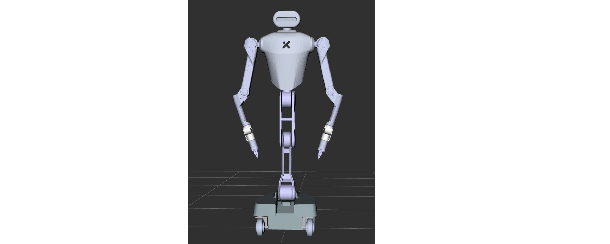

# Software Overview
## Software Dependency

1. [Ubuntu](https://en.wikipedia.org/wiki/Ubuntu) 20.04 LTS
2. ROS Noetic

## Installation

This SDK does not require recompilation, just refer to contents below.

## First Move

### Chassis - Spins in place

```Bash
#Switch SWB to the bottom position and switch SWC to the middle position to enter upper computer chassis control mode.
rostopic pub /cmd_vel geometry_msgs/Twist "linear:
  x: 0.0
  y: 0.0
  z: 0.0
angular:
  x: 0.0
  y: 0.0
  z: 0.1" 
 
  ### Send This Command to make R1 Spin with Controller 
  
  
  ###Two Way to make it stop
  rostopic pub /cmd_vel geometry_msgs/Twist "linear:
  x: 0.0
  y: 0.0
  z: 0.0
angular:
  x: 0.0
  y: 0.0
  z: 0.0" 
  
  ### Change SWB / SWC to quit Upper Computer Control mode of chassis
```

### Torso - Squat & Stand

Controller teleoperation actually is making `/controller` topic message mapping to another topic `/target_torso_speed`by a python script.   (`/controller` topic is sent by chassis control unit to control unit by CAN.) So the torso is actually controlled by `/target_torso_speed`.

* Step 1: Switch SWB and SWC to the other position not at the bottom to quit the Torso Control Mode in the controller,  making `/controller` not published.


* Step 2: Using this command below to move the torso.

```Bash
##############
rostopic pub /target_torso_speed geometry_msgs/Twist "linear:
  x: 0.0
  y: 0.0   
  z: 0.0
angular:
  x: 0.0
  y: 0.1
  z: 0.0"
  
  ###linear.y > 0 means raise the torso 
  ###linear.y < 0 means down the torso
  ###angular.x > 0 means increase the pitch and <0 means decrease the pitch
  ###angular.y > 0 means anti-clockwise the wrist and < 0 means clockwise the wrist
```

* Step 3: Using this command below to stop the torso.

```Bash
##############
rostopic pub /target_torso_speed geometry_msgs/Twist "linear:
  x: 0.0
  y: 0.0   
  z: 0.0
angular:
  x: 0.0
  y: 0.0
  z: 0.0"
  
  ###linear.y > 0 means raise the torso 
  ###linear.y < 0 means down the torso
  ###angular.x > 0 means increase the pitch and <0 means decrease the pitch
  ###angular.y > 0 means anti-clockwise the wrist and < 0 means clockwise the wrist
```

### Arm - Wave & Salute

- Arm control is complex and cannot be managed with just two joysticks. Therefore, we have stored a preset trajectory in the Galaxea R1's Control Unit in the format of rosbag.

- Before operating the Galaxea R1's arms, ensure that the pose is as shown below, particularly for joints 4, 5, and 6 of both arms. Since the arm is frozen when powered on, you can shut it down to manually adjust the arm's pose.

  

- Using the command below, we can make the arm wave first and salute next.

```Bash
rosbag play ~/Downloads/test_wave_salute.bag
```

