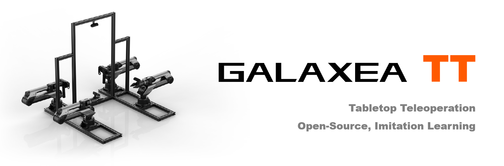
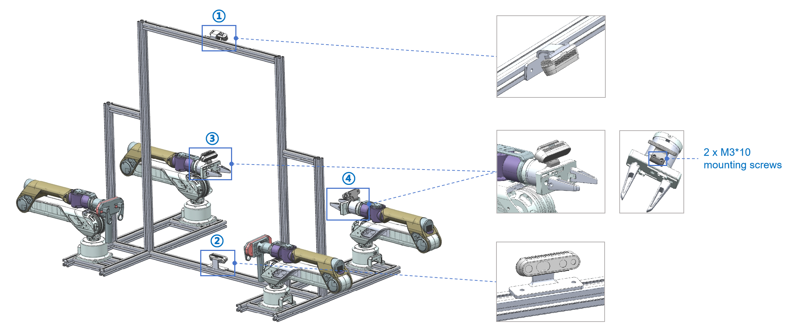

# Tabletop Teleopration

## Technical Specification

<table style="border-collapse: collapse; width: 100%;">
    <thead>
        <tr style="background-color: black; color: white; text-align: left;">
            <th style="vertical-align: middle; padding: 8px; border: 1px solid #ddd; width: 250px;">Item</th>
            <th style="vertical-align: middle; padding: 8px; border: 1px solid #ddd;">Values</th>
        </tr>
    </thead>
    <tbody>
        <tr style="background-color: white; text-align: left;">
            <td style="vertical-align: middle; padding: 8px; border: 1px solid #ddd; width: 250px;">Dimensions</td>
            <td style="vertical-align: middle; padding: 8px; border: 1px solid #ddd;">1770L * 761W * 1051H</td>
        </tr>
        <tr style="background-color: white; text-align: left;">
            <td style="vertical-align: middle; padding: 8px; border: 1px solid #ddd; width: 250px;">Leader Arms</td>
            <td style="vertical-align: middle; padding: 8px; border: 1px solid #ddd;">2 * Galaxea A1 + 2 * Galaxea G1-T</td>
        </tr>
        <tr style="background-color: white; text-align: left;">
            <td style="vertical-align: middle; padding: 8px; border: 1px solid #ddd; width: 250px;">Follower Arms</td>
            <td style="vertical-align: middle; padding: 8px; border: 1px solid #ddd;">2 * Galaxea A1 + 2 * Galaxea G1</td>
        </tr>
        <tr style="background-color: white; text-align: left;">
            <td style="vertical-align: middle; padding: 8px; border: 1px solid #ddd; width: 250px;">Camera</td>
            <td style="vertical-align: middle; padding: 8px; border: 1px solid #ddd;">4 * Intel RealSense D435i</td>
        </tr>
        <tr style="background-color: white; text-align: left;">
            <td style="vertical-align: middle; padding: 8px; border: 1px solid #ddd; width: 250px;">Base</td>
            <td style="vertical-align: middle; padding: 8px; border: 1px solid #ddd;">100 mm x 100 mm</td>
        </tr>
        <tr style="background-color: white; text-align: left;">
            <td style="vertical-align: middle; padding: 8px; border: 1px solid #ddd; width: 250px;">Charging Port</td>
            <td style="vertical-align: middle; padding: 8px; border: 1px solid #ddd;">Rated voltage 48V</td>
        </tr>
        <tr style="background-color: white; text-align: left;">
            <td style="vertical-align: middle; padding: 8px; border: 1px solid #ddd; width: 250px;">USB Port</td>
            <td style="vertical-align: middle; padding: 8px; border: 1px solid #ddd;">USB 2.0</td>
        </tr>
    </tbody>
</table>

## Technical Drawing

### Camera Setting
<u>Important: please use the M3*10 mounting screws to secure the camera holder on the arm.</u>

If you need structural files, please visit our [Tabletop Teleoperation STP repository](https://github.com/userguide-galaxea/STP) to access the resources.