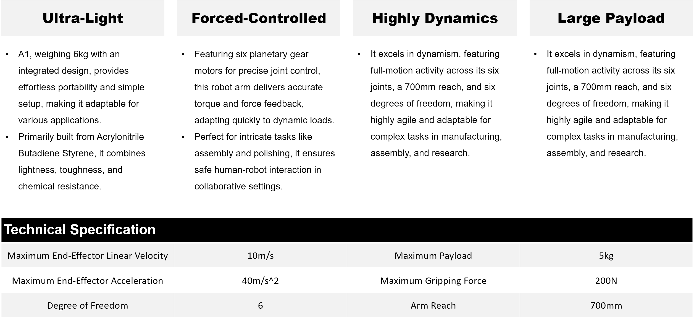

# Galaxea Robot

## Ultra-Light & Highly Dynamic
A1 is an Ultra-Light Force-Controlled robot arm, 
distinguished by its exceptional dynamism and significant high payload capacity. 
This cutting-edge technology makes it an optimal choice for sophisticated applications that require nuanced interactions, 
thanks to its outstanding electrical performance, robust handling capabilities, and versatile jointed structure.

The arm's superior high-speed operation, paired with its precise force control, 
enables unparalleled performance in a multitude of tasks, from delicate assembly operations to demanding research experiments. 
Its articulate design ensures adaptability across a broad range of motions, 
making it a versatile tool for industries seeking automation with finesse.

## Key Features

## Discover More
If you wish to learn more about the hardware and software specifics of A1 robotic arm, 
please refer to the [Galaxea  A1 Guide](../Guide/A1/Getting_Started.md) for detailed information.

The manual will provide you with comprehensive insights into the technical specifications, 
operational guidelines, and system requirements that will help you understand and utilize A1 to its fullest potential.
