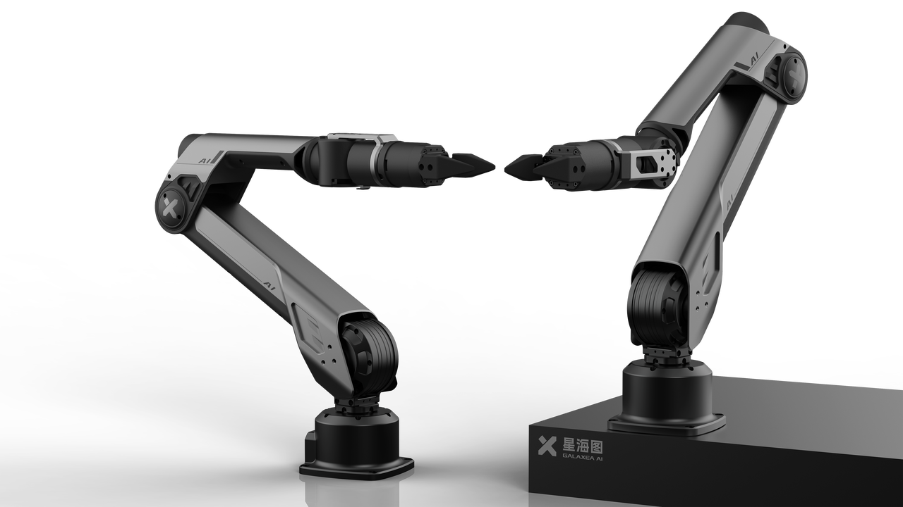

# A1
## Product Infromation

A1 is an ultra-lightweight force-controlled robotic arm featuring high dynamics and large loads. 
It is ideal for body-smart and complex applications due to its excellent electrical performance, 
high load capacity and flexible articulated design. 
Its superior high-speed operation ensures guaranteed excellence in research environments.
### Force-controlled, High Dynamic

<video width="1920" height="540" controls>
  <source src="../../product_images_video/A1/A1_1_compress.mp4" type="video/mp4">
  Your browser does not support the video tag.
</video>

### Large Loads

<video width="1920" height="480" controls>
  <source src="../../product_images_video/A1/A1_2_compress.mp4" type="video/mp4">
  Your browser does not support the video tag.
</video>

## Technical Specification

## Our Solutions
