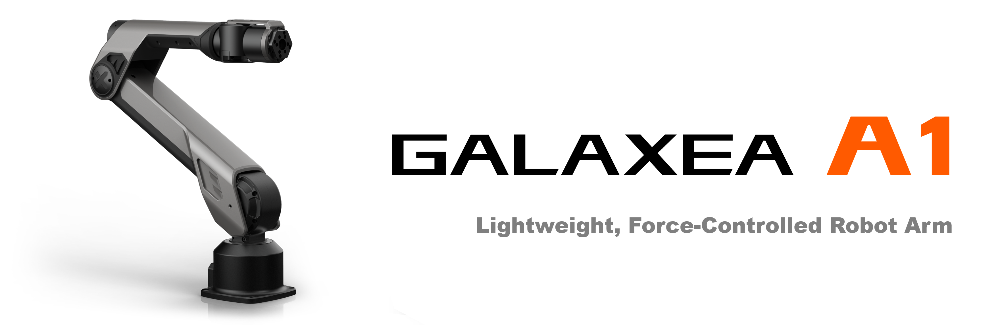

# Galaxea Robot

## Ultra-Light & Highly Dynamic
A1 is an Ultra-Light Force-Controlled robot arm known for its exceptional dynamism and significant high payload capacity. This cutting-edge technology makes it the optimal choice for sophisticated applications that demand nuanced interactions, owing to its outstanding electrical performance, robust handling capabilities, and versatile jointed structure.

It's superior high-speed operation, combined with precise force control, enables unparalleled performance across a variety of tasks, from delicate assembly operations to demanding research experiments. Its articulate design ensures adaptability across a broad range of motions, making it a versatile tool for industries seeking automation with finesse. 

## Key Hardware Features

<table style="width: 100%; border-collapse: collapse;">
    <thead>
        <tr style="background-color: black; color: white;text-align: left;">
            <th colspan="4";th style="width: 30%;">Technical Specification</th>
        </tr>
    </thead>
    <tbody>
        <tr style="background-color: white;">
            <td>Max. End-Effector Linear Velocity</td>
            <td>10 m/s</td>
            <td>Max. Payload</td>
            <td>5 kg</td>
        </tr>
        <tr style="background-color: #f2f2f2;">
            <td>Max. End-Effector Acceleration</td>
            <td>40 m/s²</td>
            <td>Arm Reach</td>
            <td>700 mm</td>
        </tr>
        <tr style="background-color: white;">
            <td>Degree of Freedom</td>
            <td>6</td>
            <td>Max. Gripping Force</td>
            <td>200 N</td>
        </tr>
    </tbody>
</table>

## Advanced Accessories
Discover the superior performance and innovative features of our accessories designed to optimize your A1 robot arm's capabilities.

  

    
     
    <a href="link_to_page1.html">Gripper One</a>
  

  

    
     
    <a href="link_to_page3.html">Dexterous Hand</a>
  

## Ready for AI Development
Use case

## Discover More
If you wish to learn more about the hardware and software specifics of A1 robot arm, please refer to the [Galaxea  A1 Guide](../../Guide/A1/Getting_Started.md) for detailed information.

The manual will provide you with comprehensive insights into the technical specifications, operational guidelines, and system requirements that will help you understand and utilize A1 to its fullest potential.
