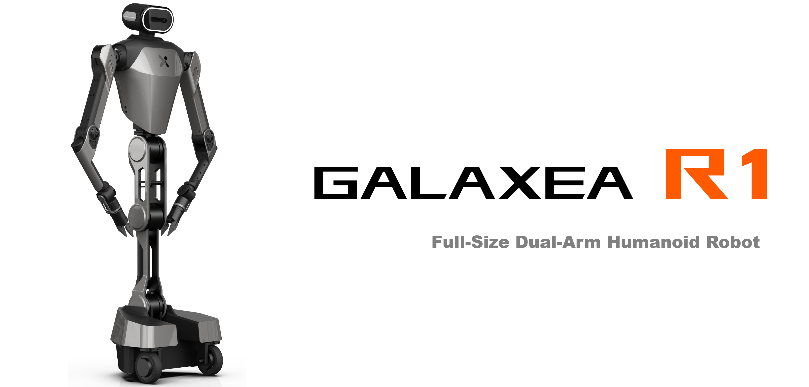
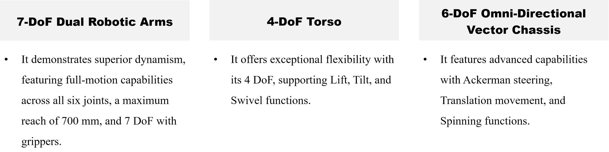

# R1 Robot

## Wide Operating Range & High Flexibility

Galaxea R1 is a full-size humanoid robot with a wide operating range of up to 2 m and an 80 cm operating radius. 
It is fitted with 6-DoF dual lightweight and highly dynamic [Galaxea A1](A1.md) robot arms, 
a 4-DoF torso that supports lift, pitch, and roll, 
and a three-wheel driving and steering Galaxea B1 chassis, 
ensuring exceptional maneuverability and adaptability across diverse operational environments. 

## Key Hardware Features

# Configuration Options

<table style="width: 100%; border-collapse: collapse;">
    <thead>
        <tr style="background-color: black; color: white; text-align: center;">
            <th style="width: 250px;">Feature/Specification</th>
            <th style="width: 400px;">Galaxea R1</th>
            <th style="width: 400px;">Galaxea R1 Pro</th>
        </tr>
    </thead>
    <tbody>
        <tr style="background-color: white;">
            <td style="font-weight: bold;">Operating Range (Height)</td>
            <td>0 ~ 200 cm</td>
            <td>0 ~ 200 cm</td>
        </tr>
        <tr style="background-color: #f2f2f2;">
            <td style="font-weight: bold;">Operating Radius</td>
            <td>80 cm</td>
            <td>80 cm</td>
        </tr>
        <tr style="background-color: white;">
            <td style="font-weight: bold;">Max. Payload</td>
            <td>5 kg</td>
            <td>5 kg</td>
        </tr>
        <tr style="background-color: #f2f2f2;">
            <td style="font-weight: bold;">Degree of Freedom</td>
            <td>6 DOF for chassis 4 DOF for torso 14 DOF for dual arms</td>
            <td>6 DOF for chassis 4 DOF for torso 14 DOF for dual arms</td>
        </tr>
        <tr style="background-color: white;">
            <td style="font-weight: bold;">Torso Functions</td>
            <td>✅ Lift ✅ Tilt ✅ Swivel</td>
            <td>✅ Lift ✅ Tilt ✅ Swivel</td>
        </tr>
        <tr style="background-color: #f2f2f2;">
            <td style="font-weight: bold;">Chassis Functions</td>
            <td>✅ Ackerman ✅ Translation ✅ Spinning</td>
            <td>✅ Ackerman ✅ Translation ✅ Spinning</td>
        </tr>
        <tr style="background-color: white;">
            <td style="font-weight: bold;">Camera</td>
            <td>✅ Head: 1</td>
            <td>✅ Head: 1 ✅ Chassis: 4</td>
        </tr>
        <tr style="background-color: #f2f2f2;">
            <td style="font-weight: bold;">LiDAR</td>
            <td>Optional</td>
            <td>✅</td>
        </tr>
        <tr style="background-color: white;">
            <td style="font-weight: bold;">Obstacle Avoidance</td>
            <td>\</td>
            <td>✅</td>
        </tr>
        <tr style="background-color: #f2f2f2;">
            <td style="font-weight: bold;">Advanced Navigation</td>
            <td>\</td>
            <td>✅</td>
        </tr>
        <tr style="background-color: white;">
            <td style="font-weight: bold;">Computing Unit</td>
            <td>Standard</td>
            <td>Enhanced</td>
        </tr>
        <tr style="background-color: #f2f2f2;">
            <td style="font-weight: bold;">Applicability</td>
            <td>Suitable for applications requiring basic operation and flexibility, offering comprehensive motion control and adaptability.</td>
            <td>Ideal for advanced applications needing higher environmental awareness and visual processing, enhancing the robot’s perception and navigation capabilities.</td>
        </tr>
    </tbody>
</table>

## Ready for AI Development

Use Case

## Discover More

If you wish to learn more about the hardware and software specifics of Galaxea R1, please refer to the [Galaxea  R1 User Guide](../../Guide/R1/GettingStarted_Before.md) for detailed information.

The manual will provide you with comprehensive insights into the technical specifications, operational guidelines, and system requirements that will help you understand and utilize Galaxea R1 to its fullest potential.

