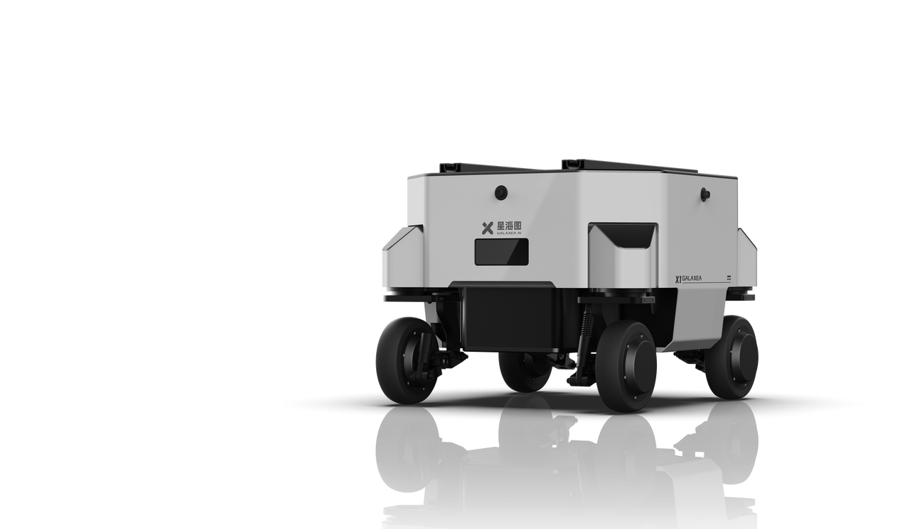

# X1
## Product Infromation

X1 is an omni-directional mobility vector control chassis. 
It is ideal for complex applications with embodied intelligence with its excellent high load capacity and flexible articulated design. 
Its superior high-speed operation ensures guaranteed excellence in research environments.

### Omni-directional moving

<video width="1920" height="1080" controls>
  <source src="../../product_images_video/A1/A1_1_compress.mp4" type="video/mp4">
  Your browser does not support the video tag.
</video>

### Vector-controlled chassis

<video width="1920" height="1080" controls>
  <source src="../../product_images_video/X1/X1_2_compress.mp4" type="video/mp4">
  Your browser does not support the video tag.
</video>

## Technical Specification

## Our Solutions
