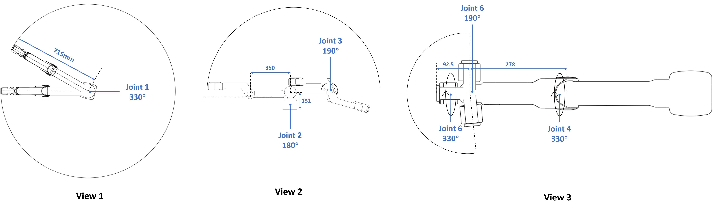
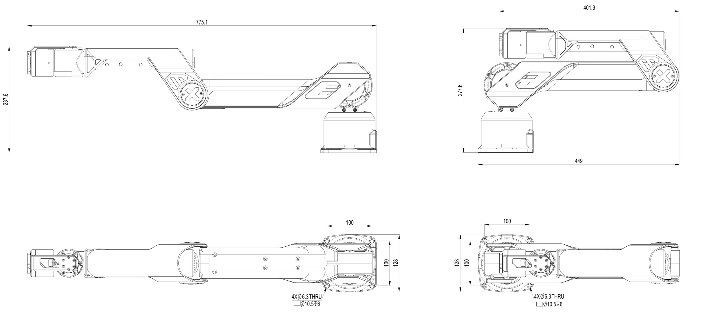
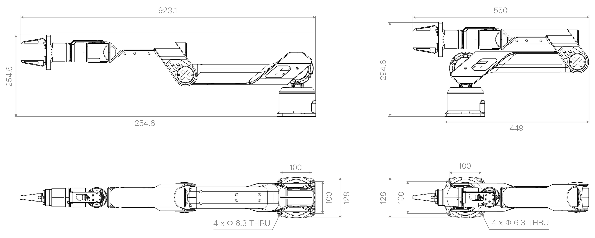
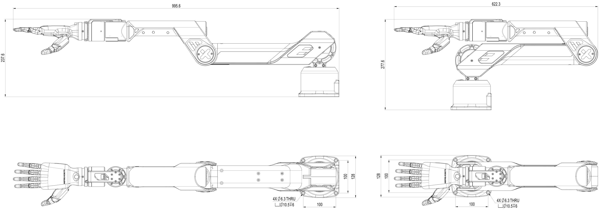

# Galaxea A1 Hardware Guide
>This manual provides engineering data and user guidance for working with Galaxea A1 hardware.

## Technical Specification

<table style="border-collapse: collapse;">
    <thead>
        <tr style="background-color: black; color: white;text-align: left;">
            <th>Parameters</th>
            <th>Value</th>
        </tr>
    </thead>
    <tbody>
        <tr style="background-color: white;text-align: left;">
            <td>Rated Voltage</td>
            <td>48 V</td>
        </tr>
        <tr style="background-color: white;text-align: left;">
            <td>Rated Current</td>
            <td>6 A</td>
        </tr>
        <tr style="background-color: white;text-align: left;">
            <td>Maximum Current</td>
            <td>10 A</td>
        </tr>
        <tr style="background-color: white;text-align: left;">
            <td>Communication Interface</td>
            <td>USB 2.0 Port</td>
        </tr>
    </tbody>
</table>

<table style="border-collapse: collapse;">
    <thead>
        <tr style="background-color: black; color: white;text-align: left;">
            <th>Performance</th>
            <th>Value</th>
        </tr>
    </thead>
    <tbody>
        <tr style="background-color: white;text-align: left;">
            <td>Dimensions</td>
            <td>Deployed: 775L x 128W x 237H   Folded: 449L x 128W x 277H </td>
        </tr>
        <tr style="background-color: white;text-align: left;">
            <td>Weight</td>
            <td>6 kg</td>
        </tr>
        <tr style="background-color: white;text-align: left;">
            <td>Rated Payload</td>
            <td>2 kg</td>
        </tr>
        <tr style="background-color: white;text-align: left;">
            <td>Maximum Payload</td>
            <td>5 kg</td>
        </tr>
        <tr style="background-color: white;text-align: left;">
            <td>Reach</td>
            <td>700 mm</td>
        </tr>
		<tr style="background-color: white;text-align: left;">
            <td>Maximum End-Effector Linear Velocity</td>
            <td>10 m/s</td>
        </tr>
		<tr style="background-color: white;text-align: left;">
            <td>Maximum End-Effector Acceleration</td>
            <td>40 m/s²</td>
        </tr>
		<tr style="background-color: white;text-align: left;">
            <td>Degree of Freedom</td>
            <td>6</td>
        </tr>
		<tr style="background-color: white;text-align: left;">
            <td>Repeatability</td>
            <td>1 mm</td>
    </tbody>
</table>

## Hardware Structure

## Robot Structure 
### Joint
This section details the operating range, rated torque, and peak torque of the six joints, showing the arm's flexibility and strength in various operations.

<table style="border-collapse: collapse;">
    <thead>
        <tr style="background-color: black; color: white;text-align: left;">
            <th>Joint</th>
            <th>Range</th>
	    <th>Rated Torque</th>
        </tr>
    </thead>
    <tbody>
        <tr style="background-color: white;text-align: left;">
            <td>Joint 1</td>
            <td>[-165°, 165°]</td>
			<td>20 Nm</td>
        </tr>
        <tr style="background-color: white;text-align: left;">
            <td>Joint 2</td>
            <td>[0°, 180°]</td>
			<td>20 Nm</td>
        </tr>
        <tr style="background-color: white;text-align: left;">
            <td>Joint 3</td>
            <td>[-190°, 0°]</td>
			<td>9 Nm</td>
        </tr>
        <tr style="background-color: white;text-align: left;">
            <td>Joint 4</td>
            <td>[-165°, 165°]</td>
			<td>3 Nm</td>
        </tr>
		<tr style="background-color: white;text-align: left;">
            <td>Joint 5</td>
            <td>[-95°, 95°]</td>
			<td>3 Nm</td>
        </tr>
		<tr style="background-color: white;text-align: left;">
            <td>Joint 6</td>
            <td>[-105°, 105°]</td>
			<td>3 Nm</td>
        </tr>
    </tbody>
</table>

- **View 1**: Joint 1 has a working radius of 715 mm and a maximum rotation angle of 330 °.
- **View 2**: Joint 2 has a maximum rotation angle of 180 °, and Joint 3 has a maximum rotation angle of 190 °.
- **View 3**: Joints 4 and 6 have a maximum rotation angle of 330 °, and Joint 5 has a maximum rotation angle of 190 °.

### Arm
Galaxea A1's arm is connected by dual rods. Each joint is equipped with a planetary gear motor, enabling independent speed control with high precision and torque, and allowing flexible operation in any direction commanded by the controller. 

The current version's motors lack brakes, so the arm may drop suddenly when power is cut.

<table style="border-collapse: collapse;">
    <thead>
        <tr style="background-color: black; color: white;text-align: left;">
            <th>Item</th>
            <th>Notes</th>
        </tr>
    </thead>
    <tbody>
        <tr style="background-color: white;text-align: left;">
            <td>Length</td>
            <td>Deployed 775 mm   Folded 449 mm </td>
        </tr>
        <tr style="background-color: white;text-align: left;">
            <td>Height</td>
            <td>Deployed 237 mm   Folded 277 mm </td>
        </tr>
        <tr style="background-color: white;text-align: left;">
            <td>Width</td>
            <td>128 mm</td>
        </tr>
    </tbody>
</table>

### Base
Galaxea A1's base has two ports on the back for communication and charging.

    

<table style="border-collapse: collapse;">
    <thead>
        <tr style="background-color: black; color: white;text-align: left;">
            <th>Item</th>
            <th>Notes</th>
        </tr>
    </thead>
    <tbody>
        <tr style="background-color: white;text-align: left;">
            <td>Power Port</td>
            <td>Rated voltage 48 V</td>
        </tr>
        <tr style="background-color: white;text-align: left;">
            <td>USB Port</td>
            <td>USB 2.0</td>
        </tr>
        <tr style="background-color: white;text-align: left;">
            <td>Mounting Holes</td>
            <td>Four M6 threads with a diameter of 6.3 mm</td>
        </tr>
        <tr style="background-color: white;text-align: left;">
            <td>Size</td>
            <td>100 mm x 100 mm</td>
        </tr>
		<tr style="background-color: white;text-align: left;">
            <td>Maximum End-Effector Linear Velocity</td>
            <td>10 m/s</td>
        </tr>
    </tbody>
</table>  

### End-Effector
#### Galaxea G1 Gripper
[Galaxea G1](../../Introducing_Galaxea_Robot/product_info/A1_accessory_G1.md) is a self-developed parallel gripper with a joint motor and two-finger fixture.

Note: The A1 robotic arm does not include the gripper. If needed, please contact us to purchase.

<table style="border-collapse: collapse;">
    <thead>
        <tr style="background-color: black; color: white;text-align: left;">
            <th>Feature</th>
            <th>Value</th>
        </tr>
    </thead>
    <tbody>
        <tr style="background-color: white;text-align: left;">
            <td>Length</td>
            <td>145 mm</td>
        </tr>
        <tr style="background-color: white;text-align: left;">
            <td>Length of Fingers</td>
            <td>78 mm </td>
        </tr>
        <tr style="background-color: white;text-align: left;">
            <td>Diameter of Motor</td>
            <td>57 mm</td>
        </tr>
        <tr style="background-color: white;text-align: left;">
            <td>Gripper Operating Range</td>
            <td>0 ~ 100 mm</td>
        </tr>
		<tr style="background-color: white;text-align: left;">
            <td>Gripper Operating Range</td>
            <td>100 N</td>
        </tr>
    </tbody>
</table>

Equipped with the end-effector, Galaxea G1, should have:

#### Attaching
Here it shows how to attach gripper to Galaxea A1. To remove them, simply reverse these steps.

1. **Alignment Check**: Ensure the three mounting holes around the gripper align with the three at the arm's end.
2. **Screw Fixation**: Once aligned, use the provided three screws to fix and tighten the gripper to the arm's end.
3. **Final Check**: After tightening, check if the gripper is aligned and firmly attached.

### [Inspire-Robots RH56 Series Dexterous Hand](https://en.inspire-robots.com/product-category/the-dexterous-hands)
The dextrous hand has a certain grip force and moderate speed, suitable for grasping and manipulating tasks in robotic or prosthetic applications. It combines strength and control to handle various objects effectively, enhancing the ability of robots or prosthetics to perform complex tasks.

Note: The A1 robotic arm does not include the dextrous hand. If needed, please contact us to purchase.

<table style="border-collapse: collapse;">
    <thead>
        <tr style="background-color: black; color: white;text-align: left;">
            <th>Feature</th>
            <th>Value</th>
        </tr>
    </thead>
    <tbody>
        <tr style="background-color: white;text-align: left;">
            <td>Degrees of Freedom</td>
            <td>6</td>
        </tr>
        <tr style="background-color: white;text-align: left;">
            <td>Number of Joints</td>
            <td>12</td>
        </tr>
        <tr style="background-color: white;text-align: left;">
            <td>Weight</td>
            <td>540 g</td>
        </tr>
        <tr style="background-color: white;text-align: left;">
            <td>Repeatability</td>
            <td>±0.20 mm</td>
        </tr>
		<tr style="background-color: white;text-align: left;">
            <td>Max. Finger Grip Force</td>
            <td>10 N</td>
        </tr>
    </tbody>
</table>

#### Installing the Dextrous Hand

1. **Alignment Check**: Use a custom adapter flange to align the four mounting holes around the dextrous hand and the flange, as well as the three mounting holes around the arm's end and the flange.
2. **Screw Fixation**: Once aligned, use the provided screws to fix the dextrous hand, flange, and arm's end together.
3. **Final Check**: After tightening, check if the dextrous hand is aligned and firmly attached.

## Next Step
This concludes the hardware introduction of Galaxea A1. We recommend exploring the [Galaxea A1 Software Guide](./Software_Guide.md) for more detailed information.