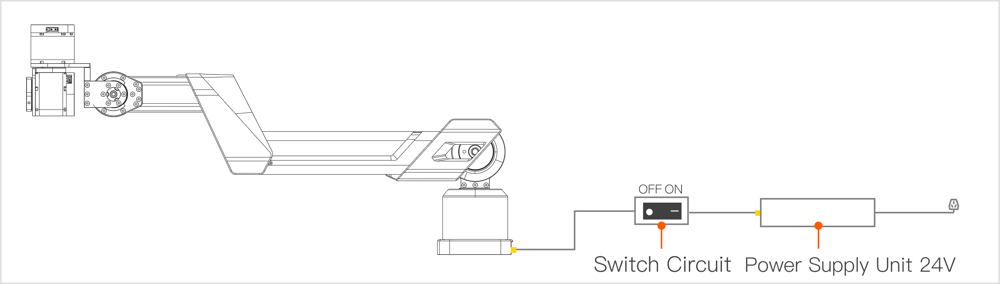

# A1XY Getting Started
> Welcome to the Galaxea developer family as a Galaxea A1XY user! This document will help you explore A1XY's unique features and performance, master operation skills quickly, and start an intelligent robotic arm application journey.

## Product Introduction
Galaxea A1XY is an advanced robotic arm that combines high precision and intelligence. It is designed for diverse industrial and innovative applications. It offers flexible operation, strong load capacity, and high programming compatibility, supporting tasks like precision assembly in production lines, automated operations in labs, and innovation in education.

## Safety Guidelines
Before using Galaxea A1XY, review these safety notes to ensure safety and proper operation.
Operational Safety
- Personnel must be trained to understand the operation, safety rules, and emergency response.
- Provide a proper workspace free of hazards like flammables and strong magnetic fields. Keep the area clean and dry.
- Follow the manual's steps and avoid improper actions during operation.

## Device Safety
- Use the required power adapter and maintain a stable 48V power supply. Regularly inspect power connections.
- Know the emergency stop button's location for immediate use in case of an emergency.

## Power On

Connect the two ends of the switch circuit to the power port on the robot arm base and the power adapter, and plug the power adapter into the power source.  
Turn on the switch button.

## Power Off
Turn off the switch button on the circuit switch.  

Note: A1XY does not have brakes on its joint motors. Powering off the circuit may cause the robot arm to drop suddenly. Ensure the surrounding environment is safe during operation to prevent accidental injury or equipment damage. 

## Getting Help
For any issues during use, contact us at support@galaxea.ai. Our technical team will assist you promptly.
