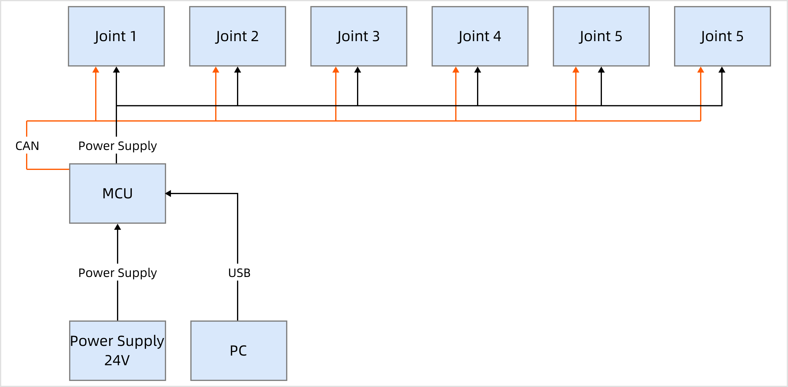
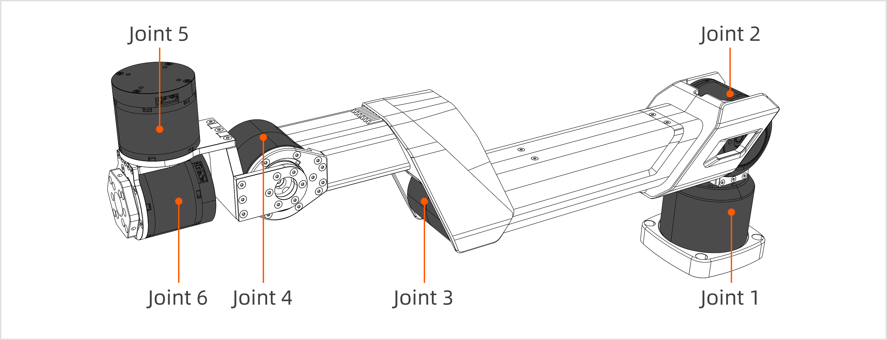
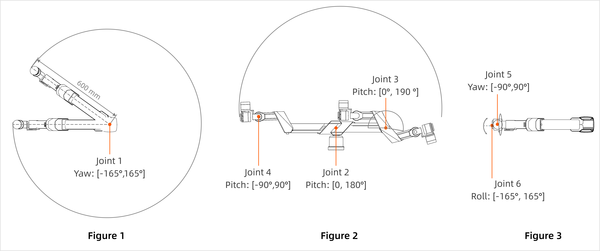
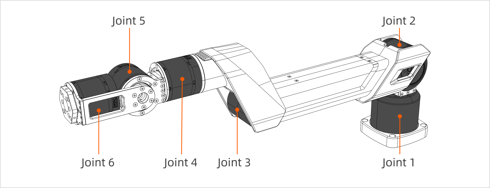
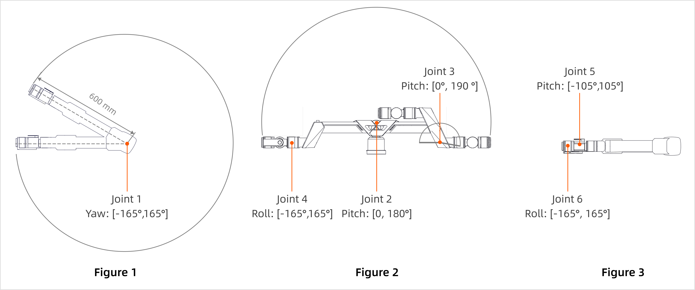
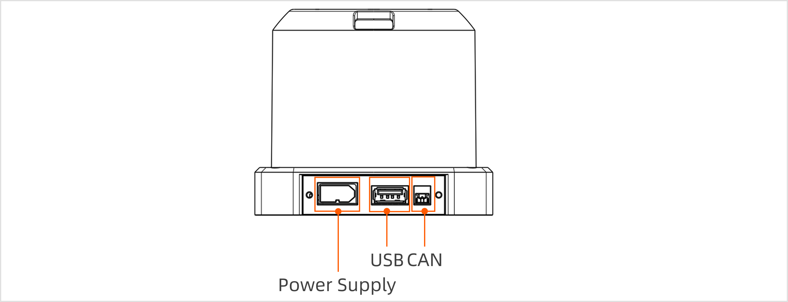
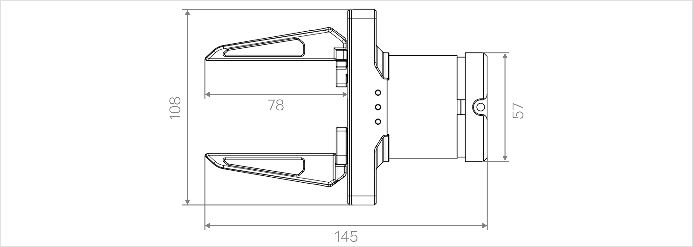
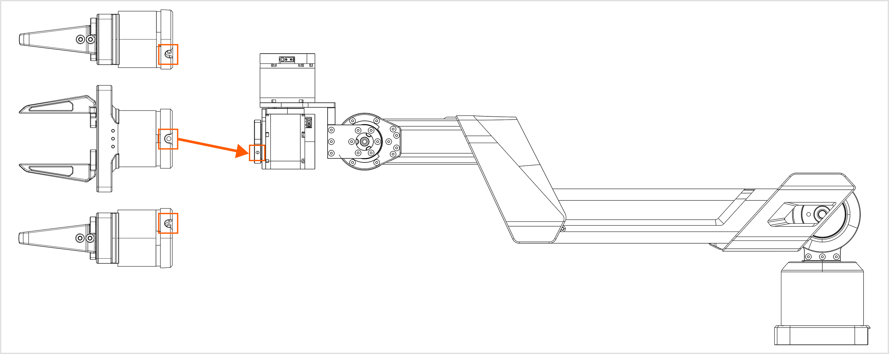
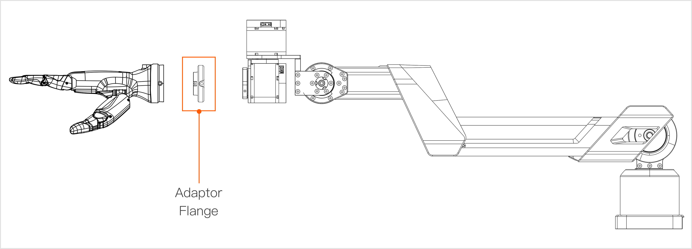

# A1XY Hardware Introduction
> This user guide will thoroughly explain the hardware data of the Galaxea A1XY.

## Safety Guidelines
- Personnel must be trained to understand the operation, safety rules, and emergency response.
- Provide a proper workspace free of hazards like flammables and strong magnetic fields. Keep the area clean and dry.
- Follow the manual's steps and avoid improper actions during operation.

## Technical Specifications

<table style="width: 100%; border-collapse: collapse;">
    <thead>
        <tr style="background-color: black; color: white; text-align: left;">
            <th style="width: 300px; padding: 8px; border: 1px solid #ddd;">Mechanical</th>
            <th style="width: 400px; padding: 8px; border: 1px solid #ddd;">A1X Values</th>
            <th style="width: 400px; padding: 8px; border: 1px solid #ddd;">A1Y Values</th>
        </tr>
    </thead>
    <tbody>
        <tr style="background-color: white; text-align: left;">
            <td style="padding: 8px; border: 1px solid #ddd;">Rated Voltage</td>
            <td style="padding: 8px; border: 1px solid #ddd;">24V</td>
            <td style="padding: 8px; border: 1px solid #ddd;">24V</td>
        </tr>
        <tr style="background-color: white; text-align: left;">
            <td style="padding: 8px; border: 1px solid #ddd;">Rated Current</td>
            <td style="padding: 8px; border: 1px solid #ddd;">5A</td>
            <td style="padding: 8px; border: 1px solid #ddd;">5A</td>
        </tr>        
        <tr style="background-color: white; text-align: left;">
            <td style="padding: 8px; border: 1px solid #ddd;">Maximum Current</td>
            <td style="padding: 8px; border: 1px solid #ddd;">8A</td>
            <td style="padding: 8px; border: 1px solid #ddd;">8A</td>
        </tr>        
        <tr style="background-color: white; text-align: left;">
            <td style="padding: 8px; border: 1px solid #ddd;">Communication Interface</td>
            <td style="padding: 8px; border: 1px solid #ddd;">USB2.0,CAN</td>
            <td style="padding: 8px; border: 1px solid #ddd;">USB2.0,CAN</td>
        </tr>          
    </tbody>
</table>

<table style="width: 100%; border-collapse: collapse;">
    <thead>
        <tr style="background-color: black; color: white; text-align: left;">
            <th style="width: 300px; padding: 8px; border: 1px solid #ddd;">Performance </th>
            <th style="width: 400px; padding: 8px; border: 1px solid #ddd;">A1X Values</th>
            <th style="width: 400px; padding: 8px; border: 1px solid #ddd;">A1Y Values</th>
        </tr>
    </thead>
    <tbody>
        <tr style="background-color: white; text-align: left;">
            <td style="padding: 8px; border: 1px solid #ddd;">Degree of Freedom</td>
            <td style="padding: 8px; border: 1px solid #ddd;">6</td>
            <td style="padding: 8px; border: 1px solid #ddd;">6</td>
        </tr>
        <tr style="background-color: white; text-align: left;">
            <td style="padding: 8px; border: 1px solid #ddd;">Dimensions</td>
            <td style="padding: 8px; border: 1px solid #ddd;">600L x 100W x 305H mm</td>
            <td style="padding: 8px; border: 1px solid #ddd;">600L x 100W x 240H mm</td>
        </tr>
        <tr style="background-color: white; text-align: left;">
            <td style="padding: 8px; border: 1px solid #ddd;">Weight</td>
            <td style="padding: 8px; border: 1px solid #ddd;">4.2 kg</td>
            <td style="padding: 8px; border: 1px solid #ddd;">4.2 kg</td>
        </tr>
        <tr style="background-color: white; text-align: left;">
            <td style="padding: 8px; border: 1px solid #ddd;">Rated Payload</td>
            <td style="padding: 8px; border: 1px solid #ddd;">3kg@0.6m</td>
            <td style="padding: 8px; border: 1px solid #ddd;">3kg@0.6m</td>
        </tr>
        <tr style="background-color: white; text-align: left;">
            <td style="padding: 8px; border: 1px solid #ddd;">Maximum Payload</td>
            <td style="padding: 8px; border: 1px solid #ddd;">5kg@0.6m</td>
            <td style="padding: 8px; border: 1px solid #ddd;">5kg@0.6m</td>
        </tr>
        <tr style="background-color: white; text-align: left;">
            <td style="padding: 8px; border: 1px solid #ddd;">Arm Reach </td>
            <td style="padding: 8px; border: 1px solid #ddd;">600 mm</td>
            <td style="padding: 8px; border: 1px solid #ddd;">600 mm</td>
        </tr>        
        <tr style="background-color: white; text-align: left;">
            <td style="padding: 8px; border: 1px solid #ddd;">Maximum End Linear Velocity</td>
            <td style="padding: 8px; border: 1px solid #ddd;">5 m/s</td>
            <td style="padding: 8px; border: 1px solid #ddd;">5 m/s</td>
        </tr>        
        <tr style="background-color: white; text-align: left;">
            <td style="padding: 8px; border: 1px solid #ddd;">Maximum End Acceleration</td>
            <td style="padding: 8px; border: 1px solid #ddd;">38 m/s²</td>
            <td style="padding: 8px; border: 1px solid #ddd;">38 m/s²</td>
        </tr>     
        <tr style="background-color: white; text-align: left;">
            <td style="padding: 8px; border: 1px solid #ddd;">Repeatability</td>
            <td style="padding: 8px; border: 1px solid #ddd;">±0.05 mm</td>
            <td style="padding: 8px; border: 1px solid #ddd;">±0.05 mm</td>
        </tr>   
    </tbody>
</table>

## Hardware Structure

## Robot Structure

### Joint

#### A1X
The A1X robot arm has 6 joints with a maximum rotation angle of 330 degrees.

<table style="width: 100%; border-collapse: collapse;">
    <thead>
        <tr style="background-color: black; color: white; text-align: left;">
            <th style="width: 300px; padding: 8px; border: 1px solid #ddd;">Joint </th>
            <th style="width: 400px; padding: 8px; border: 1px solid #ddd;">Rated Torque (Nm)</th>
            <th style="width: 400px; padding: 8px; border: 1px solid #ddd;">Peak Torque (Nm)</th>
            <th style="width: 400px; padding: 8px; border: 1px solid #ddd;">Rated Speed (rpm)</th>
            <th style="width: 400px; padding: 8px; border: 1px solid #ddd;">Peek Speed (rpm)</th>
            <th style="width: 400px; padding: 8px; border: 1px solid #ddd;">Gear Ratio</th>
            <th style="width: 400px; padding: 8px; border: 1px solid #ddd;">Working Range</th>            
        </tr>
    </thead>
    <tbody>
        <tr style="background-color: white; text-align: left;">
            <td style="padding: 8px; border: 1px solid #ddd;">Joint 1</td>
            <td style="padding: 8px; border: 1px solid #ddd;">9</td>
            <td style="padding: 8px; border: 1px solid #ddd;">27</td>
            <td style="padding: 8px; border: 1px solid #ddd;">36</td>
            <td style="padding: 8px; border: 1px solid #ddd;">100</td>
            <td style="padding: 8px; border: 1px solid #ddd;">40</td>
            <td style="padding: 8px; border: 1px solid #ddd;">[-165°,165°]</td>            
        </tr>
        <tr style="background-color: white; text-align: left;">
            <td style="padding: 8px; border: 1px solid #ddd;">Joint 2</td>
            <td style="padding: 8px; border: 1px solid #ddd;">20</td>
            <td style="padding: 8px; border: 1px solid #ddd;">50</td>
            <td style="padding: 8px; border: 1px solid #ddd;">40</td>
            <td style="padding: 8px; border: 1px solid #ddd;">120</td>
            <td style="padding: 8px; border: 1px solid #ddd;">39</td>
            <td style="padding: 8px; border: 1px solid #ddd;">[0, 180°]</td>            
        </tr>
        <tr style="background-color: white; text-align: left;">
            <td style="padding: 8px; border: 1px solid #ddd;">Joint 3</td>
            <td style="padding: 8px; border: 1px solid #ddd;">9</td>
            <td style="padding: 8px; border: 1px solid #ddd;">27</td>
            <td style="padding: 8px; border: 1px solid #ddd;">36</td>
            <td style="padding: 8px; border: 1px solid #ddd;">100</td>
            <td style="padding: 8px; border: 1px solid #ddd;">40</td>
            <td style="padding: 8px; border: 1px solid #ddd;">[-190°,0°]</td>            
        </tr>
        <tr style="background-color: white; text-align: left;">
            <td style="padding: 8px; border: 1px solid #ddd;">Joint 4</td>
            <td style="padding: 8px; border: 1px solid #ddd;">5</td>
            <td style="padding: 8px; border: 1px solid #ddd;">12</td>
            <td style="padding: 8px; border: 1px solid #ddd;">260</td>
            <td style="padding: 8px; border: 1px solid #ddd;">315</td>
            <td style="padding: 8px; border: 1px solid #ddd;">10</td>
            <td style="padding: 8px; border: 1px solid #ddd;">[-90°,90°]</td>            
        </tr>
        <tr style="background-color: white; text-align: left;">
            <td style="padding: 8px; border: 1px solid #ddd;">Joint 5</td>
            <td style="padding: 8px; border: 1px solid #ddd;">5</td>
            <td style="padding: 8px; border: 1px solid #ddd;">12</td>
            <td style="padding: 8px; border: 1px solid #ddd;">260</td>
            <td style="padding: 8px; border: 1px solid #ddd;">315</td>
            <td style="padding: 8px; border: 1px solid #ddd;">10</td>
            <td style="padding: 8px; border: 1px solid #ddd;">[-90°,90°]</td>            
        </tr>
        <tr style="background-color: white; text-align: left;">
            <td style="padding: 8px; border: 1px solid #ddd;">Joint 6</td>
            <td style="padding: 8px; border: 1px solid #ddd;">5</td>
            <td style="padding: 8px; border: 1px solid #ddd;">12</td>
            <td style="padding: 8px; border: 1px solid #ddd;">260</td>
            <td style="padding: 8px; border: 1px solid #ddd;">315</td>
            <td style="padding: 8px; border: 1px solid #ddd;">10</td>
            <td style="padding: 8px; border: 1px solid #ddd;">[-165°, 165°]</td>            
        </tr>
    </tbody>
</table>

**Note:** The robot arm's joints will have a 2° position limit protection within their operational range.

The working range of each joint of the robot arm is shown in the figure below:

- Figure 1: The maximum rotation angle of Joint 1 of the robot arm in the Yaw direction is 330 degrees, with a rotation radius of 600 mm.
- Figure 2: The maximum rotation angle of Joint 2 and Joint 3 of the robot arm in the Pitch direction is 180 degrees and 190 degrees, respectively; the maximum rotation angle of Joint 4 in the Pitch direction is 180 degrees.
- Figure 3: The maximum rotation angle of Joint 5 of the robot arm in the Yaw direction is 180 degrees; the maximum rotation angle of Joint 6 in the Roll direction is 330 degrees.

#### A1 Y
The A1Y robot arm has 6 joints with a maximum rotation angle of 330 degrees.

Joints 4 and 5 of the A1Y robot arm differ from those of the A1X. Specific parameters are as follows:

<table style="width: 100%; border-collapse: collapse;">
    <thead>
        <tr style="background-color: black; color: white; text-align: left;">
            <th style="width: 300px; padding: 8px; border: 1px solid #ddd;">Joint </th>
            <th style="width: 400px; padding: 8px; border: 1px solid #ddd;">Rated Torque (Nm)</th>
            <th style="width: 400px; padding: 8px; border: 1px solid #ddd;">Peak Torque (Nm)</th>
            <th style="width: 400px; padding: 8px; border: 1px solid #ddd;">Rated Speed (rpm)</th>
            <th style="width: 400px; padding: 8px; border: 1px solid #ddd;">Peek Speed (rpm)</th>
            <th style="width: 400px; padding: 8px; border: 1px solid #ddd;">Gear Ratio</th>
            <th style="width: 400px; padding: 8px; border: 1px solid #ddd;">Working Range</th>            
        </tr>
    </thead>
    <tbody>
        <tr style="background-color: white; text-align: left;">
            <td style="padding: 8px; border: 1px solid #ddd;">Joint 1</td>
            <td style="padding: 8px; border: 1px solid #ddd;">9</td>
            <td style="padding: 8px; border: 1px solid #ddd;">27</td>
            <td style="padding: 8px; border: 1px solid #ddd;">36</td>
            <td style="padding: 8px; border: 1px solid #ddd;">100</td>
            <td style="padding: 8px; border: 1px solid #ddd;">40</td>
            <td style="padding: 8px; border: 1px solid #ddd;">[-165°,165°]</td>            
        </tr>
        <tr style="background-color: white; text-align: left;">
            <td style="padding: 8px; border: 1px solid #ddd;">Joint 2</td>
            <td style="padding: 8px; border: 1px solid #ddd;">20</td>
            <td style="padding: 8px; border: 1px solid #ddd;">50</td>
            <td style="padding: 8px; border: 1px solid #ddd;">40</td>
            <td style="padding: 8px; border: 1px solid #ddd;">120</td>
            <td style="padding: 8px; border: 1px solid #ddd;">39</td>
            <td style="padding: 8px; border: 1px solid #ddd;">[0, 180°]</td>            
        </tr>
        <tr style="background-color: white; text-align: left;">
            <td style="padding: 8px; border: 1px solid #ddd;">Joint 3</td>
            <td style="padding: 8px; border: 1px solid #ddd;">9</td>
            <td style="padding: 8px; border: 1px solid #ddd;">27</td>
            <td style="padding: 8px; border: 1px solid #ddd;">36</td>
            <td style="padding: 8px; border: 1px solid #ddd;">100</td>
            <td style="padding: 8px; border: 1px solid #ddd;">40</td>
            <td style="padding: 8px; border: 1px solid #ddd;">[-190°,0°]</td>            
        </tr>
        <tr style="background-color: white; text-align: left;">
            <td style="padding: 8px; border: 1px solid #ddd;">Joint 4</td>
            <td style="padding: 8px; border: 1px solid #ddd;">5</td>
            <td style="padding: 8px; border: 1px solid #ddd;">12</td>
            <td style="padding: 8px; border: 1px solid #ddd;">260</td>
            <td style="padding: 8px; border: 1px solid #ddd;">315</td>
            <td style="padding: 8px; border: 1px solid #ddd;">10</td>
            <td style="padding: 8px; border: 1px solid #ddd;">[-165°,165°]</td>            
        </tr>
        <tr style="background-color: white; text-align: left;">
            <td style="padding: 8px; border: 1px solid #ddd;">Joint 5</td>
            <td style="padding: 8px; border: 1px solid #ddd;">5</td>
            <td style="padding: 8px; border: 1px solid #ddd;">12</td>
            <td style="padding: 8px; border: 1px solid #ddd;">260</td>
            <td style="padding: 8px; border: 1px solid #ddd;">315</td>
            <td style="padding: 8px; border: 1px solid #ddd;">10</td>
            <td style="padding: 8px; border: 1px solid #ddd;">[-105°,105°]</td>            
        </tr>
        <tr style="background-color: white; text-align: left;">
            <td style="padding: 8px; border: 1px solid #ddd;">Joint 6</td>
            <td style="padding: 8px; border: 1px solid #ddd;">5</td>
            <td style="padding: 8px; border: 1px solid #ddd;">12</td>
            <td style="padding: 8px; border: 1px solid #ddd;">260</td>
            <td style="padding: 8px; border: 1px solid #ddd;">315</td>
            <td style="padding: 8px; border: 1px solid #ddd;">10</td>
            <td style="padding: 8px; border: 1px solid #ddd;">[-165°, 165°]</td>            
        </tr>
    </tbody>
</table>

The working range of each joint of the robot arm is shown in the figure below:

- Figure 1: The maximum rotation angle of Joint 1 of the robot arm in the Yaw direction is 330 degrees, with a rotation radius of 600 mm.
- Figure 2: The maximum rotation angles of Joint 2 and Joint 3 of the robot arm in the Pitch direction are 180 degrees and 190 degrees, respectively; the maximum rotation angle of Joint 4 in the Roll direction is 330 degrees.
- Figure 3: The maximum rotation angle of Joint 5 of the robot arm in the Pitch direction is 210 degrees; the maximum rotation angle of Joint 6 in the Roll direction is 330 degrees.

### Base

<table style="width: 100%; border-collapse: collapse;">
    <thead>
        <tr style="background-color: black; color: white; text-align: left;">
            <th style="width: 300px; padding: 8px; border: 1px solid #ddd;">Base</th>
            <th style="width: 400px; padding: 8px; border: 1px solid #ddd;">Notes</th>
        </tr>
    </thead>
    <tbody>
        <tr style="background-color: white; text-align: left;">
            <td style="padding: 8px; border: 1px solid #ddd;">Dimension</td>
            <td style="padding: 8px; border: 1px solid #ddd;">75L x 75W mm</td>
        </tr>
            <tr style="background-color: white; text-align: left;">
            <td style="padding: 8px; border: 1px solid #ddd;">Power Supply</td>
            <td style="padding: 8px; border: 1px solid #ddd;">Rate voltage: 24 V</td>
        </tr>
        <tr style="background-color: white; text-align: left;">
            <td style="padding: 8px; border: 1px solid #ddd;">Communication </td>
            <td style="padding: 8px; border: 1px solid #ddd;">USB 2.0、CAN</td>
        </tr>
        <tr style="background-color: white; text-align: left;">
            <td style="padding: 8px; border: 1px solid #ddd;">Mounting Holes</td>
            <td style="padding: 8px; border: 1px solid #ddd;">Four M6 threads with a diameter of 6.3 mm</td>
        </tr>                 
    </tbody>
</table>

### End-Effector

#### Galaxea G1 Gripper

Galaxea G1 is a self-developed parallel gripper with a joint motor and two-finger fixture.

**Note: The A1XY robot arm does not include the gripper. If needed, please contact us to purchase.**

<table style="width: 100%; border-collapse: collapse;">
    <thead>
        <tr style="background-color: black; color: white; text-align: left;">
            <th style="width: 300px; padding: 8px; border: 1px solid #ddd;">Gripper</th>
            <th style="width: 400px; padding: 8px; border: 1px solid #ddd;">Value</th>
        </tr>
    </thead>
    <tbody>
        <tr style="background-color: white; text-align: left;">
            <td style="padding: 8px; border: 1px solid #ddd;">Length</td>
            <td style="padding: 8px; border: 1px solid #ddd;">145 mm</td>
        </tr>
            <tr style="background-color: white; text-align: left;">
            <td style="padding: 8px; border: 1px solid #ddd;">Length of Fingers</td>
            <td style="padding: 8px; border: 1px solid #ddd;">78 mm</td>
        </tr>
        <tr style="background-color: white; text-align: left;">
            <td style="padding: 8px; border: 1px solid #ddd;">Diameter of Motor</td>
            <td style="padding: 8px; border: 1px solid #ddd;">57 mm</td>
        </tr>
        <tr style="background-color: white; text-align: left;">
            <td style="padding: 8px; border: 1px solid #ddd;">Gripper Operating Range</td>
            <td style="padding: 8px; border: 1px solid #ddd;">0 ~ 100 mm</td>
        </tr>    
        <tr style="background-color: white; text-align: left;">
            <td style="padding: 8px; border: 1px solid #ddd;">Gripper Rated Force</td>
            <td style="padding: 8px; border: 1px solid #ddd;">100 N</td>
        </tr>                 
    </tbody>
</table>

#### Installing the Gripper

Follow these steps to install the gripper on the arm's end (reverse the steps to remove the gripper).

1. **Alignment Check:** Ensure the three mounting holes around the gripper align with the three at the arm's end.
2. **Screw Fixation:** Once aligned, use the provided three screws to fix and tighten the gripper to the arm's end.
3. **Final Check:** After tightening, check if the gripper is aligned and firmly attached.
4. **Wiring Connection:** Connect the CAN harness located on the outer side of Joint 6 (J6) at the robot arm's end-effector to the communication port of the gripper.

#### Install Other End-effectors

Follow these steps to install other end effectors to the end of the robot arm (reverse steps to remove them), here taking the dexterous hand as an example:

1. **Alignment Check:** Use a custom adapter flange to align the 4 mounting holes around the dexterous hand and the 3 mounting holes around the flange with the 3 mounting holes at the end of the robot arm. (Note: The robot arm's joints will have a 2° position limit protection within their operational range.)
2. **Screw Fixing:** After alignment, use the provided screws to secure the dexterous hand, flange, and end of the robot arm together.
3. **Firmness Check:** After tightening the screws, check again if the dexterous hand is aligned and securely installed.
4. **Wiring Connection:** Connect the CAN harness located on the outer side of Joint 6 (J6) at the robot arm's end-effector to the communication port of the gripper.