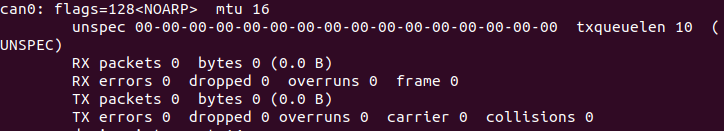

# A1XY Startup and Demo Guide
## 1. Preparation Before Start
### 1.1 Hardware Preparation

<table style="width: 100%; border-collapse: collapse;">
    <thead>
        <tr style="background-color: black; color: white; text-align: left;">
            <th style="width: 200px; padding: 8px; border: 1px solid #ddd;">Item</th>
            <th style="width: 200px; padding: 8px; border: 1px solid #ddd;">Quantity</th>
            <th style="width: 500px; padding: 8px; border: 1px solid #ddd;">Notes</th>
        </tr>
    </thead>
    <tbody>
        <tr style="background-color: white; text-align: left;">
            <td style="padding: 8px; border: 1px solid #ddd;">A1XY Arm</td>
            <td style="padding: 8px; border: 1px solid #ddd;">1</td>
            <td style="padding: 8px; border: 1px solid #ddd;">-</td>
        </tr>
        <tr style="background-color: white; text-align: left;">
            <td style="padding: 8px; border: 1px solid #ddd;">A1XY Host Computer</td>
            <td style="padding: 8px; border: 1px solid #ddd;">1</td>
            <td style="padding: 8px; border: 1px solid #ddd;">OS Dependency: Ubuntu 20.04 LTS<br>Middleware Dependency: ROS Noetic</td>
        </tr>
    </tbody>
</table>
**Note: Ensure that the robot arm assembly and wiring connections are completed according to the A1XY unpacking and installation guide before proceeding to start the robot arm control as described below.**

### 1.2 Software Preparation
#### 1.2.1 Download the SDK

- Baidu Cloud：[https://pan.baidu.com/s/1jVEqjL-r_Ll7bKFB1XxKIw?pwd=a1xy](https://pan.baidu.com/s/1jVEqjL-r_Ll7bKFB1XxKIw?pwd=a1xy)
- Google Drive：[https://drive.google.com/drive/folders/180qSZTc7bZgwklVuwcuhq5O2DPteI2nR?usp=sharing](https://drive.google.com/drive/folders/180qSZTc7bZgwklVuwcuhq5O2DPteI2nR?usp=sharing)

This is the initial software version. For future updates, refer to the A1XY Software Version Changelog to obtain the latest SDK package and update information.

#### 1.2.2 Install the SDK

Note: The SDK file supports only the X86 architecture.

1. Use the following command to check if the connection is established:
  ```Bash
  ifconfig can0
  ```
  

2. Execute the following commands to install the SDK:
  ```Bash
  tar -xf ${your_download_path}/A1_XY.tar.gz -C ~/
  ```

## 2. Start SDK
### 2.1 Start the CAN Driver

Throughout the control process of the A1XY, you will need to open multiple terminals. We recommend using **TMUX**. Common commands include:

- Create a new terminal: Press `Ctrl + B` then `C`. 
- Switch terminals: Press `Ctrl + B` then press number which indicates the number of terminal windows. 

Now, you can start CAN driver in the following steps.

1. Start TMUX.
  ```Python
  tmux
  ```

2. Start FDCAN Communication
  ```Python
  ./can.bash    

  # or:
  sudo ip link set dev can0 type can bitrate 1000000 dbitrate 5000000 fd on
  sudo ip link set up can0
  ```

3. Start roscore
  ```Bash
  roscore    
  ```

4. Press `Ctrl + B` then `C` to create a new terminal. Then start HDAS.
  ```Bash
  source {workspace}/install/setup.bash
  roslaunch HDAS A1XY.launch
  ```

### 2.2 Start Control

1. Run the following command to dump CAN bus messages.
  ```Bash
  candump can0
  ```

2. Press `Ctrl + B` then `C` to create a new terminal. Run the following command to enable the hardware interface and ROS interface.
  ```Bash
  source {workspace}/install/setup.bash

  # Depending on the product model, select one of the following startup methods:
  roslaunch mobiman a1_x_jointTrackerdemo.launch
  roslaunch mobiman a1_y_jointTrackerdemo.launch
  ```

### 2.3 Demo 

**Note: If any errors occur, please get in touch with us for technical support immediately. If there are no issues, press `Ctrl + C` to close the program.**

1. Terminate all running TMUX sessions in the background and shut down all ROS programs.
  ```Bash
  # The following commands will terminate all TMUX. 
  sudo tmux kill-server
  tmux kill-server
  pkill -9 ros
  ```

2. Start FDCAN communication.
  ```Bash
  sudo ip link set can0 down
  sudo ip link set can0 type can bitrate 1000000 dbitrate 5000000 fd on
  sudo ip link set can0 up
  ```

3. Press `Ctrl + B` then `C` to create a new terminal. Then start HDAS.
  ```Bash
  cd {workspace}/install && source setup.bash
  roslaunch HDAS A1XY.launch
  ```

4. Enter TMUX
  ```Bash
  tmux
  ```

5. Set up the `SocketCAN` interface and `can0`.
  ```Bash
  sudo ip link set dev can0 type can bitrate 1000000 dbitrate 5000000 fd on
  sudo ip link set up can0
  ```

6. Start roscore.
  ```Bash
  roscore
  ```

7. Press `Ctrl + B` then `C` to create a new terminal. Run the following command to start joint control.
  ```Bash
  cd {workspace}/install && source setup.bash

  # Depending on the product model, select one of the following startup methods:
  roslaunch mobiman a1x_jointTrackerdemo.launch
  roslaunch mobiman a1y_jointTrackerdemo.launch
  ```

8. Press `Ctrl + B` then `C` to create a new terminal. Run the following command to start demo script.
  ```Bash
  cd {workspace}/install && source setup.bash
  rosrun mobiman test_mobiman_a1xy
  ```