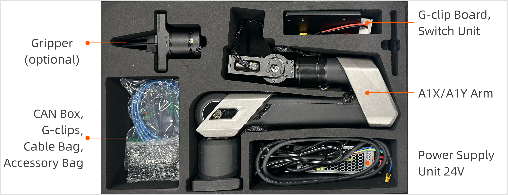
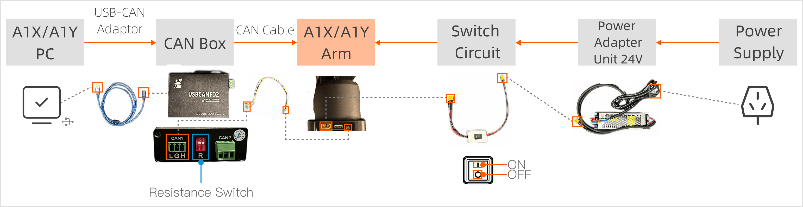

# A1XY Unbox and Installation Guide
## 1.  Item List Check

Upon receiving the product, check the contents of the box against the following list.

<table style="width: 100%; border-collapse: collapse;">
    <thead>
        <tr style="background-color: black; color: white; text-align: left;">
            <th style="width: 300px; padding: 8px; border: 1px solid #ddd;">Item</th>
            <th style="width: 200px; padding: 8px; border: 1px solid #ddd;">Quantity</th>
            <th style="width: 400px; padding: 8px; border: 1px solid #ddd;">Notes</th>
        </tr>
    </thead>
    <tbody>
        <tr style="background-color: white; text-align: left;">
            <td style="padding: 8px; border: 1px solid #ddd;">A1X/A1Y Arm</td>
            <td style="padding: 8px; border: 1px solid #ddd;">1</td>
            <td style="padding: 8px; border: 1px solid #ddd;">-</td>
        </tr>
        <tr style="background-color: white; text-align: left;">
            <td style="padding: 8px; border: 1px solid #ddd;">Power Supply Unit</td>
            <td style="padding: 8px; border: 1px solid #ddd;">1</td>
            <td style="padding: 8px; border: 1px solid #ddd;">Rated Voltage: 24V</td>
        </tr>
        <tr style="background-color: white; text-align: left;">
            <td style="padding: 8px; border: 1px solid #ddd;">Switch Circuit</td>
            <td style="padding: 8px; border: 1px solid #ddd;">1</td>
            <td style="padding: 8px; border: 1px solid #ddd;">Used to power on and off the robot arm.</td>
        </tr>
        <tr style="background-color: white; text-align: left;">
            <td style="padding: 8px; border: 1px solid #ddd;">CAN Box</td>
            <td style="padding: 8px; border: 1px solid #ddd;">1</td>
            <td style="padding: 8px; border: 1px solid #ddd;">Used for communication.</td>
        </tr>
        <tr style="background-color: white; text-align: left;">
            <td style="padding: 8px; border: 1px solid #ddd;">CAN Cable</td>
            <td style="padding: 8px; border: 1px solid #ddd;">1</td>
            <td style="padding: 8px; border: 1px solid #ddd;">Used to connect the CAN box to the arm.</td>
        </tr>
        <tr style="background-color: white; text-align: left;">
            <td style="padding: 8px; border: 1px solid #ddd;">USB-CAN Adaptor Cable</td>
            <td style="padding: 8px; border: 1px solid #ddd;">1</td>
            <td style="padding: 8px; border: 1px solid #ddd;">Used to connect the CAN box to the PC.</td>
        </tr>
        <tr style="background-color: white; text-align: left;">
            <td style="padding: 8px; border: 1px solid #ddd;">G-clip</td>
            <td style="padding: 8px; border: 1px solid #ddd;">2</td>
            <td style="padding: 8px; border: 1px solid #ddd;">Used to secure the arm to the surface.</td>
        </tr>
        <tr style="background-color: white; text-align: left;">
            <td style="padding: 8px; border: 1px solid #ddd;">G-clip Adapter Plate</td>
            <td style="padding: 8px; border: 1px solid #ddd;">1</td>
            <td style="padding: 8px; border: 1px solid #ddd;">Used to position the robot arm on the plate and secure it to the desktop using G-clips.</td>
        </tr>
        <tr style="background-color: white; text-align: left;">
            <td style="padding: 8px; border: 1px solid #ddd;">L-hex Wrench</td>
            <td style="padding: 8px; border: 1px solid #ddd;">1</td>
            <td style="padding: 8px; border: 1px solid #ddd;">Used to secure the screws.</td>
        </tr>
        <tr style="background-color: white; text-align: left;">
            <td style="padding: 8px; border: 1px solid #ddd;">M6 Screw Bag</td>
            <td style="padding: 8px; border: 1px solid #ddd;">1</td>
            <td style="padding: 8px; border: 1px solid #ddd;">Used to secure the robot arm base to the G-clip adapter plate.</td>
        </tr>        
    </tbody>
</table>

**Note: The A1XY robot arm does not include grippers in its standard configuration. If needed, please contact us to purchase additional grippers.**

Also, prepare the following items:

<table style="width: 100%; border-collapse: collapse;">
    <thead>
        <tr style="background-color: black; color: white; text-align: left;">
            <th style="width: 300px; padding: 8px; border: 1px solid #ddd;">Item</th>
            <th style="width: 200px; padding: 8px; border: 1px solid #ddd;">Quantity</th>
            <th style="width: 400px; padding: 8px; border: 1px solid #ddd;">Notes</th>
        </tr>
    </thead>
    <tbody>
        <tr style="background-color: white; text-align: left;">
            <td style="padding: 8px; border: 1px solid #ddd;">Host Computer</td>
            <td style="padding: 8px; border: 1px solid #ddd;">1</td>
            <td style="padding: 8px; border: 1px solid #ddd;">OS Dependency：Ubuntu 20.04 LTS Middleware Dependency: ROS Noetic</td>
        </tr>
    </tbody>
</table>

**Note: To ensure proper operation of the product, please place A1XY in a dry, well-ventilated environment and ensure there are no obstacles or hazardous materials around.**

## 2. Installing the Arm

- Select a suitable installation platform, ensuring it is flat and stable, capable of withstanding the maximum load of the robot arm during operation.
- Clean the surface of the installation platform, removing debris, dust, and other substances that may affect installation stability, ensuring tight adhesion between the mounting base plate and the platform.

Follow these steps to install and secure the robot arm:

1. Place the G-clip adapter plate on the selected installation platform or desktop, ensuring its position is appropriate for subsequent securing operations.
2. Secure the adapter plate using G-clips.
3. Carefully place the robot arm on the center of the adapter plate, ensuring the holes around the robot arm base accurately align with the holes on the G-clip adapter plate, and secure the robot arm using M6 screws.

## 3. Connecting the Cables

1. Connect the USB-CAN cable to the host computer and the CAN box.
2. Connect both ends of the CAN cable from the wiring harness to the CAN interface on the robot arm base and the CAN1 interface on the CAN box, and set the termination switches R1 and R2 on the CAN box to the top position.
3. Connect the two ends of the switch circuit to the power port on the robot arm base and the power adapter.
4. Plug the power adapter into a power source.

After a successful connection, visit the [A1XY Startup and Demo Guide](./A1XY_Startup_Demo_Guide.md) to the next step.