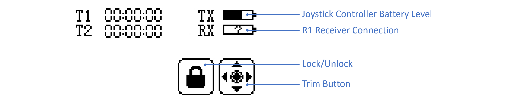

> Congratulations on becoming the proud owner of a Galaxea Robot! We are thrilled to extend a warm welcome to the Galaxea Developer Community. This specially curated guide is designed to introduce beginners to the unique appeal and impressive functionalities of Galaxea Robot. Our goal is to help you quickly get started with us and empower you to explore the full range of possibilities that await you.

# Before You Begin

In this first tutorial, you will learn how to power on and operate R1, beginning your journey of interacting with Galaxea R1.

## Safety 

Galaxea R1 has the potential to cause harm if not properly used. We recommend that all users review the Safety Guide before operating the robot.

## Turning On

To turn on Galaxea R1, please press the boat-shaped button on the side of the chassis. 

## Charging

To charge Galaxea R1, please use the provided power cable and insert it into the 48V power supply port located at the bottom of the rear of the chassis. 

## Shutting Down 

Galaxea R1 can be turned off by simply switching off the button on the left side of the chassis. 

### Emergency Stop

The emergency stop switch is located at the rear of the chassis. It can be used to immediately halt all operations in case of an emergency or if you encounter any dangerous situations.

## Joystick Controller Instruction
Use the provided joystick controller to operate the robot and quickly test Galaxea R1's various functions.

### Battery Installation

1. Open the battery compartment cover.
2. Insert four fully charged AA batteries into the compartment, ensuring that the metal terminals on the batteries make contact with the metal terminals inside the compartment.
3. Close the battery compartment cover.

### Turning On the Controller

Check the system status first to ensure that the batteries are fully charged and correctly installed. 
Then, press and hold both power buttons on the controller simultaneously until the screen lights up.

### Touchscreen Operation

The icon in the top left corner of the screen shows the following:

| **Item** | **Notes**                                                    |
| -------- | ------------------------------------------------------------ |
| **TX**   | Shows the battery level of the controller.                   |
| **RX**   | Shows whether the remote control is successfully connected to Galaxea R1. If the connection is successful, it will display a half-filled bar. If the connection is unsuccessful, a question mark will appear in the box. |

### Turning Off the Controller

Press and hold both power buttons on the controller simultaneously until the screen turns off and the controller shuts down.

### Teleoperation Guide

#### Galaxea R1 Chassis Control
Coming soon

#### Galaxea R1 Torso Control 
Coming soon

## Next Step

The next guide, [Connecting and Installing](GettingStarted_Connecting.md), will explain how to connect Galaxea R1 to a computing unit and explore its functions in more detail.
