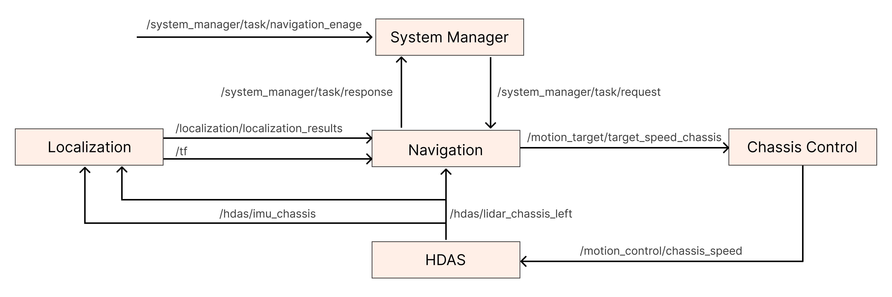

# R1 Autonomous Navigation System Tutorial

## 1. Product Introduction

The system includes mapping, localization, navigation, and control modules. The Galaxea R1 robot can build a point cloud map of the environment and use it for global localization, autonomous movement to target points, and obstacle avoidance.

**<span style="color:blue;">The Autonomous Navigation System is currently a premium feature in beta testing. For detailed inquiries or trial purchases, please contact us at product@galaxea.ai or call 4008780980.</span>**

  <div style="display: flex; justify-content: center; align-items: center;">
  <video width="1920" height="1080" controls>
    <source src="../assets/R1_Navigation _Demo.mp4" type="video/mp4">
    Your browser does not support the video tag.
  </video>
  </div>

## 2. Hardware Introduction

### 2.1 Performance Parameters

<table style="width: 100%; border-collapse: collapse;">
    <thead>
        <tr style="background-color: black; color: white; text-align: left;">
            <th style="width: 300px; padding: 8px; border: 1px solid #ddd;">Localization</th>
            <th style="width: 400px; padding: 8px; border: 1px solid #ddd;">Description</th>
        </tr>
    </thead>
    <tbody>
        <tr style="background-color: white; text-align: left;">
            <td style="padding: 8px; border: 1px solid #ddd;">Localization Method</td>
            <td style="padding: 8px; border: 1px solid #ddd;">LiDAR-based SLAM</td>
        </tr>
        <tr style="background-color: white; text-align: left;">
                <td style="padding: 8px; border: 1px solid #ddd;">Localization Frequency</td>
            <td style="padding: 8px; border: 1px solid #ddd;">100 Hz</td>
        </tr>
        <tr style="background-color: white; text-align: left;">
            <td style="padding: 8px; border: 1px solid #ddd;">Localization Accuracy</td>
            <td style="padding: 8px; border: 1px solid #ddd;">＜0.05 m</td>
        </tr>
    </tbody>
</table>


<table style="width: 100%; border-collapse: collapse;">
    <thead>
        <tr style="background-color: black; color: white; text-align: left;">
            <th style="width: 300px; padding: 8px; border: 1px solid #ddd;">Motion Method</th>
            <th style="width: 400px; padding: 8px; border: 1px solid #ddd;">Description</th>
        </tr>
    </thead>
    <tbody>
        <tr style="background-color: white; text-align: left;">
            <td style="padding: 8px; border: 1px solid #ddd;">Control Method</td>
            <td style="padding: 8px; border: 1px solid #ddd;">Autonomous Navigation (Path Tracking)<br>Remote control </td>
        </tr>
        <tr style="background-color: white; text-align: left;">
                <td style="padding: 8px; border: 1px solid #ddd;">Maximum Speed</td>
            <td style="padding: 8px; border: 1px solid #ddd;">0.6 m/s</td>
        </tr>
        <tr style="background-color: white; text-align: left;">
            <td style="padding: 8px; border: 1px solid #ddd;">Obstacle Avoidance Method</td>
            <td style="padding: 8px; border: 1px solid #ddd;">Navigate around obstacles</td>
        </tr>
        <tr style="background-color: white; text-align: left;">
            <td style="padding: 8px; border: 1px solid #ddd;">Obstacle Avoidance Frequency</td>
            <td style="padding: 8px; border: 1px solid #ddd;">10-20 Hz</td>
        </tr>        
    </tbody>
</table>


<table style="width: 100%; border-collapse: collapse;">
    <thead>
        <tr style="background-color: black; color: white; text-align: left;">
            <th style="width: 300px; padding: 8px; border: 1px solid #ddd;">Network</th>
            <th style="width: 400px; padding: 8px; border: 1px solid #ddd;">Description</th>
        </tr>
    </thead>
    <tbody>
        <tr style="background-color: white; text-align: left;">
            <td style="padding: 8px; border: 1px solid #ddd;">Wired Network</td>
            <td style="padding: 8px; border: 1px solid #ddd;">Supported</td>
        </tr>
        <tr style="background-color: white; text-align: left;">
                <td style="padding: 8px; border: 1px solid #ddd;">WiFi</td>
            <td style="padding: 8px; border: 1px solid #ddd;">Supported</td>
        </tr>
    </tbody>
</table>


### 2.2 Sensor Configuration

The Galaxea R1 is equipped with various sensors, including 9 high-definition cameras and 2 LiDAR units, enabling it to perceive its surroundings in all directions and perform precise operations.


<table style="width: 100%; border-collapse: collapse;">
    <thead>
        <tr style="background-color: black; color: white; text-align: left;">
            <th style="width: 300px; padding: 8px; border: 1px solid #ddd;">Sensor</th>
            <th style="width: 400px; padding: 8px; border: 1px solid #ddd;">Values</th>
        </tr>
    </thead>
    <tbody>
        <tr style="background-color: white; text-align: left;">
            <td style="padding: 8px; border: 1px solid #ddd;">Camera</td>
            <td style="padding: 8px; border: 1px solid #ddd;">Head: 1 x Binocular Depth Camera<br>Wrist: 2 x Monocular Depth Camera<br>Chassis: 5 x Monocular Camera</td>
        </tr>
        <tr style="background-color: white; text-align: left;">
            <td style="padding: 8px; border: 1px solid #ddd;">LiDar</td>
            <td style="padding: 8px; border: 1px solid #ddd;">1 x 360°<br>(Two LiDARs are optional) </td>
        </tr>
    </tbody>
</table>


#### 2.2.1 Camera

<table style="width: 100%; border-collapse: collapse;">
    <thead>
        <tr style="background-color: black; color: white; text-align: left;">
            <th style="width: 300px; padding: 8px; border: 1px solid #ddd;">Specification</th>
            <th style="width: 400px; padding: 8px; border: 1px solid #ddd;">Head</th>
            <th style="width: 400px; padding: 8px; border: 1px solid #ddd;">Wrist</th>          
            <th style="width: 400px; padding: 8px; border: 1px solid #ddd;">Chassis</th>              
        </tr>
    </thead>
    <tbody>
        <tr style="background-color: white; text-align: left;">
            <td style="padding: 8px; border: 1px solid #ddd;">Type</td>
            <td style="padding: 8px; border: 1px solid #ddd;">Binocular Depth Camera</td>
            <td style="padding: 8px; border: 1px solid #ddd;">Monocular Depth Camera</td>
            <td style="padding: 8px; border: 1px solid #ddd;">Monocular Camera</td>            
        </tr>
        <tr style="background-color: white; text-align: left;">
            <td style="padding: 8px; border: 1px solid #ddd;">Quantity</td>
            <td style="padding: 8px; border: 1px solid #ddd;">1</td>
            <td style="padding: 8px; border: 1px solid #ddd;">2</td>
            <td style="padding: 8px; border: 1px solid #ddd;">5</td>            
        </tr>
        <tr style="background-color: white; text-align: left;">
            <td style="padding: 8px; border: 1px solid #ddd;">Output Resolution</td>
            <td style="padding: 8px; border: 1px solid #ddd;">1920 x 1080 @30fps</td>
            <td style="padding: 8px; border: 1px solid #ddd;">1280 x 720 @30FPS<br>(RGB 1920 x 1080)</td>
            <td style="padding: 8px; border: 1px solid #ddd;">1920 x 1080 @30fps</td>            
        </tr>        
        <tr style="background-color: white; text-align: left;">
            <td style="padding: 8px; border: 1px solid #ddd;">Field of View</td>
            <td style="padding: 8px; border: 1px solid #ddd;">110°H x 70°V x 120°D</td>
            <td style="padding: 8px; border: 1px solid #ddd;">87°H x 58°V x 95°D</td>
            <td style="padding: 8px; border: 1px solid #ddd;">118°H x 62°V</td>           
        </tr>
        <tr style="background-color: white; text-align: left;">
            <td style="padding: 8px; border: 1px solid #ddd;">Depth Range</td>
            <td style="padding: 8px; border: 1px solid #ddd;">0.3 m ~ 20 m</td>
            <td style="padding: 8px; border: 1px solid #ddd;">0.2 m ~ 3 m</td>      
            <td style="padding: 8px; border: 1px solid #ddd;">\</td>                      
        </tr>
        <tr style="background-color: white; text-align: left;">
            <td style="padding: 8px; border: 1px solid #ddd;">Operating Temp. Range</td>
            <td style="padding: 8px; border: 1px solid #ddd;">-10 °C ~ +45°C</td>
            <td style="padding: 8px; border: 1px solid #ddd;">0 ~ +85°C </td>
            <td style="padding: 8px; border: 1px solid #ddd;">-40 ~ +85°C </td>            
        </tr>    
        <tr style="background-color: white; text-align: left;">
            <td style="padding: 8px; border: 1px solid #ddd;">Dimensions</td>
            <td style="padding: 8px; border: 1px solid #ddd;">175L x 30W x 32H mm</td>
            <td style="padding: 8px; border: 1px solid #ddd;">90L x 25W x 25H mm</td> 
            <td style="padding: 8px; border: 1px solid #ddd;">30L x 30W x 23H mm</td>            
        </tr>
        <tr style="background-color: white; text-align: left;">
            <td style="padding: 8px; border: 1px solid #ddd;">Weight</td>
            <td style="padding: 8px; border: 1px solid #ddd;">164 g</td>
            <td style="padding: 8px; border: 1px solid #ddd;">75 g</td>
            <td style="padding: 8px; border: 1px solid #ddd;">＜50 g</td>            
        </tr>  
    </tbody>
</table>


#### 2.2.2 LiDar

The chassis is equipped with up to two 360-degree LiDARs*, which are of high precision and resistant to interference.

<table style="width: 100%; border-collapse: collapse;">
    <thead>
        <tr style="background-color: black; color: white; text-align: left;">
            <th style="width: 300px; padding: 8px; border: 1px solid #ddd;">Units</th>
            <th style="width: 400px; padding: 8px; border: 1px solid #ddd;">Single SOC</th>
            <th style="width: 400px; padding: 8px; border: 1px solid #ddd;">Dual SOC</th>
        </tr>
    </thead>
    <tbody>
        <tr style="background-color: white; text-align: left;">
            <td style="padding: 8px; border: 1px solid #ddd;">Basic Computating Capability</td>
            <td style="padding: 8px; border: 1px solid #ddd;">8 Core 2.2GHz CPU</td>
            <td style="padding: 8px; border: 1px solid #ddd;">2 * 8 Core 2.2GHz CPU</td>
        </tr>
        <tr style="background-color: white; text-align: left;">
            <td style="padding: 8px; border: 1px solid #ddd;">Deep Learning Computing Capability</td>
            <td style="padding: 8px; border: 1px solid #ddd;">200 TOPS</td>
            <td style="padding: 8px; border: 1px solid #ddd;">550 TOPS</td>
        </tr>
        <tr style="background-color: white; text-align: left;">
            <td style="padding: 8px; border: 1px solid #ddd;">Memory</td>
            <td style="padding: 8px; border: 1px solid #ddd;">1 x LPDDR5@32G </td>
            <td style="padding: 8px; border: 1px solid #ddd;">2 x LPDDR5@32G </td>
        </tr>
        <tr style="background-color: white; text-align: left;">
            <td style="padding: 8px; border: 1px solid #ddd;">Hard Disk</td>
            <td style="padding: 8px; border: 1px solid #ddd;">1 x SSD@1T</td>
            <td style="padding: 8px; border: 1px solid #ddd;">2 x SSD@512G</td>
        </tr>
        <tr style="background-color: white; text-align: left;">
            <td style="padding: 8px; border: 1px solid #ddd;">Camera</td>
            <td style="padding: 8px; border: 1px solid #ddd;">8 x GMSL</td>
            <td style="padding: 8px; border: 1px solid #ddd;">8 x GMSL (SoC-1) + 8 x GMSL (SoC-2) </td>
        </tr>
        <tr style="background-color: white; text-align: left;">
            <td style="padding: 8px; border: 1px solid #ddd;">Ethernet</td>
            <td style="padding: 8px; border: 1px solid #ddd;">4 x Gigabit Ethernet (M12 cable)</td>
            <td style="padding: 8px; border: 1px solid #ddd;">3 x SoC-1 Gigabit Ethernet (M12 cable) + 3 x SoC-2 Gigabit Ethernet (M12 cable)</td>
        </tr>
        <tr style="background-color: white; text-align: left;">
            <td style="padding: 8px; border: 1px solid #ddd;">WiFi Module</td>
            <td style="padding: 8px; border: 1px solid #ddd;">M.2 Wifi with AP mode</td>
            <td style="padding: 8px; border: 1px solid #ddd;">M.2 Wifi with AP mode</td>
        </tr>
    </tbody>
</table>

\* One LiDAR is standard, the number of LiDAR configurations can be selected according to user needs.

## 3. Software Introduction

Please ensure that your environment meets the following software dependency requirements:

1. Hardware Dependency: R1 computing unit
2. Operating System Dependency: Ubuntu 20.04 LTS
3. Middleware Dependency: ROS Noetic

<span style="color:red;">**Ensure that the R1 robot has installed the intelligence system version V1.1.0 or higher. For access, please email product@galaxea.ai or call 4008780980.**</span>

If you need to deploy the navigation system for the first time, please follow the steps below to install the required dependencies:

```Go
sudo apt install libsdl1.2-dev
sudo apt install libsdl-image1.2-dev
sudo apt install libsdl2-image-dev
sudo apt install ros-noetic-grid-map-core
sudo apt install ros-noetic-grid-map-ros
sudo apt install libgoogle-glog-dev
```

## 4. Localization and Navigation Operation Process

Map building is the foundational step for the robot's autonomous navigation. The robot records map data (bag files) via remote control, processes and builds the map on a local computer, and finally uploads the map to the specified directory on the robot to complete the deployment. By following the tutorial below, you can set the target pose, modify the target file, and run the process to achieve point-to-point navigation.

###  4.1 Building the Map

1. **Login to R1**

    Log in to the R1 ECU via SSH.

    ```Bash
    ssh nvidia@robot_ip
    # Enter the password  (default: nvidia)
    ```

2. **Start R1**

    Run the following command to start the relevant nodes.

    ```Bash
    cd work/galaxea/install/share/startup_config/script/
    ./ota_script.sh boot
    ```

#### 4.1.1 Record Data Packets

Run the following command to start recording the bag file.

```Bash
cd ~
rosbag record /hdas/imu_chassis /hdas/lidar_chassis_left /hdas/feedback_chassis
```

Control the robot to move within the space to be mapped using the **Joystick Controller**, ensuring that all areas that need navigation are covered. For the method of operating the robot chassis with the Joystick Controller, please click [here](R1_Overview.md) to refer.

When the map data recording is completed, press `Ctrl + C` to end the recording.

**Notes:**

- Please move the robot to the area to be mapped.
- At the start of the recording, the robot must remain stationary for at least 5 seconds to ensure data quality.
- During the data recording, ensure that there are no dynamic objects (such as moving people or objects) in the environment to avoid interference with map construction.

#### 4.1.2 Data Transmission

1. **Confirm the Bag File Path**
   </br>On the R1 robot, confirm the path of the recorded bag file. By default, the bag file will be saved in the user's home directory (~).

    ```Bash
    ls -lh ~/map_data.bag
    ```
   If the file name is different from the default, please record the actual file name.

2. **Transfer Data to Local Computer Using SCP**
   </br>Use the SCP tool to transfer the bag file from the robot to your local computer. Ensure that your local computer is connected to the same network as the robot and that the network connection is stable. 
   In the terminal on your local computer, run the following command:
    ```Bash
    scp nvidia@robot_ip:~/map_data.bag /local/path/to/save/
    # nvidia@robot_ip：The username and IP address of R1.
    # ~/map_data.bag：The path to the bag file on R1.
    # /local/path/to/save/：The directory on the local computer where the bag file will be saved.
    ```
3. **Verify File Transfer**
   </br>On your computer, check whether the file has been successfully transferred and confirm that the file size is consistent with the one on the robot.
    ```Bash
    ls -lh /local/path/to/save/map_data.bag
    ```
    If the file transfer is successful, you will see the same file size as on the robot.

4. **Data Transmission**
   </br><span style="color:blue;">**Please transmit the data package to [support@galaxea.ai](mailto:support@galaxea.ai) or send it to customer service via WeChat Work.**</span>

#### 4.1.3  Import Map-Related Files

```Bash
ssh nvidia@{rorbot_ip} "mkdir -p ~/galaxea/calib ~/galaxea/maps"
scp -r ~/mapping_data/map/* nvidia@{robot_ip}:~/galaxea/maps/
scp -r ~/mapping_data/robot_calibration.json nvidia@{robot_ip}:~/galaxea/calib/
```

### 4.2 Initiating the Positioning Function

When activating the positioning function, make sure the robot is in a known map.

1. **Start the R1 node**
   </br>Execute the following commands at the R1 end to start the related nodes.
   ```Plain
   ssh nvidia@{rorbot_ip}
   cd work/galaxea/install/share/startup_config/script/
   ./ota_script.sh boot
   ```

2. **Obtain Positioning Information**
   </br>Set the remote control to the chassis control mode, and operate the robot to circle within 2m in the known map environment of the robot. Ensure that the robot can successfully locate itself.

    In the R1 terminal, run the following command to check the positioning status:
    ```Bash
        source ~/work/galaxea/install/setup.bash
        rosrun tf tf_echo map body
    ```

    If the following data are returned normally, the positioning is successful:

    ```Bash
    - Translation: [3.280, -0.743, 0.008]
    - Rotation: in Quaternion [0.000, -0.004, -0.147, 0.989] # xx y z w
    ```

### 4.3 Set the Target Pose Position

1. **Remote robot to the target point**
   </br>After the positioning is successfully started, remotely control the robot to the target point you set. Ensure that the center of R1 is at least 45 cm away from obstacles.

2. **Record the pose information**
   </br>Every time the robot reaches the target point, record the robot pose information at that position.
   ```Bash
   - Translation: [3.280, -0.743, 0.008]
   - Rotation: in Quaternion [0.000, -0.004, -0.147, 0.989] # x y z w
   ```

3. **Update the script for sending navigation target point information**

    Repeat the above steps. After recording the pose information of all target points, update them to the navigation target point script.</br>

    The script example is as follows:

    ```
    point_nav.py
    ```

    ```
    #!/usr/bin/env python
    import geometry_msg.msg
    import rospy
    from geometry_msgs.msg import PoseStamped
    from system_manager_msg.msg import TaskRequest, TaskResponse
    from geometry_msg.msg import PoseStamped
    class NavigationEngager:
        def __init__(self):
            # Initialize the ROS node
            rospy.init_node('navigation_engager', anonymous=True)
            # Initialize the position array
            self.pose_array = self.create_pose_array()
            self.current_index = 0  # Current target position index
    
            # Set up Publisher and Subscriber
            self.publisher = rospy.Publisher('/system_manager/task/navigation_enage', TaskRequest, queue_size=10)
            self.subscriber = rospy.Subscriber('/system_manager/task/response', TaskResponse, self.response_callback)
    
            # State variable
            self.engage_pending = False  # Indicates whether the current request is waiting for a response.
            rospy.loginfo("Navigation engager node initialized.")
    
            # Start sending the first "engage" message.
            rospy.sleep(1)  # Make sure that Publisher has been initialized.
            self.send_engage()
    
        def create_pose_array(self):
            """Create an array of PoseStamped objects that includes the target position."""
            pose_array = []
            pose = geometry_msg.msg.PoseStamped()
            pose.header.frame_id = "map"
            pose.pose.position.x = 3.280 
            pose.pose.position.y = -0.743
            pose.pose.position.z = 0.008
            pose.pose.orientation.x = 0.000 
            pose.pose.orientation.y = -0.004
            pose.pose.orientation.z =  -0.147
            pose.pose.orientation.w = 0.989
            pose_array.append(pose)
    
            # New target point added
            # pose = geometry_msg.msg.PoseStamped()
            # pose.header.frame_id = "map"
            # pose.pose.position.x = 5.761 
            # pose.pose.position.y = -0.146
            # pose.pose.position.z = 0.087
            # pose.pose.orientation.x = -0.008 
            # pose.pose.orientation.y = -0.001
            # pose.pose.orientation.z = 0.551
            # pose.pose.orientation.w = 0.835
            # pose_array.append(pose)
    
            return pose_array
    
        def send_engage(self):
            print("index  =", self.current_index)
            """Send the "engage" message"""
           
            if self.current_index >= len(self.pose_array):
                self.current_index = 0
            if not self.engage_pending and self.current_index < len(self.pose_array):
                msg = TaskRequest()
                # Set the fields of the message as needed
                msg.task_type = 1
                msg.navigation_task.target_pose = self.pose_array[self.current_index]
                self.publisher.publish(msg)
                self.current_index += 1
                self.engage_pending = True  # Marked as awaiting response
    
        def response_callback(self, msg):
            """Handle the response message"""
            if self.engage_pending:
                self.engage_pending = False  # Reset the status and allow sending new engage.
                rospy.sleep(0.1)  # Control the tempo of sending.
                self.send_engage()  # Send out the new "engage" message.
    
        def run(self):
            """Run node"""
            rospy.spin()
    
    if __name__ == '__main__':
        try:
            engager = NavigationEngager()
            engager.run()
        except rospy.ROSInterruptException:
            pass
    ```

    You can add any number of target points. In the Python file, replace and add the following areas in the Python script.
    ```Python
            # Add a new target point
            # pose = geometry_msg.msg.PoseStamped()
            # pose.header.frame_id = "map"
            # pose.pose.position.x = 5.761 
            # pose.pose.position.y = -0.146
            # pose.pose.position.z = 0.087
            # pose.pose.orientation.x = -0.008 
            # pose.pose.orientation.y = -0.001
            # pose.pose.orientation.z = 0.551
            # pose.pose.orientation.w = 0.835
            # pose_array.append(pose)
    ```

    After the target point is set, execute the script, and the robot can achieve autonomous navigation to the target point in a loop.
    ```Go
    source ~/work/galaxea/install/setup.bash
    python3 point_nav.py
    ```

## 5. Software Interface

### 5.1 System Diagram



### 5.2 Driving Interface

R1 offers multiple driver interfaces for communication and control with hardware devices. 

#### 5.2.1 Chassis Drive Interface

`/motion_control/chassis_speed`：It is used for the chassis status feedback ROS package, which defines multiple topics to report the status of the chassis' motors. Please refer to the " [Chassis Drive Interface](Software_Guide.md/#chassis-driver-interface) "  in the Software Guide for more detailed information.

#### 5.2.2 LiDAR Interface

`/hdas/lidar_chassis_left`：It is used for environmental perception and distance measurement, providing real-time environmental information to robots. For more detailed information, please refer to the "[Lidar Interface](Software_Guide.md/#lidar-interface) " in the Software Guide for more detailed information.

#### 5.2.3 IMU Interface

`/hdas/imu_chassis`：It is used to measure the acceleration and angular velocity of the robot, providing data support for navigation and attitude control. For more detailed information, please refer to the " [IMU Interface](Software_Guide.md/#imu-interfaces) " in the Software Guide for more detailed information.

### 5.3 Motion Control Interface

R1 offers multiple motion control interfaces for achieving precise control of the robot's movements. Below are the main motion control interfaces and their descriptions.

#### 5.3.1 Chassis Control Interface

`/motion_target/target_speed_chassis`：It is used to control the movement of the robot chassis, including speed control, direction control, etc. Please refer to the "Chassis Control Interface" in the Software Guide for more detailed information.

### 5.4 Localization Interface

It is used for the R1 robot to achieve autonomous navigation and environmental perception. Through these interfaces, the robot can receive data from various sensors, such as IMU and LiDAR, thereby enabling precise multi-sensor fusion localization. These interfaces ensure that the robot can accurately perceive its own position and posture in complex environments, providing reliable data support for subsequent path planning and navigation. 

<table style="width: 100%; border-collapse: collapse;table-layout: fixed;">
    <thead>
        <tr style="background-color: black; color: white; text-align: left;">
            <th style="width: 300px; padding: 8px; border: 1px solid #ddd;">Topic Name</th>
            <th style="width: 100px padding: 8px; border: 1px solid #ddd;">I/O</th>                
            <th style="width: 300px; padding: 8px; border: 1px solid #ddd;">Description</th>
            <th style="width: 200px; padding: 8px; border: 1px solid #ddd;">Message Type</th>
        </tr>
    </thead>
    <tbody>
        <tr style="background-color: white; text-align: left;">
            <td style="padding: 8px; border: 1px solid #ddd;">/hdas/imu_chassis   </td>
            <td style="padding: 8px; border: 1px solid #ddd;">Input</td>                 
            <td style="padding: 8px; border: 1px solid #ddd;">IMU data, used for multi-sensor fusion positioning</td>
            <td style="padding: 8px; border: 1px solid #ddd;">sensor_msgs::Imu</td>
        </tr>
        <tr style="background-color: white; text-align: left;">
            <td style="padding: 8px; border: 1px solid #ddd;">/hdas/lidar_chassis_left</td>
            <td style="padding: 8px; border: 1px solid #ddd;">Input</td>    
            <td style="padding: 8px; border: 1px solid #ddd;">Multi-line LiDAR point cloud, used for positioning</td>
            <td style="padding: 8px; border: 1px solid #ddd;">sensor_msgs/PointCloud2</td>
        </tr>
        <tr style="background-color: white; text-align: left;">
            <td style="padding: 8px; border: 1px solid #ddd;">/localization/localization_results</td>
            <td style="padding: 8px; border: 1px solid #ddd;">Output</td>    
            <td style="padding: 8px; border: 1px solid #ddd;">SLAM Positioning Status</td>
            <td style="padding: 8px; border: 1px solid #ddd;">localization_msg/LocLocalization</td>
        </tr>
    </tbody>
</table>


### 5.5 Navigation Interface

It is used for the R1 robot to achieve autonomous path planning and motion control. These interfaces enable the robots to conduct global and local path planning based on the input sensor data (such as LiDAR point clouds and SLAM positioning status), and output control instructions to drive the robot chassis to move. The Navigation interface not only supports obstacle avoidance but also can update the robot's motion trajectory and task status in real-time, ensuring that the robot can complete navigation tasks efficiently and safely. 

<table style="width: 100%; border-collapse: collapse;table-layout: fixed;">
    <thead>
        <tr style="background-color: black; color: white; text-align: left;">
            <th style="width: 200px; padding: 8px; border: 1px solid #ddd;">Topic Name</th>
            <th style="width: 100px; padding: 8px; border: 1px solid #ddd;">I/O</th>                
            <th style="width: 400px; padding: 8px; border: 1px solid #ddd;">Description</th>
            <th style="width: 300px; padding: 8px; border: 1px solid #ddd;">Message Type</th>
        </tr>
    </thead>
    <tbody>
        <tr style="background-color: white; text-align: left;">
            <td style="padding: 8px; border: 1px solid #ddd;">/hdas/lidar_chassis_left</td>
            <td style="padding: 8px; border: 1px solid #ddd;">Input</td>                 
            <td style="padding: 8px; border: 1px solid #ddd;">Multi-line LiDAR point cloud, used for obstacle avoidance</td>
            <td style="padding: 8px; border: 1px solid #ddd;">sensor_msgs/PointCloud2</td>
        </tr>
        <tr style="background-color: white; text-align: left;">
            <td style="padding: 8px; border: 1px solid #ddd;">/localization/localization_results</td>
            <td style="padding: 8px; border: 1px solid #ddd;">Input</td>    
            <td style="padding: 8px; border: 1px solid #ddd;">SLAM Positioning Status</td>
            <td style="padding: 8px; border: 1px solid #ddd;">localization_msg/LocLocalization</td>
        </tr>
        <tr style="background-color: white; text-align: left;">
            <td style="padding: 8px; border: 1px solid #ddd;">/system_manager/task/request</td>
            <td style="padding: 8px; border: 1px solid #ddd;">Input</td>    
            <td style="padding: 8px; border: 1px solid #ddd;">Navigation Task Interface</td>
            <td style="padding: 8px; border: 1px solid #ddd;">system_manager_msg/TaskRequest</td>
        </tr>
        <tr style="background-color: white; text-align: left;">
            <td style="padding: 8px; border: 1px solid #ddd;">/nav/local_path</td>
            <td style="padding: 8px; border: 1px solid #ddd;">Output</td>    
            <td style="padding: 8px; border: 1px solid #ddd;">The local path planned by the local path planner</td>
            <td style="padding: 8px; border: 1px solid #ddd;">sensor_msgs/PointCloud2</td>
        </tr>
        <tr style="background-color: white; text-align: left;">
            <td style="padding: 8px; border: 1px solid #ddd;">/nav/global_path</td>
            <td style="padding: 8px; border: 1px solid #ddd;">Output</td>    
            <td style="padding: 8px; border: 1px solid #ddd;">The global path planned by the global path planner</td>
            <td style="padding: 8px; border: 1px solid #ddd;">sensor_msgs/PointCloud2</td>
        </tr>
        <tr style="background-color: white; text-align: left;">
            <td style="padding: 8px; border: 1px solid #ddd;">/nav/robot_global_traj</td>
            <td style="padding: 8px; border: 1px solid #ddd;">Output</td>    
            <td style="padding: 8px; border: 1px solid #ddd;">The global trajectory of the robot's movement</td>
            <td style="padding: 8px; border: 1px solid #ddd;">nav_msgs/Path</td>
        </tr>
        <tr style="background-color: white; text-align: left;">
            <td style="padding: 8px; border: 1px solid #ddd;">/nav/global_map</td>
            <td style="padding: 8px; border: 1px solid #ddd;">Output</td>    
            <td style="padding: 8px; border: 1px solid #ddd;">Navigate the global cost map for planning the global path</td>
            <td style="padding: 8px; border: 1px solid #ddd;">nav_msgs/OccupancyGrid</td>
        </tr>
        <tr style="background-color: white; text-align: left;">
            <td style="padding: 8px; border: 1px solid #ddd;">/nav/local_map</td>
            <td style="padding: 8px; border: 1px solid #ddd;">Output</td>    
            <td style="padding: 8px; border: 1px solid #ddd;">Local cost map for navigation, used for planning local paths</td>
            <td style="padding: 8px; border: 1px solid #ddd;">nav_msgs/OccupancyGrid</td>
        </tr>
        <tr style="background-color: white; text-align: left;">
            <td style="padding: 8px; border: 1px solid #ddd;">/nav/global_goal</td>
            <td style="padding: 8px; border: 1px solid #ddd;">Output</td>    
            <td style="padding: 8px; border: 1px solid #ddd;">The target point for navigation reception, used for visualization</td>
            <td style="padding: 8px; border: 1px solid #ddd;">geometry_msgs/PoseStamped</td>
        </tr>
        <tr style="background-color: white; text-align: left;">
            <td style="padding: 8px; border: 1px solid #ddd;">/motion_target/target_speed_chassis</td>
            <td style="padding: 8px; border: 1px solid #ddd;">Output</td>    
            <td style="padding: 8px; border: 1px solid #ddd;">Navigation output controls the speed</td>
            <td style="padding: 8px; border: 1px solid #ddd;">geometry_msgs/Twist</td>
        </tr>
        <tr style="background-color: white; text-align: left;">
            <td style="padding: 8px; border: 1px solid #ddd;">/system_manager/task/response</td>
            <td style="padding: 8px; border: 1px solid #ddd;">Output</td>    
            <td style="padding: 8px; border: 1px solid #ddd;">The completion status of the navigation task</td>
            <td style="padding: 8px; border: 1px solid #ddd;">system_manager_msg/TaskResponse</td>
        </tr>
    </tbody>
</table>


### 5.6 Navigation Service Interface

#### 5.6.1 Start Navigation Service

Executing the following command to start the navigation service.

```YAML
service name: /nav_service  # Used to start or shut down the navigation system 
Type: std_srvs/SetBool
For Example: rosservice call /nav_service "data: true"
      rosservice call /nav_service "data: false"
```

**Note: The navigation service is enabled by default when the robot is started.**

**Note: Ensure that the R1 robot is in an environment with map data established when the navigation service is enabled, and the surrounding environment remains consistent with that during map generation to ensure the accuracy of positioning and navigation.**

#### 5.6.2 Shutting Down Navigation Service

Executing the following command to shut down the navigation service.

```YAML
Service name: /nav_service  # Used to start or shut down the navigation system 
Type: std_srvs/SetBool
For Example: rosservice call /nav_service "data: true"
      rosservice call /nav_service "data: false"
```

### 5.7 System Manager

The System Manager is the core management module of the R1 robot system, responsible for coordinating and managing various tasks and services of the robot. Through System Manager, users can trigger navigation tasks, monitor the status of tasks, and receive feedback on task completion. 

<table style="width: 100%; border-collapse: collapse;table-layout: fixed;">
    <thead>
        <tr style="background-color: black; color: white; text-align: left;">
            <th style="width: 100px; padding: 8px; border: 1px solid #ddd;">Topic Name</th>
            <th style="width: 150px; padding: 8px; border: 1px solid #ddd;">I/O</th>                
            <th style="width: 600px; padding: 8px; border: 1px solid #ddd;">Description</th>
            <th style="width: 200px; padding: 8px; border: 1px solid #ddd;">Message Type</th>
        </tr>
    </thead>
    <tbody>
        <tr style="background-color: white; text-align: left;">
            <td style="padding: 8px; border: 1px solid #ddd;">/system_manager/task/navigation_enage     </td>
            <td style="padding: 8px; border: 1px solid #ddd;">Input</td>                 
            <td style="padding: 8px; border: 1px solid #ddd;">Trigger the system_manager to construct based on the target_pose provided by the user, and send the task topic to the navigation module.</td>
            <td style="padding: 8px; border: 1px solid #ddd;">system_manager_msg/TaskRequest</td>
        </tr>
        <tr style="background-color: white; text-align: left;">
            <td style="padding: 8px; border: 1px solid #ddd;">/system_manager/task/response </td>
            <td style="padding: 8px; border: 1px solid #ddd;">Input</td>    
            <td style="padding: 8px; border: 1px solid #ddd;">After the navigation module has completed the navigation task, it will reply to the system_manager with a topic indicating success or failure.</td>
            <td style="padding: 8px; border: 1px solid #ddd;"> system_manager_msg/TaskResponse</td>
        </tr>
        <tr style="background-color: white; text-align: left;">
            <td style="padding: 8px; border: 1px solid #ddd;">/system_manager/task/request   </td>
            <td style="padding: 8px; border: 1px solid #ddd;">Output</td>    
            <td style="padding: 8px; border: 1px solid #ddd;">The system_manager sends the topic of the task to the navigation module.</td>
            <td style="padding: 8px; border: 1px solid #ddd;">system_manager_msg/TaskRequest</td>
        </tr>
    </tbody>
</table>

​    

