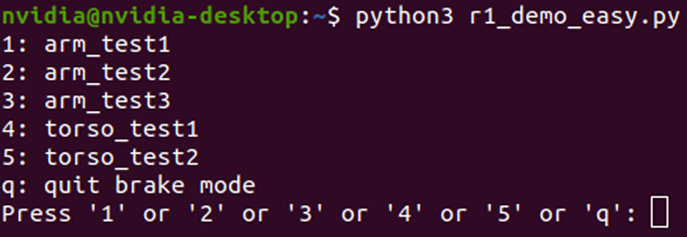

# R1 Demo Guide
## Preparation Before Use
<span style="color:red;">**Important: Please conduct the test strictly in the order listed in the "Script Execution".**</span>
Before you start testing, please ensure that:

1. Two arms are correctly installed. Ensue that the elbow joints (J3 & J4) are facing outward and the gripper tipping downward to the ground.
2. Torso is in the standing posture.
3. No personnel and obstacles within a radius of 1.5 meters. (As shown in the figure below.)


**Visit our GitHub Repository to download script `r1_demo_easy.py`**
```bash
git clone https://github.com/userguide-galaxea/Demo.git
#r1_demo_easy.py is located in path ${your_work_path}/Demo/blob/main/demo_r1.
```

## Action Description
<span style="color:red;">**Important: For your safety, in case of danger during the test, be sure to press `Ctrl + C` , in the Python 3 terminal where "r1_demo_easy.py" is located, to stop the running action.**</span>

- **arm_test_1:** Both arms are lifted vertically upward and then lowered, where the grippers are tipping vertically downward to the ground.
  <div style="display: flex; justify-content: center; align-items: center;">
  <video width="1920" height="1080" controls>
    <source src="../assets/R1_arm_test_1.mp4" type="video/mp4">
    Your browser does not support the video tag.
  </video>
  </div>

- **arm_test_2:** Both arms are lifted upward and then folded on both sides of the chest. At this time, the posture of R1 shows the zero-point posture (default) in URDF.
  <div style="display: flex; justify-content: center; align-items: center;">
  <video width="1920" height="1080" controls>
    <source src="../assets/R1_arm_test_2.mp4" type="video/mp4">
    Your browser does not support the video tag.
  </video>
  </div>
- **arm_test_3:** Both arms are lowered down to the original pose. Then, both arms are lifted vertically upward 90 degrees from both sides of the torso. Next, both arms are moved horizontally forward 90 degrees from both sides to the middle and hold for a while. Afterwards, both arms are lifted upward from both sides respectively, and are raised over the head to make pose in a heart shape. Finally, arms are lowered respectively, and the grippers point vertically downward to the ground again.
  <div style="display: flex; justify-content: center; align-items: center;">
  <video width="1920" height="1080" controls>
    <source src="../assets/R1_arm_test_3.mp4" type="video/mp4">
    Your browser does not support the video tag.
  </video>
  </div>
- **torso_test_1:** The torso squats down, and arms are folded at the same time. (This action is used to test torso motors T1/T2/T3).
  <div style="display: flex; justify-content: center; align-items: center;">
  <video width="1920" height="1080" controls>
    <source src="../assets/torso_test_1.mp4" type="video/mp4">
    Your browser does not support the video tag.
  </video>
  </div>
- **torso_test_2:** The torso raised to stand, and arms are back to the sides. Then turn the waist 45 degrees to the left, 90 degrees to the right, and then 45 degrees to the left where backs to the front. (This action is used to test the torso motor T4.)
  <div style="display: flex; justify-content: center; align-items: center;">
  <video width="1920" height="1080" controls>
    <source src="../assets/torso_test_2.mp4" type="video/mp4">
    Your browser does not support the video tag.
  </video>
  </div>


## Script Execution

**Only after the above preparation work is completed can the robot be used to start the test.**

<span style="color:red;">**Important: If there is any error, please contact us in time for technical support. If there is no abnormality, press `Ctrl + C` to close .**</span>

**Step 1:** Stop all TMUXs running and close all ROS programs.

```Bash
# The following commands will terminate all TMUX. 
sudo tmux kill-server
tmux kill-server
pkill -9 ros
```

**Step 2:** FDCAN Communication

```Bash
sudo ip link set dev can0 type can bitrate 1000000 dbitrate 5000000 fd on
sudo ip link set up can0
# If "RTNETLINK answers: Device or resource busy" appears, it indicates that the CAN transceiver has been configured and is currently running.
```

**Step 3:** Enter TMUX

```Bash
tmux
```

**Step 4:** Start roscore

```Bash
roscore
```

**Step 5:** Press `Ctrl + B` then `C` to create a new terminal, and execute launch file.  

```Bash
# Execute the following launch files in different terminals by sequence.
source {your_download_path}/install/setup.bash
roslaunch HDAS hdas.launch
```

**Step 6:** Press `Ctrl + B` then `C` to create a new terminal. Then, start self-check.

<span style="color:red;">**Important: If there is any error, please contact us in time for technical support. If there is no abnormality, press `Ctrl + C` to close .**</span>

```Bash
source {your_download_path}/install/setup.bash
rosrun HDAS check_node 
#press 1 (1 means the self-check when the arms are installed.)
```

**Step 7:** Press `Ctrl + B` then `C` to create a new terminal. Then, start chassis control.

```Bash
source {your_download_path}/install/setup.bash
roslaunch mobiman r1_chassis_control.launch
```

**Step 8:** `Ctrl + B` then `C` to create a new terminal. Then, start arm and torso control.

```Bash
source {your_download_path}/install/setup.bash
roslaunch mobiman r1_jointTrackerdemo.launch
```

**Step 9:** Press `Ctrl + B` then `C` to create a new terminal. Then, start the test script.

```Bash
source {your_download_path}/install/setup.bash
python3 r1_demo_easy.py
```

**Step 10:** Enter the number corresponding to each test action and press Enter. Then, R1 will start to perform the test action.

<span style="color:red;">**Important: Before performing torso_test_1, make sure arm_test_3 is verified first.** This is to avoid interference with R1 itself or ground when squatting with the arms in an uncontrollable state.</span>



When you completed all tests, press `q` to quit testing. R1 will be back to the original pose.

  <div style="display: flex; justify-content: center; align-items: center;">
  <video width="1920" height="1080" controls>
    <source src="../assets/R1_quit_test.mp4" type="video/mp4">
    Your browser does not support the video tag.
  </video>
  </div>