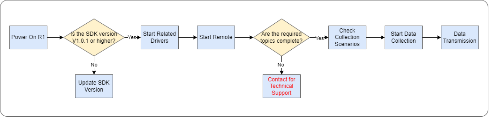
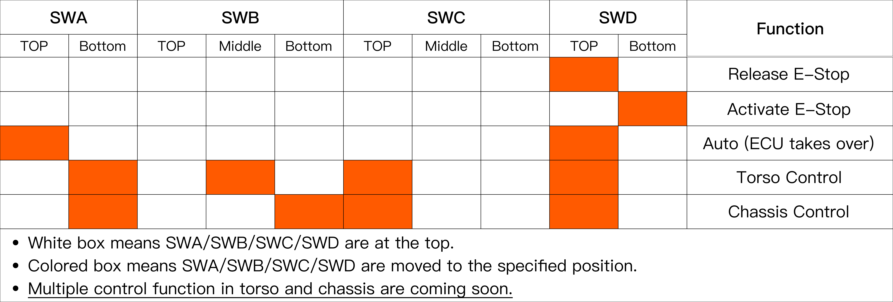
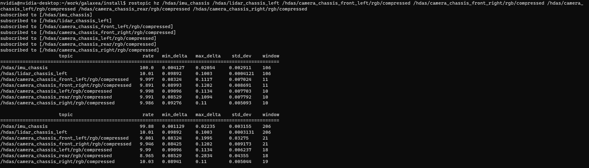
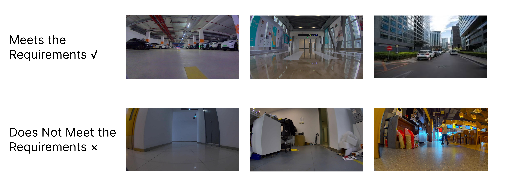
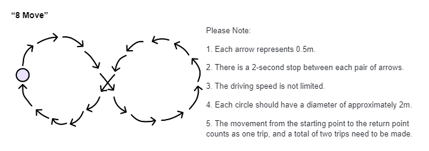
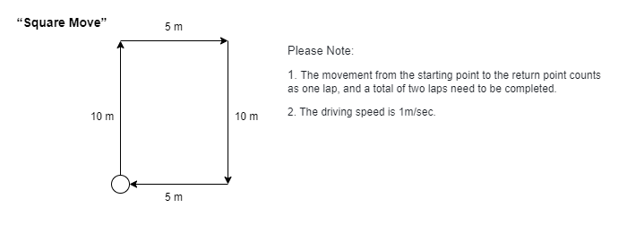

# R1 Sensor Calibration Data Collection Method

# Data Collection Process




## 1. Power On

Start R1.

## 2. Check SDK Version

Please confirm that the SDK version of the R1 system is V1.0.1 or higher.

Click [here](https://github.com/userguide-galaxea/System_Version_Release/tree/main/R1/v1.0.1) to download the installation package, if you need.

## 3. Start Related Drivers

**Step 1: Kill existing ROS nodes.**

```Bash
# The following commands will terminate all TMUX.
sudo tmux kill-server
tmux kill-server
pkill -9 ros
```

**Step 2: Start CAN driver.**

```Bash
sudo ip link set dev can0 type can bitrate 1000000 dbitrate 5000000 fd on
# If "RTNETLINK answers: Device or resource busy" appears, it indicates that the CAN transceiver has been configured and is currently running.
sudo ip link set up can0
```

**Step 3: Strart TMUX.**

```Bash
tmux
```

**Step 4: Start roscore.**

```Bash
roscore
```

**Step 5: Press `Ctrl + B` then `C` to create a new terminal, and execute the launch file.  Start HDAS.**

```Bash
source ~/work/galaxea/install/setup.bash
roslaunch HDAS hdas.launch
```

**Step 6: Press `Ctrl + B` then `C` to create a new terminal, and execute the launch file.   Start Chassis Control.**

```Bash
source ~/work/galaxea/install/setup.bash
roslaunch mobiman r1_chassis_control.launch
```

**Step 7: Press `Ctrl + B` then `C` to create a new terminal, and execute the launch file. Start Lidar driver.**

```Bash
source ~/work/galaxea/install/setup.bash
roslaunch livox_ros_driver2 msg_MID360.launch
```

**Step 8: Press `Ctrl + B` then `C` to create a new terminal, and execute launch file. Start Camera driver.**

```Bash
source ~/work/galaxea/install/setup.bash
sudo chmod 777 /dev/ttyTHS1
roslaunch signal_camera signal_camera.launch
```

## 4. Start Remote Control

<span style="color:red;">**Note: Ensure that all switches (SWA/SWB/SWC/SWD) are in the top position before you do any actions. This will place the machine in a stop state, preventing the robot from operating. ** </span>

The following table shows how to switch SWA/SWB/SWC/SWD to different positions in different functions.



Before you use the joystick controller to control the robot, you must start CAN driver and other programs. For detailed instructions, please refer to the [4.3](R1_Step_by_Step_Guide.md/#43-start-can-driver), [4.4](R1_Step_by_Step_Guide.md/#44-the-first-self-check), [4.5](R1_Step_by_Step_Guide.md/#45-stand-up) and [5](R1_Step_by_Step_Guide.md/#5-install-arms) in Step-By-Step Startup Guide. After that, you can move each switch to a specified position and control the robot by the following steps.


## 5. Check Topic

Before starting data collection, ensure the following topics are available, and verify that their types and frame rates are normal.

```Bash
rostopic hz /hdas/imu_chassis /hdas/lidar_chassis_left /hdas/camera_chassis_front_left/rgb/compressed /hdas/camera_chassis_front_right/rgb/compressed /hdas/camera_chassis_left/rgb/compressed /hdas/camera_chassis_rear/rgb/compressed /hdas/camera_chassis_right/rgb/compressed
```



<table style="width: 100%; border-collapse: collapse;">
    <thead>
        <tr style="background-color: black; color: white; text-align: left;">
            <th style="width: 300px; padding: 8px; border: 1px solid #ddd;">Sensor Type</th>
            <th style="width: 400px; padding: 8px; border: 1px solid #ddd;">Topics</th>
            <th style="width: 400px; padding: 8px; border: 1px solid #ddd;">Message Type</th>
            <th style="width: 400px; padding: 8px; border: 1px solid #ddd;">Frame Rate</th>            
        </tr>
    </thead>
    <tbody>
        <tr style="background-color: white; text-align: left;">
            <td style="padding: 8px; border: 1px solid #ddd;">Lidar</td>
            <td style="padding: 8px; border: 1px solid #ddd;">/hdas/lidar_chassis_left</td>
            <td style="padding: 8px; border: 1px solid #ddd;">sensor_msgs/PointCloud2</td>
            <td style="padding: 8px; border: 1px solid #ddd;">10 Hz</td>   
        </tr>
        <tr style="background-color: white; text-align: left;">
            <td style="padding: 8px; border: 1px solid #ddd;">Camera</td>
            <td style="padding: 8px; border: 1px solid #ddd;">/hdas/camera_chassis_front_left/rgb/compressed <br>/hdas/camera_chassis_front_right/rgb/compressed <br>/hdas/camera_chassis_left/rgb/compressed <br>/hdas/camera_chassis_rear/rgb/compressed <br>/hdas/camera_chassis_right/rgb/compressed </td>
            <td style="padding: 8px; border: 1px solid #ddd;">sensor_msgs/CompressedImage   </td>
            <td style="padding: 8px; border: 1px solid #ddd;">10 Hz</td>   
        </tr>
        <tr style="background-color: white; text-align: left;">
            <td style="padding: 8px; border: 1px solid #ddd;">wheel</td>
            <td style="padding: 8px; border: 1px solid #ddd;">/hdas/feedback_chassis</td>
            <td style="padding: 8px; border: 1px solid #ddd;">sensor_msgs/JointState</td>
            <td style="padding: 8px; border: 1px solid #ddd;">200 Hz</td>   
        </tr>
        <tr style="background-color: white; text-align: left;">
            <td style="padding: 8px; border: 1px solid #ddd;">imu</td>
            <td style="padding: 8px; border: 1px solid #ddd;">/hdas/imu_chassis</td>
            <td style="padding: 8px; border: 1px solid #ddd;">sensor_msgs/Imu</td>
            <td style="padding: 8px; border: 1px solid #ddd;">100 Hz</td> 
        </tr>        
        </tr>
    </tbody>
</table>


## 6. Data Collection Scenarios

Examples of compliant data collection scenarios: Well-lit, spacious environments over 100 square meters, with diverse textures and structures, and no dynamic objects. For example, a well-lit underground parking garage or a sparsely populated office park.

Examples of non-compliant data collection scenarios: Narrow spaces, environments with simple textures and structures, poor lighting, or environments with many dynamic objects, such as narrow corridors, white-walled rooms, crowded restaurants, or offices.



## 7. Data Collection Route

When calibrating the R1 sensors, a total of 2 sets of data need to be collected. This can be done by recording ROS bag files to gather the required data.

```Bash
rosbag record -a
```

1. 8-move
   

2. Square-move
   


## 8. Data Transmission

Return the bag files.