# R1 Step-By-Step Startup Guide

In this step-by-step guide, we will provide detailed instructions on how to unpack Galaxea R1 correctly, connect cables, install the robot arm, and how to remotely control R1 to achieve better communication and explore more functions.

## Instruction Video
<iframe width="720" height="540" src="https://www.youtube.com/embed/l3ULLs7gBdI?si=yIIOsdgYPhBADIAt" title="YouTube video player" frameborder="0" allow="accelerometer; autoplay; clipboard-write; encrypted-media; gyroscope; picture-in-picture; web-share" referrerpolicy="strict-origin-when-cross-origin" allowfullscreen></iframe>


## 1. Item List Check

When you receive our products, please check whether the items in the box are complete according to the following list.

<table style="width: 100%; border-collapse: collapse;">
    <thead>
        <tr style="background-color: black; color: white; text-align: left;">
            <th style="width: 300px; padding: 8px; border: 1px solid #ddd;">Item</th>
            <th style="width: 400px; padding: 8px; border: 1px solid #ddd;">Quantity</th>
        </tr>
    </thead>
    <tbody>
        <tr style="background-color: white; text-align: left;">
            <td style="padding: 8px; border: 1px solid #ddd;">R1 Base</td>
            <td style="padding: 8px; border: 1px solid #ddd;">1</td>
        </tr>
        <tr style="background-color: white; text-align: left;">
            <td style="padding: 8px; border: 1px solid #ddd;">A1 Arm</td>
            <td style="padding: 8px; border: 1px solid #ddd;">2</td>
        </tr>
        <tr style="background-color: white; text-align: left;">
            <td style="padding: 8px; border: 1px solid #ddd;">G1</td>
            <td style="padding: 8px; border: 1px solid #ddd;">2</td>
        </tr>
        <tr style="background-color: white; text-align: left;">
            <td style="padding: 8px; border: 1px solid #ddd;">Joystick Controller</td>
            <td style="padding: 8px; border: 1px solid #ddd;">1</td>
        </tr>
        <tr style="background-color: white; text-align: left;">
            <td style="padding: 8px; border: 1px solid #ddd;">Hex-Key Wrench Set</td>
            <td style="padding: 8px; border: 1px solid #ddd;">1</td>
        </tr>
        <tr style="background-color: white; text-align: left;">
            <td style="padding: 8px; border: 1px solid #ddd;">Charger & Cable Set</td>
            <td style="padding: 8px; border: 1px solid #ddd;">1</td>
        </tr>          
        <tr style="background-color: white; text-align: left;">
            <td style="padding: 8px; border: 1px solid #ddd;">Wiring Harness Repairing Bag</td>
            <td style="padding: 8px; border: 1px solid #ddd;">1</td>
        </tr>     
        </tr>
    </tbody>
</table>

Also, prepare the following items:

<table style="width: 100%; border-collapse: collapse;">
    <thead>
        <tr style="background-color: black; color: white; text-align: left;">
            <th style="width: 300px; padding: 8px; border: 1px solid #ddd;">Item</th>
            <th style="width: 400px; padding: 8px; border: 1px solid #ddd;">Quantity</th>
        </tr>
    </thead>
    <tbody>
        <tr style="background-color: white; text-align: left;">
            <td style="padding: 8px; border: 1px solid #ddd;">Display & Keyboard & Mouse</td>
            <td style="padding: 8px; border: 1px solid #ddd;">1</td>
        </tr>
        <tr style="background-color: white; text-align: left;">
            <td style="padding: 8px; border: 1px solid #ddd;">Computer</td>
            <td style="padding: 8px; border: 1px solid #ddd;">1</td>
        </tr>
        <tr style="background-color: white; text-align: left;">
            <td style="padding: 8px; border: 1px solid #ddd;">WiFi Network</td>
            <td style="padding: 8px; border: 1px solid #ddd;">1</td>
        </tr>
                <tr style="background-color: white; text-align: left;">
            <td style="padding: 8px; border: 1px solid #ddd;">HDMI Cable</td>
            <td style="padding: 8px; border: 1px solid #ddd;">1</td>
        </tr>        
    </tbody>
</table>


<u>Note: To ensure the normal operation of the product, place R1 in a dry and well-ventilated environment, and ensure that there are no obstacles or dangerous items around.</u>


## 2. Unboxing

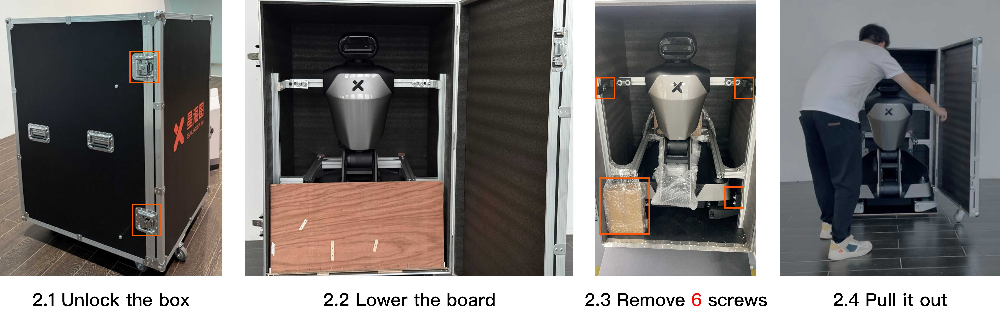
### 2.1 Unlock the Box

Locate two locks on the left side of the box. Open the two locks on the left side of the box door, take out the lock tabs and rotate counterclockwise to open the front door.

<u>You will see a folded R1 with head, chest cavity, torso, chassis and no arms, a sealed box containing a full set of screwdrivers and a joystick controller, and replacement wiring harnesses.</u>

### 2.2 Lower the board

There will be a wooden board which is used to enable R1 to go downhill along it. Lower the board on the ground.

### 2.3 Remove Box Fixings

Use the L-hex key (M6) to remove six fixing screws, as shown in the figure.

### 2.4 Pull It Out

It might require at least two people to pull the robot out of the box to avoid collision.


### 2.5 Remove Chassis Fixings

There are fixings on both sides of the front and at the rear of the chassis. To remove them, you should:

1. Rotate the wheels of the fixings to both sides to expose the fixed screws.
2. Use the matching L-hex key (M6) to remove six fixing screws on the wheels.
3. Turn the wheels back to their original positions.

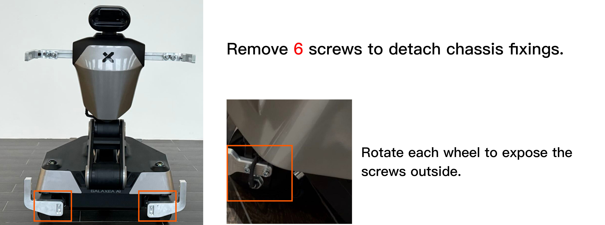


### 2.6 Detach Rear Shell

To detach the rear shell, you should:

1. Open the peripheral interface cover on the rear shell.
2. Use the L-hex key (M4) to remove two M4 screws underneath the cover.
3. Use the L-hex key (M5) to remove two M5 screws on the side of the chest shell.

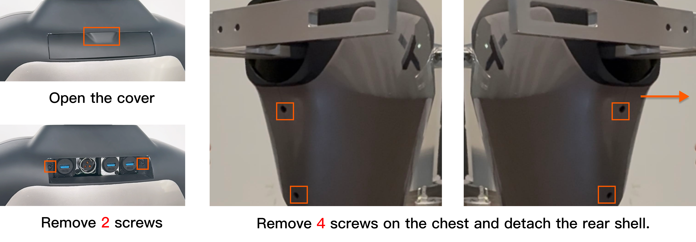

### 2.7 Detach Front Shell

To detach the front shell, you should use the L-hex key (M5) to remove six M5 screws on two sides of the chest, as boxed in the figure.

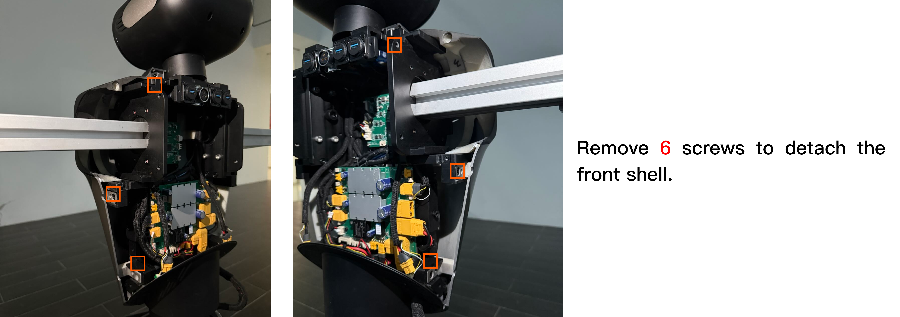

### 2.8 Remove Arm Fixings

To remove arm fixing stick, you should use L-hex key (M5) to remove two screws inside the chest, as boxed in the figure.

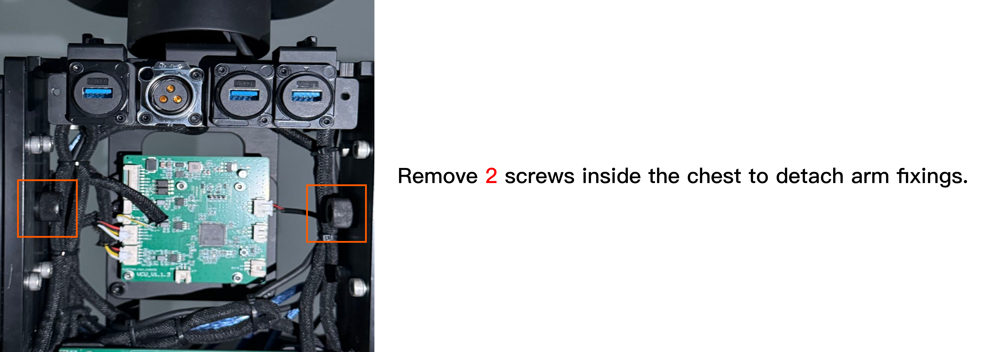

## 3. Turn On R1

### 3.1 HDMI and USB Connecting

<span style="color:red;">**Important: For your safety, please power off R1 before connecting any cables.**</span>

To connect, you should:

1. Use the L-hex key (M3) to remove two M3 screws on the peripheral interface cover on the chassis.

2. Connect HDMI cable to the chassis and the display. Please ensure a firm connection to avoid looseness.
   

3. Connect the USB interface to the mouse and keyboard and the chest. Please ensure a firm connection to avoid looseness.
   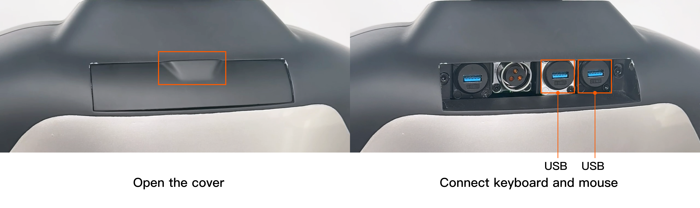

### 3.2 Power On

To turn on Galaxea R1, please press the boat-shaped power button on the bottom of the rear of the chassis. To turn off, switch off the power button.

<span style="color:red;">Note: Please keep the emergency stop button raised and turn on the boat-shaped power button located at the bottom of the left rear of the chassis. If the power was previously on, you need to turn it off and then turn it on again; otherwise, the display may not be able to work.</span>

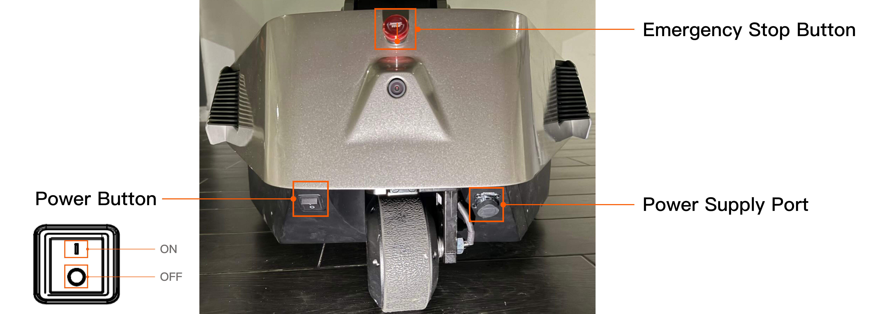

If the robot has battery inside the chassis, you can turn on the power button as the above said, skip 3.2.1 and 3.2.2 and go to [4.Connecting to R1](#4-connecting-to-r1).

#### 3.2.1 Charging

If the robot has battery inside the chassis but out of power, you should charge it first and then turn on the button.
The power supply port is located at the bottom of the rear of the chassis. To charge the robot, you should:

1. Unscrew the plug case.
2. Insert the power cord into the port.
   When the red light on the charger is on, it indicates that R1 is charging.

#### 3.2.2 Battery Changing

If the robot has no battery inside the chassis, you should install it first.
The battery is located at the bottom of the right side of the chassis. To remove and change the battery, you should:

1. Remove two screws on the cover and slide to right to detach it.
2. Push the battery into the chassis.
3. Connect the battery cable to the chassis.
4. Close the cover.


## 4. Connecting to R1

There are two ways to connect to R1, locally or remotely.

### 4.1 Locally Connecting

If remote connection and control of R1 is not needed, continue to operate on the original display and keyboard, and keep the HDMI and USB cables connected. Then go to [4.3 Start CAN Driver](#43-start-can-driver), continuing the process.

### 4.2 Remotely Connecting

**4.2.1 Obtain IP address**

After R1 is powered on, wait for the display to show the desktop. Then, you should:

1. Click "Settings" and connect to WiFi.
   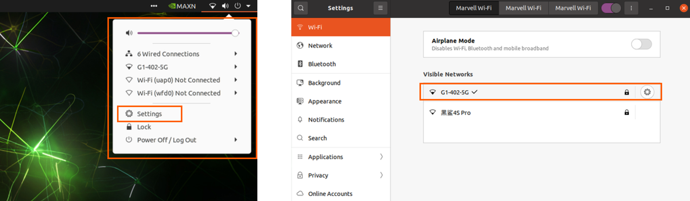

2. Open a terminal and enter the following command:

    ```bash
    ifconfig mlan0
    ```

3. Find `mlan0`. The IP address of R1 Orin is: `192.168.xxx.xxx`.
   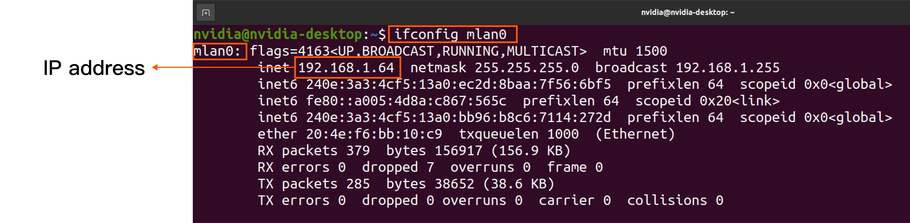

**4.2.2 Connecting by SSH**

To remotely connect and futher control the robot, you should:

1. Use the other computer.

2. Enter the following command in the terminal to connect Orin.

    ```bash
    ssh nvidia@IP address
    # Enter the password  (default: nvidia)
    ```

3. If the connection is successful, disconnect the HDMI and USB cable, and close the peripheral interface covers on the chassis and chest, to avoid affecting the activity range.

4. Then go to [4.3 Start CAN Driver](#43-start-can-driver), continuing the process.

**<u>If the connection fails, please contact us in time for technical support.</u>**

### 4.3 Start CAN Driver

During the whole process of controlling R1, you need to open multiple terminals. We recommend you to use TMUX. Common instructions are as follows:

- Create a new terminal: Press `Ctrl + B` then `C`.
- Switch terminals: Press `Ctrl + B` then press number which indicates the number of terminal windows.

Now, you can start CAN driver in the following steps.

1. Start TMUX.

    ```bash
    tmux
    ```

   2. Start FDCAN Communication

      ```Bash
      sudo ip link set dev can0 type can bitrate 1000000 dbitrate 5000000 fd on
      # If "RTNETLINK answers: Device or resource busy" appears, it indicates that the CAN transceiver has been configured and is currently running.
      sudo ip link set up can0
      ```

3. Start roscore

    ```bash
    roscore    
    ```

4. Press `Ctrl + B` then `C` to create a new terminal. Then start HDAS.

    ```bash
    source ~/work/galaxea/install/setup.bash
    roslaunch HDAS hdas.launch
    ```


### 4.4 The First Self-Check

<span style="color:red;">**Important: Before you do any actions on R1, you must complete R1 self-checks to ensure the safety.**</span>

Make sure that:

- R1 has pulled out of the box and all fixings are removed.
- R1 remains folded and does not have the robot arms installed.

Now, you can start the first self-check in the following steps.

1. Press `Ctrl + B` then `C` to create a new terminal. Then start self-check.
   ```shell
   source ~/work/galaxea/install/setup.bash
   rosrun HDAS check_node 
   #after executed the command, please press 0. (0 means the self-check when the arms are uninstalled.)
   ```

2. If it shows "self-check completed" as shown below, press `Ctrl + C` to exit.
   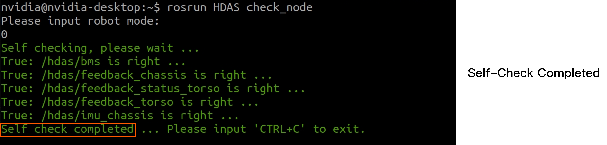

3. <u>If it appears warning, please contact us in time for technical support.</u>
   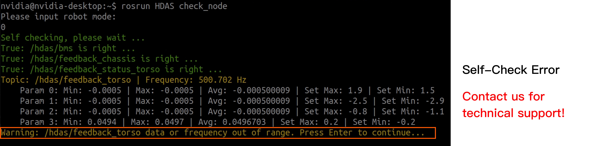

### 4.5 Stand Up

<span style="color:red;">**Important: For your safety, please ensure that R1 is out of the box and there is no interference or fixings. Otherwise, the torso may enter the locked-rotor protection state.**</span>

Once the self-check is completed, you can make R1 standing up by commanding torso and chassis and using the joystick controller.

#### 4.5.1 Start Torso Control

Press `Ctrl + B` then `C` to create a new terminal. Then, start arm and torso control.

```bash
source ~/work/galaxea/install/setup.bash
roslaunch mobiman r1_jointTrackerdemo.launch
```

#### 4.5.2 Start Chassis Control

Press `Ctrl + B` then `C` to create a new terminal. Then, start chassis control.

```bash
source ~/work/galaxea/install/setup.bash
roslaunch mobiman r1_chassis_control.launch
```

#### 4.5.3 Joystick Controller Operation

<span style="color:red;">Note: Ensure that all switches (SWA/SWB/SWC/SWD) are in the top position before you do any actions. </span> This will place the machine in a stop state, preventing the robot from operating. Please visit [Joystick Controller Guide](R1_Overview.md/#joystick-controller-teleoperation) in Galaxea R1 User Guide for more detailed information and operation, if you need.

1. To turn on/off the controller, press and hold both power buttons until the touchscreen lights up/off.
2. Switch SWA to the bottom, and switch SWB to the middle.
3. Move the left joystick to the upper left, and move the right joystick to the upper right simultaneously, as shown below. Waiting for 3 seconds, **R1 will stand up**.

<div style="text-align: center;">
  
</div>

## 5. Install Arms

<span style="color:red;">**Important: For your safety, please make R1 stand up and powered off before installing arms.**</span>

1.Attach gripper to arm. To remove them, simply reverse these steps.


   - Alignment Check: Ensure that the three mounting holes around the gripper are aligned with the three mounting holes at the end of A1.
   - Screw Fixation: Once aligned, secure and tighten the gripper to the arm using the three screws provided.
   - Final Check: After tightening the screws, double-check the alignment and stability of the gripper. It should be firmly attached and not wobble or move independently of the robot arm.

2.Use the hex L-key (5 mm) and four M6 screws to secure the arm.

   <span style="color:red;">**Note: When installing the robot arm, you must ensure that the ports on the arm base are facing backward, as shown in the figure.**</span>
   

3.Connect the power and CAN cable provided with A1 arms to arm base ports.
   Before plugging CAN cable, you must remove the resistance rod.
   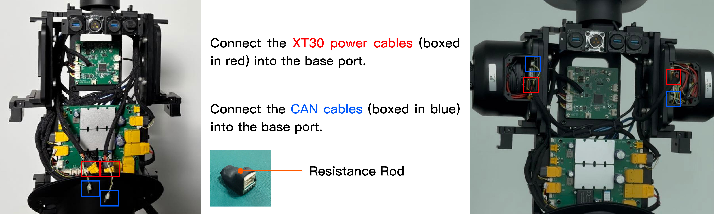

4.After confirming that the communication connection with the robot arms is successful, reattach the covers by reversing the steps in [2.6 Detach Rear Shell](#26-detach-rear-shell) and [2.7 Detach Front Shell](#27-detach-front-shell) above.

### 5.1 The Second Self-Check

Before you start the self-check, please make sure:

- R1 has stood up.
- R1 has arms installed correctly. Elbows are facing outward, where the silver part is on the inside and the black part is on the outside, and gripper cables are facing outward.
  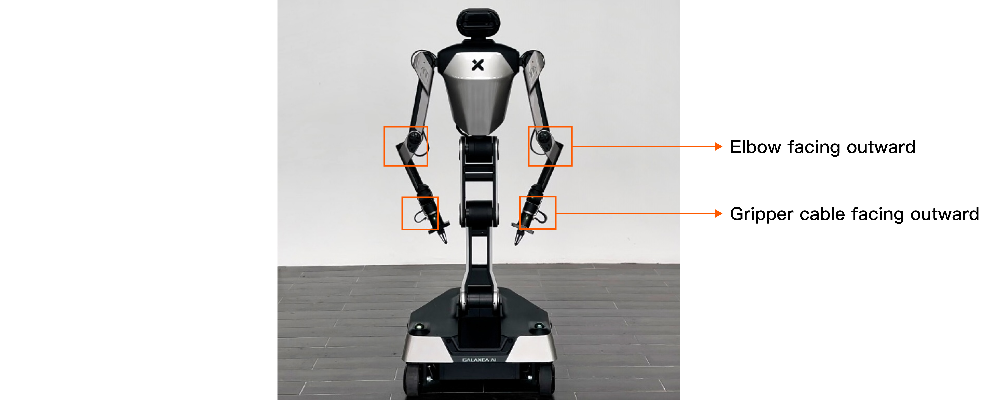

Then,  <span style="color:red;">**power it on**</span> and:

1. Follow and complete the commands in [4.3 Start CAN Driver](#43-start-can-driver).

2. Press `Ctrl + B` then `C` to create a new terminal. Now, start the second self-check.

    ```bash
    source ~/work/galaxea/install/setup.bash
    rosrun HDAS check_node #after executed the command, please press 1. (1 means the self-check when the arms are installed.)
    ```

3. Follow and complete the commands in [4.5.1 Start Torso Control](#451-start-torso-control) and [4.5.2 Start Chassis Control](#452-start-chassis-control).

## 6. Demo Testing

<span style="color:red;">**Important: Before you do any actions on R1, you must complete R1 self-checks to ensure the safety. **</span>

After completing all the operations above, <span style="color:red;">move R1 to an open area to ensure there are no obstacles around. </span> Then remotely command R1 to perform demo testing.

You can find the document and python scripts in [R1_Demo](R1_demo_test.md).

## 7. R1 Sensor Calibration Data Collection Method\
Click [here](R1_Sensor_Calibration_Data_Collection_Method.md) to get the detailed information of the R1 Sensor Calibration Data Collection Method.
