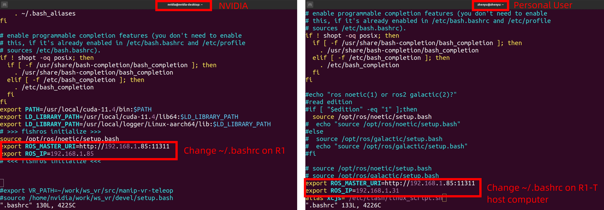
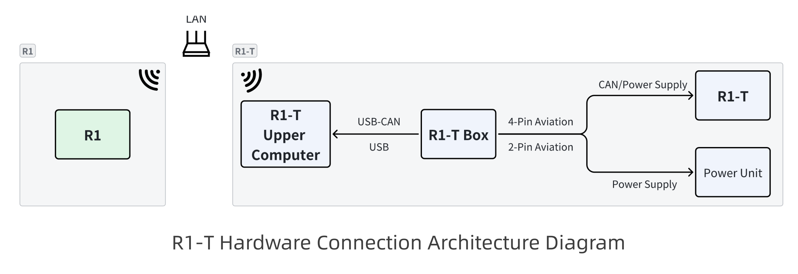
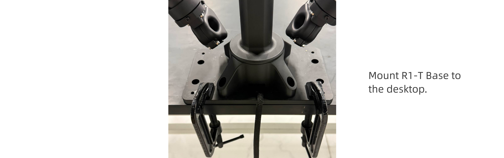
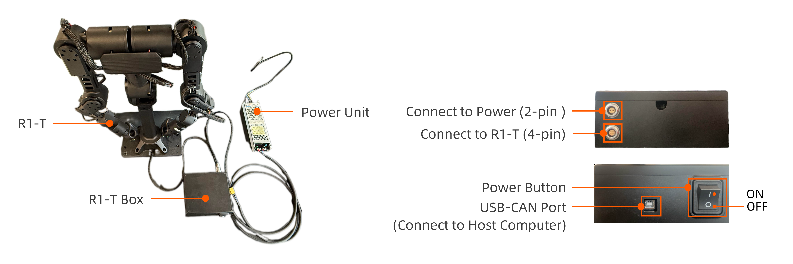
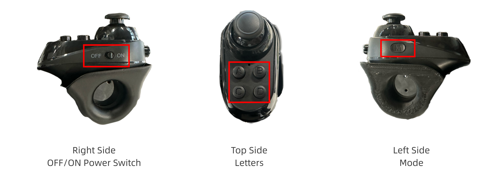
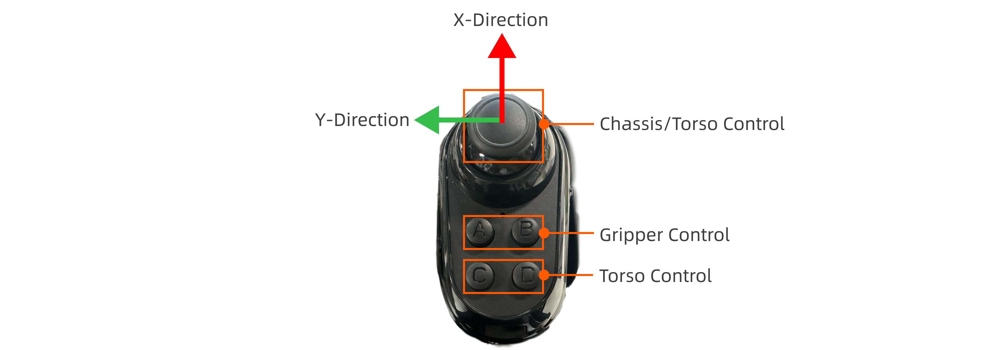
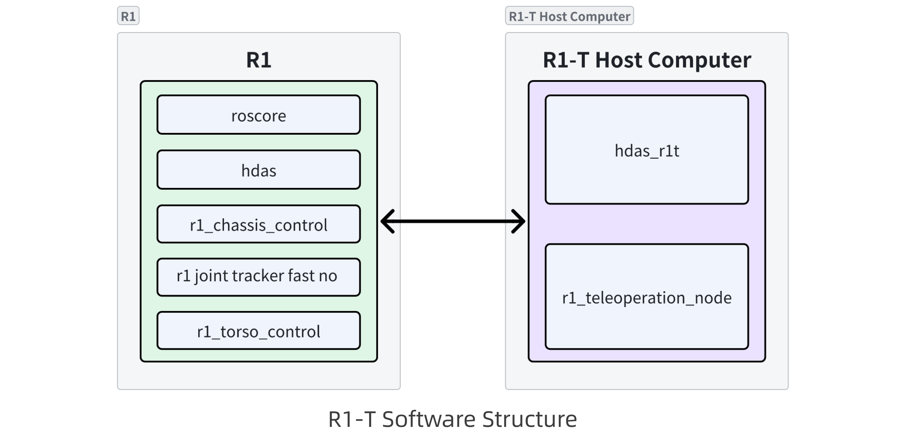
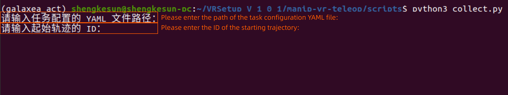
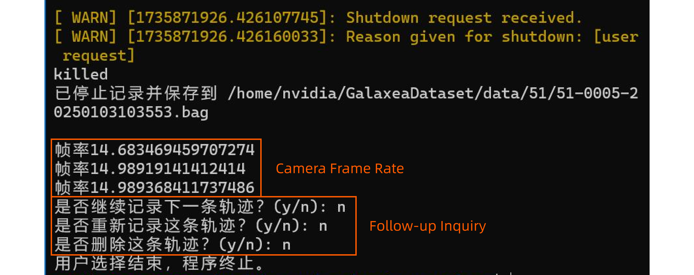

# R1 Teleop Usage Tutorial

Welcome to R1 Teleop (R1-T) — the isomorphic teleoperation platform designed specifically for Galaxea R1. 

## 1. Product Introduction

R1 Teleop is a platform which is designed with a scaled-down version that perfectly replicates the full functionality of the R1, enabling full-body force feedback teleoperation and full-joint mapping. It also supports force feedback from the body to the remote control side, ensuring precise synchronization of operations with millimeter-level accuracy and millisecond-level response time. 

The following tutorial will guide you through the installation and setup of R1 Teleop, helping you quickly experience this high-performance teleoperation platform.

## 2. Unboxing

Please check whether all items in the shipping container are present.

<table style="width: 100%; border-collapse: collapse;">
    <thead>
        <tr style="background-color: black; color: white; text-align: left;">
            <th style="width: 300px; padding: 8px; border: 1px solid #ddd;">Item</th>
            <th style="width: 400px; padding: 8px; border: 1px solid #ddd;">Quantity</th>
        </tr>
    </thead>
    <tbody>
        <tr style="background-color: white; text-align: left;">
            <td style="padding: 8px; border: 1px solid #ddd;">R1-T Base</td>
            <td style="padding: 8px; border: 1px solid #ddd;">1</td>
        </tr>
        <tr style="background-color: white; text-align: left;">
            <td style="padding: 8px; border: 1px solid #ddd;">R1-T Box</br> 
(Power/Communication Box)</td>
            <td style="padding: 8px; border: 1px solid #ddd;">1</td>
        </tr>
        <tr style="background-color: white; text-align: left;">
            <td style="padding: 8px; border: 1px solid #ddd;">G-clips</td>
            <td style="padding: 8px; border: 1px solid #ddd;">2</td>
        </tr>
        <tr style="background-color: white; text-align: left;">
            <td style="padding: 8px; border: 1px solid #ddd;">Power </td>
            <td style="padding: 8px; border: 1px solid #ddd;">1</td>
        </tr>
        <tr style="background-color: white; text-align: left;">
            <td style="padding: 8px; border: 1px solid #ddd;">USB/CAN Cable</td>
            <td style="padding: 8px; border: 1px solid #ddd;">1</td>
        </tr>
    </tbody>
</table>

## 3. Preparation Before Start

### 3.1 Hardware Preparation

<table style="width: 100%; border-collapse: collapse;">
    <thead>
        <tr style="background-color: black; color: white; text-align: left;">
            <th style="width: 300px; padding: 8px; border: 1px solid #ddd;">Item</th>
            <th style="width: 100px; padding: 8px; border: 1px solid #ddd;">Quantity</th>
            <th style="width: 400px; padding: 8px; border: 1px solid #ddd;">Notes</th>
        </tr>
    </thead>
    <tbody>
        <tr style="background-color: white; text-align: left;">
            <td style="padding: 8px; border: 1px solid #ddd;">R1-T Host Computer</td>
            <td style="padding: 8px; border: 1px solid #ddd;">1</td>
            <td style="padding: 8px; border: 1px solid #ddd;">System: Ubuntu 20.04 ROS Noetic 
            </br><span style="color:red;">Note: Do not use the R1-T host computer in a virtual machine, as this may prevent Bluetooth controller connection.</span></td>
        </tr>
        <tr style="background-color: white; text-align: left;">
            <td style="padding: 8px; border: 1px solid #ddd;">Local Area Network (LAN)</td>
            <td style="padding: 8px; border: 1px solid #ddd;">1</td>
            <td style="padding: 8px; border: 1px solid #ddd;">Used for wireless communication between R1 and R1 Teleop.</td>
        </tr>
        <tr style="background-color: white; text-align: left;">
            <td style="padding: 8px; border: 1px solid #ddd;">Ethernet Cable</td>
            <td style="padding: 8px; border: 1px solid #ddd;">1</td>
            <td style="padding: 8px; border: 1px solid #ddd;">Used to check the IP address of R1.</td>
        </tr>
    </tbody>
</table>

### 3.2 Software Preparation

#### 3.2.1 **Download and Unzip the Folder.**

Please download and extract the SDK file package of R1 from the R1 main body (this is the package of R1 main body in the customer's release version).

- Baidu Cloud：[https://pan.baidu.com/s/1TeDBtkqUOXUPwE9fdivQ7w?pwd=gr1t](https://pan.baidu.com/s/1TeDBtkqUOXUPwE9fdivQ7w?pwd=gr1t)
- Google Drive：[https://drive.google.com/drive/folders/1yMCa5XaNEa0SFwQ_b2NTLBQz5o1i9Z1h?usp=sharing](https://drive.google.com/drive/folders/1yMCa5XaNEa0SFwQ_b2NTLBQz5o1i9Z1h?usp=sharing)

#### 3.2.2 **Install Software Dependencies**

Please install the required software dependencies on the R1-T host computer.

```Bash
sudo apt install ros-noetic-trac-ik
sudo apt install ros-noetic-joy
sudo apt install tmux tmuxp
```

#### 3.2.3 **Modify the** **`/.bashrc`** **File**

Modify the ROS IP settings on both the R1 and R1-T host computers. Follow these steps:

1. Add the following two lines to the end of the **`/.bashrc`** file on the R1:

      ```Bash
      export ROS_MASTER_URI=http://The IP address of R1:11311
      export ROS_IP= The IP address of R1
      ```

2. Add the following two lines to the end of the **`/.bashrc`** file on the R1-T host computer:

      ```Bash
      export ROS_MASTER_URI=http://The IP address of R1:11311
      export ROS_IP= The IP address of the R1-T host computer
      ```

3. **Example:**

      


## 4. R1 Teleop Connection



### 4.1 Securing the Device

Use the G-clips to secure the R1-T Base to the desktop, as shown in the diagram below:



### 4.2 Connecting the Device

Following the hardware connection architecture diagram:



1. Connect the CAN cable at the bottom rear of the R1-T Base to the 4-pin aviation connector on the R1-T Box.
2. Connect the power supply cable to the 2-pin aviation connector on the R1-T Box.
3. Connect the USB-CAN cable from the R1-T Box to the USB port of the host computer.

<span style="color:red;">**Note: After completing the connections, do not power on immediately. Please follow the steps below to proceed.**</span>

### 4.3 Powering On

After securing the R1-T Base to the desktop, **place the arms and torso in the initial position** as shown in the diagram below. <span style="color:red;">**Ensure that the J4, J5, and J6 joints of both arms, as well as the R1-T Base, are at zero-point (initial posture)**</span>, then you may insert the power unit into the power outlet and press the power button on the R1-T to turn it on.


<span style="color:red;">**Note: Before starting the R1 Teleop each time, make sure to adjust to its initial posture. Failing to do so may pose a risk during operation.**</span>

### 4.4 **Connect Bluetooth Remote Controller**

Please be sure to connect two arms to the R1-T host conputer in sequence, ensuring that <span style="color:red;">**the left arm is connected first, followed by the right arm**</span>.

**Note: Due to program settings, to streamline the operation process, if the controller connection sequence is incorrect, please turn off the power and power it on again, then follow the correct sequence for connection.**

Connection steps are as follows:

1. Turn on Bluetooth on the remote controller. For both left and right-hand controllers, flip the “ON/OFF” switch on the right side of the controller, then press and hold the “M” button on the left side and the “B” button on the top of the controller.

2. Turn on Bluetooth on the host computer and connect to the two devices named "Magicsee R1."

3. After connecting, the message “Device Connected” should appear. Enter the following command to confirm if the connection is successful:
    ```Bash
    ls /dev/input/ | grep js
    ```

    When both`js0` (left arm) and `js1` (right arm) are returned simultaneously, the connection is successful.


4. Bluetooth Remote Controller Button Function Description
   

<table style="width: 100%; border-collapse: collapse;">
    <thead>
        <tr style="background-color: black; color: white; text-align: left;">
            <th style="width: 200px; padding: 8px; border: 1px solid #ddd;">Joystick/Button</th>
            <th style="width: 300px; padding: 8px; border: 1px solid #ddd;">Controller_Left</th>
            <th style="width: 300px; padding: 8px; border: 1px solid #ddd;">Controller_Right</th>
        </tr>
    </thead>
    <tbody>
        <tr style="background-color: white; text-align: left;">
            <td style="padding: 8px; border: 1px solid #ddd;">Joystick X - Positiver</td>
            <td style="padding: 8px; border: 1px solid #ddd;">Chassis moves forward (Vx is positive).</td>
            <td style="padding: 8px; border: 1px solid #ddd;">Torso moves upward (Vz is positive).</td>
        </tr>
        <tr style="background-color: white; text-align: left;">
            <td style="padding: 8px; border: 1px solid #ddd;">Joystick X - Negative</td>
            <td style="padding: 8px; border: 1px solid #ddd;">Chassis moves backward (Vx is negative).</td>
            <td style="padding: 8px; border: 1px solid #ddd;">Chassis rotates counterclockwise (W is positive).</td>
        </tr>
        <tr style="background-color: white; text-align: left;">
            <td style="padding: 8px; border: 1px solid #ddd;">Joystick Y - Positive</td>
            <td style="padding: 8px; border: 1px solid #ddd;">Chassis moves left (Vy is positive).</td>
            <td style="padding: 8px; border: 1px solid #ddd;">Chassis rotates counterclockwise (W is positive).</td>
        </tr>
                <tr style="background-color: white; text-align: left;">
            <td style="padding: 8px; border: 1px solid #ddd;">Joystick Y - Negative</td>
            <td style="padding: 8px; border: 1px solid #ddd;">Chassis moves right (Vy is negative).</td>
            <td style="padding: 8px; border: 1px solid #ddd;">Chassis rotates clockwise (W is negative).</td>
        </tr>
                <tr style="background-color: white; text-align: left;">
            <td style="padding: 8px; border: 1px solid #ddd;">Button A</td>
            <td style="padding: 8px; border: 1px solid #ddd;">Left gripper closes.</td>
            <td style="padding: 8px; border: 1px solid #ddd;">Right gripper closes.</td>
        </tr>
                <tr style="background-color: white; text-align: left;">
            <td style="padding: 8px; border: 1px solid #ddd;">Button B</td>
            <td style="padding: 8px; border: 1px solid #ddd;">Left gripper opens.</td>
            <td style="padding: 8px; border: 1px solid #ddd;">Right gripper opens.</td>
        </tr>
                <tr style="background-color: white; text-align: left;">
            <td style="padding: 8px; border: 1px solid #ddd;">Button C</td>
            <td style="padding: 8px; border: 1px solid #ddd;">N/A</td>
            <td style="padding: 8px; border: 1px solid #ddd;">Torso moves forward (Vx is positive).</td>
        </tr>
                <tr style="background-color: white; text-align: left;">
            <td style="padding: 8px; border: 1px solid #ddd;">Button D</td>
            <td style="padding: 8px; border: 1px solid #ddd;">N/A</td>
            <td style="padding: 8px; border: 1px solid #ddd;">Torso moves backward (Vx is negative).</td>
        </tr>
    </tbody>
</table>


## 5. Launch SDK



<span style="color:red;">**Note: The R1 software version must be V1.0.4 or higher. Click [here](R1_Software_Changelog/v1.0.4.md) to get the latest version.**</span>

During the whole process of controlling R1, you need to open multiple terminals. We recommend you to use TMUX. Common instructions are as follows:

- Create a new terminal: Press `Ctrl + B` then `C`. 
- Switch terminals: Press `Ctrl + B` then press number which indicates the number of terminal windows. 

Now, you can start CAN driver in the following steps.

### 5.1 Start R1

Execute the following conmands to start the robot.

```Python
cd ~/work/galaxea/install/share/startup_config/script
./ota_script.sh boot_teleop     
```

### 5.2 **Start** R1 Teleop

1. Start TMUX.

      ```Python
      tmux
      ```

2. Start FDCAN Communication

      ```Python
      sudo ip link set dev can0 type can bitrate 1000000 dbitrate 5000000 fd on
      sudo ip link set up can0
      ```

3. Press `Ctrl + C` to exit TMUX.

4. Start R1 Teleop

      ```Bash
      cd {your_path}/install/share/startup_config/script
      ./ota_script.sh boot
      ```

Note：`your_path` refers to the path where the SDK of R1 Teleop is located.

After completing the above steps, wait for 3 to 5 seconds and you can control R1 Teleop.

## 6. Data Collection

### 6.1 Data Collection Script

Please download and extract the R1 Teleop data acquisition program file package from the following link.

- Baidu Cloud：[https://pan.baidu.com/s/1WEQIQbMhe3fQ2wyKx160Lw?pwd=gr1t](https://pan.baidu.com/s/1WEQIQbMhe3fQ2wyKx160Lw?pwd=gr1t)
- Google Drive：[https://drive.google.com/drive/folders/1yMCa5XaNEa0SFwQ_b2NTLBQz5o1i9Z1h?usp=sharing](https://drive.google.com/drive/folders/1yMCa5XaNEa0SFwQ_b2NTLBQz5o1i9Z1h?usp=sharing)

### 6.2 Data Collection Procedure

<span style="color:red;">Note: Please ensure that the teleoperation program on the R1 Base has been started correctly following the steps outlined in the previous sections.</span>

#### 6.2.1 Connecting to R1

1. Login R1. 

      ```Bash
      ssh nvidia@IP address
      # Enter the password  (default: nvidia)
      ```

2. Exexute the data collection command.

      ```Bash
      python3 colect_data.py
      ```

      <span style="color:red;">If the connection is successful, please disconnect the HDMI and USB cables, and close the peripheral interface covers on the chassis and torso to avoid limiting the range of motion.</span>

#### 6.2.2 Execute Data Collection Command

1. After connecting to R1, the system will prompt you to enter the path of the task configuration YAML file. Please enter the path of the pre-configured template YAML file:

      ```Bash
      ./sample_config.yaml
      ```

2. Enter the initial sequence number for the recorded action, for example: 0.

      

3. Press <span style="color:red;">**Enter**</span> to start recording. Press Enter again to stop recording once completed <span style="color:red;">(Do not use `Ctrl + C` to stop)</span>. After the recording ends, you can check the recorded actions in the output path. Please wait for the program to calculate the **three camera frequencies** from the recently recorded data packet.



#### 6.2.3 Follow-up Inquiry

Once the camera frequency calculation is complete, the system will sequentially ask the following questions. Please respond accordingly based on your selection.

<table style="width: 100%; border-collapse: collapse;">
    <thead>
        <tr style="background-color: black; color: white; text-align: left;">
            <th style="width: 300px; padding: 8px; border: 1px solid #ddd;">Inquiry</th>
            <th style="width: 400px; padding: 8px; border: 1px solid #ddd;">Description</th>
        </tr>
    </thead>
    <tbody>
        <tr style="background-color: white; text-align: left;">
            <td style="padding: 8px; border: 1px solid #ddd;">Continue recording the next trajectory?</td>
            <td style="padding: 8px; border: 1px solid #ddd;">Enter y: Start recording the next data packet, the number will automatically increment by 1. 
            </br>Enter n: Proceed to the next step.</td>
        </tr>
        <tr style="background-color: white; text-align: left;">
            <td style="padding: 8px; border: 1px solid #ddd;">Re-record the current trajectory?</br> 
(Power/Communication Box)</td>
            <td style="padding: 8px; border: 1px solid #ddd;">Enter y: Re-record the current data packet, the number will remain unchanged. 
</br>Enter n: Proceed to the next step.</td>
        </tr>
        <tr style="background-color: white; text-align: left;">
            <td style="padding: 8px; border: 1px solid #ddd;">Delete the current trajectory?</td>
            <td style="padding: 8px; border: 1px solid #ddd;">Enter y: Save the data and exit the program. 
            </br>Enter n: Delete the current data packet and exit the program.</td>
        </tr>
    </tbody>
</table>

If you encounter any issues during installation or startup, please contact us for technical support at support@galaxea.ai or 4008-780-980!