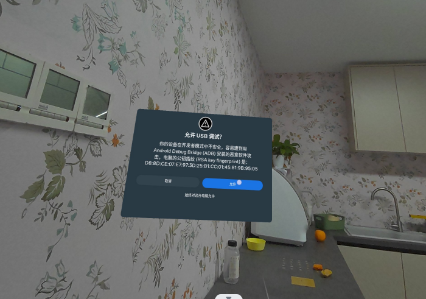
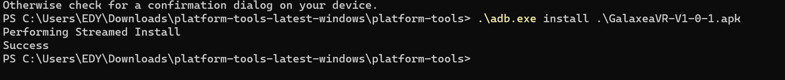
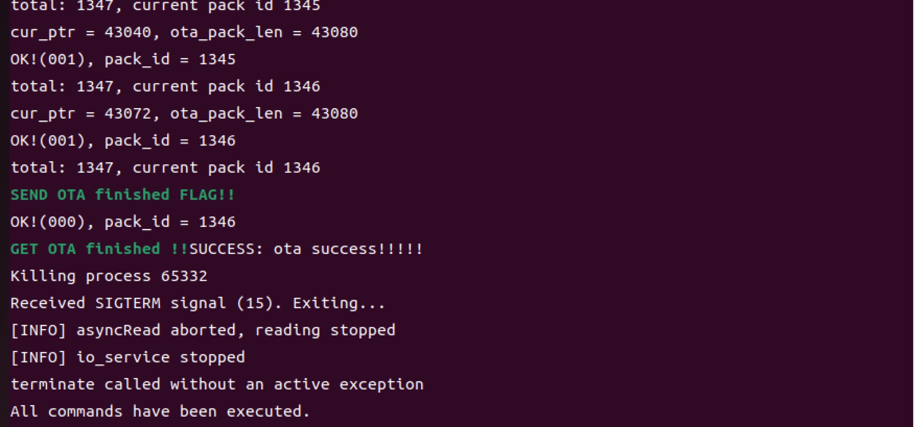
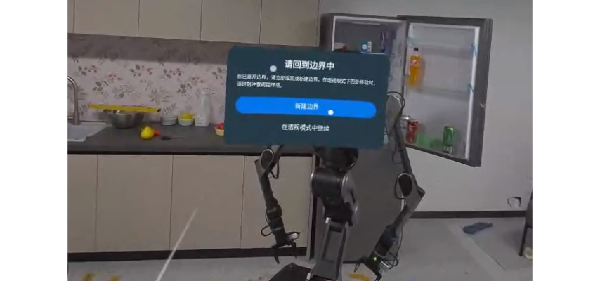
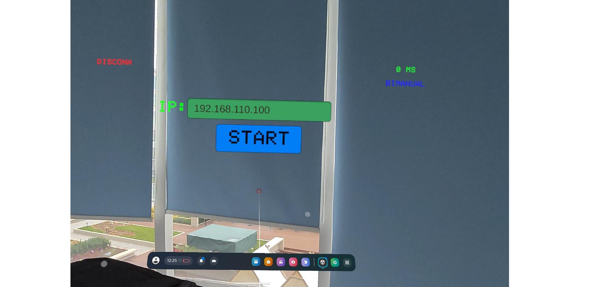
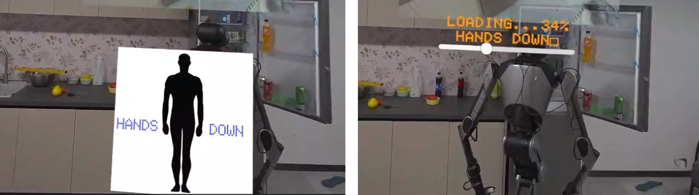
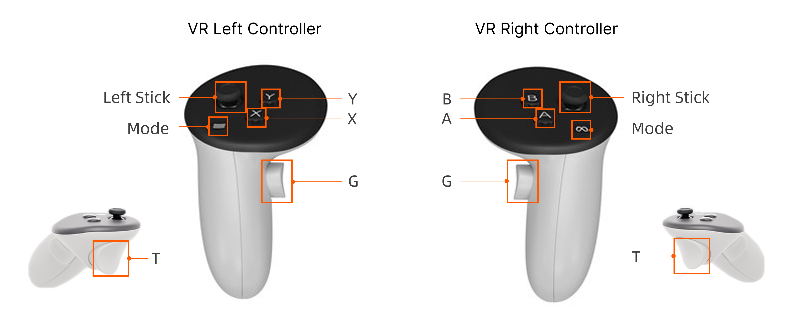
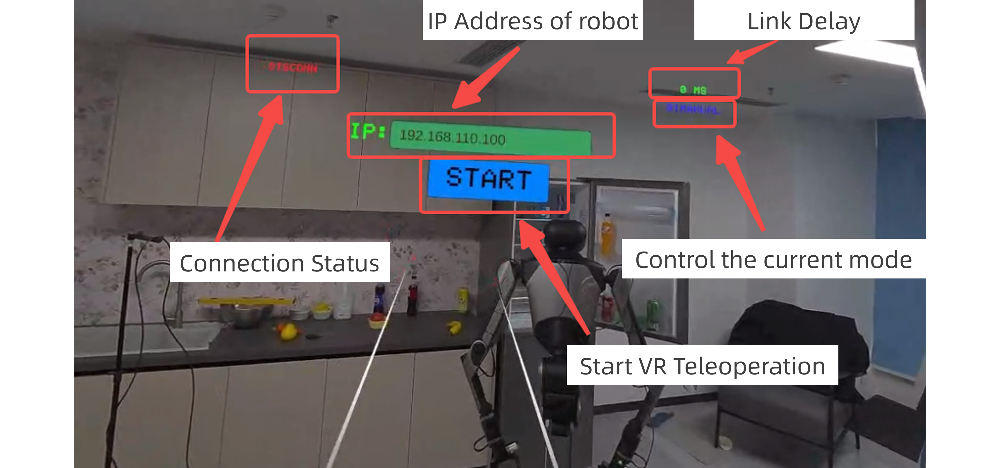

# VR Teleop Usage Tutorial

## 1. Product Introduction

The VR Teleop system provides an immersive remote control experience that enables the operator to control the R1 robot with precise feedback and real-time response. The system supports full-body synchronization and provides an intuitive and highly accurate operating interface with millimeter-level accuracy and millisecond response speed. The system is designed to interact seamlessly in complex environments and is ideal for tasks requiring fine and precise robotic control.

The following tutorial will provide a detailed introduction to the activation methods, user manual and actual video demonstrations of VR remote operation products, helping you quickly experience this high-performance remote operation platform.

## 2. Preparations Before Startup

### 2.1 Hardware Preparation

<table style="width: 100%; border-collapse: collapse;">
    <thead>
        <tr style="background-color: black; color: white; text-align: left;">
            <th style="width: 200px; padding: 8px; border: 1px solid #ddd;">item</th>
            <th style="width: 100px; padding: 8px; border: 1px solid #ddd;">quantity</th>
            <th style="width: 400px; padding: 8px; border: 1px solid #ddd;">Note</th>
        </tr>
    </thead>
    <tbody>
        <tr style="background-color: white; text-align: left;">
            <td style="padding: 8px; border: 1px solid #ddd;">Meta Quest 3 VR device</td>
            <td style="padding: 8px; border: 1px solid #ddd;">1</td>
            <td style="padding: 8px; border: 1px solid #ddd;">It includes one head-mounted device, two handheld remote controllers and a Type-C connection cable.</td>
        </tr>
        <tr style="background-color: white; text-align: left;">
                <td style="padding: 8px; border: 1px solid #ddd;">R1 Base</td>
            <td style="padding: 8px; border: 1px solid #ddd;">1</td>
            <td style="padding: 8px; border: 1px solid #ddd;">The robot body.</td>
        </tr>
        <tr style="background-color: white; text-align: left;">
            <td style="padding: 8px; border: 1px solid #ddd;">R1 Joystick Controller</td>
            <td style="padding: 8px; border: 1px solid #ddd;">1</td>
            <td style="padding: 8px; border: 1px solid #ddd;">Controls the R1 robot.</td>
        </tr>
        <tr style="background-color: white; text-align: left;">
            <td style="padding: 8px; border: 1px solid #ddd;">Host Computer</td>
            <td style="padding: 8px; border: 1px solid #ddd;">1</td>
            <td style="padding: 8px; border: 1px solid #ddd;">System：Ubuntu20.04 ROS Noetic</br>Used for upgrading the software program of R1 Base.</td>
        </tr>
        <tr style="background-color: white; text-align: left;">
            <td style="padding: 8px; border: 1px solid #ddd;">Local Area Network (LAN)</td>
            <td style="padding: 8px; border: 1px solid #ddd;">1</td>
            <td style="padding: 8px; border: 1px solid #ddd;">Used for connecting VR devices and R1 Base.</td>
        </tr>
    </tbody>
</table>


### 2.2 Software Preparation

Please download and extract the R1 remote operation package version V1.1.0.

- Baidu Cloud：[https://pan.baidu.com/s/136OzRy-4_8b5USQg3btJCQ?pwd=r1vr](https://pan.baidu.com/s/136OzRy-4_8b5USQg3btJCQ?pwd=r1vr)
- Google Drive：[https://drive.google.com/drive/folders/1NADvlQDxJ8LASTA42AxzGY34oqcSZNmq?usp=sharing](https://drive.google.com/drive/folders/1NADvlQDxJ8LASTA42AxzGY34oqcSZNmq?usp=sharing)

VR Device Configuration SDK:

- Meta Quest 3 Installation Package: Used for activating new devices.
- platform-tools-latest-windows: Contains adb files for installing the data collection app inside the VR headset.
- GalaxeaVR-V1-0-1.apk: The data collection app for the VR headset.

Galaxea R1 VR Teleoperation SDK_V1.1.0:

- R1_vrteleop-V1.1.0-20250213_19_03_45.tar: The VR teleoperation software package for the R1 robot.

## 3. VR Device Configuration
### 3.1 Activating VR Device Developer Mode

Please refer to [the Meta Quest 3 developer mode user guide](https://blog.csdn.net/weixin_44234976/article/details/145135895?spm=1001.2014.3001.5502) to complete the activation.

### 3.2 VR Device SDK Installation

1. Extract the ADB files：Download and extract the`platform-tools-latest-windows.zip`file.

2. Connect the VR device: Use a Type-C USB cable to connect the VR device to the computer.

3. Authorize USB connection: On the VR device, confirm and allow the USB device connection (as shown in the image).
   

4. Enter the ADB extraction path: Open the file explorer and navigate to the folder where the ADB tool has been extracted.
5. Copy the APK file: Copy the  `GalaxeaVR-V1-0-1.apk` file to this path.
6. Install the APK: Open the Command Prompt (CMD) in this path and run the following command to install the application:

   ```Bash
   .\adb.exe install GalaxeaVR-V1-0-1.apk 
   ```

   If the command shows **"Success"** after execution, it means the installation was successful.
   

### 3.3 VR Device Configuration

On the initial screen of Meta Quest 3,connect to the same WiFi network as R1. 
</br>**Note**：It is normal for the network to be restricted, as this network cannot access the external internet.


### 3.4 Obtain the IP Address of VR Device

Inside the VR device, click on the connected WiFi, open the network page, and scroll down to find and record the IP address (e.g., 192.168.5.24).

## 4. R1 Configuration

Install the Galaxea R1 VR Teleop SDK_V1.1.0

1. **Download and copy the SDK:** 
</br>Download the file`R1_vrteleop-V1.1.0-20250213_19_03_45.tar.gz` ，and execute the following command to copy the SDK to R1.
```Bash
scp R1_vrteleop-V1.1.0-20250213_19_03_45.tar.gz nvidia@192.168.5.8:~/Downloads
```

2. Log in to R1
```Bash
ssh nvidia@${R1_IP}
```

3. Decompress the SDK to R1
```Bash
mkdir ~/vr_workspace
tar -zxvf ~/Downloads/R1_vrteleop-V1.1.0-20250213_19_03_45.tar.gz -C ~/vr_workspace
```
4. Install extra dependency
```Bash
pip3 install websockets pyquaternion
```

5. Firmware upgrade for embedded system
```Bash
# Start the environment
source ~/vr_workspace/install/setup.bash
cd ~/vr_workspace/install/share/Embedded_Software_Firmware/tools/R1
# Start CAN
sudo -S ip link set can0 type can bitrate 1000000 dbitrate 5000000 fd on
sudo -S ip link set up can0
# Upgrade the firmware for the embedded system
bash r1_embedded_firmware_upgrade.sh ../../R1/V1_1_0
```
Note: If the following message is displayed, it indicates that the upgrade is successful.


6. Restart R1
  </br>After the upgrade is completed, power off R1 and restart it. After the restart, the software package configuration is completed and the VR Teleop operation function can be used.

## 5. Start VR Teleop Operation

**Note: All operations in this section need to be completed and confirmed each time you start.**

### 5.1 Start R1 Base Program

1. Log in to R1.
```Bash
ssh nvidia@${R1_IP}
```

2. Enter the software package startup directory.
```Bash
cd ~/vr_workspace/install/share/startup_config/script/
```

3. Start the program.
```Bash
ROS_IP=${R1_IP} ROS_MASTER_URI=http://${R1_IP}:11311 VR_IP=${VR_IP} ./ota_script.sh boot
```

### 5.2 Start VR Device Program

**Note:** Please wear the VR device and hold two remote controllers. Then start the following operations.

#### 5.2.1. Connect to WiFi

Confirm that the VR device has successfully connected to the same WiFi network as R1 Base.

#### 5.2.2. Create a Boundary

1. Click the WiFi and battery interface at the lower left corner and select **"Boundary"**.

2. According to the prompt, select **"In-place Boundary"**, and you can see a blue circle appears under your feet, indicating that the boundary has been established.

   

   

   <span style="color:red;"> **Note: After creating a new boundary, do not move your feet until the VR remote operation task is completed.**</span>

#### 5.2.3. Start GalaxeaVR APP

1. **Open the GalaxeaVR application**</br>
    Click the cube icon at the bottom right to start the GalaxeaVR application.
   

2. **Enter the IP address of R1**</br>
After entering the GalaxeaVR application, align the ray emitted by the VR controller with the green IP input box.</br>
Wait for the green box to slightly change color, then click the box with T button of the right controller (the cursor position should be slightly lower).</br>
After the keyboard pops up, enter the IP address of the robot (R1_IP). 

3. **Operating VR Devices**</br>
After setting the IP, click the **Start** button to begin.</br>
Immediately, let your hands naturally hang down by your sides and wait for 3 seconds before starting to operate.</br>
<span style="color:red;">**Note: At this time, the robot will synchronize your operations. Please be cautious and start with small movements to ensure there are no obstacles around.**</span></br>


4. **Display of VR Device Images** </br>
    At this moment, you can see the image from the robot's head camera.
   

You can complete the simple operation using the following steps:

- **Stop operation:** Press and hold the B button for more than 2 seconds to stop VR remote operation.
- **Control grippers:** The movement of your hand will control the movement of the robot's arm. The X button on the left controller opens and closes the left gripper. The A button on the right controller opens and closes the right gripper.
- **Pause right arm:** Press the B button briefly once, the right arm will stop at the current position; press the B button again to resume.
- **Pause left arm:** Press the Y button briefly once, the left arm will stop at the current position; press the Y button again to resume.

Detailed operation instructions can be found in Chapter 6: Remote Operation Control Instructions.

## 6.Remote Control Operation Instructions

Please practice the use of this product in an open area while ensuring the safety of personnel and items. It is recommended to start the formal data collection after getting familiar with the use of this product.

### 6.1 Instructions for Using the Remote Controller

#### 6.1.1 R1 Joystick Controller


- To turn on/off the controller, please press and hold both power buttons until the touchscreen lights up/off.
  
- The TX box shows the controller's battery level.
- The RX box shows whether the remote control is successfully connected to the chassis. If the connection is successful, a half-filled bar will appear in the box. If it is unsuccessful, a question mark will appear in the box.
- SWA/SWD are short-stick switches that have two positions: Top/Bottom
- SWB/SWC are long-stick switches that have three positions: Top/Middle/Bottom

<span style="color:red;">Note: Ensure that all switches (SWA/SWB/SWC/SWD) are in the top position before you do any actions. </span>This will place the machine in a stop state, preventing the robot from operating. 

The following table shows how to switch SWA/SWB/SWC/SWD to different positions in different functions.


<u>Before you use the joystick controller to control the robot, you must start CAN driver and other programs. For detailed instructions, please refer to the **[3.4](R1_Step_by_Step_Guide.md/#34-start-can-driver), [3.5](R1_Step_by_Step_Guide.md/#35-the-first-self-check), [3.6](R1_Step_by_Step_Guide.md/#36-stand-up) and [3.7](R1_Step_by_Step_Guide.md/#37-install-arms)**  in Step-By-Step Startup Guide.</u> After that, you can move each switch to a specified position and control the robot by the following steps.


#### 6.1.2 VR Remote Controller



### 6.2 VR Device APP Display



### 6.3 Mode Switching

After remote operation is started, the default mode is **BIMANUAL Control Mode**. Users can switch different operation modes through the VR device remote controller.

<table style="width: 100%; border-collapse: collapse;">
    <thead>
        <tr style="background-color: black; color: white; text-align: left;">
            <th style="width: 200px; padding: 8px; border: 1px solid #ddd;">Mode</th>
            <th style="width: 300px; padding: 8px; border: 1px solid #ddd;">Switching Method</th>
            <th style="width: 300px; padding: 8px; border: 1px solid #ddd;">Note</th>
        </tr>
    </thead>
    <tbody>
        <tr style="background-color: white; text-align: left;">
            <td style="padding: 8px; border: 1px solid #ddd;">BIMANUAL</td>
            <td style="padding: 8px; border: 1px solid #ddd;">Press and hold both the left and right joysticks down simultaneously for 1 second. 
</td>
            <td style="padding: 8px; border: 1px solid #ddd;">Default Mode</td>
        </tr>
        <tr style="background-color: white; text-align: left;">
                <td style="padding: 8px; border: 1px solid #ddd;">BASE</td>
            <td style="padding: 8px; border: 1px solid #ddd;">Hold the remote control and press the left joystick downward for 1 second.</td>
            <td style="padding: 8px; border: 1px solid #ddd;">This mode requires the R1 remote controller to be turned on and all the switches SWA, SWB, SWC, and SWD to be set to the top position.</td>
        </tr>
        <tr style="background-color: white; text-align: left;">
            <td style="padding: 8px; border: 1px solid #ddd;">Torso</td>
            <td style="padding: 8px; border: 1px solid #ddd;">Press the right joystick downward for 1 second.</td>
            <td style="padding: 8px; border: 1px solid #ddd;">-</td>
        </tr>
    </tbody>
</table>


#### 6.3.1 BIMANUAL

<table style="width: 100%; border-collapse: collapse;">
    <thead>
        <tr style="background-color: black; color: white; text-align: left;">
            <th style="width: 200px; padding: 8px; border: 1px solid #ddd;">Function</th>
            <th style="width: 300px; padding: 8px; border: 1px solid #ddd;">Description</th>
            <th style="width: 300px; padding: 8px; border: 1px solid #ddd;">Note</th>
        </tr>
    </thead>
    <tbody>
        <tr style="background-color: white; text-align: left;">
            <td style="padding: 8px; border: 1px solid #ddd;">Follow with both hands</td>
            <td style="padding: 8px; border: 1px solid #ddd;">The end position of the R1 robot arm will move along with the movement of the VR remote controller.
</td>
            <td style="padding: 8px; border: 1px solid #ddd;">-</td>
        </tr>
        <tr style="background-color: white; text-align: left;">
                <td style="padding: 8px; border: 1px solid #ddd;">Pick-up</td>
            <td style="padding: 8px; border: 1px solid #ddd;">The A button on the VR right remote controller controls the opening of the left gripper.
            </br>The X button on the VR left remote controller controls the opening of the right gripper.</td>
            <td style="padding: 8px; border: 1px solid #ddd;">-</td>
        </tr>
        <tr style="background-color: white; text-align: left;">
            <td style="padding: 8px; border: 1px solid #ddd;">Gripper Pause</td>
            <td style="padding: 8px; border: 1px solid #ddd;">The B button on the VR right remote controller controls the pause of the right arm.
            </br>The Y button on the VR left remote controller controls the pause of the left arm.
</br>Press the pause button once, then press it again to release the pause.</td>
<td style="padding: 8px; border: 1px solid #ddd;"><span style="color:red;">When resuming the pause state, make sure that the position of the remote control is the same as that when the pause was initiated. Otherwise, the robot arm may experience a sudden and significant movement.</span></td>
        </tr>
    </tbody>
</table>


#### 6.3.2 BASE

<table style="width: 100%; border-collapse: collapse;">
    <thead>
        <tr style="background-color: black; color: white; text-align: left;">
            <th style="width: 200px; padding: 8px; border: 1px solid #ddd;">Function</th>
            <th style="width: 300px; padding: 8px; border: 1px solid #ddd;">Description</th>
            <th style="width: 300px; padding: 8px; border: 1px solid #ddd;">Note</th>
        </tr>
    </thead>
    <tbody>
        <tr style="background-color: white; text-align: left;">
            <td style="padding: 8px; border: 1px solid #ddd;">Move Forward / Move Backward</td>
            <td style="padding: 8px; border: 1px solid #ddd;">Move VR Left Remote Controller Stick Forward/Backward
</td>
            <td style="padding: 8px; border: 1px solid #ddd;">-</td>
        </tr>
        <tr style="background-color: white; text-align: left;">
                <td style="padding: 8px; border: 1px solid #ddd;">Translation</td>
            <td style="padding: 8px; border: 1px solid #ddd;">Move VR right remote controller joystick to the left/right</td>
            <td style="padding: 8px; border: 1px solid #ddd;">-</td>
        </tr>
        <tr style="background-color: white; text-align: left;">
            <td style="padding: 8px; border: 1px solid #ddd;">Spin</td>
            <td style="padding: 8px; border: 1px solid #ddd;">Press the G button and hold the right stick to rotate clockwise.</br>
Press the T button and hold the right stick to rotate counterclockwise.</td>
            <td style="padding: 8px; border: 1px solid #ddd;">-</td>
        </tr>
    </tbody>
</table>


#### 6.3.3Torso

<table style="width: 100%; border-collapse: collapse;">
    <thead>
        <tr style="background-color: black; color: white; text-align: left;">
            <th style="width: 200px; padding: 8px; border: 1px solid #ddd;">Function</th>
            <th style="width: 300px; padding: 8px; border: 1px solid #ddd;">Description</th>
            <th style="width: 300px; padding: 8px; border: 1px solid #ddd;">Note</th>
        </tr>
    </thead>
    <tbody>
        <tr style="background-color: white; text-align: left;">
            <td style="padding: 8px; border: 1px solid #ddd;">Torso Stand Upright</td>
            <td style="padding: 8px; border: 1px solid #ddd;">Move the stick of the VR left controller forward.
</td>
            <td style="padding: 8px; border: 1px solid #ddd;">-</td>
        </tr>
        <tr style="background-color: white; text-align: left;">
                <td style="padding: 8px; border: 1px solid #ddd;">Curved torso</td>
            <td style="padding: 8px; border: 1px solid #ddd;">Move the stick of the VR right controller backward.</td>
            <td style="padding: 8px; border: 1px solid #ddd;">-</td>
        </tr>
    </tbody>
</table>


## 7. Data Collection Process
### 7.1 Introduction to Data Format

The file format for data acquisition is **rosbag**，and the file suffix is `*.bag`.

### 7.2 Data Acquisition

**Default storage path：/home/nvidia/GalaxeaDataset/data/**

### 7.3  Introduction to Data Recording Configuration File

The configuration file used for default data recording is located at:

```Bash
/home/nvidia/vr_workspace/install/install/lib/data_collection/config/001.yaml
```

**Configuration File Description:** The configuration file is used to describe the information of this collection task. Users can modify it according to their needs. Here are two key parameters:

1. `task_id`：The task number of this collection task. If there are multiple tasks, you can change this ID. When the data is written to disk, it will be distinguished by the task number as the prefix.
2. `save_folder`：The disk path for data collection. Users can change it according to their requirements.

```YAML
task_id: 001
task_description:   teleoperation data collection starts.
save_folder: /home/nvidia/GalaxeaDataset/data/
arm_manipulation_type: two_arms
arm_controller_type: task_space
scene_labels:
  - office
action_labels:
  - pick
  - place
object_labels:
  - objects
robot_serial_number: S2R12000P11224
robot_hardware_version: 'R1_1.0.0'
robot_software_version: '1.0.0'
teleoperator_id: 0001
camera_extrinsic: 
  - [0.06739, 0.000, 0.475300]  # position
  - [0.000, 0.17364, 0.000, 0.98480]  # quaternion
record_rostopics:
  - /breakpoint
  - /exception
  - /hdas/camera_head/left_raw/image_raw_color/compressed
  - /hdas/camera_head/right_raw/image_raw_color/compressed
  - /hdas/camera_head/depth/depth_registered
  - /hdas/camera_wrist_left/color/image_raw/compressed
  - /hdas/camera_wrist_left/aligned_depth_to_color/image_raw
  - /hdas/camera_wrist_right/color/image_raw/compressed
  - /hdas/camera_wrist_right/aligned_depth_to_color/image_raw
  - /controller
  - /eeTracker_demo_node_left/mobile_manipulator_mode_schedule
  - /eeTracker_demo_node_left/mobile_manipulator_mpc_observation
  - /eeTracker_demo_node_left/mobile_manipulator_mpc_target
  - /eeTracker_demo_node_right/mobile_manipulator_mode_schedule
  - /eeTracker_demo_node_right/mobile_manipulator_mpc_observation
  - /eeTracker_demo_node_right/mobile_manipulator_mpc_target
  - /hdas/bms
  - /hdas/camera_head/left_raw/image_raw_color/compressed
  - /hdas/feedback_arm_left
  - /hdas/feedback_arm_right
  - /hdas/feedback_chassis
  - /hdas/feedback_gripper_left
  - /hdas/feedback_gripper_right
  - /hdas/feedback_status_arm_left
  - /hdas/feedback_status_arm_right
  - /hdas/feedback_status_torso
  - /hdas/feedback_torso
  - /hdas/imu_chassis
  - /hdas/imu_torso
  - /mobile_manipulator_mpc_observation
  - /mobile_manipulator_mpc_target
  - /motion_control/chassis_speed
  - /motion_control/control_arm_left
  - /motion_control/control_arm_right
  - /motion_control/control_chassis
  - /motion_control/control_gripper_left
  - /motion_control/control_gripper_right
  - /motion_control/control_torso
  - /motion_control/pose_ee_arm_left
  - /motion_control/pose_ee_arm_right
  - /motion_control/pose_floating_base
  - /motion_control/position_control_gripper_left
  - /motion_control/position_control_gripper_right
  - /motion_target/brake_mode
  - /motion_target/chassis_acc_limit
  - /motion_target/target_joint_state_arm_left
  - /motion_target/target_joint_state_arm_right
  - /motion_target/target_joint_state_torso
  - /motion_target/target_pose_arm_left
  - /motion_target/target_pose_arm_right
  - /motion_target/target_speed_chassis
  - /tf_static
  - /vr_pose
```

### 7.4  Introduction to Data Disk Files

The data is saved in  **rosbag + yaml** format,and each file corresponds to one another. For example:

```YAML
 # For example, the two files below represent a data packet.
 1-0001-20240213173320.bag
 1-0001-20240213173320.yaml 
 # The format is task id + episode id + timestamp
 # task id：The task number defined in the configuration file.
 # episode id：During this collection process, the sequence numbers after the breakpoint packet cut-off are also included.
 # timestamp：The timestamp of data collection.
 "{task_id}-{episode_id}-{timestamp}.bag
```

###  7.5 Start Recording

Perform data recording operation through the VR left remote controller:

<table style="width: 100%; border-collapse: collapse;">
    <thead>
        <tr style="background-color: black; color: white; text-align: left;">
            <th style="width: 200px; padding: 8px; border: 1px solid #ddd;">Function</th>
            <th style="width: 300px; padding: 8px; border: 1px solid #ddd;">Operation</th>
            <th style="width: 300px; padding: 8px; border: 1px solid #ddd;">Description</th>
        </tr>
    </thead>
    <tbody>
        <tr style="background-color: white; text-align: left;">
            <td style="padding: 8px; border: 1px solid #ddd;">Start recording</td>
            <td style="padding: 8px; border: 1px solid #ddd;">Press and hold the T button with the left controller for 1 second
</td>
            <td style="padding: 8px; border: 1px solid #ddd;">Start data recording</td>
        </tr>
        <tr style="background-color: white; text-align: left;">
                <td style="padding: 8px; border: 1px solid #ddd;">Switch data packet</td>
            <td style="padding: 8px; border: 1px solid #ddd;">Press and hold the G button with the left controller for 1 second</td>
            <td style="padding: 8px; border: 1px solid #ddd;">End the current data packet, save it and start a new one (episode_id + 1)</td>
        </tr>
        <tr style="background-color: white; text-align: left;">
                <td style="padding: 8px; border: 1px solid #ddd;">Stop recording</td>
            <td style="padding: 8px; border: 1px solid #ddd;">Press and hold the T button and G button simultaneously for 1 second</td>
            <td style="padding: 8px; border: 1px solid #ddd;">Stop data recording</td>
        </tr>
    </tbody>
</table>

For example:

1. Press and hold the T button on the left controller for 1 second to start recording the data packet. The file name will be: `1-0001-20240213173320.bag`.
2. Press and hold the G button on the left controller for 1 second to end the current data packet and start a new one. The file name will be:`1-0002-20240213175555.bag` (episode_id + 1).
3. Press and hold both the T button and G button on the left controller simultaneously for 1 second to stop the data recording. 


If you encounter any problems during the installation and startup process, please contact us promptly at support@galaxea.ai or call 4008-780-980 for technical support!
