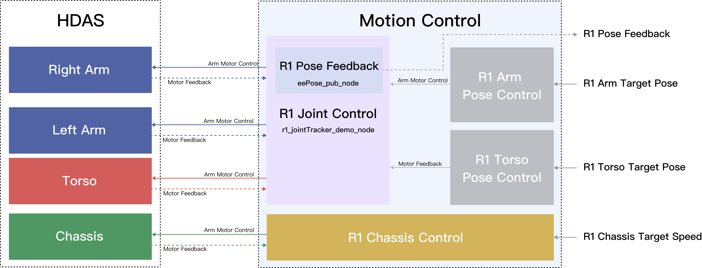
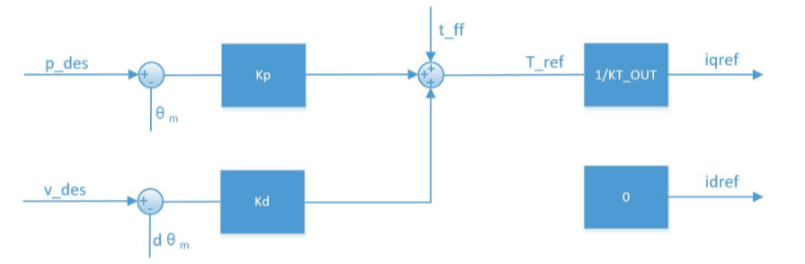
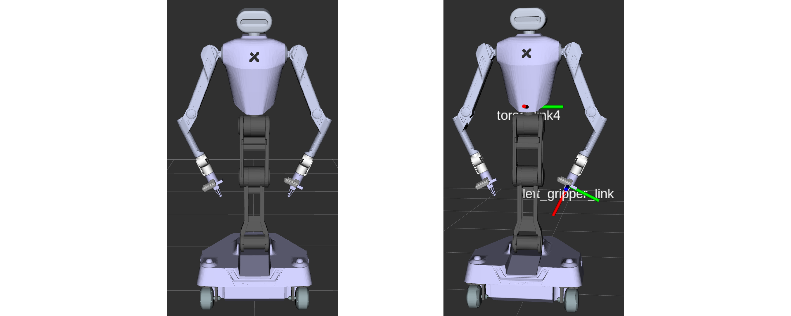

# Galaxea R1 Software Guide

## Environment Dependency

1. Hardware Dependency: R1 Computing Unit
2. OS Dependency: [Ubuntu](https://ubuntu.com/download) 20.04 LTS
3. Middleware Dependency: ROS Noetic

## Software Version Changelog

Visit the [R1 Software Version Changelog](R1_Software_Changelog/v1.1.0.md) and find the latest update.

## First Move

Visit the page [R1 Demo](R1_demo_test.md) and get started to operate R1 following the instructions.

## Software Interface

The current Galaxea R1 control diagram is shown below, consisting of five main parts: R1 Pose Feedback, R1 Joint Control, R1 Chassis Control, R1 Arm Pose Control, and R1 Torso Pose Control. Details will be provided in the following chapters. The entire package is called 'mobiman,' short for mobile manipulation.



### Driver Interface

The current Galaxea R1 driver consists of several components, including actuator interface, sensor interface and external function interface. All the components can be launched by using the following command template.

```Bash
source ~/work/galaxea/install/setup.bash
roslaunch <Package Name> <Launch File>
# Example
roslaunch HDAS r1.launch
```

<table style="width: 100%; border-collapse: collapse;">
  <thead>
    <tr style="background-color: black; color: white; text-align: left;">
      <th style="padding: 8px; border: 1px solid #ddd; width: 300px;">Topic Name</th>
      <th style="padding: 8px; border: 1px solid #ddd; width: 200px;">Description</th>
      <th style="padding: 8px; border: 1px solid #ddd; width: 200px;">Message Type</th>
    </tr>
  </thead>
  <tbody>
    <tr style="background-color: white; text-align: left;">
      <td style="padding: 8px; border: 1px solid #ddd;">Arms Driver Interface<br>Torso Driver Interface<br>Chassis Driver Interface<br>IMU Interface<br>BMS Interface<br>Remote Controller Interface</td>
      <td style="padding: 8px; border: 1px solid #ddd;">HDAS</td>
      <td style="padding: 8px; border: 1px solid #ddd;">r1.launch</td>
    </tr>
     <tr style="background-color: white; text-align: left;">
      <td style="padding: 8px; border: 1px solid #ddd;">Camera Interface</td>
      <td style="padding: 8px; border: 1px solid #ddd;">signal_camera</td>
      <td style="padding: 8px; border: 1px solid #ddd;">signal_camera.launch</td>
    </tr>
      <tr style="background-color: white; text-align: left;">
      <td style="padding: 8px; border: 1px solid #ddd;">LiDAR Interface</td>
      <td style="padding: 8px; border: 1px solid #ddd;">livox_ros_driver2</td>
      <td style="padding: 8px; border: 1px solid #ddd;">msg_MID360.launch</td>
    </tr>
  </tbody>
</table>


#### Arms Driver Interface

This interface is used for the robot arm control and status feedback ROS package, which defines multiple topics for publishing and subscribing to the arm's status, control commands, and associated error codes. Below are detailed descriptions of each topic and its corresponding message types:

<table style="width: 100%; border-collapse: collapse;">
    <thead>
        <tr style="background-color: black; color: white; text-align: left;">
            <th style="width: 200px; vertical-align: middle; padding: 8px; border: 1px solid #ddd; width: 300px;">Topic Name</th>
            <th style="width: 300px; vertical-align: middle; padding: 8px; border: 1px solid #ddd; width: 100px;">I/O</th>            
            <th style="width: 300px; vertical-align: middle; padding: 8px; border: 1px solid #ddd; width: 300px;">Description</th>
            <th style="width: 300px; vertical-align: middle; padding: 8px; border: 1px solid #ddd; width: 300px;">Message Type</th>
        </tr>
    </thead>
    <tbody>
        <tr style="background-color: white; text-align: left;">
            <td style="vertical-align: middle; padding: 8px; border: 1px solid #ddd;">/hdas/feedback_arm_left</td>
            <td style="vertical-align: middle; padding: 8px; border: 1px solid #ddd;">Output</td>           
            <td style="vertical-align: middle; padding: 8px; border: 1px solid #ddd;">Joint feedback of left arm</td>
            <td style="vertical-align: middle; padding: 8px; border: 1px solid #ddd;">sensor_msgs::JointState</td>
        </tr>
        <tr style="background-color: white; text-align: left;">
            <td style="vertical-align: middle; padding: 8px; border: 1px solid #ddd;">/hdas/feedback_arm_right</td>
            <td style="vertical-align: middle; padding: 8px; border: 1px solid #ddd;">Output</td>           
            <td style="vertical-align: middle; padding: 8px; border: 1px solid #ddd;">Joint feedback of right arm</td>
            <td style="vertical-align: middle; padding: 8px; border: 1px solid #ddd;">sensor_msgs::JointState</td>
        </tr>
        <tr style="background-color: white; text-align: left;">
            <td style="vertical-align: middle; padding: 8px; border: 1px solid #ddd;">/hdas/feedback_gripper_left</td>
            <td style="vertical-align: middle; padding: 8px; border: 1px solid #ddd;">Output</td>           
            <td style="vertical-align: middle; padding: 8px; border: 1px solid #ddd;">Gripper stroke of left gripper</td>
            <td style="vertical-align: middle; padding: 8px; border: 1px solid #ddd;">sensor_msgs::JointState</td>
        </tr>
        <tr style="background-color: white; text-align: left;">
            <td style="vertical-align: middle; padding: 8px; border: 1px solid #ddd;">/hdas/feedback_gripper_right</td>
            <td style="vertical-align: middle; padding: 8px; border: 1px solid #ddd;">Output</td>           
            <td style="vertical-align: middle; padding: 8px; border: 1px solid #ddd;">Gripper stroke of right gripper</td>
            <td style="vertical-align: middle; padding: 8px; border: 1px solid #ddd;">sensor_msgs::JointState</td>
        </tr>
        <tr style="background-color: white; text-align: left;">
            <td style="vertical-align: middle; padding: 8px; border: 1px solid #ddd;">/hdas/feedback_status_arm_left*</td>
            <td style="vertical-align: middle; padding: 8px; border: 1px solid #ddd;">Output</td>           
            <td style="vertical-align: middle; padding: 8px; border: 1px solid #ddd;">Status of left arm</td>
            <td style="vertical-align: middle; padding: 8px; border: 1px solid #ddd;">hdas_msg::feedback_status</td>
        </tr>
        <tr style="background-color: white; text-align: left;">
            <td style="vertical-align: middle; padding: 8px; border: 1px solid #ddd;">/hdas/feedback_status_arm_right*</td>
            <td style="vertical-align: middle; padding: 8px; border: 1px solid #ddd;">Output</td>           
            <td style="vertical-align: middle; padding: 8px; border: 1px solid #ddd;">Status of right arm</td>
            <td style="vertical-align: middle; padding: 8px; border: 1px solid #ddd;">hdas_msg::feedback_status</td>
        </tr>
        <tr style="background-color: white; text-align: left;">
            <td style="vertical-align: middle; padding: 8px; border: 1px solid #ddd;">/hdas/feedback_status_gripper_left</td>
            <td style="vertical-align: middle; padding: 8px; border: 1px solid #ddd;">Output</td>           
            <td style="vertical-align: middle; padding: 8px; border: 1px solid #ddd;">Status of left gripper</td>
            <td style="vertical-align: middle; padding: 8px; border: 1px solid #ddd;">hdas_msg::feedback_status</td>
        </tr>
        <tr style="background-color: white; text-align: left;">
            <td style="vertical-align: middle; padding: 8px; border: 1px solid #ddd;">/hdas/feedback_status_gripper_right</td>
            <td style="vertical-align: middle; padding: 8px; border: 1px solid #ddd;">Output</td>           
            <td style="vertical-align: middle; padding: 8px; border: 1px solid #ddd;">Status of right gripper</td>
            <td style="vertical-align: middle; padding: 8px; border: 1px solid #ddd;">hdas_msg::feedback_status</td>
        </tr>
        <tr style="background-color: white; text-align: left;">
            <td style="vertical-align: middle; padding: 8px; border: 1px solid #ddd;">/motion_control/control_arm_left</td>
            <td style="vertical-align: middle; padding: 8px; border: 1px solid #ddd;">Input</td>           
            <td style="vertical-align: middle; padding: 8px; border: 1px solid #ddd;">Motor control of left arm</td>
            <td style="vertical-align: middle; padding: 8px; border: 1px solid #ddd;">hdas_msg::motor_control</td>
        </tr>
        <tr style="background-color: white; text-align: left;">
            <td style="vertical-align: middle; padding: 8px; border: 1px solid #ddd;">/motion_control/control_arm_right</td>
            <td style="vertical-align: middle; padding: 8px; border: 1px solid #ddd;">Input</td>           
            <td style="vertical-align: middle; padding: 8px; border: 1px solid #ddd;">Motor control of right arm</td>
            <td style="vertical-align: middle; padding: 8px; border: 1px solid #ddd;">hdas_msg::motor_control</td>
        </tr>
        <tr style="background-color: white; text-align: left;">
            <td style="vertical-align: middle; padding: 8px; border: 1px solid #ddd;">/motion_control/control_gripper_left</td>
            <td style="vertical-align: middle; padding: 8px; border: 1px solid #ddd;">Input</td>           
            <td style="vertical-align: middle; padding: 8px; border: 1px solid #ddd;">Motor control of left gripper</td>
            <td style="vertical-align: middle; padding: 8px; border: 1px solid #ddd;">hdas_msg::motor_control</td>
        </tr>
        <tr style="background-color: white; text-align: left;">
            <td style="vertical-align: middle; padding: 8px; border: 1px solid #ddd;">/motion_control/control_gripper_right</td>
            <td style="vertical-align: middle; padding: 8px; border: 1px solid #ddd;">Input</td>           
            <td style="vertical-align: middle; padding: 8px; border: 1px solid #ddd;">Motor control of right gripper</td>
            <td style="vertical-align: middle; padding: 8px; border: 1px solid #ddd;">hdas_msg::motor_control</td>
        </tr>
        <tr style="background-color: white; text-align: left;">
            <td style="vertical-align: middle; padding: 8px; border: 1px solid #ddd;">/motion_control/position_control_gripper_left</td>
            <td style="vertical-align: middle; padding: 8px; border: 1px solid #ddd;">Input</td>           
            <td style="vertical-align: middle; padding: 8px; border: 1px solid #ddd;">Position control of left gripper</td>
            <td style="vertical-align: middle; padding: 8px; border: 1px solid #ddd;">std_msgs::Float32</td>
        </tr>
        <tr style="background-color: white; text-align: left;">
            <td style="vertical-align: middle; padding: 8px; border: 1px solid #ddd;">/motion_control/position_control_gripper_right</td>
            <td style="vertical-align: middle; padding: 8px; border: 1px solid #ddd;">Input</td>           
            <td style="vertical-align: middle; padding: 8px; border: 1px solid #ddd;">Position control of right gripper</td>
            <td style="vertical-align: middle; padding: 8px; border: 1px solid #ddd;">std_msgs::Float32</td>
        </tr>
    </tbody>
</table>


The specific fields and their detailed descriptions for the above topic are shown in the table below:

<table style="width: 100%; border-collapse: collapse;">
  <thead>
    <tr>
      <th style="background-color: black; color: white; vertical-align: middle; padding: 8px; border: 1px solid #ddd; width: 200px;">Topic Name</th>
      <th style="background-color: black; color: white; vertical-align: middle; padding: 8px; border: 1px solid #ddd; width: 200px;">Field</th>
      <th style="background-color: black; color: white; vertical-align: middle; padding: 8px; border: 1px solid #ddd;width: 600px;">Description</th>
    </tr>
  </thead>
  <tbody>
    <tr style="background-color: white;">
      <td style="vertical-align: middle; padding: 8px; border: 1px solid #ddd; width: 200px;" rowspan="4">/hdas/feedback_arm_left</td>
      <td style="vertical-align: middle; padding: 8px; border: 1px solid #ddd;">header</td>
      <td style="vertical-align: middle; padding: 8px; border: 1px solid #ddd;">Standard header</td>
    </tr>
    <tr style="background-color: white;">
      <td style="vertical-align: middle; padding: 8px; border: 1px solid #ddd;">position</td>
      <td style="vertical-align: middle; padding: 8px; border: 1px solid #ddd;">[Joint1_position, Joint2_position, Joint3_position, Joint4_position, Joint5_position, Joint6_position, gripper_position]</td>
    </tr>
    <tr style="background-color: white;">
      <td style="vertical-align: middle; padding: 8px; border: 1px solid #ddd;">velocity</td>
      <td style="vertical-align: middle; padding: 8px; border: 1px solid #ddd;">[Joint1_velocity, Joint2_velocity, Joint3_velocity, Joint4_velocity, Joint5_velocity, Joint6_velocity, gripper_velocity]</td>
    </tr>
    <tr style="background-color: white;">
      <td style="vertical-align: middle; padding: 8px; border: 1px solid #ddd;">effort</td>
      <td style="vertical-align: middle; padding: 8px; border: 1px solid #ddd;">[Joint1_effort, Joint2_effort, Joint3_effort, Joint4_effort, Joint5_effort, Joint6_effort, gripper_effort]</td>
<tr style="background-color: white;">
      <td style="vertical-align: middle; padding: 8px; border: 1px solid #ddd; width: 200px;" rowspan="4">/hdas/feedback_arm_right</td>
      <td style="vertical-align: middle; padding: 8px; border: 1px solid #ddd;">header</td>
      <td style="vertical-align: middle; padding: 8px; border: 1px solid #ddd;">Standard header</td>
    </tr>
    <tr style="background-color: white;">
      <td style="vertical-align: middle; padding: 8px; border: 1px solid #ddd;">position</td>
      <td style="vertical-align: middle; padding: 8px; border: 1px solid #ddd;">[Joint1_position, Joint2_position, Joint3_position, Joint4_position, Joint5_position, Joint6_position, gripper_position]</td>
    </tr>
    <tr style="background-color: white;">
      <td style="vertical-align: middle; padding: 8px; border: 1px solid #ddd;">velocity</td>
      <td style="vertical-align: middle; padding: 8px; border: 1px solid #ddd;">[Joint1_velocity, Joint2_velocity, Joint3_velocity, Joint4_velocity, Joint5_velocity, Joint6_velocity, gripper_velocity]</td>
    </tr>
    <tr style="background-color: white;">
      <td style="vertical-align: middle; padding: 8px; border: 1px solid #ddd;">effort</td>
      <td style="vertical-align: middle; padding: 8px; border: 1px solid #ddd;">[Joint1_effort, Joint2_effort, Joint3_effort, Joint4_effort, Joint5_effort, Joint6_effort, gripper_effort]</td>
    <tr style="background-color: white;">
      <td style="vertical-align: middle; padding: 8px; border: 1px solid #ddd; width: 200px;" rowspan="4">/hdas/feedback_gripper_left</td>
      <td style="vertical-align: middle; padding: 8px; border: 1px solid #ddd;">header</td>
      <td style="vertical-align: middle; padding: 8px; border: 1px solid #ddd;">Standard header</td>
    </tr>
    <tr style="background-color: white;">
      <td style="vertical-align: middle; padding: 8px; border: 1px solid #ddd;">position</td>
      <td style="vertical-align: middle; padding: 8px; border: 1px solid #ddd;">[gripper_stroke]</td>
    </tr>
    <tr style="background-color: white;">
      <td style="vertical-align: middle; padding: 8px; border: 1px solid #ddd;">velocity</td>
      <td style="vertical-align: middle; padding: 8px; border: 1px solid #ddd;">Not used</td>
    </tr>
    <tr style="background-color: white;">
      <td style="vertical-align: middle; padding: 8px; border: 1px solid #ddd;">effort</td>
      <td style="vertical-align: middle; padding: 8px; border: 1px solid #ddd;">Not used</td>
    </tr>
    <tr style="background-color: white;">
      <td style="vertical-align: middle; padding: 8px; border: 1px solid #ddd; width: 200px;" rowspan="4">/hdas/feedback_gripper_right</td>
      <td style="vertical-align: middle; padding: 8px; border: 1px solid #ddd;">header</td>
      <td style="vertical-align: middle; padding: 8px; border: 1px solid #ddd;">Standard header</td>
    </tr>
    <tr style="background-color: white;">
      <td style="vertical-align: middle; padding: 8px; border: 1px solid #ddd;">position</td>
      <td style="vertical-align: middle; padding: 8px; border: 1px solid #ddd;">[gripper_stroke]</td>
    </tr>
    <tr style="background-color: white;">
      <td style="vertical-align: middle; padding: 8px; border: 1px solid #ddd;">velocity</td>
      <td style="vertical-align: middle; padding: 8px; border: 1px solid #ddd;">Not used</td>
    </tr>
    <tr style="background-color: white;">
      <td style="vertical-align: middle; padding: 8px; border: 1px solid #ddd;">effort</td>
      <td style="vertical-align: middle; padding: 8px; border: 1px solid #ddd;">Not used</td>
    </tr>        
    <tr style="background-color: white;">
      <td style="vertical-align: middle; padding: 8px; border: 1px solid #ddd; width: 200px;" rowspan="3">/hdas/feedback_status_arm_left</td>
      <td style="vertical-align: middle; padding: 8px; border: 1px solid #ddd;">header</td>
      <td style="vertical-align: middle; padding: 8px; border: 1px solid #ddd;">Standard header</td>
    </tr>
    <tr style="background-color: white;">
      <td style="vertical-align: middle; padding: 8px; border: 1px solid #ddd;">name_id</td>
      <td style="vertical-align: middle; padding: 8px; border: 1px solid #ddd;">Joint name</td>
    </tr>
    <tr style="background-color: white;">
      <td style="vertical-align: middle; padding: 8px; border: 1px solid #ddd;">errors</td>
      <td style="vertical-align: middle; padding: 8px; border: 1px solid #ddd;">Contains error code and error description</td>
    </tr>
    <tr style="background-color: white;">
      <td style="vertical-align: middle; padding: 8px; border: 1px solid #ddd; width: 200px;" rowspan="3">/hdas/feedback_status_arm_right</td>
      <td style="vertical-align: middle; padding: 8px; border: 1px solid #ddd;">header</td>
      <td style="vertical-align: middle; padding: 8px; border: 1px solid #ddd;">Standard header</td>
    </tr>
    <tr style="background-color: white;">
      <td style="vertical-align: middle; padding: 8px; border: 1px solid #ddd;">name_id</td>
      <td style="vertical-align: middle; padding: 8px; border: 1px solid #ddd;">Joint name</td>
    </tr>
    <tr style="background-color: white;">
      <td style="vertical-align: middle; padding: 8px; border: 1px solid #ddd;">errors</td>
      <td style="vertical-align: middle; padding: 8px; border: 1px solid #ddd;">Contains error code and error description</td>
    </tr>
    <tr style="background-color: white;">
      <td style="vertical-align: middle; padding: 8px; border: 1px solid #ddd; width: 200px;" rowspan="3">/hdas/feedback_status_gripper_left</td>
      <td style="vertical-align: middle; padding: 8px; border: 1px solid #ddd;">header</td>
      <td style="vertical-align: middle; padding: 8px; border: 1px solid #ddd;">Standard header</td>
    </tr>
    <tr style="background-color: white;">
      <td style="vertical-align: middle; padding: 8px; border: 1px solid #ddd;">name_id</td>
      <td style="vertical-align: middle; padding: 8px; border: 1px solid #ddd;">Joint name</td>
    </tr>
    <tr style="background-color: white;">
      <td style="vertical-align: middle; padding: 8px; border: 1px solid #ddd;">errors</td>
      <td style="vertical-align: middle; padding: 8px; border: 1px solid #ddd;">Contains error code and error description</td>
    </tr>
    <tr style="background-color: white;">
      <td style="vertical-align: middle; padding: 8px; border: 1px solid #ddd; width: 200px;" rowspan="3">/hdas/feedback_status_gripper_right</td>
      <td style="vertical-align: middle; padding: 8px; border: 1px solid #ddd;">header</td>
      <td style="vertical-align: middle; padding: 8px; border: 1px solid #ddd;">Standard header</td>
    </tr>
    <tr style="background-color: white;">
      <td style="vertical-align: middle; padding: 8px; border: 1px solid #ddd;">name_id</td>
      <td style="vertical-align: middle; padding: 8px; border: 1px solid #ddd;">Joint name</td>
    </tr>
    <tr style="background-color: white;">
      <td style="vertical-align: middle; padding: 8px; border: 1px solid #ddd;">errors</td>
      <td style="vertical-align: middle; padding: 8px; border: 1px solid #ddd;">Contains error code and error description</td>
    </tr>
    <tr style="background-color: white;">
      <td style="vertical-align: middle; padding: 8px; border: 1px solid #ddd; width: 200px;" rowspan="6">/motion_control/control_arm_left <br>(Servo Mode)</td>
      <td style="vertical-align: middle; padding: 8px; border: 1px solid #ddd;">header</td>
      <td style="vertical-align: middle; padding: 8px; border: 1px solid #ddd;">Standard header</td>
    </tr>
    <tr style="background-color: white;">
      <td style="vertical-align: middle; padding: 8px; border: 1px solid #ddd;">name</td>
      <td style="vertical-align: middle; padding: 8px; border: 1px solid #ddd;">-</td>
    </tr>
    <tr style="background-color: white;">
      <td style="vertical-align: middle; padding: 8px; border: 1px solid #ddd;">p_des</td>
      <td style="vertical-align: middle; padding: 8px; border: 1px solid #ddd;">[Joint1_position, Joint2_position, Joint3_position, Joint4_position, Joint5_position, Joint6_position]</td>
    </tr>
    <tr style="background-color: white;">
      <td style="vertical-align: middle; padding: 8px; border: 1px solid #ddd;">v_des</td>
      <td style="vertical-align: middle; padding: 8px; border: 1px solid #ddd;">[Joint1_velocity_max_limit, Joint2_velocity_max_limit, Joint3_velocity_max_limit, Joint4_velocity_max_limit, Joint5_velocity_max_limit, Joint6_velocity_max_limit]</td>
    </tr>
    <tr style="background-color: white;">
      <td style="vertical-align: middle; padding: 8px; border: 1px solid #ddd;">t_ff</td>
      <td style="vertical-align: middle; padding: 8px; border: 1px solid #ddd;">[Joint1_effort_max_limit, Joint2_effort_max_limit, Joint3_effort_max_limit, Joint4_effort_max_limit, Joint5_effort_max_limit, Joint6_effort_max_limit]</td>
    </tr>
    <tr style="background-color: white;">
      <td style="vertical-align: middle; padding: 8px; border: 1px solid #ddd;">mode</td>
      <td style="vertical-align: middle; padding: 8px; border: 1px solid #ddd;">-</td>
    </tr>
    <tr style="background-color: white;">
      <td style="vertical-align: middle; padding: 8px; border: 1px solid #ddd; width: 200px;" rowspan="8">/motion_control/control_arm_left <br>(Torque-Position-Mix Control Mode)</td>
      <td style="vertical-align: middle; padding: 8px; border: 1px solid #ddd;">header</td>
      <td style="vertical-align: middle; padding: 8px; border: 1px solid #ddd;">Standard header</td>
    </tr>
    <tr style="background-color: white;">
      <td style="vertical-align: middle; padding: 8px; border: 1px solid #ddd;">name</td>
      <td style="vertical-align: middle; padding: 8px; border: 1px solid #ddd;">-</td>
    </tr>
    <tr style="background-color: white;">
      <td style="vertical-align: middle; padding: 8px; border: 1px solid #ddd;">p_des</td>
      <td style="vertical-align: middle; padding: 8px; border: 1px solid #ddd;">[Joint1_position, Joint2_position, Joint3_position, Joint4_position, Joint5_position, Joint6_position]</td>
    </tr>
    <tr style="background-color: white;">
      <td style="vertical-align: middle; padding: 8px; border: 1px solid #ddd;">v_des</td>
      <td style="vertical-align: middle; padding: 8px; border: 1px solid #ddd;">[Joint1_velocity, Joint2_velocity, Joint3_velocity, Joint4_velocity, Joint5_velocity, Joint6_velocity]</td>
    </tr>
    <tr style="background-color: white;">
      <td style="vertical-align: middle; padding: 8px; border: 1px solid #ddd;">kp</td>
      <td style="vertical-align: middle; padding: 8px; border: 1px solid #ddd;">[Joint1_kp, Joint2_kp, Joint3_kp, Joint4_kp, Joint5_kp, Joint6_kp]</td>
    </tr>
    <tr style="background-color: white;">
      <td style="vertical-align: middle; padding: 8px; border: 1px solid #ddd;">kd</td>
      <td style="vertical-align: middle; padding: 8px; border: 1px solid #ddd;">[Joint1_kd, Joint2_kd, Joint3_kd, Joint4_kd, Joint5_kd, Joint6_kd]</td>
    </tr>
    <tr style="background-color: white;">
      <td style="vertical-align: middle; padding: 8px; border: 1px solid #ddd;">t_ff</td>
      <td style="vertical-align: middle; padding: 8px; border: 1px solid #ddd;">[Joint1_effort, Joint2_effort, Joint3_effort, Joint4_effort, Joint5_effort, Joint6_effort]</td>
    </tr>
    <tr style="background-color: white;">
      <td style="vertical-align: middle; padding: 8px; border: 1px solid #ddd;">mode</td>
      <td style="vertical-align: middle; padding: 8px; border: 1px solid #ddd;">-</td>
    </tr>
     <tr style="background-color: white;">
      <td style="vertical-align: middle; padding: 8px; border: 1px solid #ddd; width: 200px;" rowspan="6">/motion_control/control_arm_right<br>(Servo Mode)</td>
      <td style="vertical-align: middle; padding: 8px; border: 1px solid #ddd;">header</td>
      <td style="vertical-align: middle; padding: 8px; border: 1px solid #ddd;">Standard header</td>
    </tr>
    <tr style="background-color: white;">
      <td style="vertical-align: middle; padding: 8px; border: 1px solid #ddd;">name</td>
      <td style="vertical-align: middle; padding: 8px; border: 1px solid #ddd;">-</td>
    </tr>
    <tr style="background-color: white;">
      <td style="vertical-align: middle; padding: 8px; border: 1px solid #ddd;">p_des</td>
      <td style="vertical-align: middle; padding: 8px; border: 1px solid #ddd;">[Joint1_position, Joint2_position, Joint3_position, Joint4_position, Joint5_position, Joint6_position]</td>
    </tr>
    <tr style="background-color: white;">
      <td style="vertical-align: middle; padding: 8px; border: 1px solid #ddd;">v_des</td>
      <td style="vertical-align: middle; padding: 8px; border: 1px solid #ddd;">[Joint1_velocity_max_limit, Joint2_velocity_max_limit, Joint3_velocity_max_limit, Joint4_velocity_max_limit, Joint5_velocity_max_limit, Joint6_velocity_max_limit]</td>
    </tr>
    <tr style="background-color: white;">
      <td style="vertical-align: middle; padding: 8px; border: 1px solid #ddd;">t_ff</td>
      <td style="vertical-align: middle; padding: 8px; border: 1px solid #ddd;">[Joint1_effort_max_limit, Joint2_effort_max_limit, Joint3_effort_max_limit, Joint4_effort_max_limit, Joint5_effort_max_limit, Joint6_effort_max_limit]</td>
    </tr>
    <tr style="background-color: white;">
      <td style="vertical-align: middle; padding: 8px; border: 1px solid #ddd;">mode</td>
      <td style="vertical-align: middle; padding: 8px; border: 1px solid #ddd;">-</td>
    </tr>
     <tr style="background-color: white;">
      <td style="vertical-align: middle; padding: 8px; border: 1px solid #ddd; width: 200px;" rowspan="8">/motion_control/control_arm_right<br>(Torque-Position-Mix Control Mode)</td>
      <td style="vertical-align: middle; padding: 8px; border: 1px solid #ddd;">header</td>
      <td style="vertical-align: middle; padding: 8px; border: 1px solid #ddd;">Standard header</td>
    </tr>
    <tr style="background-color: white;">
      <td style="vertical-align: middle; padding: 8px; border: 1px solid #ddd;">name</td>
      <td style="vertical-align: middle; padding: 8px; border: 1px solid #ddd;">-</td>
    </tr>
    <tr style="background-color: white;">
      <td style="vertical-align: middle; padding: 8px; border: 1px solid #ddd;">p_des</td>
      <td style="vertical-align: middle; padding: 8px; border: 1px solid #ddd;">[Joint1_position, Joint2_position, Joint3_position, Joint4_position, Joint5_position, Joint6_position]</td>
    </tr>
    <tr style="background-color: white;">
      <td style="vertical-align: middle; padding: 8px; border: 1px solid #ddd;">v_des</td>
      <td style="vertical-align: middle; padding: 8px; border: 1px solid #ddd;">[Joint1_velocity, Joint2_velocity, Joint3_velocity, Joint4_velocity, Joint5_velocity, Joint6_velocity]</td>
    </tr>
    <tr style="background-color: white;">
      <td style="vertical-align: middle; padding: 8px; border: 1px solid #ddd;">kp</td>
      <td style="vertical-align: middle; padding: 8px; border: 1px solid #ddd;">[Joint1_kp, Joint2_kp, Joint3_kp, Joint4_kp, Joint5_kp, Joint6_kp]</td>
    </tr>
    <tr style="background-color: white;">
      <td style="vertical-align: middle; padding: 8px; border: 1px solid #ddd;">kd</td>
      <td style="vertical-align: middle; padding: 8px; border: 1px solid #ddd;">[Joint1_kd, Joint2_kd, Joint3_kd, Joint4_kd, Joint5_kd, Joint6_kd]</td>
    </tr>
    <tr style="background-color: white;">
      <td style="vertical-align: middle; padding: 8px; border: 1px solid #ddd;">t_ff</td>
      <td style="vertical-align: middle; padding: 8px; border: 1px solid #ddd;">[Joint1_effort, Joint2_effort, Joint3_effort, Joint4_effort, Joint5_effort, Joint6_effort]</td>
    </tr>
    <tr style="background-color: white;">
      <td style="vertical-align: middle; padding: 8px; border: 1px solid #ddd;">mode</td>
      <td style="vertical-align: middle; padding: 8px; border: 1px solid #ddd;">-</td>
    </tr>
    <tr style="background-color: white;">
      <td style="vertical-align: middle; padding: 8px; border: 1px solid #ddd; width: 200px;" rowspan="8">/motion_control/control_gripper_left</td>
      <td style="vertical-align: middle; padding: 8px; border: 1px solid #ddd;">header</td>
      <td style="vertical-align: middle; padding: 8px; border: 1px solid #ddd;">Standard header</td>
    </tr>
    <tr style="background-color: white;">
      <td style="vertical-align: middle; padding: 8px; border: 1px solid #ddd;">name</td>
      <td style="vertical-align: middle; padding: 8px; border: 1px solid #ddd;">-</td>
    </tr>
    <tr style="background-color: white;">
      <td style="vertical-align: middle; padding: 8px; border: 1px solid #ddd;">p_des</td>
      <td style="vertical-align: middle; padding: 8px; border: 1px solid #ddd;">[gripper_position]</td>
    </tr>
    <tr style="background-color: white;">
      <td style="vertical-align: middle; padding: 8px; border: 1px solid #ddd;">v_des</td>
      <td style="vertical-align: middle; padding: 8px; border: 1px solid #ddd;">[gripper_velocity]</td>
    </tr>
    <tr style="background-color: white;">
      <td style="vertical-align: middle; padding: 8px; border: 1px solid #ddd;">kp</td>
      <td style="vertical-align: middle; padding: 8px; border: 1px solid #ddd;">[gripper_kp]</td>
    </tr>
    <tr style="background-color: white;">
      <td style="vertical-align: middle; padding: 8px; border: 1px solid #ddd;">kd</td>
      <td style="vertical-align: middle; padding: 8px; border: 1px solid #ddd;">[gripper_kd]</td>
    </tr>
    <tr style="background-color: white;">
      <td style="vertical-align: middle; padding: 8px; border: 1px solid #ddd;">t_ff</td>
      <td style="vertical-align: middle; padding: 8px; border: 1px solid #ddd;">[gripper_effort]</td>
    </tr>
    <tr style="background-color: white;">
      <td style="vertical-align: middle; padding: 8px; border: 1px solid #ddd;">mode</td>
      <td style="vertical-align: middle; padding: 8px; border: 1px solid #ddd;">-</td>
    </tr>
    <tr style="background-color: white;">
      <td style="vertical-align: middle; padding: 8px; border: 1px solid #ddd; width: 200px;" rowspan="8">/motion_control/control_gripper_right</td>
      <td style="vertical-align: middle; padding: 8px; border: 1px solid #ddd;">header</td>
      <td style="vertical-align: middle; padding: 8px; border: 1px solid #ddd;">Standard header</td>
    </tr>
    <tr style="background-color: white;">
      <td style="vertical-align: middle; padding: 8px; border: 1px solid #ddd;">name</td>
      <td style="vertical-align: middle; padding: 8px; border: 1px solid #ddd;">-</td>
    </tr>
    <tr style="background-color: white;">
      <td style="vertical-align: middle; padding: 8px; border: 1px solid #ddd;">p_des</td>
      <td style="vertical-align: middle; padding: 8px; border: 1px solid #ddd;">[gripper_position]</td>
    </tr>
    <tr style="background-color: white;">
      <td style="vertical-align: middle; padding: 8px; border: 1px solid #ddd;">v_des</td>
      <td style="vertical-align: middle; padding: 8px; border: 1px solid #ddd;">[gripper_velocity]</td>
    </tr>
    <tr style="background-color: white;">
      <td style="vertical-align: middle; padding: 8px; border: 1px solid #ddd;">kp</td>
      <td style="vertical-align: middle; padding: 8px; border: 1px solid #ddd;">[gripper_kp]</td>
    </tr>
    <tr style="background-color: white;">
      <td style="vertical-align: middle; padding: 8px; border: 1px solid #ddd;">kd</td>
      <td style="vertical-align: middle; padding: 8px; border: 1px solid #ddd;">[gripper_kd]</td>
    </tr>
    <tr style="background-color: white;">
      <td style="vertical-align: middle; padding: 8px; border: 1px solid #ddd;">t_ff</td>
      <td style="vertical-align: middle; padding: 8px; border: 1px solid #ddd;">[gripper_effort]</td>
    </tr>
    <tr style="background-color: white;">
      <td style="vertical-align: middle; padding: 8px; border: 1px solid #ddd;">mode</td>
      <td style="vertical-align: middle; padding: 8px; border: 1px solid #ddd;">-</td>
    </tr>
    <tr style="background-color: white;">
      <td style="vertical-align: middle; padding: 8px; border: 1px solid #ddd; width: 200px;" rowspan="2">/motion_control/position_control_gripper_left</td>
      <td style="vertical-align: middle; padding: 8px; border: 1px solid #ddd;">header</td>
      <td style="vertical-align: middle; padding: 8px; border: 1px solid #ddd;">Standard header</td>
    </tr>
    <tr style="background-color: white;">
      <td style="vertical-align: middle; padding: 8px; border: 1px solid #ddd;">data</td>
      <td style="vertical-align: middle; padding: 8px; border: 1px solid #ddd;">desired_gripper_stroke, range (0 to 100) mm</td>
    </tr>
    <tr style="background-color: white;">
      <td style="vertical-align: middle; padding: 8px; border: 1px solid #ddd; width: 200px;" rowspan="2">/motion_control/position_control_gripper_right</td>
      <td style="vertical-align: middle; padding: 8px; border: 1px solid #ddd;">header</td>
      <td style="vertical-align: middle; padding: 8px; border: 1px solid #ddd;">Standard header</td>
    </tr>
    <tr style="background-color: white;">
      <td style="vertical-align: middle; padding: 8px; border: 1px solid #ddd;">data</td>
      <td style="vertical-align: middle; padding: 8px; border: 1px solid #ddd;">desired_gripper_stroke, range (0 to 100) mm</td>
    </tr>
  </tbody>
</table>


***Joint Motor Control Interface Description**</br>
`/hdas/feedback_status_arm_left `</br>
`/hdas/feedback_status_arm_right`</br>
The figure below illustrates the architecture of the Torque-Position-Mix Control Mode:</br>

The output torque formula of the motor is used to calculate the torque value `T_ref` given by the current loop for tracking, and the formula is as follows: </br>
$K_p(p_d - p_e) + K_d(v_d - v_e)+t_{ff} = T_{ref}$</br>
Where:`Kp`,`Kd` are the proportional gains for position and velocity, respectively.`pd`,`vd` are the desired position and velocity, respectively.`t_ff` is the feedforward torque.`pe` is the position feedback from the encoder, and `ve` is the motor speed obtained by differentiation. </br>
The input items include:`Kp`,`Kd`,`pd`,`vd`,`t_ff`.</br>
The feedback items `pe` and `ve` do not need to be manually entered.

**Note:**

1. Feedforward torque is a mandatory item. The position and velocity terms cannot compensate for large torque errors. Therefore, the feedforward torque should at least compensate for the gravitational torque affecting the robotic arm.

2. Below are the recommended `kp` and `kd` values for the A1 motors. Please exercise caution when making adjustments.</br>
  `A1_kp = [ 140.0, 200.0, 120.0, 20.0, 20.0, 20.0 ]`</br>
  `A1_kd = [ 10.0, 50.0, 5.0, 1.0, 1.0, 0.4 ]`


#### Torso Driver Interface

This interface is used for the torso control and status feedback ROS package, which defines multiple topics for publishing and subscribing to the status of the torso motors and control commands. Below are detailed descriptions of each topic and its corresponding message types:

<table style="width: 100%; border-collapse: collapse;">
  <thead>
    <tr>
      <th style="background-color: black; color: white; vertical-align: middle; padding: 8px; border: 1px solid #ddd; width: 200px;">Topic Name</th>
      <th style="background-color: black; color: white; vertical-align: middle; padding: 8px; border: 1px solid #ddd;width: 100px;">I/O</th>
      <th style="background-color: black; color: white; vertical-align: middle; padding: 8px; border: 1px solid #ddd;width: 400px;">Description</th>
      <th style="background-color: black; color: white; vertical-align: middle; padding: 8px; border: 1px solid #ddd;width: 400px;">Message Type</th>
    </tr>
  </thead>
  <tbody>
    <tr style="background-color: white;">
      <td style="vertical-align: middle; padding: 8px; border: 1px solid #ddd;">/hdas/feedback_torso</td>
      <td style="vertical-align: middle; padding: 8px; border: 1px solid #ddd;">Output</td>           
      <td style="vertical-align: middle; padding: 8px; border: 1px solid #ddd;">Joint feedback of torso</td>
      <td style="vertical-align: middle; padding: 8px; border: 1px solid #ddd;">sensor_msgs/JointState</td>
    </tr>
    <tr style="background-color: white;">
      <td style="vertical-align: middle; padding: 8px; border: 1px solid #ddd;">/hdas/feedback_status_torso</td>
      <td style="vertical-align: middle; padding: 8px; border: 1px solid #ddd;">Output</td>           
      <td style="vertical-align: middle; padding: 8px; border: 1px solid #ddd;">Torso motor status feedback</td>           
      <td style="vertical-align: middle; padding: 8px; border: 1px solid #ddd;">hdas_msg::feedback_status</td>
    </tr>
    <tr style="background-color: white;">
      <td style="vertical-align: middle; padding: 8px; border: 1px solid #ddd;">/motion_control/control_torso</td>
      <td style="vertical-align: middle; padding: 8px; border: 1px solid #ddd;">Output</td>           
      <td style="vertical-align: middle; padding: 8px; border: 1px solid #ddd;">Motor control of torso</td>
      <td style="vertical-align: middle; padding: 8px; border: 1px solid #ddd;">hdas_msg::motor_control</td>
    </tr>
  </tbody>
</table>


The specific fields and their detailed descriptions for the above topic are shown in the table below:

<table style="width: 100%; border-collapse: collapse;">
  <thead>
    <tr>
      <th style="background-color: black; color: white; vertical-align: middle; padding: 8px; border: 1px solid #ddd; width: 200px;">Topic Name</th>
      <th style="background-color: black; color: white; vertical-align: middle; padding: 8px; border: 1px solid #ddd; width: 100px;">Field</th>
      <th style="background-color: black; color: white; vertical-align: middle; padding: 8px; border: 1px solid #ddd; width: 300px;">Description</th>
    </tr>
  </thead>
  <tbody>
    <tr style="background-color: white;">
      <td style="vertical-align: middle; padding: 8px; border: 1px solid #ddd;" rowspan="4">/hdas/feedback_torso</td>
      <td style="vertical-align: middle; padding: 8px; border: 1px solid #ddd;">header</td>
      <td style="vertical-align: middle; padding: 8px; border: 1px solid #ddd;">Standard header</td>
    </tr>
    <tr style="background-color: white;">
      <td style="vertical-align: middle; padding: 8px; border: 1px solid #ddd;">position</td>
      <td style="vertical-align: middle; padding: 8px; border: 1px solid #ddd;">[joint1_position, joint2_position, joint3_position, joint4_position]</td>
    </tr>
    <tr style="background-color: white;">
      <td style="vertical-align: middle; padding: 8px; border: 1px solid #ddd;">velocity</td>
      <td style="vertical-align: middle; padding: 8px; border: 1px solid #ddd;">[joint1_velocity, joint2_velocity, joint3_velocity, joint4_velocity]</td>
    </tr>
    <tr style="background-color: white;">
      <td style="vertical-align: middle; padding: 8px; border: 1px solid #ddd;">effort</td>
      <td style="vertical-align: middle; padding: 8px; border: 1px solid #ddd;">Not used</td>
    </tr>
    <tr style="background-color: white;">
      <td style="vertical-align: middle; padding: 8px; border: 1px solid #ddd;" rowspan="3">/hdas/feedback_status_torso</td>
      <td style="vertical-align: middle; padding: 8px; border: 1px solid #ddd;">header</td>
      <td style="vertical-align: middle; padding: 8px; border: 1px solid #ddd;">Standard header</td>
    </tr>
    <tr style="background-color: white;">
      <td style="vertical-align: middle; padding: 8px; border: 1px solid #ddd;">name_id</td>
      <td style="vertical-align: middle; padding: 8px; border: 1px solid #ddd;">Joint name</td>
    </tr>
    <tr style="background-color: white;">
      <td style="vertical-align: middle; padding: 8px; border: 1px solid #ddd;">errors</td>
      <td style="vertical-align: middle; padding: 8px; border: 1px solid #ddd;">Contains error code and error description</td>
    </tr>
    <tr style="background-color: white;">
      <td style="vertical-align: middle; padding: 8px; border: 1px solid #ddd;" rowspan="8">/motion_control/control_torso</td>
      <td style="vertical-align: middle; padding: 8px; border: 1px solid #ddd;">header</td>
      <td style="vertical-align: middle; padding: 8px; border: 1px solid #ddd;">Standard header</td>
    </tr>
    <tr style="background-color: white;">
      <td style="vertical-align: middle; padding: 8px; border: 1px solid #ddd;">name</td>
      <td style="vertical-align: middle; padding: 8px; border: 1px solid #ddd;">-</td>
    </tr>
    <tr style="background-color: white;">
      <td style="vertical-align: middle; padding: 8px; border: 1px solid #ddd;">p_des</td>
      <td style="vertical-align: middle; padding: 8px; border: 1px solid #ddd;">[Joint1_position, Joint2_position, Joint3_position, Joint4_position]</td>
    </tr>
    <tr style="background-color: white;">
      <td style="vertical-align: middle; padding: 8px; border: 1px solid #ddd;">v_des</td>
      <td style="vertical-align: middle; padding: 8px; border: 1px solid #ddd;">[Joint1_velocity, Joint2_velocity, Joint3_velocity, Joint4_velocity]</td>
    </tr>
    <tr style="background-color: white;">
      <td style="vertical-align: middle; padding: 8px; border: 1px solid #ddd;">kp</td>
      <td style="vertical-align: middle; padding: 8px; border: 1px solid #ddd;">[Joint1_kp, Joint2_kp, Joint3_kp, Joint4_kp]</td>
    </tr>
    <tr style="background-color: white;">
      <td style="vertical-align: middle; padding: 8px; border: 1px solid #ddd;">kd</td>
      <td style="vertical-align: middle; padding: 8px; border: 1px solid #ddd;">[Joint1_kd, Joint2_kd, Joint3_kd, Joint4_kd]</td>
    </tr>
    <tr style="background-color: white;">
      <td style="vertical-align: middle; padding: 8px; border: 1px solid #ddd;">t_ff</td>
      <td style="vertical-align: middle; padding: 8px; border: 1px solid #ddd;">[Joint1_effort, Joint2_effort, Joint3_effort, Joint4_effort]</td>
    </tr>
    <tr style="background-color: white;">
      <td style="vertical-align: middle; padding: 8px; border: 1px solid #ddd;">mode</td>
      <td style="vertical-align: middle; padding: 8px; border: 1px solid #ddd;">-</td>
    </tr>
  </tbody>
</table>


#### Chassis Driver Interface

This interface is used for the chassis status feedback ROS package, which defines multiple topics to report the status of the chassis' motors. Below are detailed descriptions of each topic and its associated message types:

<table style="width: 100%; border-collapse: collapse;">
  <thead>
    <tr style="background-color: black; color: white; text-align: left;">
      <th style="padding: 8px; border: 1px solid #ddd; width: 200px;">Topic Name</th>
      <th style="padding: 8px; border: 1px solid #ddd; width: 100px;">I/O</th>
      <th style="padding: 8px; border: 1px solid #ddd; width: 300px;">Description</th>
      <th style="padding: 8px; border: 1px solid #ddd; width: 300px;">Message Type</th>
    </tr>
  </thead>
  <tbody>
    <tr style="background-color: white; text-align: left;">
      <td style="padding: 8px; border: 1px solid #ddd;">/hdas/feedback_chassis</td>
      <td style="padding: 8px; border: 1px solid #ddd;">Output</td>
      <td style="padding: 8px; border: 1px solid #ddd;">Feedback of chassis</td>
      <td style="padding: 8px; border: 1px solid #ddd;">sensor_msgs::JointState</td>
    </tr>
     <tr style="background-color: white; text-align: left;">
      <td style="padding: 8px; border: 1px solid #ddd;">/hdas/feedback_status_chassis</td>
      <td style="padding: 8px; border: 1px solid #ddd;">Output</td>
      <td style="padding: 8px; border: 1px solid #ddd;">Status of chassis</td>
      <td style="padding: 8px; border: 1px solid #ddd;">hdas_msg::feedback_status</td>
    </tr>
      <tr style="background-color: white; text-align: left;">
      <td style="padding: 8px; border: 1px solid #ddd;">/motion_control/control_chassis</td>
      <td style="padding: 8px; border: 1px solid #ddd;">Input</td>
      <td style="padding: 8px; border: 1px solid #ddd;">Motor control of chassis</td>
      <td style="padding: 8px; border: 1px solid #ddd;">hdas_msg::motor_control</td>
    </tr>
  </tbody>
</table>


The specific fields and their detailed descriptions for the above topic are shown in the table below:

<table style="width: 100%; border-collapse: collapse;">
  </thead>
    <th style="background-color: black; color: white; vertical-align: middle; padding: 8px; border: 1px solid #ddd; width: 200px;">Topic Name</th>
    <th style="background-color: black; color: white; vertical-align: middle; padding: 8px; border: 1px solid #ddd; width: 200px;">Field</th>
    <th style="background-color: black; color: white; vertical-align: middle; padding: 8px; border: 1px solid #ddd; width: 300px;">Description</th>
    </tr>
  </thead>
  <tbody>
  <tr style="background-color: white;">
    <td style="vertical-align: middle; padding: 8px; border: 1px solid #ddd; width: 200px;" rowspan="4">/hdas/feedback_chassis</td>
    <td style="vertical-align: middle; padding: 8px; border: 1px solid #ddd;">header</td>
    <td style="vertical-align: middle; padding: 8px; border: 1px solid #ddd;">Standard header</td>
  </tr>
  <tr style="background-color: white;">
    <td style="vertical-align: middle; padding: 8px; border: 1px solid #ddd;">position</td>
    <td style="vertical-align: middle; padding: 8px; border: 1px solid #ddd;">[angle_front_left, angle_front_right, angle_rear]</td>
  </tr>
  <tr style="background-color: white;">
    <td style="vertical-align: middle; padding: 8px; border: 1px solid #ddd;">velocity</td>
    <td style="vertical-align: middle; padding: 8px; border: 1px solid #ddd;">[linear_velocity_front_left, linear_velocity_front_right, linear_velocity_rear
0.0, 0.0, 0.0]</td>
  </tr>
  <tr style="background-color: white;">
    <td style="vertical-align: middle; padding: 8px; border: 1px solid #ddd;">effort</td>
    <td style="vertical-align: middle; padding: 8px; border: 1px solid #ddd;">[0.0, 0.0, 0.0, 0.0, 0.0, 0.0]</td>
  </tr>
  <tr style="background-color: white;">
    <td style="vertical-align: middle; padding: 8px; border: 1px solid #ddd; width: 200px;" rowspan="3">/hdas/feedback_status_chassis</td>
    <td style="vertical-align: middle; padding: 8px; border: 1px solid #ddd;">header</td>
    <td style="vertical-align: middle; padding: 8px; border: 1px solid #ddd;">Standard header</td>
  </tr>
  <tr style="background-color: white;">
    <td style="vertical-align: middle; padding: 8px; border: 1px solid #ddd;">name_id</td>
    <td style="vertical-align: middle; padding: 8px; border: 1px solid #ddd;">Joint name</td>
  </tr>
  <tr style="background-color: white;">
    <td style="vertical-align: middle; padding: 8px; border: 1px solid #ddd;">errors</td>
    <td style="vertical-align: middle; padding: 8px; border: 1px solid #ddd;">Contains error code and error description</td>
  </tr>
<tr style="background-color: white;">
    <td style="vertical-align: middle; padding: 8px; border: 1px solid #ddd; width: 200px;" rowspan="8">/motion_control/control_chassis</td>
    <td style="vertical-align: middle; padding: 8px; border: 1px solid #ddd;">header</td>
    <td style="vertical-align: middle; padding: 8px; border: 1px solid #ddd;">Standard header</td>
  </tr>
  <tr style="background-color: white;">
    <td style="vertical-align: middle; padding: 8px; border: 1px solid #ddd;">name</td>
    <td style="vertical-align: middle; padding: 8px; border: 1px solid #ddd;">-</td>
  </tr>
  <tr style="background-color: white;">
    <td style="vertical-align: middle; padding: 8px; border: 1px solid #ddd;">p_des</td>
    <td style="vertical-align: middle; padding: 8px; border: 1px solid #ddd;">[angle_front_left, angle_front_right, angle_rear]</td>
  </tr>
  <tr style="background-color: white;">
    <td style="vertical-align: middle; padding: 8px; border: 1px solid #ddd;">v_des</td>
    <td style="vertical-align: middle; padding: 8px; border: 1px solid #ddd;">[linear_velocity_front_left, linear_velocity_front_right, linear_velocity_rear]</td>
  </tr>
  <tr style="background-color: white;">
    <td style="vertical-align: middle; padding: 8px; border: 1px solid #ddd;">kp</td>
    <td style="vertical-align: middle; padding: 8px; border: 1px solid #ddd;">-</td>
  </tr>
  <tr style="background-color: white;">
    <td style="vertical-align: middle; padding: 8px; border: 1px solid #ddd;">kd</td>
    <td style="vertical-align: middle; padding: 8px; border: 1px solid #ddd;">-</td>
  </tr>    
  <tr style="background-color: white;">
    <td style="vertical-align: middle; padding: 8px; border: 1px solid #ddd;">t_ff</td>
    <td style="vertical-align: middle; padding: 8px; border: 1px solid #ddd;">-</td>
  </tr> 
  <tr style="background-color: white;">
    <td style="vertical-align: middle; padding: 8px; border: 1px solid #ddd;">mode</td>
    <td style="vertical-align: middle; padding: 8px; border: 1px solid #ddd;">-</td>
  	</tr>  
   </tbody>
</table>


#### Camera Interface

<table style="width: 100%; border-collapse: collapse;">
  <thead>
    <tr>
      <th style="background-color: black; color: white; vertical-align: middle; padding: 8px; border: 1px solid #ddd; width: 200px;">Topic Name</th>
      <th style="background-color: black; color: white; vertical-align: middle; padding: 8px; border: 1px solid #ddd; width: 100px;;">I/O</th>
      <th style="background-color: black; color: white; vertical-align: middle; padding: 8px; border: 1px solid #ddd; width: 300px;;">Description</th>
      <th style="background-color: black; color: white; vertical-align: middle; padding: 8px; border: 1px solid #ddd; width: 300px;;">Message Type</th>
    </tr>
  </thead>
  <tbody>
    <tr style="background-color: white;">
      <td style="vertical-align: middle; padding: 8px; border: 1px solid #ddd;">/hdas/camera_chassis_front_left/rgb/compressed</td>
      <td style="vertical-align: middle; padding: 8px; border: 1px solid #ddd;">Output</td>
      <td style="vertical-align: middle; padding: 8px; border: 1px solid #ddd;">Compressed Image from front_left chassis camera</td>
      <td style="vertical-align: middle; padding: 8px; border: 1px solid #ddd;">sensor_msgs::CompressedImage</td>
    </tr>
    <tr style="background-color: white;">
      <td style="vertical-align: middle; padding: 8px; border: 1px solid #ddd;">/hdas/camera_chassis_front_right/rgb/compressed</td>
      <td style="vertical-align: middle; padding: 8px; border: 1px solid #ddd;">Output</td>
      <td style="vertical-align: middle; padding: 8px; border: 1px solid #ddd;">Compressed Image from front_right chassis camera</td>
      <td style="vertical-align: middle; padding: 8px; border: 1px solid #ddd;">sensor_msgs::CompressedImage</td>
    </tr>
    <tr style="background-color: white;">
      <td style="vertical-align: middle; padding: 8px; border: 1px solid #ddd;">/hdas/camera_chassis_left/rgb/compressed</td>
      <td style="vertical-align: middle; padding: 8px; border: 1px solid #ddd;">Output</td>
      <td style="vertical-align: middle; padding: 8px; border: 1px solid #ddd;">Compressed Image from left chassis camera</td>
      <td style="vertical-align: middle; padding: 8px; border: 1px solid #ddd;">sensor_msgs::CompressedImage</td>
    </tr>
    <tr style="background-color: white;">
      <td style="vertical-align: middle; padding: 8px; border: 1px solid #ddd;">/hdas/camera_chassis_right/rgb/compressed</td>
      <td style="vertical-align: middle; padding: 8px; border: 1px solid #ddd;">Output</td>
      <td style="vertical-align: middle; padding: 8px; border: 1px solid #ddd;">Compressed Image from right chassis camera</td>
      <td style="vertical-align: middle; padding: 8px; border: 1px solid #ddd;">sensor_msgs::CompressedImage</td>
    </tr>
    <tr style="background-color: white;">
      <td style="vertical-align: middle; padding: 8px; border: 1px solid #ddd;">/hdas/camera_chassis_rear/rgb/compressed</td>
      <td style="vertical-align: middle; padding: 8px; border: 1px solid #ddd;">Output</td>
      <td style="vertical-align: middle; padding: 8px; border: 1px solid #ddd;">Compressed Image from rear chassis camera</td>
      <td style="vertical-align: middle; padding: 8px; border: 1px solid #ddd;">sensor_msgs::CompressedImage</td>
    </tr>
    <tr style="background-color: white;">
      <td style="vertical-align: middle; padding: 8px; border: 1px solid #ddd;">/hdas/camera_wrist_left/color/image_raw/compressed</td>
      <td style="vertical-align: middle; padding: 8px; border: 1px solid #ddd;">Output</td>
      <td style="vertical-align: middle; padding: 8px; border: 1px solid #ddd;">Compressed Image from left wrist camera</td>
      <td style="vertical-align: middle; padding: 8px; border: 1px solid #ddd;">sensor_msgs::CompressedImage</td>
    </tr>
    <tr style="background-color: white;">
      <td style="vertical-align: middle; padding: 8px; border: 1px solid #ddd;">/hdas/camera_wrist_right/color/image_raw/compressed</td>
      <td style="vertical-align: middle; padding: 8px; border: 1px solid #ddd;">Output</td>
      <td style="vertical-align: middle; padding: 8px; border: 1px solid #ddd;">Compressed Image from right wrist camera</td>
      <td style="vertical-align: middle; padding: 8px; border: 1px solid #ddd;">sensor_msgs::CompressedImage</td>
    </tr>
    <tr style="background-color: white;">
      <td style="vertical-align: middle; padding: 8px; border: 1px solid #ddd;">/hdas/camera_head/left_raw/image_raw_color/compressed</td>
      <td style="vertical-align: middle; padding: 8px; border: 1px solid #ddd;">Output</td>
      <td style="vertical-align: middle; padding: 8px; border: 1px solid #ddd;">Compressed Image from head camera</td>
      <td style="vertical-align: middle; padding: 8px; border: 1px solid #ddd;">sensor_msgs::CompressedImage</td>
    </tr>
    <tr style="background-color: white;">
      <td style="vertical-align: middle; padding: 8px; border: 1px solid #ddd;">/hdas/camera_wrist_left/aligned_depth_to_color/image_raw</td>
      <td style="vertical-align: middle; padding: 8px; border: 1px solid #ddd;">Output</td>
      <td style="vertical-align: middle; padding: 8px; border: 1px solid #ddd;">Depth Image from left wrist camera</td>
      <td style="vertical-align: middle; padding: 8px; border: 1px solid #ddd;">sensor_msgs::Image</td>
    </tr>
    <tr style="background-color: white;">
      <td style="vertical-align: middle; padding: 8px; border: 1px solid #ddd;">/hdas/camera_wrist_right/aligned_depth_to_color/image_raw</td>
      <td style="vertical-align: middle; padding: 8px; border: 1px solid #ddd;">Output</td>
      <td style="vertical-align: middle; padding: 8px; border: 1px solid #ddd;">Depth Image from right wrist camera</td>
      <td style="vertical-align: middle; padding: 8px; border: 1px solid #ddd;">sensor_msgs::Image</td>
    </tr>
    <tr style="background-color: white;">
      <td style="vertical-align: middle; padding: 8px; border: 1px solid #ddd;">/hdas/camera_head/depth/depth_registered</td>
      <td style="vertical-align: middle; padding: 8px; border: 1px solid #ddd;">Output</td>
      <td style="vertical-align: middle; padding: 8px; border: 1px solid #ddd;">Depth Image from head camera</td>
      <td style="vertical-align: middle; padding: 8px; border: 1px solid #ddd;">sensor_msgs::Image</td>
    </tr>
  </tbody>
</table>


The specific fields and their detailed descriptions for the above topic are shown in the table below:

<table style="width: 100%; border-collapse: collapse;">
  <thead>
    <tr>
      <th style="background-color: black; color: white; vertical-align: middle; padding: 8px; border: 1px solid #ddd; width: 200px;">Topic Name</th>
      <th style="background-color: black; color: white; vertical-align: middle; padding: 8px; border: 1px solid #ddd; width: 300px;">Field</th>
      <th style="background-color: black; color: white; vertical-align: middle; padding: 8px; border: 1px solid #ddd; width: 300px;">Description</th>
    </tr>
  </thead>
  <tbody>
    <tr style="background-color: white;">
      <td style="vertical-align: middle; padding: 8px; border: 1px solid #ddd; width: 200px;" rowspan="3">/hdas/camera_chassis_front_left/rgb/compressed</td>
      <td style="vertical-align: middle; padding: 8px; border: 1px solid #ddd;">header</td>
      <td style="vertical-align: middle; padding: 8px; border: 1px solid #ddd;">Standard header</td>
    </tr>
    <tr style="background-color: white;">
      <td style="vertical-align: middle; padding: 8px; border: 1px solid #ddd;">format</td>
      <td style="vertical-align: middle; padding: 8px; border: 1px solid #ddd;">JPEG</td>
    </tr>
    <tr style="background-color: white;">
      <td style="vertical-align: middle; padding: 8px; border: 1px solid #ddd;">data</td>
      <td style="vertical-align: middle; padding: 8px; border: 1px solid #ddd;">Image data</td>
    </tr>
<tr style="background-color: white;">
      <td style="vertical-align: middle; padding: 8px; border: 1px solid #ddd; width: 200px;" rowspan="3">/hdas/camera_chassis_front_right/rgb/compressed</td>
      <td style="vertical-align: middle; padding: 8px; border: 1px solid #ddd;">header</td>
      <td style="vertical-align: middle; padding: 8px; border: 1px solid #ddd;">Standard header</td>
    </tr>
      <tr style="background-color: white;">
      <td style="vertical-align: middle; padding: 8px; border: 1px solid #ddd;">format</td>
      <td style="vertical-align: middle; padding: 8px; border: 1px solid #ddd;">JPEG</td>
    </tr>
    <tr style="background-color: white;">
      <td style="vertical-align: middle; padding: 8px; border: 1px solid #ddd;">data</td>
      <td style="vertical-align: middle; padding: 8px; border: 1px solid #ddd;">Image data</td>
    </tr>
    <tr style="background-color: white;">
      <td style="vertical-align: middle; padding: 8px; border: 1px solid #ddd; width: 200px;" rowspan="3">/hdas/camera_chassis_left/rgb/compressed</td>
      <td style="vertical-align: middle; padding: 8px; border: 1px solid #ddd;">header</td>
      <td style="vertical-align: middle; padding: 8px; border: 1px solid #ddd;">Standard header</td>
    </tr>
      <tr style="background-color: white;">
      <td style="vertical-align: middle; padding: 8px; border: 1px solid #ddd;">format</td>
      <td style="vertical-align: middle; padding: 8px; border: 1px solid #ddd;">JPEG</td>
    </tr>
    <tr style="background-color: white;">
      <td style="vertical-align: middle; padding: 8px; border: 1px solid #ddd;">data</td>
      <td style="vertical-align: middle; padding: 8px; border: 1px solid #ddd;">Image data</td>
    </tr>
    <tr style="background-color: white;">
      <td style="vertical-align: middle; padding: 8px; border: 1px solid #ddd; width: 200px;" rowspan="3">/hdas/camera_chassis_right/rgb/compressed</td>
       <td style="vertical-align: middle; padding: 8px; border: 1px solid #ddd;">header</td>
      <td style="vertical-align: middle; padding: 8px; border: 1px solid #ddd;">Standard header</td>
    </tr>
      <tr style="background-color: white;">
      <td style="vertical-align: middle; padding: 8px; border: 1px solid #ddd;">format</td>
      <td style="vertical-align: middle; padding: 8px; border: 1px solid #ddd;">JPEG</td>
    </tr>
    <tr style="background-color: white;">
      <td style="vertical-align: middle; padding: 8px; border: 1px solid #ddd;">data</td>
      <td style="vertical-align: middle; padding: 8px; border: 1px solid #ddd;">Image data</td>
    </tr>
    <tr style="background-color: white;">
      <td style="vertical-align: middle; padding: 8px; border: 1px solid #ddd; width: 200px;" rowspan="3">/hdas/camera_chassis_rear/rgb/compressed</td>
       <td style="vertical-align: middle; padding: 8px; border: 1px solid #ddd;">header</td>
      <td style="vertical-align: middle; padding: 8px; border: 1px solid #ddd;">Standard header</td>
    </tr>
      <tr style="background-color: white;">
      <td style="vertical-align: middle; padding: 8px; border: 1px solid #ddd;">format</td>
      <td style="vertical-align: middle; padding: 8px; border: 1px solid #ddd;">JPEG</td>
    </tr>
    <tr style="background-color: white;">
      <td style="vertical-align: middle; padding: 8px; border: 1px solid #ddd;">data</td>
      <td style="vertical-align: middle; padding: 8px; border: 1px solid #ddd;">Image data</td>
    </tr>
    <tr style="background-color: white;">
      <td style="vertical-align: middle; padding: 8px; border: 1px solid #ddd; width: 200px;" rowspan="3">/hdas/camera_wrist_left/color/image_raw/compressed</td>
      <td style="vertical-align: middle; padding: 8px; border: 1px solid #ddd;">header</td>
      <td style="vertical-align: middle; padding: 8px; border: 1px solid #ddd;">Standard header</td>
    </tr>
      <tr style="background-color: white;">
      <td style="vertical-align: middle; padding: 8px; border: 1px solid #ddd;">format</td>
      <td style="vertical-align: middle; padding: 8px; border: 1px solid #ddd;">JPEG</td>
    </tr>
    <tr style="background-color: white;">
      <td style="vertical-align: middle; padding: 8px; border: 1px solid #ddd;">data</td>
      <td style="vertical-align: middle; padding: 8px; border: 1px solid #ddd;">Image data</td>
    </tr>
    <tr style="background-color: white;">
      <td style="vertical-align: middle; padding: 8px; border: 1px solid #ddd; width: 200px;" rowspan="3">/hdas/camera_wrist_right/color/image_raw/compressed</td>
        <td style="vertical-align: middle; padding: 8px; border: 1px solid #ddd;">header</td>
      <td style="vertical-align: middle; padding: 8px; border: 1px solid #ddd;">Standard header</td>
    </tr>
      <tr style="background-color: white;">
      <td style="vertical-align: middle; padding: 8px; border: 1px solid #ddd;">format</td>
      <td style="vertical-align: middle; padding: 8px; border: 1px solid #ddd;">JPEG</td>
    </tr>
    <tr style="background-color: white;">
      <td style="vertical-align: middle; padding: 8px; border: 1px solid #ddd;">data</td>
      <td style="vertical-align: middle; padding: 8px; border: 1px solid #ddd;">Image data</td>
    </tr>
    <tr style="background-color: white;">
      <td style="vertical-align: middle; padding: 8px; border: 1px solid #ddd; width: 200px;" rowspan="3">/hdas/camera_head/left_raw/image_raw_color/compressed</td>
       <td style="vertical-align: middle; padding: 8px; border: 1px solid #ddd;">header</td>
      <td style="vertical-align: middle; padding: 8px; border: 1px solid #ddd;">Standard header</td>
    </tr>
      <tr style="background-color: white;">
      <td style="vertical-align: middle; padding: 8px; border: 1px solid #ddd;">format</td>
      <td style="vertical-align: middle; padding: 8px; border: 1px solid #ddd;">JPEG</td>
    </tr>
    <tr style="background-color: white;">
      <td style="vertical-align: middle; padding: 8px; border: 1px solid #ddd;">data</td>
      <td style="vertical-align: middle; padding: 8px; border: 1px solid #ddd;">Image data</td>
    </tr>
    <tr style="background-color: white;">
      <td style="vertical-align: middle; padding: 8px; border: 1px solid #ddd; width: 200px;" rowspan="7">/hdas/camera_wrist_left/aligned_depth_to_color/image_raw</td>
      <td style="vertical-align: middle; padding: 8px; border: 1px solid #ddd;">header</td>
      <td style="vertical-align: middle; padding: 8px; border: 1px solid #ddd;">Standard header</td>
    </tr>
    <tr style="background-color: white;">
      <td style="vertical-align: middle; padding: 8px; border: 1px solid #ddd;">height</td>
      <td style="vertical-align: middle; padding: 8px; border: 1px solid #ddd;">Depend on settings</td>
    </tr>
    <tr style="background-color: white;">
      <td style="vertical-align: middle; padding: 8px; border: 1px solid #ddd;">width</td>
      <td style="vertical-align: middle; padding: 8px; border: 1px solid #ddd;">Depend on settings</td>
    </tr>
    <tr style="background-color: white;">
      <td style="vertical-align: middle; padding: 8px; border: 1px solid #ddd;">encoding</td>
      <td style="vertical-align: middle; padding: 8px; border: 1px solid #ddd;">16UC1</td>
    </tr>
    <tr style="background-color: white;">
      <td style="vertical-align: middle; padding: 8px; border: 1px solid #ddd;">is_bigendian</td>
      <td style="vertical-align: middle; padding: 8px; border: 1px solid #ddd;">0</td>
    </tr>
    <tr style="background-color: white;">
      <td style="vertical-align: middle; padding: 8px; border: 1px solid #ddd;">step</td>
      <td style="vertical-align: middle; padding: 8px; border: 1px solid #ddd;">Depend on settings</td>
    </tr>
    <tr style="background-color: white;">
      <td style="vertical-align: middle; padding: 8px; border: 1px solid #ddd;">data</td>
      <td style="vertical-align: middle; padding: 8px; border: 1px solid #ddd;">Image data</td>
    </tr>
    <tr style="background-color: white;">
      <td style="vertical-align: middle; padding: 8px; border: 1px solid #ddd; width: 200px;" rowspan="7">/hdas/camera_wrist_right/aligned_depth_to_color/image_raw</td>
    <td style="vertical-align: middle; padding: 8px; border: 1px solid #ddd;">header</td>
      <td style="vertical-align: middle; padding: 8px; border: 1px solid #ddd;">Standard header</td>
    </tr>
    <tr style="background-color: white;">
      <td style="vertical-align: middle; padding: 8px; border: 1px solid #ddd;">height</td>
      <td style="vertical-align: middle; padding: 8px; border: 1px solid #ddd;">Depend on settings</td>
    </tr>
    <tr style="background-color: white;">
      <td style="vertical-align: middle; padding: 8px; border: 1px solid #ddd;">width</td>
      <td style="vertical-align: middle; padding: 8px; border: 1px solid #ddd;">Depend on settings</td>
    </tr>
    <tr style="background-color: white;">
      <td style="vertical-align: middle; padding: 8px; border: 1px solid #ddd;">encoding</td>
      <td style="vertical-align: middle; padding: 8px; border: 1px solid #ddd;">16UC1</td>
    </tr>
    <tr style="background-color: white;">
      <td style="vertical-align: middle; padding: 8px; border: 1px solid #ddd;">is_bigendian</td>
      <td style="vertical-align: middle; padding: 8px; border: 1px solid #ddd;">0</td>
    </tr>
    <tr style="background-color: white;">
      <td style="vertical-align: middle; padding: 8px; border: 1px solid #ddd;">step</td>
      <td style="vertical-align: middle; padding: 8px; border: 1px solid #ddd;">Depend on settings</td>
    </tr>
    <tr style="background-color: white;">
      <td style="vertical-align: middle; padding: 8px; border: 1px solid #ddd;">data</td>
      <td style="vertical-align: middle; padding: 8px; border: 1px solid #ddd;">Image data</td>
    </tr>
    <tr style="background-color: white;">
      <td style="vertical-align: middle; padding: 8px; border: 1px solid #ddd; width: 200px;" rowspan="7">/hdas/camera_head/depth/depth_registered</td>
    <td style="vertical-align: middle; padding: 8px; border: 1px solid #ddd;">header</td>
      <td style="vertical-align: middle; padding: 8px; border: 1px solid #ddd;">Standard header</td>
    </tr>
    <tr style="background-color: white;">
      <td style="vertical-align: middle; padding: 8px; border: 1px solid #ddd;">height</td>
      <td style="vertical-align: middle; padding: 8px; border: 1px solid #ddd;">Depend on settings</td>
    </tr>
    <tr style="background-color: white;">
      <td style="vertical-align: middle; padding: 8px; border: 1px solid #ddd;">width</td>
      <td style="vertical-align: middle; padding: 8px; border: 1px solid #ddd;">Depend on settings</td>
    </tr>
    <tr style="background-color: white;">
      <td style="vertical-align: middle; padding: 8px; border: 1px solid #ddd;">encoding</td>
      <td style="vertical-align: middle; padding: 8px; border: 1px solid #ddd;">32FC1</td>
    </tr>
    <tr style="background-color: white;">
      <td style="vertical-align: middle; padding: 8px; border: 1px solid #ddd;">is_bigendian</td>
      <td style="vertical-align: middle; padding: 8px; border: 1px solid #ddd;">0</td>
    </tr>
    <tr style="background-color: white;">
      <td style="vertical-align: middle; padding: 8px; border: 1px solid #ddd;">step</td>
      <td style="vertical-align: middle; padding: 8px; border: 1px solid #ddd;">Depend on settings</td>
    </tr>
    <tr style="background-color: white;">
      <td style="vertical-align: middle; padding: 8px; border: 1px solid #ddd;">data</td>
      <td style="vertical-align: middle; padding: 8px; border: 1px solid #ddd;">Image data</td>
    </tr>
  </tbody>
</table>


#### LiDAR Interface

<table style="width: 100%; border-collapse: collapse;">
  <thead>
    <tr>
      <th style="background-color: black; color: white; vertical-align: middle; padding: 8px; border: 1px solid #ddd; width: 300px;">Topic Name</th>
      <th style="background-color: black; color: white; vertical-align: middle; padding: 8px; border: 1px solid #ddd; width: 100px;">I/O</th>
      <th style="background-color: black; color: white; vertical-align: middle; padding: 8px; border: 1px solid #ddd; width: 300px;">Description</th>
      <th style="background-color: black; color: white; vertical-align: middle; padding: 8px; border: 1px solid #ddd; width: 300px;">Message Type</th>
    </tr>
  </thead>
  <tbody>
    <tr style="background-color: white;">
      <td style="vertical-align: middle; padding: 8px; border: 1px solid #ddd;">/hdas/lidar_chassis_left</td>
      <td style="vertical-align: middle; padding: 8px; border: 1px solid #ddd;">Output</td>
      <td style="vertical-align: middle; padding: 8px; border: 1px solid #ddd;">Lidar pointcloud</td>
      <td style="vertical-align: middle; padding: 8px; border: 1px solid #ddd;">sensor_msgs::PointCloud2</td>
    </tr>
  </tbody>
</table>


The specific fields and their detailed descriptions for the above topic are shown in the table below:


<table style="width: 100%; border-collapse: collapse;">
  <thead>
    <tr>
      <th style="background-color: black; color: white; vertical-align: middle; padding: 8px; border: 1px solid #ddd; width: 300px;">Topic Name</th>
      <th style="background-color: black; color: white; vertical-align: middle; padding: 8px; border: 1px solid #ddd; width: 300px;">Field</th>
      <th style="background-color: black; color: white; vertical-align: middle; padding: 8px; border: 1px solid #ddd; width: 400px;">Description</th>
    </tr>
  </thead>
  <tbody>
    <tr style="background-color: white;">
      <td style="vertical-align: middle; padding: 8px; border: 1px solid #ddd;" rowspan="2">/hdas/lidar_chassis_left</td>
      <td style="vertical-align: middle; padding: 8px; border: 1px solid #ddd;">header</td>
      <td style="vertical-align: middle; padding: 8px; border: 1px solid #ddd;">Standard header</td>
    </tr>
    <tr style="background-color: white;">
      <td style="vertical-align: middle; padding: 8px; border: 1px solid #ddd;">fields</td>
      <td style="vertical-align: middle; padding: 8px; border: 1px solid #ddd;">LiDAR data</td>
    </tr>
  </tbody>
</table>


#### IMU Interface

<table style="width: 100%; border-collapse: collapse;">
  <thead>
    <tr>
      <th style="background-color: black; color: white; vertical-align: middle; padding: 8px; border: 1px solid #ddd; width: 300px;">Topic Name</th>
        <th style="background-color: black; color: white; vertical-align: middle; padding: 8px; border: 1px solid #ddd;width: 100px;">I/O</th>
      <th style="background-color: black; color: white; vertical-align: middle; padding: 8px; border: 1px solid #ddd;width: 300px;">Description</th>
      <th style="background-color: black; color: white; vertical-align: middle; padding: 8px; border: 1px solid #ddd;width: 400px;">Message Type</th>
    </tr>
  </thead>
  <tbody>
    <tr style="background-color: white;">
      <td style="vertical-align: middle; padding: 8px; border: 1px solid #ddd;">/hdas/imu_chassis</td>
      <td style="vertical-align: middle; padding: 8px; border: 1px solid #ddd;">Output</td>
      <td style="vertical-align: middle; padding: 8px; border: 1px solid #ddd;">Imu information</td>
      <td style="vertical-align: middle; padding: 8px; border: 1px solid #ddd;">sensor_msgs::Imu</td>
    </tr>
    <tr style="background-color: white;">
      <td style="vertical-align: middle; padding: 8px; border: 1px solid #ddd;">/hdas/imu_torso</td>
      <td style="vertical-align: middle; padding: 8px; border: 1px solid #ddd;">Output</td>
      <td style="vertical-align: middle; padding: 8px; border: 1px solid #ddd;">Imu information</td>
      <td style="vertical-align: middle; padding: 8px; border: 1px solid #ddd;">sensor_msgs::Imu</td>
    </tr>
  </tbody>
</table>


The specific fields and their detailed descriptions for the above topic are shown in the table below:


<table style="width: 100%; border-collapse: collapse;">
  <thead>
    <tr>
      <th style="background-color: black; color: white; vertical-align: middle; padding: 8px; border: 1px solid #ddd; width: 300px;">Topic Name</th>
      <th style="background-color: black; color: white; vertical-align: middle; padding: 8px; border: 1px solid #ddd; width: 400px;">Field</th>
      <th style="background-color: black; color: white; vertical-align: middle; padding: 8px; border: 1px solid #ddd; width: 400px;">Description</th>
    </tr>
  </thead>
  <tbody>
    <tr style="background-color: white;">
      <td style="vertical-align: middle; padding: 8px; border: 1px solid #ddd;" rowspan="11">/hdas/imu_chassis</td>
      <td style="vertical-align: middle; padding: 8px; border: 1px solid #ddd;">header</td>
      <td style="vertical-align: middle; padding: 8px; border: 1px solid #ddd;">Standard header</td>
    </tr>
    <tr style="background-color: white;">
      <td style="vertical-align: middle; padding: 8px; border: 1px solid #ddd;">orientation.x</td>
      <td style="vertical-align: middle; padding: 8px; border: 1px solid #ddd;">quaternion x</td>
    </tr>
    <tr style="background-color: white;">
      <td style="vertical-align: middle; padding: 8px; border: 1px solid #ddd;">orientation.y</td>
      <td style="vertical-align: middle; padding: 8px; border: 1px solid #ddd;">quaternion y</td>
    </tr>
    <tr style="background-color: white;">
      <td style="vertical-align: middle; padding: 8px; border: 1px solid #ddd;">orientation.z</td>
      <td style="vertical-align: middle; padding: 8px; border: 1px solid #ddd;">quaternion z</td>
    </tr>
    <tr style="background-color: white;">
      <td style="vertical-align: middle; padding: 8px; border: 1px solid #ddd;">orientation.w</td>
      <td style="vertical-align: middle; padding: 8px; border: 1px solid #ddd;">quaternion w</td>
    </tr>
    <tr style="background-color: white;">
      <td style="vertical-align: middle; padding: 8px; border: 1px solid #ddd;">angular_velocity.x</td>
      <td style="vertical-align: middle; padding: 8px; border: 1px solid #ddd;">Groyscope angular velocity x</td>
    </tr>
    <tr style="background-color: white;">
      <td style="vertical-align: middle; padding: 8px; border: 1px solid #ddd;">angular_velocity.y</td>
      <td style="vertical-align: middle; padding: 8px; border: 1px solid #ddd;">Groyscope angular velocity y</td>
    </tr>
    <tr style="background-color: white;">
      <td style="vertical-align: middle; padding: 8px; border: 1px solid #ddd;">angular_velocity.z</td>
      <td style="vertical-align: middle; padding: 8px; border: 1px solid #ddd;">Groyscope angular velocity z</td>
    </tr>
    <tr style="background-color: white;">
      <td style="vertical-align: middle; padding: 8px; border: 1px solid #ddd;">linear_acceleration.x</td>
      <td style="vertical-align: middle; padding: 8px; border: 1px solid #ddd;">Linear acceleration x</td>
    </tr>
    <tr style="background-color: white;">
      <td style="vertical-align: middle; padding: 8px; border: 1px solid #ddd;">linear_acceleration.y</td>
      <td style="vertical-align: middle; padding: 8px; border: 1px solid #ddd;">Linear acceleration y</td>
    </tr>
    <tr style="background-color: white;">
      <td style="vertical-align: middle; padding: 8px; border: 1px solid #ddd;">linear_acceleration.z</td>
      <td style="vertical-align: middle; padding: 8px; border: 1px solid #ddd;">Linear acceleration z</td>
    </tr>
    <tr style="background-color: white;">
      <td style="vertical-align: middle; padding: 8px; border: 1px solid #ddd;" rowspan="12">/hdas/imu_torso</td>
      <td style="vertical-align: middle; padding: 8px; border: 1px solid #ddd;">header</td>
      <td style="vertical-align: middle; padding: 8px; border: 1px solid #ddd;">Standard header</td>
    </tr>
    <tr style="background-color: white;">
      <td style="vertical-align: middle; padding: 8px; border: 1px solid #ddd;">orientation.x</td>
      <td style="vertical-align: middle; padding: 8px; border: 1px solid #ddd;">quaternion x</td>
    </tr>
    <tr style="background-color: white;">
      <td style="vertical-align: middle; padding: 8px; border: 1px solid #ddd;">orientation.y</td>
      <td style="vertical-align: middle; padding: 8px; border: 1px solid #ddd;">quaternion y</td>
    </tr>
    <tr style="background-color: white;">
      <td style="vertical-align: middle; padding: 8px; border: 1px solid #ddd;">orientation.z</td>
      <td style="vertical-align: middle; padding: 8px; border: 1px solid #ddd;">quaternion z</td>
    </tr>
    <tr style="background-color: white;">
      <td style="vertical-align: middle; padding: 8px; border: 1px solid #ddd;">orientation.w</td>
      <td style="vertical-align: middle; padding: 8px; border: 1px solid #ddd;">quaternion w</td>
    </tr>
    <tr style="background-color: white;">
      <td style="vertical-align: middle; padding: 8px; border: 1px solid #ddd;">angular_velocity.x</td>
      <td style="vertical-align: middle; padding: 8px; border: 1px solid #ddd;">Groyscope angular velocity x</td>
    </tr>
    <tr style="background-color: white;">
      <td style="vertical-align: middle; padding: 8px; border: 1px solid #ddd;">angular_velocity.y</td>
      <td style="vertical-align: middle; padding: 8px; border: 1px solid #ddd;">Groyscope angular velocity y</td>
    </tr>
    <tr style="background-color: white;">
      <td style="vertical-align: middle; padding: 8px; border: 1px solid #ddd;">angular_velocity.z</td>
      <td style="vertical-align: middle; padding: 8px; border: 1px solid #ddd;">Groyscope angular velocity z</td>
    </tr>
    <tr style="background-color: white;">
      <td style="vertical-align: middle; padding: 8px; border: 1px solid #ddd;">linear_acceleration.x</td>
      <td style="vertical-align: middle; padding: 8px; border: 1px solid #ddd;">Linear acceleration x</td>
    </tr>
    <tr style="background-color: white;">
      <td style="vertical-align: middle; padding: 8px; border: 1px solid #ddd;">linear_acceleration.y</td>
      <td style="vertical-align: middle; padding: 8px; border: 1px solid #ddd;">Linear acceleration y</td>
    </tr>
    <tr style="background-color: white;">
      <td style="vertical-align: middle; padding: 8px; border: 1px solid #ddd;">linear_acceleration.z</td>
      <td style="vertical-align: middle; padding: 8px; border: 1px solid #ddd;">Linear acceleration z</td>
    </tr>
  </tbody>
</table>

#### BMS Interface

<table style="width: 100%; border-collapse: collapse;">
  <thead>
    <tr>
      <th style="background-color: black; color: white; vertical-align: middle; padding: 8px; border: 1px solid #ddd; width: 300px;">Topic Name</th>
      <th style="background-color: black; color: white; vertical-align: middle; padding: 8px; border: 1px solid #ddd;">I/O</th>
      <th style="background-color: black; color: white; vertical-align: middle; padding: 8px; border: 1px solid #ddd;">Description</th>
      <th style="background-color: black; color: white; vertical-align: middle; padding: 8px; border: 1px solid #ddd;">Message Type</th>
    </tr>
  </thead>
  <tbody>
    <tr style="background-color: white;">
      <td style="vertical-align: middle; padding: 8px; border: 1px solid #ddd;">/hdas/bms</td>
      <td style="vertical-align: middle; padding: 8px; border: 1px solid #ddd;">Output</td>
      <td style="vertical-align: middle; padding: 8px; border: 1px solid #ddd;">Battery BMS information</td>
      <td style="vertical-align: middle; padding: 8px; border: 1px solid #ddd;">hdas_msg::bms</td>
    </tr>
  </tbody>
</table>


The specific fields and their detailed descriptions for the above topic are shown in the table below:


<table style="width: 100%; border-collapse: collapse;">
  <thead>
    <tr>
      <th style="background-color: black; color: white; vertical-align: middle; padding: 8px; border: 1px solid #ddd; width: 300px;">Topic Name</th>
      <th style="background-color: black; color: white; vertical-align: middle; padding: 8px; border: 1px solid #ddd; width: 300px;">Field</th>
      <th style="background-color: black; color: white; vertical-align: middle; padding: 8px; border: 1px solid #ddd; width: 400px;">Description</th>
    </tr>
  </thead>
  <tbody>
    <tr style="background-color: white;">
      <td style="vertical-align: middle; padding: 8px; border: 1px solid #ddd;" rowspan="4">/hdas/bms</td>
      <td style="vertical-align: middle; padding: 8px; border: 1px solid #ddd;">header</td>
      <td style="vertical-align: middle; padding: 8px; border: 1px solid #ddd;">Standard header</td>
    </tr>
    <tr style="background-color: white;">
      <td style="vertical-align: middle; padding: 8px; border: 1px solid #ddd;">voltage</td>
      <td style="vertical-align: middle; padding: 8px; border: 1px solid #ddd;">Voltage in V</td>
    </tr>
    <tr style="background-color: white;">
      <td style="vertical-align: middle; padding: 8px; border: 1px solid #ddd;">current</td>
      <td style="vertical-align: middle; padding: 8px; border: 1px solid #ddd;">Current in A</td>
    </tr>
    <tr style="background-color: white;">
      <td style="vertical-align: middle; padding: 8px; border: 1px solid #ddd;">capital</td>
      <td style="vertical-align: middle; padding: 8px; border: 1px solid #ddd;">Capital in %</td>
    </tr>
  </tbody>
</table>


#### Remote Controller Interface

<table style="width: 100%; border-collapse: collapse;">
  <thead>
    <tr>
      <th style="background-color: black; color: white; vertical-align: middle; padding: 8px; border: 1px solid #ddd; width: 300px;">Topic Name</th>
      <th style="background-color: black; color: white; vertical-align: middle; padding: 8px; border: 1px solid #ddd; width: 100px;">I/O</th>
      <th style="background-color: black; color: white; vertical-align: middle; padding: 8px; border: 1px solid #ddd; width: 300px;">Description</th>
      <th style="background-color: black; color: white; vertical-align: middle; padding: 8px; border: 1px solid #ddd; width: 300px;">Message Type</th>
    </tr>
  </thead>
  <tbody>
    <tr style="background-color: white;">
      <td style="vertical-align: middle; padding: 8px; border: 1px solid #ddd;">/hdas/controller</td>
      <td style="vertical-align: middle; padding: 8px; border: 1px solid #ddd;">Output</td>
      <td style="vertical-align: middle; padding: 8px; border: 1px solid #ddd;">Signal from remote controller</td>
      <td style="vertical-align: middle; padding: 8px; border: 1px solid #ddd;">hdas_msg::controller_signal_stamped</td>
    </tr>
  </tbody>
</table>


The specific fields and their detailed descriptions for the above topic are shown in the table below:

<table style="width: 100%; border-collapse: collapse;">
  <thead>
    <tr>
      <th style="background-color: black; color: white; vertical-align: middle; padding: 8px; border: 1px solid #ddd; width: 300px;">Topic Name</th>
      <th style="background-color: black; color: white; vertical-align: middle; padding: 8px; border: 1px solid #ddd; width: 300px;">Field</th>
      <th style="background-color: black; color: white; vertical-align: middle; padding: 8px; border: 1px solid #ddd; width: 400px;">Description</th>
    </tr>
  </thead>
  <tbody>
    <tr style="background-color: white;">
      <td style="vertical-align: middle; padding: 8px; border: 1px solid #ddd;" rowspan="6">/hdas/controller</td>
      <td style="vertical-align: middle; padding: 8px; border: 1px solid #ddd;">header</td>
      <td style="vertical-align: middle; padding: 8px; border: 1px solid #ddd;">Standard header</td>
    </tr>
    <tr style="background-color: white;">
      <td style="vertical-align: middle; padding: 8px; border: 1px solid #ddd;">data.left_x_axis</td>
      <td style="vertical-align: middle; padding: 8px; border: 1px solid #ddd;">X axis of left joystick</td>
    </tr>
    <tr style="background-color: white;">
      <td style="vertical-align: middle; padding: 8px; border: 1px solid #ddd;">data.left_y_axis</td>
      <td style="vertical-align: middle; padding: 8px; border: 1px solid #ddd;">Y axis of left joystick</td>
    </tr>
    <tr style="background-color: white;">
      <td style="vertical-align: middle; padding: 8px; border: 1px solid #ddd;">data.right_x_axis</td>
      <td style="vertical-align: middle; padding: 8px; border: 1px solid #ddd;">X axis of right joystick</td>
    </tr>
    <tr style="background-color: white;">
      <td style="vertical-align: middle; padding: 8px; border: 1px solid #ddd;">data.right_y_axis</td>
      <td style="vertical-align: middle; padding: 8px; border: 1px solid #ddd;">Y axis of right joystick</td>
    </tr>
    <tr style="background-color: white;">
      <td style="vertical-align: middle; padding: 8px; border: 1px solid #ddd;">mode</td>
      <td style="vertical-align: middle; padding: 8px; border: 1px solid #ddd;">2: Chassis control via controller <br> 5: ECU takes over</td>
    </tr>
  </tbody>
</table>


### Motion Control Interface


- **Joint Control:** The node controls each joint of the R1 torso and arms.
- **Arm Pose Control:** The node controls arm movement to the target end-effector (ee) frame.
- **Torso Speed Control:** The node controls torso movement to the target floating base frame.
- **Chassis Control:** The node controls the R1 chassis using vector control, allowing you to send speed commands in three directions simultaneously: x, y, and w.
- **Pose Estimation:** The node receives joint angle feedback from HDAS and calculates the feedback corresponding to three coordinate systems.


#### Joint Control

R1 Joint Control is a ROS package for controlling each joint of the R1 torso and arms, with a total of 16 joints. It can be launched using a command.

```bash
source ~/work/galaxea/install/setup.bash
roslaunch mobiman r1_jointTrackerdemo.launch
## For R1 Lite 
##roslaunch mobiman pi_jointTrackerdemo.launch
```

This launch file will start with the `r1_jointTracker_demo_node`, which is the main node responsible for controlling each joint.

The interface is shown below:

<table style="width: 100%; border-collapse: collapse;">
  <thead>
    <tr>
      <th style="background-color: black; color: white; vertical-align: middle; padding: 8px; border: 1px solid #ddd; width: 200px;">Topic Name</th>
      <th style="background-color: black; color: white; vertical-align: middle; padding: 8px; border: 1px solid #ddd; width: 100px;">I/O</th>
      <th style="background-color: black; color: white; vertical-align: middle; padding: 8px; border: 1px solid #ddd; width: 200px;">Description</th>
      <th style="background-color: black; color: white; vertical-align: middle; padding: 8px; border: 1px solid #ddd; width: 200px;">Message Type</th>
    </tr>
  </thead>
  <tbody>
    <tr style="background-color: white;">
      <td style="vertical-align: middle; padding: 8px; border: 1px solid #ddd;">/motion_target/target_joint_state_arm_left</td>
      <td style="vertical-align: middle; padding: 8px; border: 1px solid #ddd;">Input</td>
      <td style="vertical-align: middle; padding: 8px; border: 1px solid #ddd;">Target position of each left arm joint</td>
      <td style="vertical-align: middle; padding: 8px; border: 1px solid #ddd;">sensor_msgs::JointState</td>
    </tr>
    <tr style="background-color: white;">
      <td style="vertical-align: middle; padding: 8px; border: 1px solid #ddd;">/motion_target/target_joint_state_arm_right</td>
      <td style="vertical-align: middle; padding: 8px; border: 1px solid #ddd;">Input</td>
      <td style="vertical-align: middle; padding: 8px; border: 1px solid #ddd;">Target position of each right arm joint</td>
      <td style="vertical-align: middle; padding: 8px; border: 1px solid #ddd;">sensor_msgs::JointState</td>
    </tr>
    <tr style="background-color: white;">
      <td style="vertical-align: middle; padding: 8px; border: 1px solid #ddd;">/motion_target/target_joint_state_torso</td>
      <td style="vertical-align: middle; padding: 8px; border: 1px solid #ddd;">Input</td>
      <td style="vertical-align: middle; padding: 8px; border: 1px solid #ddd;">Target position of each torso joint</td>
      <td style="vertical-align: middle; padding: 8px; border: 1px solid #ddd;">sensor_msgs::JointState</td>
    </tr>
    <tr style="background-color: white;">
      <td style="vertical-align: middle; padding: 8px; border: 1px solid #ddd;">/hdas/feedback_arm_left</td>
      <td style="vertical-align: middle; padding: 8px; border: 1px solid #ddd;">Input</td>
      <td style="vertical-align: middle; padding: 8px; border: 1px solid #ddd;">Feedback of left arm motor</td>
      <td style="vertical-align: middle; padding: 8px; border: 1px solid #ddd;">sensor_msgs::JointState</td>
    </tr>
    <tr style="background-color: white;">
      <td style="vertical-align: middle; padding: 8px; border: 1px solid #ddd;">/hdas/feedback_arm_right</td>
      <td style="vertical-align: middle; padding: 8px; border: 1px solid #ddd;">Input</td>
      <td style="vertical-align: middle; padding: 8px; border: 1px solid #ddd;">Feedback of right arm motor</td>
      <td style="vertical-align: middle; padding: 8px; border: 1px solid #ddd;">sensor_msgs::JointState</td>
    </tr>
    <tr style="background-color: white;">
      <td style="vertical-align: middle; padding: 8px; border: 1px solid #ddd;">/hdas/feedback_torso</td>
      <td style="vertical-align: middle; padding: 8px; border: 1px solid #ddd;">Input</td>
      <td style="vertical-align: middle; padding: 8px; border: 1px solid #ddd;">Feedback of torso motor</td>
      <td style="vertical-align: middle; padding: 8px; border: 1px solid #ddd;">sensor_msgs::JointState</td>
    </tr>
    <tr style="background-color: white;">
      <td style="vertical-align: middle; padding: 8px; border: 1px solid #ddd;">/motion_control/control_arm_left</td>
      <td style="vertical-align: middle; padding: 8px; border: 1px solid #ddd;">Onput</td>
      <td style="vertical-align: middle; padding: 8px; border: 1px solid #ddd;">Control of left arm motor</td>
      <td style="vertical-align: middle; padding: 8px; border: 1px solid #ddd;">hdas_msg::motor_control</td>
    </tr>
    <tr style="background-color: white;">
      <td style="vertical-align: middle; padding: 8px; border: 1px solid #ddd;">/motion_control/control_arm_right</td>
      <td style="vertical-align: middle; padding: 8px; border: 1px solid #ddd;">Onput</td>
      <td style="vertical-align: middle; padding: 8px; border: 1px solid #ddd;">Control of right arm motor</td>
      <td style="vertical-align: middle; padding: 8px; border: 1px solid #ddd;">hdas_msg::motor_control</td>
    </tr>
    <tr style="background-color: white;">
      <td style="vertical-align: middle; padding: 8px; border: 1px solid #ddd;">/motion_control/control_torso</td>
      <td style="vertical-align: middle; padding: 8px; border: 1px solid #ddd;">Onput</td>
      <td style="vertical-align: middle; padding: 8px; border: 1px solid #ddd;">Control of torso motor</td>
      <td style="vertical-align: middle; padding: 8px; border: 1px solid #ddd;">hdas_msg::motor_control</td>
    </tr>
  </tbody>
</table>


The specific fields and their detailed descriptions for the above topic are shown in the table below:

<table style="width: 100%; border-collapse: collapse;">
  <thead>
    <tr>
      <th style="background-color: black; color: white; vertical-align: middle; padding: 8px; border: 1px solid #ddd; width: 200px;">Topic Name</th>
      <th style="background-color: black; color: white; vertical-align: middle; padding: 8px; border: 1px solid #ddd; width: 200px;">Field</th>
      <th style="background-color: black; color: white; vertical-align: middle; padding: 8px; border: 1px solid #ddd; width: 500px;">Description</th>
    </tr>
  </thead>
  <tbody>
    <tr style="background-color: white;">
      <td style="vertical-align: middle; padding: 8px; border: 1px solid #ddd;" rowspan="2">/motion_target/target_joint_state_arm_left <br>/motion_target/target_joint_state_arm_right</td>
      <td style="vertical-align: middle; padding: 8px; border: 1px solid #ddd;">position</td>
      <td style="vertical-align: middle; padding: 8px; border: 1px solid #ddd;">This is a vector of six elements. 6 joint target positions for each joint.</td>
    </tr>
    <tr style="background-color: white;">
      <td style="vertical-align: middle; padding: 8px; border: 1px solid #ddd;">velocity</td>
      <td style="vertical-align: middle; padding: 8px; border: 1px solid #ddd;">This is a vector of six elements. Standing for max velocity of each joint during movement.<br>The max speed is below, {3, 3, 3, 5, 5, 5}. <br>The acc & jerk limit is set to 1.5* speed limit.</td>
    </tr>
    <tr style="background-color: white;">
      <td style="vertical-align: middle; padding: 8px; border: 1px solid #ddd;" rowspan="2">/motion_target/target_joint_state_torso</td>
      <td style="vertical-align: middle; padding: 8px; border: 1px solid #ddd;">position</td>
      <td style="vertical-align: middle; padding: 8px; border: 1px solid #ddd;">This is a vector of four elements. 4 joint target positions for each joint.</td>
    </tr>
    <tr style="background-color: white;">
      <td style="vertical-align: middle; padding: 8px; border: 1px solid #ddd;">velocity</td>
      <td style="vertical-align: middle; padding: 8px; border: 1px solid #ddd;">This is a vector of four elements. Standing for four velocity of each joint during movement.<br>The max speed is below, {1.5, 1.5, 1.5, 1.5}. <br>The acc & jerk limit is set to 1.5* speed limit.</td>
    </tr>
    <tr style="background-color: white;">
      <td style="vertical-align: middle; padding: 8px; border: 1px solid #ddd;">/hdas/feedback_arm_left</td>
      <td style="vertical-align: middle; padding: 8px; border: 1px solid #ddd;">-</td>
      <td style="vertical-align: middle; padding: 8px; border: 1px solid #ddd;">Refer to HDAS msg Description</td>
    </tr>
    <tr style="background-color: white;">
      <td style="vertical-align: middle; padding: 8px; border: 1px solid #ddd;">/hdas/feedback_arm_right</td>
      <td style="vertical-align: middle; padding: 8px; border: 1px solid #ddd;">-</td>
      <td style="vertical-align: middle; padding: 8px; border: 1px solid #ddd;">Refer to HDAS msg Description</td>
    </tr>
    <tr style="background-color: white;">
      <td style="vertical-align: middle; padding: 8px; border: 1px solid #ddd;">/hdas/feedback_torso</td>
      <td style="vertical-align: middle; padding: 8px; border: 1px solid #ddd;">-</td>
      <td style="vertical-align: middle; padding: 8px; border: 1px solid #ddd;">Refer to HDAS msg Description</td>
    </tr>
    <tr style="background-color: white;">
      <td style="vertical-align: middle; padding: 8px; border: 1px solid #ddd;">/motion_control/control_arm_left</td>
      <td style="vertical-align: middle; padding: 8px; border: 1px solid #ddd;">-</td>
      <td style="vertical-align: middle; padding: 8px; border: 1px solid #ddd;">Refer to HDAS msg Description</td>
    </tr>
    <tr style="background-color: white;">
      <td style="vertical-align: middle; padding: 8px; border: 1px solid #ddd;">/motion_control/control_arm_right</td>
      <td style="vertical-align: middle; padding: 8px; border: 1px solid #ddd;">-</td>
      <td style="vertical-align: middle; padding: 8px; border: 1px solid #ddd;">Refer to HDAS msg Description</td>
    </tr>
    <tr style="background-color: white;">
      <td style="vertical-align: middle; padding: 8px; border: 1px solid #ddd;">/motion_control/control_torso</td>
      <td style="vertical-align: middle; padding: 8px; border: 1px solid #ddd;">-</td>
      <td style="vertical-align: middle; padding: 8px; border: 1px solid #ddd;">Refer to HDAS msg Description</td>
    </tr>
  </tbody>
</table>

**Extra Features**

- High tracking mode provided for R1.

    ```Bash
    roslaunch mobiman r1_jointTrackerdemo_fast.launch 
    ```
   Note: In high tracking mode, joint level acceleration needs to be planed. If this interface is called to follow a big angle jump, it will trigger motors' protection. The recommended joint accleration and speed are shown below:
<table style="width: 100%; border-collapse: collapse;">
  <thead>
    <tr>
      <th style="background-color: black; color: white; vertical-align: middle; padding: 8px; border: 1px solid #ddd; width: 200px;">Joint</th>
      <th style="background-color: black; color: white; vertical-align: middle; padding: 8px; border: 1px solid #ddd; width: 200px;">Speed Limit</th>
      <th style="background-color: black; color: white; vertical-align: middle; padding: 8px; border: 1px solid #ddd; width: 200px;">Acceleration Limit</th>
    </tr>
  </thead>
  <tbody>
    <tr style="background-color: white;">
      <td style="vertical-align: middle; padding: 8px; border: 1px solid #ddd;">Arm Joint </td>
      <td style="vertical-align: middle; padding: 8px; border: 1px solid #ddd;">[3,3,3,5,5,5] rad/s</td>
      <td style="vertical-align: middle; padding: 8px; border: 1px solid #ddd;">[5,5,5,5,5,5] rad/s²</td>
    </tr>
    <tr style="background-color: white;">
      <td style="vertical-align: middle; padding: 8px; border: 1px solid #ddd;">Torso Joint</td>
      <td style="vertical-align: middle; padding: 8px; border: 1px solid #ddd;">[1,1,1,1] rad/s</td>
      <td style="vertical-align: middle; padding: 8px; border: 1px solid #ddd;">[1.5, 1.5, 1.5, 1.5] rad/s²</td>
    </tr>
  </tbody>
</table>

- Disable Torso Control is also provided, which are

    ```Bash
    roslaunch mobiman r1_jointTrackerdemo_disable_torso.launch;
    ```
    ```Bash
    roslaunch mobiman r1_jointTrackerdemo_fast_disable_torso.launch
    ```

   Note: This should be used together with torso speed control interface. The torso speed control interface will call motor control interface directly, so torso joint control should be disabled.


#### Arm Pose Control

R1 Arm Pose Control is a ROS package for controlling arm movement to the target end-effector (ee) frame. It can be launched using the following command:

```bash
source ~/work/galaxea/install/setup.bash
roslaunch mobiman r1_left_arm_mpc.launch  # MPC control of the left arm end-effector.
roslaunch mobiman r1_right_arm_mpc.launch  # MPC control of the right arm end-effector.
```

Note：

- When the dual-arm pose controller is activated, both the left and right arms will automatically adjust to the position shown in the figure below. Please ensure that the R1 is placed with both arms naturally hanging down to avoid initialization failure due to excessive movement angles.
- The current end-effector pose control's relative pose is the transformation of the gripper_link relative to torso_link4 in the URDF. For the left arm, this refers to the relative relationship between the left_gripper_link coordinate frame and torso_link4 coordinate frame, including offsets in x, y, and z, as shown in the right figure below, transforming as well as the rotational offsets corresponding to the orientation.



The interface is shown below.

<table style="width: 100%; border-collapse: collapse;">
  <thead>
    <tr>
      <th style="background-color: black; color: white; vertical-align: middle; padding: 8px; border: 1px solid #ddd; width: 200px;">Topic Name</th>
      <th style="background-color: black; color: white; vertical-align: middle; padding: 8px; border: 1px solid #ddd; width: 100px;">I/O</th>
      <th style="background-color: black; color: white; vertical-align: middle; padding: 8px; border: 1px solid #ddd; width: 500px;">Description</th>
      <th style="background-color: black; color: white; vertical-align: middle; padding: 8px; border: 1px solid #ddd; width: 200px;">Message Type</th>
    </tr>
  </thead>
  <tbody>
    <tr style="background-color: white;">
      <td style="vertical-align: middle; padding: 8px; border: 1px solid #ddd;">/motion_target/pose_ee_arm_left</td>
      <td style="vertical-align: middle; padding: 8px; border: 1px solid #ddd;">Input</td>
      <td style="vertical-align: middle; padding: 8px; border: 1px solid #ddd;">Target pose of left arm end-effector frame</td>
      <td style="vertical-align: middle; padding: 8px; border: 1px solid #ddd;">Geometry_msgs::PoseStamped</td>
    </tr>
    <tr style="background-color: white;">
      <td style="vertical-align: middle; padding: 8px; border: 1px solid #ddd;">/motion_target/pose_ee_arm_right</td>
      <td style="vertical-align: middle; padding: 8px; border: 1px solid #ddd;">Input</td>        
      <td style="vertical-align: middle; padding: 8px; border: 1px solid #ddd;">Target pose of right arm end-effector frame</td>
      <td style="vertical-align: middle; padding: 8px; border: 1px solid #ddd;">Geometry_msgs::PoseStamped</td>
    </tr>
    <tr style="background-color: white;">
      <td style="vertical-align: middle; padding: 8px; border: 1px solid #ddd;">/hdas/feedback_arm_left</td>
      <td style="vertical-align: middle; padding: 8px; border: 1px solid #ddd;">Input</td>   
      <td style="vertical-align: middle; padding: 8px; border: 1px solid #ddd;">Feedback of arm joint</td>
      <td style="vertical-align: middle; padding: 8px; border: 1px solid #ddd;">Sensor_msgs::JointState</td>
    </tr>
    <tr style="background-color: white;">
      <td style="vertical-align: middle; padding: 8px; border: 1px solid #ddd;">/hdas/feedback_arm_right</td>
      <td style="vertical-align: middle; padding: 8px; border: 1px solid #ddd;">Input</td>   
      <td style="vertical-align: middle; padding: 8px; border: 1px solid #ddd;">Feedback of arm joint</td>
      <td style="vertical-align: middle; padding: 8px; border: 1px solid #ddd;">Sensor_msgs::JointState</td>
    </tr>
    <tr style="background-color: white;">
      <td style="vertical-align: middle; padding: 8px; border: 1px solid #ddd;">/motion_control/control_arm_left</td>
      <td style="vertical-align: middle; padding: 8px; border: 1px solid #ddd;">Output</td>   
      <td style="vertical-align: middle; padding: 8px; border: 1px solid #ddd;">Control of left arm motor</td>
      <td style="vertical-align: middle; padding: 8px; border: 1px solid #ddd;">hdas_msg::motor_control</td>
    </tr>
    <tr style="background-color: white;">
      <td style="vertical-align: middle; padding: 8px; border: 1px solid #ddd;">/motion_control/control_arm_right</td>
      <td style="vertical-align: middle; padding: 8px; border: 1px solid #ddd;">Output</td>   
      <td style="vertical-align: middle; padding: 8px; border: 1px solid #ddd;">Control of right arm motor</td>
      <td style="vertical-align: middle; padding: 8px; border: 1px solid #ddd;">hdas_msg::motor_control</td>
    </tr>
  </tbody>
</table>


The specific fields and their detailed descriptions for the above topic are shown in the table below:

<table style="width: 100%; border-collapse: collapse;">
  <thead>
    <tr>
      <th style="background-color: black; color: white; vertical-align: middle; padding: 8px; border: 1px solid #ddd; width: 200px;">Topic Name</th>
      <th style="background-color: black; color: white; vertical-align: middle; padding: 8px; border: 1px solid #ddd; width: 500px;">Field</th>
      <th style="background-color: black; color: white; vertical-align: middle; padding: 8px; border: 1px solid #ddd; width: 500px;">Description</th>
    </tr>
  </thead>
  <tbody>
    <tr style="background-color: white;">
      <td style="vertical-align: middle; padding: 8px; border: 1px solid #ddd;" rowspan="8">/motion_target/pose_ee_arm_left</td>
      <td style="vertical-align: middle; padding: 8px; border: 1px solid #ddd;">header</td>
      <td style="vertical-align: middle; padding: 8px; border: 1px solid #ddd;">Standard Header</td>
    </tr>
    <tr style="background-color: white;">
      <td style="vertical-align: middle; padding: 8px; border: 1px solid #ddd;">pose.position.x</td>
      <td style="vertical-align: middle; padding: 8px; border: 1px solid #ddd;">Shift in x-direction</td>
    </tr>
    <tr style="background-color: white;">
      <td style="vertical-align: middle; padding: 8px; border: 1px solid #ddd;">pose.position.y</td>
      <td style="vertical-align: middle; padding: 8px; border: 1px solid #ddd;">Shift in y-direction</td>
    </tr>
    <tr style="background-color: white;">
      <td style="vertical-align: middle; padding: 8px; border: 1px solid #ddd;">pose.position.z</td>
      <td style="vertical-align: middle; padding: 8px; border: 1px solid #ddd;">Shift in z-direction</td>
    </tr>
    <tr style="background-color: white;">
      <td style="vertical-align: middle; padding: 8px; border: 1px solid #ddd;">pose.orientation.x</td>
      <td style="vertical-align: middle; padding: 8px; border: 1px solid #ddd;">Orientation quaternion</td>
    </tr>
    <tr style="background-color: white;">
      <td style="vertical-align: middle; padding: 8px; border: 1px solid #ddd;">pose.orientation.y</td>
      <td style="vertical-align: middle; padding: 8px; border: 1px solid #ddd;">Orientation quaternion</td>
    </tr>
    <tr style="background-color: white;">
      <td style="vertical-align: middle; padding: 8px; border: 1px solid #ddd;">pose.orientation.z</td>
      <td style="vertical-align: middle; padding: 8px; border: 1px solid #ddd;">Orientation quaternion</td>
    </tr>
    <tr style="background-color: white;">
      <td style="vertical-align: middle; padding: 8px; border: 1px solid #ddd;">pose.orientation.w</td>
      <td style="vertical-align: middle; padding: 8px; border: 1px solid #ddd;">Orientation quaternion</td>
    </tr>      
    <tr style="background-color: white;">
      <td style="vertical-align: middle; padding: 8px; border: 1px solid #ddd;">/hdas/feedback_arm_left<br>/hdas/feedback_arm_right</td>
      <td style="vertical-align: middle; padding: 8px; border: 1px solid #ddd;">-</td>
      <td style="vertical-align: middle; padding: 8px; border: 1px solid #ddd;">Refer to HDAS msg</td>
    </tr>
  </tbody>
</table>


#### Torso Speed Control

Torso Speed Control is a ROS package for controlling torso movement to the target floating base frame. It can be launched using the following command:

```bash
source ~/work/galaxea/install/setup.bash
roslaunch mobiman torso_speed_control_hard.launch
## Note, this command cannot be executed simultaneously with joint_tracker.
## If you want to use joint tracker simultaneously, use joint_tracker_disable_torso instead. 
## Detail information can be found at joint Control Page
```


This node represents the velocity control of torso_link3 relative to base_link, with its direction aligned with the base_link frame.

- v_x represents the velocity in the x-direction of the torso frame relative to base_link (maximum speed is 0.2 m/s). A positive value indicates forward movement based on base_link, while a negative value indicates backward movement.
- v_z represents the velocity in the z-direction of the torso frame relative to base_link (maximum speed is 0.2 m/s). A positive value suggests upward movement based on base_link, while a negative value indicates downward movement.

The interface is shown as follows.

<table style="width: 100%; border-collapse: collapse;">
  <thead>
    <tr>
      <th style="background-color: black; color: white; vertical-align: middle; padding: 8px; border: 1px solid #ddd; width: 200px;">Topic Name</th>
      <th style="background-color: black; color: white; vertical-align: middle; padding: 8px; border: 1px solid #ddd; width: 100px;">I/O</th>
      <th style="background-color: black; color: white; vertical-align: middle; padding: 8px; border: 1px solid #ddd; width: 500px;">Description</th>
      <th style="background-color: black; color: white; vertical-align: middle; padding: 8px; border: 1px solid #ddd; width: 200px;">Message Type</th>
    </tr>
  </thead>
  <tbody>
    <tr style="background-color: white;">
      <td style="vertical-align: middle; padding: 8px; border: 1px solid #ddd;">/motion_target/target_joint_state_torso</td>
      <td style="vertical-align: middle; padding: 8px; border: 1px solid #ddd;">Input </td>
      <td style="vertical-align: middle; padding: 8px; border: 1px solid #ddd;">Target Joint position of each joint of torso </td>
      <td style="vertical-align: middle; padding: 8px; border: 1px solid #ddd;">Sensor_msgs::JointState</td>
    </tr>
    <tr style="background-color: white;">
      <td style="vertical-align: middle; padding: 8px; border: 1px solid #ddd;">/motion_target/target_speed_torso</td>
      <td style="vertical-align: middle; padding: 8px; border: 1px solid #ddd;">Input </td>
      <td style="vertical-align: middle; padding: 8px; border: 1px solid #ddd;">Target speed of floating base frame</td>
      <td style="vertical-align: middle; padding: 8px; border: 1px solid #ddd;">Geometry_msgs::Twist::ConstPtr</td>
    </tr>
    <tr style="background-color: white;">
      <td style="vertical-align: middle; padding: 8px; border: 1px solid #ddd;">/hdas/feedback_torso</td>
      <td style="vertical-align: middle; padding: 8px; border: 1px solid #ddd;">Input </td>
      <td style="vertical-align: middle; padding: 8px; border: 1px solid #ddd;">Feedback of torso joint</td>
      <td style="vertical-align: middle; padding: 8px; border: 1px solid #ddd;">Sensor_msgs::JointState</td>
    </tr>
    <tr style="background-color: white;">
      <td style="vertical-align: middle; padding: 8px; border: 1px solid #ddd;">/motion_control/control_torso</td>
      <td style="vertical-align: middle; padding: 8px; border: 1px solid #ddd;">Output </td>
      <td style="vertical-align: middle; padding: 8px; border: 1px solid #ddd;">Control of torso motor</td>
      <td style="vertical-align: middle; padding: 8px; border: 1px solid #ddd;">hdas_msg::motor_control</td>
    </tr>
  </tbody>
</table>


The specific fields and their detailed descriptions for the above topic are shown in the table below:

<table style="width: 100%; border-collapse: collapse;">
  <thead>
    <tr>
      <th style="background-color: black; color: white; vertical-align: middle; padding: 8px; border: 1px solid #ddd; width: 200px;">Topic Name</th>
      <th style="background-color: black; color: white; vertical-align: middle; padding: 8px; border: 1px solid #ddd; width: 200px;">Field</th>
      <th style="background-color: black; color: white; vertical-align: middle; padding: 8px; border: 1px solid #ddd; width: 600px;">Description</th>
    </tr>
  </thead>
  <tbody>   
    <tr style="background-color: white;">
      <td style="vertical-align: middle; padding: 8px; border: 1px solid #ddd;" rowspan="2">/motion_target/target_speed_torso</td>
      <td style="vertical-align: middle; padding: 8px; border: 1px solid #ddd;">target_speed.v_x = msg->linear.x;</td>
      <td style="vertical-align: middle; padding: 8px; border: 1px solid #ddd;">Linear velocity in the x direction of the torso in Cartesian space</td>
    </tr>
    <tr style="background-color: white;">
      <td style="vertical-align: middle; padding: 8px; border: 1px solid #ddd;">target_speed.v_z = msg->linear.z;</td>
      <td style="vertical-align: middle; padding: 8px; border: 1px solid #ddd;">Linear velocity in the z direction of the torso in Cartesian space</td>
    </tr>
    <tr style="background-color: white;">
      <td style="vertical-align: middle; padding: 8px; border: 1px solid #ddd;">/hdas/feedback_torso</td>
      <td style="vertical-align: middle; padding: 8px; border: 1px solid #ddd;">-</td>
      <td style="vertical-align: middle; padding: 8px; border: 1px solid #ddd;">Refer to HDAS msg</td>
    </tr>
  </tbody>
</table>


#### Chassis Control

R1 Chassis Control is the node that controls the R1 chassis using vector control, allowing you to send speed commands in three directions simultaneously: x, y, and w. It can be launched using a command.

```bash
roslaunch mobiman r1_chassis_control.launch
```

This launch file will bring up two nodes: chassis_control_node and r1_control_manager. The `chassis_control_node` is responsible for R1 chassis speed control.

The interface is shown below:

<table style="width: 100%; border-collapse: collapse;">
  <thead>
    <tr>
      <th style="background-color: black; color: white; vertical-align: middle; padding: 8px; border: 1px solid #ddd; width: 200px;">Topic Name</th>
      <th style="background-color: black; color: white; vertical-align: middle; padding: 8px; border: 1px solid #ddd; width: 100px;">I/O</th>
      <th style="background-color: black; color: white; vertical-align: middle; padding: 8px; border: 1px solid #ddd; width: 300px;">Description</th>
      <th style="background-color: black; color: white; vertical-align: middle; padding: 8px; border: 1px solid #ddd; width: 200px;">Message Type</th>
    </tr>
  </thead>
  <tbody>
    <tr style="background-color: white;">
      <td style="vertical-align: middle; padding: 8px; border: 1px solid #ddd;">/motion_target/target_speed_chassis</td>
      <td style="vertical-align: middle; padding: 8px; border: 1px solid #ddd;">Input</td>
      <td style="vertical-align: middle; padding: 8px; border: 1px solid #ddd;">Issue the target speed of chassis, consisting of three directions, x, y and w</td>
      <td style="vertical-align: middle; padding: 8px; border: 1px solid #ddd;">geometry_msgs::Twist</td>
    </tr>
    <tr style="background-color: white;">
      <td style="vertical-align: middle; padding: 8px; border: 1px solid #ddd;">/motion_target/chassis_acc_limit</td>
      <td style="vertical-align: middle; padding: 8px; border: 1px solid #ddd;">Input</td>
      <td style="vertical-align: middle; padding: 8px; border: 1px solid #ddd;">Issuing the chassis control acceleration limit, the max value for x, y, w is 2.5, 1.0, 1.0.</td>
      <td style="vertical-align: middle; padding: 8px; border: 1px solid #ddd;">geometry_msgs::Twist</td>
    </tr>
    <tr style="background-color: white;">
      <td style="vertical-align: middle; padding: 8px; border: 1px solid #ddd;">/motion_target/brake_mode</td>
      <td style="vertical-align: middle; padding: 8px; border: 1px solid #ddd;">Input</td>
      <td style="vertical-align: middle; padding: 8px; border: 1px solid #ddd;">Issuing whether the chassis is entering brake mode. If in brake mode, when speed is 0, the chassis will lock itself by turning the wheel to a certain degree.</td>
      <td style="vertical-align: middle; padding: 8px; border: 1px solid #ddd;">std_msgs::Bool</td>
    </tr>
    <tr style="background-color: white;">
      <td style="vertical-align: middle; padding: 8px; border: 1px solid #ddd;">/hdas/feedback_chassis</td>
      <td style="vertical-align: middle; padding: 8px; border: 1px solid #ddd;">Input</td>
      <td style="vertical-align: middle; padding: 8px; border: 1px solid #ddd;">R1 chassis control subscribes to this topic and controls the chassis the target speed</td>
      <td style="vertical-align: middle; padding: 8px; border: 1px solid #ddd;">sensor_msgs::JointState</td>
    </tr>
    <tr style="background-color: white;">
      <td style="vertical-align: middle; padding: 8px; border: 1px solid #ddd;">/motion_control/control_chassis</td>
      <td style="vertical-align: middle; padding: 8px; border: 1px solid #ddd;">Output</td>
      <td style="vertical-align: middle; padding: 8px; border: 1px solid #ddd;">R1 chassis control publishes this topic to control the motor</td>
      <td style="vertical-align: middle; padding: 8px; border: 1px solid #ddd;">hdas_msg::motor_control</td>
    </tr>
  </tbody>
</table>


The specific fields and their detailed descriptions for the above topic are shown in the table below:

<table style="width: 100%; border-collapse: collapse;">
  <thead>
    <tr>
      <th style="background-color: black; color: white; vertical-align: middle; padding: 8px; border: 1px solid #ddd; width: 200px;">Topic Name</th>
      <th style="background-color: black; color: white; vertical-align: middle; padding: 8px; border: 1px solid #ddd; width: 200px;">Field</th>
      <th style="background-color: black; color: white; vertical-align: middle; padding: 8px; border: 1px solid #ddd; width: 500px;">Description</th>
    </tr>
  </thead>
  <tbody>
    <tr style="background-color: white;">
      <td style="vertical-align: middle; padding: 8px; border: 1px solid #ddd;" rowspan="6">/motion_target/target_speed_chassis</td>
      <td style="vertical-align: middle; padding: 8px; border: 1px solid #ddd;">header</td>
      <td style="vertical-align: middle; padding: 8px; border: 1px solid #ddd;">Standard ROS header</td>
    </tr>
    <tr style="background-color: white;">
      <td style="vertical-align: middle; padding: 8px; border: 1px solid #ddd;">linear</td>
      <td style="vertical-align: middle; padding: 8px; border: 1px solid #ddd;">control of linear speed</td>
    </tr>
    <tr style="background-color: white;">
      <td style="vertical-align: middle; padding: 8px; border: 1px solid #ddd;">.x</td>
      <td style="vertical-align: middle; padding: 8px; border: 1px solid #ddd;">linear_speed of x, range (-1.5 to 1.5) m/s</td>
    </tr>
    <tr style="background-color: white;">
      <td style="vertical-align: middle; padding: 8px; border: 1px solid #ddd;">.y</td>
      <td style="vertical-align: middle; padding: 8px; border: 1px solid #ddd;">linear_speed of y, range (-1.5 to 1.5) m/s</td>
    </tr>
    <tr style="background-color: white;">
      <td style="vertical-align: middle; padding: 8px; border: 1px solid #ddd;">angular</td>
      <td style="vertical-align: middle; padding: 8px; border: 1px solid #ddd;">control of yaw rate</td>
    </tr>
    <tr style="background-color: white;">
      <td style="vertical-align: middle; padding: 8px; border: 1px solid #ddd;">.z</td>
      <td style="vertical-align: middle; padding: 8px; border: 1px solid #ddd;">control of angular speed, range (-3 to 3) rad/s</td>
    </tr>
    <tr style="background-color: white;">
      <td style="vertical-align: middle; padding: 8px; border: 1px solid #ddd;" rowspan="6">/motion_target/chassis_acc_limit</td>
      <td style="vertical-align: middle; padding: 8px; border: 1px solid #ddd;">header</td>
      <td style="vertical-align: middle; padding: 8px; border: 1px solid #ddd;">Standard ROS header</td>
    </tr>
    <tr style="background-color: white;">
      <td style="vertical-align: middle; padding: 8px; border: 1px solid #ddd;">linear</td>
      <td style="vertical-align: middle; padding: 8px; border: 1px solid #ddd;">Acc limit of linear speed</td>
    </tr>
    <tr style="background-color: white;">
      <td style="vertical-align: middle; padding: 8px; border: 1px solid #ddd;">.x</td>
      <td style="vertical-align: middle; padding: 8px; border: 1px solid #ddd;">Acc limit of x, range (-2.5 to 2.5) m/s²</td>
    </tr>
    <tr style="background-color: white;">
      <td style="vertical-align: middle; padding: 8px; border: 1px solid #ddd;">.y</td>
      <td style="vertical-align: middle; padding: 8px; border: 1px solid #ddd;">Acc limit of y, range (-1.0 to 1.0) m/s²</td>
    </tr>
    <tr style="background-color: white;">
      <td style="vertical-align: middle; padding: 8px; border: 1px solid #ddd;">angular</td>
      <td style="vertical-align: middle; padding: 8px; border: 1px solid #ddd;">control of yaw rate</td>
    </tr>
    <tr style="background-color: white;">
      <td style="vertical-align: middle; padding: 8px; border: 1px solid #ddd;">.z</td>
      <td style="vertical-align: middle; padding: 8px; border: 1px solid #ddd;">Acc limit of angular speed, range (-3 to 3) rad/s²</td>
    </tr>
    <tr style="background-color: white;">
      <td style="vertical-align: middle; padding: 8px; border: 1px solid #ddd;">/motion_target/brake_mode</td>
      <td style="vertical-align: middle; padding: 8px; border: 1px solid #ddd;">data</td>
      <td style="vertical-align: middle; padding: 8px; border: 1px solid #ddd;">Bool, True for entering brake mode; False for quitting brake mode.</td>
    </tr>
    <tr style="background-color: white;">
      <td style="vertical-align: middle; padding: 8px; border: 1px solid #ddd;">/hdas/feedback_chassis</td>
      <td style="vertical-align: middle; padding: 8px; border: 1px solid #ddd;">-</td>
      <td style="vertical-align: middle; padding: 8px; border: 1px solid #ddd;">Refer to HDAS msg Description</td>
    </tr>
    <tr style="background-color: white;">
      <td style="vertical-align: middle; padding: 8px; border: 1px solid #ddd;">/motion_control/control_chassis</td>
      <td style="vertical-align: middle; padding: 8px; border: 1px solid #ddd;">-</td>
      <td style="vertical-align: middle; padding: 8px; border: 1px solid #ddd;">Refer to HDAS msg Description</td>
    </tr>
  </tbody>
</table>


#### Pose Estimation

In the chassis control launch file, a node called `eepose_pub_node` will also be launched. This node receives joint angle feedback from HDAS and calculates the feedback corresponding to three coordinate systems. The `eepose_pub_node` defines three coordinate frames: the Base Link Frame (left), the Floating Base Frame (middle), and the End-Effector Pose Frame (right).


The interface is shown below:

<table style="width: 100%; border-collapse: collapse;">
  <thead>
    <tr>
      <th style="background-color: black; color: white; vertical-align: middle; padding: 8px; border: 1px solid #ddd; width: 200px;">Topic Name</th>
      <th style="background-color: black; color: white; vertical-align: middle; padding: 8px; border: 1px solid #ddd; width: 100px;">I/O</th>
      <th style="background-color: black; color: white; vertical-align: middle; padding: 8px; border: 1px solid #ddd; width: 500px;">Description</th>
      <th style="background-color: black; color: white; vertical-align: middle; padding: 8px; border: 1px solid #ddd; width: 200px;">Message Type</th>
    </tr>
  </thead>
  <tbody>
    <tr style="background-color: white;">
      <td style="vertical-align: middle; padding: 8px; border: 1px solid #ddd;">/motion_control/pose_ee_arm_left</td>
      <td style="vertical-align: middle; padding: 8px; border: 1px solid #ddd;">Output</td>
      <td style="vertical-align: middle; padding: 8px; border: 1px solid #ddd;">Transform from floating base to left end-effector pose</td>
      <td style="vertical-align: middle; padding: 8px; border: 1px solid #ddd;">Geometry_msgs::PoseStamped</td>
    </tr>
    <tr style="background-color: white;">
      <td style="vertical-align: middle; padding: 8px; border: 1px solid #ddd;">/motion_control/pose_ee_arm_right</td>
      <td style="vertical-align: middle; padding: 8px; border: 1px solid #ddd;">Output</td>
      <td style="vertical-align: middle; padding: 8px; border: 1px solid #ddd;">Transform from floating base to right end-effector pose</td>
      <td style="vertical-align: middle; padding: 8px; border: 1px solid #ddd;">Geometry_msgs::PoseStamped</td>
    </tr>
    <tr style="background-color: white;">
      <td style="vertical-align: middle; padding: 8px; border: 1px solid #ddd;">/motion_control/pose_floating_base</td>
      <td style="vertical-align: middle; padding: 8px; border: 1px solid #ddd;">Output</td>
      <td style="vertical-align: middle; padding: 8px; border: 1px solid #ddd;">Transform from base-link to floating base</td>
      <td style="vertical-align: middle; padding: 8px; border: 1px solid #ddd;">Geometry_msgs::PoseStamped</td>
    </tr>
    <tr style="background-color: white;">
      <td style="vertical-align: middle; padding: 8px; border: 1px solid #ddd;">/hdas/feedback_arm_right</td>
      <td style="vertical-align: middle; padding: 8px; border: 1px solid #ddd;">Input</td>
      <td style="vertical-align: middle; padding: 8px; border: 1px solid #ddd;">Feedback of left arm motor</td>
      <td style="vertical-align: middle; padding: 8px; border: 1px solid #ddd;">Sensor_msgs::JointState</td>
    </tr>
    <tr style="background-color: white;">
      <td style="vertical-align: middle; padding: 8px; border: 1px solid #ddd;">/hdas/feedback_arm_left</td>
      <td style="vertical-align: middle; padding: 8px; border: 1px solid #ddd;">Input</td>
      <td style="vertical-align: middle; padding: 8px; border: 1px solid #ddd;">Feedback of left arm motor</td>
      <td style="vertical-align: middle; padding: 8px; border: 1px solid #ddd;">Sensor_msgs::JointState</td>
    </tr>
    <tr style="background-color: white;">
      <td style="vertical-align: middle; padding: 8px; border: 1px solid #ddd;">/hdas/feedback_torso</td>
      <td style="vertical-align: middle; padding: 8px; border: 1px solid #ddd;">Input</td>
      <td style="vertical-align: middle; padding: 8px; border: 1px solid #ddd;">Feedback of torso motor</td>
      <td style="vertical-align: middle; padding: 8px; border: 1px solid #ddd;">Sensor_msgs::JointState</td>
    </tr>
  </tbody>
</table>


The specific fields and their detailed descriptions for the above topic are shown in the table below:


<table style="width: 100%; border-collapse: collapse;">
  <thead>
    <tr>
      <th style="background-color: black; color: white; vertical-align: middle; padding: 8px; border: 1px solid #ddd; width: 200px;">Topic Name</th>
      <th style="background-color: black; color: white; vertical-align: middle; padding: 8px; border: 1px solid #ddd; width: 400px;">Field</th>
      <th style="background-color: black; color: white; vertical-align: middle; padding: 8px; border: 1px solid #ddd; width: 600px;">Description</th>
    </tr>
  </thead>
  <tbody>
    <tr style="background-color: white;">
      <td style="vertical-align: middle; padding: 8px; border: 1px solid #ddd;" rowspan="9">/motion_control/pose_ee_arm_right<br>/motion_control/pose_ee_arm_left<br>/motion_control/pose_floating_base</td>
      <td style="vertical-align: middle; padding: 8px; border: 1px solid #ddd;">position</td>
      <td style="vertical-align: middle; padding: 8px; border: 1px solid #ddd;">This is the translation information in X, Y, Z position</td>
    </tr>
    <tr style="background-color: white;">
      <td style="vertical-align: middle; padding: 8px; border: 1px solid #ddd;">pose.position.x</td>
      <td style="vertical-align: middle; padding: 8px; border: 1px solid #ddd;">Shift in the X direction</td>
    </tr>
    <tr style="background-color: white;">
      <td style="vertical-align: middle; padding: 8px; border: 1px solid #ddd;">pose.position.y</td>
      <td style="vertical-align: middle; padding: 8px; border: 1px solid #ddd;">Shift in the Y direction</td>
    </tr>
    <tr style="background-color: white;">
      <td style="vertical-align: middle; padding: 8px; border: 1px solid #ddd;">pose.position.z</td>
      <td style="vertical-align: middle; padding: 8px; border: 1px solid #ddd;">Shift in the Z direction</td>
    </tr>
      <td style="vertical-align: middle; padding: 8px; border: 1px solid #ddd;">orientation</td>
      <td style="vertical-align: middle; padding: 8px; border: 1px solid #ddd;">This is orientation information</td>
    </tr>
    <tr style="background-color: white;">
      <td style="vertical-align: middle; padding: 8px; border: 1px solid #ddd;">pose.orientation.x</td>
      <td style="vertical-align: middle; padding: 8px; border: 1px solid #ddd;">Orientation quaternion</td>
    </tr>
    <tr style="background-color: white;">
      <td style="vertical-align: middle; padding: 8px; border: 1px solid #ddd;">pose.orientation.y</td>
      <td style="vertical-align: middle; padding: 8px; border: 1px solid #ddd;">Orientation quaternion</td>
    </tr>
    <tr style="background-color: white;">
      <td style="vertical-align: middle; padding: 8px; border: 1px solid #ddd;">pose.orientation.z</td>
      <td style="vertical-align: middle; padding: 8px; border: 1px solid #ddd;">Orientation quaternion</td>
    </tr>
    <tr style="background-color: white;">
      <td style="vertical-align: middle; padding: 8px; border: 1px solid #ddd;">pose.orientation.w</td>
      <td style="vertical-align: middle; padding: 8px; border: 1px solid #ddd;">Orientation quaternion</td>
    </tr>
  </tbody>
</table>

