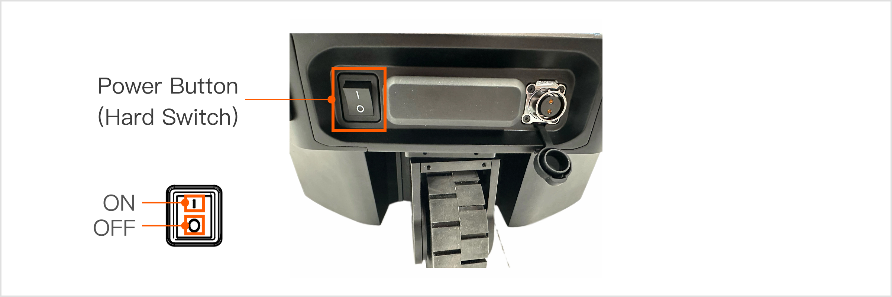
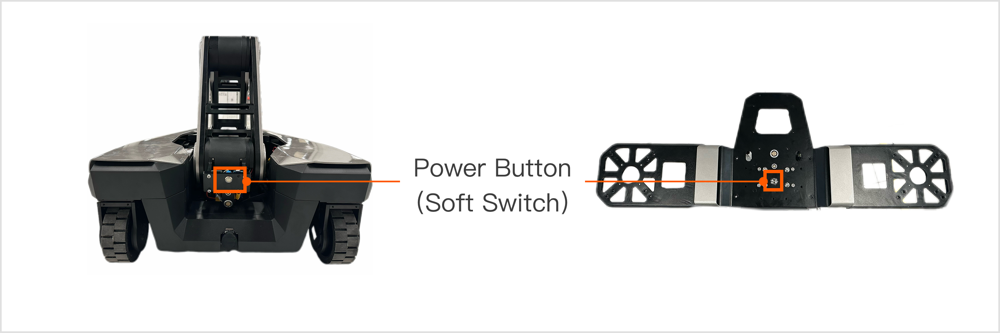
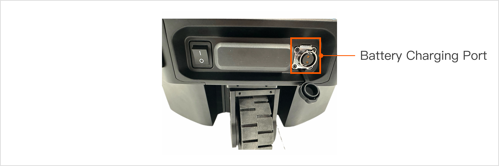
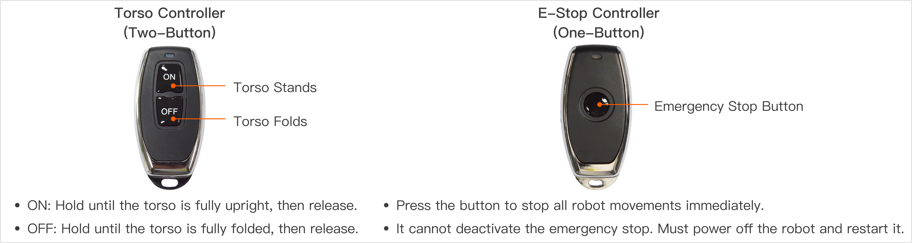
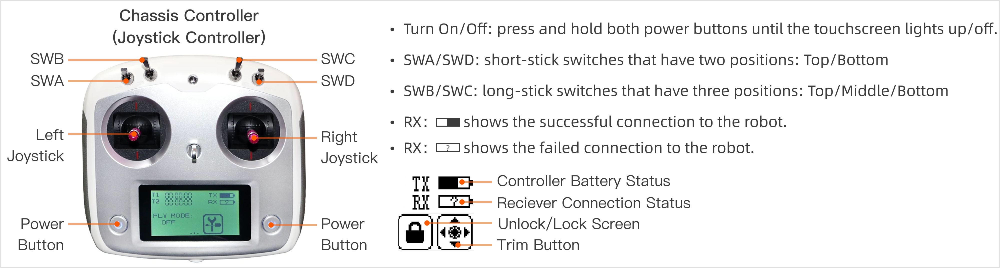
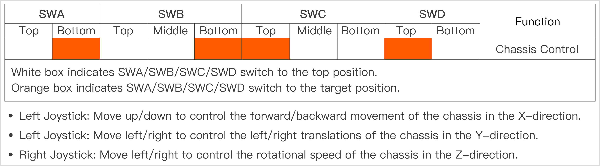

# R1 Lite Basic Usage Introduction
> In this tutorial, you will learn how to power on and operate this new product, beginning your journey of interacting with Galaxea R1 Lite.

## Power On/Off
### Hard Switch
One black and boat-shaped power button is located on the bottom of the rear of the chassis. 

Press the button to power R1 Lite on and off.

### Soft Switch
One silver and circular power button is located at the top of the R1 Lite torso.

- Power On: Press and release the button. A blue indicator light will illuminate, indicating the R1 Lite is powered on.
- Power Off: Press and hold the button for at least 3 seconds, then release. The blue indicator light will turn off, indicating the R1 Lite is powered off.

(The left image shows the soft switch position when the torso is not upright, and the right image shows its position after the platform is installed on the torso.)

## Battery Change
The power socket is located at the front of the chassis (the chassis comes pre-installed with a battery by default).

**Battery Charging Steps:**

1. Unscrew the cover of the battery charging port.
2. Use a 2-core aviation plug charging cable. Connect one end to the chassis charging port and the other end to the AC power input interface.
3. When the red indicator light on the charger turns on, it indicates that the R1 Lite is charging.

**Battery Replacement Steps:**

1. Use an L-shaped wrench to remove the two screws on the right side panel of the chassis, as shown in the left image.
2. Slide the panel to the left to remove the battery cover.
3. Place the battery into the chassis and connect the battery cable to the chassis.
4. Reinstall the battery cover.

## Emergency Stop
The Emergency Stop Button (E-Stop) is a software-based switch that does not cut off the power supply. It is located on the surface at the rear end of the chassis. In case of an emergency or hazardous situation, immediately use the emergency stop button to halt all operations.

**Note: Ensure that the emergency stop button is in the released state when powering on the device.**

## Remote Controller Instructions

The R1 Lite comes with three remote controllers for separately controlling the robot's torso, chassis, and emergency stop. Please follow the instructions below and use the appropriate remote controller to perform different tasks.

**Note: Ensure that all switches (SWA/SWB/SWC/SWD) are in the top position before you do any actions. This will place the machine in a stop state, preventing the robot from operating.** 

Please follow the diagram below to adjust the four toggle switches to the specified positions for controlling the chassis movement:

## Next Step
Our quickstart journey has come to an end. To deepen your mastery of Galaxea R1 Lite, we strongly recommend exploring the following chapters in [Galaxea R1 Lite Product Hardware Introduction](./R1Lite_Hardware_Introduction.md) and Software Introduction. These resources offer a wealth of additional information and practical examples, guiding you through the intricacies of programming with confidence and ease.