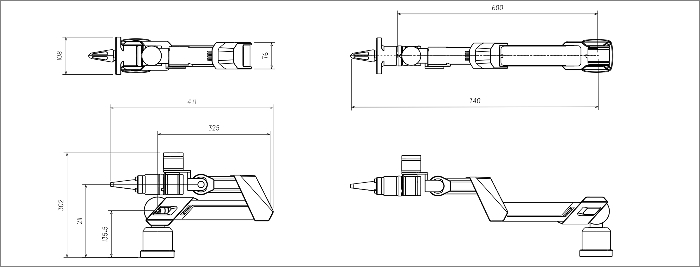
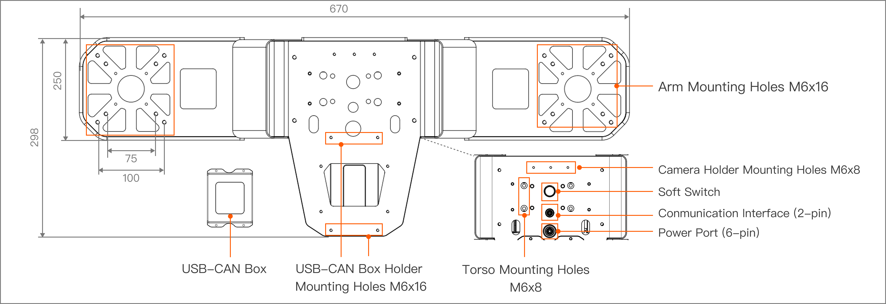
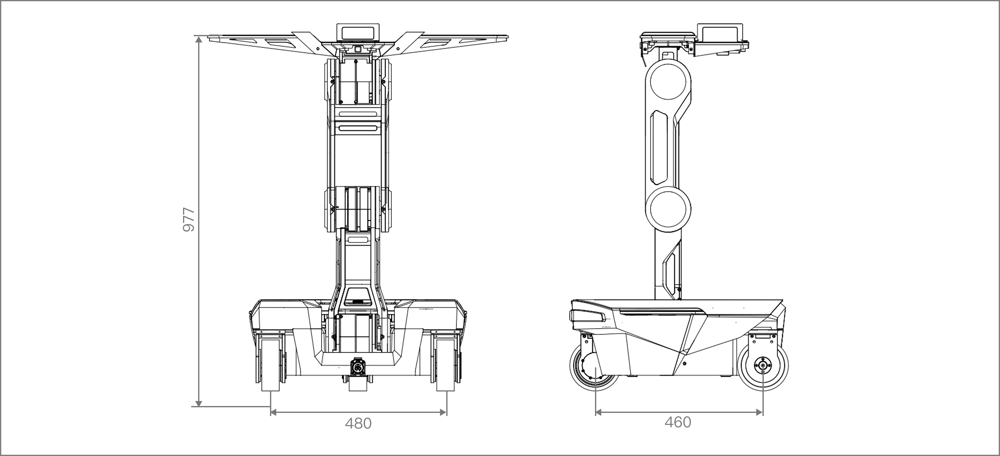
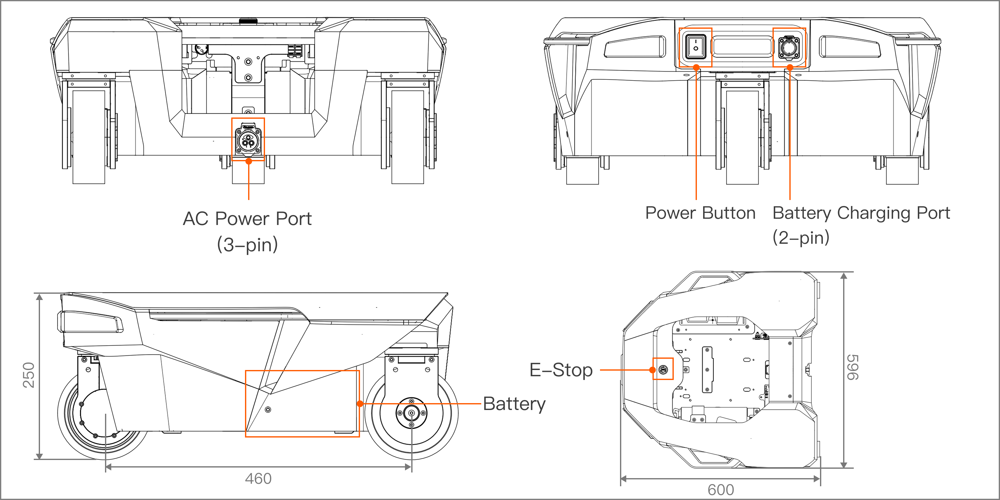

# R1 Lite Product Hardware Introduction
> Galaxea R1 Lite is intended for research applications by users experienced in operating and programming research robots. This product is not designed for general consumer use in the home and does not have the necessary certifications for such purposes. 

## Technical Specifications
<table style="width: 100%; border-collapse: collapse;">
    <thead>
        <tr style="background-color: black; color: white; text-align: left;">
            <th style="width: 300px; padding: 8px; border: 1px solid #ddd;">Mechanical</th>
            <th style="width: 400px; padding: 8px; border: 1px solid #ddd;">Values</th>
        </tr>
    </thead>
    <tbody>
        <tr style="background-color: white; text-align: left;">
            <td style="padding: 8px; border: 1px solid #ddd;">Height</td>
            <td style="padding: 8px; border: 1px solid #ddd;">977 mm when standing</td>
        </tr>
        <tr style="background-color: white; text-align: left;">
            <td style="padding: 8px; border: 1px solid #ddd;">Width</td>
            <td style="padding: 8px; border: 1px solid #ddd;">596 mm</td>
        </tr>
        <tr style="background-color: white; text-align: left;">
            <td style="padding: 8px; border: 1px solid #ddd;">Weight</td>
            <td style="padding: 8px; border: 1px solid #ddd;">55 kg with battery</td>
        </tr>
        <tr style="background-color: white; text-align: left;">
            <td style="padding: 8px; border: 1px solid #ddd;">Rated Voltage</td>
            <td style="padding: 8px; border: 1px solid #ddd;">48 V</td>
        </tr>
        <tr style="background-color: white; text-align: left;">
            <td style="padding: 8px; border: 1px solid #ddd;">Power Supply</td>
            <td style="padding: 8px; border: 1px solid #ddd;">Lithium-ion Battery</td>
        </tr>
        <tr style="background-color: white; text-align: left;">
            <td style="padding: 8px; border: 1px solid #ddd;">Battery Capacity</td>
            <td style="padding: 8px; border: 1px solid #ddd;">15Ah</td>
        </tr>
        <tr style="background-color: white; text-align: left;">
            <td style="padding: 8px; border: 1px solid #ddd;">Battery Energy</td>
            <td style="padding: 8px; border: 1px solid #ddd;">720 Wh</td>
        </tr>
        <tr style="background-color: white; text-align: left;">
            <td style="padding: 8px; border: 1px solid #ddd;">Battery Management System (BMS)</td>
            <td style="padding: 8px; border: 1px solid #ddd;">Supported</td>
        </tr>        
    </tbody>
</table>

<table style="width: 100%; border-collapse: collapse;">
    <thead>
        <tr style="background-color: black; color: white; text-align: left;">
            <th style="width: 300px; padding: 8px; border: 1px solid #ddd;">Performance</th>
            <th style="width: 400px; padding: 8px; border: 1px solid #ddd;">Values</th>
        </tr>
    </thead>
    <tbody>
        <tr style="background-color: white; text-align: left;">
            <td style="padding: 8px; border: 1px solid #ddd;">Degree of Freedom</td>
            <td style="padding: 8px; border: 1px solid #ddd;">23 DOF in total: 6 DOF for chassis 3 DOF for torso 7 DOF for single arm with gripper</td>
        </tr>
        <tr style="background-color: white; text-align: left;">
            <td style="padding: 8px; border: 1px solid #ddd;">Arm Payload</td>
            <td style="padding: 8px; border: 1px solid #ddd;">Rated: 3 kg@0.6 m Max.:5 kg@0.6 m</td>
        </tr>
        <tr style="background-color: white; text-align: left;">
            <td style="padding: 8px; border: 1px solid #ddd;">Operating Range</td>
            <td style="padding: 8px; border: 1px solid #ddd;">Vertical: 0 ~ 1600 mm (250mm in front of the wheel) Horizontal: 760 mm (760mm in front of the wheel)</td>
        <tr style="background-color: white; text-align: left;">
            <td style="padding: 8px; border: 1px solid #ddd;">Function</td>
            <td style="padding: 8px; border: 1px solid #ddd;">Torso: Lift/Tilt Chassis: Ackerman/Translation/Spinning</td>
        </tr>
    </tbody>
</table>

## Robot Structure
### Arm
The robot arm is the central operating component of the R1 Lite, mounted on the platform and utilized to execute a variety of precise operational tasks. The R1 Lite is equipped with two Galaxea A1X robot arms and two Galaxea G1 grippers. It boasts a total of 7 DOF in motion, enabling flexible grasping and manipulation. The six joints of the robot arm are fitted with high-precision, high-torque planetary motors, allowing for independent variable-speed operations.

**Important: For your safety, before you power off R1 Lite, please hold two arms with your hand to prevent it from suddenly falling down, since motors do not have brakes.** 

<table style="width: 100%; border-collapse: collapse;">
    <thead>
        <tr style="background-color: black; color: white; text-align: left;">
            <th style="width: 300px; padding: 8px; border: 1px solid #ddd;">Arm（without gripper）</th>
            <th style="width: 400px; padding: 8px; border: 1px solid #ddd;">Notes</th>
        </tr>
    </thead>
    <tbody>
        <tr style="background-color: white; text-align: left;">
            <td style="padding: 8px; border: 1px solid #ddd;">Dimensions</td>
            <td style="padding: 8px; border: 1px solid #ddd;">Deployed: 600L x 100W mm Folded: 385L x 100W mm</td>
        </tr>
        <tr style="background-color: white; text-align: left;">
            <td style="padding: 8px; border: 1px solid #ddd;">Degree of Freedom</td>
            <td style="padding: 8px; border: 1px solid #ddd;">6</td>
        </tr>
        <tr style="background-color: white; text-align: left;">
            <td style="padding: 8px; border: 1px solid #ddd;">Pyload</td>
            <td style="padding: 8px; border: 1px solid #ddd;">Rated: 3 kg@0.6 m Max.: 5 kg@0.6 m</td>
        </tr>
        <tr style="background-color: white; text-align: left;">
            <td style="padding: 8px; border: 1px solid #ddd;">Weight</td>
            <td style="padding: 8px; border: 1px solid #ddd;">4.2 kg</td>
        </tr>
    </tbody>
</table>

<table style="width: 100%; border-collapse: collapse;">
    <thead>
        <tr style="background-color: black; color: white; text-align: left;">
            <th style="width: 300px; padding: 8px; border: 1px solid #ddd;">Gripper</th>
            <th style="width: 400px; padding: 8px; border: 1px solid #ddd;">Notes</th>
        </tr>
    </thead>
    <tbody>
        <tr style="background-color: white; text-align: left;">
            <td style="padding: 8px; border: 1px solid #ddd;">Gripper Rated Force</td>
            <td style="padding: 8px; border: 1px solid #ddd;">100 N</td>
        </tr>
        <tr style="background-color: white; text-align: left;">
            <td style="padding: 8px; border: 1px solid #ddd;">Gripper Stroke</td>
            <td style="padding: 8px; border: 1px solid #ddd;">0 ~ 100 mm</td>
        </tr>
    </tbody>
</table>

### Platform
The platform serves as the foundational base for the installation of the robot arm, mounted atop the torso. It provides stable support for the robot arm and, through its connection with the torso, ensures overall structural coordination. The design of the platform emphasizes structural strength and stability, enabling it to withstand various forces and torques generated by the robot arm during operation. Additionally, it is equipped with precise mounting interfaces to facilitate the rapid installation and debugging of the robot arm.

<table style="width: 100%; border-collapse: collapse;">
    <thead>
        <tr style="background-color: black; color: white; text-align: left;">
            <th style="width: 300px; padding: 8px; border: 1px solid #ddd;">Platform</th>
            <th style="width: 400px; padding: 8px; border: 1px solid #ddd;">Notes</th>
        </tr>
    </thead>
    <tbody>
        <tr style="background-color: white; text-align: left;">
            <td style="padding: 8px; border: 1px solid #ddd;">Dimensions</td>
            <td style="padding: 8px; border: 1px solid #ddd;">670L x 298W mm</td>
        </tr>
        <tr style="background-color: white; text-align: left;">
            <td style="padding: 8px; border: 1px solid #ddd;">Peripheral Interfaces</td>
            <td style="padding: 8px; border: 1px solid #ddd;">2-pin aviation connector for communication 6-pin aviation connector for power supply</td>
        </tr>
    </tbody>
</table>

### Torso
The torso is the main structure of the R1 Lite, serving to connect the platform and the chassis.  It not only provides support for the robot arms and the platform but also houses some critical electrical and control systems, making it an essential component of the entire robot. The design of the torso emphasizes compactness and reliability, while also ensuring efficient use of internal space.

<table style="width: 100%; border-collapse: collapse;">
    <thead>
        <tr style="background-color: black; color: white; text-align: left;">
            <th style="width: 300px; padding: 8px; border: 1px solid #ddd;">Torso</th>
            <th style="width: 400px; padding: 8px; border: 1px solid #ddd;">Notes</th>
        </tr>
    </thead>
    <tbody>
        <tr style="background-color: white; text-align: left;">
            <td style="padding: 8px; border: 1px solid #ddd;">Waist Movement Space (Yaw)</td>
            <td style="padding: 8px; border: 1px solid #ddd;">± 170°</td>
        </tr>
        <tr style="background-color: white; text-align: left;">
            <td style="padding: 8px; border: 1px solid #ddd;">Hip Movement Space (Pitch)</td>
            <td style="padding: 8px; border: 1px solid #ddd;">± 100°</td>
        </tr>
        <tr style="background-color: white; text-align: left;">
            <td style="padding: 8px; border: 1px solid #ddd;">Knee Movement Space</td>
            <td style="padding: 8px; border: 1px solid #ddd;">W1: 0°~100° W2: -154°~145°</td>
        </tr>
        <tr style="background-color: white; text-align: left;">
            <td style="padding: 8px; border: 1px solid #ddd;">Torso Motor Torque </td>
            <td style="padding: 8px; border: 1px solid #ddd;">Rated: 108 Nm Max.: 304 Nm</td>
        </tr>
        <tr style="background-color: white; text-align: left;">
            <td style="padding: 8px; border: 1px solid #ddd;">Soft Switch</td>
            <td style="padding: 8px; border: 1px solid #ddd;">Used to power R1 Lite on and off.</td>
        </tr>
    </tbody>
</table>

### Chassis
The chassis is the foundational support structure of the R1 Lite, featuring a self-developed three-steering-wheel module, W1, with a total of 6 DOF, enabling 360° unlimited rotation. This design allows the robot to move and turn with greater flexibility, adapting to complex environments and task requirements.

**Important: The R1 Lite supports two power supply modes: battery-powered or AC-powered. Users can select the appropriate power configuration for the robot based on their specific needs.**

<table style="width: 100%; border-collapse: collapse;">
    <thead>
        <tr style="background-color: black; color: white; text-align: left;">
            <th style="width: 300px; padding: 8px; border: 1px solid #ddd;">Chassis</th>
            <th style="width: 400px; padding: 8px; border: 1px solid #ddd;">Notes</th>
        </tr>
    </thead>
    <tbody>
        <tr style="background-color: white; text-align: left;">
            <td style="padding: 8px; border: 1px solid #ddd;">Dimensions</td>
            <td style="padding: 8px; border: 1px solid #ddd;">596L x 600W x 250H mm</td>
        </tr>
        <tr style="background-color: white; text-align: left;">
            <td style="padding: 8px; border: 1px solid #ddd;">Power Button</td>
            <td style="padding: 8px; border: 1px solid #ddd;">Hard switch, used to turn on/off the R1 Lite.</td>
        </tr>
        <tr style="background-color: white; text-align: left;">
            <td style="padding: 8px; border: 1px solid #ddd;">Emergency Stop Button</td>
            <td style="padding: 8px; border: 1px solid #ddd;">Used immediately halt all operations in case of an emergency.</td>
        </tr>
        <tr style="background-color: white; text-align: left;">
            <td style="padding: 8px; border: 1px solid #ddd;">Battery Charging Port</td>
            <td style="padding: 8px; border: 1px solid #ddd;">Rated voltage 48 V</td>
        </tr>
        <tr style="background-color: white; text-align: left;">
            <td style="padding: 8px; border: 1px solid #ddd;">AC Charging Port</td>
            <td style="padding: 8px; border: 1px solid #ddd;">Rated Voltage: 110 - 220 V (Optional)</td>
        </tr>
    </tbody>
</table>

### Sensors
The Galaxea R1 Lite offers optional platform binocular cameras and wrist cameras on the robot arms.

<table style="width: 100%; border-collapse: collapse;">
    <thead>
        <tr style="background-color: black; color: white; text-align: left;">
            <th style="width: 300px; padding: 8px; border: 1px solid #ddd;">Sensor</th>
            <th style="width: 400px; padding: 8px; border: 1px solid #ddd;">Values</th>
        </tr>
    </thead>
    <tbody>
        <tr style="background-color: white; text-align: left;">
            <td style="padding: 8px; border: 1px solid #ddd;">Camera</td>
            <td style="padding: 8px; border: 1px solid #ddd;">Platform: 1 x Binocular Camera Wrist: 2 x Monocular Depth Camera</td>
        </tr>
    </tbody>
</table>

#### Camera
<table style="width: 100%; border-collapse: collapse;">
    <thead>
        <tr style="background-color: black; color: white; text-align: left;">
            <th style="width: 150px; padding: 8px; border: 1px solid #ddd;">Specification</th>
            <th style="width: 250px; padding: 8px; border: 1px solid #ddd;">Platform</th>
            <th style="width: 250px; padding: 8px; border: 1px solid #ddd;">Wrist</th>
        </tr>
    </thead>
    <tbody>
        <tr style="background-color: white; text-align: left;">
            <td style="padding: 8px; border: 1px solid #ddd;">Type</td>
            <td style="padding: 8px; border: 1px solid #ddd;">Binocular Depth Camera</td>
            <td style="padding: 8px; border: 1px solid #ddd;">Monocular Depth Camera</td>
        </tr>
        <tr style="background-color: white; text-align: left;">
            <td style="padding: 8px; border: 1px solid #ddd;">Quantity</td>
            <td style="padding: 8px; border: 1px solid #ddd;">1</td>
            <td style="padding: 8px; border: 1px solid #ddd;">2</td>
        </tr>
        <tr style="background-color: white; text-align: left;">
            <td style="padding: 8px; border: 1px solid #ddd;">Output Resolution</td>
            <td style="padding: 8px; border: 1px solid #ddd;">2560*720 @15/30/60FPS  </td>
            <td style="padding: 8px; border: 1px solid #ddd;">1280 x 720 @30FPS  (RGB 1920 x 1080)</td>
        </tr>
        <tr style="background-color: white; text-align: left;">
            <td style="padding: 8px; border: 1px solid #ddd;">FOV</td>
            <td style="padding: 8px; border: 1px solid #ddd;">126°H x 116°V x 80°D</td>
            <td style="padding: 8px; border: 1px solid #ddd;">87°H x 58°V x 95°D</td>
        </tr>
        <tr style="background-color: white; text-align: left;">
            <td style="padding: 8px; border: 1px solid #ddd;">Depth Range</td>
            <td style="padding: 8px; border: 1px solid #ddd;">0.25 m ~ 10 m</td>
            <td style="padding: 8px; border: 1px solid #ddd;">0.2 m ~ 3 m</td>
        </tr>
        <tr style="background-color: white; text-align: left;">
            <td style="padding: 8px; border: 1px solid #ddd;">Operating Temp. Range</td>
            <td style="padding: 8px; border: 1px solid #ddd;">-10 °C ~ +45°C</td>
            <td style="padding: 8px; border: 1px solid #ddd;">0 ~ +85℃</td>
        </tr>
        <tr style="background-color: white; text-align: left;">
            <td style="padding: 8px; border: 1px solid #ddd;">Dimensions</td>
            <td style="padding: 8px; border: 1px solid #ddd;">90L x 18W x 17.8H mm</td>
            <td style="padding: 8px; border: 1px solid #ddd;">90L x 25W x 25H mm</td>
        </tr>
        <tr style="background-color: white; text-align: left;">
            <td style="padding: 8px; border: 1px solid #ddd;">Weight</td>
            <td style="padding: 8px; border: 1px solid #ddd;">50 g</td>
            <td style="padding: 8px; border: 1px solid #ddd;">75 g</td>
        </tr>
    </tbody>
</table>

### Computing Unit
<table style="width: 100%; border-collapse: collapse;">
    <thead>
        <tr style="background-color: black; color: white; text-align: left;">
            <th style="width: 300px; padding: 8px; border: 1px solid #ddd;">Units</th>
            <th style="width: 400px; padding: 8px; border: 1px solid #ddd;">NUC</th>
        </tr>
    </thead>
    <tbody>
        <tr style="background-color: white; text-align: left;">
            <td style="padding: 8px; border: 1px solid #ddd;">Basic Computating Capability</td>
            <td style="padding: 8px; border: 1px solid #ddd;">14 Core 2.5GHz CPU I9-12900HK (Up to 5.0 Ghz)</td>
        </tr>
        <tr style="background-color: white; text-align: left;">
            <td style="padding: 8px; border: 1px solid #ddd;">Power Supply</td>
            <td style="padding: 8px; border: 1px solid #ddd;">Voltage: 19 V Current: 6.32 A </td>
        </tr>
        <tr style="background-color: white; text-align: left;">
            <td style="padding: 8px; border: 1px solid #ddd;">Weight</td>
            <td style="padding: 8px; border: 1px solid #ddd;">358 g</td>
        </tr>
        <tr style="background-color: white; text-align: left;">
            <td style="padding: 8px; border: 1px solid #ddd;">Memory</td>
            <td style="padding: 8px; border: 1px solid #ddd;">1 x LPDDR4@32G </td>
        </tr>
        <tr style="background-color: white; text-align: left;">
            <td style="padding: 8px; border: 1px solid #ddd;">Hard Disk</td>
            <td style="padding: 8px; border: 1px solid #ddd;">1 x SSD@1T</td>
        </tr>
        <tr style="background-color: white; text-align: left;">
            <td style="padding: 8px; border: 1px solid #ddd;">Interface</td>
            <td style="padding: 8px; border: 1px solid #ddd;">USB2.0: 1 USB3.0: 3 Type-C: 1 HDMI: 2</td>
        </tr>
        <tr style="background-color: white; text-align: left;">
            <td style="padding: 8px; border: 1px solid #ddd;">Heat Dissipation</td>
            <td style="padding: 8px; border: 1px solid #ddd;">Smart fan + All-copper heat sink</td>
        </tr>
        <tr style="background-color: white; text-align: left;">
            <td style="padding: 8px; border: 1px solid #ddd;">WiFi Module</td>
            <td style="padding: 8px; border: 1px solid #ddd;">AX 201, WIFI 6</td>
        </tr>
        <tr style="background-color: white; text-align: left;">
            <td style="padding: 8px; border: 1px solid #ddd;">Bluetooth</td>
            <td style="padding: 8px; border: 1px solid #ddd;">BT 5.2</td>
        </tr>
    </tbody>
</table>

For different configurations, please contact us at product@galaxea.ai

## Next Step
This concludes the hardware guide for Galaxea R1 Lite. For further details, please refer to Galaxea R1 Lite Software Guide.