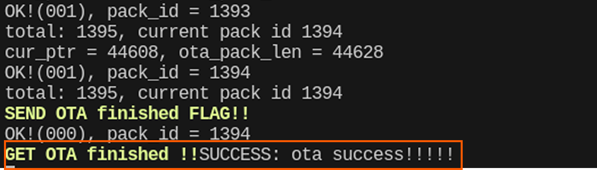

# Galaxea R1 Pro Software Version_V2.0.1_Changelog

## Release Notes

**Product Name:** Galaxea R1 Pro

**Software Version:** SDK V2.0.1

**Ubuntu System:** 22.04 LTS

**ROS Version:** ROS 2 Humble

**Release Date:** April 28, 2025 (GMT +8)

**Update Content:**
<span style="color:red;">**This migration only includes modules related to the R1ProBody, and the supported functionalities are consistent with the [R1 Pro ROS 1 Noetic SDK V1.1.7](../ROS1/v1.1.7.md). **</span>

1. **Software Dependancy Update Items:**

    a) Update the operation enviroment to Ubuntu 22.04 LTS.

    b) Update Robot Operation System to ROS 2 Humble.
2. **Motion Control Update Items:**

    a) Add R1 Pro VR Teleoperation function. 

3. **Driver (HDAS) Update Items:**

    a) Optimize the controller firmware.


## Update Instruction

1. During the upgrade process, do not interrupt the system operation or perform any control actions, as this may cause the upgrade to fail and affect normal system operation.
2. After the upgrade is complete, power off the R1 system and then power it back on to ensure the update is fully applied.

<span style="color:red;">**Please follow the tutorial below to complete this system update. If you encounter any issues, contact us at [support@galaxea.ai](mailto:support@galaxea.ai) for technical support!**</span>

## Update Tutorial
### Download the Update Package

- Google Drive：[R1 Pro SDK V2.0.1](https://drive.google.com/drive/folders/1ogSQ39SNX0DFtiUSNoHRA-zVV2GRCC8z?usp=sharing)
- Baidu Cloud: [R1 Pro SDK V2.0.1](https://pan.baidu.com/s/1jtx2__dnKTorvPYbJ6TRNg?pwd=v201)

### Extract the Package 

```Bash
tar -xf ${your_download_path}/atc_standard-V2.0.1.tar.gz -C ~/
cd ~/
find ./install -name "*.sh" -exec sudo chmod +x {} \;
```
### Start CAN Driver

```Bash
# Terminal 1
sudo ip link set can0 down
sudo ip link set can0 type can bitrate 1000000 dbitrate 5000000 fd on       
sudo ip link set can0 up
```

### Update Embedded Firmware

```Bash
# Terminal 2
cd ~/ && source install/setup.bash
cd ~/install/Embedded_Software_Firmware/share/tools/R1PRO
sudo chmod +x r1pro_embedded_firmware_upgrade.sh
./r1pro_embedded_firmware_upgrade.sh ../../firmware/R1PRO/V2_0_1
```

Wait a moment until **"GET OTA finished!!"** appears.



<span style="color:red;">**After completing the update, power off the robot and then power it back on.**</span>


### Execute the Module

```Bash
cd install/startup_config/share/startup_config/script/
# R1PRO BODY：
./robot_startup.sh boot ../session.d/ATCStandard/R1PROBody.d/
# R1PRO VRTELEOP：
./robot_startup.sh boot ../session.d/ATCStandard/R1PROVRTeleop.d/
```

