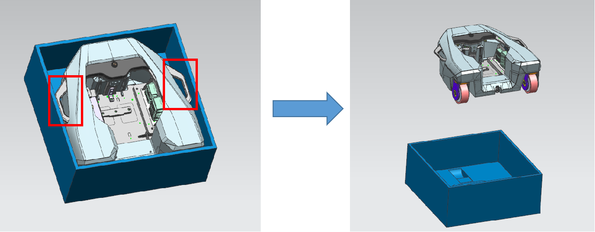
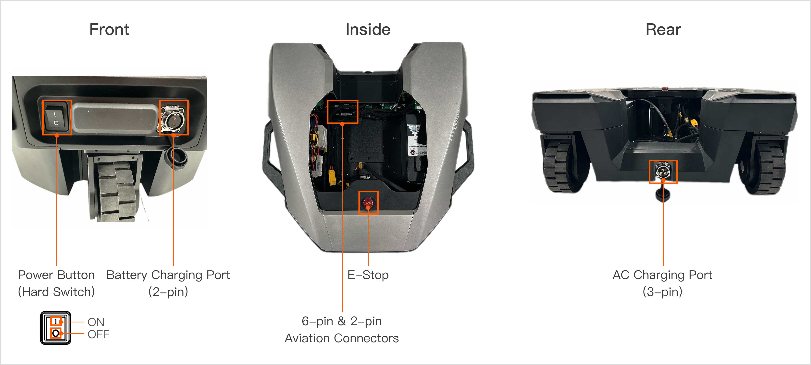
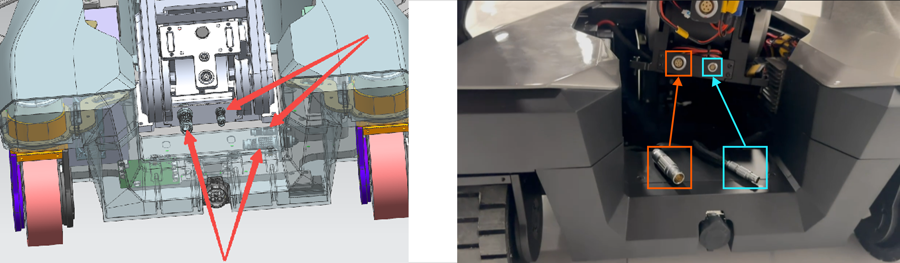
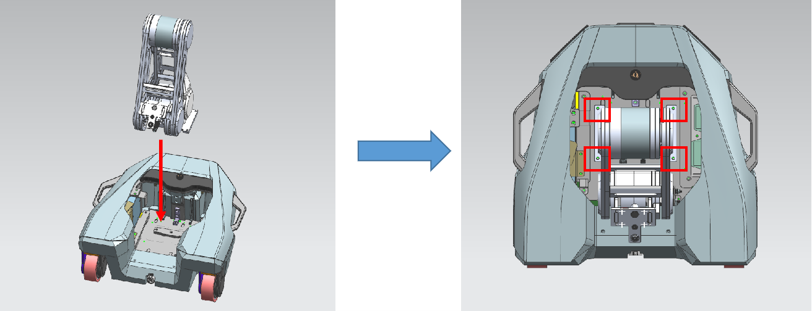
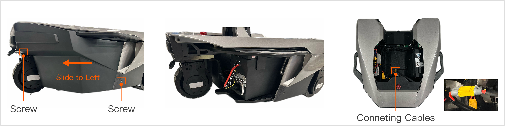
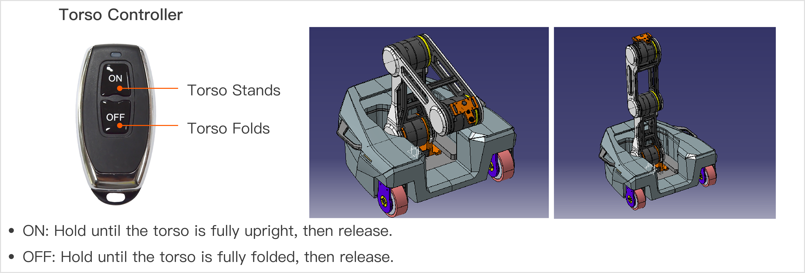
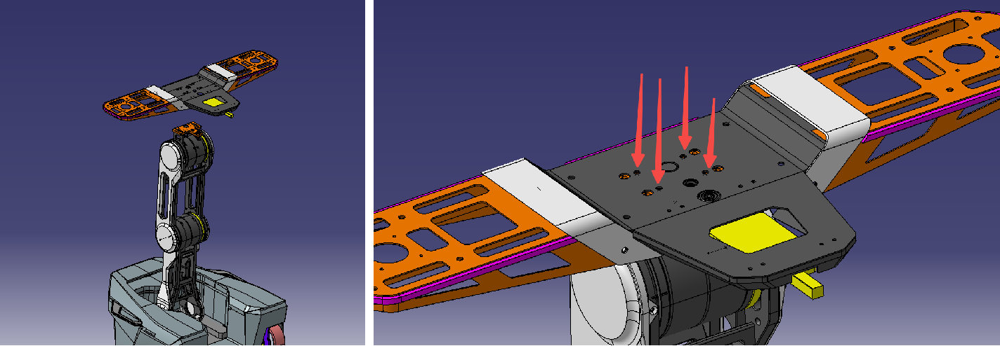

# R1 Lite_Unboxing and Startup Guide
> In this tutorial, we'll offer detailed guidance on unpacking the Galaxea R1 Lite, connecting cables, installing the robot arm, and achieving remote control of R1 for enhanced communication and functionality exploration.

## Instruction Video

<iframe width="720" height="350" src="https://youtu.be/jPyW3BnnwwY" title="R1 Lite Unboxing and Startup Guide" frameborder="0" allow="accelerometer; autoplay; clipboard-write; encrypted-media; gyroscope; picture-in-picture; web-share" referrerpolicy="strict-origin-when-cross-origin" allowfullscreen></iframe>

## 1. Item List Check
Upon receiving the product, check the contents of the box against the following list.
<table style="width: 100%; border-collapse: collapse;">
    <thead>
        <tr style="background-color: black; color: white; text-align: left;">
            <th style="width: 300px; padding: 8px; border: 1px solid #ddd;">Item</th>
            <th style="width: 400px; padding: 8px; border: 1px solid #ddd;">Quantity</th>
        </tr>
    </thead>
    <tbody>
        <tr style="background-color: white; text-align: left;">
            <td style="padding: 8px; border: 1px solid #ddd;">R1 Lite Chassis</td>
            <td style="padding: 8px; border: 1px solid #ddd;">1</td>
        </tr>
        <tr style="background-color: white; text-align: left;">
            <td style="padding: 8px; border: 1px solid #ddd;">R1 Lite Torso</td>
            <td style="padding: 8px; border: 1px solid #ddd;">1</td>
        </tr>
        <tr style="background-color: white; text-align: left;">
            <td style="padding: 8px; border: 1px solid #ddd;">R1 Lite Platform </td>
            <td style="padding: 8px; border: 1px solid #ddd;">1</td>
        </tr>
        <tr style="background-color: white; text-align: left;">
            <td style="padding: 8px; border: 1px solid #ddd;">Power Supply Spring Wire</td>
            <td style="padding: 8px; border: 1px solid #ddd;">1</td>
        </tr>
        <tr style="background-color: white; text-align: left;">
            <td style="padding: 8px; border: 1px solid #ddd;">Side-mount Kit</td>
            <td style="padding: 8px; border: 1px solid #ddd;">2</td>
        </tr>
        <tr style="background-color: white; text-align: left;">
            <td style="padding: 8px; border: 1px solid #ddd;">Joystick Controller</td>
            <td style="padding: 8px; border: 1px solid #ddd;">1</td>
        </tr>
        <tr style="background-color: white; text-align: left;">
            <td style="padding: 8px; border: 1px solid #ddd;">One-button Controller</td>
            <td style="padding: 8px; border: 1px solid #ddd;">1</td>
        </tr>
        <tr style="background-color: white; text-align: left;">
            <td style="padding: 8px; border: 1px solid #ddd;">Two-button Controller</td>
            <td style="padding: 8px; border: 1px solid #ddd;">1</td>
        </tr>        
        <tr style="background-color: white; text-align: left;">
            <td style="padding: 8px; border: 1px solid #ddd;">USB-CAN Box & 2-pin Aviation Cable & USB Cable</td>
            <td style="padding: 8px; border: 1px solid #ddd;">1</td>
        </tr>
        <tr style="background-color: white; text-align: left;">
            <td style="padding: 8px; border: 1px solid #ddd;">6-pin Aviation Cable & Power Cable</td>
            <td style="padding: 8px; border: 1px solid #ddd;">1</td>
        </tr>        
    </tbody>
</table>
<table style="width: 100%; border-collapse: collapse;">
    <thead>
        <tr style="background-color: black; color: white; text-align: left;">
            <th style="width: 300px; padding: 8px; border: 1px solid #ddd;">W1 Calibration Board</th>
            <th style="width: 400px; padding: 8px; border: 1px solid #ddd;">3</th>
        </tr>
    </thead>
    <tbody>
        <tr style="background-color: white; text-align: left;">
            <td style="padding: 8px; border: 1px solid #ddd;">L-hex Wrench</td>
            <td style="padding: 8px; border: 1px solid #ddd;">1</td>
        </tr>
        <tr style="background-color: white; text-align: left;">
            <td style="padding: 8px; border: 1px solid #ddd;">Repair Kit</td>
            <td style="padding: 8px; border: 1px solid #ddd;">1</td>
        </tr>
        <tr style="background-color: white; text-align: left;">
            <td style="padding: 8px; border: 1px solid #ddd;">Screw M6*16</td>
            <td style="padding: 8px; border: 1px solid #ddd;">8</td>
        </tr>
        <tr style="background-color: white; text-align: left;">
            <td style="padding: 8px; border: 1px solid #ddd;">Screw M6*12</td>
            <td style="padding: 8px; border: 1px solid #ddd;">8</td>
        </tr>
    </tbody>
</table>

Also, prepare the following items:
<table style="width: 100%; border-collapse: collapse;">
    <thead>
        <tr style="background-color: black; color: white; text-align: left;">
            <th style="width: 300px; padding: 8px; border: 1px solid #ddd;">Item</th>
            <th style="width: 400px; padding: 8px; border: 1px solid #ddd;">Quantity</th>
        </tr>
    </thead>
    <tbody>
        <tr style="background-color: white; text-align: left;">
            <td style="padding: 8px; border: 1px solid #ddd;">Tiger pliers (unpacking tool)</td>
            <td style="padding: 8px; border: 1px solid #ddd;">1</td>
        </tr>
    </tbody>
</table>

## 2. Open the Box
Use the unpacking tool to remove the iron sheets around the shipping box, then open the lid.

## 3. Take out the Chassis
Grip the handles on both sides of the chassis to take it out of the box.

- The front of the chassis has a power switch and a battery charging port (2-pin).
- Inside the chassis, there's a 6-pin aviation plug wire and a 2-pin wire for connecting the chassis and torso.
- The back of the chassis has an AC charging port (3-pin). If your robot lacks a battery module, it must be connected to AC power to start.

## 4. Install the Torso
Follow these steps for smooth installation and startup.

### 4.1 Take Out the Torso
Grip both sides of the torso (as shown) to take it out of the box.

### 4.2 Connect the Chassis and Torso Wiring
Insert the 6-pin and 2-pin aviation plugs from the chassis into the corresponding torso ports.

### 4.3 Secure the Torso
Note: For easier wiring, it's recommended to connect the aviation plugs first (as in Section 3) before placing the torso into the chassis.

Use four M6x16 screws to secure the torso inside the chassis, as shown.

Note: Ensure you use M6x16 screws. Incorrect ones may damage components.

## 5. Install the Battery
The battery unit is usually pre-installed in the chassis. However, due to shipping restrictions in some regions, it may be shipped separately, requiring you to install it upon receipt. (If the chassis already has the battery, skip this section and go to [Section 6-Powering On](#6-powering-on).)

Follow these steps to install the battery:

1. Use an L-hex wrench to remove the two screws on the left-front cover of the chassis, then slide the cover left to remove it.
2. Place the battery horizontally inside the chassis.
3. Connect the battery to the internal wiring of the chassis.
4. Reattach the cover to the chassis.

## 6. Powering On
If your robot has an internal battery with sufficient charge, power it on as follows:

1. Press the power button on the back of the chassis.
2. Long-press the soft switch on the torso for 3 seconds, then release it when you hear the startup sound.

If your robot has no battery and it is charging-enabled, follow these steps:

1. Connect the power cable (3-pin aviation plug) to the power input port on the front of the chassis.
2. Press the power button on the back of the chassis.
3. Long-press the soft switch on the torso for 3 seconds, then release it when you hear the startup sound.

## 7. Raise the torso
The torso controller has two buttons. Operate as follows:

- "ON": Hold until the torso is fully upright, then release.
- "OFF": Hold until the torso is fully folded, then release.

## 8. Install the platform
Remove the platform from the box and use four M6x8 screws to secure it on top of the torso, as shown.

Place a washer and then tighten the screw.

Note: Use M6x8 screws. Incorrect ones may damage components.

Follow the above steps meticulously to ensure all connections and installations are correct. If any issues arise during operation, consult the notes in this manual or contact our customer service for support.