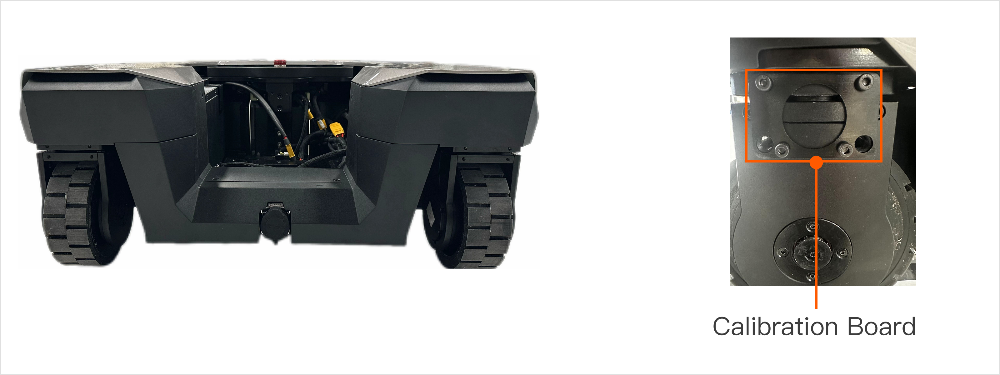

# R1 Lite Wheel Motor Zero-Point Calibration Instruction
<span style="color: red;">**Important Notice: Follow these steps strictly. Incorrect operations may damage the W1 module/calibration tools or affect robot usage. Contact support if issues arise.**</span>

## 1. Preparation
### 1.1  Hardware Preparation
<table style="width: 100%; border-collapse: collapse;">
    <thead>
        <tr style="background-color: black; color: white; text-align: left;">
            <th style="width: 300px; padding: 8px; border: 1px solid #ddd;">Item</th>
            <th style="width: 400px; padding: 8px; border: 1px solid #ddd;">Quantity</th>
            <th style="width: 400px; padding: 8px; border: 1px solid #ddd;">Notes</th>
        </tr>
    </thead>
    <tbody>
        <tr style="background-color: white; text-align: left;">
            <td style="padding: 8px; border: 1px solid #ddd;">Mini PC</td>
            <td style="padding: 8px; border: 1px solid #ddd;">1</td>
            <td style="padding: 8px; border: 1px solid #ddd;">Controls and calibrates robot. </br>System: Ubuntu 20.04 ROS Noetic</td>
        </tr>
        <tr style="background-color: white; text-align: left;">
            <td style="padding: 8px; border: 1px solid #ddd;">USB-CAN Box</td>
            <td style="padding: 8px; border: 1px solid #ddd;">1</td>
            <td style="padding: 8px; border: 1px solid #ddd;">For robot communication.</td>
        </tr>
        <tr style="background-color: white; text-align: left;">
            <td style="padding: 8px; border: 1px solid #ddd;">Calibration Board</td>
            <td style="padding: 8px; border: 1px solid #ddd;">3</td>
            <td style="padding: 8px; border: 1px solid #ddd;">For robot zero calibration.</td>
        </tr>
        <tr style="background-color: white; text-align: left;">
            <td style="padding: 8px; border: 1px solid #ddd;">Wrench</td>
            <td style="padding: 8px; border: 1px solid #ddd;">1</td>
            <td style="padding: 8px; border: 1px solid #ddd;">Installs/removes calibration board.</td>
        </tr>
    </tbody>
</table>

### 1.2 Install Essential Tools
On the mini PC, install necessary tools for smooth robot communication:

```Bash
sudo apt install can-utils
```
## 2. Calibration Steps
### 2.1 Power On and Connect
Power on the robot. Connect the USB-CAN cable to the mini PC's USB port. Ensure all connections are correct and power indicators are lit.

### 2.2 Enable FDCAN Communication
```Bash
sudo ip link set dev can0 type can bitrate 1000000 dbitrate 5000000 fd on
sudo ip link set up can0
```
<span style="color: red;">**Note: If commands fail, check USBCAN connection and network settings on the mini PC.**</span>

### 2.3 Disable Steering Motors


Execute the following commands to disable steering motors:
<span style="color: red;">**Note: Ensure the robot is stationary.**</span>

```Bash
cansend can0 034#0102  #Disables Motor 01
cansend can0 034#0202  #Disables Motor 02
cansend can0 034#0302  #Disables Motor 03

# Command format:
# cansend <CAN_Interface> <CANID>#<COMMAND>
    # CANID: 034
    # COMMAND: Motor index + command code(01: enable, 02: disable)
```

### 2.4 Install Calibration Board
Install according to steering wheel direction. Ensure all three wheels face forward and are perpendicular to the ground. Incorrect installation may cause unexpected chassis movement.

Tighten all screws to prevent loosening during calibration.




### 2.5 Recalibrate Zero Position
Execute the following commands to recalibrate:

<span style="color: red;">**Note: Ensure the robot is stationary.**</span>

```Bash
cansend can0 034#0103  # Calibrates Motor 01
cansend can0 034#0203  # Calibrates Motor 02
cansend can0 034#0303  # Calibrates Motor 03

# Command format:
# cansend <CAN_Interface> <CANID>#<COMMAND>
    # CANID: 034
    # COMMAND: Motor Index + Command Code (01: enable, 02: disable, 03: calibrate)
```

### 2.6 Remove Calibration Board and Power Off
Carefully remove the calibration board. Then power off the robot.

<span style="color: red;">**Note: Handle the calibration board carefully to avoid damage.**</span>

## 3. Restart and Check Zero Position
Power on the robot again. Check if it reaches the expected zero position. If not, repeat [section 2.5](#25-recalibrate-zero-position). 

Contact support if the issue persists.