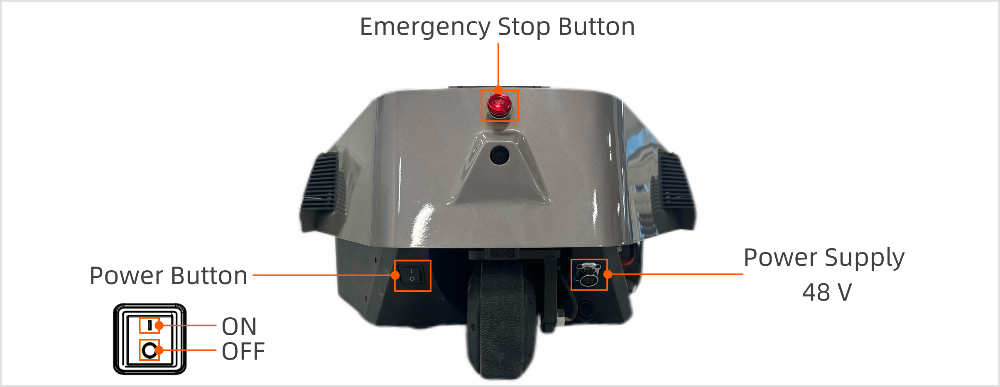
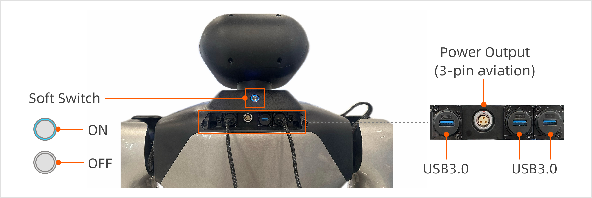
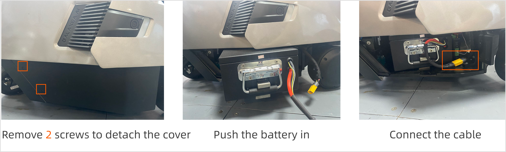
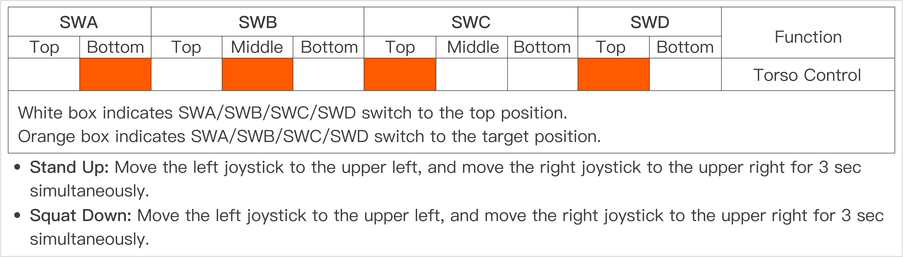
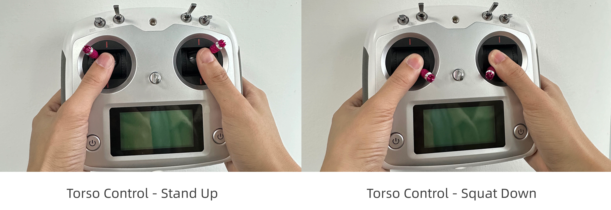
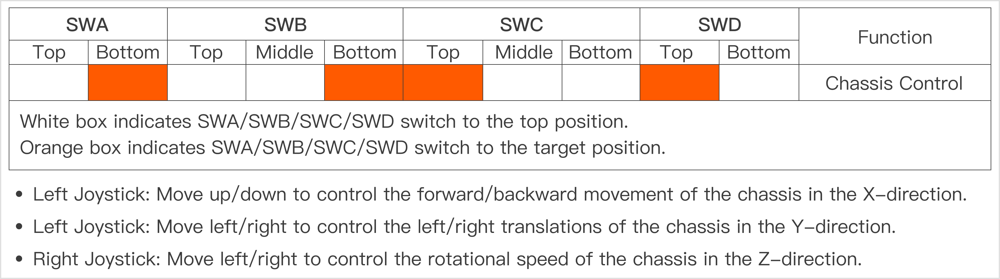
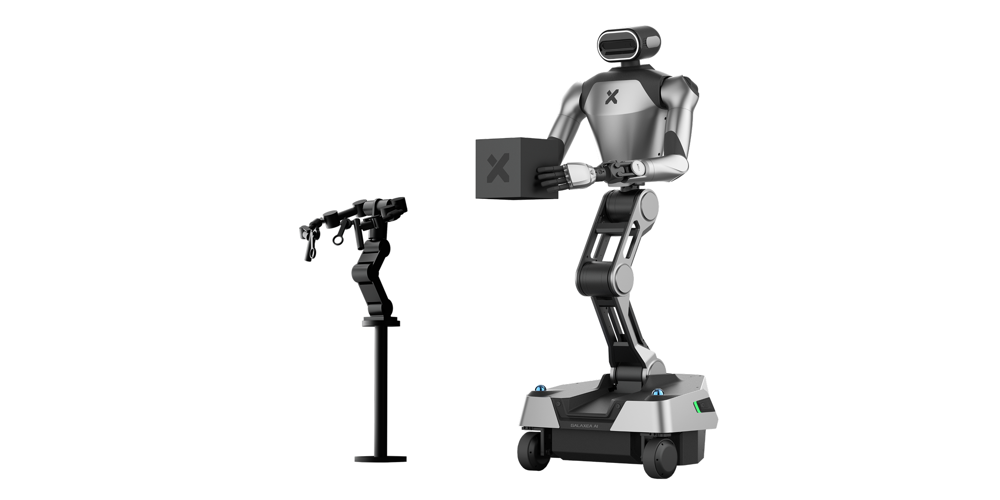

# R1 Pro Getting Started
> In this tutorial, <u>you will learn how to power on and operate this new product,</u> beginning your journey of interacting with Galaxea R1 Pro.

## Power On/Off
### Hard Switch
One black and boat-shaped power button is located on the bottom of the rear of the chassis.

Press the button to power the robot on and off.

### Soft Switch
One silver and circular power button is located on the back of the neck.

- Press down the button and release it. The blue light will turn on, indicating that R1 Pro is powered on.
- Press down and hold the button for more than 3 seconds, then release it. The blue light will turn off, indicating that R1 Pro is powered off.

### Emergency Stop
The emergency stop button, a software-based switch that does not cut off power, is located at the bottom of the rear of the chassis. It can be used to immediately halt all operations in case of an emergency or if you encounter any dangerous situations.

Note: Please keep the emergency stop button released when powered on.

## Battery Charge
The power supply port is located at the bottom of the rear of the chassis. To charge the robot, unscrew the plug case, and insert the power cord into the port. When the red light on the charger is on and the battery indicator on the chassis is flashing in green, it indicates that R1 Pro is charging.

The battery is located at the bottom of the right side of the chassis. To change the battery,

1. Remove 2 screws and slide the cover right to detach it. 
2. Put the battery into the chassis, connect the battery cable to the chassis、
3. Slide back the cover. 

## Joystick Controller Teleoperation
The remote control is used to operate the robot's torso, chassis, and emergency stop.

Note: Ensure that all switches (SWA/SWB/SWC/SWD) are in the top position before you do any actions. This will place the machine in a stop state, preventing the robot from operating. 

The following table shows how to switch SWA/SWB/SWC/SWD to different positions in different functions.

<u>Before you use the joystick controller to control the robot, you must start CAN driver and other programs. For detailed instructions, please refer to the sections [4.3](./R1Pro_Unbox_Startup_Guide.md/#43-start-can-driver),[4.4](./R1Pro_Unbox_Startup_Guide.md/#44--the-first-self-check), [4.5](./R1Pro_Unbox_Startup_Guide.md/#45-stand-up) in [Unbox and Startup Guide](./R1Pro_Unbox_Startup_Guide.md).</u> After that, you can move each switch to a specified position and control the robot by the following steps.

#### Torso Control

As shown in the figure below:

#### Chassis Control

## Teleoperation
### R1 Pro Teleop 
For startup and operation instructions, please refer to the [R1 Pro Teleop Usage Tutorial](./R1Pro_Teleop_Usage_Tutorial.md).

### VR Teleop
For startup and operation instructions, please refer to the [R1 Pro VR Teleop Usage Tutorial](./R1Pro_VR_Teleop_Usage_Tutorial.md).
