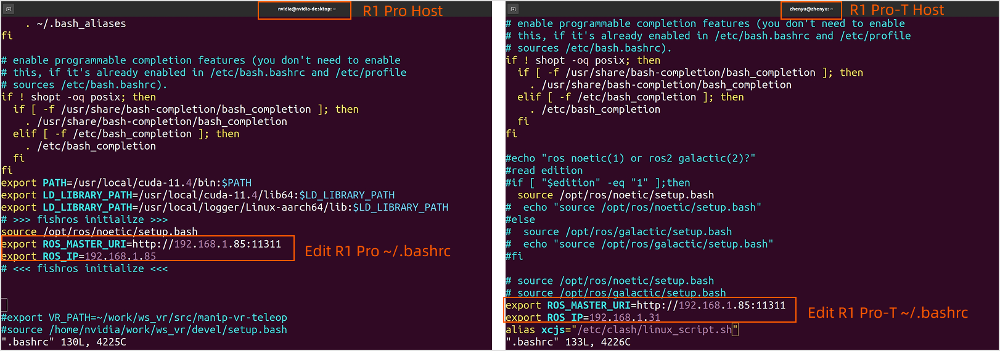
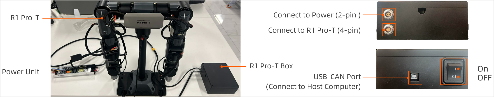
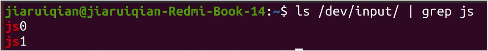
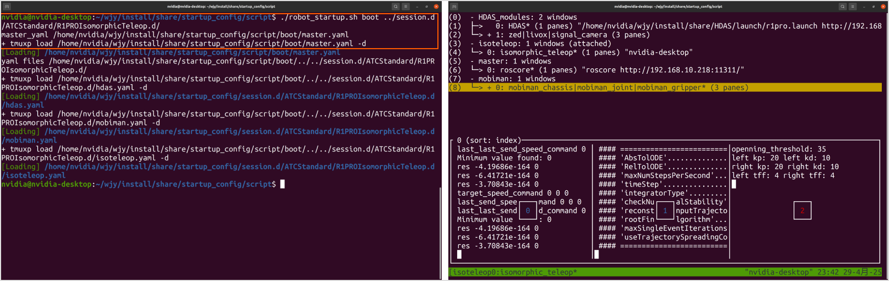

# R1 Teleop ROS1 Usage Tutorial
Download [ROS1 SDK](./R1Pro_Teleop_Usage_Tutorial.md) and use Unbuntu 20.04 Host system, then proceed to the following processes.

## 1. Software Preparation
### 1.1 Install Software Dependencies
Please install the required software dependencies on the R1 Pro-T host computer.

```Bash
sudo apt install ros-noetic-joy 
sudo apt install ros-noetic-trac-ik
sudo apt install tmuxp
sudo apt install tmux
```

### 1.1 Multi-device Communication Configuration
<span style="color:red;">Note: When R1Pro and R1Pro-T are on the same gateway, separately modify the `~/.bashrc` file of the host computer environment of R1 Pro and R1 Pro-T.</span>

1. Add the following command to the end of the **`~/.bashrc`** file on the R1 Pro ECU:
    ```Bash
    export ROS_MASTER_URI=http://R1 Pro_IP address:11311
    export ROS_IP=R1 Pro_IP address
    ```

2. Add the following command to the end of the **`/.bashrc`** file on the R1 Pro-T host computer:
    ```Bash
    export ROS_MASTER_URI=http://R1 Pro-T_IP address:11311
    export ROS_IP=R1 Pro-T_IP address
    ```

3. Example:

    When the host computers of R1 Pro and R1 Pro-T are both on the 192.168.10.0 gateway, separately modify the `~/.bashrc` of the host computers of R1 Pro and R1 Pro-T.

    


## 2. R1 Pro Teleop Connection
### 2.1 Securing the Device
Use the M6x16 screws and G-clips to secure the R1 Pro-T Base to the desktop, as shown in the diagram below:


### 2.2 Connecting the Device
Following the hardware connection architecture diagram:



1. Connect one end of the 2-pin plug to the port on R1 Pro-T Box and the other end to the XT60-F port on the power adapter.
2. Connect one end of the 4-pin plug to the port on R1 Pro-T Box and the other end to the XT30(2+2)-F port to the motor on the torso of R1 Pro-T.
3. Connect one end of the blue USB-CAN adaptor cable to R1 Pro-T Box and the other end to the USB port on the host computer.

<span style="color:red;">**Note: After completing the connections, do not power on immediately. Please follow the steps below to proceed.**</span>

### 2.3 Powering On
After securing the R1 Pro-T Base to the desktop, **place the arms and torso in the initial position** as shown in the diagram below. <span style="color:red;">**Ensure that the J5, J6, and J7 joints of both arms, as well as the R1 Pro-T Base, are at zero-point (initial posture)**</span>, then you may insert the power unit into the power outlet and press the power button on the R1 Pro-T Box to turn it on.


<span style="color:red;">**Note: Before starting the R1 Pro-T every time, make sure to adjust to its initial posture. Failing to do so may pose a risk during operation.**</span>

### 2.4 Connect Bluetooth Remote Controller
Please be sure to connect two arms to the R1 Pro-T host conputer in sequence, ensuring that <span style="color:red;">**the left arm is connected first, followed by the right arm. Due to program settings, to streamline the operation process, if the controller connection sequence is incorrect, please turn off the power and power it on again, then follow the correct sequence for connection.**</span>.

#### 2.4.1 Bluetooth Controller


#### 2.4.2 Connection Steps

1. Press the power switch to turn on the handle Bluetooth.
2. Turn on the host computer's Bluetooth and connect to the two devices named `HID`.
3. After connection, "Device Connected" will be displayed. Enter the following command to check whether the connection is successful:
    ```Bash
    ls /dev/input/ | grep js
    ```

    When both`js0` (left arm) and `js1` (right arm) are returned simultaneously, the connection is successful.
    

## 3. Launch SDK
### 3.1 Start R1
Use the following script to launch R1 Pro with one click:

```bash
cd ${SDK_path}/install/share/startup_config/script/
./robot_startup.sh boot ../session.d/ATCStandard/R1PROIsomorphicTeleop.d/
```

This script will launch nodes such as roscore, HDAS, mobiman, the camera, and the radar.



### 3.2 Start R1 Pro-T SDK
<span style="color:red;">Note: This step must be performed on the R1 Pro-T host computer.</span>

1. Start TMUX.
    ```Python
    tmux
    ```
2. Start FDCAN Communication
    ```Python
    sudo ip link set dev can0 type can bitrate 1000000 dbitrate 5000000 fd on
    sudo ip link set up can0
    ```
3. Press `Ctrl + D` to exit TMUX.
4. Start R1 Pro-T HDAS node.
    ```Bash
    cd ${R1Pro-T_SDK_path}/install
    source setup.bash
    roslaunch HDAS r1prot.launch
    ```
5. Start R1 Pro-T teleoperation node.
    ```Bash
    cd ${R1Pro-T_SDK_path}/install
    source setup.bash
    roslaunch mobiman r1_pro_teleoperation.launch
    ```

After completing the above steps, wait 3-5 seconds and you will be able to control R1 Pro-T.

## 4. Data Collection Process
### 4.1 Introduction to Data Format
The file format for data acquisition is rosbag，and the file suffix is `*.bag`.

### 4.2 Data Acquisition
Default storage path：`/home/nvidia/GalaxeaDataset/{date}/`.

### 4.3 Data Write-to-Disk Files
The data is saved in `rosbag + json` format, and each file corresponds to one another. For example:

```json
# For example, the two files below represent a data bag.

S2R12000P18245_20240213173320125_RAW.bag
S2R12000P18245_20240213173320125_RAW.json

# The format is "robot_serial_number + timestamp + RAW"
# robot_serial_number：the serial number of robot which is located in the path "/opt/galaxea/body/RSN".
# timestamp：The timestamp of data collection in ms.
# RAW: the raw data.
```

###  4.4 Start Recording
Perform data recording operation through the VR left remote controller:
<table style="width: 100%; border-collapse: collapse;">
    <thead>
        <tr style="background-color: black; color: white; text-align: left;">
            <th style="width: 200px; padding: 8px; border: 1px solid #ddd;">Function</th>
            <th style="width: 300px; padding: 8px; border: 1px solid #ddd;">Operation</th>
            <th style="width: 300px; padding: 8px; border: 1px solid #ddd;">Description</th>
        </tr>
    </thead>
    <tbody>
        <tr style="background-color: white; text-align: left;">
            <td style="padding: 8px; border: 1px solid #ddd;">Start recording</td>
            <td style="padding: 8px; border: 1px solid #ddd;">Click button C on the left controller</td>
            <td style="padding: 8px; border: 1px solid #ddd;">Start data recording.</td>
        </tr>
        <tr style="background-color: white; text-align: left;">
                <td style="padding: 8px; border: 1px solid #ddd;">Stop recording</td>
            <td style="padding: 8px; border: 1px solid #ddd;">Click button D on the left controller</td>
            <td style="padding: 8px; border: 1px solid #ddd;">Stop data recording.</td>
        </tr>
        <tr style="background-color: white; text-align: left;">
                <td style="padding: 8px; border: 1px solid #ddd;">Delete the current recording</td>
            <td style="padding: 8px; border: 1px solid #ddd;">Click button C on the left controller</td>
            <td style="padding: 8px; border: 1px solid #ddd;">If a recording is already in progress, click button C again will stop and delete the current recording, and it will not be written to disk.</td>
        </tr>
    </tbody>
</table>

If you encounter any issues during installation or startup, please contact us at [support@galaxea.ai](mailto:support@galaxea.ai) or call 4008 780 980 for technical support !