# R1 Pro Unbox and Startup Guide
> This tutorial provides detailed instructions on how to properly unbox the Galaxea R1 Pro, connect cables, install the robotic arms, and remotely control the R1 Pro for better communication and to explore more functionalities.

## 1. Item List Check
Check the items in the package according to the list below upon receiving the product. (Some items are inside the flight case.)
<table style="width: 100%; border-collapse: collapse;">
    <thead>
        <tr style="background-color: black; color: white; text-align: left;">
            <th style="width: 300px; padding: 8px; border: 1px solid #ddd;">Item</th>
            <th style="width: 400px; padding: 8px; border: 1px solid #ddd;">Quantity</th>
        </tr>
    </thead>
    <tbody>
        <tr style="background-color: white; text-align: left;">
            <td style="padding: 8px; border: 1px solid #ddd;">R1 Pro Base</td>
            <td style="padding: 8px; border: 1px solid #ddd;">1</td>
        </tr>
        <tr style="background-color: white; text-align: left;">
            <td style="padding: 8px; border: 1px solid #ddd;">A2 Arm</td>
            <td style="padding: 8px; border: 1px solid #ddd;">2</td>
        </tr>
        <tr style="background-color: white; text-align: left;">
            <td style="padding: 8px; border: 1px solid #ddd;">G1 Gripper</td>
            <td style="padding: 8px; border: 1px solid #ddd;">2</td>
        </tr>
        <tr style="background-color: white; text-align: left;">
            <td style="padding: 8px; border: 1px solid #ddd;">Joystick Controller</td>
            <td style="padding: 8px; border: 1px solid #ddd;">1</td>
        </tr>
        <tr style="background-color: white; text-align: left;">
            <td style="padding: 8px; border: 1px solid #ddd;">Hex-Key Wrench Set</td>
            <td style="padding: 8px; border: 1px solid #ddd;">1</td>
        </tr>
        <tr style="background-color: white; text-align: left;">
            <td style="padding: 8px; border: 1px solid #ddd;">Charger & Cable Set</td>
            <td style="padding: 8px; border: 1px solid #ddd;">1</td>
        </tr>          
        <tr style="background-color: white; text-align: left;">
            <td style="padding: 8px; border: 1px solid #ddd;">Wiring Harness Repairing Bag</td>
            <td style="padding: 8px; border: 1px solid #ddd;">1</td>
        </tr>  
        <tr style="background-color: white; text-align: left;">
            <td style="padding: 8px; border: 1px solid #ddd;">CAN Commuication Box & Adapter Board (For A2 Motor Drive Upgrade)</td>
            <td style="padding: 8px; border: 1px solid #ddd;">1</td>
        </tr>  
    </tbody>
</table>

You also need to prepare the following items:
<table style="width: 100%; border-collapse: collapse;">
    <thead>
        <tr style="background-color: black; color: white; text-align: left;">
            <th style="width: 300px; padding: 8px; border: 1px solid #ddd;">Item</th>
            <th style="width: 400px; padding: 8px; border: 1px solid #ddd;">Quantity</th>
        </tr>
    </thead>
    <tbody>
        <tr style="background-color: white; text-align: left;">
            <td style="padding: 8px; border: 1px solid #ddd;">Display & Keyboard & Mouse</td>
            <td style="padding: 8px; border: 1px solid #ddd;">1</td>
        </tr>
        <tr style="background-color: white; text-align: left;">
            <td style="padding: 8px; border: 1px solid #ddd;">Computer</td>
            <td style="padding: 8px; border: 1px solid #ddd;">1</td>
        </tr>
        <tr style="background-color: white; text-align: left;">
            <td style="padding: 8px; border: 1px solid #ddd;">WiFi Network</td>
            <td style="padding: 8px; border: 1px solid #ddd;">1</td>
        </tr>
                <tr style="background-color: white; text-align: left;">
            <td style="padding: 8px; border: 1px solid #ddd;">HDMI Cable</td>
            <td style="padding: 8px; border: 1px solid #ddd;">1</td>
        </tr>        
    </tbody>
</table>

<span style="color: red;">Note: To ensure proper operation, place R1 Pro in a dry, well-ventilated environment with no obstructions or hazardous items around.</span>

## 2. Unbox
### 2.1 Open the Locks
Locate the two locks on the right side of the case, open the lock plates, and turn counterclockwise to open the door.

### 2.2 Lower the board
There is a wooden board at the front of the door for R1 Pro to slide down. Place the board flat on the ground.

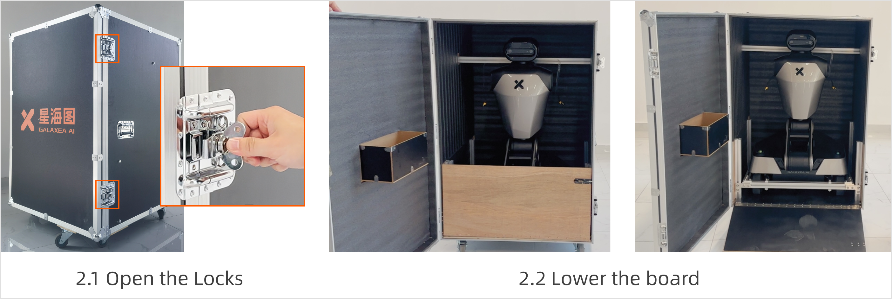

### 2.3 Remove Box Fixings
Use the L-hex key (M6) to remove six fixing screws, as shown in the figure. 

### 2.4 Pull It Out
Carefully pull the robot out of the case, avoiding any collisions during the process.

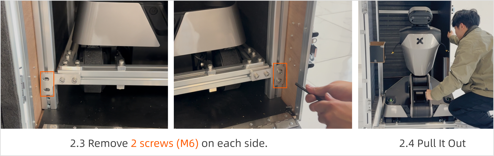

### 2.5 Remove the Chassis Fixings
The chassis is equipped with mounting profiles around its perimeter. 

1. U se an L-shaped hex key (M6) to remove the four screws at each of the four corners.  
2. Next to each steering wheel, there is a fork-shaped fixing. Use an L-shaped hex key (M6) to remove the two screws at the top and bottom.  

After completing these steps, all the fixing around the chassis can be removed.

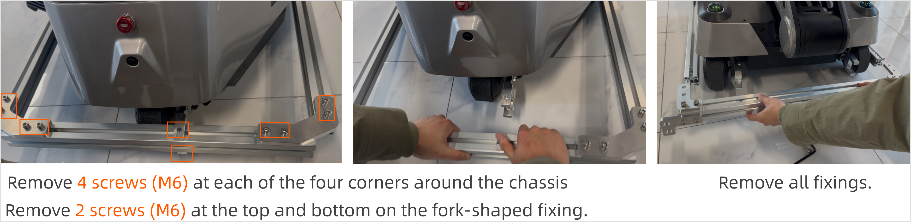

### 2.6 Remove the Steering Wheel Fixings

Follow these steps to remove the fixing components of the three steering wheels:  

1. Rotate the steering wheels with the fixing to the sides to expose the screws.  
2. Use an L-shaped hex key (M6) to remove the six fixing screws from the wheels.  
3. Rotate the wheels back to their original positions.

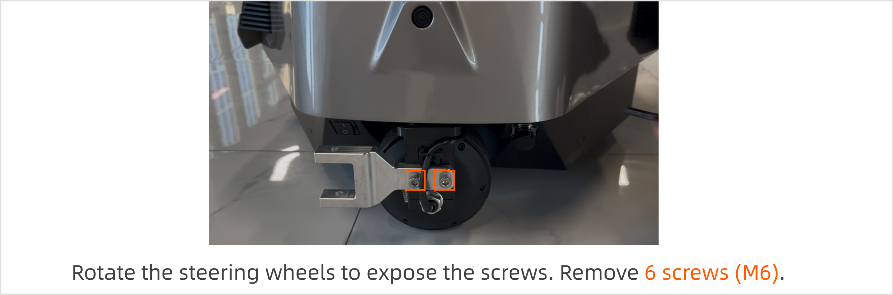

## 3. Turn On R1 Pro
### 3.1  Connect HDMI and USB
<span style="color: red;">**Note: For your safety, please power off R1 Pro before connecting any cables.**</span>

Follow these steps to connect R1 Pro:

1. Use the L-hex key (M3) to remove two M3 screws on the peripheral interface cover on the chassis.
2. Connect HDMI cable to the chassis and the display. Please ensure a firm connection to avoid looseness.
    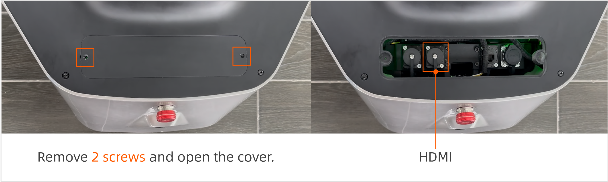
3. Connect the USB interface to the mouse and keyboard and the chest. Please ensure a firm connection to avoid looseness.
    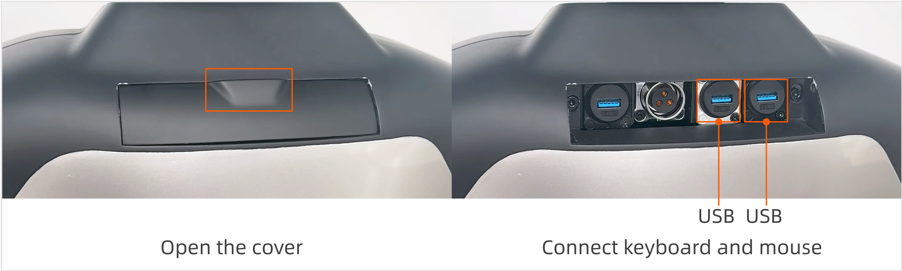

### 3.2 Power on
To turn on robot, press the boat-shaped power button on the bottom of the rear of the chassis. To turn off, switch off the power button. 

<span style="color:red">Note: Please keep the emergency stop button raised and turn on the boat-shaped power button located at the bottom of the left rear of the chassis. If the power was previously on, you need to turn it off and then turn it on again; otherwise, the display may not be able to work.</span>

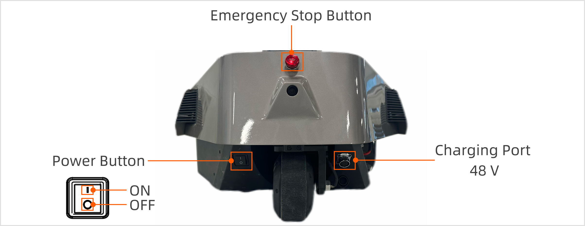

#### 3.2.1 Charging
If the chassis has a battery inside, but it is depleted, charge it before pressing the button. The charging port is located on the bottom of the rear side of the chassis.

**Charging steps:**

1. Unscrew the power charging port cover.
2. Insert the power cord into the port. When the red light on the charger comes on and the power indicator on the side of the robot chassis flashes orange-green, it indicates that the robot is charging.

#### 3.2.2 Battery Replacement
If there is no battery inside the chassis, install it first. The battery is located on the bottom of the right side of the chassis.

**Battery replacement steps:**

1. Remove the two screws on the chassis side cover and slide the cover to remove it.
2. Push the battery into the chassis.
3. Connect the battery cable to the chassis.
4. Close the cover. 

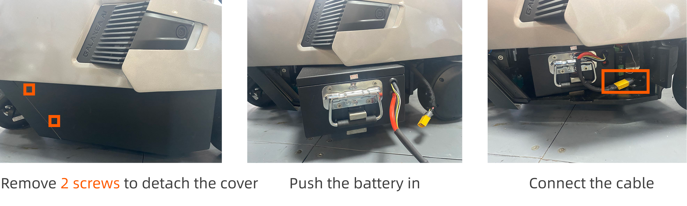

## 4. Connect R1 Pro
### 4.1 Local Connection
If remote connection and control of R1 Pro are not required, continue operating on the original monitor and keyboard, maintaining the HDMI and USB connections. Then proceed to section 4.3 Start CAN Driver.

### 4.2 Remote Connection
#### 4.2.1 Obtain IP address
After R1 Pro is powered on, wait for the monitor to display the desktop.

1. Click "Settings" and connect to WiFi.

    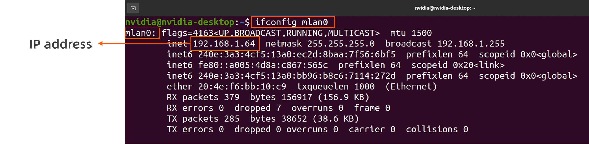

2. Press `Ctrl + Alt + T` to open the terminal, then enter the following command:
    ```Bash
    ifconfig mlan0
    ```

3. Find`mlan0`. The IP address of R1 Orin is: `192.xxx.xxx.xxx`.
    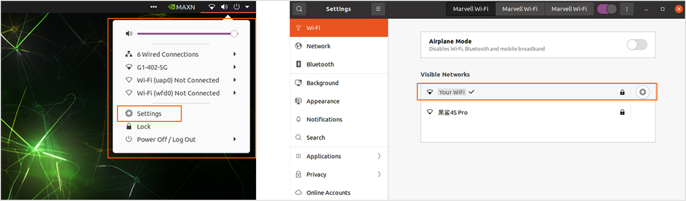

#### 4.2.2 Connect via SSH

To remotely connect and futher control the robot, you should:

1. Use the other computer.
2. Enter the following command in the terminal to connect Orin. 
    ```Bash
    ssh nvidia@IP address
    # password (default): nvidia
    ```

3. If the connection is successful, disconnect the HDMI and USB cables and close the peripheral interface covers on the chassis and torso to avoid hindering the range of motion. Then proceed to [section 4.3 Start CAN Driver](#43-start-can-driver). <span style="color: red;">If the connection fails, contact us promptly for technical support at support@galaxea.ai</span>.

### 4.3 Start CAN Driver
Throughout the control process of R1 Pro, you need to open multiple terminals. We recommend using TMUX. Common commands are as follows:

- Create a new terminal: Press `Ctrl + B` then `C`. 
- Switch terminals: Press `Ctrl + B` then press number which indicates the number of terminal windows. 

Now, you can start CAN driver in the following steps.

1. Start TMUX.
    ```Bash
    tmux
    ```

2. Start FDCAN Communication.
    ```Bash
    sudo ip link set dev can0 type can bitrate 1000000 dbitrate 5000000 fd on
    sudo ip link set up can0  
    
    #You may need to re-enter password: nvidia
    #If encountering "RTNETLINK answers: Device or resource busy" error, this typically indicates the target device (e.g., network interface or CAN transceiver) is already configured and currently active.
    ```

3. Start roscore
    ```Bash
    roscore    
    ```

4. Press `Ctrl + B` then `C` to create a new terminal. Then start HDAS.
    ```Bash
    source {your_download_path}/install/setup.bash
    roslaunch HDAS r1pro.launch
    ```

### 4.4  The First Self-Check
<span style="color:red">**Note: Before performing any operations on R1 Pro, you must complete the R1 Pro self-check to ensure safety.**</span>

Make sure that:

- R1 Pro has been unboxed and all fixings removed.
- R1 Pro remains folded with no mechanical arms installed.

Now, follow these steps for the first self-check:

1. Press `Ctrl + B` then `C` to create a new terminal. Then start self-check.
   ```Bash
   source {your_download_path}/install/setup.bash
   rosrun HDAS check_node 
   # Press 1 (0 indicates self-test with robotic arm installed; 1 indicates self-test without robotic arm)
   ```

2.  If it shows "self-check completed" as shown below, press `Ctrl + C` to exit. 
   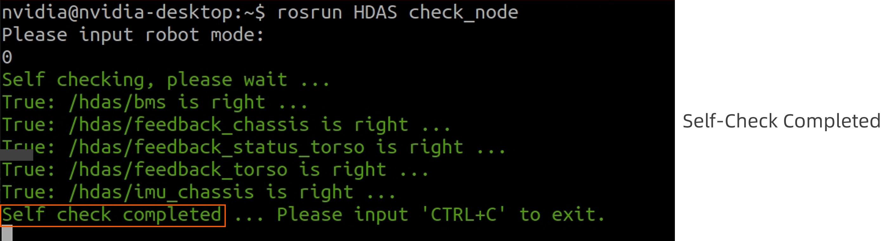

3. <span style="color:red;">If it appears warning, please contact us in time for technical support. </span>
   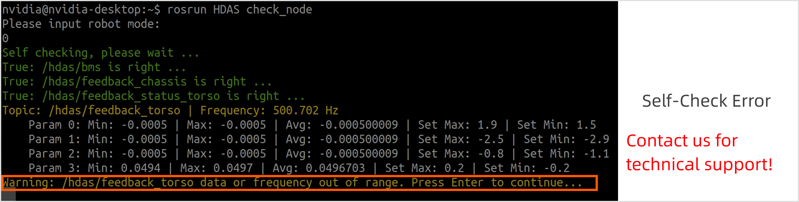

### 4.5 Stand up
<span style="color:red">**For your safety, ensure R1 Pro has been unboxed with no obstructions or fixtures. Otherwise, the trunk may enter a self-lock protection state.**</span>

After completing the self-check, you can command the trunk and chassis and use the remote controller to make R1 Pro stand up.

#### 4.5.1 Start Torso Control
Press `Ctrl + B` then `C` to create a new terminal. Then, start arm and torso control.
```Bash
source {your_download_path}/install/setup.bash
roslaunch mobiman r1_pro_jointTrackerdemo_pid.launch
```

#### 4.5.2 Start  Chassis Control
Press `Ctrl + B` then `C` to create a new terminal. Then, start chassis control.
```Bash
source {your_download_path}/install/setup.bash
roslaunch mobiman r1_pro_chassis_control.launch
```

#### 4.5.3 Joystick Controller Operation
<span style="color:red"> Note: Before any operation, ensure all switches (SWA/SWB/SWC/SWD) are in the top position. </span>This will keep the machine stopped and prevent robot operation. For more detailed operation information, refer to the remote controller guide in the Getting Started.

1. To turn the controller on/off, hold the two power buttons until the touch screen lights on/off.
2. Move the SWA switch to the bottom and the SWB switch to the middle.
3. Keep the SWC switch and the SWD switch in the top position. 
4. Move the left joystick to the top-left and the right joystick to the top-right simultaneously as shown in the figure below. Wait for 3 seconds, and R1 will stand up.

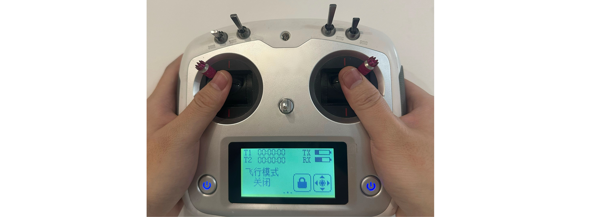


## 5. Install Arms 

<span style="color:red;">**Note: For your safety, stand R1 Pro up and turn off the power before installing the arms.**</span>

### 5.1 Detach Rear Cover
Follow these steps to detach the rear cover of the torso:

1. Open the peripheral interface cover on the rear cover. 
2. Use the L-hex key (M4) to remove two M4 screws underneath the cover. 
3. Use the L-hex key (M5) to remove four M5 screws on the side of the chest cover.

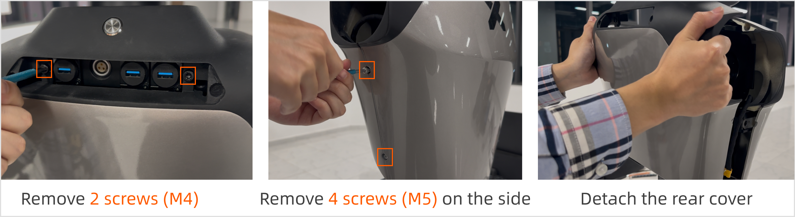

### 5.2 Detach Front Cover
Use the L-hex key (M5) to remove six M5 screws on two sides of the chest, as boxed in the figure.

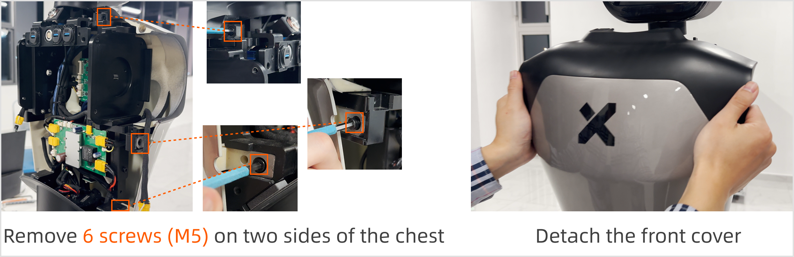

### 5.3 Install Arms

1. Open the robotic arm packaging and remove the arm assembly. The arm base has labeled stickers–pay attention to distinguish between the left and right arms.

2. Use the hex L-shaped wrench (5mm) and four M6 screws to secure the arm. 

    <span style="color:red;">**Note: When installing the robot arm, ensure the port on the arm base faces backward as shown in the figure below.**</span>
   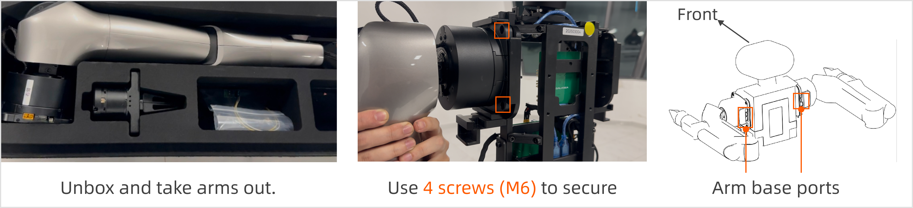

3. Connect the power cable and CAN cable of the robotic arm to the ports on the arm base. 
   <span style="color:red">**Note: Before inserting the CAN cable, please remove the resistor cap first. If you use the robot without the robotic arm installed, you need to reinstall the resistor cap. Therefore, it is recommended that you keep the resistor cap properly.**</span>
   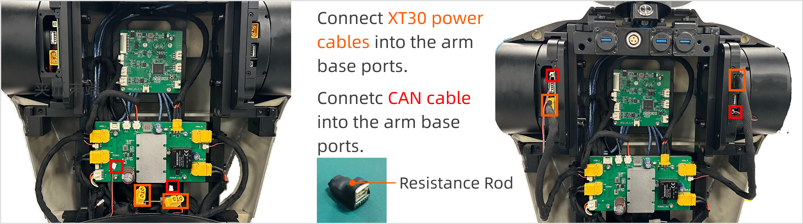

4. After confirming successful communication with the robot arm, reverse the steps in [section 5.1 Detach Rear Cover](#51-detach-rear-cover) and [section 5.2 Deatch Front Cover](#52-detach-front-cover) to reinstall the covers.


### 5.4 Install Grippers
<span style="color:red">**Note: For your safety, stand R1 Pro up and turn off the power before installing the arms.**</span>

Before installing the gripper, position the robot arm to the zero-point as shown in the left diagram. Follow these steps to install the gripper onto the end of the arm (reverse the steps to remove the gripper).

1. **Alignment Check:** Ensure that the three mounting holes around the gripper are aligned with the three mounting holes at the end of arm.
2. **Screw Fixation:** Once aligned，use an L-shaped hex key (M3) to fix the three screws.
3. **Firmness Check:** After tightening the screws, check again whether the installation of the gripper jaws is aligned and firm.
4. **Connect the Wiring Harness:** Connect the CAN wiring harness on the outer side of the J6 joint at the end of the robotic arm to the communication port of the gripper.

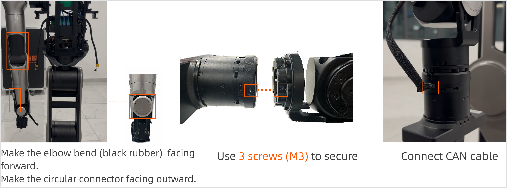

## 6. The Second Self-Check

Before starting the self-check, ensure:

- R1 Pro is standing.
- R1 Pro has the arms installed correctly. The elbows face outward (silver part inside, black part outside), and the gripper cable faces outward.

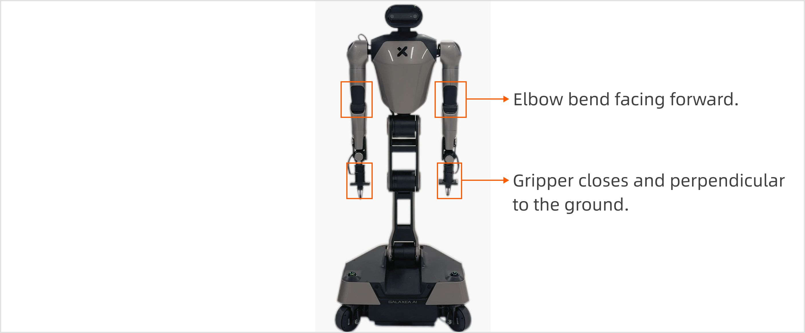

Then, <span style="color:red">**power it on**</span>and:

1. Complete the operations as per the commands in [Section 4.3 Start CAN Driver](#43-start-can-driver).

2. Press `Ctrl + B` then `C` to create a new terminal. Now, start the second self-check.
   ```Bash
   source {your_download_path}/install/setup.bash
   rosrun HDAS check_node 
   # Press 1 (0 indicates self-check with robot arm installed; 1 indicates self-check without robot arm)
   ```

3. Press `Ctrl + B` and then `C` to create a new terminal. Start the control of the arm and the torso.
   ```bash
   source {your_download_path}/install/setup.bash
   roslaunch mobiman r1_pro_jointTrackerdemo_pid.launch
   ```

4. Press `Ctrl + B` and then `C` to create a new terminal. Start the control of the chassis.
   ```bash
   source {your_download_path}/install/setup.bash
   roslaunch mobiman r1_pro_chassis_control.launch
   ```


## 7. Demo

<span style="color:red">**Note: Complete the R1 Pro self-check before any operations to ensure safety.**</span>

After completing all the above operations, move R1 Pro to an open area with no obstructions around. Then remotely command R1 Pro to conduct a demo.

1. Press `Ctrl + B` and then `C` to create a new terminal . Then, execute the script.
    ```bash
    source {your_download_path}/install/setup.bash
    cd {your_download_path}/install/share/mobiman/script
    python3 r1pro_test_open_box.py
    ```

2. Enter the number corresponding to each test action and press the `Enter`. Then, the R1 Pro will start to execute the test actions.
    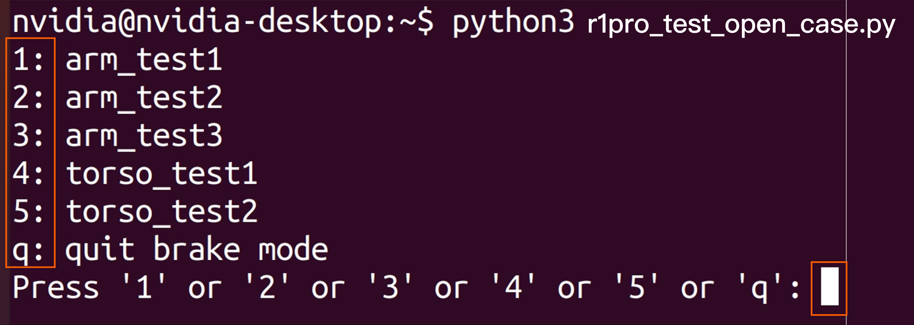

3. After all the actions are completed, press `Q` to exit. R1 Pro will return to the zero-point position.

In the subsequent process of using the robot, please refer to [R1 Pro Demo Guide](./R1Pro_Demo_Guide.md) for the subsequent complete operations. 