# R1 Pro VR Teleop Usage Tutorial
## 1. Product Introduction
The VR Teleop system provides an immersive remote control experience that enables the operator to control the R1 Pro robot with precise feedback and real-time response. The system supports full-body synchronization and provides an intuitive and highly accurate operating interface with millimeter-level accuracy and millisecond response speed. The system is designed to interact seamlessly in complex environments and is ideal for tasks requiring fine and precise robotic control.

The following tutorial will provide a detailed introduction to the activation methods, user manual and actual video demonstrations of VR remote operation products, helping you quickly experience this high-performance remote operation platform.

## 2. Preparations Before Startup
### 2.1 Hardware Preparation
<table style="width: 100%; border-collapse: collapse;">
    <thead>
        <tr style="background-color: black; color: white; text-align: left;">
            <th style="width: 200px; padding: 8px; border: 1px solid #ddd;">item</th>
            <th style="width: 100px; padding: 8px; border: 1px solid #ddd;">quantity</th>
            <th style="width: 400px; padding: 8px; border: 1px solid #ddd;">Note</th>
        </tr>
    </thead>
    <tbody>
        <tr style="background-color: white; text-align: left;">
            <td style="padding: 8px; border: 1px solid #ddd;">Meta Quest 3 VR device</td>
            <td style="padding: 8px; border: 1px solid #ddd;">1</td>
            <td style="padding: 8px; border: 1px solid #ddd;">It includes one head-mounted device, two handheld remote controllers and a Type-C connection cable.</td>
        </tr>
        <tr style="background-color: white; text-align: left;">
                <td style="padding: 8px; border: 1px solid #ddd;">R1 Pro Base</td>
            <td style="padding: 8px; border: 1px solid #ddd;">1</td>
            <td style="padding: 8px; border: 1px solid #ddd;">The robot body.</td>
        </tr>
        <tr style="background-color: white; text-align: left;">
            <td style="padding: 8px; border: 1px solid #ddd;">R1 Pro Joystick Controller</td>
            <td style="padding: 8px; border: 1px solid #ddd;">1</td>
            <td style="padding: 8px; border: 1px solid #ddd;">Controls the R1 Pro robot.</td>
        </tr>
        <tr style="background-color: white; text-align: left;">
            <td style="padding: 8px; border: 1px solid #ddd;">Host Computer (Dual systems)</td>
            <td style="padding: 8px; border: 1px solid #ddd;">1</td>
            <td style="padding: 8px; border: 1px solid #ddd;">System：Ubuntu20.04, ROS Noetic</br>Used for upgrading the software program of R1 Pro Base.</td>
        </tr>
        <tr style="background-color: white; text-align: left;">
            <td style="padding: 8px; border: 1px solid #ddd;">Local Area Network (LAN)</td>
            <td style="padding: 8px; border: 1px solid #ddd;">1</td>
            <td style="padding: 8px; border: 1px solid #ddd;">Used for connecting VR devices and R1 Pro Base.</td>
        </tr>
    </tbody>
</table>


### 2.2 Software Preparation
Click the following links to download R1 Pro VR Teleop SDK `V1.1.4`. (R1 Pro SDK contains VR Teleop resources.) 

- Baidu Cloud：[R1 Pro SDK V1.1.4](https://pan.baidu.com/s/1rQd3_Cu4E9PjygupxeQDig?pwd=v114)
- Google Drive：[R1 Pro SDK V1.1.4](https://drive.google.com/drive/folders/1RTt6NMOoA0pjbx5qXkYCb2fyQyUHyZFf?usp=sharing)

VR Device Configuration SDK:

- `Meta Quest 3 Installation Package`: Used for activating new devices.
- `platform-tools-latest-windows`: Contains adb files for installing the data collection app inside the VR headset.
- `GalaxeaVR-V1-0-1.apk`: The data collection app for the VR headset.

## 3. VR Device Configuration
### 3.1 Activating VR Device Developer Mode
Please refer to [the Meta Quest 3 developer mode user guide](https://blog.csdn.net/weixin_44234976/article/details/145135895?spm=1001.2014.3001.5502) to complete the activation.

### 3.2 VR Device SDK Installation

1. Extract the ADB files：Download and extract the`platform-tools-latest-windows.zip`file.
2. Connect the VR device: Use a Type-C USB cable to connect the VR device to the computer.
3. Authorize USB connection: On the VR device, confirm and allow the USB device connection (as shown in the image).
   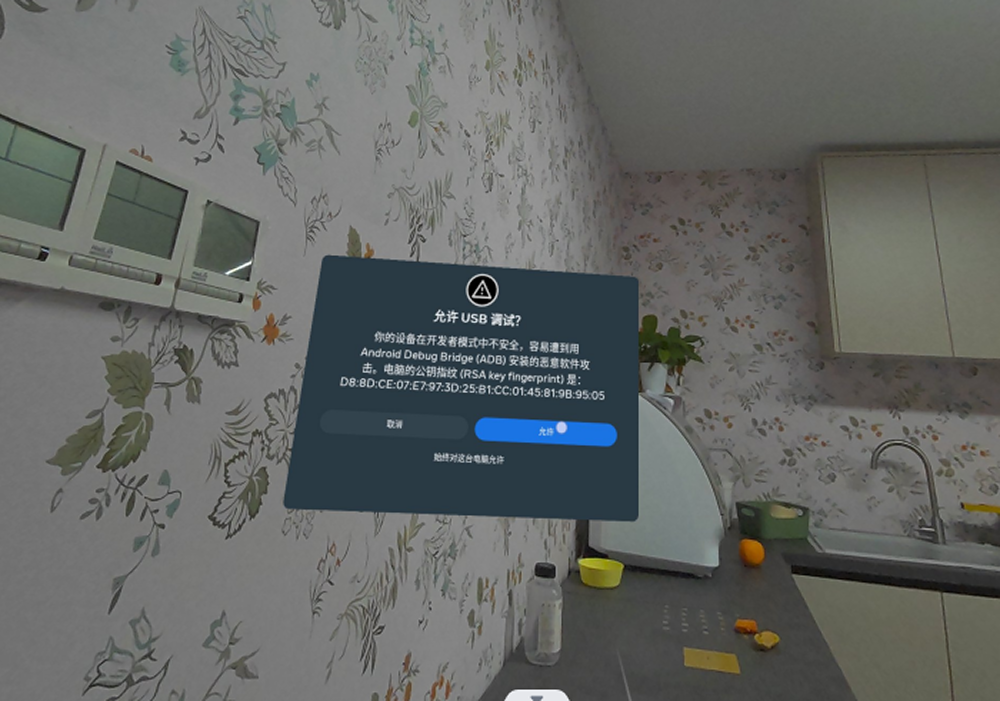
4. Enter the ADB extraction path: Open the file explorer and navigate to the folder where the ADB tool has been extracted.
5. Copy the APK file: Copy the  `GalaxeaVR-V1-0-1.apk` file to this path.
6. Install the APK: Open the Command Prompt (CMD) in this path and run the following command to install the application:
   ```Bash
   .\adb.exe install GalaxeaVR-V1-0-1.apk 
   ```
   If the command shows **"Success"** after execution, it means the installation was successful.
   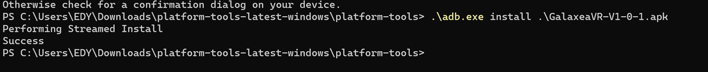

### 3.3 VR Device Configuration
On the initial screen of Meta Quest 3,connect to the same WiFi network as R1 Pro. 

**Note：It is normal for the network to be restricted, as this network cannot access the external internet.**

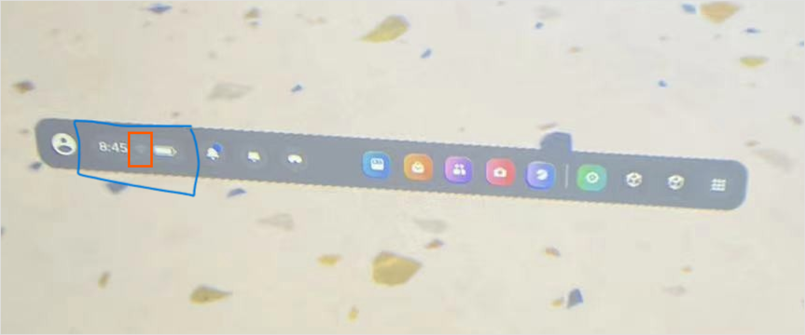

### 3.4 Obtain the IP Address of VR Device
Inside the VR device, click on the connected WiFi, open the network page, and scroll down to find and record the IP address (e.g., 192.168.5.24).

## 4. R1 Pro Configuration
Install the Galaxea R1 Pro VR Teleop SDK V1.1.4

1. **Download and copy the SDK**
Download the file`atc_standard-V1.1.4-20250408_00_26_42.tar.gz` ，and execute the following command to copy the SDK to R1 Pro.
```Bash
scp atc_standard-V1.1.4-20250408_00_26_42.tar.gz nvidia@${R1_Pro_IP}:~/Downloads
```

2. **Log in to R1 Pro**
```Bash
ssh nvidia@${R1_Pro_IP}
```

3. **Decompress the SDK to R1 Pro**
```Bash
mkdir ~/vr_workspace
tar -zxvf ~/Downloads/atc_standard-V1.1.4-20250408_00_26_42.tar.gz -C ~/vr_workspace
```
4. **Install an extra dependency**
```Bash
pip3 install websockets pyquaternion
```
Once the upgrade is completed, power off R1 Pro and restart it. After the restart, the software package configuration is completed and the VR Teleop operation function can be used.

## 5. Start VR Teleop Operation
**Note: All operations in this section need to be completed and confirmed each time you start.**

### 5.1 Start R1 Pro Base Program

1. Log in to R1 Pro.
```Bash
ssh nvidia@${R1_Pro_IP}
```

2. Enter the software package startup directory.
```Bash
cd ~/vr_workspace/install/share/startup_config/script/
```

3. Start the program.
```Bash
ROS_IP=${R1_Pro_IP} ROS_MASTER_URI=http://${R1_Pro_IP}:11311 VR_IP=${VR_IP} ./robot_startup.sh boot ../session.d/ATCStandard/R1PROVRTeleop.d/
```

### 5.2 Start VR Device Program
**Note:** Please wear the VR device and hold two remote controllers. Then start the following operations.

#### 5.2.1. Connect to WiFi
Confirm that the VR device has successfully connected to the same WiFi network as R1 Pro Base.

#### 5.2.2. Create a Boundary

1. Click the WiFi and battery interface at the lower left corner and select **"Boundary"**.
   

2. According to the prompt, select **"In-place Boundary"**, and you can see a blue circle appears under your feet, indicating that the boundary has been established.
   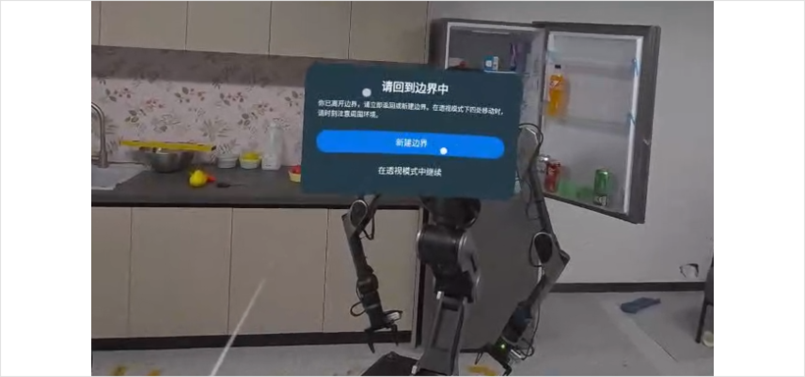

   <span style="color:red;">**Note: After creating a new boundary, do not move your feet until the VR remote operation task is completed.**</span>

#### 5.2.3. Start GalaxeaVR APP

1. **Open the GalaxeaVR application**

    Click the cube icon at the bottom right to start the GalaxeaVR application.
   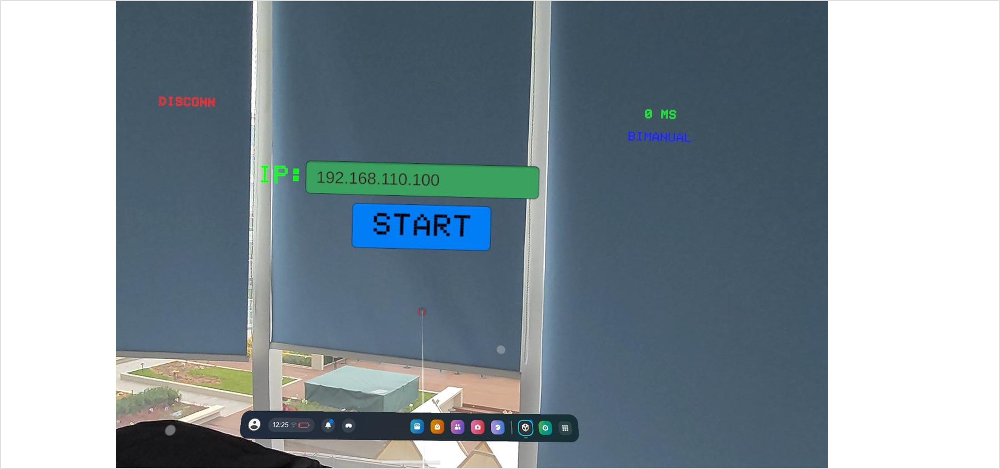

2. **Enter the IP address of R1 Pro**

    After entering the GalaxeaVR application, align the ray emitted by the VR controller with the green IP input box.</br>
    Wait for the green box to slightly change color, then click the box with T button of the right controller (the cursor position should be slightly lower).

    After the keyboard pops up, enter the IP address of the robot (R1 Pro_IP). 

3. **Operating VR Devices**

    After setting the IP, click the **Start** button to begin.

    Immediately, let your hands naturally hang down by your sides and wait for 3 seconds before starting to operate.

    <span style="color:red;">**Note: At this time, the robot will synchronize your operations. Please be cautious and start with small movements to ensure there are no obstacles around.**</span>

    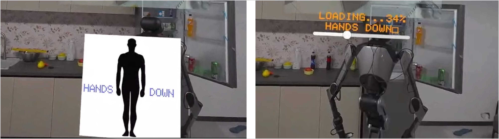

4. **Display of VR Device Images** 

    At this moment, you can see the image from the robot's head camera.
   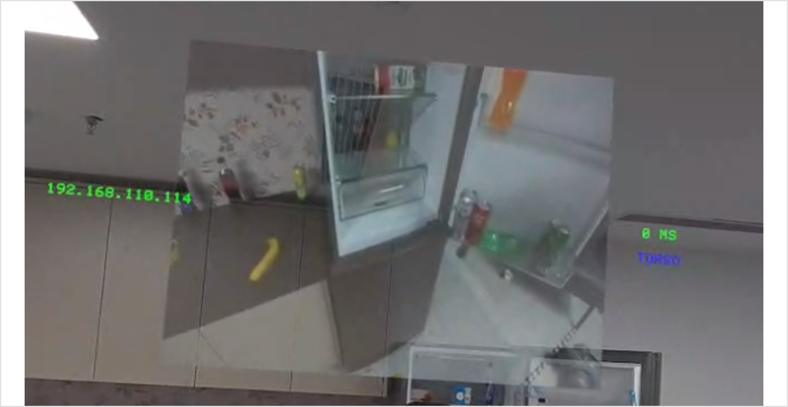

You can complete the simple operation using the following steps:

- **Stop operation:** Press and hold the `B` button for more than 2 seconds to stop VR remote operation.
- **Control grippers:** The movement of your hand will control the movement of the robot's arm. The `X` button on the left controller opens and closes the left gripper. The `A` button on the right controller opens and closes the right gripper.
- **Pause right arm:** Press the `B` button briefly once, the right arm will stop at the current position; press the `B` button again to resume.
- **Pause left arm:** Press the `Y` button briefly once, the left arm will stop at the current position; press the `Y` button again to resume.

Detailed operation instructions can be found in Chapter 6: Remote Operation Control Instructions.

## 6.Remote Control Operation Instructions
Please practice the use of this product in an open area while ensuring the safety of personnel and items. It is recommended to start the formal data collection after getting familiar with the use of this product.

### 6.1 Instructions for Using the Remote Controller
#### 6.1.1 R1 Pro Joystick Controller

Controller instruction:

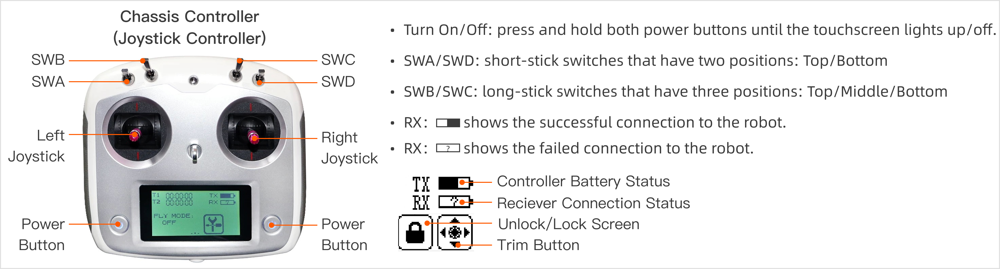

<span style="color:red;">Note: Ensure that all switches (SWA/SWB/SWC/SWD) are in the top position before you do any actions. </span>This will place the machine in a stop state, preventing the robot from operating. 

The following table shows how to switch SWA/SWB/SWC/SWD to different positions in different functions.

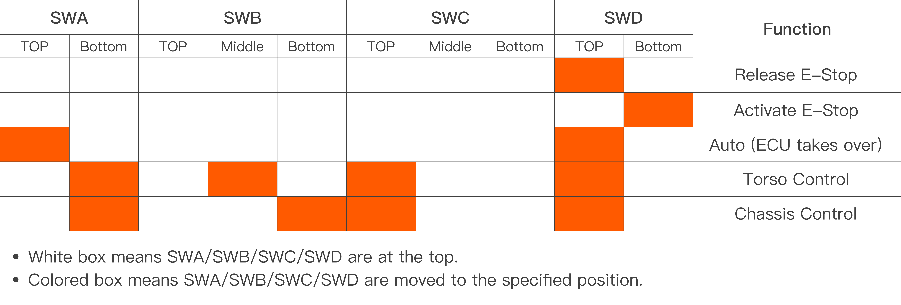

<u>Before you use the joystick controller to control the robot, you must start CAN driver and other programs. For detailed instructions, please refer to the [4.3](./R1Pro_Unbox_Startup_Guide.md/#43-start-can-driver), [4.4](./R1Pro_Unbox_Startup_Guide.md/#44--the-first-self-check), and [4.5](./R1Pro_Unbox_Startup_Guide.md/#45-stand-up) in Unbox and Startup Guide.</u> After that, you can move each switch to a specified position and control the robot by the following steps.


#### 6.1.2 VR Remote Controller

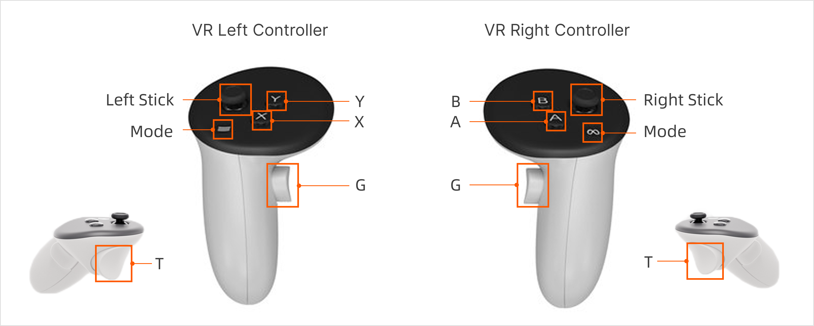

### 6.2 VR Device APP Display

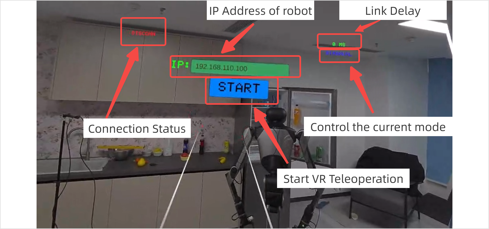

### 6.3 Mode Switching

After remote operation is started, the default mode is **BIMANUAL Mode**. Users can switch different operation modes through the VR device remote controller.

<table style="width: 100%; border-collapse: collapse;">
    <thead>
        <tr style="background-color: black; color: white; text-align: left;">
            <th style="width: 200px; padding: 8px; border: 1px solid #ddd;">Mode</th>
            <th style="width: 300px; padding: 8px; border: 1px solid #ddd;">Switching Method</th>
            <th style="width: 300px; padding: 8px; border: 1px solid #ddd;">Note</th>
        </tr>
    </thead>
    <tbody>
        <tr style="background-color: white; text-align: left;">
            <td style="padding: 8px; border: 1px solid #ddd;">BIMANUAL</td>
            <td style="padding: 8px; border: 1px solid #ddd;">Press and hold both the left and right joysticks down simultaneously for 1 second.</td>
            <td style="padding: 8px; border: 1px solid #ddd;">Default mode. To control the chassis, turn on the controller and switch SWA, SWB, SWC, and SWD all to the top position.</td>
        </tr>
        <tr style="background-color: white; text-align: left;">
            <td style="padding: 8px; border: 1px solid #ddd;">Torso</td>
            <td style="padding: 8px; border: 1px solid #ddd;">Press the right joystick downward for 1 second.</td>
            <td style="padding: 8px; border: 1px solid #ddd;">-</td>
        </tr>
    </tbody>
</table>


#### 6.3.1 BIMANUAL Mode
<table style="width: 100%; border-collapse: collapse;">
    <thead>
        <tr style="background-color: black; color: white; text-align: left;">
            <th style="width: 200px; padding: 8px; border: 1px solid #ddd;">Function</th>
            <th style="width: 400px; padding: 8px; border: 1px solid #ddd;">Description</th>
            <th style="width: 300px; padding: 8px; border: 1px solid #ddd;">Note</th>
        </tr>
    </thead>
    <tbody>
        <tr style="background-color: white; text-align: left;">
            <td style="padding: 8px; border: 1px solid #ddd;">Follow with both hands</td>
            <td style="padding: 8px; border: 1px solid #ddd;">The end position of the R1 Pro robot arm will move along with the movement of the VR remote controller.
</td>
            <td style="padding: 8px; border: 1px solid #ddd;">-</td>
        </tr>
        <tr style="background-color: white; text-align: left;">
            <td style="padding: 8px; border: 1px solid #ddd;">Gripper Pick-up</td>
            <td style="padding: 8px; border: 1px solid #ddd;">Button T on the right controller opens and closes the left gripper.</br>Button T on the left controller opens and closes the right gripper.</td>
            <td style="padding: 8px; border: 1px solid #ddd;">-</td>
        </tr>
        <tr style="background-color: white; text-align: left;">
            <td style="padding: 8px; border: 1px solid #ddd;">Gripper Pause</td>
            <td style="padding: 8px; border: 1px solid #ddd;">Button G on the right controller pauses the right arm.</br>Button G on the left controller pauses the left arm.</br>Press the pause button once, then press it again to release the pause.</td>
			<td style="padding: 8px; border: 1px solid #ddd;"><span style="color:red;">When resuming the pause state, make sure that the position of the remote control is the same as that when the pause was initiated. Otherwise, the robot arm may experience a sudden and significant movement.</span></td>
        </tr>
    </tbody>
</table>


#### 6.3.2 Torso
<table style="width: 100%; border-collapse: collapse;">
    <thead>
        <tr style="background-color: black; color: white; text-align: left;">
            <th style="width: 200px; padding: 8px; border: 1px solid #ddd;">Function</th>
            <th style="width: 400px; padding: 8px; border: 1px solid #ddd;">Description</th>
            <th style="width: 200px; padding: 8px; border: 1px solid #ddd;">Note</th>
        </tr>
    </thead>
    <tbody>
        <tr style="background-color: white; text-align: left;">
            <td style="padding: 8px; border: 1px solid #ddd;">Wrist rotate</td>
            <td style="padding: 8px; border: 1px solid #ddd;">Move the stick of the left controller to left/right.</td>
            <td style="padding: 8px; border: 1px solid #ddd;">Joint 1 movement</td>
        </tr>
        <tr style="background-color: white; text-align: left;">
            <td style="padding: 8px; border: 1px solid #ddd;">Wrist pitch</td>
            <td style="padding: 8px; border: 1px solid #ddd;">Move the stick of the left controller to forward/backward.</td>
            <td style="padding: 8px; border: 1px solid #ddd;">Joint 2 movement</td>
        </tr>
        <tr style="background-color: white; text-align: left;">
            <td style="padding: 8px; border: 1px solid #ddd;">Torso stands/squats</td>
            <td style="padding: 8px; border: 1px solid #ddd;">Move the stick of the right controller forward/backward.</td>
            <td style="padding: 8px; border: 1px solid #ddd;">Joint 3 movement</td>
        </tr>
        <tr style="background-color: white; text-align: left;">
                <td style="padding: 8px; border: 1px solid #ddd;">Torso pitch</td>
            <td style="padding: 8px; border: 1px solid #ddd;">Press the button T and G on the right controller.</td>
            <td style="padding: 8px; border: 1px solid #ddd;">Joint 4 movement</td>
        </tr>
    </tbody>
</table>


### 6.4 Connect the Wrist Cameras
#### 6.4.1 Preparations Before Connection
Please prepare the following items before connecting the wrist cameras:
<table style="width: 100%; border-collapse: collapse;">
    <thead>
        <tr style="background-color: black; color: white; text-align: left;">
            <th style="width: 200px; padding: 8px; border: 1px solid #ddd;">Item</th>
            <th style="width: 100px; padding: 8px; border: 1px solid #ddd;">Quantity</th>
            <th style="width: 400px; padding: 8px; border: 1px solid #ddd;">Notes</th>
        </tr>
    </thead>
    <tbody>
        <tr style="background-color: white; text-align: left;">
            <td style="padding: 8px; border: 1px solid #ddd;">Wrist Camera</td>
            <td style="padding: 8px; border: 1px solid #ddd;">2</td>
            <td style="padding: 8px; border: 1px solid #ddd;">-</td>
        </tr>
        <tr style="background-color: white; text-align: left;">
                <td style="padding: 8px; border: 1px solid #ddd;">Wrist Camera Bracket</td>
            <td style="padding: 8px; border: 1px solid #ddd;">2</td>
            <td style="padding: 8px; border: 1px solid #ddd;">Used to fix the camera to the robot's wrist.</td>
        </tr>
        <tr style="background-color: white; text-align: left;">
            <td style="padding: 8px; border: 1px solid #ddd;">USB-A-to-USB-C Adapter Cable</td>
            <td style="padding: 8px; border: 1px solid #ddd;">2</td>
            <td style="padding: 8px; border: 1px solid #ddd;">Used to connect the robot's back USB-A external device interface and the wrist camera's USB-C interface.<br>Length should ≥1.5m.</td>
        </tr>
    </tbody>
</table>


#### 6.4.2 Connecting Camera Cables
1. Install the wrist camera bracket to the robot's wrist and secure the camera.
2. Use the USB-A-to-USB-C adapter cable to connect any USB-A peripheral interface on the back of the robot and the wrist camera's USB-C interface.

#### 6.4.3 Configuring the Cameras
<span style="color:red;">**Note : To avoid confusion between the two camera serial numbers during the configuration process, it is recommended that you connect and configure one camera first, and then connect and configure the second camera.**</span>

1. Enter the wrist camera configuration directory:
    ```bash
    cd ~/vr_workspace/install/share/realsense2_camera/launch
    ```
2. (Taking the connection of the left wrist camera as an example first) After connecting the left wrist camera cable, execute the following command to view and record the camera's `Serial Number`:
    ```bash
    rs-enumerate-devices  | grep Serial
    ```
    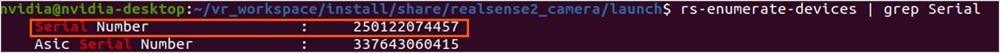
3. After connecting the right wrist camera cable, execute the command again to view and record the camera's `Serial Number`:
    ```bash
    rs-enumerate-devices  | grep Serial
    ```
    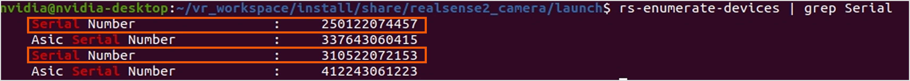
    <span style="color:red;">Note: The order of the serial numbers has nothing to do with the order in which the cameras are connected, so it is recommended that you connect one camera first, record its serial number, and then connect the second camera to record its serial number. </span>

4. Use the vim tool to modify the camera's Serial Number in the launch file:
    ```bash
    vim rs_multiple_devices.launch
    # No matter which camera is connected first, 
    # "camera1" refers to the left wrist camera, and "camera2" refers to the right wrist camera.
    ```
    Enter the two wairt camera serial numbers recorded earlier in the corresponding name positions.
    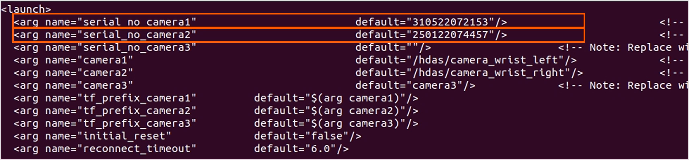
5. Restart the program:
    ```bash
    cd ~/vr_workspace/install/share/startup_config/script/
    ./robot_startup.sh kill
    ./robot_startup.sh boot ../session.d/ATCStandard/R1PROVRTeleop.d/
    ```
6. Check the camera frame rate:
    ```bash
    cd ~/vr_workspace/install/
    source setup.bash
    rostopic hz /hdas/camera_wrist_right/color/image_raw/compressed /hdas/camera_wrist_left/color/image_raw/compressed
    ```
    If the values of the two cameras appear and are around 15hz, it means the connection is successful.
    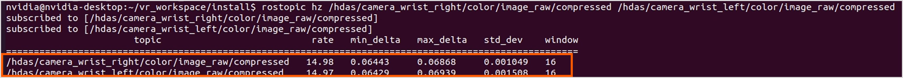

<span style="color:red;">**Note: The wrist cameras of each robot only need to be configured once. Subsequently, you can follow the method in [5.1](#51-start-r1-base-program) to start the camera directly when starting the robot.**</span>

## 7. Data Collection Process
### 7.1 Introduction to Data Format
The file format for data acquisition is **rosbag**，and the file suffix is `*.bag`.

### 7.2 Data Acquisition
**Default storage path：/home/nvidia/GalaxeaDataset/data/**

### 7.3  Introduction to Data Recording Configuration File
The configuration file used for default data recording is located at:

```Bash
/opt/galaxea/data_collection/data_task_config.json
```

**Configuration File Description:** 

The configuration file is used to describe the information of this collection task. Users can modify it according to their needs. Here are two key parameters:

```javascript
{
    "project_info": {
        "project_name": "sop_test"
    },
    "task_info": {
        "task_name": "sop_test_data_collection",
        "task_owner": "hengyi.fei"  
    },
    "operation_info": {
        "teleoperation_type": "VR",
        "location": "suzhou",
        "operator_name": "jiahao.wu"
    }
}
```

### 7.4  Introduction to Data Write-to-Disk Files
The data is saved in `rosbag + json` format, and each file corresponds to one another. For example:

```json
# For example, the two files below represent a data packet.

S2R12000P18245_20240213173320125_RAW.bag
S2R12000P18245_20240213173320125_RAW.json

# The format is task id + episode id + timestamp
# task id：The task number defined in the configuration file.
# episode id：During this collection process, the sequence numbers after the breakpoint packet cut-off are also included.
# timestamp：The timestamp of data collection.
"{task_id}-{episode_id}-{timestamp}.bag
```

###  7.5 Start Recording
Perform data recording operation through the VR left remote controller:
<table style="width: 100%; border-collapse: collapse;">
    <thead>
        <tr style="background-color: black; color: white; text-align: left;">
            <th style="width: 200px; padding: 8px; border: 1px solid #ddd;">Function</th>
            <th style="width: 300px; padding: 8px; border: 1px solid #ddd;">Operation</th>
            <th style="width: 300px; padding: 8px; border: 1px solid #ddd;">Description</th>
        </tr>
    </thead>
    <tbody>
        <tr style="background-color: white; text-align: left;">
            <td style="padding: 8px; border: 1px solid #ddd;">Start recording</td>
            <td style="padding: 8px; border: 1px solid #ddd;">Click button X on the left controller</td>
            <td style="padding: 8px; border: 1px solid #ddd;">Start data recording.</td>
        </tr>
        <tr style="background-color: white; text-align: left;">
                <td style="padding: 8px; border: 1px solid #ddd;">Stop recording</td>
            <td style="padding: 8px; border: 1px solid #ddd;">Click button Y on the left controller</td>
            <td style="padding: 8px; border: 1px solid #ddd;">Stop data recording.</td>
        </tr>
        <tr style="background-color: white; text-align: left;">
                <td style="padding: 8px; border: 1px solid #ddd;">Delete the current recording</td>
            <td style="padding: 8px; border: 1px solid #ddd;">Click button X on the left controller</td>
            <td style="padding: 8px; border: 1px solid #ddd;">If a recording is already in progress, click button X again will stop and delete the current recording, and it will not be written to disk.</td>
        </tr>
    </tbody>
</table>

## 8 Gripping Force Change

The current default gripping speed is fast, and the gripping force is strong. To change it, you can manually adjust the configuration file to modify it.

```bash
/home/nvidia/vr_workspace/install/share/mobiman/config/gripper_controller_kp_kd.toml
```


## 9. Robot Monitor  - EDP

EDP (Embodied Data Platform) is a system that monitors the status and data of the robot. It includes robot status reporting and alarm functions. 

<span style="color: blue;">**EDP is a paid platform and is currently in the testing phase. To learn more or purchase a trial, please contact [product@galaxea.ai](mailto:product@galaxea.ai) or call 4008 780 980. **</span>

1. After starting the remote operation, please log in to the EDP platform [https://edp.galaxea-ai.com](https://edp.galaxea-ai.com/).  
   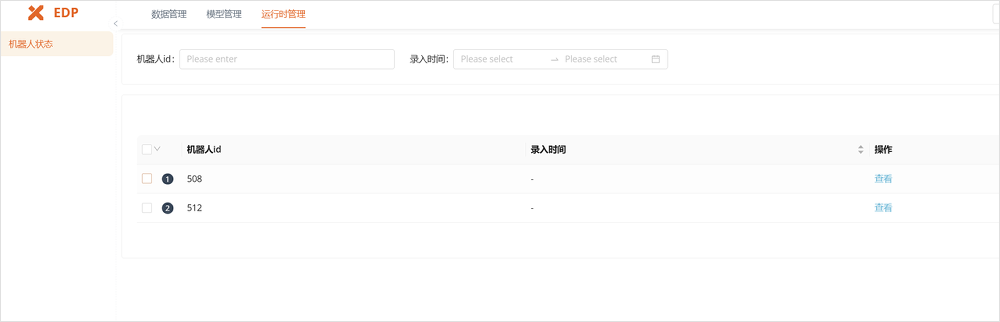

2. Select the corresponding robot ID to monitor topic status and other information.
   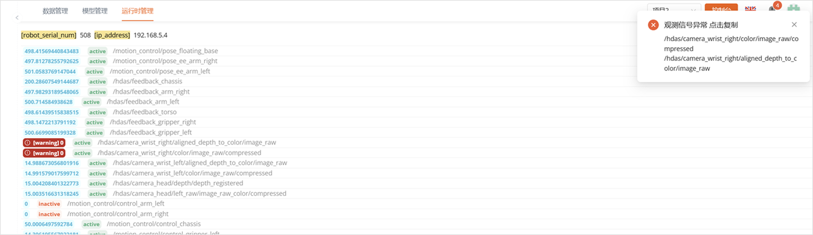

If you encounter any problems during the installation and startup process, please contact us promptly at support@galaxea.ai or call 4008-780-980 for technical support!