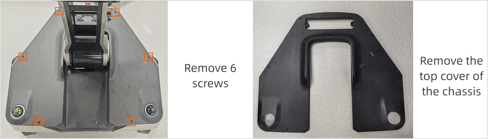
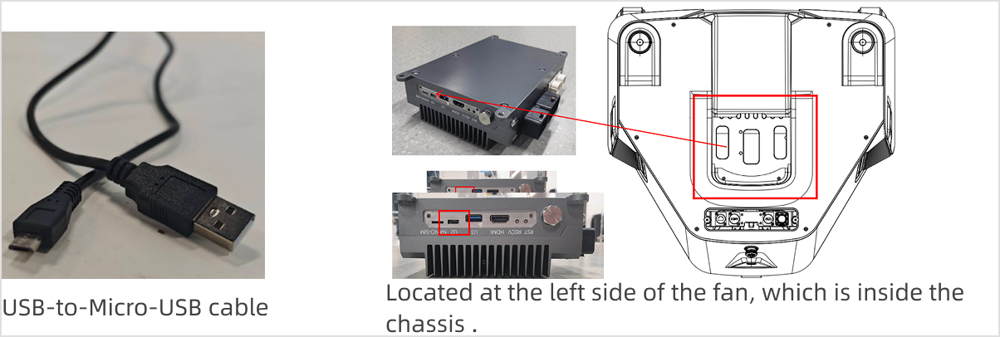
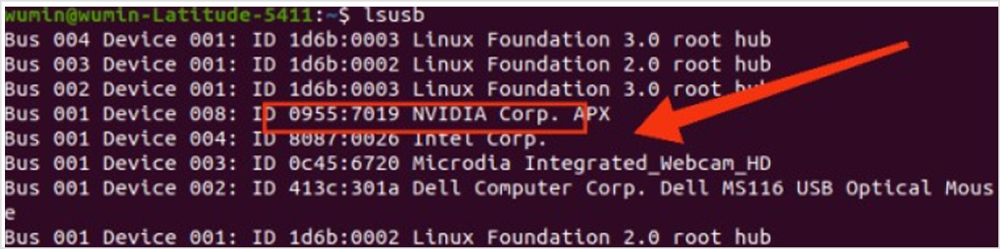
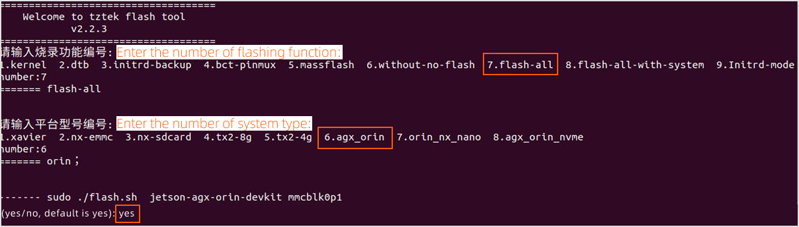
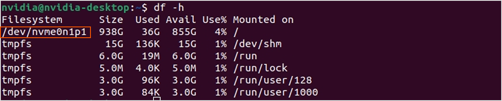

# ROS2 Upgrade Guide
> This section outlines the detailed procedures for upgrading from ROS1 to ROS2 on robot, covering a complete ROS2 system and robot SDK software dependency installation.

## Version Info

- JetPack: 6.0
- OS: Ubuntu 22.04
- Robot OS: ROS2 Humble

## 1. Before you start
### 1.1 Hardware Preparation
<table style="width: 100%; border-collapse: collapse;">
    <thead>
        <tr style="background-color: black; color: white; text-align: left;">
            <th style="width: 300px; padding: 8px; border: 1px solid #ddd;">Item</th>
            <th style="width: 200px; padding: 8px; border: 1px solid #ddd;">Quantity</th>
            <th style="width: 400px; padding: 8px; border: 1px solid #ddd;">Note</th>
        </tr>
    </thead>
    <tbody>
        <tr style="background-color: white; text-align: left;">
            <td style="padding: 8px; border: 1px solid #ddd;">Computer</td>
            <td style="padding: 8px; border: 1px solid #ddd;">1</td>
            <td style="padding: 8px; border: 1px solid #ddd;">OS: Ubuntu 20.04，x86<br>Environment: Python<br>Disk Space: Reserve at least 110G</td>
        </tr>
        <tr style="background-color: white; text-align: left;">
            <td style="padding: 8px; border: 1px solid #ddd;">USB-to-Micro-USB Cable</td>
            <td style="padding: 8px; border: 1px solid #ddd;">1</td>
            <td style="padding: 8px; border: 1px solid #ddd;">Used to connect the machine to the computer for flashing.</td>
        </tr>
        <tr style="background-color: white; text-align: left;">
            <td style="padding: 8px; border: 1px solid #ddd;">Ethernet Cable</td>
            <td style="padding: 8px; border: 1px solid #ddd;">1</td>
            <td style="padding: 8px; border: 1px solid #ddd;">Used to connect the host computer and robot.</td>
        </tr>
        <tr style="background-color: white; text-align: left;">
            <td style="padding: 8px; border: 1px solid #ddd;">L-hex Key</td>
            <td style="padding: 8px; border: 1px solid #ddd;">1</td>
            <td style="padding: 8px; border: 1px solid #ddd;">Used to remove the machine chassis screws.</td>
        </tr>
    </tbody>
</table>

<span style="color:red;">**Note:**</span>

1. <span style="color:red;">It's recommended to use Ubuntu 20.04 for flashing. Other versions may cause flashing abnormalities.</span>
2. <span style="color:red;">It's advised to disable the computer's firewall before flashing to avoid errors.</span>

Run the following command on the host to set up the Python environment:
```Bash
sudo apt install python3
```

### 1.2 Software preparations
Visit the following links to download the required resouces.

- Google Cloud: [ROS2 Upgrade Resources](https://drive.google.com/drive/folders/1it93gjL04eEj1ruAoGWRckGS6Q3ycgIt?usp=sharing)
- Baidu Cloud:  [ROS2 Upgrade Resources](https://pan.baidu.com/s/1StcwZWdzdwKeXJvXYBMTtA?pwd=ros2)

<span style="color:red;">**It's recommended to download all files to the path `~/Downloads/ROS2_software_flashing_tool`.**</span>

## 2. Cable Connection
### 2.1 Remove the chassis cover
Power off the robot, use an L-hex key to remove the 6 screws fixing the chassis cover, then take off the cover.


### 2.2 Connect the cable
Use a USB-to-Micro-USB cable. Connect the Micro-USB end to the ECU's U2 port (the ECU is inside the center of the chassis. It's recommended to route the cable through the gap near the left-side fan to connect to the port). Plug the USB end into the host computer.


## 3. Software Flashing Procedure
### 3.1 SSH Connection
Enter the following command in the host terminal to connect to the robot Orin:
```Bash
ssh nvidia@IP address
# password (default): nvidia
```

### 3.2 Enter flashing mode
Execute the following command on the host to reboot the machine into flashing mode:
```Bash
sudo reboot --force forced-recovery
```

### 3.3 Check device mounting
Execute the following command multiple times in the host terminal to check if the Nvidia Crop serial device appears after the USB cable is connected and the machine is rebooted. 
```Bash
lsusb
```

If it shows as in the figure below, the machine has entered flashing mode successfully.


### 3.4 Extract system image files
Download the file and enter the image file path.
```Bash
# Recommended download path:
cd /home/$USER/Downloads/ROS2_software_flashing_tool
```

Extract the `flashtool`.
```Bash
tar -xpf flashtool_tztek_geac_orin_jp6.0.0_GA_GEACX1_R3.0_Kv6.0.3_1126.tar.bz2

# As the tool directory name is too long, rename it to "flashtool"
mv flashtool_tztek_geac_orin_jp6.0.0_GA_GEACX1_R3.0_Kv6.0.3_1126 flashtool
```

Extract the image file `system.img.raw` (reserve at least 110G of disk space):
```Bash
tar -xpf XingHaiTu-system-20250510.tar.gz
```

### 3.5 Mount system image
Mount the `system.img.raw` to the specified path: `{your_flashing_file_path}`:
```Bash
sudo mount system.img.raw /home/$USER/Downloads/ROS2_software_flashing_tool/flashtool/Linux_for_Tegra/rootfs
```

### 3.6 Install flashing runtime dependencies

```Bash
# For the first-time image flashing, install first:
sudo apt install qemu-user-static -y
sudo ./flashtool/Linux_for_Tegra/tools/l4t_flash_prerequisites.sh

# If you encounter the error like “E: Unable to acquire the lock /var/lib/apt/lists/lock. The lock is held by process xx_pid (packagekitd)”, run the following command first, then execute the above commands:
    # kill -9 xx_pid 
```

### 3.7 Update drivers
Before flashing, be sure to update the `initrd` drivers:
```Bash
cd flashtool/Linux_for_Tegra
sudo ./tools/l4t_update_initrd.sh 
```

Temporarily disable new USB device insertion:
```Bash
systemctl stop udisks2.service
```

### 3.8 Run flashing script
<span style="color:red;">Note: The entire flashing process is expected to take 30~40 minutes. Do not unplug the Micro-USB cable during this period. After flashing is complete, the system will automatically boot.</span>

```Bash
sudo ./tztek_flash.sh 

# Enter “7” (flash_all) when prompted for the flashing function number;
# Enter “6” (agx_orin) when prompted for the platform model number;
# Enter “yes” and press “Enter” to confirm flashing and start the process.
```



## 4. Kernel Upgrade
### 4.1 Obtain robot IP address
Connect the network cable to the chassis external Ethernet port. Run the following command multiple times to get the local LAN IP address shared by the computer with the robot device:
```Bash
arp -a
```

On the host terminal, execute the following commands:
```Bash
cd /home/$USER/Downloads/ROS2_software_flashing_tool
scp tztek-jetson-tool-eeprom-info-v1.1.deb nvidia@<ecu-ip>:~/
```

On the robot ECU's SSH terminal, execute the following commands:
```Bash
sudo dpkg -i tztek-jetson-tool-eeprom-info-v1.1.deb

# Check the ECU mainboard model: r2.1 or r3.0
sudo tztek-jetson-tool-eeprom-info -a
```

### 4.2 Copy kernel installation package
Execute the following commands on the local terminal to copy the kernel installation package to the robot:
```Bash
# If the ECU mainboard model is r2.1:
scp tztek-jetson-firmware-kernel-dtb-510jx0-r2.1-jp6.0.0-v6.0.3.deb nvidia@<ecu-ip>:~/

# If the ECU mainboard model is r3.0:
scp tztek-jetson-firmware-kernel-dtb-510jx0-r3.0-jp6.0.0-v6.0.3.deb nvidia@<ecu-ip>:~/
```

### 4.3 Install new kernel
On the robot ECU's SSH terminal, execute the following commands to copy the kernel installation package to the robot.

<span style="color:red;">Note: Kernel installation may take a long time. Do not interrupt the process.</span>

```Bash
# If the ECU mainboard model is r2.1:
sudo dpkg -i ~/tztek-jetson-firmware-kernel-dtb-510jx0-r2.1-jp6.0.0-v6.0.3.deb

# If the ECU mainboard model is r3.0:
sudo dpkg -i ~/tztek-jetson-firmware-kernel-dtb-510jx0-r3.0-jp6.0.0-v6.0.3.deb

# Enable the new kernel:
sudo tztek-jetson-firmware-kernel-dtb-510jx0

# Reboot by entering the following command or via the power button:
sudo reboot
```

### 4.4 Check kernel info
On the robot ECU's SSH terminal, execute the following command:
```Bash
cat /proc/version
```

## 5. Copy System to SSD
After system flashing is complete, enter the EMMC system environment and run the following commands to copy the system to the SSD. (If users do not need to install the system on the ECU's SSD and only want to mount the SSD as a data disk, the subsequent operations are not required.)
```Bash
# Update kernel:
sudo tztek-jetson-firmware-kernel-dtb-510jx0
sudo tztek-jetson-system-migration-GA
## Enter “1”
```

<span style="color:red;">Note: The entire process is expected to take 5~10 minutes. Please wait patiently and do not terminate or perform other operations midway.
</span>

After the system is copied to the SSD, reboot the ECU to enter the SSD system environment. Execute the following command to check if the system environment is correct:
```Bash
df -h
```


Thus, the ROS2 upgrade flashing is completed, with ROS2 system, radar, camera, and robot body SDK modules and related dependencies all installed.

## FAQ