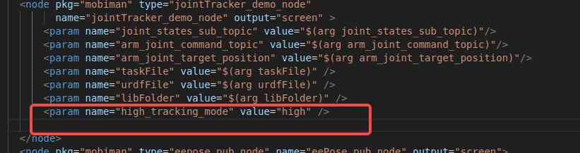

# Galaxea A1 常见问题
> 本页面汇集了Galaxea A1机械臂的常见问题解答。无论您是初学者还是资深开发者，都能在此找到实用信息，助您快速解决技术难题，提升机械臂的使用与开发效率。

## 1. 为什么机械臂A1没有达到设定的目标位置？
该情况属于正常，可能的原因如下：

1. 当前您设定的目标点是一个实际难以达到的位置，在这种情况下机器会收敛到与之距离较近的可实现的点位。
2. 可能是MPC收敛方向错了，导致收敛不到目标点，而是停在了当前的局部最优解。建议通过一定的规划后跟踪，避免直接给一个较远的目标点。

## 2. 如何复现机械臂A1的末端最大加速度？
关于复现机械臂末端最大加速度的需求，您可以参考以下步骤完成相关操作。

同时，为了确保操作的安全性，请您务必注意以下事项：

- 确保机械臂工作区域内无人员、障碍物或其他设备，避免碰撞风险。
- 检查机械臂的安装是否稳固，底座和连接件是否牢固。
- 严格按照文档中的参数范围设置加速度和速度，避免超限运行。
- 在测试过程中，始终保持对机械臂的监控，一旦发现异常，立即按下紧急停止按钮。
- 请注意，复现机械臂末端最大加速度可能涉及高风险操作。我们强烈建议您在充分理解相关风险并采取适当防护措施的前提下进行测试。对于因未遵循安全规范而导致的任何损失或伤害，我们将不承担相关责任。

复现步骤如下：

1. 进入以下目录：
    ```Bash
    cd install/share/mobiman/launch/simpleExample
    ```

2. 打开以下文件：`vim jointTrackerdemo.launch`
    ```Bash
    vim jointTrackerdemo.launch
    ```

3. 添加以下代码到对应位置：
    ```Bash
    <param name="high_tracking_mode" value="high" />
    ```

    
    保存后退出运行即可。

4. Demo操作完成后，为了您的安全考虑，删除第三步所添加的代码块，还原至初始设置。

## 3. 哪里可以下载机械臂末端夹爪的手指STP文件？
您好，夹爪手指的.stp文件您可以在我们的GitHub开源社区下载。

下载链接为：[Finger_GEN2.stp](https://github.com/userguide-galaxea/STP/blob/main/G1/Finger_GEN2.stp)