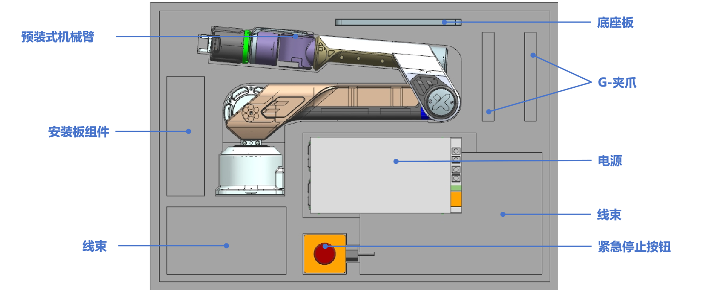

# 快速入门指南
> 欢迎加入 Galaxea 开发者大家庭，成为 Galaxea A1 的用户！本文档将助您了解 Galaxea A1 的基础使用介绍和安全声明，介绍产品基本部件的使用。

## 产品介绍
[Galaxea A1](../../Introducing_Galaxea_Robot/product_info/A1.md) 是一款集高精度、智能化于一体的先进机械臂，专为满足多样化的工业与创新应用需求而设计。它具备灵活的操作模式、强大的负载能力以及高度的编程兼容性，无论是工业生产线上的精密装配，还是科研实验中的自动化操作，亦或是教育领域的创新实践，Galaxea A1 都能以其卓越性能为您提供强大支持。

## 安全须知
在开始使用 Galaxea A1 之前，请务必仔细阅读以下安全说明，以确保您及周围人员的安全，同时保障设备的正常运行与长久使用寿命。
### 操作安全
- 资质要求 ：操作人员需接受专业培训，熟悉机械臂的操作流程、安全规范以及应急处理措施，确保具备正确、安全操作设备的能力。
- 操作环境 ：为机械臂提供符合要求的工作空间，确保周围无易燃易爆物品、强磁场干扰源等潜在危险因素，且环境整洁、干燥，避免因环境问题引发设备故障或安全事故。
- 操作规范 ：严格按照操作手册规定的步骤和方法进行操作，禁止在设备运行过程中进行任何违规操作，如随意触碰正在运动的部件、擅自调整关键参数等，以免造成设备损坏或人员伤害。
### 设备安全
- 电源安全 ：使用符合设备要求的电源适配器，确保电源电压稳定在规定的范围内（48V），避免因电压波动导致设备损坏。同时，定期检查电源线及相关连接部位，确保其完好无损，连接牢固。
- 紧急停止 ：熟悉紧急停止按钮的位置和使用方法，在遇到突发紧急情况（如机械臂失控、人员碰撞等）时，能够迅速按下紧急停止按钮，立即切断电源，确保安全。

## 开箱检查
打开包装盒后，请仔细检查以下物品是否齐全：

<table style="width: 100%; border-collapse: collapse;">
    <thead>
        <tr style="background-color: black; color: white; text-align: left;">
            <th style="width: 220px; padding: 8px; border: 1px solid #ddd;">物品</th>
            <th style="width: 180px; padding: 8px; border: 1px solid #ddd;">数量</th>
            <th style="width: 400px; padding: 8px; border: 1px solid #ddd;">说明</th>
        </tr>
    </thead>
    <tbody>
        <tr style="background-color: white; text-align: left;">
            <td style="padding: 8px; border: 1px solid #ddd;">机械臂本体</td>
            <td style="padding: 8px; border: 1px solid #ddd;">1</td>
            <td style="padding: 8px; border: 1px solid #ddd;">机械臂的所有组件都已预组装完成，确保设置过程简单直接。</td>
        </tr>
        <tr style="background-color: white; text-align: left;">
            <td style="padding: 8px; border: 1px solid #ddd;">电源</td>
            <td style="padding: 8px; border: 1px solid #ddd;">1</td>
            <td style="padding: 8px; border: 1px solid #ddd;">为机械臂提供所需的电能。</td>
        </tr>
        <tr style="background-color: white; text-align: left;">
            <td style="padding: 8px; border: 1px solid #ddd;">紧急停止按钮</td>
            <td style="padding: 8px; border: 1px solid #ddd;">1</td>
            <td style="padding: 8px; border: 1px solid #ddd;">用于紧急情况下立即切断电源。</td>
        </tr>
        <tr style="background-color: white; text-align: left;">
            <td style="padding: 8px; border: 1px solid #ddd;">电源线</td>
            <td style="padding: 8px; border: 1px solid #ddd;">1</td>
            <td style="padding: 8px; border: 1px solid #ddd;">用于将电源连接到机械臂。</td>
        </tr>
        <tr style="background-color: white; text-align: left;">
            <td style="padding: 8px; border: 1px solid #ddd;">USB线</td>
            <td style="padding: 8px; border: 1px solid #ddd;">1</td>
            <td style="padding: 8px; border: 1px solid #ddd;">用于将机械臂控制端连接到带有USB 2.0端口的电脑。</td>
        </tr>
        <tr style="background-color: white; text-align: left;">
            <td style="padding: 8px; border: 1px solid #ddd;">洞洞板</td>
            <td style="padding: 8px; border: 1px solid #ddd;">1</td>
            <td style="padding: 8px; border: 1px solid #ddd;">用于固定机械臂至表面上。</td>
        </tr>
        <tr style="background-color: white; text-align: left;">
            <td style="padding: 8px; border: 1px solid #ddd;">G夹</td>
            <td style="padding: 8px; border: 1px solid #ddd;">2</td>
            <td style="padding: 8px; border: 1px solid #ddd;">G型紧固件，用于将桌面固在桌面上。</td>
        </tr>
        <tr style="background-color: white; text-align: left;">
            <td style="padding: 8px; border: 1px solid #ddd;">安装板螺丝M6</td>
            <td style="padding: 8px; border: 1px solid #ddd;">4</td>
            <td style="padding: 8px; border: 1px solid #ddd;">用于固定机械臂底座至洞洞板上。</td>
        </tr>
    </tbody>
</table>

## 安装步骤
### 准备工作
1. 选择合适的安装平台，确保平台平整、稳固，能够承受机械臂在运行过程中的最大负载。
2. 清洁安装平台表面，去除杂物、灰尘等可能影响安装稳定性的物质，保证安装底座板与平台之间的紧密贴合。

### 安装过程
1. 将洞洞板放置在选定的安装平台或桌面上，确保其位置合适，便于后续的固定操作。
2. 使用G夹将洞洞板固定在安装平台或桌面上。
3. 将机械臂小心地放置在安装底座板上，确保机械臂的底座与洞洞板的孔位准确对接，使用M6螺丝固定机械臂。

## 开启电源
将电源适配器电缆线的一端插入机械臂底座上的电源端口，另一端连接到电源，确保电压为 48V。

接通电源后，机械臂将进行初始化自检程序，请耐心等待，直至设备完成自检并进入待机状态，此时您可以开始进行操作设置。

## 关闭电源
当机械臂和控制系统完全停止时，您只需拔下电源线即可关闭 Galaxea A1。但请注意，在当前版本的 Galaxea A1 中，电机没有制动器，因此切断电源可能会导致机械臂突然掉落，所以在操作过程中务必确保周围环境安全，避免因机械臂掉落造成意外伤害或设备损坏。

## 紧急停止
紧急停止开关（E-Stop）可在紧急情况下立即切断电源。

按下 E-Stop 按钮将立即断开机械臂的电源，确保操作人员的安全并防止设备损坏。

## 获取帮助
如果您在使用 Galaxea A1 的过程中遇到任何问题，需要立即帮助，请通过<a href="mailto:support@galaxea.ai">support@galaxea.ai</a>.与我们联系。我们的专业技术支持团队将竭诚为您提供帮助，解答您的疑问，并协助您解决各种技术难题。

## 下一步
Galaxea A1的快速入门之旅到这里就结束啦！为了更好的使用机械臂，我们建议您继续探索[Galaxea A1硬件用户指南](./Hardware_Guide.md)和[Galaxea A1软件用户指南](./Software_Guide.md)。我们提供了大量信息和实际示例，指导您轻松地进行开发应用。